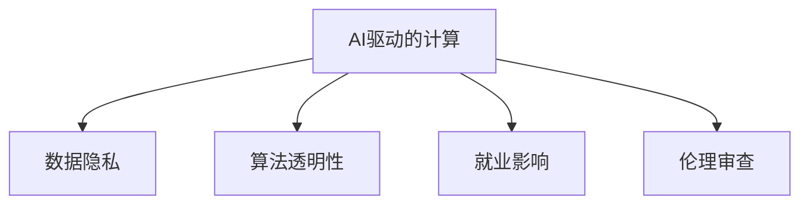

                 

# AI驱动的创新：人类计算在商业中的道德考虑因素与应用前景

## 1. 背景介绍

### 1.1 问题由来
随着人工智能(AI)技术的飞速发展，人类计算在商业中的运用日益广泛。AI驱动的创新不仅提高了企业运营效率，降低了成本，还开辟了新的商业模式。然而，伴随而来的是对人类计算及其商业应用中道德问题的深入思考。

### 1.2 问题核心关键点
人工智能的道德问题涉及到技术、伦理、法律、社会等多个层面，尤其是在数据隐私、算法透明、就业影响等方面。如何平衡创新与道德，确保AI驱动的计算能够造福社会，成为当下亟需解决的问题。

### 1.3 问题研究意义
深入研究AI驱动的计算在商业中的道德考虑因素，不仅有助于制定合理的政策法规，确保AI技术的健康发展，还能引导企业和社会更好地应用AI技术，实现可持续的商业创新。

## 2. 核心概念与联系

### 2.1 核心概念概述

为更好地理解AI驱动的计算及其商业应用中的道德问题，本节将介绍几个密切相关的核心概念：

- AI驱动的计算：利用人工智能技术，进行自动化、智能化处理，提升商业运营效率。
- 数据隐私：指个人数据的收集、存储、使用过程中的隐私保护问题，是AI伦理的重要组成部分。
- 算法透明性：指AI模型决策过程的可解释性和可理解性，避免“黑箱”决策带来的不信任。
- 就业影响：AI技术的发展可能对劳动市场产生影响，如自动化替代人力、就业结构变化等。
- 伦理审查：通过建立伦理审查机制，监督AI技术的应用，确保其符合道德标准和社会价值观。

这些核心概念之间的逻辑关系可以通过以下Mermaid流程图来展示：



这个流程图展示了大语言模型的核心概念及其之间的关系：

1. AI驱动的计算通过数据隐私、算法透明性、就业影响等关键环节，实现对企业运营的全面支持。
2. 数据隐私保护、算法透明性提升等措施，保证了AI技术的可持续应用。
3. 就业影响关注、伦理审查等机制，确保AI技术的应用符合社会价值观和道德标准。

这些概念共同构成了AI驱动的计算及其商业应用的伦理框架，确保AI技术在推动商业创新的同时，能够造福社会，避免潜在风险。

## 3. 核心算法原理 & 具体操作步骤
### 3.1 算法原理概述

AI驱动的计算原理主要基于机器学习和深度学习的模型训练过程，通过大量标注数据训练出能够自动完成特定任务的模型。这些模型在商业应用中，可以进行自动化决策、预测、推荐等操作，提升商业运营效率和客户体验。

### 3.2 算法步骤详解

AI驱动的计算一般包括以下几个关键步骤：

**Step 1: 数据收集与处理**
- 收集与业务相关的数据，如用户行为数据、交易记录、市场情报等。
- 清洗数据，去除噪声、填补缺失值，处理异常数据。

**Step 2: 模型选择与训练**
- 选择适合的机器学习或深度学习模型，如线性回归、随机森林、神经网络等。
- 在标注数据集上，通过交叉验证等方法进行模型训练，选择性能最优的模型。

**Step 3: 模型评估与优化**
- 使用测试数据集对模型进行评估，选择泛化性能最佳的模型。
- 调整模型参数，优化模型结构，提升模型的泛化能力和鲁棒性。

**Step 4: 模型部署与监控**
- 将训练好的模型部署到生产环境，集成到商业系统中。
- 实时监控模型性能，根据业务需求和数据变化，进行模型更新和优化。

**Step 5: 业务集成与迭代**
- 将AI驱动的计算嵌入到企业业务流程中，实现自动化决策、智能推荐等功能。
- 持续收集反馈数据，迭代模型，优化算法，不断提升AI系统的表现。

以上是AI驱动的计算的一般流程。在实际应用中，还需要针对具体业务场景，对上述各个环节进行优化设计，如数据采集策略、特征工程方法、模型评估指标等，以进一步提升AI系统的性能和业务价值。

### 3.3 算法优缺点

AI驱动的计算方法具有以下优点：
1. 自动化决策：AI系统可以自动完成复杂的决策过程，减少人为干预，提高决策效率。
2. 精准预测：利用大量历史数据进行训练，AI模型能够实现高精度的预测和推荐，提升客户满意度。
3. 实时响应：AI系统能够实时处理和反馈信息，及时响应市场变化，增强商业竞争力。
4. 成本效益：通过自动化和智能化处理，AI驱动的计算能够显著降低企业运营成本，提高盈利能力。

同时，该方法也存在一定的局限性：
1. 数据依赖性：AI驱动的计算高度依赖于标注数据的质量和数量，数据偏差可能导致模型输出偏差。
2. 模型复杂性：复杂的AI模型训练和部署需要大量计算资源和时间，难以快速迭代。
3. 透明性不足：黑箱模型缺乏可解释性，难以理解其决策逻辑，导致用户不信任。
4. 就业冲击：自动化替代人力可能导致部分岗位消失，对就业市场造成冲击。
5. 法律风险：不当使用AI技术可能涉及隐私泄露、歧视性决策等法律问题。

尽管存在这些局限性，但就目前而言，AI驱动的计算方法仍是推动商业创新和提升运营效率的重要手段。未来相关研究的重点在于如何进一步降低数据依赖，提高模型的可解释性，保护数据隐私，避免就业冲击，确保法律合规等。

### 3.4 算法应用领域

AI驱动的计算方法在商业领域已经得到了广泛的应用，覆盖了各个层面，例如：

- 客户行为分析：通过用户行为数据，预测客户购买意愿，优化营销策略。
- 供应链管理：自动化处理订单、库存、物流等，提升供应链效率。
- 金融风险控制：利用历史数据进行风险预测和评估，降低金融风险。
- 智能客服：自动回答客户咨询，提升客户服务体验。
- 个性化推荐：根据用户偏好，推荐个性化商品和服务，提升用户体验。
- 市场情报分析：实时监控市场变化，提供决策支持。

除了上述这些经典应用外，AI驱动的计算还在更多场景中得到创新性应用，如智能制造、智慧城市、医疗健康等，为商业领域带来了新的变革。

## 4. 数学模型和公式 & 详细讲解  
### 4.1 数学模型构建

本节将使用数学语言对AI驱动的计算过程进行更加严格的刻画。

设输入特征为 $x \in \mathcal{X}$，输出标签为 $y \in \mathcal{Y}$，数据集为 $\{(x_i, y_i)\}_{i=1}^N$。假设选择一个神经网络模型 $f_{\theta}(x)$ 进行训练，其中 $\theta$ 为模型参数。训练目标为最小化经验风险：

$$
\min_{\theta} \frac{1}{N} \sum_{i=1}^N L(f_{\theta}(x_i), y_i)
$$

其中 $L$ 为损失函数，常用的有均方误差、交叉熵损失等。

在训练过程中，通过反向传播算法计算损失函数的梯度，使用优化算法（如随机梯度下降）更新模型参数，直至收敛。

### 4.2 公式推导过程

以线性回归模型为例，推导最小二乘法的数学原理：

假设线性模型为 $y = \theta_0 + \theta_1 x_1 + \theta_2 x_2 + \cdots + \theta_k x_k + \epsilon$，其中 $\epsilon$ 为误差项，$\theta_0, \theta_1, \cdots, \theta_k$ 为待求参数。

最小二乘法的目标是最小化样本点与模型输出的误差平方和：

$$
\min_{\theta} \sum_{i=1}^N (y_i - (\theta_0 + \theta_1 x_{i,1} + \theta_2 x_{i,2} + \cdots + \theta_k x_{i,k}))^2
$$

对上述目标函数求偏导，得：

$$
\frac{\partial}{\partial \theta_j} \sum_{i=1}^N (y_i - \sum_{k=0}^k \theta_k x_{i,k})^2 = -2\sum_{i=1}^N (y_i - \sum_{k=0}^k \theta_k x_{i,k}) x_{i,j}, \quad j=0,1,\cdots,k
$$

令导数为0，解得：

$$
\theta_j = \frac{1}{N} \sum_{i=1}^N (y_i - \bar{y}) x_{i,j} / \sum_{i=1}^N x_{i,j}^2, \quad j=0,1,\cdots,k
$$

其中 $\bar{y} = \frac{1}{N} \sum_{i=1}^N y_i$。

通过求解上述方程，得到模型参数 $\theta_j$，进而得到线性回归模型 $f_{\theta}(x)$。

### 4.3 案例分析与讲解

以智能推荐系统为例，分析如何利用AI驱动的计算进行用户行为预测和个性化推荐：

假设推荐系统包含 $K$ 个物品，用户的评分矩阵为 $R_{ij}$，其中 $R_{ij} = 1$ 表示用户 $i$ 对物品 $j$ 有正面评分，$R_{ij} = 0$ 表示用户 $i$ 对物品 $j$ 有负面评分，$R_{ij} = -1$ 表示用户 $i$ 未对物品 $j$ 进行评分。

推荐系统使用深度学习模型 $f_{\theta}(x)$ 进行预测，其中 $x$ 为用户的评分向量，$f_{\theta}(x)$ 的输出为物品 $j$ 的预测评分 $r_{ij}$。

推荐系统通过最小化均方误差损失进行训练：

$$
\min_{\theta} \sum_{i=1}^M \sum_{j=1}^K (r_{ij} - f_{\theta}(x_i))^2
$$

其中 $M$ 为用户的数量，$K$ 为物品的数量。

在训练过程中，通过反向传播算法计算梯度，使用优化算法（如Adam、SGD等）更新模型参数 $\theta$。通过迭代训练，得到预测模型 $f_{\theta}(x)$，用于生成推荐列表。

推荐系统的实际应用流程如下：

1. 收集用户评分数据和物品信息，构建评分矩阵 $R$。
2. 选择适合的深度学习模型，如FM、MLP、GRU等，进行训练。
3. 使用训练好的模型，对用户 $i$ 生成物品 $j$ 的预测评分 $r_{ij}$。
4. 根据预测评分，对物品进行排序，生成推荐列表。
5. 在实际推荐系统中，实时接收用户评分和物品信息，进行动态更新和优化。

推荐系统通过AI驱动的计算，能够实现高效的用户行为预测和个性化推荐，提升用户体验和运营效率。

## 5. 项目实践：代码实例和详细解释说明
### 5.1 开发环境搭建

在进行AI驱动的计算实践前，我们需要准备好开发环境。以下是使用Python进行PyTorch开发的环境配置流程：

1. 安装Anaconda：从官网下载并安装Anaconda，用于创建独立的Python环境。

2. 创建并激活虚拟环境：
```bash
conda create -n pytorch-env python=3.8 
conda activate pytorch-env
```

3. 安装PyTorch：根据CUDA版本，从官网获取对应的安装命令。例如：
```bash
conda install pytorch torchvision torchaudio cudatoolkit=11.1 -c pytorch -c conda-forge
```

4. 安装TensorFlow：
```bash
pip install tensorflow
```

5. 安装各类工具包：
```bash
pip install numpy pandas scikit-learn matplotlib tqdm jupyter notebook ipython
```

完成上述步骤后，即可在`pytorch-env`环境中开始AI驱动的计算实践。

### 5.2 源代码详细实现

下面我们以智能推荐系统为例，给出使用Transformers库对模型进行训练的PyTorch代码实现。

首先，定义推荐系统的训练函数：

```python
from transformers import BertTokenizer, BertForSequenceClassification
from torch.utils.data import Dataset
from sklearn.model_selection import train_test_split
from torch.optim import Adam
import torch

class RecommenderDataset(Dataset):
    def __init__(self, ratings, items, tokenizer):
        self.ratings = ratings
        self.items = items
        self.tokenizer = tokenizer
        
    def __len__(self):
        return len(self.ratings)
    
    def __getitem__(self, item):
        rating, item = self.ratings[item], self.items[item]
        
        tokenized_item = self.tokenizer(item)
        item_ids = torch.tensor(tokenized_item['input_ids'], dtype=torch.long)
        return {'item_ids': item_ids, 
                'rating': rating}

# 创建dataset
tokenizer = BertTokenizer.from_pretrained('bert-base-cased')
ratings = # 评分数据
items = # 物品列表

train_dataset, test_dataset = train_test_split(ratings, test_size=0.2)

# 模型构建
model = BertForSequenceClassification.from_pretrained('bert-base-cased', num_labels=5)
optimizer = Adam(model.parameters(), lr=2e-5)

# 训练模型
device = torch.device('cuda') if torch.cuda.is_available() else torch.device('cpu')
model.to(device)
for epoch in range(10):
    for batch in train_dataset:
        item_ids = batch['item_ids'].to(device)
        rating = batch['rating'].to(device)
        
        outputs = model(item_ids)
        loss = outputs.loss
        loss.backward()
        optimizer.step()

    evaluate(test_dataset)

```

然后，定义模型评估函数：

```python
def evaluate(dataset, batch_size):
    dataloader = DataLoader(dataset, batch_size=batch_size, shuffle=False)
    model.eval()
    total_loss = 0
    for batch in dataloader:
        item_ids = batch['item_ids'].to(device)
        rating = batch['rating'].to(device)
        outputs = model(item_ids)
        loss = outputs.loss
        total_loss += loss.item()
    return total_loss / len(dataset)

```

最后，启动训练流程并在测试集上评估：

```python
# 运行训练
model.train()
for epoch in range(10):
    for batch in train_dataset:
        item_ids = batch['item_ids'].to(device)
        rating = batch['rating'].to(device)
        
        outputs = model(item_ids)
        loss = outputs.loss
        loss.backward()
        optimizer.step()

    evaluate(test_dataset)

```

以上就是使用PyTorch对模型进行智能推荐系统训练的完整代码实现。可以看到，借助Transformers库的强大封装，AI驱动的计算实践变得简洁高效。

### 5.3 代码解读与分析

让我们再详细解读一下关键代码的实现细节：

**RecommenderDataset类**：
- `__init__`方法：初始化评分数据、物品列表和分词器。
- `__len__`方法：返回数据集的样本数量。
- `__getitem__`方法：对单个样本进行处理，将物品转换为token ids，返回模型所需的输入。

**模型构建与训练**：
- 使用BertForSequenceClassification模型进行构建。
- 定义Adam优化器，学习率为2e-5。
- 在训练过程中，每个epoch遍历训练集，更新模型参数，并在测试集上进行评估。

**训练流程**：
- 定义总的epoch数和batch size，开始循环迭代
- 每个epoch内，在训练集上进行前向传播和反向传播，更新模型参数。
- 在测试集上评估模型性能，给出每个epoch的平均loss。

**评估流程**：
- 定义测试集，使用Adam优化器评估模型性能。
- 计算每个epoch的平均loss，并给出最终评估结果。

可以看到，PyTorch配合Transformers库使得AI驱动的计算实践变得简洁高效。开发者可以将更多精力放在数据处理、模型改进等高层逻辑上，而不必过多关注底层的实现细节。

当然，工业级的系统实现还需考虑更多因素，如模型的保存和部署、超参数的自动搜索、更灵活的任务适配层等。但核心的训练范式基本与此类似。

## 6. 实际应用场景
### 6.1 智能客服系统

AI驱动的计算在智能客服系统中的应用，可以极大地提升客户服务的效率和质量。传统客服系统往往需要配备大量人力，高峰期响应缓慢，且服务质量难以保证。利用AI驱动的计算，可以构建7x24小时不间断服务的智能客服系统。

在技术实现上，可以收集企业的历史客服对话记录，将问题和最佳答复构建成监督数据，在此基础上对预训练语言模型进行微调。微调后的语言模型能够自动理解用户意图，匹配最合适的答案模板进行回复。对于客户提出的新问题，还可以接入检索系统实时搜索相关内容，动态组织生成回答。如此构建的智能客服系统，能大幅提升客户咨询体验和问题解决效率。

### 6.2 金融舆情监测

金融机构需要实时监测市场舆论动向，以便及时应对负面信息传播，规避金融风险。传统的人工监测方式成本高、效率低，难以应对网络时代海量信息爆发的挑战。利用AI驱动的计算，可以构建实时监测网络文本的金融舆情系统。

具体而言，可以收集金融领域相关的新闻、报道、评论等文本数据，并对其进行主题标注和情感标注。在此基础上对预训练语言模型进行微调，使其能够自动判断文本属于何种主题，情感倾向是正面、中性还是负面。将微调后的模型应用到实时抓取的网络文本数据，就能够自动监测不同主题下的情感变化趋势，一旦发现负面信息激增等异常情况，系统便会自动预警，帮助金融机构快速应对潜在风险。

### 6.3 个性化推荐系统

当前的推荐系统往往只依赖用户的历史行为数据进行物品推荐，无法深入理解用户的真实兴趣偏好。利用AI驱动的计算，可以构建基于用户行为和偏好的推荐系统。

在实践中，可以收集用户浏览、点击、评论、分享等行为数据，提取和用户交互的物品标题、描述、标签等文本内容。将文本内容作为模型输入，用户的后续行为（如是否点击、购买等）作为监督信号，在此基础上微调预训练语言模型。微调后的模型能够从文本内容中准确把握用户的兴趣点。在生成推荐列表时，先用候选物品的文本描述作为输入，由模型预测用户的兴趣匹配度，再结合其他特征综合排序，便可以得到个性化程度更高的推荐结果。

### 6.4 未来应用展望

随着AI驱动的计算方法不断发展，其在商业应用中的前景将更加广阔。

在智慧医疗领域，基于AI驱动的计算的医疗问答、病历分析、药物研发等应用将提升医疗服务的智能化水平，辅助医生诊疗，加速新药开发进程。

在智能教育领域，AI驱动的计算可应用于作业批改、学情分析、知识推荐等方面，因材施教，促进教育公平，提高教学质量。

在智慧城市治理中，AI驱动的计算可应用于城市事件监测、舆情分析、应急指挥等环节，提高城市管理的自动化和智能化水平，构建更安全、高效的未来城市。

此外，在企业生产、社会治理、文娱传媒等众多领域，基于AI驱动的计算的应用也将不断涌现，为NLP技术带来新的突破。相信随着技术的日益成熟，AI驱动的计算必将在更广阔的应用领域大放异彩，深刻影响人类的生产生活方式。

## 7. 工具和资源推荐
### 7.1 学习资源推荐

为了帮助开发者系统掌握AI驱动的计算的理论基础和实践技巧，这里推荐一些优质的学习资源：

1. 《Deep Learning》系列书籍：Ian Goodfellow等著，全面介绍了深度学习的基本概念和核心技术，是理解AI驱动计算的基石。
2. CS231n《深度学习视觉识别》课程：斯坦福大学开设的计算机视觉课程，涵盖图像处理、卷积神经网络等内容，是视觉领域深度学习的入门级课程。
3. CS224n《自然语言处理》课程：斯坦福大学开设的NLP课程，介绍了NLP的基本概念和核心技术，包括文本分类、机器翻译等任务。
4. Kaggle数据科学竞赛平台：提供了丰富的数据集和竞赛任务，可以实践和检验所学知识。
5. Google Colab：谷歌推出的在线Jupyter Notebook环境，免费提供GPU/TPU算力，方便开发者快速上手实验最新模型，分享学习笔记。

通过对这些资源的学习实践，相信你一定能够快速掌握AI驱动的计算的精髓，并用于解决实际的商业问题。
###  7.2 开发工具推荐

高效的开发离不开优秀的工具支持。以下是几款用于AI驱动的计算开发的常用工具：

1. PyTorch：基于Python的开源深度学习框架，灵活动态的计算图，适合快速迭代研究。大部分预训练语言模型都有PyTorch版本的实现。
2. TensorFlow：由Google主导开发的开源深度学习框架，生产部署方便，适合大规模工程应用。同样有丰富的预训练语言模型资源。
3. Transformers库：HuggingFace开发的NLP工具库，集成了众多SOTA语言模型，支持PyTorch和TensorFlow，是进行AI驱动计算任务的开发利器。
4. Weights & Biases：模型训练的实验跟踪工具，可以记录和可视化模型训练过程中的各项指标，方便对比和调优。与主流深度学习框架无缝集成。
5. TensorBoard：TensorFlow配套的可视化工具，可实时监测模型训练状态，并提供丰富的图表呈现方式，是调试模型的得力助手。
6. Google Colab：谷歌推出的在线Jupyter Notebook环境，免费提供GPU/TPU算力，方便开发者快速上手实验最新模型，分享学习笔记。

合理利用这些工具，可以显著提升AI驱动的计算的开发效率，加快创新迭代的步伐。

### 7.3 相关论文推荐

AI驱动的计算的发展源于学界的持续研究。以下是几篇奠基性的相关论文，推荐阅读：

1. 《ImageNet Classification with Deep Convolutional Neural Networks》：AlexNet模型，开启了深度学习在计算机视觉领域的应用。
2. 《BERT: Pre-training of Deep Bidirectional Transformers for Language Understanding》：BERT模型，提出预训练语言表示的新方法，推动了NLP领域的发展。
3. 《A Survey on Machine Learning Approaches to Recommender Systems》：综述了推荐系统中的机器学习方法，提供了深入的理论基础。
4. 《AI Ethics: What Should We Be Concerned About》：探讨了AI伦理的重要议题，提出了AI道德审查和监管的框架。

这些论文代表了大语言模型驱动的计算的发展脉络。通过学习这些前沿成果，可以帮助研究者把握学科前进方向，激发更多的创新灵感。

## 8. 总结：未来发展趋势与挑战
### 8.1 总结

本文对AI驱动的计算及其在商业应用中的道德考虑因素进行了全面系统的介绍。首先阐述了AI驱动的计算在商业运营中的广泛应用，明确了其对企业竞争力和运营效率的重要提升作用。其次，从伦理、法律、社会等角度，探讨了AI驱动的计算在实际应用中面临的道德挑战，包括数据隐私、算法透明性、就业影响等。

通过本文的系统梳理，可以看到，AI驱动的计算及其商业应用在推动企业创新和提升运营效率的同时，也带来了新的道德和法律问题。如何平衡创新与道德，确保AI技术的健康发展，是当前学界和产业界需要共同面对的挑战。

### 8.2 未来发展趋势

展望未来，AI驱动的计算及其商业应用将呈现以下几个发展趋势：

1. 模型规模持续增大。随着算力成本的下降和数据规模的扩张，预训练语言模型的参数量还将持续增长。超大规模语言模型蕴含的丰富语言知识，有望支撑更加复杂多变的商业运营。
2. 应用场景更加丰富。AI驱动的计算将在更多领域得到应用，如智慧医疗、智能教育、智慧城市等，为传统行业带来变革性影响。
3. 融合跨领域知识。AI驱动的计算将更多地与跨领域知识进行融合，如符号化的先验知识、多模态信息等，提升系统的综合性能。
4. 增强自动化决策能力。AI驱动的计算将进一步增强自动化决策能力，提升系统在商业运营中的决策效率和质量。

以上趋势凸显了AI驱动的计算的广阔前景。这些方向的探索发展，必将进一步提升AI系统的性能和业务价值，为商业创新提供新的动力。

### 8.3 面临的挑战

尽管AI驱动的计算在商业应用中取得了显著成效，但在迈向更加智能化、普适化应用的过程中，它仍面临着诸多挑战：

1. 数据隐私保护。如何保护用户数据隐私，防止数据泄露和滥用，是AI驱动的计算面临的重要挑战。
2. 算法透明性。黑箱模型缺乏可解释性，难以理解其决策逻辑，导致用户不信任。如何提高AI系统的透明度和可解释性，是亟需解决的问题。
3. 就业冲击。自动化替代人力可能导致部分岗位消失，对就业市场造成冲击。如何缓解AI驱动的计算对就业市场的影响，是产业界需要重点考虑的问题。
4. 法律风险。不当使用AI技术可能涉及隐私泄露、歧视性决策等法律问题。如何在应用AI技术的同时，确保法律合规，是重要的研究方向。
5. 伦理审查。如何建立伦理审查机制，监督AI技术的应用，确保其符合道德标准和社会价值观，是学界和产业界的重要课题。

这些挑战需要在技术、政策、法律、社会等多个层面进行协同解决。只有多方共同努力，才能确保AI驱动的计算的健康发展，实现可持续的商业创新。

### 8.4 研究展望

面对AI驱动的计算面临的挑战，未来的研究需要在以下几个方面寻求新的突破：

1. 发展无监督和半监督学习方法。摆脱对大规模标注数据的依赖，利用自监督学习、主动学习等无监督和半监督范式，最大限度利用非结构化数据，实现更加灵活高效的商业运营。
2. 研究模型压缩和加速技术。开发更加参数高效和计算高效的模型结构，减小模型规模，提高推理速度，优化资源占用。
3. 增强AI系统的透明度和可解释性。引入可解释性技术，如LIME、SHAP等，提升AI系统的可解释性和可理解性。
4. 构建伦理审查机制。建立伦理审查和监管机制，确保AI技术的健康发展，防止技术滥用。
5. 结合跨领域知识进行融合。将符号化的先验知识、多模态信息等与AI系统进行结合，提升系统的综合性能和应用范围。

这些研究方向的探索，必将引领AI驱动的计算及其商业应用进入新的阶段，推动AI技术在各个领域的深入应用，带来更广泛的商业创新和社会变革。

## 9. 附录：常见问题与解答

**Q1：AI驱动的计算在商业应用中是否面临道德问题？**

A: AI驱动的计算在商业应用中确实面临道德问题。这些问题主要涉及数据隐私、算法透明性、就业影响等方面。如何平衡创新与道德，确保AI技术的健康发展，是当前学界和产业界需要共同面对的挑战。

**Q2：如何进行AI驱动的计算的伦理审查？**

A: AI驱动的计算的伦理审查需要从数据收集、模型训练、应用部署等多个环节进行全面考虑。具体措施包括：

1. 数据隐私保护：确保数据采集和处理过程中的隐私保护，防止数据泄露和滥用。
2. 算法透明性：建立透明性评估机制，确保AI系统的决策过程可解释、可理解，避免“黑箱”决策。
3. 就业影响评估：评估AI技术对就业市场的影响，制定相应的就业保障措施。
4. 法律合规性审查：确保AI技术的应用符合相关法律法规，防止法律风险。

**Q3：AI驱动的计算在商业应用中如何避免数据偏见？**

A: AI驱动的计算在商业应用中避免数据偏见，可以从以下几个方面进行：

1. 数据多样化：确保数据采集和处理过程中的多样性，避免数据偏见。
2. 数据预处理：对数据进行预处理，去除噪声和异常值，提升数据质量。
3. 模型公平性：使用公平性评估指标，如FPR和FNR，优化模型性能，防止歧视性决策。
4. 伦理审查：建立伦理审查机制，监督AI技术的应用，防止偏见和歧视。

**Q4：AI驱动的计算在商业应用中如何实现持续学习？**

A: AI驱动的计算在商业应用中实现持续学习，可以从以下几个方面进行：

1. 在线学习：利用实时数据进行在线学习，更新模型参数，提升模型的泛化能力和鲁棒性。
2. 知识库融合：将跨领域知识、专家知识等与AI系统进行结合，提升系统的综合性能和应用范围。
3. 动态调整：根据业务需求和数据变化，动态调整模型参数，优化系统性能。

**Q5：AI驱动的计算在商业应用中如何提升用户体验？**

A: AI驱动的计算在商业应用中提升用户体验，可以从以下几个方面进行：

1. 个性化推荐：利用用户行为数据和偏好，生成个性化推荐内容，提升用户体验。
2. 智能客服：构建智能客服系统，实现自动回答用户咨询，提升服务效率和质量。
3. 实时监测：利用AI驱动的计算，实时监测用户行为和市场变化，提供实时决策支持。

**Q6：AI驱动的计算在商业应用中如何保障数据安全？**

A: AI驱动的计算在商业应用中保障数据安全，可以从以下几个方面进行：

1. 数据加密：对数据进行加密处理，防止数据泄露。
2. 访问控制：采用访问控制机制，限制数据的访问权限，确保数据安全。
3. 监控告警：实时监测数据访问和处理，设置异常告警阈值，防止数据滥用。

通过这些措施，可以有效保障AI驱动的计算在商业应用中的数据安全。

---

作者：禅与计算机程序设计艺术 / Zen and the Art of Computer Programming

