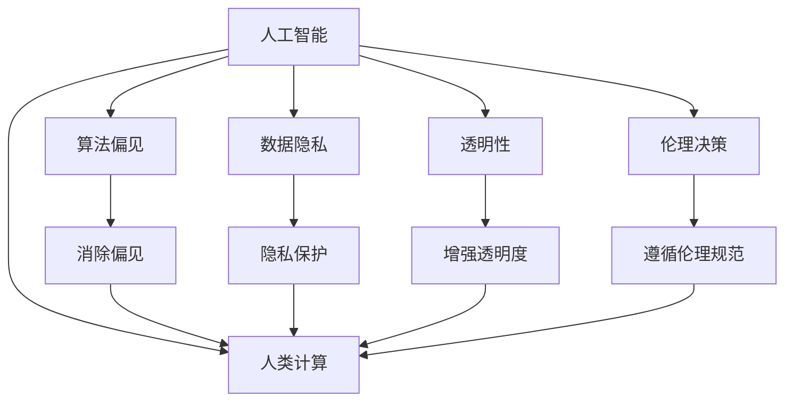

                 

# AI驱动的创新：人类计算在商业中的道德考虑因素总结展望

> 关键词：人工智能,人类计算,道德考虑,商业应用,伦理决策,公平性,透明性,隐私保护

## 1. 背景介绍

### 1.1 问题由来
随着人工智能技术的快速发展，人类计算在商业中的应用日益广泛，涵盖了从数据处理、决策支持到自动化流程等各个方面。AI驱动的创新不仅提高了商业效率，还创造了新的商业模式和价值链。然而，与此同时，AI技术的广泛应用也引发了一系列道德和伦理问题，如数据隐私、算法偏见、透明度等，这些问题直接关系到商业和社会的可持续发展。本文将全面探讨AI驱动创新在商业中的应用，并总结其在道德考虑上的关键因素和展望。

### 1.2 问题核心关键点
AI驱动的创新在商业中的应用主要涉及以下几个核心关键点：
- 数据隐私与保护：在数据驱动的商业决策中，如何保障用户隐私，避免数据滥用。
- 算法偏见与公平性：在自动化的决策过程中，如何确保算法的中立性，避免偏见和歧视。
- 透明度与可解释性：在复杂的数据和模型中，如何提高决策过程的透明度，使得结果可解释和可审计。
- 伦理决策与合规性：在AI驱动的商业创新中，如何制定并遵循伦理标准和合规规范，确保技术的负责任应用。

这些关键问题直接关系到AI技术在商业中的合法性和道德性，本文将详细探讨这些因素，并提出相应的解决策略。

### 1.3 问题研究意义
研究AI驱动的创新在商业中的道德考虑因素，对于确保技术应用的合法性和伦理性，保护用户权益，促进商业和社会可持续发展具有重要意义：

1. **保障用户隐私**：通过合规的数据处理和隐私保护措施，保障用户数据的安全，建立用户信任。
2. **提升决策公平性**：通过消除算法偏见，确保AI决策的公正性和公平性，避免对特定群体的歧视。
3. **增强透明度和可解释性**：通过提高决策过程的透明度，使得结果可解释和可审计，增强用户和监管机构的信任。
4. **遵循伦理规范**：通过制定和遵守伦理标准，确保AI技术的负责任应用，避免潜在的社会负面影响。

## 2. 核心概念与联系

### 2.1 核心概念概述

为了更好地理解AI驱动创新在商业中的应用及其道德考虑，本节将介绍几个关键概念：

- **人工智能（AI）**：通过模拟人类智能行为，实现自动化决策、数据处理、模式识别等功能。
- **人类计算（Human Computing）**：利用AI技术辅助人类进行复杂任务，提高工作效率和决策质量。
- **算法偏见（Algorithmic Bias）**：由于训练数据不均衡或模型设计缺陷导致算法在输出结果中存在歧视或偏见的状况。
- **数据隐私（Data Privacy）**：在数据处理和共享过程中，保障用户信息不被滥用或泄露的权利。
- **透明性（Transparency）**：AI系统的决策过程和规则可以被清晰理解和验证的程度。
- **伦理决策（Ethical Decision-Making）**：在商业应用中，遵循一定的伦理原则和标准，确保技术应用的道德性和合法性。

这些概念之间的逻辑关系可以通过以下Mermaid流程图来展示：



这个流程图展示了一系列关键概念及其在AI驱动创新中的应用，并通过消除偏见、保护隐私、增强透明度和遵循伦理规范等方式，确保AI技术的负责任应用。

## 3. 核心算法原理 & 具体操作步骤

### 3.1 算法原理概述

AI驱动的创新在商业中主要通过数据驱动的决策和自动化流程实现。这一过程通常包括以下几个关键步骤：

1. **数据采集与预处理**：从各类数据源中收集和清洗数据，为后续分析提供基础。
2. **模型训练与优化**：利用机器学习或深度学习技术，训练和优化模型，使其能够自动从数据中学习知识。
3. **决策与自动化**：将训练好的模型应用到实际业务场景中，进行数据处理、模式识别、决策支持等自动化任务。

AI驱动的创新在商业中的应用，通常依赖于大规模数据和复杂算法，这些算法往往需要大量的计算资源和专业知识，因此在实际操作中，需要特别关注其道德和伦理问题。

### 3.2 算法步骤详解

以数据驱动的商业决策为例，其核心步骤主要包括：

1. **数据收集**：从用户、市场、社交媒体等渠道收集相关数据，为决策提供依据。
2. **数据处理**：对收集的数据进行清洗、标注和转换，确保数据的质量和可用性。
3. **模型选择与训练**：根据业务需求选择合适的模型，如线性回归、决策树、深度神经网络等，并利用训练数据进行模型训练。
4. **结果评估与验证**：通过交叉验证、测试集评估等方法，评估模型的性能和泛化能力。
5. **模型部署与应用**：将训练好的模型部署到实际业务系统中，进行实时数据处理和决策支持。
6. **结果监控与优化**：持续监控模型输出结果，根据业务反馈进行模型优化和调整。

在每个步骤中，都需要特别关注数据的隐私保护、算法的公平性和透明度等问题。

### 3.3 算法优缺点

AI驱动的创新在商业中的应用具有以下优点：

1. **提高效率**：通过自动化和数据驱动的决策，显著提高了业务流程的效率和响应速度。
2. **增强决策质量**：利用数据驱动的方法，减少了人为错误和主观偏差，提升了决策的科学性和公正性。
3. **发现新机会**：通过数据分析，发现了潜在的商业机会和市场趋势，促进了业务创新。

同时，这一方法也存在以下缺点：

1. **数据隐私问题**：大规模数据收集和处理过程中，存在数据隐私泄露和滥用的风险。
2. **算法偏见**：由于数据和模型设计的不合理，可能导致算法在输出结果中存在偏见和歧视。
3. **透明度不足**：复杂的算法和数据处理过程，使得决策过程难以透明和解释。
4. **法律和伦理风险**：AI技术在商业中的应用，可能会涉及复杂的法律和伦理问题，如责任归属、隐私保护等。

### 3.4 算法应用领域

AI驱动的创新在商业中的应用广泛，覆盖了以下多个领域：

1. **金融行业**：利用AI进行风险评估、欺诈检测、投资决策等，提高金融服务的效率和安全性。
2. **医疗行业**：通过AI技术辅助诊断、药物研发、患者管理等，提升医疗服务的质量和可及性。
3. **零售行业**：利用AI进行库存管理、需求预测、个性化推荐等，优化供应链和客户体验。
4. **制造业**：通过AI技术进行质量控制、设备维护、供应链优化等，提升生产效率和产品竞争力。
5. **物流行业**：利用AI进行路线规划、配送优化、需求预测等，提高物流效率和客户满意度。

这些应用领域展示了AI技术在商业中的巨大潜力，同时也带来了相应的道德和伦理挑战。

## 4. 数学模型和公式 & 详细讲解 & 举例说明

### 4.1 数学模型构建

以金融风险评估为例，假设有一组历史贷款数据，每条记录包含贷款金额、信用评分、还款记录等特征。利用AI技术，训练一个分类模型，预测贷款是否违约。模型的目标是最小化预测错误率。

定义损失函数为交叉熵损失：
$$
\mathcal{L}(y,\hat{y}) = -\frac{1}{N}\sum_{i=1}^N (y_i\log \hat{y}_i + (1-y_i)\log (1-\hat{y}_i))
$$

其中，$y_i$ 为真实标签（违约/不违约），$\hat{y}_i$ 为模型预测的概率。

定义优化目标为最小化损失函数：
$$
\theta^* = \mathop{\arg\min}_{\theta} \mathcal{L}(\theta, D)
$$

其中，$D$ 为训练数据集。

### 4.2 公式推导过程

假设使用Logistic回归模型，其输出为：
$$
\hat{y} = \sigma(\theta^T x)
$$

其中，$x$ 为输入特征向量，$\theta$ 为模型参数，$\sigma$ 为Sigmoid函数。

将$\hat{y}$代入损失函数，得：
$$
\mathcal{L}(y,\hat{y}) = -\frac{1}{N}\sum_{i=1}^N [y_i \log(\sigma(\theta^T x_i)) + (1-y_i)\log(1-\sigma(\theta^T x_i))]
$$

通过对模型进行梯度下降等优化算法，更新参数$\theta$，使得损失函数最小化。

### 4.3 案例分析与讲解

以贷款违约预测为例，数据集包括10000条贷款记录，其中5000条为违约，5000条为不违约。将数据集分为训练集和测试集，使用Logistic回归模型进行训练和测试。

```python
from sklearn.linear_model import LogisticRegression
from sklearn.metrics import accuracy_score

X_train, X_test, y_train, y_test = train_test_split(X, y, test_size=0.2, random_state=42)

model = LogisticRegression(solver='liblinear')
model.fit(X_train, y_train)

y_pred = model.predict_proba(X_test)[:, 1]
accuracy = accuracy_score(y_test, (y_pred > 0.5).astype(int))
print(f"Accuracy: {accuracy:.2f}")
```

通过以上步骤，可以训练出一个贷款违约预测模型，并在测试集上评估其性能。

## 5. 项目实践：代码实例和详细解释说明

### 5.1 开发环境搭建

在进行AI驱动的商业创新实践前，我们需要准备好开发环境。以下是使用Python进行Scikit-learn开发的环境配置流程：

1. 安装Anaconda：从官网下载并安装Anaconda，用于创建独立的Python环境。
2. 创建并激活虚拟环境：
```bash
conda create -n py35 python=3.5 
conda activate py35
```

3. 安装Scikit-learn：
```bash
pip install scikit-learn
```

4. 安装各类工具包：
```bash
pip install numpy pandas scikit-learn matplotlib tqdm jupyter notebook ipython
```

完成上述步骤后，即可在`py35`环境中开始项目实践。

### 5.2 源代码详细实现

我们以贷款违约预测为例，给出使用Scikit-learn进行模型训练和评估的Python代码实现。

首先，定义数据处理函数：

```python
import pandas as pd
from sklearn.model_selection import train_test_split

def load_data(file_path):
    data = pd.read_csv(file_path)
    X = data[['loan_amount', 'credit_score', 'repayment_record']]
    y = data['default']
    return X, y

X, y = load_data('loan_data.csv')
```

然后，定义模型训练函数：

```python
from sklearn.linear_model import LogisticRegression
from sklearn.metrics import accuracy_score

def train_model(X, y, test_size=0.2, random_state=42):
    X_train, X_test, y_train, y_test = train_test_split(X, y, test_size=test_size, random_state=random_state)
    model = LogisticRegression(solver='liblinear')
    model.fit(X_train, y_train)
    y_pred = model.predict_proba(X_test)[:, 1]
    accuracy = accuracy_score(y_test, (y_pred > 0.5).astype(int))
    return model, accuracy
```

接着，定义模型评估函数：

```python
def evaluate_model(model, X_test, y_test):
    y_pred = model.predict_proba(X_test)[:, 1]
    accuracy = accuracy_score(y_test, (y_pred > 0.5).astype(int))
    return accuracy
```

最后，启动模型训练和评估流程：

```python
model, accuracy = train_model(X, y)
print(f"Accuracy: {accuracy:.2f}")
evaluate_model(model, X_test, y_test)
```

以上就是使用Scikit-learn对贷款违约预测模型进行训练和评估的完整代码实现。可以看到，Scikit-learn封装了大量的机器学习算法，使得模型训练和评估变得简洁高效。

### 5.3 代码解读与分析

让我们再详细解读一下关键代码的实现细节：

**load_data函数**：
- 定义了一个数据加载函数，用于读取CSV文件，并提取出特征和标签。
- 使用Pandas库，方便数据的处理和分析。

**train_model函数**：
- 定义了一个模型训练函数，用于训练Logistic回归模型。
- 使用Scikit-learn的train_test_split方法，将数据集划分为训练集和测试集。
- 训练模型，并返回模型和测试集上的准确率。

**evaluate_model函数**：
- 定义了一个模型评估函数，用于评估模型在测试集上的性能。
- 使用模型的predict_proba方法，计算预测概率，并使用accuracy_score方法计算准确率。

这些函数组合起来，可以完成模型的训练和评估，确保其在实际应用中的性能和可靠性。

## 6. 实际应用场景

### 6.1 金融行业

AI驱动的创新在金融行业中的应用广泛，包括风险评估、欺诈检测、投资决策等。例如，利用AI技术，通过分析用户的交易记录和行为模式，预测其违约概率，从而为金融机构提供更精准的风险评估服务。

### 6.2 医疗行业

AI驱动的创新在医疗行业中的应用主要集中在辅助诊断、药物研发和患者管理等方面。例如，利用AI技术，通过分析患者的病历数据和基因信息，预测其患病风险，并提供个性化的治疗方案。

### 6.3 零售行业

AI驱动的创新在零售行业中的应用主要集中在库存管理、需求预测和个性化推荐等方面。例如，利用AI技术，通过分析历史销售数据和用户行为，预测未来需求，优化库存管理和商品推荐。

### 6.4 制造业

AI驱动的创新在制造业中的应用主要集中在质量控制、设备维护和供应链优化等方面。例如，利用AI技术，通过分析生产数据和设备状态，预测设备故障和维护需求，提高生产效率和产品质量。

### 6.5 物流行业

AI驱动的创新在物流行业中的应用主要集中在路线规划、配送优化和需求预测等方面。例如，利用AI技术，通过分析历史物流数据和市场需求，优化配送路线，提高物流效率和客户满意度。

## 7. 工具和资源推荐

### 7.1 学习资源推荐

为了帮助开发者系统掌握AI驱动创新的理论与实践，这里推荐一些优质的学习资源：

1. **《深度学习》（Ian Goodfellow、Yoshua Bengio、Aaron Courville）**：深度学习领域的经典教材，全面介绍了深度学习的基本概念、算法和应用。
2. **Coursera《机器学习》课程**：由斯坦福大学Andrew Ng教授主讲，系统介绍了机器学习的基本原理和应用。
3. **Kaggle竞赛平台**：全球知名的数据科学竞赛平台，提供丰富的数据集和问题，是实战练习的好去处。
4. **Arxiv预印本服务器**：最新的AI研究论文和报告发布平台，是跟踪AI研究进展的好工具。

通过对这些资源的学习实践，相信你一定能够快速掌握AI驱动创新的精髓，并用于解决实际的商业问题。

### 7.2 开发工具推荐

高效的开发离不开优秀的工具支持。以下是几款用于AI驱动创新开发的常用工具：

1. **Python**：基于开源的编程语言，广泛应用于科学计算和数据分析。
2. **Jupyter Notebook**：交互式的开发环境，支持实时调试和结果展示。
3. **Scikit-learn**：基于Python的机器学习库，提供了丰富的机器学习算法和工具。
4. **TensorFlow**：由Google开发的深度学习框架，支持分布式计算和模型部署。
5. **PyTorch**：由Facebook开发的深度学习框架，以其灵活性和易用性著称。

合理利用这些工具，可以显著提升AI驱动创新的开发效率，加快创新迭代的步伐。

### 7.3 相关论文推荐

AI驱动的创新在商业中的应用源于学界的持续研究。以下是几篇奠基性的相关论文，推荐阅读：

1. **《深度学习》（Goodfellow等）**：介绍了深度学习的基本概念和算法，是深度学习领域的经典教材。
2. **《机器学习》（Tom Mitchell）**：系统介绍了机器学习的基本原理和应用，是机器学习领域的经典教材。
3. **《深度学习在金融中的实践》（Lakshmiya、Qureshi、Khanduja）**：介绍了深度学习在金融行业中的应用和挑战。
4. **《医疗数据的深度学习应用》（Sascha Schmid.de）**：介绍了深度学习在医疗行业中的应用和挑战。
5. **《机器学习在零售行业中的应用》（Lakshmiya等）**：介绍了机器学习在零售行业中的应用和挑战。

这些论文代表了大数据驱动创新在商业领域的研究方向，提供了丰富的理论基础和实践经验。

## 8. 总结：未来发展趋势与挑战

### 8.1 总结

本文对AI驱动的创新在商业中的应用及其道德考虑因素进行了全面系统的介绍。首先阐述了AI驱动创新的背景和重要性，明确了数据隐私、算法偏见、透明度和伦理决策等关键因素。其次，从原理到实践，详细讲解了AI驱动创新的数学模型和操作步骤，给出了数据驱动决策的代码实现。同时，本文还广泛探讨了AI驱动创新在金融、医疗、零售等领域的实际应用，展示了其在商业中的巨大潜力。此外，本文精选了AI驱动创新的各类学习资源，力求为读者提供全方位的技术指引。

通过本文的系统梳理，可以看到，AI驱动的创新在商业中具有广阔的应用前景，但同时也带来了数据隐私、算法偏见等伦理挑战。面对这些挑战，研究和开发AI驱动创新需要特别注意道德和伦理问题，确保技术应用的合法性和伦理性，保障用户权益，促进商业和社会可持续发展。

### 8.2 未来发展趋势

展望未来，AI驱动的创新在商业中的应用将呈现以下几个发展趋势：

1. **技术进步**：随着算力提升和算法优化，AI驱动的创新将变得更加高效和精确。
2. **数据共享**：在合规的框架下，数据共享和开放将更加广泛，促进更多商业应用的开发。
3. **伦理规范**：伦理标准和规范将逐步完善，确保AI技术的负责任应用。
4. **人工智能治理**：政府和企业将共同推进人工智能治理，确保技术应用的合法性和伦理性。
5. **多模态融合**：AI驱动的创新将更多地融合多种数据源和应用场景，提高系统的全面性和鲁棒性。

以上趋势凸显了AI驱动创新在商业中的广泛应用和巨大潜力，也预示着未来更多的伦理和法律问题将得到关注和解决。

### 8.3 面临的挑战

尽管AI驱动的创新在商业中具有广阔的应用前景，但在迈向更加智能化、普适化应用的过程中，它仍面临着诸多挑战：

1. **数据隐私问题**：在数据驱动的商业决策中，如何保障用户隐私，避免数据滥用。
2. **算法偏见**：在自动化的决策过程中，如何确保算法的中立性，避免偏见和歧视。
3. **透明度不足**：复杂的算法和数据处理过程，使得决策过程难以透明和解释。
4. **法律和伦理风险**：AI技术在商业中的应用，可能会涉及复杂的法律和伦理问题，如责任归属、隐私保护等。

这些挑战直接关系到AI技术在商业中的合法性和伦理性，需要进一步的研究和探索。

### 8.4 研究展望

面对AI驱动创新在商业中的伦理和法律挑战，未来的研究需要在以下几个方面寻求新的突破：

1. **隐私保护技术**：开发更先进的隐私保护算法，确保用户数据的安全和隐私。
2. **公平性算法**：研究消除算法偏见的方法，确保AI决策的公正性和公平性。
3. **透明性技术**：开发透明性技术，提高决策过程的可解释性和可审计性。
4. **伦理规范制定**：制定和完善AI技术的伦理规范，确保技术应用的合法性和伦理性。
5. **多模态融合方法**：研究多模态数据的融合方法，提高系统的全面性和鲁棒性。

这些研究方向的探索，将进一步推动AI驱动创新在商业中的广泛应用，为商业和社会可持续发展提供新的技术路径。

## 9. 附录：常见问题与解答

**Q1：AI驱动的创新在商业中的应用有哪些？**

A: AI驱动的创新在商业中的应用广泛，包括风险评估、欺诈检测、投资决策、库存管理、需求预测、个性化推荐、质量控制、设备维护、供应链优化、路线规划、配送优化等。

**Q2：AI驱动的创新在商业中需要注意哪些道德和伦理问题？**

A: AI驱动的创新在商业中需要注意数据隐私、算法偏见、透明度、责任归属等伦理问题。

**Q3：如何保障用户数据隐私？**

A: 保障用户数据隐私的关键在于合规的数据处理和隐私保护措施，如数据匿名化、加密、访问控制等。

**Q4：如何消除算法偏见？**

A: 消除算法偏见的方法包括数据预处理、模型选择和优化、公平性评估等。

**Q5：如何提高决策过程的透明度？**

A: 提高决策过程透明度的关键在于可解释性和可审计性，如模型可解释性、决策记录和日志等。

这些问答帮助进一步解释和梳理了AI驱动创新在商业中的道德和伦理问题，为实际应用提供了具体的解决方案。

---

作者：禅与计算机程序设计艺术 / Zen and the Art of Computer Programming

