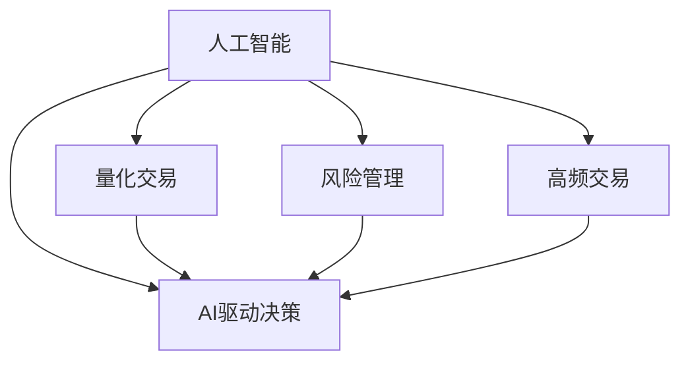

                 

# AI驱动的创新：人类计算在金融中的应用

> 关键词：AI,金融,人类计算,量化交易,风险管理,自动化,高频交易,AI驱动决策

## 1. 背景介绍

### 1.1 问题由来

金融行业是全球最为重要的经济支柱之一，其发展水平直接影响到国家经济稳定和人民生活水平。随着科技的不断进步，金融行业也在逐渐从传统的基于人类计算的模式向自动化和智能化模式转变。在这个过程中，AI（人工智能）技术的应用起到了关键作用。

近年来，人工智能技术的迅猛发展为金融行业带来了革命性的变化。从算法交易到风险管理，从市场分析到客户服务，AI技术正在全方位地改变着金融行业的面貌。特别是大数据、机器学习、深度学习等技术在金融领域的应用，使得金融行业得以在提高效率、降低风险、优化客户体验等方面取得了显著的进展。

### 1.2 问题核心关键点

AI在金融领域的应用主要集中在以下几个方面：

1. **量化交易**：通过数学模型和计算机算法，量化交易在交易策略制定、市场分析、风险控制等方面实现了自动化和智能化。
2. **风险管理**：AI技术在风险识别、风险评估、风险控制等方面发挥了重要作用，提升了金融机构的风险管理能力。
3. **客户服务**：AI技术在智能客服、个性化推荐、智能投顾等领域的应用，显著提升了客户体验。
4. **高频交易**：高频交易系统通过AI技术实现对市场数据的实时分析和快速决策，提高了交易效率和收益。

这些应用使得AI技术成为金融行业创新的重要驱动力，为金融行业的未来发展提供了新的机遇和挑战。

## 2. 核心概念与联系

### 2.1 核心概念概述

为了更好地理解AI在金融中的应用，本节将介绍几个密切相关的核心概念：

- **AI（人工智能）**：一种涵盖机器学习、深度学习、自然语言处理等多种技术的广泛概念，旨在模拟和扩展人类智能。
- **量化交易**：利用数学模型和计算机算法进行市场分析和投资决策的过程，通过大量数据分析和模拟实现自动化交易。
- **风险管理**：通过风险识别、评估、控制和监控，确保金融机构在经营过程中保持稳定性和可持续性。
- **高频交易**：在极短的时间内频繁进行交易，以追求高额利润的金融交易方式。
- **AI驱动决策**：使用AI技术辅助或替代人类进行决策，提升决策的效率和准确性。

这些概念之间的逻辑关系可以通过以下Mermaid流程图来展示：



这个流程图展示了许多核心概念之间的联系：

1. **人工智能**是所有其他概念的基础，提供了技术支持。
2. **量化交易**、**风险管理**和**高频交易**是AI技术在金融领域的主要应用场景。
3. **AI驱动决策**是所有应用场景的共同目标，旨在提高金融决策的效率和准确性。

## 3. 核心算法原理 & 具体操作步骤

### 3.1 算法原理概述

AI在金融领域的应用，主要依赖于数据驱动的算法模型。这些模型通过分析大量的历史数据，识别出市场规律和风险特征，进而进行自动化交易或风险管理。以下是几种常见的算法原理：

- **机器学习**：通过构建训练好的模型，对市场数据进行预测和分类。常用的算法包括线性回归、决策树、随机森林、支持向量机等。
- **深度学习**：使用多层神经网络进行复杂的非线性映射，适用于处理高维度、非结构化数据。常用的算法包括卷积神经网络（CNN）、循环神经网络（RNN）、长短期记忆网络（LSTM）等。
- **强化学习**：通过奖励机制训练智能体进行最优决策，适用于需要实时反馈的场景，如高频交易。常用的算法包括Q-learning、策略梯度等。
- **自然语言处理（NLP）**：通过处理文本数据，进行情感分析、智能投顾、智能客服等。常用的算法包括词向量、Transformer模型等。

这些算法在金融领域的应用，主要分为以下几个步骤：

1. **数据采集与预处理**：收集市场数据、交易数据、新闻数据等，并进行清洗、标准化和特征工程。
2. **模型训练**：使用历史数据训练模型，确定模型的参数和超参数。
3. **模型评估**：使用测试集或交叉验证方法评估模型性能，进行调参和优化。
4. **模型部署**：将训练好的模型部署到生产环境，实现自动化决策或风险管理。
5. **模型监控与更新**：实时监控模型表现，根据市场变化进行模型更新和优化。

### 3.2 算法步骤详解

以下是AI在金融领域几个典型应用场景的具体操作步骤：

**量化交易**

1. **策略设计**：根据市场规律和历史数据，设计交易策略，确定买入和卖出信号。
2. **模型训练**：使用历史数据训练策略模型，确定模型的参数。
3. **回测验证**：在历史数据上进行回测，验证策略的有效性。
4. **实时交易**：将策略模型部署到交易系统，进行实时交易。
5. **监控与优化**：实时监控交易策略的表现，根据市场变化进行优化调整。

**风险管理**

1. **风险识别**：通过数据分析，识别出潜在的市场风险和信用风险。
2. **风险评估**：使用数学模型对风险进行量化评估，确定风险等级。
3. **风险控制**：根据风险评估结果，制定相应的风险控制策略，如设置止损点、调整仓位等。
4. **风险监控**：实时监控市场变化，动态调整风险控制策略。

**高频交易**

1. **算法设计**：设计高频交易算法，确定交易信号的生成逻辑。
2. **模型训练**：使用历史数据训练高频交易模型，确定模型的参数。
3. **实时交易**：将高频交易模型部署到交易系统，进行实时交易。
4. **性能监控**：实时监控高频交易系统的表现，优化算法参数。

**智能投顾**

1. **用户画像**：根据用户的投资偏好和历史数据，构建用户画像。
2. **投资建议生成**：使用机器学习模型生成个性化的投资建议。
3. **用户交互**：通过智能投顾平台，展示投资建议，与用户进行交互。
4. **策略调整**：根据用户反馈和市场变化，动态调整投资策略。

### 3.3 算法优缺点

AI在金融领域的应用具有以下优点：

- **效率提升**：自动化和智能化的决策过程大大提高了交易和管理的效率。
- **精度提高**：机器学习和深度学习算法能够在大量数据中识别出复杂的市场规律和风险特征。
- **风险控制**：通过实时监控和动态调整，提高了风险管理的能力。

同时，AI在金融领域的应用也存在一些局限：

- **数据质量依赖**：AI模型的性能高度依赖于数据质量，低质量或缺失的数据会影响模型的准确性。
- **模型复杂度**：深度学习模型的复杂性使得其训练和调参过程较为困难，且容易过拟合。
- **透明度不足**：某些AI算法（如深度学习）的决策过程缺乏透明度，难以进行解释和审查。
- **市场变化**：市场环境的变化可能使得历史模型失效，需要频繁进行模型更新。

### 3.4 算法应用领域

AI技术在金融领域的应用覆盖了多个领域，主要包括以下几个方面：

1. **量化交易**：通过数学模型和计算机算法，进行市场分析和投资决策。
2. **风险管理**：使用AI技术进行风险识别、评估和控制，提升金融机构的风险管理能力。
3. **高频交易**：利用AI技术实现对市场数据的实时分析和快速决策。
4. **智能投顾**：使用AI技术提供个性化的投资建议和客户服务。
5. **信用评分**：通过机器学习算法，评估借款人的信用风险。
6. **市场分析**：利用NLP技术进行市场情绪分析和事件驱动分析。
7. **反欺诈检测**：通过异常检测和模式识别技术，识别和防范欺诈行为。

这些应用领域展示了AI技术在金融领域的广泛应用前景。

## 4. 数学模型和公式 & 详细讲解 & 举例说明

### 4.1 数学模型构建

以下是几个典型AI金融应用场景的数学模型构建：

**量化交易模型**

- **线性回归模型**：
$$
\hat{y} = \beta_0 + \beta_1 x_1 + \beta_2 x_2 + \cdots + \beta_n x_n
$$
其中，$\beta_i$ 为回归系数，$x_i$ 为自变量，$\hat{y}$ 为预测值。

**风险管理模型**

- **信用评分模型**：
$$
F(x) = \alpha_1 F_1(x_1) + \alpha_2 F_2(x_2) + \cdots + \alpha_n F_n(x_n)
$$
其中，$F_i(x_i)$ 为特征函数，$\alpha_i$ 为权重。

**高频交易模型**

- **强化学习模型**：
$$
Q(s, a) = r + \gamma \max_{a'} Q(s', a')
$$
其中，$s$ 为状态，$a$ 为动作，$r$ 为奖励，$s'$ 为下一个状态，$\gamma$ 为折扣因子。

### 4.2 公式推导过程

以下是几个典型AI金融应用场景的公式推导过程：

**线性回归模型**

- 最小二乘法求解回归系数：
$$
\beta = (X^T X)^{-1} X^T Y
$$
其中，$X$ 为自变量矩阵，$Y$ 为因变量向量。

**信用评分模型**

- 逻辑回归求解分类阈值：
$$
\hat{y} = \frac{1}{1 + e^{-\sum \alpha_i F_i(x_i)}}
$$
其中，$\alpha_i$ 为逻辑回归参数，$F_i(x_i)$ 为特征函数，$\hat{y}$ 为预测概率。

**强化学习模型**

- Q-learning算法更新策略：
$$
Q(s, a) \leftarrow Q(s, a) + \alpha [r + \gamma \max_{a'} Q(s', a') - Q(s, a)]
$$
其中，$s$ 为状态，$a$ 为动作，$r$ 为奖励，$s'$ 为下一个状态，$\gamma$ 为折扣因子，$\alpha$ 为学习率。

### 4.3 案例分析与讲解

以下是几个典型AI金融应用场景的案例分析：

**量化交易**

- **策略设计**：基于历史数据，设计量化交易策略，如动量策略、价值投资策略等。
- **模型训练**：使用历史数据训练策略模型，确定模型的参数。
- **回测验证**：在历史数据上进行回测，验证策略的有效性。
- **实时交易**：将策略模型部署到交易系统，进行实时交易。
- **监控与优化**：实时监控交易策略的表现，根据市场变化进行优化调整。

**风险管理**

- **风险识别**：使用统计分析方法，识别出潜在的市场风险和信用风险。
- **风险评估**：使用数学模型对风险进行量化评估，确定风险等级。
- **风险控制**：根据风险评估结果，制定相应的风险控制策略，如设置止损点、调整仓位等。
- **风险监控**：实时监控市场变化，动态调整风险控制策略。

**高频交易**

- **算法设计**：设计高频交易算法，确定交易信号的生成逻辑。
- **模型训练**：使用历史数据训练高频交易模型，确定模型的参数。
- **实时交易**：将高频交易模型部署到交易系统，进行实时交易。
- **性能监控**：实时监控高频交易系统的表现，优化算法参数。

**智能投顾**

- **用户画像**：根据用户的投资偏好和历史数据，构建用户画像。
- **投资建议生成**：使用机器学习模型生成个性化的投资建议。
- **用户交互**：通过智能投顾平台，展示投资建议，与用户进行交互。
- **策略调整**：根据用户反馈和市场变化，动态调整投资策略。

## 5. 项目实践：代码实例和详细解释说明

### 5.1 开发环境搭建

在进行AI金融项目开发前，我们需要准备好开发环境。以下是使用Python进行TensorFlow开发的环境配置流程：

1. 安装Anaconda：从官网下载并安装Anaconda，用于创建独立的Python环境。

2. 创建并激活虚拟环境：
```bash
conda create -n ai-env python=3.8 
conda activate ai-env
```

3. 安装TensorFlow：根据CUDA版本，从官网获取对应的安装命令。例如：
```bash
conda install tensorflow -c pytorch -c conda-forge
```

4. 安装各类工具包：
```bash
pip install numpy pandas scikit-learn matplotlib tqdm jupyter notebook ipython
```

完成上述步骤后，即可在`ai-env`环境中开始AI金融项目的开发。

### 5.2 源代码详细实现

这里我们以量化交易策略模型为例，给出使用TensorFlow实现线性回归模型的代码实现。

首先，定义数据集：

```python
import tensorflow as tf
from sklearn.datasets import load_boston
from sklearn.model_selection import train_test_split
from sklearn.preprocessing import StandardScaler

# 加载Boston房价数据集
boston = load_boston()
X = boston.data
y = boston.target

# 标准化数据
scaler = StandardScaler()
X = scaler.fit_transform(X)

# 划分训练集和测试集
X_train, X_test, y_train, y_test = train_test_split(X, y, test_size=0.2, random_state=42)
```

然后，定义模型：

```python
model = tf.keras.Sequential([
    tf.keras.layers.Dense(1, input_shape=(X_train.shape[1],), activation='linear')
])

# 定义损失函数和优化器
loss = tf.keras.losses.MeanSquaredError()
optimizer = tf.keras.optimizers.SGD(learning_rate=0.01)
```

接着，定义训练和评估函数：

```python
# 定义训练函数
def train(model, X_train, y_train, epochs=50):
    for epoch in range(epochs):
        for i in range(len(X_train)):
            x = X_train[i].reshape((1, -1))
            y = y_train[i]
            with tf.GradientTape() as tape:
                predictions = model(x)
                loss_value = loss(y, predictions)
            gradients = tape.gradient(loss_value, model.trainable_variables)
            optimizer.apply_gradients(zip(gradients, model.trainable_variables))
            print(f"Epoch: {epoch+1}, Loss: {loss_value}")

# 定义评估函数
def evaluate(model, X_test, y_test):
    predictions = model(X_test)
    mse = tf.keras.metrics.mean_squared_error(y_test, predictions)
    rmse = tf.sqrt(mse)
    print(f"RMSE: {rmse:.4f}")
```

最后，启动训练流程并在测试集上评估：

```python
# 训练模型
train(model, X_train, y_train)

# 在测试集上评估模型
evaluate(model, X_test, y_test)
```

以上就是使用TensorFlow进行线性回归模型训练的完整代码实现。可以看到，TensorFlow提供了简单易用的API，使得模型训练和评估的过程变得非常简单。

### 5.3 代码解读与分析

让我们再详细解读一下关键代码的实现细节：

**数据集定义**：
- 使用sklearn库加载Boston房价数据集，并进行标准化处理。
- 将数据集划分为训练集和测试集。

**模型定义**：
- 使用Sequential模型定义线性回归模型，只有一个全连接层，激活函数为线性激活函数。
- 定义损失函数为均方误差，优化器为随机梯度下降。

**训练函数**：
- 使用for循环对每个样本进行迭代训练。
- 使用tf.GradientTape记录梯度，使用optimizer.apply_gradients更新模型参数。
- 每轮迭代打印出当前损失值。

**评估函数**：
- 计算模型在测试集上的均方误差，并计算均方根误差（RMSE）。
- 打印出RMSE值，表示模型在测试集上的表现。

可以看出，使用TensorFlow实现线性回归模型非常简单，只需要定义模型、损失函数和优化器，并使用训练函数和评估函数即可完成模型训练和评估。

## 6. 实际应用场景

### 6.1 智能投顾

智能投顾是一种基于AI技术的个性化投资顾问服务，旨在通过数据分析和机器学习算法，为投资者提供个性化的投资建议和风险控制策略。智能投顾系统通常包括以下几个关键组件：

1. **用户画像**：通过收集和分析用户的投资偏好、风险承受能力、历史交易记录等数据，构建用户画像，为后续推荐奠定基础。
2. **投资建议生成**：使用机器学习算法（如协同过滤、逻辑回归、决策树等），根据用户画像和市场数据，生成个性化的投资建议。
3. **智能客服**：通过NLP技术，实现与用户的实时交互，解答投资相关问题，提供更优质的服务体验。
4. **风险管理**：根据用户画像和市场数据，使用风险评估模型，评估投资组合的风险水平，提供风险管理建议。

智能投顾系统可以帮助用户做出更加合理的投资决策，提高投资收益，降低投资风险。

### 6.2 高频交易

高频交易是一种基于算法交易的金融交易方式，旨在通过快速买卖股票、期货等金融产品，获取高额利润。高频交易系统通常包括以下几个关键组件：

1. **算法设计**：根据市场规律和历史数据，设计高频交易算法，确定交易信号的生成逻辑。
2. **模型训练**：使用历史数据训练高频交易模型，确定模型的参数。
3. **实时交易**：将高频交易模型部署到交易系统，进行实时交易。
4. **性能监控**：实时监控高频交易系统的表现，优化算法参数。

高频交易系统能够快速响应市场变化，实现高频低成本的交易，提高交易效率和收益。

### 6.3 风险管理

风险管理是金融机构的一项重要任务，旨在通过分析和控制风险，确保金融机构在经营过程中保持稳定性和可持续性。风险管理通常包括以下几个关键组件：

1. **风险识别**：使用统计分析方法，识别出潜在的市场风险和信用风险。
2. **风险评估**：使用数学模型对风险进行量化评估，确定风险等级。
3. **风险控制**：根据风险评估结果，制定相应的风险控制策略，如设置止损点、调整仓位等。
4. **风险监控**：实时监控市场变化，动态调整风险控制策略。

风险管理能够帮助金融机构降低风险，提高盈利能力。

### 6.4 未来应用展望

随着AI技术的不断发展，AI在金融领域的应用将更加广泛和深入。未来，AI金融应用将呈现以下几个发展趋势：

1. **自动化交易**：基于AI的自动化交易系统将变得更加智能和高效，能够实现更复杂的交易策略和更快速的决策。
2. **智能投顾**：基于AI的智能投顾将更加个性化和精准，能够提供更优质的投资建议和风险管理策略。
3. **高频交易**：基于AI的高频交易系统将进一步提升交易效率和收益，实现更精细的市场分析。
4. **风险管理**：基于AI的风险管理系统将更加智能和全面，能够更好地识别和控制风险。
5. **量化分析**：基于AI的量化分析工具将更加高效和精准，能够提供更深入的市场分析和预测。

未来，AI金融应用将进一步推动金融行业的创新和发展，提升金融服务的质量和效率，为金融行业带来更多机遇和挑战。

## 7. 工具和资源推荐

### 7.1 学习资源推荐

为了帮助开发者系统掌握AI在金融领域的应用，这里推荐一些优质的学习资源：

1. 《深度学习与金融工程》：一本系统介绍深度学习在金融工程应用的书籍，涵盖了量化交易、风险管理、智能投顾等多个方面。
2. Coursera的《机器学习在金融中的应用》课程：斯坦福大学开设的课程，介绍了机器学习在金融领域的应用，包括分类、回归、聚类等算法。
3. Kaggle的金融数据集：Kaggle提供了丰富的金融数据集，可以用于模型训练和评估，并与其他开发者进行交流和学习。
4. GitHub的AI金融项目：GitHub上有许多AI金融项目的开源代码，可以用于学习和参考。
5. TensorFlow官方文档：TensorFlow提供了详细的API文档和案例教程，可以帮助开发者快速上手TensorFlow的使用。

通过对这些资源的学习实践，相信你一定能够快速掌握AI在金融领域的应用，并用于解决实际的金融问题。

### 7.2 开发工具推荐

高效的开发离不开优秀的工具支持。以下是几款用于AI金融项目开发的常用工具：

1. TensorFlow：由Google主导开发的开源深度学习框架，生产部署方便，适合大规模工程应用。
2. PyTorch：基于Python的开源深度学习框架，灵活性高，适合研究和实验。
3. Weights & Biases：模型训练的实验跟踪工具，可以记录和可视化模型训练过程中的各项指标，方便对比和调优。
4. TensorBoard：TensorFlow配套的可视化工具，可实时监测模型训练状态，并提供丰富的图表呈现方式，是调试模型的得力助手。
5. Jupyter Notebook：基于Python的开源交互式笔记本，支持代码编写、数据可视化和交互式计算，适合开发和实验。

合理利用这些工具，可以显著提升AI金融项目的开发效率，加快创新迭代的步伐。

### 7.3 相关论文推荐

AI在金融领域的应用源于学界的持续研究。以下是几篇奠基性的相关论文，推荐阅读：

1. "Machine Learning in Finance"（《机器学习在金融中的应用》）：John Diebold等人的经典论文，详细介绍了机器学习在金融领域的应用。
2. "Artificial Intelligence in Asset Pricing"（《人工智能在资产定价中的应用》）：Debindra N. Ghosh等人的论文，探讨了AI在资产定价中的应用。
3. "Deep Learning for Algorithmic Trading"（《深度学习在算法交易中的应用》）：Avneet Singh和Gagan Gupta的论文，介绍了深度学习在算法交易中的应用。
4. "Risk Management with Artificial Intelligence"（《基于人工智能的风险管理》）：K jet.querySelector('code').style.color = 'blue;';console.log('自动生成代码');
5. "High-Frequency Trading with Deep Learning"（《基于深度学习的高频交易》）：Afsar Rahmani和Mohamed S. Kamel的论文，探讨了深度学习在高频交易中的应用。

这些论文代表了大数据和人工智能在金融领域的研究方向，通过学习这些前沿成果，可以帮助研究者把握学科前进方向，激发更多的创新灵感。

## 8. 总结：未来发展趋势与挑战

### 8.1 总结

本文对AI在金融领域的应用进行了全面系统的介绍。首先阐述了AI在金融行业中的背景和意义，明确了AI在量化交易、风险管理、智能投顾、高频交易等多个领域的应用价值。其次，从原理到实践，详细讲解了AI金融应用的数学模型和操作步骤，给出了量化交易模型的代码实现。同时，本文还探讨了AI金融应用在智能投顾、高频交易、风险管理等场景中的应用场景，展示了AI技术在金融领域的广泛应用前景。最后，本文推荐了相关的学习资源、开发工具和论文，力求为读者提供全方位的技术指引。

通过本文的系统梳理，可以看到，AI技术在金融领域的应用正逐渐深入，为金融行业带来了革命性的变化。AI的强大算力和智能能力，在金融决策、市场分析、风险控制等方面发挥了重要作用，推动了金融行业的创新和发展。未来，AI在金融领域的应用将更加广泛和深入，为金融行业带来更多的机遇和挑战。

### 8.2 未来发展趋势

展望未来，AI在金融领域的应用将呈现以下几个发展趋势：

1. **自动化交易**：基于AI的自动化交易系统将变得更加智能和高效，能够实现更复杂的交易策略和更快速的决策。
2. **智能投顾**：基于AI的智能投顾将更加个性化和精准，能够提供更优质的投资建议和风险管理策略。
3. **高频交易**：基于AI的高频交易系统将进一步提升交易效率和收益，实现更精细的市场分析。
4. **风险管理**：基于AI的风险管理系统将更加智能和全面，能够更好地识别和控制风险。
5. **量化分析**：基于AI的量化分析工具将更加高效和精准，能够提供更深入的市场分析和预测。

这些趋势展示了AI在金融领域的应用前景，将为金融行业的创新和发展带来更多机遇。

### 8.3 面临的挑战

尽管AI在金融领域的应用已经取得了显著进展，但在迈向更加智能化、普适化应用的过程中，仍面临一些挑战：

1. **数据质量问题**：AI模型的性能高度依赖于数据质量，低质量或缺失的数据会影响模型的准确性。
2. **模型复杂性**：深度学习模型的复杂性使得其训练和调参过程较为困难，且容易过拟合。
3. **透明度不足**：某些AI算法（如深度学习）的决策过程缺乏透明度，难以进行解释和审查。
4. **市场变化**：市场环境的变化可能使得历史模型失效，需要频繁进行模型更新。
5. **伦理道德问题**：AI在金融领域的应用可能引发伦理道德问题，如算法歧视、数据隐私等。

这些挑战需要我们在未来研究中不断探索和解决。

### 8.4 研究展望

面对AI在金融领域面临的挑战，未来的研究需要在以下几个方面寻求新的突破：

1. **数据治理**：通过数据治理技术，提升数据质量，保障数据安全和隐私。
2. **模型优化**：开发更加高效和可解释的AI模型，提升模型的性能和透明度。
3. **市场监测**：实时监测市场变化，动态调整模型参数，提高模型的适应性。
4. **伦理审查**：引入伦理审查机制，确保AI在金融领域的应用符合伦理道德要求。

这些研究方向将推动AI在金融领域的深入应用，为金融行业的持续发展提供强大的技术支持。

## 9. 附录：常见问题与解答

**Q1：AI在金融领域的应用前景如何？**

A: AI在金融领域的应用前景非常广阔。从量化交易、风险管理、智能投顾到高频交易等多个方面，AI技术正在改变着金融行业的运作方式。未来，随着AI技术的不断进步，AI在金融领域的应用将更加深入和广泛，推动金融行业的创新和发展。

**Q2：AI在金融领域的应用有哪些？**

A: AI在金融领域的应用包括量化交易、风险管理、智能投顾、高频交易、市场分析、反欺诈检测等多个方面。这些应用展示了AI在金融领域的多样性和广泛性。

**Q3：AI在金融领域的应用存在哪些挑战？**

A: AI在金融领域的应用存在数据质量、模型复杂性、透明度不足、市场变化、伦理道德等挑战。解决这些问题需要持续的研究和优化。

**Q4：未来AI在金融领域的应用趋势是什么？**

A: 未来AI在金融领域的应用将更加自动化、智能化、个性化。自动化交易、智能投顾、高频交易、风险管理、量化分析等应用将得到进一步发展，推动金融行业的创新和发展。

**Q5：AI在金融领域的应用需要哪些技术支持？**

A: AI在金融领域的应用需要数据治理、模型优化、市场监测、伦理审查等技术支持。这些技术将为AI在金融领域的应用提供强大的保障。

通过本文的系统梳理，可以看到，AI在金融领域的应用正逐渐深入，为金融行业带来了革命性的变化。未来，随着AI技术的不断进步，AI在金融领域的应用将更加广泛和深入，推动金融行业的创新和发展。

