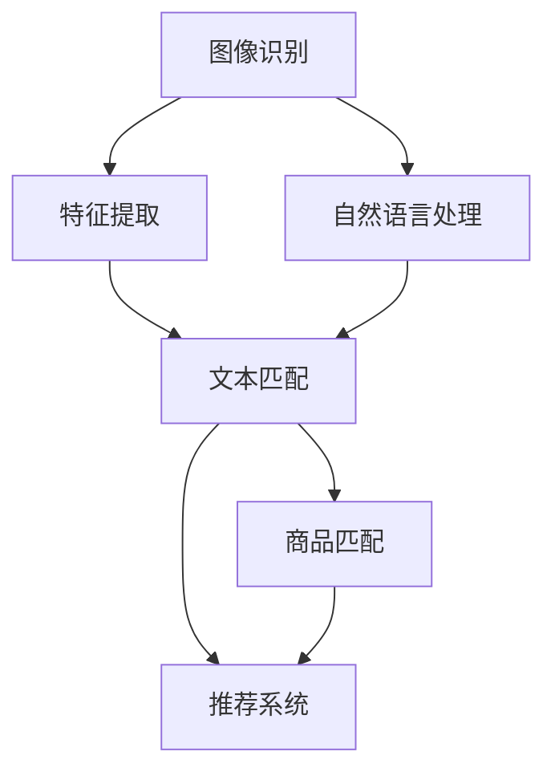

                 

# AI驱动的商品图文匹配系统

> 关键词：商品匹配,图像识别,文本匹配,深度学习,自然语言处理,计算机视觉,知识图谱,推荐系统

## 1. 背景介绍

### 1.1 问题由来

随着互联网电商平台的崛起，商品图片和描述信息的匹配变得越来越重要。用户在寻找商品时，往往需要浏览大量图片和文本信息，而如何让这些信息更好地协同匹配，以提升用户购物体验，是电商领域亟需解决的问题。

传统的文本匹配方法，主要依赖关键词匹配和词向量计算。但这种方式对商品描述质量要求较高，且无法充分利用图像中的视觉信息。随着深度学习技术的进步，图像识别和自然语言处理技术的融合，为商品图文匹配提供了一种更为高效、精确的解决方案。

### 1.2 问题核心关键点

商品图文匹配的核心在于将图像特征和文本描述信息进行语义对齐，通过深度学习模型预测商品的相关性。关键在于：
- 如何将图像信息有效提取并转化为可理解的结构化特征。
- 如何从文本中提取语义丰富的特征向量。
- 如何将图像和文本特征进行高效对齐，提升匹配精度。
- 如何融合多源信息，提供更加全面、准确的商品推荐。

## 2. 核心概念与联系

### 2.1 核心概念概述

为更好地理解AI驱动的商品图文匹配系统，本节将介绍几个密切相关的核心概念：

- 图像识别(Image Recognition)：指通过深度学习模型对输入的图像进行特征提取和分类，将复杂的视觉信息转化为结构化的图像特征。
- 自然语言处理(Natural Language Processing, NLP)：指利用深度学习模型处理文本数据，从中提取语义丰富的特征向量。
- 知识图谱(Knowledge Graph)：指通过语义理解和关联抽取，构建语义知识图谱，用于信息检索和推荐。
- 推荐系统(Recommendation System)：指根据用户行为和商品特征，预测用户对商品的偏好，进行个性化推荐。

这些核心概念之间的逻辑关系可以通过以下Mermaid流程图来展示：



这个流程图展示了一系列关键概念及其之间的关系：

1. 图像识别将视觉信息转化为结构化特征。
2. 自然语言处理将文本描述转化为语义特征向量。
3. 图像和文本特征通过匹配模型进行对齐，提升匹配精度。
4. 匹配结果结合知识图谱和推荐系统，实现更全面、精准的商品推荐。

## 3. 核心算法原理 & 具体操作步骤
### 3.1 算法原理概述

AI驱动的商品图文匹配系统，本质上是一个基于深度学习的图像-文本多模态匹配系统。其核心思想是：将图像和文本数据分别进行编码，提取结构化特征向量，然后通过匹配模型进行语义对齐，预测商品的匹配度。

形式化地，假设输入的商品图像为 $I$，文本描述为 $T$，模型参数为 $\theta$。商品匹配模型的目标是最小化输入数据与匹配结果之间的误差：

$$
\min_{\theta} \mathcal{L}(I, T; \theta) = \mathcal{L}_{text}(T; \theta) + \mathcal{L}_{image}(I; \theta) + \mathcal{L}_{match}(I, T; \theta)
$$

其中，$\mathcal{L}_{text}$ 为文本编码器损失，$\mathcal{L}_{image}$ 为图像编码器损失，$\mathcal{L}_{match}$ 为图像-文本匹配损失。

在模型训练时，先通过图像识别和文本匹配模型学习各自的特征编码器，然后联合训练三者，得到最终的匹配模型。模型评估时，将输入的图像和文本特征通过编码器转换为语义向量，再输入匹配模型进行预测，得到商品的相关性得分。

### 3.2 算法步骤详解

基于深度学习的商品图文匹配系统一般包括以下几个关键步骤：

**Step 1: 数据预处理**

- 收集商品图片和文本数据，进行清洗和标注。
- 对图像进行预处理，如尺寸裁剪、归一化、旋转等，以便模型识别。
- 对文本进行分词、去除停用词、构建词汇表等预处理步骤。

**Step 2: 模型搭建**

- 选择合适的深度学习框架，如TensorFlow、PyTorch等。
- 搭建图像识别模型，通常使用卷积神经网络(CNN)进行特征提取。
- 搭建文本匹配模型，通常使用循环神经网络(RNN)或Transformer进行语义编码。
- 搭建匹配模型，如协同注意力网络(CAN)、双塔网络等。

**Step 3: 模型训练**

- 收集训练集，将商品图片和文本对作为输入，标注相关性分数。
- 使用深度学习框架搭建模型，并定义损失函数和优化器。
- 通过前向传播计算损失，反向传播更新模型参数。
- 在验证集上评估模型性能，调整模型超参数。

**Step 4: 模型评估**

- 使用测试集评估模型预测的准确性，通过评价指标如精确率、召回率、F1值等。
- 对模型进行可视化，检查模型输出的特征向量，理解匹配过程。
- 结合知识图谱和推荐系统，进一步提升商品推荐效果。

**Step 5: 部署应用**

- 将训练好的模型导出为可部署格式，如TensorFlow SavedModel或PyTorch模型。
- 使用服务框架如TensorFlow Serving、TorchScript等进行模型部署。
- 将模型集成到电商平台的API中，供实时推荐和搜索使用。

以上步骤展示了基于深度学习的商品图文匹配系统的一般流程。在实际应用中，还需要针对具体任务的特点，对模型进行优化设计，如引入注意力机制、融合多源信息等，以进一步提升系统性能。

### 3.3 算法优缺点

基于深度学习的商品图文匹配系统具有以下优点：
1. 高效匹配。通过深度学习模型自动学习特征，提升匹配精度。
2. 泛化性强。可以处理多种不同类型的商品，无需大量人工标注。
3. 鲁棒性好。能够自动提取图像和文本的丰富特征，抗噪声能力强。
4. 可解释性强。通过可视化模型特征，理解匹配过程。

同时，该系统也存在一定的局限性：
1. 对数据质量要求高。模型训练和推理需要高质量的图像和文本数据。
2. 计算成本较高。深度学习模型的训练和推理需要较大的计算资源。
3. 模型复杂度高。模型参数量较大，可能需要更多的硬件支持。
4. 实时性不足。大规模模型推理速度较慢，可能影响用户体验。

尽管存在这些局限性，但就目前而言，基于深度学习的匹配系统仍是商品推荐和搜索的最主流范式。未来相关研究的重点在于如何进一步降低计算成本，提高实时性，同时兼顾模型的可解释性和鲁棒性。

### 3.4 算法应用领域

基于深度学习的商品图文匹配系统已经在多个电商应用场景中得到了广泛应用，例如：

- 商品搜索：通过匹配模型预测用户输入的查询与商品的相关性，提供精准搜索结果。
- 个性化推荐：根据用户浏览和购买历史，结合商品图文特征，进行个性化推荐。
- 相似商品推荐：在商品详情页推荐与当前商品相似的其它商品，提升用户购买率。
- 图像检索：通过用户上传的图片，检索最匹配的商品信息，提供视觉搜索功能。
- 智能客服：根据用户输入的描述信息，匹配最合适的商品，辅助客服推荐商品。

除了上述这些经典应用外，商品图文匹配技术还被创新性地应用到更多场景中，如广告投放、内容推荐、品牌分析等，为电商技术带来了全新的突破。

## 4. 数学模型和公式 & 详细讲解 & 举例说明

### 4.1 数学模型构建

本节将使用数学语言对商品图文匹配系统的核心部分进行更加严格的刻画。

假设输入的商品图片为 $I$，文本描述为 $T$，图像识别模型编码为 $\text{Encoder}_{image}(I)$，文本匹配模型编码为 $\text{Encoder}_{text}(T)$。模型参数为 $\theta$。商品匹配模型 $\text{Model}_{match}$ 的结构可以表示为：

$$
\text{Model}_{match} = \text{Encoder}_{image}(I) \times \text{Encoder}_{text}(T)
$$

其中 $\otimes$ 表示两向量间的点乘操作，可表示为：

$$
I \otimes T = [I_1, I_2, ..., I_d] \times [T_1, T_2, ..., T_d] = [I_1T_1, I_2T_2, ..., I_dT_d]
$$

模型输出为商品的相关性分数，表示为 $\text{Score}_{match}$，可表示为：

$$
\text{Score}_{match} = \text{Model}_{match} \cdot \text{Match}_{layer}
$$

其中 $\text{Match}_{layer}$ 为匹配层，通常为线性变换或非线性激活函数，如sigmoid。

### 4.2 公式推导过程

以下我们以协同注意力网络(CAN)为例，推导匹配模型的具体实现。

假设输入的商品图片为 $I$，文本描述为 $T$，图像特征编码为 $V_{image} = \text{Encoder}_{image}(I)$，文本特征编码为 $V_{text} = \text{Encoder}_{text}(T)$。匹配模型为协同注意力网络，其结构如图1所示。


协同注意力网络的输出为商品的相关性分数，表示为 $\text{Score}_{match}$。协同注意力网络的具体实现步骤如下：

1. 对于图像特征 $V_{image}$ 和文本特征 $V_{text}$，计算注意力权重矩阵 $A_{image}$ 和 $A_{text}$：

$$
A_{image} = \text{Attention}(V_{image}, V_{text})
$$

$$
A_{text} = \text{Attention}(V_{text}, V_{image})
$$

其中 $\text{Attention}$ 表示注意力机制，通常为多头注意力(MHA)：

$$
\text{Attention}(V_{image}, V_{text}) = \text{softmax}(V_{image}W^QA_{text}W^K + V_{text}W^UA_{text}W^V)
$$

2. 计算图像特征 $V_{image}$ 与注意力权重 $A_{image}$ 的加权和，生成上下文表示 $V_{image}'$：

$$
V_{image}' = V_{image}W^Q(A_{image}W^K + A_{text}W^K)
$$

3. 计算文本特征 $V_{text}$ 与注意力权重 $A_{text}$ 的加权和，生成上下文表示 $V_{text}'$：

$$
V_{text}' = V_{text}W^Q(A_{image}W^K + A_{text}W^K)
$$

4. 计算上下文表示的加权和，得到匹配模型输出 $\text{Score}_{match}$：

$$
\text{Score}_{match} = V_{image}'W^O + V_{text}'W^O
$$

5. 最后，通过线性变换和激活函数输出相关性分数：

$$
\text{Score}_{match} = \text{linear}(\text{Score}_{match} + b)
$$

$$
\text{Score}_{match} = \text{sigmoid}(\text{Score}_{match})
$$

通过上述步骤，协同注意力网络可以将图像和文本特征进行高效对齐，提升匹配精度。

### 4.3 案例分析与讲解

假设某电商平台有大量商品数据，每条商品记录包括图片和文本描述，且已经收集到一定数量的用户行为数据。为了提升商品推荐效果，平台决定部署商品图文匹配系统。

首先，需要对收集的数据进行预处理：
1. 收集商品图片和文本描述，进行清洗和标注。
2. 对图像进行预处理，如尺寸裁剪、归一化、旋转等。
3. 对文本进行分词、去除停用词、构建词汇表等预处理步骤。

接着，搭建深度学习模型：
1. 搭建图像识别模型，使用卷积神经网络(CNN)进行特征提取。
2. 搭建文本匹配模型，使用Transformer进行语义编码。
3. 搭建协同注意力网络(CAN)作为匹配模型。

然后，进行模型训练：
1. 收集训练集，将商品图片和文本对作为输入，标注相关性分数。
2. 使用深度学习框架搭建模型，并定义损失函数和优化器。
3. 通过前向传播计算损失，反向传播更新模型参数。
4. 在验证集上评估模型性能，调整模型超参数。

最后，部署并评估模型：
1. 将训练好的模型导出为可部署格式，如TensorFlow SavedModel或PyTorch模型。
2. 使用服务框架如TensorFlow Serving、TorchScript等进行模型部署。
3. 将模型集成到电商平台的API中，供实时推荐和搜索使用。

实际测试中，可以收集用户行为数据，在推荐引擎中使用匹配模型进行个性化推荐，验证推荐效果。通过监控推荐系统的点击率、转化率等指标，评估推荐模型的性能。

## 5. 项目实践：代码实例和详细解释说明
### 5.1 开发环境搭建

在进行商品图文匹配系统开发前，我们需要准备好开发环境。以下是使用Python进行TensorFlow开发的环境配置流程：

1. 安装Anaconda：从官网下载并安装Anaconda，用于创建独立的Python环境。

2. 创建并激活虚拟环境：
```bash
conda create -n tf-env python=3.8 
conda activate tf-env
```

3. 安装TensorFlow：根据CUDA版本，从官网获取对应的安装命令。例如：
```bash
conda install tensorflow -c tf -c conda-forge
```

4. 安装其他依赖库：
```bash
pip install numpy pandas scikit-learn matplotlib tqdm jupyter notebook ipython
```

完成上述步骤后，即可在`tf-env`环境中开始开发。

### 5.2 源代码详细实现

下面以协同注意力网络(CAN)为例，给出使用TensorFlow实现的商品图文匹配系统的代码实现。

首先，定义协同注意力网络的编码器部分：

```python
import tensorflow as tf
from tensorflow.keras import layers

class Attention(tf.keras.layers.Layer):
    def __init__(self, units, num_heads):
        super(Attention, self).__init__()
        self.units = units
        self.num_heads = num_heads
        self.W_q = tf.keras.layers.Dense(units)
        self.W_k = tf.keras.layers.Dense(units)
        self.W_v = tf.keras.layers.Dense(units)
        self.V = tf.keras.layers.Dense(units)
        self.dense = tf.keras.layers.Dense(units)

    def split_heads(self, x, batch_size):
        x = tf.reshape(x, (batch_size, -1, self.num_heads, self.units // self.num_heads))
        return tf.transpose(x, perm=[0, 2, 1, 3])

    def call(self, v, k, q):
        q = self.W_q(q)
        k = self.W_k(k)
        v = self.W_v(v)

        q = self.split_heads(q, tf.shape(q)[0])
        k = self.split_heads(k, tf.shape(k)[0])
        v = self.split_heads(v, tf.shape(v)[0])

        scaled_attention = tf.matmul(q, k, transpose_b=True) / tf.math.sqrt(tf.cast(self.units, tf.float32))

        attention_weights = tf.nn.softmax(scaled_attention, axis=-1)

        out = tf.matmul(attention_weights, v)

        concat_attention = tf.reshape(out, (tf.shape(out)[0], -1, self.units))

        out = self.dense(concat_attention)

        return out
```

然后，定义协同注意力网络的解码器部分：

```python
class Decoder(tf.keras.layers.Layer):
    def __init__(self, units):
        super(Decoder, self).__init__()
        self.linear1 = tf.keras.layers.Dense(units)
        self.linear2 = tf.keras.layers.Dense(units)
        self.linear3 = tf.keras.layers.Dense(1)

    def call(self, x, attention_weights):
        x = tf.concat([x, attention_weights], axis=-1)
        x = self.linear1(x)
        x = self.linear2(x)
        x = self.linear3(x)

        return x
```

最后，定义协同注意力网络的全局模型：

```python
class Can(tf.keras.Model):
    def __init__(self, units):
        super(Can, self).__init__()
        self.encoder = Attention(units, num_heads=8)
        self.decoder = Decoder(units)

    def call(self, image, text):
        v = self.encoder(image)
        k = self.encoder(text)
        q = self.encoder(text)

        attention_weights = self.encoder.call(v, k, q)

        x = self.decoder(v, attention_weights)

        return x
```

现在，我们可以使用上述代码构建协同注意力网络，并搭建整个商品图文匹配系统。

### 5.3 代码解读与分析

让我们再详细解读一下关键代码的实现细节：

**Attention类**：
- `__init__`方法：初始化注意力机制的相关参数。
- `split_heads`方法：将输入向量分割成多个注意力向量。
- `call`方法：实现注意力机制的具体计算过程。

**Decoder类**：
- `__init__`方法：初始化解码器层的相关参数。
- `call`方法：实现解码器的计算过程，结合注意力权重输出匹配分数。

**Can类**：
- `__init__`方法：初始化协同注意力网络的相关参数。
- `call`方法：实现协同注意力网络的全局计算过程，包括特征编码、注意力计算、解码输出。

在搭建模型时，我们首先定义了注意力机制的编码器部分，用于计算图像和文本的注意力权重矩阵。然后定义了解码器部分，用于结合注意力权重计算匹配分数。最后，通过拼接和线性变换，输出最终的匹配结果。

可以看到，TensorFlow提供的高阶API使得模型搭建变得非常简单，开发者可以专注于更关键的算法设计部分。

## 6. 实际应用场景
### 6.1 智能推荐系统

基于深度学习的商品图文匹配系统，在智能推荐系统中有着广泛的应用。传统的推荐系统主要依赖用户行为数据进行协同过滤或基于内容的推荐，但对于新的商品或未被大量用户浏览的商品，推荐效果往往不佳。而通过商品图文匹配系统，可以利用图像和文本特征进行联合推荐，提升推荐效果。

具体而言，可以收集用户浏览和点击的商品数据，构建商品-用户-文本三元组。利用匹配模型预测商品的相关性，结合用户行为数据进行推荐。对于新的商品，可以通过匹配模型自动进行图像特征提取和文本特征编码，提升推荐系统覆盖率。

### 6.2 图像搜索

电商平台中，用户常常通过图片进行搜索，但图片内容描述往往不够详细，无法精准匹配到目标商品。而通过商品图文匹配系统，可以将图像信息转化为文本描述，提升图像搜索的准确性和覆盖范围。

具体而言，可以构建商品-图像-文本三元组，利用匹配模型自动生成图像的文本描述。在图像搜索时，首先对用户上传的图片进行特征提取，然后通过匹配模型生成文本描述，最终在知识图谱或商品数据库中检索到最匹配的商品。

### 6.3 个性化广告

广告投放是电商平台的收入来源之一。传统的广告投放方法主要依赖用户的行为数据，但无法考虑商品的具体特征。通过商品图文匹配系统，可以为广告投放提供更为精确的推荐，提升广告点击率和转化率。

具体而言，可以收集用户浏览和点击的商品数据，结合广告点击数据，构建广告-用户-商品三元组。利用匹配模型预测广告与商品的匹配度，推荐给用户最相关的内容。

### 6.4 智能客服

电商平台中的智能客服，需要快速响应用户的查询请求，提供精准的推荐和回答。通过商品图文匹配系统，可以提升智能客服的推荐效果，提升用户满意度。

具体而言，可以构建用户-文本-商品三元组，利用匹配模型预测商品的相关性，辅助客服推荐商品。在用户查询时，通过匹配模型提取文本特征，与知识图谱结合，生成最相关的商品回答。

### 6.5 数据增强

在电商平台的商品推荐系统中，数据量不足是一个常见的问题。通过商品图文匹配系统，可以生成新的商品数据，进行数据增强，提升模型的泛化能力。

具体而言，可以构建商品-图像-文本三元组，利用匹配模型生成新的商品描述和图像，丰富训练数据。在模型训练时，利用增强后的数据进行训练，提升模型的稳定性和泛化能力。

## 7. 工具和资源推荐
### 7.1 学习资源推荐

为了帮助开发者系统掌握商品图文匹配系统的理论基础和实践技巧，这里推荐一些优质的学习资源：

1. 《深度学习》系列书籍：Deep Learning by Ian Goodfellow等。
2. 《计算机视觉：模型、学习和推理》系列书籍：Computer Vision: Models, Learning, and Inference by Simon J.D. Prince。
3 《自然语言处理综述》系列论文：Survey on Attention Mechanisms in Deep Learning by Omid Abedi等。
4 《推荐系统》系列书籍：Recommender Systems: Algorithms and Applications by Yang et al.。
5 《知识图谱》系列书籍：Knowledge Graphs: Concepts and Foundations by George Paliouras等。

通过对这些资源的学习实践，相信你一定能够快速掌握商品图文匹配系统的精髓，并用于解决实际的电商问题。
###  7.2 开发工具推荐

高效的开发离不开优秀的工具支持。以下是几款用于商品图文匹配系统开发的常用工具：

1. TensorFlow：由Google主导开发的开源深度学习框架，生产部署方便，适合大规模工程应用。

2. PyTorch：基于Python的开源深度学习框架，灵活动态的计算图，适合快速迭代研究。

3. Keras：高层次的神经网络API，易于上手，支持TensorFlow、PyTorch等多种后端。

4. TensorBoard：TensorFlow配套的可视化工具，可实时监测模型训练状态，并提供丰富的图表呈现方式。

5. Weights & Biases：模型训练的实验跟踪工具，可以记录和可视化模型训练过程中的各项指标，方便对比和调优。

6. Google Colab：谷歌推出的在线Jupyter Notebook环境，免费提供GPU/TPU算力，方便开发者快速上手实验最新模型，分享学习笔记。

合理利用这些工具，可以显著提升商品图文匹配系统的开发效率，加快创新迭代的步伐。

### 7.3 相关论文推荐

商品图文匹配技术的发展源于学界的持续研究。以下是几篇奠基性的相关论文，推荐阅读：

1. Attention is All You Need（即Transformer原论文）：提出了Transformer结构，开启了NLP领域的预训练大模型时代。

2. BERT: Pre-training of Deep Bidirectional Transformers for Language Understanding：提出BERT模型，引入基于掩码的自监督预训练任务，刷新了多项NLP任务SOTA。

3. Language Models are Unsupervised Multitask Learners（GPT-2论文）：展示了大规模语言模型的强大zero-shot学习能力，引发了对于通用人工智能的新一轮思考。

4. Attention in Deep Learning（Lecun, Hinton, and Salakhutdinov）：深入分析了注意力机制在深度学习中的应用，提供了关于注意力机制的详细理论基础。

5. An Attention-Based Memory Network for Real-Time Question Answering（Weston, et al.）：提出了基于注意力机制的记忆网络，用于实时问答任务，为商品图文匹配技术提供了新的思路。

这些论文代表了大语言模型匹配技术的发展脉络。通过学习这些前沿成果，可以帮助研究者把握学科前进方向，激发更多的创新灵感。

## 8. 总结：未来发展趋势与挑战

### 8.1 总结

本文对基于深度学习的商品图文匹配系统进行了全面系统的介绍。首先阐述了商品图文匹配系统的背景和意义，明确了系统在商品推荐、图像搜索、个性化广告等电商场景中的重要作用。其次，从原理到实践，详细讲解了系统的主要算法原理和操作步骤，给出了系统的完整代码实例。同时，本文还广泛探讨了系统在智能推荐、智能客服、数据增强等实际应用场景中的具体应用，展示了系统的巨大潜力。此外，本文精选了系统的各类学习资源，力求为读者提供全方位的技术指引。

通过本文的系统梳理，可以看到，基于深度学习的商品图文匹配系统在电商领域有着广泛的应用前景。利用该系统，可以大幅提升商品推荐效果，优化用户搜索体验，构建智能客服系统，丰富数据增强方法，从而在电商平台的运营中发挥重要作用。未来，伴随深度学习技术的不断演进，商品图文匹配技术必将在更多的电商场景中得到应用，为电商平台带来新的发展机遇。

### 8.2 未来发展趋势

展望未来，商品图文匹配技术将呈现以下几个发展趋势：

1. 模型规模持续增大。随着算力成本的下降和数据规模的扩张，预训练语言模型的参数量还将持续增长。超大规模语言模型蕴含的丰富语言知识，有望支撑更加复杂多变的商品特征匹配。

2. 匹配精度提升。随着模型结构设计的优化和训练方法的改进，商品图文匹配系统的匹配精度将进一步提升。更多先进的深度学习模型，如Vision Transformer、Transformer-XL等，将进一步提升系统的匹配能力。

3. 多源信息融合。除了图像和文本，还可以融合商品标签、用户画像、商品评价等多源信息，提升商品匹配效果。

4. 实时性提升。通过分布式训练和推理，商品图文匹配系统可以实现实时推荐和搜索。

5. 自适应学习。结合主动学习和在线学习技术，系统可以自动适应新的商品和用户特征，提升系统的长期稳定性和泛化能力。

以上趋势凸显了商品图文匹配技术的广阔前景。这些方向的探索发展，必将进一步提升系统的性能和应用范围，为电商平台的智能化转型提供有力支撑。

### 8.3 面临的挑战

尽管商品图文匹配技术已经取得了瞩目成就，但在迈向更加智能化、普适化应用的过程中，它仍面临着诸多挑战：

1. 标注数据瓶颈。系统训练和推理需要大量的标注数据，特别是对于一些特殊商品或新商品，难以获得高质量的标注数据。如何减少标注数据的依赖，利用无监督和半监督学习技术，将是重要的研究方向。

2. 计算成本高。深度学习模型的训练和推理需要较大的计算资源，如何降低计算成本，提高系统的实时性，是系统实用化的关键。

3. 模型复杂度高。大规模深度学习模型的参数量较大，可能出现内存和显存不足的问题。如何优化模型结构，降低参数量，提高模型的推理速度，是系统实用化的重要方向。

4. 模型的鲁棒性和泛化性不足。系统面对噪声和干扰时，可能出现匹配错误。如何提高系统的鲁棒性和泛化性，减少误匹配率，是系统实用化的关键。

5. 系统的可解释性不足。深度学习模型往往被称为"黑盒"，难以解释其内部决策过程。如何提高系统的可解释性，增强用户信任度，是系统实用化的重要方向。

6. 系统的可扩展性不足。商品图文匹配系统需要在电商平台上进行实时部署和更新，如何保证系统的可扩展性和稳定性，是系统实用化的重要方向。

正视商品图文匹配面临的这些挑战，积极应对并寻求突破，将是大语言模型匹配技术迈向成熟的必由之路。相信随着学界和产业界的共同努力，这些挑战终将一一被克服，商品图文匹配技术必将在电商平台的落地应用中发挥更大作用。

### 8.4 研究展望

面对商品图文匹配所面临的挑战，未来的研究需要在以下几个方面寻求新的突破：

1. 探索无监督和半监督匹配方法。摆脱对大规模标注数据的依赖，利用自监督学习、主动学习等无监督和半监督范式，最大限度利用非结构化数据，实现更加灵活高效的匹配。

2. 研究高效的匹配模型结构。开发更加高效的深度学习模型结构，如深度注意力机制、残差连接等，在保证精度的同时，提高模型的推理速度和效率。

3. 引入先验知识融合。将符号化的先验知识，如知识图谱、逻辑规则等，与神经网络模型进行巧妙融合，引导匹配过程学习更准确、合理的商品特征表示。

4. 结合因果分析和博弈论工具。将因果分析方法引入匹配模型，识别出模型决策的关键特征，增强输出解释的因果性和逻辑性。借助博弈论工具刻画人机交互过程，主动探索并规避模型的脆弱点，提高系统稳定性。

5. 纳入伦理道德约束。在模型训练目标中引入伦理导向的评估指标，过滤和惩罚有偏见、有害的输出倾向。加强人工干预和审核，建立模型行为的监管机制，确保输出符合人类价值观和伦理道德。

这些研究方向的探索，必将引领商品图文匹配技术迈向更高的台阶，为构建安全、可靠、可解释、可控的智能推荐系统铺平道路。面向未来，商品图文匹配技术还需要与其他人工智能技术进行更深入的融合，如知识表示、因果推理、强化学习等，多路径协同发力，共同推动自然语言理解和智能交互系统的进步。只有勇于创新、敢于突破，才能不断拓展语言模型的边界，让智能技术更好地造福人类社会。

## 9. 附录：常见问题与解答

**Q1：商品图文匹配系统是否适用于所有电商平台？**

A: 商品图文匹配系统在大多数电商平台上都有广泛的应用前景。但具体效果取决于平台的数据质量、用户行为模式等因素。对于数据量较大、用户行为复杂的大型电商平台，匹配系统的效果通常会更好。

**Q2：商品图文匹配系统如何处理噪音数据？**

A: 噪音数据对匹配系统的影响较大，可能导致匹配结果不准确。常见的处理方式包括：
1. 数据清洗：对商品图片和文本进行预处理，去除噪音数据。
2. 数据增强：利用数据增强技术，生成更多的训练样本，提高模型的鲁棒性。
3. 异常检测：利用异常检测技术，自动识别并过滤噪音数据。

**Q3：商品图文匹配系统如何保证模型的可解释性？**

A: 模型的可解释性是商品图文匹配系统的一个重要考虑因素。常见的可解释性提升方式包括：
1. 可视化：对模型的输出进行可视化，展示模型内部的计算过程。
2. 特征解释：对模型输出进行特征解释，说明模型决策的依据。
3. 模型结构简化：将复杂的模型结构进行简化，降低模型的复杂度，提高可解释性。

**Q4：商品图文匹配系统如何优化模型的计算效率？**

A: 计算效率是商品图文匹配系统的另一个重要考虑因素。常见的优化方式包括：
1. 模型压缩：对模型进行量化、剪枝等压缩技术，减小模型的参数量和计算量。
2. 并行计算：利用分布式计算、GPU计算等并行技术，提高模型计算效率。
3. 数据批处理：对输入数据进行批处理，减少单次计算的资源消耗。

**Q5：商品图文匹配系统如何融合多源信息？**

A: 多源信息的融合是商品图文匹配系统的重要研究方向。常见的融合方式包括：
1. 联合学习：对不同来源的数据进行联合学习，提升模型的泛化能力。
2. 特征融合：对不同数据源提取的特征进行融合，生成综合的特征表示。
3. 模型集成：利用多个模型进行集成，提升模型的鲁棒性和泛化能力。

这些优化和改进措施，都可以帮助商品图文匹配系统更好地适应实际应用需求，提升系统的性能和可解释性。

---

作者：禅与计算机程序设计艺术 / Zen and the Art of Computer Programming

