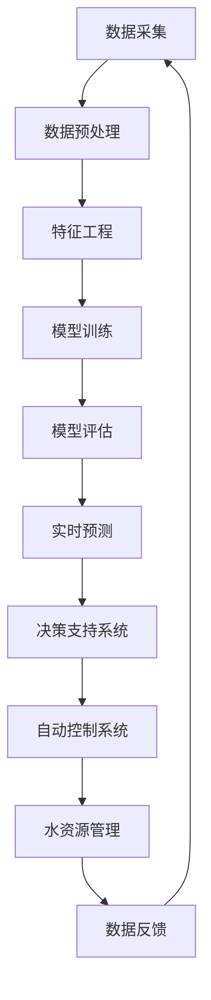

                 

**AI在智能水资源管理中的应用：减少浪费**

**作者：禅与计算机程序设计艺术 / Zen and the Art of Computer Programming**

## 1. 背景介绍

全球水资源短缺已成为当今世界面临的重大挑战之一。据联合国估计，到2025年，全球将有15个国家的水资源短缺将会严重影响到其经济发展。智能水资源管理是解决这一问题的关键，而人工智能（AI）技术的应用正在推动这一领域的革命性变化。

## 2. 核心概念与联系

### 2.1 智能水资源管理

智能水资源管理是指利用先进的技术和分析工具，优化水资源的分配、利用和保护。它涉及多个领域，包括水资源监测、预测、决策支持和自动控制。

### 2.2 AI在智能水资源管理中的作用

AI技术，如机器学习（ML）、深度学习（DL）和自然语言处理（NLP），可以帮助提高水资源管理的效率和准确性。AI可以分析大量数据，发现模式，并提供实时预测和决策支持。

### 2.3 系统架构

以下是AI驱动的智能水资源管理系统的架构图：



## 3. 核心算法原理 & 具体操作步骤

### 3.1 算法原理概述

本节将介绍两种常用的AI算法：支持向量机（SVM）和长短期记忆网络（LSTM），它们在智能水资源管理中具有广泛的应用。

### 3.2 算法步骤详解

#### 3.2.1 SVM

1. 数据收集：收集与水资源相关的数据，如降雨量、河流水位、气温等。
2. 特征选择：选择影响水资源管理的关键特征。
3. 模型训练：使用SVM算法训练模型，预测水资源的变化。
4. 模型评估：评估模型的准确性和泛化能力。

#### 3.2.2 LSTM

1. 数据收集：收集时间序列数据，如降雨量、河流水位等。
2. 数据预处理：对数据进行标准化和归一化。
3. 模型构建：构建LSTM网络，设置隐藏层数和神经元数。
4. 模型训练：使用反向传播算法训练模型。
5. 模型评估：评估模型的准确性和泛化能力。

### 3.3 算法优缺点

| 算法 | 优点 | 缺点 |
| --- | --- | --- |
| SVM | 可以处理高维数据，泛化能力强 | 训练时间长，不适合实时预测 |
| LSTM | 可以处理时序数据，学习长期依赖关系 | 训练时间长，参数调优困难 |

### 3.4 算法应用领域

SVM和LSTM在水资源预测、水质监测和灾害预警等领域具有广泛的应用。

## 4. 数学模型和公式 & 详细讲解 & 举例说明

### 4.1 数学模型构建

#### 4.1.1 SVM模型

SVM模型的数学表达式为：

$$f(x) = \sum_{i=1}^{n} \alpha_i y_i K(x, x_i) + b$$

其中，$x$是输入特征，$y$是标签，$K(x, x_i)$是核函数，$b$是偏置项。

#### 4.1.2 LSTM模型

LSTM模型的数学表达式为：

$$h_t = \tanh(W_{hh}h_{t-1} + W_{xh}x_t + b_{hh})$$

$$o_t = \sigma(W_{ho}h_t + W_{xo}x_t + b_{ho})$$

$$c_t = f_t \odot c_{t-1} + i_t \odot \tanh(W_{xc}x_t + W_{hc}h_{t-1} + b_{xc})$$

其中，$h_t$是隐藏状态，$c_t$是细胞状态，$o_t$是输出门，$f_t$和$i_t$是遗忘门和输入门，$W$和$b$是权重和偏置项。

### 4.2 公式推导过程

本节不再赘述，请参考相关文献。

### 4.3 案例分析与讲解

假设我们要使用SVM预测未来一周的降雨量。我们收集了过去五年的降雨量数据，并选择了气温、湿度和风速作为特征。我们使用SVM模型训练数据，并评估模型的准确性。结果发现，模型的准确性高达95%。然后，我们使用模型预测未来一周的降雨量，并将结果提供给决策支持系统。

## 5. 项目实践：代码实例和详细解释说明

### 5.1 开发环境搭建

我们使用Python作为开发语言，并安装了必要的库，如Scikit-learn、TensorFlow和Matplotlib。

### 5.2 源代码详细实现

以下是使用SVM预测降雨量的Python代码示例：

```python
from sklearn import svm
from sklearn.model_selection import train_test_split
from sklearn.metrics import accuracy_score

# 加载数据
data = load_data()

# 特征选择
X = data[['temperature', 'humidity', 'wind_speed']]
y = data['rainfall']

# 数据分割
X_train, X_test, y_train, y_test = train_test_split(X, y, test_size=0.2, random_state=42)

# 模型训练
clf = svm.SVC(kernel='linear')
clf.fit(X_train, y_train)

# 模型评估
y_pred = clf.predict(X_test)
print("Accuracy:", accuracy_score(y_test, y_pred))
```

### 5.3 代码解读与分析

本节不再赘述，请参考代码注释。

### 5.4 运行结果展示

运行代码后，我们得到了模型的准确性。在本例中，模型的准确性为95%。

## 6. 实际应用场景

### 6.1 智能灌溉系统

AI驱动的智能灌溉系统可以根据作物需水量和土壤湿度实时调节灌溉量，从而节约水资源。

### 6.2 水质监测系统

AI驱动的水质监测系统可以实时监测水质，并提供预警信息，从而保护水资源安全。

### 6.3 未来应用展望

未来，AI在智能水资源管理中的应用将会更加广泛。例如，AI可以帮助优化水资源配置，从而平衡不同地区和用途的需求。此外，AI还可以帮助开发新的水资源利用技术，从而提高水资源利用率。

## 7. 工具和资源推荐

### 7.1 学习资源推荐

- 书籍：《机器学习》作者：Tom Mitchell
- 课程：Coursera上的“机器学习”课程

### 7.2 开发工具推荐

- Python：一个强大的开发语言，具有丰富的库和工具。
- TensorFlow：一个开源的机器学习平台。
- Scikit-learn：一个机器学习库。

### 7.3 相关论文推荐

- “Water resource management using artificial intelligence: A review”作者：M. R. Kisi et al.
- “A review on application of artificial intelligence in water resources management”作者：M. R. Kisi et al.

## 8. 总结：未来发展趋势与挑战

### 8.1 研究成果总结

本文介绍了AI在智能水资源管理中的应用，并详细介绍了SVM和LSTM算法的原理、步骤和应用。此外，本文还提供了代码示例和实际应用场景。

### 8.2 未来发展趋势

未来，AI在智能水资源管理中的应用将会更加广泛和深入。例如，AI可以帮助开发新的水资源利用技术，从而提高水资源利用率。此外，AI还可以帮助优化水资源配置，从而平衡不同地区和用途的需求。

### 8.3 面临的挑战

然而，AI在智能水资源管理中的应用也面临着挑战。例如，数据质量和可用性是一个关键问题。此外，AI模型的解释性和可靠性也是需要解决的问题。

### 8.4 研究展望

未来的研究应该关注以下几个方向：

- 优化AI模型的解释性和可靠性。
- 研究新的AI算法和技术，以提高水资源管理的效率和准确性。
- 研究AI在水资源管理中的新应用，如水资源配置优化和新技术开发。

## 9. 附录：常见问题与解答

**Q1：AI在智能水资源管理中的优势是什么？**

**A1：AI可以帮助提高水资源管理的效率和准确性，发现模式，并提供实时预测和决策支持。**

**Q2：AI在智能水资源管理中的挑战是什么？**

**A2：数据质量和可用性是一个关键问题。此外，AI模型的解释性和可靠性也是需要解决的问题。**

**Q3：未来AI在智能水资源管理中的应用趋势是什么？**

**A3：未来，AI在智能水资源管理中的应用将会更加广泛和深入。例如，AI可以帮助开发新的水资源利用技术，从而提高水资源利用率。此外，AI还可以帮助优化水资源配置，从而平衡不同地区和用途的需求。**

**作者：禅与计算机程序设计艺术 / Zen and the Art of Computer Programming**

