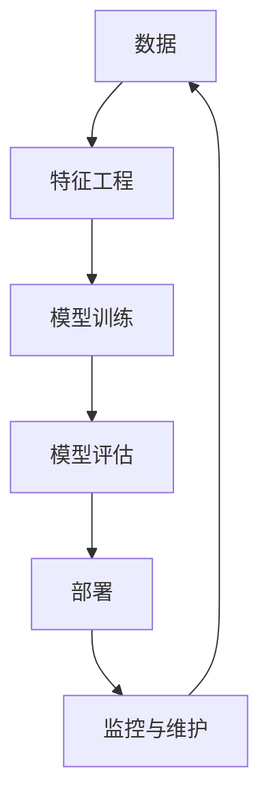

                 

## AI技术在实际应用中的挑 challenge

**作者：禅与计算机程序设计艺术 / Zen and the Art of Computer Programming**

## 1. 背景介绍

人工智能（AI）技术自诞生以来，就一直处于快速发展的状态。从简单的规则系统到当前的深度学习，AI技术已经渗透到我们的日常生活中，从搜索引擎到自动驾驶汽车，无处不在。然而，将AI技术成功应用于实际场景并非易事，存在着许多挑战。本文将深入探讨这些挑战，并提供解决方案和未来发展趋势的见解。

## 2. 核心概念与联系

在讨论AI技术在实际应用中的挑战之前，我们需要先了解一些核心概念。AI系统通常由以下几个组成部分组成：



* **数据（Data）**：AI系统的基础是数据。高质量的数据是构建有效AI模型的关键。
* **特征工程（Feature Engineering）**：从原始数据中提取有意义的特征，以便模型学习。
* **模型训练（Model Training）**：使用训练数据和特征，训练AI模型。
* **模型评估（Model Evaluation）**：评估模型的性能，并调整模型以改善性能。
* **部署（Deployment）**：将模型部署到生产环境中，以提供预测或决策支持。
* **监控与维护（Monitoring & Maintenance）**：监控模型的性能，并对模型进行维护以保持其有效性。

## 3. 核心算法原理 & 具体操作步骤

### 3.1 算法原理概述

AI技术的核心是算法。常用的AI算法包括：

* **监督学习（Supervised Learning）**：使用已标记的训练数据，学习映射输入到输出的函数。
* **非监督学习（Unsupervised Learning）**：从未标记的训练数据中学习隐藏的结构。
* **强化学习（Reinforcement Learning）**：学习通过与环境交互以最大化回报的行为策略。

### 3.2 算法步骤详解

以监督学习为例，其步骤如下：

1. 数据预处理：清洗数据，处理缺失值，并将数据转换为适合模型学习的格式。
2. 特征工程：从原始数据中提取有意义的特征。
3. 模型选择：选择适合任务的模型，如线性回归、决策树、神经网络等。
4. 模型训练：使用训练数据和特征，训练模型。
5. 模型评估：评估模型的性能，并调整模型以改善性能。
6. 模型部署：将模型部署到生产环境中，以提供预测或决策支持。

### 3.3 算法优缺点

每种算法都有其优缺点。例如：

* **监督学习**：优点是可以学习精确的映射函数，缺点是需要大量标记数据。
* **非监督学习**：优点是可以从未标记数据中学习隐藏结构，缺点是学习到的结构可能不具有解释性。
* **强化学习**：优点是可以学习最优策略，缺点是需要大量的试错过程，且收敛速度慢。

### 3.4 算法应用领域

AI算法广泛应用于各个领域，包括：

* **图像识别（Image Recognition）**：使用卷积神经网络（CNN）等模型识别图像中的对象。
* **自然语言处理（Natural Language Processing）**：使用循环神经网络（RNN）等模型处理自然语言文本。
* **推荐系统（Recommender Systems）**：使用协同过滤（Collaborative Filtering）等算法为用户推荐内容。
* **自动驾驶（Autonomous Driving）**：使用深度学习等模型感知环境并做出决策。

## 4. 数学模型和公式 & 详细讲解 & 举例说明

### 4.1 数学模型构建

数学模型是AI算法的基础。例如，线性回归模型的数学表达式为：

$$y = wx + b$$

其中，$y$是输出，$x$是输入，$w$是权重，$b$是偏置项。

### 4.2 公式推导过程

权重和偏置项可以通过最小化误差平方和（Mean Squared Error，MSE）来学习：

$$MSE = \frac{1}{n}\sum_{i=1}^{n}(y_i - \hat{y}_i)^2$$

其中，$y_i$是真实输出，$hat{y}_i$是预测输出，$n$是训练样本数。

### 4.3 案例分析与讲解

例如，假设我们要使用线性回归模型预测房价。我们可以使用房屋面积作为输入特征，并使用真实房价作为输出标签。通过最小化MSE，我们可以学习到权重和偏置项，从而构建模型。

## 5. 项目实践：代码实例和详细解释说明

### 5.1 开发环境搭建

要构建AI项目，我们需要以下开发环境：

* Python：AI项目的主要编程语言。
* Jupyter Notebook：交互式开发环境。
* TensorFlow或PyTorch：深度学习框架。
* Scikit-learn：机器学习库。

### 5.2 源代码详细实现

以下是使用Scikit-learn构建线性回归模型的示例代码：

```python
from sklearn.linear_model import LinearRegression
from sklearn.model_selection import train_test_split
from sklearn.metrics import mean_squared_error

# 加载数据
X, y = load_data()

# 分割数据
X_train, X_test, y_train, y_test = train_test_split(X, y, test_size=0.2, random_state=42)

# 创建模型
model = LinearRegression()

# 训练模型
model.fit(X_train, y_train)

# 预测
y_pred = model.predict(X_test)

# 评估模型
mse = mean_squared_error(y_test, y_pred)
print(f'Mean Squared Error: {mse}')
```

### 5.3 代码解读与分析

代码首先加载数据，然后将数据分成训练集和测试集。之后，创建线性回归模型，并使用训练数据训练模型。然后，使用测试数据预测输出，并计算MSE来评估模型的性能。

### 5.4 运行结果展示

运行代码后，我们可以看到MSE的值。如果MSE很小，则说明模型的性能很好。否则，我们需要调整模型或收集更多的数据。

## 6. 实际应用场景

AI技术在实际应用中面临着许多挑战。以下是一些常见挑战及其解决方案：

### 6.1 数据质量

实际数据往往是不完整的、噪声的、不平衡的。解决方案包括数据清洗、数据增强、数据平衡等技术。

### 6.2 计算资源

AI模型往往需要大量的计算资源。解决方案包括使用云计算、分布式计算等技术。

### 6.3 解释性

深度学习模型往往是黑箱模型，很难解释其决策过程。解决方案包括使用可解释的模型、使用可视化工具等。

### 6.4 未来应用展望

未来，AI技术将继续渗透到更多领域，如自动驾驶、医疗保健、城市管理等。然而，这些领域往往有严格的安全和隐私要求，需要开发更安全、更隐私保护的AI技术。

## 7. 工具和资源推荐

### 7.1 学习资源推荐

* Andrew Ng的机器学习课程（https://www.coursera.org/learn/machine-learning）
* Hands-On Machine Learning with Scikit-Learn, Keras, and TensorFlow（https://www.oreilly.com/library/view/hands-on-machine-learning/9781492032632/）
* Deep Learning Specialization by Andrew Ng（https://www.coursera.org/specializations/deep-learning）

### 7.2 开发工具推荐

* Jupyter Notebook
* TensorFlow或PyTorch
* Scikit-learn
* Keras

### 7.3 相关论文推荐

* Goodfellow, I., Bengio, Y., & Courville, A. (2016). Deep learning. MIT press.
* Hastie, T., Tibshirani, R., & Friedman, J. H. (2009). The elements of statistical learning: data mining, inference, and prediction. Springer.

## 8. 总结：未来发展趋势与挑战

### 8.1 研究成果总结

本文讨论了AI技术在实际应用中的挑战，并提供了解决方案和未来发展趋势的见解。我们讨论了核心概念、算法原理、数学模型、项目实践等主题。

### 8.2 未来发展趋势

未来，AI技术将继续发展，并渗透到更多领域。我们将看到更小、更智能的设备，更好的自然语言处理技术，更好的图像识别技术等。

### 8.3 面临的挑战

然而，AI技术也面临着挑战。数据质量、计算资源、解释性等问题是需要解决的关键问题。

### 8.4 研究展望

未来的研究将集中在以下几个方向：

* 更好的数据处理技术，以处理不完整、噪声、不平衡的数据。
* 更高效的计算技术，以满足AI模型的计算需求。
* 更好的解释性技术，以帮助理解深度学习模型的决策过程。
* 更安全、更隐私保护的AI技术，以满足严格的安全和隐私要求。

## 9. 附录：常见问题与解答

**Q：AI技术在实际应用中面临着哪些挑战？**

A：AI技术在实际应用中面临着数据质量、计算资源、解释性等挑战。

**Q：如何解决数据质量问题？**

A：解决方案包括数据清洗、数据增强、数据平衡等技术。

**Q：如何解决计算资源问题？**

A：解决方案包括使用云计算、分布式计算等技术。

**Q：如何解决解释性问题？**

A：解决方案包括使用可解释的模型、使用可视化工具等。

**Q：未来AI技术的发展趋势是什么？**

A：未来，AI技术将继续发展，并渗透到更多领域。我们将看到更小、更智能的设备，更好的自然语言处理技术，更好的图像识别技术等。

**Q：未来AI技术面临的挑战是什么？**

A：未来的挑战包括数据质量、计算资源、解释性等问题。

**Q：未来AI技术的研究方向是什么？**

A：未来的研究将集中在更好的数据处理技术、更高效的计算技术、更好的解释性技术、更安全、更隐私保护的AI技术等方向。

**作者：禅与计算机程序设计艺术 / Zen and the Art of Computer Programming**

