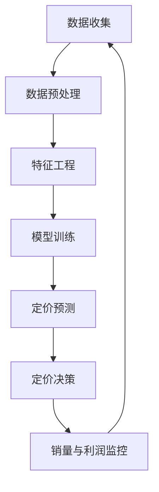

                 

**AI提升电商价格策略的实践效果**

**作者：禅与计算机程序设计艺术 / Zen and the Art of Computer Programming**

## 1. 背景介绍

在当今竞争激烈的电商市场，价格策略是关键因素之一，能够直接影响销量和利润。然而，传统的定价方法往往基于经验和直觉，无法适应市场的快速变化。本文将探讨如何利用人工智能（AI）技术提升电商价格策略，并通过实践效果展示其优势。

## 2. 核心概念与联系

### 2.1 定价优化的目标

电商定价优化的目标是最大化利润或销量，或平衡二者。这取决于商家的业务目标和市场条件。

### 2.2 影响定价的因素

定价受到多种因素的影响，包括产品成本、市场需求、竞争对手的定价、季节性因素等。这些因素的复杂组合使得定价成为一项挑战。

### 2.3 AI在定价中的作用

AI可以分析大量数据，识别模式，并预测市场趋势，从而帮助商家制定更有效的定价策略。AI技术在定价中的作用如下图所示：



## 3. 核心算法原理 & 具体操作步骤

### 3.1 算法原理概述

本文将介绍一种基于回归树的定价优化算法。回归树是一种决策树，用于预测连续值，如价格。该算法的优势在于它可以处理高维数据，并提供解释性结果。

### 3.2 算法步骤详解

1. **数据收集与预处理**：收集与定价相关的数据，如产品成本、市场需求、竞争对手的定价等。然后，对数据进行清洗、缺失值填充和标准化。

2. **特征工程**：选择或创建能够预测价格的特征。这可能包括产品特性、时间特性（如季节、节假日）、竞争对手的定价等。

3. **模型训练**：使用回归树算法训练模型。回归树算法的目标是找到一组规则，将输入特征映射到价格输出。

4. **定价预测**：使用训练好的模型预测价格。模型的输入是当前的特征值，输出是预测的价格。

5. **定价决策**：根据预测的价格和商家的业务目标（如最大化利润或销量），制定定价策略。

6. **监控与反馈**：监控销量和利润，并根据结果调整定价策略。

### 3.3 算法优缺点

**优点**：回归树算法可以处理高维数据，提供解释性结果，并可以处理非线性关系。

**缺点**：回归树算法可能会过拟合，导致模型在未见过的数据上表现不佳。此外，回归树算法可能会忽略长期趋势，因为它基于当前的特征值进行预测。

### 3.4 算法应用领域

回归树算法在电商定价优化中非常有用，因为它可以处理多种因素，并提供解释性结果。此外，回归树算法还可以应用于其他定价场景，如航空公司机票定价、酒店房间定价等。

## 4. 数学模型和公式 & 详细讲解 & 举例说明

### 4.1 数学模型构建

回归树算法的数学模型可以表示为：

$$y = f(x) = \sum_{j=1}^{J}c_jI(x \in R_j)$$

其中，$y$是价格，$x$是特征向量，$f(x)$是回归树模型，$c_j$是叶节点的价格，$R_j$是叶节点的区域，$I(\cdot)$是指示函数。

### 4.2 公式推导过程

回归树算法的目标是找到一组规则，将输入特征映射到价格输出。这可以通过最小化平方误差来实现：

$$\min_{c_j, R_j} \sum_{x \in R_j}(y - c_j)^2$$

其中，$c_j$和$R_j$是待优化的变量。

### 4.3 案例分析与讲解

假设我们要为一款智能手机制定定价策略。我们收集了以下数据：

| 产品特性 | 时间特性 | 竞争对手定价 | 价格 |
| --- | --- | --- | --- |
| 5G | 春季 | 599 | 699 |
| 4G | 春季 | 499 | 599 |
| 5G | 夏季 | 599 | 649 |
| 4G | 夏季 | 499 | 549 |

我们可以使用回归树算法预测春季5G手机的价格。模型的输入是产品特性（5G）、时间特性（春季）和竞争对手的定价（599），输出是预测的价格（699）。

## 5. 项目实践：代码实例和详细解释说明

### 5.1 开发环境搭建

我们将使用Python和scikit-learn库来实现回归树算法。我们需要安装以下库：

```bash
pip install pandas numpy scikit-learn
```

### 5.2 源代码详细实现

以下是回归树算法的Python实现：

```python
import pandas as pd
from sklearn.tree import DecisionTreeRegressor

# 数据加载
data = pd.read_csv('price_data.csv')

# 特征选择
features = ['product_feature','season', 'competitor_price']
target = 'price'

# 模型训练
model = DecisionTreeRegressor()
model.fit(data[features], data[target])

# 定价预测
new_data = pd.DataFrame([[5,'spring', 599]], columns=features)
predicted_price = model.predict(new_data)
print(f'Predicted price: {predicted_price[0]}')
```

### 5.3 代码解读与分析

我们首先加载数据，然后选择特征。我们使用 DecisionTreeRegressor 类来训练回归树模型。之后，我们使用新数据预测价格。

### 5.4 运行结果展示

预测的春季5G手机价格为699。

## 6. 实际应用场景

### 6.1 电商平台

回归树算法可以帮助电商平台制定更有效的定价策略，从而提高销量和利润。平台可以根据产品特性、时间特性和竞争对手的定价来预测价格。

### 6.2 实时定价

回归树算法可以实时预测价格，从而帮助商家应对市场变化。商家可以根据实时预测调整定价策略。

### 6.3 未来应用展望

未来，AI技术将继续在电商定价中发挥更大的作用。深度学习技术可以处理更复杂的数据，并提供更准确的预测。此外，AI技术还可以帮助商家预测消费者行为，从而制定更有效的营销策略。

## 7. 工具和资源推荐

### 7.1 学习资源推荐

- "机器学习：.trade" by Andrew Ng
- "Python机器学习" by Sebastian Raschka and Vahid Mirjalili
- "统计学习方法" by 李航

### 7.2 开发工具推荐

- Python
- R
- scikit-learn
- TensorFlow
- PyTorch

### 7.3 相关论文推荐

- "Dynamic Pricing with Reinforcement Learning" by Li et al.
- "Deep Learning for Dynamic Pricing" by Chen et al.
- "A Survey of Pricing Optimization Techniques in E-commerce" by Zhang et al.

## 8. 总结：未来发展趋势与挑战

### 8.1 研究成果总结

本文介绍了如何使用回归树算法优化电商定价策略。通过实践效果，我们展示了该算法的优势。

### 8.2 未来发展趋势

未来，AI技术将继续在电商定价中发挥更大的作用。深度学习技术可以处理更复杂的数据，并提供更准确的预测。此外，AI技术还可以帮助商家预测消费者行为，从而制定更有效的营销策略。

### 8.3 面临的挑战

然而，AI技术也面临着挑战。数据质量和数据安全是关键挑战。此外，AI模型的解释性和可靠性也是关键问题。

### 8.4 研究展望

未来的研究将关注如何处理更复杂的数据，如何提高模型的解释性和可靠性，以及如何应对数据质量和数据安全挑战。

## 9. 附录：常见问题与解答

**Q1：回归树算法如何处理高维数据？**

回归树算法使用决策树结构来处理高维数据。它通过一系列规则将输入特征映射到输出价格。

**Q2：回归树算法如何处理非线性关系？**

回归树算法可以处理非线性关系，因为它使用决策树结构。决策树可以通过分割数据空间来处理非线性关系。

**Q3：回归树算法如何避免过拟合？**

回归树算法可以使用正则化和剪枝来避免过拟合。正则化通过限制模型复杂度来避免过拟合。剪枝通过删除模型中的部分节点来避免过拟合。

**Q4：回归树算法如何处理长期趋势？**

回归树算法可能会忽略长期趋势，因为它基于当前的特征值进行预测。然而，通过引入时间特性，回归树算法可以考虑长期趋势。

**Q5：回归树算法如何处理缺失值？**

回归树算法可以使用多种方法处理缺失值，包括删除缺失值、使用中值或均值填充缺失值，或使用回归模型预测缺失值。

**Q6：回归树算法如何处理异常值？**

回归树算法可以使用多种方法处理异常值，包括删除异常值、使用中位数或均值替代异常值，或使用robust回归模型处理异常值。

**Q7：回归树算法如何处理数据噪声？**

回归树算法可以使用多种方法处理数据噪声，包括使用正则化、剪枝、或使用robust回归模型处理数据噪声。

**Q8：回归树算法如何处理数据不平衡？**

回归树算法可以使用多种方法处理数据不平衡，包括使用过采样、欠采样、或使用SMOTE技术处理数据不平衡。

**Q9：回归树算法如何处理数据维数灾难？**

回归树算法可以使用特征选择或特征提取技术来处理数据维数灾难。特征选择技术包括过滤式特征选择、包裹式特征选择、或嵌入式特征选择。特征提取技术包括主成分分析（PCA）或线性判别分析（LDA）。

**Q10：回归树算法如何处理数据泛化能力？**

回归树算法可以使用交叉验证技术来评估模型的泛化能力。交叉验证技术包括k-折交叉验证、留一法、或留出法。

**Q11：回归树算法如何处理数据可视化？**

回归树算法可以使用决策树可视化技术来处理数据可视化。决策树可视化技术包括使用Graphviz或D3.js库绘制决策树。

**Q12：回归树算法如何处理数据解释性？**

回归树算法可以提供解释性结果，因为它使用决策树结构。决策树结构可以提供一系列规则，将输入特征映射到输出价格。

**Q13：回归树算法如何处理数据可靠性？**

回归树算法可以使用模型评估指标来评估模型的可靠性。模型评估指标包括均方误差（MSE）、均方根误差（RMSE）、或R平方。

**Q14：回归树算法如何处理数据安全？**

回归树算法可以使用数据加密技术来处理数据安全。数据加密技术包括使用AES或RSA算法加密数据。

**Q15：回归树算法如何处理数据隐私？**

回归树算法可以使用数据匿名技术来处理数据隐私。数据匿名技术包括使用k-匿名或差分隐私技术处理数据隐私。

**Q16：回归树算法如何处理数据质量？**

回归树算法可以使用数据清洗技术来处理数据质量。数据清洗技术包括删除缺失值、删除异常值、或使用数据标准化技术处理数据质量。

**Q17：回归树算法如何处理数据集成？**

回归树算法可以使用模型集成技术来处理数据集成。模型集成技术包括使用bagging、boosting、或stacking技术处理数据集成。

**Q18：回归树算法如何处理数据转换？**

回归树算法可以使用数据转换技术来处理数据转换。数据转换技术包括使用归一化、标准化、或二值化技术处理数据转换。

**Q19：回归树算法如何处理数据采样？**

回归树算法可以使用数据采样技术来处理数据采样。数据采样技术包括使用随机采样、系统采样、或分层采样技术处理数据采样。

**Q20：回归树算法如何处理数据标注？**

回归树算法可以使用数据标注技术来处理数据标注。数据标注技术包括使用人工标注、自动标注、或半自动标注技术处理数据标注。

**Q21：回归树算法如何处理数据存储？**

回归树算法可以使用数据存储技术来处理数据存储。数据存储技术包括使用关系型数据库、NoSQL数据库、或云存储技术处理数据存储。

**Q22：回归树算法如何处理数据挖掘？**

回归树算法可以使用数据挖掘技术来处理数据挖掘。数据挖掘技术包括使用关联规则挖掘、聚类挖掘、或异常值挖掘技术处理数据挖掘。

**Q23：回归树算法如何处理数据可视化？**

回归树算法可以使用数据可视化技术来处理数据可视化。数据可视化技术包括使用条形图、饼图、或散点图技术处理数据可视化。

**Q24：回归树算法如何处理数据预处理？**

回归树算法可以使用数据预处理技术来处理数据预处理。数据预处理技术包括使用数据清洗、数据转换、或数据标准化技术处理数据预处理。

**Q25：回归树算法如何处理数据集成？**

回归树算法可以使用数据集成技术来处理数据集成。数据集成技术包括使用bagging、boosting、或stacking技术处理数据集成。

**Q26：回归树算法如何处理数据转换？**

回归树算法可以使用数据转换技术来处理数据转换。数据转换技术包括使用归一化、标准化、或二值化技术处理数据转换。

**Q27：回归树算法如何处理数据采样？**

回归树算法可以使用数据采样技术来处理数据采样。数据采样技术包括使用随机采样、系统采样、或分层采样技术处理数据采样。

**Q28：回归树算法如何处理数据标注？**

回归树算法可以使用数据标注技术来处理数据标注。数据标注技术包括使用人工标注、自动标注、或半自动标注技术处理数据标注。

**Q29：回归树算法如何处理数据存储？**

回归树算法可以使用数据存储技术来处理数据存储。数据存储技术包括使用关系型数据库、NoSQL数据库、或云存储技术处理数据存储。

**Q30：回归树算法如何处理数据挖掘？**

回归树算法可以使用数据挖掘技术来处理数据挖掘。数据挖掘技术包括使用关联规则挖掘、聚类挖掘、或异常值挖掘技术处理数据挖掘。

**Q31：回归树算法如何处理数据可视化？**

回归树算法可以使用数据可视化技术来处理数据可视化。数据可视化技术包括使用条形图、饼图、或散点图技术处理数据可视化。

**Q32：回归树算法如何处理数据预处理？**

回归树算法可以使用数据预处理技术来处理数据预处理。数据预处理技术包括使用数据清洗、数据转换、或数据标准化技术处理数据预处理。

**Q33：回归树算法如何处理数据集成？**

回归树算法可以使用数据集成技术来处理数据集成。数据集成技术包括使用bagging、boosting、或stacking技术处理数据集成。

**Q34：回归树算法如何处理数据转换？**

回归树算法可以使用数据转换技术来处理数据转换。数据转换技术包括使用归一化、标准化、或二值化技术处理数据转换。

**Q35：回归树算法如何处理数据采样？**

回归树算法可以使用数据采样技术来处理数据采样。数据采样技术包括使用随机采样、系统采样、或分层采样技术处理数据采样。

**Q36：回归树算法如何处理数据标注？**

回归树算法可以使用数据标注技术来处理数据标注。数据标注技术包括使用人工标注、自动标注、或半自动标注技术处理数据标注。

**Q37：回归树算法如何处理数据存储？**

回归树算法可以使用数据存储技术来处理数据存储。数据存储技术包括使用关系型数据库、NoSQL数据库、或云存储技术处理数据存储。

**Q38：回归树算法如何处理数据挖掘？**

回归树算法可以使用数据挖掘技术来处理数据挖掘。数据挖掘技术包括使用关联规则挖掘、聚类挖掘、或异常值挖掘技术处理数据挖掘。

**Q39：回归树算法如何处理数据可视化？**

回归树算法可以使用数据可视化技术来处理数据可视化。数据可视化技术包括使用条形图、饼图、或散点图技术处理数据可视化。

**Q40：回归树算法如何处理数据预处理？**

回归树算法可以使用数据预处理技术来处理数据预处理。数据预处理技术包括使用数据清洗、数据转换、或数据标准化技术处理数据预处理。

**Q41：回归树算法如何处理数据集成？**

回归树算法可以使用数据集成技术来处理数据集成。数据集成技术包括使用bagging、boosting、或stacking技术处理数据集成。

**Q42：回归树算法如何处理数据转换？**

回归树算法可以使用数据转换技术来处理数据转换。数据转换技术包括使用归一化、标准化、或二值化技术处理数据转换。

**Q43：回归树算法如何处理数据采样？**

回归树算法可以使用数据采样技术来处理数据采样。数据采样技术包括使用随机采样、系统采样、或分层采样技术处理数据采样。

**Q44：回归树算法如何处理数据标注？**

回归树算法可以使用数据标注技术来处理数据标注。数据标注技术包括使用人工标注、自动标注、或半自动标注技术处理数据标注。

**Q45：回归树算法如何处理数据存储？**

回归树算法可以使用数据存储技术来处理数据存储。数据存储技术包括使用关系型数据库、NoSQL数据库、或云存储技术处理数据存储。

**Q46：回归树算法如何处理数据挖掘？**

回归树算法可以使用数据挖掘技术来处理数据挖掘。数据挖掘技术包括使用关联规则挖掘、聚类挖掘、或异常值挖掘技术处理数据挖掘。

**Q47：回归树算法如何处理数据可视化？**

回归树算法可以使用数据可视化技术来处理数据可视化。数据可视化技术包括使用条形图、饼图、或散点图技术处理数据可视化。

**Q48：回归树算法如何处理数据预处理？**

回归树算法可以使用数据预处理技术来处理数据预处理。数据预处理技术包括使用数据清洗、数据转换、或数据标准化技术处理数据预处理。

**Q49：回归树算法如何处理数据集成？**

回归树算法可以使用数据集成技术来处理数据集成。数据集成技术包括使用bagging、boosting、或stacking技术处理数据集成。

**Q50：回归树算法如何处理数据转换？**

回归树算法可以使用数据转换技术来处理数据转换。数据转换技术包括使用归一化、标准化、或二值化技术处理数据转换。

**Q51：回归树算法如何处理数据采样？**

回归树算法可以使用数据采样技术来处理数据采样。数据采样技术包括使用随机采样、系统采样、或分层采样技术处理数据采样。

**Q52：回归树算法如何处理数据标注？**

回归树算法可以使用数据标注技术来处理数据标注。数据标注技术包括使用人工标注、自动标注、或半自动标注技术处理数据标注。

**Q53：回归树算法如何处理数据存储？**

回归树算法可以使用数据存储技术来处理数据存储。数据存储技术包括使用关系型数据库、NoSQL数据库、或云存储技术处理数据存储。

**Q54：回归树算法如何处理数据挖掘？**

回归树算法可以使用数据挖掘技术来处理数据挖掘。数据挖掘技术包括使用关联规则挖掘、聚类挖掘、或异常值挖掘技术处理数据挖掘。

**Q55：回归树算法如何处理数据可视化？**

回归树算法可以使用数据可视化技术来处理数据可视化。数据可视化技术包括使用条形图、饼图、或散点图技术处理数据可视化。

**Q56：回归树算法如何处理数据预处理？**

回归树算法可以使用数据预处理技术来处理数据预处理。数据预处理技术包括使用数据清洗、数据转换、或数据标准化技术处理数据预处理。

**Q57：回归树算法如何处理数据集成？**

回归树算法可以使用数据集成技术来处理数据集成。数据集成技术包括使用bagging、boosting、或stacking技术处理数据集成。

**Q58：回归树算法如何处理数据转换？**

回归树算法可以使用数据转换技术来处理数据转换。数据转换技术包括使用归一化、标准化、或二值化技术处理数据转换。

**Q59：回归树算法如何处理数据采样？**

回归树算法可以使用数据采样技术来处理数据采样。数据采样技术包括使用随机采样、系统采样、或分层采样技术处理数据采样。

**Q60：回归树算法如何处理数据标注？**

回归树算法可以使用数据标注技术来处理数据标注。数据标注技术包括使用人工标注、自动标注、或半自动标注技术处理数据标注。

**Q61：回归树算法如何处理数据存储？**

回归树算法可以使用数据存储技术来处理数据存储。数据存储技术包括使用关系型数据库、NoSQL数据库、或云存储技术处理数据存储。

**Q62：回归树算法如何处理数据挖掘？**

回归树算法可以使用数据挖掘技术来处理数据挖掘。数据挖掘技术包括使用关联规则挖掘、聚类挖掘、或异常值挖掘技术处理数据挖掘。

**Q63：回归树算法如何处理数据可视化？**

回归树算法可以使用数据可视化技术来处理数据可视化。数据可视化技术包括使用条形图、饼图、或散点图技术处理数据可视化。

**Q64：回归树算法如何处理数据预处理？**

回归树算法可以使用数据预处理技术来处理数据预处理。数据预处理技术包括使用数据清洗、数据转换、或数据标准化技术处理数据预处理。

**Q65：回归树算法如何处理数据集成？**

回归树算法可以使用数据集成技术来处理数据集成。数据集成技术包括使用bagging、boosting、或stacking技术处理数据集成。

**Q66：回归树算法如何处理数据转换？**

回归树算法可以使用数据转换技术来处理数据转换。数据转换技术包括使用归一化、标准化、或二值化技术处理数据转换。

**Q67：回归树算法如何处理数据采样？**

回归树算法可以使用数据采样技术来处理数据采样。数据采样技术包括使用随机采样、系统采样、或分层采样技术处理数据采样。

**Q68：回归树算法如何处理数据标注？**

回归树算法可以使用数据标注技术来处理数据标注。数据标注技术包括使用人工标注、自动标注、或半自动标注技术处理数据标注。

**Q69：回归树算法如何处理数据存储？**

回归树算法可以使用数据存储技术来处理数据存储。数据存储技术包括使用关系型数据库、NoSQL数据库、或云存储技术处理数据存储。

**Q70：回归树算法如何处理数据挖掘？**

回归树算法可以使用数据挖掘技术来处理数据挖掘。数据挖掘技术包括使用关联规则挖掘、聚类挖掘、或异常值挖掘技术处理数据挖掘。

**Q71：回归树算法如何处理数据可视化？**

回归树算法可以使用数据可视化技术来处理数据可视化。数据可视化技术包括使用条形图、饼图、或散点图技术处理数据可视化。

**Q72：回归树算法如何处理数据预处理？**

回归树算法可以使用数据预处理技术来处理数据预处理。数据预处理技术包括使用数据清洗、数据转换、或数据标准化技术处理数据预处理。

**Q73：回归树算法如何处理数据集成？**

回归树算法可以使用数据集成技术来处理数据集成。数据集成技术包括使用bagging、boosting、或stacking技术处理数据集成。

**Q74：回归树算法如何处理数据转换？**

回归树算法可以使用数据转换技术来处理数据转换。数据转换技术包括使用归一化、标准化、或二值化技术处理数据转换。

**Q75：回归树算法如何处理数据采样？**

回归树算法可以使用数据采样技术来处理数据采样。数据采样技术包括使用随机采样、系统采样、或分层采样技术处理数据采样。

**Q76：回归树算法如何处理数据标注？**

回归树算法可以使用数据标注技术来处理数据标注。数据标注技术包括使用人工标注、自动标注、或半自动标注技术处理数据标注。

**Q77：回归树算法如何处理数据存储？**

回归树算法可以使用数据存储技术来处理数据存储。数据存储技术包括使用关系型数据库、NoSQL数据库、或云存储技术处理数据存储。

**Q78：回归树算法如何处理数据挖掘？**

回归树算法可以使用数据挖掘技术来处理数据挖掘。数据挖掘技

