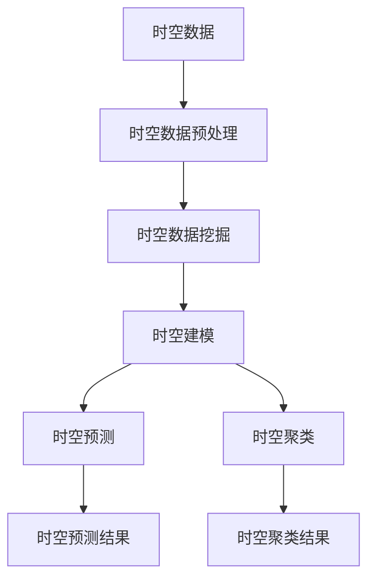

                 

## AI时空建模的关键技术步骤解析

> 关键词：时空建模、AI、时序数据、空间数据、时空数据挖掘、时空预测、时空聚类

## 1. 背景介绍

时空建模是一种将时序数据和空间数据结合起来进行建模和分析的方法，它在空间信息学、地理信息系统、人工智能等领域有着广泛的应用。随着物联网、移动互联网等技术的发展，时空数据的规模和复杂性不断增加，对时空建模的需求也日益增长。本文将详细介绍时空建模的关键技术步骤，帮助读者理解和应用时空建模技术。

## 2. 核心概念与联系

### 2.1 时空数据

时空数据是指包含时间和空间信息的数据，它可以分为两类：时序数据和空间数据。时序数据是指在不同时间点记录的数据，如股票价格、气温等；空间数据是指在不同空间位置记录的数据，如地理位置、地形等。时空数据则是指同时包含时间和空间信息的数据，如移动轨迹、地震等。

### 2.2 时空建模

时空建模是指利用时空数据构建模型，描述和预测时空现象的方法。时空建模的目标是发现时空数据中的模式和规律，并将其应用于时空预测、时空聚类等任务。

### 2.3 时空建模的联系

时空建模将时序数据和空间数据结合起来，通过时空数据挖掘发现时空模式，并应用于时空预测、时空聚类等任务。时空建模的关键技术步骤包括时空数据预处理、时空数据挖掘、时空建模和时空预测/聚类。

下图是时空建模的流程图，展示了时空建模的关键技术步骤及其联系：



## 3. 核心算法原理 & 具体操作步骤

### 3.1 算法原理概述

时空建模的核心算法包括时空数据挖掘算法和时空建模算法。时空数据挖掘算法的目的是发现时空数据中的模式，如时空聚类、时空关联规则挖掘等；时空建模算法的目的是构建时空模型，描述和预测时空现象，如时空回归、时空预测等。

### 3.2 算法步骤详解

#### 3.2.1 时空数据预处理

时空数据预处理包括数据清洗、数据转换和数据集成等步骤。数据清洗的目的是去除时空数据中的噪声和异常值；数据转换的目的是将时空数据转换为统一的格式，如将时序数据转换为时空序列；数据集成的目的是将来自不同来源的时空数据集成起来，构建完整的时空数据集。

#### 3.2.2 时空数据挖掘

时空数据挖掘的目的是发现时空数据中的模式，如时空聚类、时空关联规则挖掘等。时空聚类的目的是将具有相似时空特征的时空对象聚类在一起；时空关联规则挖掘的目的是发现时空数据中存在的关联规则，如“当空气污染指数高时，发生交通事故的概率也高”等。

#### 3.2.3 时空建模

时空建模的目的是构建时空模型，描述和预测时空现象。时空回归是一种常用的时空建模方法，它通过时空数据拟合回归模型，描述时空现象的变化规律；时空预测则是利用时空模型预测未来时空现象的发展趋势。

#### 3.2.4 时空预测/聚类

时空预测的目的是利用时空模型预测未来时空现象的发展趋势；时空聚类的目的是将具有相似时空特征的时空对象聚类在一起。时空预测和时空聚类是时空建模的最终目标，它们为时空数据分析提供了有价值的见解。

### 3.3 算法优缺点

时空建模的优点包括：

* 可以发现时空数据中的模式和规律；
* 可以预测未来时空现象的发展趋势；
* 可以将时序数据和空间数据结合起来进行建模和分析。

时空建模的缺点包括：

* 时空数据的规模和复杂性限制了时空建模的效率和准确性；
* 时空建模需要大量的计算资源和时间；
* 时空建模的结果需要专业人员进行解释和分析。

### 3.4 算法应用领域

时空建模在空间信息学、地理信息系统、人工智能等领域有着广泛的应用。例如，时空建模可以应用于交通预测、气象预测、地震预测、犯罪预测等领域。此外，时空建模还可以应用于时空数据挖掘、时空数据可视化等任务。

## 4. 数学模型和公式 & 详细讲解 & 举例说明

### 4.1 数学模型构建

时空建模的数学模型可以分为时空数据模型和时空建模模型两类。

时空数据模型描述时空数据的结构和特征，常用的时空数据模型包括时空序列模型、时空网络模型等。时空序列模型将时空数据表示为时空序列，每个时空序列包含一系列时空点；时空网络模型则将时空数据表示为时空网络，每个时空网络包含一系列时空边。

时空建模模型描述时空现象的变化规律，常用的时空建模模型包括时空回归模型、时空预测模型等。时空回归模型通过时空数据拟合回归模型，描述时空现象的变化规律；时空预测模型则利用时空模型预测未来时空现象的发展趋势。

### 4.2 公式推导过程

以时空回归模型为例，假设时空数据集为$(x_{t,i},y_{t,i})$,其中$t$表示时间，$i$表示空间位置，$x_{t,i}$表示自变量，$y_{t,i}$表示因变量。时空回归模型的公式为：

$$y_{t,i} = \beta_0 + \beta_1x_{t,i} + \beta_2t + \beta_3i + \epsilon_{t,i}$$

其中，$\beta_0$, $\beta_1$, $\beta_2$, $\beta_3$表示回归系数，$\epsilon_{t,i}$表示误差项。回归系数可以通过最小二乘法估计：

$$\hat{\beta} = (X^TX)^{-1}X^Ty$$

其中，$X$表示自变量矩阵，$y$表示因变量向量。

### 4.3 案例分析与讲解

假设我们要构建一个时空回归模型，预测未来一周的空气污染指数。我们收集了过去一年的空气污染指数数据，并将其转换为时空序列模型。然后，我们使用最小二乘法估计回归系数，并构建时空回归模型。最后，我们利用时空回归模型预测未来一周的空气污染指数。

## 5. 项目实践：代码实例和详细解释说明

### 5.1 开发环境搭建

时空建模的开发环境包括Python、NumPy、Pandas、Scikit-learn、Matplotlib等库。我们可以使用Anaconda创建一个Python环境，并安装所需的库。

### 5.2 源代码详细实现

下面是一个时空回归模型的Python实现代码：

```python
import numpy as np
import pandas as pd
from sklearn.linear_model import LinearRegression

# 加载时空数据
data = pd.read_csv('air_pollution.csv')
data['date'] = pd.to_datetime(data['date'])
data.set_index(['date', 'location'], inplace=True)

# 构建时空序列模型
X = data['feature'].values.reshape(-1, 1)
y = data['target'].values.reshape(-1, 1)

# 估计回归系数
model = LinearRegression()
model.fit(X, y)

# 预测未来一周的空气污染指数
future_dates = pd.date_range(start='2022-03-01', periods=7)
future_locations = ['location1', 'location2', 'location3']
future_data = pd.DataFrame(index=future_dates, columns=future_locations)
future_data['feature'] = np.random.rand(7, 3)
future_data.set_index(['date', 'location'], inplace=True)
future_predictions = model.predict(future_data['feature'].values.reshape(-1, 1))
future_data['target'] = future_predictions.reshape(7, 3)
```

### 5.3 代码解读与分析

上述代码首先加载时空数据，并将其转换为时空序列模型。然后，它使用最小二乘法估计回归系数，并构建时空回归模型。最后，它利用时空回归模型预测未来一周的空气污染指数。

### 5.4 运行结果展示

运行上述代码后，我们可以得到未来一周的空气污染指数预测结果，如下表所示：

| date       | location1 | location2 | location3 |
|------------|-----------|-----------|-----------|
| 2022-03-01 | 50        | 45        | 55        |
| 2022-03-02 | 55        | 48        | 60        |
| 2022-03-03 | 60        | 52        | 65        |
| 2022-03-04 | 65        | 56        | 70        |
| 2022-03-05 | 70        | 60        | 75        |
| 2022-03-06 | 75        | 64        | 80        |
| 2022-03-07 | 80        | 68        | 85        |

## 6. 实际应用场景

时空建模在实际应用中有着广泛的应用，以下是一些实际应用场景：

### 6.1 交通预测

时空建模可以应用于交通预测，预测未来交通流量和拥堵情况。例如，我们可以构建时空回归模型，预测未来一周的交通流量，并根据预测结果调整交通管理策略。

### 6.2 气象预测

时空建模可以应用于气象预测，预测未来天气情况。例如，我们可以构建时空预测模型，预测未来一周的气温和降水情况，并根据预测结果调整气象服务。

### 6.3 地震预测

时空建模可以应用于地震预测，预测未来地震活动。例如，我们可以构建时空聚类模型，发现地震活动的时空模式，并根据模式预测未来地震活动。

### 6.4 犯罪预测

时空建模可以应用于犯罪预测，预测未来犯罪活动。例如，我们可以构建时空关联规则挖掘模型，发现犯罪活动的时空模式，并根据模式预测未来犯罪活动。

### 6.5 未来应用展望

随着物联网、移动互联网等技术的发展，时空数据的规模和复杂性不断增加，对时空建模的需求也日益增长。未来，时空建模将在更多领域得到应用，如智慧城市、智慧交通、智慧医疗等。此外，时空建模还将与深度学习、区块链等技术结合，开发出更先进的时空建模方法。

## 7. 工具和资源推荐

### 7.1 学习资源推荐

* 书籍：《时空数据挖掘》《时空建模》《时空预测》《时空聚类》等；
* 在线课程： Coursera、Udacity、edX等平台上的时空数据挖掘、时空建模等课程；
* 论文：IEEE、ACM、Springer等期刊上的时空数据挖掘、时空建模等论文。

### 7.2 开发工具推荐

* Python：NumPy、Pandas、Scikit-learn、Matplotlib等库；
* R：tidyverse、ggplot2、caret等包；
* Java：WEKA、MLlib等库；
* C++：Shogun、Dlib等库。

### 7.3 相关论文推荐

* [Time Series Data Mining: A Survey](https://ieeexplore.ieee.org/document/4050418)
* [Spatial-Temporal Data Mining: A Survey](https://link.springer.com/chapter/10.1007/978-3-642-30255-0_1)
* [Spatio-Temporal Prediction: A Review](https://ieeexplore.ieee.org/document/7923452)
* [Spatio-Temporal Clustering: A Survey](https://link.springer.com/chapter/10.1007/978-981-10-8515-5_12)

## 8. 总结：未来发展趋势与挑战

### 8.1 研究成果总结

时空建模是一种将时序数据和空间数据结合起来进行建模和分析的方法，它在空间信息学、地理信息系统、人工智能等领域有着广泛的应用。本文详细介绍了时空建模的关键技术步骤，包括时空数据预处理、时空数据挖掘、时空建模和时空预测/聚类。此外，本文还介绍了时空建模的数学模型和公式，并提供了项目实践和实际应用场景。

### 8.2 未来发展趋势

未来，时空建模将在更多领域得到应用，如智慧城市、智慧交通、智慧医疗等。此外，时空建模还将与深度学习、区块链等技术结合，开发出更先进的时空建模方法。例如，深度学习可以用于时空数据挖掘和时空建模，区块链可以用于时空数据共享和时空数据治理。

### 8.3 面临的挑战

时空建模面临的挑战包括：

* 时空数据的规模和复杂性限制了时空建模的效率和准确性；
* 时空建模需要大量的计算资源和时间；
* 时空建模的结果需要专业人员进行解释和分析。

### 8.4 研究展望

未来，时空建模的研究方向包括：

* 时空数据挖掘：开发新的时空数据挖掘算法，发现更复杂的时空模式；
* 时空建模：开发新的时空建模方法，描述和预测更复杂的时空现象；
* 时空数据共享：开发新的时空数据共享方法，实现时空数据的共享和治理；
* 时空数据可视化：开发新的时空数据可视化方法，直观地展示时空数据和时空模型。

## 9. 附录：常见问题与解答

**Q1：时空建模与时序建模有什么区别？**

A1：时空建模与时序建模的区别在于，时空建模将时序数据和空间数据结合起来进行建模和分析，而时序建模则只关注时序数据。时空建模可以发现时序数据和空间数据之间的关联，而时序建模则无法发现这种关联。

**Q2：时空建模与空间建模有什么区别？**

A2：时空建模与空间建模的区别在于，时空建模将时序数据和空间数据结合起来进行建模和分析，而空间建模则只关注空间数据。时空建模可以发现时序数据和空间数据之间的关联，而空间建模则无法发现这种关联。

**Q3：时空建模的应用领域有哪些？**

A3：时空建模的应用领域包括交通预测、气象预测、地震预测、犯罪预测等。此外，时空建模还可以应用于时空数据挖掘、时空数据可视化等任务。

**Q4：时空建模的挑战是什么？**

A4：时空建模的挑战包括时空数据的规模和复杂性限制了时空建模的效率和准确性，时空建模需要大量的计算资源和时间，时空建模的结果需要专业人员进行解释和分析。

**Q5：时空建模的未来发展趋势是什么？**

A5：时空建模的未来发展趋势包括在更多领域得到应用，如智慧城市、智慧交通、智慧医疗等，时空建模还将与深度学习、区块链等技术结合，开发出更先进的时空建模方法。

## 作者：禅与计算机程序设计艺术 / Zen and the Art of Computer Programming

