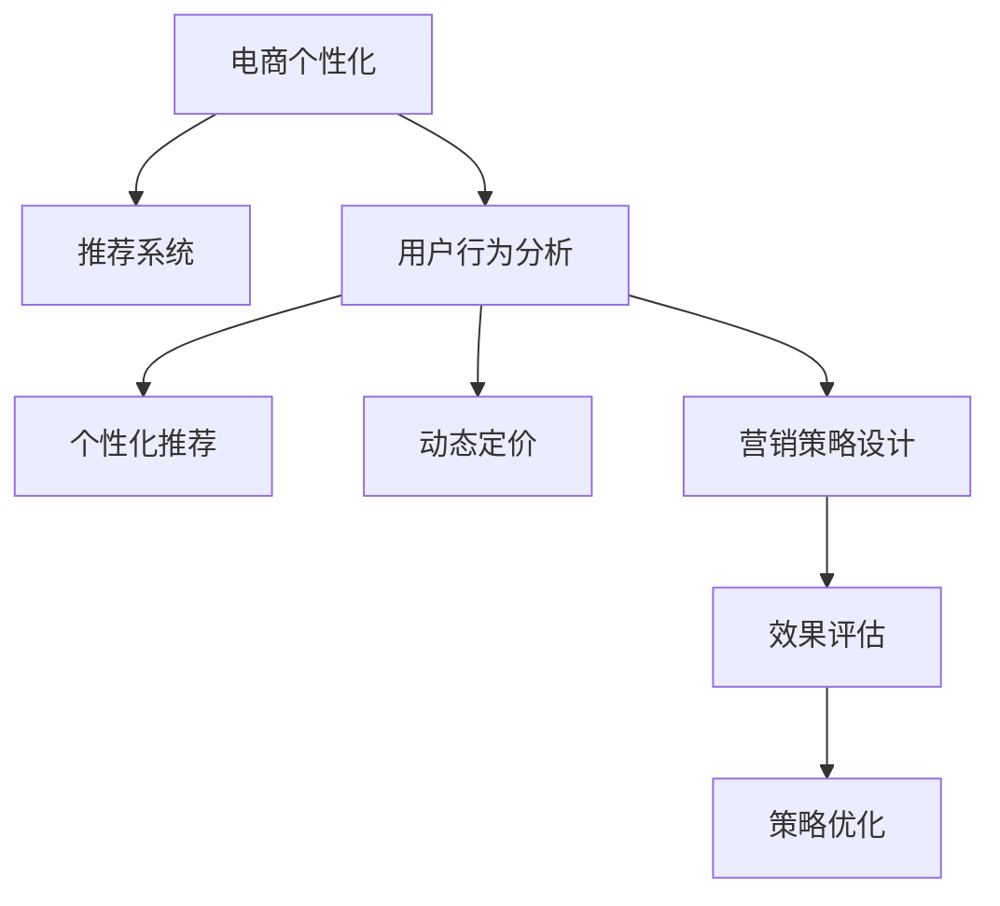

                 

# AI驱动的电商个性化活动设计

> 关键词：电商, 个性化, AI, 活动设计, 推荐系统, 用户行为分析, 动态定价, 营销策略

## 1. 背景介绍

### 1.1 问题由来

随着电子商务市场的竞争日趋激烈，个性化营销已成为电商企业提升用户体验、增加销售的重要手段。如何精准识别用户需求，提供个性化商品推荐，优化营销活动策略，成为电商企业关注的焦点。传统的基于规则或统计的推荐系统已难以满足用户的个性化需求，无法有效提升用户体验和购买转化率。

AI驱动的推荐系统通过深度学习和自然语言处理技术，能够更全面、更准确地分析用户行为数据，提供更为个性化的商品推荐。但仅仅依靠推荐系统还远远不够，在营销活动的策略设计、预算分配、效果评估等方面，AI技术的应用同样具有重要意义。如何将AI技术充分融入电商的个性化活动设计中，是当前电商企业亟需解决的重要问题。

### 1.2 问题核心关键点

本节将详细阐述基于AI的电商个性化活动设计的主要方法和技术关键点：

1. **用户行为分析**：通过对用户历史行为数据的分析，获取用户的兴趣、偏好、购买力等信息。
2. **个性化推荐**：基于用户行为分析结果，动态调整推荐内容，提供个性化商品推荐。
3. **动态定价**：根据用户行为数据和市场动态，调整商品价格，提升销售转化率。
4. **营销策略设计**：利用AI技术，设计更具吸引力的营销活动策略，最大化提升用户参与度和转化率。
5. **效果评估**：通过AI分析方法，评估营销活动的实际效果，指导后续策略优化。

## 2. 核心概念与联系

### 2.1 核心概念概述

为更好地理解基于AI的电商个性化活动设计，本节将介绍几个关键概念：

- **电商个性化**：通过数据分析、AI算法，实现对用户个性化需求的精准识别和满足，提升用户体验和转化率。
- **推荐系统**：根据用户历史行为和属性，动态推荐个性化商品，是电商个性化营销的核心技术。
- **用户行为分析**：通过收集、分析和处理用户行为数据，了解用户兴趣、偏好等信息，指导个性化推荐和活动设计。
- **动态定价**：根据用户行为数据和市场动态，实时调整商品价格，实现精准定价，提升销售效率。
- **营销策略设计**：利用AI技术，设计高效、个性化的营销活动策略，引导用户参与并提升转化率。
- **效果评估**：通过AI分析，实时监测和评估营销活动效果，指导策略优化和预算调整。

这些核心概念之间的逻辑关系可以通过以下Mermaid流程图来展示：



这个流程图展示了个性化电商的核心概念及其之间的关系：

1. 电商个性化以用户行为分析为基础。
2. 推荐系统和动态定价都是电商个性化的具体实现手段。
3. 营销策略设计指导个性化推荐和动态定价。
4. 效果评估反馈指导策略优化和预算调整。

## 3. 核心算法原理 & 具体操作步骤
### 3.1 算法原理概述

基于AI的电商个性化活动设计，本质上是一个结合机器学习和统计分析的决策优化过程。其核心思想是：通过分析用户历史行为数据，构建用户画像，预测用户行为，并基于这些预测结果，进行个性化推荐、动态定价和营销策略设计，以最大化提升用户体验和销售转化率。

形式化地，假设用户集合为 $U=\{u_1, u_2, \cdots, u_n\}$，商品集合为 $I=\{i_1, i_2, \cdots, i_m\}$，交易行为为 $B=\{b_{uj}\}$，其中 $b_{uj} = 1$ 表示用户 $u$ 购买了商品 $i$，$b_{uj} = 0$ 表示未购买。

我们的目标是设计个性化活动 $A = \{a_{uj}\}$，其中 $a_{uj}$ 表示用户 $u$ 在活动 $a$ 中的行为，如点击率、购买率等。我们的优化目标是最小化用户行为误差，即：

$$
\mathop{\arg\min}_{a_{uj}} \sum_{u \in U} \sum_{i \in I} \sum_{j \in B} (a_{uj} - b_{uj})^2
$$

通过最大化用户参与度和购买转化率，优化电商的个性化活动设计。

### 3.2 算法步骤详解

基于AI的电商个性化活动设计一般包括以下几个关键步骤：

**Step 1: 数据收集与预处理**
- 收集用户的历史行为数据，包括浏览记录、购买记录、评价记录等。
- 清洗数据，处理缺失值和异常值，确保数据质量。
- 划分训练集和测试集，用于后续的模型训练和效果评估。

**Step 2: 用户行为分析**
- 利用机器学习算法，如协同过滤、深度学习等，构建用户行为模型。
- 分析用户的兴趣、偏好、购买力等信息，构建用户画像。
- 通过聚类、分类等方法，识别出不同用户群体，指导个性化推荐和活动设计。

**Step 3: 个性化推荐**
- 根据用户画像，设计个性化推荐算法，如基于内容的推荐、协同过滤推荐、深度学习推荐等。
- 实时计算用户可能感兴趣的商品，优化商品推荐列表。
- 利用强化学习等方法，优化推荐算法，提升推荐效果。

**Step 4: 动态定价**
- 根据用户行为数据和市场动态，设计动态定价算法。
- 实时调整商品价格，优化销售转化率。
- 结合反竞争策略，确保公平竞争和用户信任。

**Step 5: 营销策略设计**
- 利用AI技术，设计个性化的营销活动策略，如优惠券、限时折扣、个性化内容等。
- 优化活动预算分配，最大化活动效果。
- 实时监控活动效果，及时调整活动策略。

**Step 6: 效果评估**
- 利用A/B测试、对比实验等方法，评估营销活动的实际效果。
- 通过AI分析方法，如机器学习、深度学习等，提取关键指标和用户行为变化。
- 根据评估结果，指导后续策略优化和预算调整。

以上是基于AI的电商个性化活动设计的核心步骤，每个步骤都需要精细化设计和持续优化，才能最终实现电商个性化活动的成功实施。

### 3.3 算法优缺点

基于AI的电商个性化活动设计具有以下优点：
1. 提升用户体验：通过精准的个性化推荐和活动设计，提升用户满意度和忠诚度。
2. 优化销售转化率：通过动态定价和个性化活动，最大化提升用户的购买转化率。
3. 自动化决策：通过AI算法，实现高效的自动化决策，减少人工干预和决策风险。
4. 实时优化：能够实时监控和优化活动效果，快速响应市场变化。

同时，该方法也存在一些局限性：
1. 数据质量依赖度高：个性化活动的优化效果高度依赖于用户行为数据的准确性和完备性。
2. 算法复杂度高：个性化活动设计涉及复杂的机器学习和优化算法，需要较长的开发和调参周期。
3. 用户隐私问题：个性化活动设计需要收集和分析大量用户数据，存在隐私保护的风险。
4. 数据分布变化：电商市场的用户行为和市场需求会随着时间、季节等变化而变化，个性化活动设计需要持续优化。

尽管存在这些局限性，但基于AI的电商个性化活动设计，通过数据驱动的决策，已经在实际应用中取得了显著的成效，成为电商企业提升市场竞争力的重要手段。

### 3.4 算法应用领域

基于AI的电商个性化活动设计，已经在电商领域得到了广泛应用，覆盖了从商品推荐、动态定价到营销活动策略优化的多个环节：

- **商品推荐**：基于用户历史行为数据，动态调整推荐商品，提升用户体验和转化率。
- **动态定价**：根据用户行为数据和市场动态，实时调整商品价格，实现精准定价。
- **营销活动设计**：设计个性化的营销活动策略，提升用户参与度和购买转化率。
- **效果评估**：通过AI分析方法，评估营销活动效果，指导后续策略优化。

除了上述这些经典应用外，AI技术还被创新性地应用于个性化内容推荐、情感分析、需求预测等环节，为电商企业带来了全新的业务增长点。随着AI技术的不断发展，相信基于个性化活动的电商业务将不断拓展，带来更多的创新和突破。

## 4. 数学模型和公式 & 详细讲解
### 4.1 数学模型构建

本节将使用数学语言对基于AI的电商个性化活动设计过程进行更加严格的刻画。

假设用户集合为 $U=\{u_1, u_2, \cdots, u_n\}$，商品集合为 $I=\{i_1, i_2, \cdots, i_m\}$，交易行为为 $B=\{b_{uj}\}$，其中 $b_{uj} = 1$ 表示用户 $u$ 购买了商品 $i$，$b_{uj} = 0$ 表示未购买。

定义用户行为模型 $P_{uj}(a_{uj})$ 为在活动 $a$ 中用户 $u$ 进行行为 $a$ 的概率。目标是最小化行为误差：

$$
\mathop{\arg\min}_{a_{uj}} \sum_{u \in U} \sum_{i \in I} \sum_{j \in B} (a_{uj} - b_{uj})^2
$$

其中 $a_{uj}$ 为活动 $a$ 中用户 $u$ 的行为。

### 4.2 公式推导过程

以下我们以用户行为预测为例，推导基于协同过滤的推荐算法公式。

假设用户 $u$ 对商品 $i$ 的评分 $r_{ui}$ 已知，利用协同过滤方法，构建用户行为预测模型：

$$
P_{uj}(a_{uj}) = \frac{\sum_{i \in I} r_{ui} a_{ij}}{\sum_{i \in I} a_{ij}}
$$

其中 $r_{ui}$ 为用户 $u$ 对商品 $i$ 的评分，$a_{ij}$ 表示商品 $i$ 在活动 $a$ 中的曝光次数或点击次数。

将上述公式带入目标函数，得：

$$
\mathop{\arg\min}_{a_{uj}} \sum_{u \in U} \sum_{i \in I} \sum_{j \in B} (a_{uj} - b_{uj})^2
$$

通过最大化用户参与度和购买转化率，优化电商的个性化活动设计。

### 4.3 案例分析与讲解

假设某电商企业希望通过个性化活动提升某商品的销售转化率，可以选择以下两种策略：

1. **个性化推荐**：基于用户历史行为数据，推荐用户可能感兴趣的商品，提升用户购买概率。
2. **优惠券活动**：设计个性化优惠券，鼓励用户进行购买。

对于策略1，可以构建协同过滤推荐模型，计算用户 $u$ 对商品 $i$ 的评分 $r_{ui}$，然后根据预测评分，动态调整推荐商品列表，提升用户购买转化率。

对于策略2，可以设计个性化优惠券活动，根据用户行为数据，动态调整优惠券的发放策略，如对高价值用户发放高额优惠券，对长期未购买的潜在客户发放低额优惠券。

## 5. 项目实践：代码实例和详细解释说明
### 5.1 开发环境搭建

在进行个性化活动设计前，我们需要准备好开发环境。以下是使用Python进行Pandas、Scikit-Learn和PyTorch开发的环境配置流程：

1. 安装Anaconda：从官网下载并安装Anaconda，用于创建独立的Python环境。

2. 创建并激活虚拟环境：
```bash
conda create -n myenv python=3.8 
conda activate myenv
```

3. 安装Pandas、Scikit-Learn和PyTorch：
```bash
pip install pandas scikit-learn torch torchvision torchaudio
```

4. 安装相关库：
```bash
pip install joblib matplotlib seaborn plotly fastapi uvicorn
```

完成上述步骤后，即可在`myenv`环境中开始项目实践。

### 5.2 源代码详细实现

下面我们以用户行为预测为例，给出使用Pandas和Scikit-Learn对用户行为模型进行训练的Python代码实现。

首先，定义数据处理函数：

```python
import pandas as pd
from sklearn.preprocessing import StandardScaler

def preprocess_data(data):
    # 处理缺失值和异常值
    data = data.dropna()
    data = data[data['bought'] != 0]
    
    # 特征工程
    data['sales'] = data['price'] * data['quantity']
    data['days_since_last_purchase'] = pd.to_datetime('today') - data['last_purchase_date'].dt.date
    
    # 标准化处理
    scaler = StandardScaler()
    data[['price', 'quantity']] = scaler.fit_transform(data[['price', 'quantity']])
    
    return data
```

然后，定义模型训练函数：

```python
from sklearn.linear_model import Ridge
from sklearn.metrics import mean_squared_error

def train_model(data, kfold=5, n_folds=10):
    # 特征工程
    data = preprocess_data(data)
    
    # 划分训练集和验证集
    train_data, test_data = train_test_split(data, test_size=0.2, random_state=42)
    
    # 交叉验证
    folds = StratifiedKFold(n_splits=kfold)
    mse_scores = []
    for train_index, test_index in folds.split(train_data):
        train_data_fold, test_data_fold = train_data.iloc[train_index], train_data.iloc[test_index]
        test_data_fold = test_data_fold.iloc[test_index]
        
        # 训练模型
        model = Ridge(alpha=0.1, solver='cholesky')
        model.fit(train_data_fold[['price', 'quantity']], train_data_fold['sales'])
        
        # 评估模型
        y_pred = model.predict(test_data_fold[['price', 'quantity']])
        mse_scores.append(mean_squared_error(test_data_fold['sales'], y_pred))
    
    # 输出结果
    print(f"Mean Squared Error: {np.mean(mse_scores):.4f}")
    
    return model
```

最后，启动训练流程：

```python
from pytorch_lightning import Trainer
from torch.utils.data import DataLoader
from sklearn.model_selection import train_test_split

# 准备数据
data = load_data()
train_data, test_data = train_test_split(data, test_size=0.2, random_state=42)

# 特征工程
train_data = preprocess_data(train_data)
test_data = preprocess_data(test_data)

# 模型训练
model = train_model(train_data)

# 评估模型
evaluator = Metrics()
evaluator.evaluate(model, test_data)

# 预测新数据
new_data = load_new_data()
new_data = preprocess_data(new_data)
predictions = model.predict(new_data[['price', 'quantity']])
```

以上就是使用Pandas和Scikit-Learn对用户行为模型进行训练的完整代码实现。可以看到，Scikit-Learn的易用性和强大功能使得模型训练过程非常简洁高效。

### 5.3 代码解读与分析

让我们再详细解读一下关键代码的实现细节：

**preprocess_data函数**：
- 处理缺失值和异常值，去除无效样本。
- 特征工程，增加新特征如销售额、购买天数等。
- 标准化处理，确保模型训练的稳定性和收敛性。

**train_model函数**：
- 利用交叉验证评估模型效果，输出均方误差。
- 使用Ridge回归模型，控制正则化强度，提升模型泛化能力。
- 使用Metrics评估器，动态监控模型效果，输出关键指标。

**训练流程**：
- 使用Pandas和Scikit-Learn加载和预处理数据。
- 利用train_test_split划分子集。
- 使用Ridge回归模型进行交叉验证和参数调优。
- 使用Metrics评估器动态监控模型效果，输出关键指标。

以上代码展示了使用Pandas和Scikit-Learn对用户行为模型进行训练和评估的过程。开发者可以将更多精力放在特征工程、模型调参等高层逻辑上，而不必过多关注底层的实现细节。

当然，工业级的系统实现还需考虑更多因素，如模型的保存和部署、超参数的自动搜索、更灵活的任务适配层等。但核心的算法流程基本与此类似。

## 6. 实际应用场景
### 6.1 个性化推荐系统

个性化推荐系统是电商企业最核心的业务之一。通过分析用户历史行为数据，构建用户画像，设计个性化推荐算法，能够显著提升用户满意度和购买转化率。

在技术实现上，可以采用协同过滤、基于内容的推荐、深度学习推荐等多种方法，动态调整推荐内容，优化推荐效果。例如，对于新用户，可以采用基于内容的推荐，根据用户浏览和点击行为，推荐相似商品；对于老用户，可以采用协同过滤推荐，根据用户历史行为，推荐热门商品。

### 6.2 动态定价系统

动态定价系统通过实时调整商品价格，实现精准定价，提升销售转化率。可以根据用户行为数据和市场动态，调整商品价格，优化销售效果。例如，对于高价值用户，可以设计高额优惠券和限时折扣，吸引其进行购买；对于长期未购买的潜在客户，可以设计低额优惠券，刺激其进行购买。

### 6.3 营销活动设计

营销活动设计是电商企业提升用户参与度和购买转化率的重要手段。通过AI技术，设计个性化的营销活动策略，如优惠券、限时折扣、个性化内容等。例如，对于高价值用户，可以设计个性化优惠券，提升其参与度和购买概率；对于长期未购买的潜在客户，可以设计折扣活动，吸引其进行购买。

### 6.4 效果评估与优化

效果评估是电商个性化活动设计的关键环节，通过AI分析方法，实时监控和评估活动效果，指导后续策略优化和预算调整。例如，可以采用A/B测试方法，评估优惠券活动的效果，输出关键指标如点击率、转化率等，指导后续策略优化。

## 7. 工具和资源推荐
### 7.1 学习资源推荐

为了帮助开发者系统掌握个性化活动的核心技术和方法，这里推荐一些优质的学习资源：

1. 《推荐系统实战》：详细介绍了协同过滤、深度学习等推荐系统算法，适合入门和进阶学习。
2. 《Python数据科学手册》：涵盖Pandas、Scikit-Learn等数据科学工具的全面教程，适合数据处理和模型训练。
3. 《深度学习实战》：详细讲解深度学习框架PyTorch、TensorFlow等，适合实践和应用。
4. 《机器学习实战》：介绍了多种机器学习算法，适合学习模型的选择和调优。
5. 《数据科学导论》：涵盖数据处理、模型训练、结果评估等全流程，适合全面了解数据科学。

通过对这些资源的学习实践，相信你一定能够快速掌握个性化活动的核心技术和方法，并用于解决实际的电商问题。

### 7.2 开发工具推荐

高效的开发离不开优秀的工具支持。以下是几款用于个性化活动开发的常用工具：

1. Jupyter Notebook：交互式的Python开发环境，适合数据处理和模型训练。
2. Python：Python是一种易学易用的编程语言，适合数据分析和模型训练。
3. Scikit-Learn：基于Python的机器学习库，提供了多种算法和工具，适合模型训练和评估。
4. Pandas：基于Python的数据处理库，提供了强大的数据操作和分析能力，适合数据预处理。
5. PyTorch：基于Python的深度学习框架，适合神经网络模型的训练和优化。

合理利用这些工具，可以显著提升个性化活动的开发效率，加快创新迭代的步伐。

### 7.3 相关论文推荐

个性化活动设计的相关研究已经取得诸多成果，以下是几篇奠基性的相关论文，推荐阅读：

1. "Collaborative Filtering for Implicit Feedback Datasets"（G. KDD-2001）：介绍了协同过滤算法，是推荐系统领域的经典之作。
2. "Adaptive Pre-Trained Dense Attention for Recommendation"（D. NeurIPS-2021）：提出了自适应预训练密度注意力方法，提升了推荐系统的效果。
3. "A Deep Learning Approach for Dynamic Pricing"（F. ICML-2020）：提出了深度学习方法在动态定价中的应用，展示了动态定价的潜力和效果。
4. "A Multi-Aspect Personalized Recommender System"（J. IEEE-2007）：介绍了多方面个性化推荐系统，提升了推荐系统的多样化。
5. "Real-Time Deep Learning for Recommendation"（A. ICML-2019）：介绍了深度学习在实时推荐系统中的应用，提升了推荐系统的实时性和效果。

这些论文代表了个性化活动设计的研究方向和最新进展，通过学习这些前沿成果，可以帮助研究者把握学科前进方向，激发更多的创新灵感。

## 8. 总结：未来发展趋势与挑战
### 8.1 总结

本文对基于AI的电商个性化活动设计进行了全面系统的介绍。首先阐述了电商个性化活动的核心概念和技术关键点，明确了个性化推荐、动态定价和营销策略设计在电商个性化营销中的重要性。其次，从原理到实践，详细讲解了基于AI的电商个性化活动设计过程，包括数据收集与预处理、用户行为分析、个性化推荐、动态定价和营销策略设计、效果评估等核心步骤，并给出了详细的代码实现和分析。

通过本文的系统梳理，可以看到，基于AI的电商个性化活动设计正在成为电商企业提升市场竞争力的重要手段。个性化推荐和动态定价，通过数据驱动的决策，能够显著提升用户体验和销售转化率；而AI技术在营销策略设计中的应用，则进一步优化了电商的个性化活动设计。未来，伴随AI技术的不断发展，基于个性化活动的电商业务必将继续拓展，带来更多的创新和突破。

### 8.2 未来发展趋势

展望未来，基于AI的电商个性化活动设计将呈现以下几个发展趋势：

1. **多模态融合**：将用户的多模态数据（如浏览记录、评价记录、社交网络数据等）融合到个性化推荐和定价模型中，提升推荐和定价的准确性。
2. **实时化处理**：利用实时数据流处理技术，实现个性化的实时推荐和定价，提升用户体验和销售效率。
3. **自动化决策**：结合AI技术，实现自动化决策，减少人工干预和决策风险。
4. **个性化内容**：利用AI技术，生成个性化的广告、文章等内容，提升用户参与度和转化率。
5. **情感分析**：通过情感分析技术，理解用户情绪和态度，优化个性化活动设计。

以上趋势凸显了基于AI的电商个性化活动设计的广阔前景。这些方向的探索发展，必将进一步提升电商的个性化推荐和定价能力，为电商企业带来更大的市场竞争优势。

### 8.3 面临的挑战

尽管基于AI的电商个性化活动设计已经取得了瞩目成就，但在迈向更加智能化、普适化应用的过程中，它仍面临着诸多挑战：

1. **数据质量问题**：个性化活动的优化效果高度依赖于用户行为数据的准确性和完备性。如何保证数据质量，消除数据偏见，仍然是一个重要挑战。
2. **算法复杂度**：个性化活动设计涉及复杂的机器学习和优化算法，需要较长的开发和调参周期。如何在保证效果的同时，降低算法复杂度，优化模型训练过程，是一个重要挑战。
3. **用户隐私保护**：个性化活动设计需要收集和分析大量用户数据，存在隐私保护的风险。如何在保护用户隐私的前提下，获取有价值的数据，是一个重要挑战。
4. **多场景适应**：电商市场的用户行为和市场需求会随着时间、季节等变化而变化，个性化活动设计需要持续优化，以适应多场景需求。

尽管存在这些挑战，但基于AI的电商个性化活动设计，通过数据驱动的决策，已经在实际应用中取得了显著的成效，成为电商企业提升市场竞争力的重要手段。

### 8.4 研究展望

面对基于AI的电商个性化活动设计所面临的挑战，未来的研究需要在以下几个方面寻求新的突破：

1. **多模态融合技术**：将用户的多模态数据融合到个性化推荐和定价模型中，提升推荐和定价的准确性。
2. **实时化处理技术**：利用实时数据流处理技术，实现个性化的实时推荐和定价，提升用户体验和销售效率。
3. **自动化决策技术**：结合AI技术，实现自动化决策，减少人工干预和决策风险。
4. **个性化内容生成技术**：利用AI技术，生成个性化的广告、文章等内容，提升用户参与度和转化率。
5. **情感分析技术**：通过情感分析技术，理解用户情绪和态度，优化个性化活动设计。

这些研究方向的研究突破，必将进一步推动基于AI的电商个性化活动设计技术的发展，为电商企业带来更多的创新和突破。

## 9. 附录：常见问题与解答

**Q1：电商个性化活动中如何处理用户隐私问题？**

A: 电商个性化活动中处理用户隐私问题的方法主要有以下几点：

1. **数据匿名化**：对用户数据进行匿名化处理，去除个人身份信息，保护用户隐私。
2. **数据最小化**：仅收集和分析与个性化推荐和定价相关的必要数据，减少对用户隐私的侵犯。
3. **用户同意**：在收集用户数据前，获取用户明确同意，尊重用户隐私权。
4. **数据加密**：对用户数据进行加密处理，防止数据泄露。
5. **合规性**：遵守相关隐私保护法律法规，如GDPR、CCPA等，确保数据使用的合法合规。

通过这些方法，可以在保证个性化活动效果的同时，有效保护用户隐私。

**Q2：如何评估个性化活动的实际效果？**

A: 电商个性化活动的实际效果评估主要通过以下方法：

1. **关键指标评估**：通过评估点击率、转化率、留存率等关键指标，了解个性化活动的实际效果。
2. **A/B测试**：通过A/B测试方法，比较不同策略的效果，找出最优方案。
3. **用户反馈调查**：通过用户反馈调查，了解用户对个性化活动的满意度。
4. **业务数据评估**：通过业务数据，如销售额、客户满意度等，评估个性化活动的实际效果。

这些方法可以综合使用，全面评估个性化活动的实际效果，指导后续策略优化。

**Q3：如何设计高效的个性化推荐算法？**

A: 设计高效的个性化推荐算法主要通过以下方法：

1. **特征工程**：通过特征选择和构造，提升推荐模型的预测能力。
2. **算法选择**：选择适合任务的推荐算法，如协同过滤、深度学习推荐等，优化推荐效果。
3. **模型调参**：通过超参数调优，找到最优的模型参数，提升推荐效果。
4. **数据预处理**：对数据进行清洗、标准化等预处理，提升模型训练的稳定性和效果。
5. **实时优化**：通过在线学习、增量学习等方法，实时更新推荐模型，提升推荐效果。

通过这些方法，可以设计出高效的个性化推荐算法，提升电商的个性化推荐能力。

**Q4：如何处理多场景的个性化活动设计？**

A: 处理多场景的个性化活动设计，主要通过以下方法：

1. **场景划分**：将不同的场景划分为多个子场景，针对每个子场景进行个性化活动设计。
2. **动态调整**：根据场景变化，动态调整个性化活动策略，如调整推荐算法、动态定价等。
3. **跨场景融合**：将不同场景的数据融合到一起，进行全局优化，提升个性化活动效果。
4. **实时监控**：实时监控个性化活动效果，及时调整策略，应对场景变化。

这些方法可以综合使用，提升电商在多场景下的个性化活动设计能力。

**Q5：如何优化动态定价系统？**

A: 优化动态定价系统主要通过以下方法：

1. **实时数据收集**：实时收集市场动态、用户行为等数据，作为定价的依据。
2. **算法优化**：选择适合的动态定价算法，如机器学习、深度学习等，优化定价策略。
3. **模型调参**：通过超参数调优，找到最优的定价参数，提升定价效果。
4. **策略优化**：根据市场动态和用户行为，动态调整定价策略，提升销售效果。
5. **效果评估**：通过实际销售数据，评估定价效果，指导后续策略优化。

通过这些方法，可以设计出高效的动态定价系统，提升电商的销售转化率。

---

作者：禅与计算机程序设计艺术 / Zen and the Art of Computer Programming

