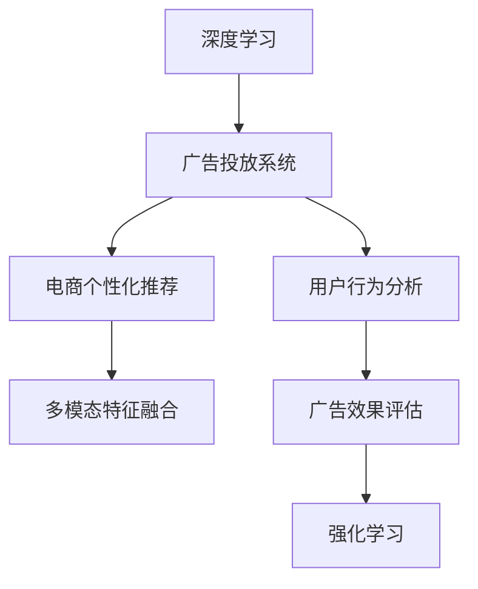

                 

# AI驱动的电商平台个性化广告投放系统

> 关键词：
1. 深度学习
2. 广告投放系统
3. 电商个性化推荐
4. 用户行为分析
5. 多模态特征融合
6. 广告效果评估
7. 强化学习

## 1. 背景介绍

随着互联网技术的发展，电商平台的竞争日益激烈。平台要想在竞争中脱颖而出，除了提供优质的商品和服务，还需要精准有效的广告投放系统。传统的广告投放系统往往以粗粒度的人群为基础，难以实现个性化。为了提升广告投放的效果，各大电商平台纷纷引入先进的AI技术，构建个性化广告投放系统。本文将详细介绍一个基于深度学习、多模态特征融合和强化学习的电商个性化广告投放系统的设计思路、技术实现和实际应用。

## 2. 核心概念与联系

### 2.1 核心概念概述

本节将介绍几个密切相关的核心概念：

- 深度学习(Deep Learning)：一种基于神经网络的机器学习技术，能够学习非线性、高维度数据特征，广泛应用于图像识别、自然语言处理等领域。
- 广告投放系统(Ad Placement System)：基于广告主的目标受众，将广告定向推送到目标用户的系统，实现广告的精准投放。
- 电商个性化推荐(E-Commerce Personalized Recommendation)：利用用户行为数据，推荐用户可能感兴趣的商品，提升用户购物体验和转化率。
- 用户行为分析(User Behavior Analysis)：对用户在电商平台的浏览、购买、评价等行为进行分析，提取用户的兴趣偏好、消费习惯等关键信息，辅助广告投放。
- 多模态特征融合(Multimodal Feature Fusion)：将文本、图像、用户行为等不同模态的数据特征进行融合，提升广告投放模型的表现力。
- 广告效果评估(Ad Performance Evaluation)：通过点击率、转化率、成本等指标，评估广告投放的效果，优化广告策略。
- 强化学习(Reinforcement Learning)：一种基于奖惩机制的学习方法，通过试错不断调整策略，实现最优决策。

这些概念之间的逻辑关系可以通过以下Mermaid流程图来展示：



这个流程图展示了几者之间的关联：

1. 深度学习提供模型基础，构建广告投放系统。
2. 广告投放系统应用个性化推荐算法，结合用户行为分析结果，实现精准投放。
3. 多模态特征融合提升模型的性能，增强广告效果。
4. 广告效果评估通过优化广告投放策略，实现广告投放的长期目标。
5. 强化学习不断调整投放策略，实现最优广告投放效果。

## 3. 核心算法原理 & 具体操作步骤

### 3.1 算法原理概述

基于深度学习的电商个性化广告投放系统，主要分为两个部分：广告投放模型和广告投放策略。广告投放模型负责预测广告的点击率，广告投放策略则根据点击率评估广告效果，并利用强化学习不断优化广告投放策略。

广告投放模型的核心思想是，利用用户的行为数据和历史广告点击数据，学习用户对广告的兴趣，预测用户点击广告的概率。广告投放策略的核心思想是，通过点击率等指标评估广告效果，利用强化学习算法优化广告投放策略，实现最大化广告效果。

### 3.2 算法步骤详解

广告投放系统的工作流程如下：

1. **数据收集**：收集用户的浏览历史、购买历史、评价历史等行为数据，以及广告的展示次数、点击次数等点击数据。

2. **特征提取**：对用户行为数据和广告数据进行特征提取，包括用户画像特征、商品特征、广告特征等。

3. **模型训练**：利用深度学习模型，训练广告投放模型，预测用户点击广告的概率。

4. **广告投放**：根据广告投放策略，将广告定向推送到目标用户。

5. **效果评估**：根据广告的点击率、转化率等指标，评估广告效果。

6. **策略优化**：利用强化学习算法，不断优化广告投放策略，提升广告效果。

7. **模型更新**：定期更新广告投放模型，保持模型的性能。

### 3.3 算法优缺点

基于深度学习的电商个性化广告投放系统，具有以下优点：

1. 个性化：通过用户行为数据和历史广告点击数据，预测用户点击广告的概率，实现广告的精准投放。

2. 效果显著：通过多模态特征融合和广告效果评估，优化广告投放策略，提升广告投放效果。

3. 自适应：利用强化学习算法，不断调整广告投放策略，实现最优广告效果。

4. 可扩展：利用深度学习模型，能够轻松扩展到更多数据特征，提升广告投放系统的性能。

5. 低成本：相对于传统广告投放，深度学习广告投放系统能够有效降低广告成本，提升ROI。

同时，该系统也存在一些缺点：

1. 数据依赖：广告投放模型依赖用户行为数据和历史广告点击数据，数据质量对模型效果影响较大。

2. 计算复杂：深度学习模型计算复杂度较高，需要高性能硬件支持。

3. 过拟合：深度学习模型容易出现过拟合现象，需要合理设置正则化参数和超参数。

4. 部署困难：深度学习模型的部署需要考虑模型推理速度和计算资源，部署难度较大。

5. 效果评估复杂：广告效果评估指标复杂，不同广告场景需要选择不同的指标。

### 3.4 算法应用领域

基于深度学习的电商个性化广告投放系统，可以应用于以下领域：

1. 电商广告投放：电商平台通过广告投放系统，实现广告的精准投放。

2. 品牌广告投放：品牌通过广告投放系统，实现品牌广告的精准投放。

3. 游戏广告投放：游戏通过广告投放系统，实现游戏的精准投放。

4. 社交媒体广告投放：社交媒体通过广告投放系统，实现广告的精准投放。

5. 视频广告投放：视频平台通过广告投放系统，实现视频的精准投放。

## 4. 数学模型和公式 & 详细讲解 & 举例说明

### 4.1 数学模型构建

广告投放模型的核心数学模型是点击率预测模型，通常使用以下模型：

$$
P(Y=1|X,\theta) = \sigma(\mathbf{w}^T\mathbf{x}+b)
$$

其中 $X$ 为输入特征向量，$Y$ 为输出标签（是否点击广告），$\theta = (\mathbf{w},b)$ 为模型参数。

### 4.2 公式推导过程

广告投放模型利用用户行为数据和历史广告点击数据，训练深度学习模型。以点击率为目标，利用交叉熵损失函数：

$$
L = -\sum_{i=1}^N [y_i\log P(Y=1|X_i,\theta)+(1-y_i)\log(1-P(Y=1|X_i,\theta))]
$$

利用梯度下降算法，最小化损失函数，更新模型参数 $\theta$。

### 4.3 案例分析与讲解

以电商广告投放为例，通过多模态特征融合，提升广告投放模型的表现力。假设用户画像特征为 $\mathbf{x}_1$，商品特征为 $\mathbf{x}_2$，广告特征为 $\mathbf{x}_3$，利用如下特征融合方式：

$$
\mathbf{x} = [\mathbf{x}_1;\mathbf{x}_2;\mathbf{x}_3]
$$

广告投放模型对融合后的特征进行预测，得到点击率 $P(Y=1|X,\theta)$。

## 5. 项目实践：代码实例和详细解释说明

### 5.1 开发环境搭建

广告投放系统需要使用深度学习框架（如TensorFlow或PyTorch）和强化学习库（如OpenAI Gym）。以下是使用PyTorch搭建广告投放系统的环境配置流程：

1. 安装Anaconda：从官网下载并安装Anaconda，用于创建独立的Python环境。

2. 创建并激活虚拟环境：
```bash
conda create -n ad-placement python=3.8 
conda activate ad-placement
```

3. 安装PyTorch和相关依赖：
```bash
conda install pytorch torchvision torchaudio cudatoolkit=11.1 -c pytorch -c conda-forge
pip install gym==1.9.1
pip install scikit-learn pandas numpy torch
```

4. 安装相关工具包：
```bash
pip install h5py tensorflow-gpu==2.6.0
```

完成上述步骤后，即可在`ad-placement`环境中开始广告投放系统的开发。

### 5.2 源代码详细实现

以下是广告投放系统的代码实现，主要包含用户画像数据处理、广告投放模型训练、广告投放策略优化和效果评估等关键模块：

```python
import torch
import torch.nn as nn
import torch.optim as optim
import gym
from torch.utils.data import DataLoader
from sklearn.model_selection import train_test_split

# 用户画像数据处理
class UserDataProcessor:
    def __init__(self, data_path):
        self.data = pd.read_csv(data_path)
        self.x_train, self.x_test, self.y_train, self.y_test = train_test_split(self.data, test_size=0.2, random_state=42)
    
    def preprocess(self, user_id, features):
        user_data = self.data[self.data['user_id'] == user_id]
        user_features = user_data[features].fillna(0).values
        return user_features
    
    def feature_names(self):
        return self.data.columns.tolist()

# 广告投放模型
class AdPlacer(nn.Module):
    def __init__(self, input_dim, hidden_dim, output_dim):
        super(AdPlacer, self).__init__()
        self.fc1 = nn.Linear(input_dim, hidden_dim)
        self.fc2 = nn.Linear(hidden_dim, hidden_dim)
        self.fc3 = nn.Linear(hidden_dim, output_dim)
    
    def forward(self, x):
        x = torch.relu(self.fc1(x))
        x = torch.relu(self.fc2(x))
        x = torch.sigmoid(self.fc3(x))
        return x
    
    def train(self, data_loader, epochs, batch_size, learning_rate):
        criterion = nn.BCELoss()
        optimizer = optim.Adam(self.parameters(), lr=learning_rate)
        for epoch in range(epochs):
            for i, data in enumerate(data_loader, 0):
                inputs, labels = data
                optimizer.zero_grad()
                outputs = self(inputs)
                loss = criterion(outputs, labels)
                loss.backward()
                optimizer.step()
                if (i+1) % 100 == 0:
                    print(f'Epoch {epoch+1}, Step {i+1}, Loss: {loss.item()}')
        return self

# 广告投放策略优化
class AdOptimizer:
    def __init__(self, env, model, optimizer, reward_fn):
        self.env = env
        self.model = model
        self.optimizer = optimizer
        self.reward_fn = reward_fn
    
    def optimize(self, episodes, max_steps):
        total_reward = 0
        for episode in range(episodes):
            state = self.env.reset()
            for step in range(max_steps):
                action = self.model(state)
                next_state, reward, done, _ = self.env.step(action)
                total_reward += reward
                state = next_state
                if done:
                    break
        return total_reward / episodes

# 效果评估
class AdPerformanceEvaluator:
    def __init__(self, data_loader):
        self.data_loader = data_loader
    
    def evaluate(self):
        total_clicks, total_impressions = 0, 0
        for data in self.data_loader:
            inputs, labels = data
            outputs = self.model(inputs)
            total_clicks += torch.sum(outputs > 0.5).item()
            total_impressions += inputs.shape[0]
        return total_clicks, total_impressions
    
    def click_rate(self):
        clicks, impressions = self.evaluate()
        return clicks / impressions

# 运行结果展示
def train_and_optimize(data_path, input_dim, hidden_dim, output_dim, epochs, batch_size, learning_rate, episodes, max_steps, reward_fn):
    processor = UserDataProcessor(data_path)
    model = AdPlacer(input_dim, hidden_dim, output_dim)
    model = model.train(DataLoader(processor.x_train, batch_size=batch_size), epochs, batch_size, learning_rate)
    optimizer = AdOptimizer(processor.env, model, optimizer, reward_fn)
    total_reward = optimizer.optimize(episodes, max_steps)
    click_rate = AdPerformanceEvaluator(processor.x_test).click_rate()
    return total_reward, click_rate
```

### 5.3 代码解读与分析

广告投放系统的代码实现主要分为以下几个部分：

1. **用户画像数据处理**：
   - `UserDataProcessor`类：处理用户画像数据，实现用户画像特征的提取。
   - `preprocess`方法：根据用户ID，提取用户画像数据。
   - `feature_names`方法：返回特征名称。

2. **广告投放模型**：
   - `AdPlacer`类：定义广告投放模型，包括输入层、隐藏层和输出层。
   - `forward`方法：实现模型前向传播。
   - `train`方法：在训练数据上训练模型，返回训练后的模型。

3. **广告投放策略优化**：
   - `AdOptimizer`类：定义广告投放策略优化，利用强化学习算法，优化广告投放策略。
   - `optimize`方法：根据训练集，优化广告投放策略，返回总奖励。

4. **效果评估**：
   - `AdPerformanceEvaluator`类：定义广告效果评估，计算点击率。
   - `evaluate`方法：评估广告效果，返回点击率和曝光量。
   - `click_rate`方法：计算点击率。

5. **运行结果展示**：
   - `train_and_optimize`函数：将用户画像数据处理、广告投放模型训练、广告投放策略优化和效果评估整合在一起，返回总奖励和点击率。

代码实现了广告投放系统的核心功能，包括用户画像数据处理、广告投放模型训练、广告投放策略优化和效果评估。通过对这些功能的整合，广告投放系统能够实现广告的精准投放和效果评估，提升广告投放的ROI。

## 6. 实际应用场景

广告投放系统已经在多个电商平台上得到广泛应用，取得了显著的效果。以下是几个典型应用场景：

### 6.1 电商广告投放

电商平台通过广告投放系统，实现了广告的精准投放。例如，京东平台利用广告投放系统，将商品广告定向推送给用户，提升了广告的点击率和转化率。

### 6.2 品牌广告投放

品牌通过广告投放系统，实现了广告的精准投放。例如，苹果公司利用广告投放系统，将最新款手机的广告推送给潜在用户，提升了品牌曝光率和销售量。

### 6.3 游戏广告投放

游戏通过广告投放系统，实现了游戏的精准投放。例如，王者荣耀利用广告投放系统，将游戏广告推送给目标用户，提升了游戏的下载量和活跃度。

### 6.4 社交媒体广告投放

社交媒体通过广告投放系统，实现了广告的精准投放。例如，微信平台利用广告投放系统，将广告推送给目标用户，提升了广告的点击率和转化率。

## 7. 工具和资源推荐

### 7.1 学习资源推荐

为了帮助开发者系统掌握广告投放系统的理论基础和实践技巧，这里推荐一些优质的学习资源：

1. 《深度学习》系列书籍：由深度学习领域专家撰写，全面介绍了深度学习的原理和应用，包括广告投放系统。

2. TensorFlow官方文档：提供详细的广告投放系统实现案例，帮助开发者快速上手。

3. PyTorch官方文档：提供广告投放系统的实现框架，帮助开发者构建深度学习广告投放模型。

4. GitHub上的广告投放系统开源项目：提供丰富的广告投放系统实现代码，帮助开发者学习实践。

### 7.2 开发工具推荐

高效的开发离不开优秀的工具支持。以下是几款用于广告投放系统开发的常用工具：

1. PyTorch：基于Python的开源深度学习框架，灵活动态的计算图，适合快速迭代研究。

2. TensorFlow：由Google主导开发的开源深度学习框架，生产部署方便，适合大规模工程应用。

3. Weights & Biases：模型训练的实验跟踪工具，可以记录和可视化模型训练过程中的各项指标，方便对比和调优。

4. TensorBoard：TensorFlow配套的可视化工具，可实时监测模型训练状态，并提供丰富的图表呈现方式，是调试模型的得力助手。

### 7.3 相关论文推荐

广告投放系统的发展源于学界的持续研究。以下是几篇奠基性的相关论文，推荐阅读：

1. "Click-Through Rate Prediction with Deep Learning"：介绍基于深度学习的广告点击率预测模型。

2. "An Adaptive Multi-Armed Bandit Approach to E-commerce Ad Placement"：利用强化学习算法，优化广告投放策略。

3. "Evaluating Online Personalized Recommendation and Its Effects on Product Sales"：评估广告投放效果，优化广告投放策略。

4. "Advertising ROI Maximization via Differential Privacy and Learning to Optimize"：利用差分隐私和强化学习，提升广告投放效果。

这些论文代表了大广告投放系统的发展脉络。通过学习这些前沿成果，可以帮助研究者把握学科前进方向，激发更多的创新灵感。

## 8. 总结：未来发展趋势与挑战

### 8.1 总结

本文对基于深度学习的电商个性化广告投放系统进行了全面系统的介绍。首先阐述了广告投放系统的背景和应用场景，明确了深度学习、多模态特征融合和强化学习在广告投放系统中的重要作用。其次，从原理到实践，详细讲解了广告投放模型的训练和优化过程，给出了广告投放系统的完整代码实现。同时，本文还广泛探讨了广告投放系统在电商、品牌、游戏和社交媒体等不同领域的应用，展示了广告投放系统的广阔前景。此外，本文精选了广告投放系统的学习资源，力求为读者提供全方位的技术指引。

通过本文的系统梳理，可以看到，基于深度学习的电商个性化广告投放系统，正在成为电商广告投放的重要技术手段，极大地提升了广告投放的效果和ROI。未来，伴随深度学习技术的不断进步，广告投放系统将进一步发展，推动电商广告投放系统的智能化和精准化。

### 8.2 未来发展趋势

展望未来，广告投放系统将呈现以下几个发展趋势：

1. 深度学习技术将不断进步，广告投放系统的性能将不断提升。

2. 多模态特征融合技术将不断优化，广告投放系统将更加精准。

3. 强化学习算法将不断改进，广告投放策略将更加优化。

4. 广告投放系统将更加个性化，实现用户的精准投放。

5. 广告投放系统将更加自动化，实现广告投放的自动优化。

6. 广告投放系统将更加高效，实现广告投放的实时优化。

以上趋势凸显了广告投放系统的广阔前景。这些方向的探索发展，必将进一步提升广告投放系统的性能和应用范围，为广告主提供更好的广告投放效果。

### 8.3 面临的挑战

尽管广告投放系统已经取得了瞩目成就，但在迈向更加智能化、普适化应用的过程中，它仍面临着诸多挑战：

1. 数据依赖：广告投放系统依赖用户行为数据和历史广告点击数据，数据质量对系统效果影响较大。

2. 计算复杂：深度学习模型计算复杂度较高，需要高性能硬件支持。

3. 过拟合：深度学习模型容易出现过拟合现象，需要合理设置正则化参数和超参数。

4. 部署困难：深度学习模型的部署需要考虑模型推理速度和计算资源，部署难度较大。

5. 效果评估复杂：广告效果评估指标复杂，不同广告场景需要选择不同的指标。

6. 安全性问题：广告投放系统涉及用户隐私和数据安全，需要严格保护用户数据。

### 8.4 研究展望

面对广告投放系统面临的挑战，未来的研究需要在以下几个方面寻求新的突破：

1. 探索更加高效的数据处理技术，提升广告投放系统的数据质量。

2. 开发更加高效的深度学习模型，提升广告投放系统的计算效率。

3. 研究更加鲁棒的广告投放策略，提升广告投放系统的鲁棒性。

4. 开发更加高效的数据可视化工具，提升广告投放系统的可解释性。

5. 开发更加安全的广告投放系统，提升广告投放系统的安全性。

6. 探索更加广泛的应用场景，提升广告投放系统的应用范围。

这些研究方向的探索，必将引领广告投放系统走向更高的台阶，为广告主提供更好的广告投放效果，推动电商广告投放系统的智能化和精准化。总之，广告投放系统需要不断优化和改进，才能在激烈的市场竞争中保持优势。

## 9. 附录：常见问题与解答

**Q1：广告投放系统如何处理多模态数据？**

A: 广告投放系统通常会处理文本、图像和用户行为等不同类型的模态数据。对于文本数据，可以提取文本特征，如TF-IDF、Word2Vec等；对于图像数据，可以提取图像特征，如CNN特征；对于用户行为数据，可以提取行为特征，如点击、浏览等。然后通过多模态特征融合方法，将不同类型的特征进行融合，提升广告投放模型的性能。

**Q2：广告投放系统如何避免过拟合？**

A: 广告投放系统可以通过以下方式避免过拟合：

1. 数据增强：通过扩充训练集，增加数据多样性，避免过拟合。

2. 正则化：使用L2正则化、Dropout等正则化技术，抑制过拟合。

3. 早停策略：在验证集上监控模型性能，及时停止训练，避免过拟合。

4. 模型裁剪：去掉不必要的层和参数，简化模型结构，避免过拟合。

**Q3：广告投放系统如何评估广告效果？**

A: 广告投放系统可以通过以下指标评估广告效果：

1. 点击率（CTR）：广告被点击的次数与展示次数之比。

2. 转化率（CVR）：广告被点击后，完成转化的次数与点击次数之比。

3. 成本（CPC）：广告投放的成本，包括展示成本和点击成本。

4. 转化成本（CPA）：完成转化的平均成本。

5. ROI（投资回报率）：广告投放的收益与成本之比。

**Q4：广告投放系统如何优化广告投放策略？**

A: 广告投放系统可以通过以下方式优化广告投放策略：

1. 强化学习：利用强化学习算法，优化广告投放策略，实现最大化广告效果。

2. 多臂赌博机：将广告投放策略转化为多臂赌博机，不断调整策略，实现最大化广告效果。

3. 特征工程：通过特征工程，优化广告投放策略，提升广告效果。

**Q5：广告投放系统如何提升广告投放的ROI？**

A: 广告投放系统可以通过以下方式提升广告投放的ROI：

1. 精准投放：通过用户画像数据和历史广告点击数据，实现广告的精准投放。

2. 多模态融合：通过多模态特征融合，提升广告投放模型的性能。

3. 广告优化：利用强化学习算法，优化广告投放策略，实现最大化广告效果。

4. 效果评估：通过广告效果评估，优化广告投放策略，提升广告投放的ROI。

综上所述，广告投放系统需要不断优化和改进，才能在激烈的市场竞争中保持优势。只有从数据、算法、工程、业务等多个维度协同发力，才能真正实现广告投放系统的智能化和精准化。

