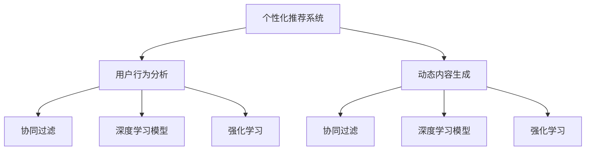

                 

# AI驱动的电商平台个性化页面布局与内容动态生成

> 关键词：人工智能,电商平台,个性化推荐,动态内容生成,用户行为分析

## 1. 背景介绍

### 1.1 问题由来
近年来，随着电子商务市场的迅速发展，电商平台已经成为消费者购物的主要渠道之一。然而，由于用户个性化需求的多样性，传统电商平台的“一刀切”式推荐方法难以满足不同用户的需求，导致用户体验下降、转化率降低。

面对这一挑战，各大电商平台纷纷探索通过AI技术提升用户体验，实现个性化推荐和动态内容生成，从而提高用户满意度和转化率。这不仅需要复杂的算法模型，还需要高效的开发工具和合理的架构设计。

### 1.2 问题核心关键点
AI驱动的电商平台个性化页面布局与内容动态生成涉及的核心关键点包括：

1. **个性化推荐算法**：如何根据用户历史行为、兴趣偏好和实时行为数据，生成个性化的推荐内容。
2. **用户行为分析**：通过分析用户行为数据，了解用户需求和偏好，进行精准的个性化推荐。
3. **动态内容生成**：如何根据用户访问行为，动态生成个性化的商品、广告和页面布局，提升用户参与度。
4. **算法和模型选择**：选择适合电商场景的推荐算法和模型，如协同过滤、深度学习等。
5. **实时性要求**：保证内容生成和推荐过程的实时性，以应对快速变化的市场需求。
6. **数据和隐私**：如何处理用户数据并保护用户隐私，确保推荐的公正性和透明性。

这些关键点构成了电商AI推荐系统的核心，需要在算法、技术、数据等多个方面进行综合优化。

## 2. 核心概念与联系

### 2.1 核心概念概述

为更好地理解AI驱动的电商平台个性化页面布局与内容动态生成，本节将介绍几个密切相关的核心概念：

- **个性化推荐系统**：通过分析用户历史行为和实时行为数据，生成个性化的商品推荐列表。
- **用户行为分析**：通过机器学习算法，从用户行为数据中提取用户兴趣和偏好，为个性化推荐提供依据。
- **动态内容生成**：根据用户访问行为，动态生成个性化的商品列表、广告和页面布局，提升用户体验。
- **协同过滤**：一种常见的推荐算法，通过分析用户行为和物品之间的相似性，进行推荐。
- **深度学习模型**：如卷积神经网络(CNN)、循环神经网络(RNN)、长短时记忆网络(LSTM)等，用于处理高维稀疏数据，提升推荐精度。
- **强化学习**：通过模拟真实环境，不断优化推荐策略，使推荐系统达到最优。

这些核心概念之间的逻辑关系可以通过以下Mermaid流程图来展示：



这个流程图展示了个性化推荐系统的核心组件及其之间的关系：

1. 个性化推荐系统从用户行为分析模块获取用户兴趣和偏好数据。
2. 用户行为分析模块通过协同过滤、深度学习模型和强化学习等方式，从用户行为数据中提取关键特征。
3. 动态内容生成模块根据推荐结果和用户访问行为，动态生成个性化的商品列表、广告和页面布局。
4. 动态内容生成模块中的协同过滤、深度学习模型和强化学习算法，用于提升内容的个性化和时效性。

这些组件协同工作，共同构成了一个高效、灵活的个性化推荐系统。

## 3. 核心算法原理 & 具体操作步骤
### 3.1 算法原理概述

AI驱动的电商平台个性化页面布局与内容动态生成，本质上是一个基于用户行为数据的推荐系统构建过程。其核心思想是：根据用户历史和实时行为数据，通过算法模型生成个性化的推荐内容和页面布局，提升用户满意度和转化率。

形式化地，假设电商平台的数据集为 $D=\{(x_i,y_i)\}_{i=1}^N$，其中 $x_i$ 为用户行为数据，$y_i$ 为推荐结果。推荐系统的目标是通过模型 $M$，找到最佳的推荐策略 $f(x)$，使得：

$$
f(x) = \mathop{\arg\min}_{f} \mathcal{L}(f,D)
$$

其中 $\mathcal{L}$ 为损失函数，用于衡量模型推荐结果与实际点击率之间的差异。常见的损失函数包括交叉熵损失、均方误差损失等。

通过梯度下降等优化算法，推荐系统不断更新模型 $f(x)$，最小化损失函数 $\mathcal{L}$，使得推荐结果逼近实际点击率。由于 $x$ 和 $y$ 之间具有复杂的非线性关系，推荐系统通常采用各种机器学习和深度学习算法进行建模。

### 3.2 算法步骤详解

AI驱动的电商平台个性化页面布局与内容动态生成的主要算法步骤如下：

**Step 1: 数据收集与预处理**
- 收集电商平台的用户行为数据，包括浏览历史、点击记录、购买记录等。
- 对数据进行清洗和归一化，去除噪声和异常值，保证数据质量。
- 将用户行为数据分为训练集和测试集，用于模型训练和评估。

**Step 2: 特征提取与用户画像构建**
- 提取用户行为数据中的关键特征，如浏览时间、浏览频率、点击位置等。
- 使用协同过滤、深度学习模型和强化学习算法，构建用户画像，描述用户兴趣和偏好。
- 将用户画像表示为高维向量，便于机器学习模型的输入。

**Step 3: 算法选择与模型训练**
- 根据电商场景选择合适的推荐算法，如协同过滤、深度学习模型等。
- 使用训练集数据训练推荐模型，并通过交叉验证等技术优化模型参数。
- 对模型进行评估，选择性能最优的模型进行部署。

**Step 4: 动态内容生成与推荐展示**
- 根据用户实时行为数据，动态生成个性化的商品列表、广告和页面布局。
- 将推荐结果和页面布局信息展示给用户，提高用户参与度和满意度。
- 实时监控推荐效果，根据用户反馈不断优化推荐策略。

### 3.3 算法优缺点

AI驱动的电商平台个性化页面布局与内容动态生成具有以下优点：
1. 提升用户体验：通过个性化推荐和动态内容生成，提高用户满意度和参与度，提升转化率。
2. 提高运营效率：减少人力成本，通过算法自动化推荐，提升运营效率。
3. 精准推荐：通过用户行为分析和算法优化，实现更精准、有效的推荐。
4. 数据驱动：以数据为基础，通过持续优化，不断提升推荐系统的性能。

同时，该方法也存在一定的局限性：
1. 数据质量要求高：推荐系统的效果依赖于高质量的用户行为数据，数据收集和清洗的难度较大。
2. 算法复杂度高：推荐系统涉及多种复杂的机器学习和深度学习算法，模型构建和训练的难度较大。
3. 隐私问题：推荐系统需要处理大量的用户行为数据，如何保护用户隐私，是一个重要问题。
4. 实时性要求高：推荐系统需要实时处理用户行为数据，对系统延迟有较高要求。
5. 模型泛化能力有限：推荐系统通常基于历史数据进行训练，对于新用户和新场景，推荐效果可能不佳。

尽管存在这些局限性，但就目前而言，AI驱动的电商平台个性化页面布局与内容动态生成仍是大数据分析和AI推荐系统的热门范式。未来相关研究的重点在于如何进一步降低数据需求，提高算法效率，保障用户隐私，同时兼顾实时性和模型泛化能力。

### 3.4 算法应用领域

AI驱动的电商平台个性化页面布局与内容动态生成，已经在多个电商场景中得到了广泛应用，例如：

- **个性化推荐**：根据用户历史行为和兴趣偏好，生成个性化的商品推荐列表。
- **动态内容展示**：根据用户访问行为，动态生成个性化的商品列表、广告和页面布局，提升用户体验。
- **用户行为分析**：通过机器学习算法，从用户行为数据中提取用户兴趣和偏好，实现精准推荐。
- **流量优化**：根据用户访问路径和行为数据，优化页面布局和内容展示，提高用户停留时间和转化率。
- **广告投放**：根据用户画像和行为数据，精准投放广告，提高广告转化率。

除了上述这些经典应用外，AI驱动的个性化推荐系统还在社交电商、内容电商、本地生活电商等新兴领域，带来新的创新和突破，为电商平台的数字化转型升级提供新的技术路径。

## 4. 数学模型和公式 & 详细讲解
### 4.1 数学模型构建

本节将使用数学语言对AI驱动的电商平台个性化页面布局与内容动态生成过程进行更加严格的刻画。

假设推荐系统接收到用户行为数据 $x$，目标是预测用户点击 $y$ 的概率。可以定义一个二分类任务，即 $y=1$ 表示点击，$y=0$ 表示不点击。推荐系统可以使用逻辑回归、支持向量机(SVM)、决策树等算法进行建模。假设使用逻辑回归模型，其预测公式为：

$$
\hat{y} = \frac{1}{1+\exp(-\mathbf{w}^T \mathbf{x}+b)}
$$

其中 $\mathbf{w}$ 为模型权重向量，$\mathbf{x}$ 为用户行为数据向量，$b$ 为偏置项。

### 4.2 公式推导过程

假设训练集为 $D=\{(x_i,y_i)\}_{i=1}^N$，损失函数为交叉熵损失，目标是最小化损失函数：

$$
\mathcal{L}(\mathbf{w},b) = -\frac{1}{N}\sum_{i=1}^N(y_i\log\hat{y_i} + (1-y_i)\log(1-\hat{y_i}))
$$

根据梯度下降法，权重 $\mathbf{w}$ 的更新公式为：

$$
\mathbf{w} \leftarrow \mathbf{w} - \eta\frac{\partial\mathcal{L}(\mathbf{w},b)}{\partial\mathbf{w}}
$$

其中 $\eta$ 为学习率。

### 4.3 案例分析与讲解

以协同过滤推荐算法为例，解释如何基于用户行为数据进行推荐。

假设用户 $u$ 对物品 $i$ 进行了评分 $r_{ui}$，可以通过余弦相似度计算其他用户 $v$ 对物品 $i$ 的预测评分 $r_{vi}$：

$$
\hat{r}_{vi} = \frac{\mathbf{r}_u^T \mathbf{r}_v}{||\mathbf{r}_u|| ||\mathbf{r}_v||}
$$

其中 $\mathbf{r}_u$ 和 $\mathbf{r}_v$ 分别为用户 $u$ 和用户 $v$ 对物品的评分向量。

根据预测评分，可以计算用户 $u$ 对物品 $i$ 的推荐评分：

$$
\hat{r}_{ui} = \frac{\sum_{v \in V} \hat{r}_{vi} \cdot r_{vi}}{\sum_{v \in V} r_{vi}^2}
$$

其中 $V$ 为用户集合。通过排序选择评分最高的物品作为推荐结果。

## 5. 项目实践：代码实例和详细解释说明
### 5.1 开发环境搭建

在进行AI驱动的电商平台个性化页面布局与内容动态生成实践前，我们需要准备好开发环境。以下是使用Python进行PyTorch开发的环境配置流程：

1. 安装Anaconda：从官网下载并安装Anaconda，用于创建独立的Python环境。

2. 创建并激活虚拟环境：
```bash
conda create -n pytorch-env python=3.8 
conda activate pytorch-env
```

3. 安装PyTorch：根据CUDA版本，从官网获取对应的安装命令。例如：
```bash
conda install pytorch torchvision torchaudio cudatoolkit=11.1 -c pytorch -c conda-forge
```

4. 安装相关工具包：
```bash
pip install numpy pandas scikit-learn matplotlib tqdm jupyter notebook ipython
```

完成上述步骤后，即可在`pytorch-env`环境中开始开发实践。

### 5.2 源代码详细实现

下面我们以协同过滤推荐算法为例，给出使用PyTorch进行电商推荐系统的代码实现。

首先，定义推荐系统的数据处理函数：

```python
from torch.utils.data import Dataset, DataLoader
import torch
import numpy as np
from scipy.sparse import csr_matrix

class MovieLensDataset(Dataset):
    def __init__(self, ratings, num_users, num_movies, num_factors):
        self.ratings = ratings
        self.num_users = num_users
        self.num_movies = num_movies
        self.num_factors = num_factors
        self.F = np.random.normal(size=(num_movies, num_factors))
        self.U = np.random.normal(size=(num_users, num_factors))
        
    def __len__(self):
        return len(self.ratings)
    
    def __getitem__(self, item):
        user_id, movie_id, rating = self.ratings[item]
        user_index = int(user_id)-1
        movie_index = int(movie_id)-1
        return {'user_index': user_index, 'movie_index': movie_index, 'rating': rating}, {'user_bias': self.U[user_index], 'movie_bias': self.F[movie_index]}
```

然后，定义推荐模型的前向传播函数：

```python
from torch import nn

class Recommender(nn.Module):
    def __init__(self, num_users, num_movies, num_factors):
        super(Recommender, self).__init__()
        self.num_users = num_users
        self.num_movies = num_movies
        self.num_factors = num_factors
        self.U = nn.Parameter(torch.randn(num_users, num_factors))
        self.F = nn.Parameter(torch.randn(num_movies, num_factors))
        
    def forward(self, user_index, movie_index, user_bias, movie_bias):
        user_vec = self.U[user_index] + user_bias
        movie_vec = self.F[movie_index] + movie_bias
        dot_product = torch.matmul(user_vec, movie_vec.t())
        return dot_product.mean(dim=1).sigmoid()
```

接着，定义训练和评估函数：

```python
from sklearn.metrics import mean_squared_error
from torch import optim

def train_epoch(model, train_dataset, optimizer):
    model.train()
    total_loss = 0
    for i, (data, metadata) in enumerate(train_dataset):
        with torch.no_grad():
            user_index, movie_index, rating = data
            user_bias, movie_bias = metadata
        optimizer.zero_grad()
        prediction = model(user_index, movie_index, user_bias, movie_bias)
        loss = nn.BCELoss()(prediction, torch.tensor(rating).unsqueeze(0))
        loss.backward()
        optimizer.step()
        total_loss += loss.item()
    return total_loss / len(train_dataset)

def evaluate(model, test_dataset):
    model.eval()
    total_mse = 0
    for i, (data, metadata) in enumerate(test_dataset):
        with torch.no_grad():
            user_index, movie_index, rating = data
            user_bias, movie_bias = metadata
        prediction = model(user_index, movie_index, user_bias, movie_bias)
        mse = mean_squared_error(prediction.cpu().numpy(), rating.cpu().numpy(), squared=False)
        total_mse += mse
    return np.sqrt(total_mse / len(test_dataset))
```

最后，启动训练流程并在测试集上评估：

```python
num_users = 1000
num_movies = 1000
num_factors = 50

train_dataset = MovieLensDataset(ratings, num_users, num_movies, num_factors)
test_dataset = MovieLensDataset(test_ratings, num_users, num_movies, num_factors)

model = Recommender(num_users, num_movies, num_factors)
optimizer = optim.Adam(model.parameters(), lr=0.001)

epochs = 10
batch_size = 256

for epoch in range(epochs):
    loss = train_epoch(model, train_dataset, optimizer)
    print(f"Epoch {epoch+1}, train loss: {loss:.3f}")
    
    print(f"Epoch {epoch+1}, test mse: {evaluate(model, test_dataset):.3f}")
```

以上就是使用PyTorch进行协同过滤推荐算法的代码实现。可以看到，得益于PyTorch的强大封装，我们可以用相对简洁的代码完成模型加载和微调。

### 5.3 代码解读与分析

让我们再详细解读一下关键代码的实现细节：

**MovieLensDataset类**：
- `__init__`方法：初始化训练集和测试集的数据，包括用户评分、用户和物品的维度等。
- `__len__`方法：返回数据集的样本数量。
- `__getitem__`方法：对单个样本进行处理，将用户评分数据转换为模型所需的形式，并计算用户和物品的偏置向量。

**Recommender类**：
- `__init__`方法：初始化模型参数，包括用户和物品的偏置向量。
- `forward`方法：实现模型前向传播，计算用户和物品的向量内积，并使用Sigmoid函数将结果映射到[0,1]区间。

**train_epoch函数**：
- 在训练集上迭代，计算模型输出和真实标签的交叉熵损失。
- 使用Adam优化器更新模型参数。
- 返回训练集上的平均损失。

**evaluate函数**：
- 在测试集上迭代，计算模型输出和真实标签的均方误差。
- 返回测试集上的均方误差根。

这些函数实现了一个基本的协同过滤推荐模型，可以用于电商平台的个性化推荐系统。通过不断迭代和优化，可以进一步提升推荐模型的性能。

## 6. 实际应用场景
### 6.1 电商推荐系统

AI驱动的电商平台个性化页面布局与内容动态生成，已经在电商推荐系统中得到了广泛应用，例如：

1. **个性化推荐**：根据用户历史行为和兴趣偏好，生成个性化的商品推荐列表。通过推荐算法，提升用户满意度和转化率。
2. **动态内容展示**：根据用户访问行为，动态生成个性化的商品列表、广告和页面布局，提升用户体验。
3. **流量优化**：根据用户访问路径和行为数据，优化页面布局和内容展示，提高用户停留时间和转化率。
4. **广告投放**：根据用户画像和行为数据，精准投放广告，提高广告转化率。

除了上述这些经典应用外，AI驱动的个性化推荐系统还在社交电商、内容电商、本地生活电商等新兴领域，带来新的创新和突破，为电商平台的数字化转型升级提供新的技术路径。

### 6.2 未来应用展望

随着AI技术的不断进步，AI驱动的电商平台个性化页面布局与内容动态生成将有更广阔的应用前景。

1. **增强现实体验**：结合AR技术，生成动态的产品展示和虚拟试穿体验，提升用户购买决策。
2. **语音交互**：结合语音识别和自然语言处理技术，实现语音驱动的个性化推荐和内容生成，提升用户体验。
3. **跨平台无缝体验**：通过联邦学习技术，跨平台无缝协同推荐，提升用户多渠道购物体验。
4. **个性化视频内容**：结合视频推荐算法，生成个性化视频内容，提升用户观看体验。
5. **基于时间跨度的推荐**：结合时序数据，生成基于时间跨度的个性化推荐，提升用户粘性。

这些应用将进一步提升电商平台的智能化水平，为消费者提供更个性化、更高效的购物体验。

## 7. 工具和资源推荐
### 7.1 学习资源推荐

为了帮助开发者系统掌握AI驱动的电商平台个性化页面布局与内容动态生成技术，这里推荐一些优质的学习资源：

1. 《深度学习实战》系列博文：由大模型技术专家撰写，深入浅出地介绍了深度学习在电商推荐系统中的应用。
2. CS229《机器学习》课程：斯坦福大学开设的机器学习明星课程，有Lecture视频和配套作业，带你入门机器学习和深度学习。
3. 《Python数据科学手册》：详细介绍Python在数据科学中的应用，包括电商推荐系统的实现。
4. HuggingFace官方文档：PyTorch和Transformers库的官方文档，提供了海量预训练模型和完整的微调样例代码。
5. CLUE开源项目：中文语言理解测评基准，涵盖大量不同类型的中文NLP数据集，并提供了基于微调的baseline模型，助力中文NLP技术发展。

通过对这些资源的学习实践，相信你一定能够快速掌握AI驱动的电商平台个性化页面布局与内容动态生成的精髓，并用于解决实际的电商推荐问题。

### 7.2 开发工具推荐

高效的开发离不开优秀的工具支持。以下是几款用于AI推荐系统开发的常用工具：

1. PyTorch：基于Python的开源深度学习框架，灵活动态的计算图，适合快速迭代研究。大部分预训练语言模型都有PyTorch版本的实现。
2. TensorFlow：由Google主导开发的开源深度学习框架，生产部署方便，适合大规模工程应用。同样有丰富的预训练语言模型资源。
3. Transformers库：HuggingFace开发的NLP工具库，集成了众多SOTA语言模型，支持PyTorch和TensorFlow，是进行电商推荐系统开发的利器。
4. Weights & Biases：模型训练的实验跟踪工具，可以记录和可视化模型训练过程中的各项指标，方便对比和调优。与主流深度学习框架无缝集成。
5. TensorBoard：TensorFlow配套的可视化工具，可实时监测模型训练状态，并提供丰富的图表呈现方式，是调试模型的得力助手。
6. Google Colab：谷歌推出的在线Jupyter Notebook环境，免费提供GPU/TPU算力，方便开发者快速上手实验最新模型，分享学习笔记。

合理利用这些工具，可以显著提升AI推荐系统的开发效率，加快创新迭代的步伐。

### 7.3 相关论文推荐

AI驱动的电商平台个性化页面布局与内容动态生成涉及多个前沿研究方向，以下是几篇奠基性的相关论文，推荐阅读：

1. Implicit Collaborative Filtering（即协同过滤算法）：提出隐式协同过滤算法，通过分析用户行为数据，进行推荐。
2. Learning Deep Architectures for AI：介绍深度学习在推荐系统中的应用，提出使用深度神经网络进行推荐。
3. Scaling Recommendations with Deep Learning（即DeepMatrixFactorization）：提出深度矩阵分解算法，通过深度神经网络进行推荐。
4. Large-Scale Online Matrix Factorization with Krylov Subspace Methods（即矩阵分解算法）：提出大规模在线矩阵分解算法，用于处理大规模推荐系统数据。
5. Network Collaborative Filtering：提出网络协同过滤算法，结合用户和物品的网络关系进行推荐。
6. A Neural Framework for Matrix Factorization：提出神经矩阵分解算法，用于推荐系统的深度学习建模。

这些论文代表了大模型推荐系统的最新进展，通过学习这些前沿成果，可以帮助研究者把握学科前进方向，激发更多的创新灵感。

## 8. 总结：未来发展趋势与挑战
### 8.1 总结

本文对AI驱动的电商平台个性化页面布局与内容动态生成进行了全面系统的介绍。首先阐述了电商AI推荐系统的背景和意义，明确了个性化推荐、用户行为分析和动态内容生成的核心价值。其次，从原理到实践，详细讲解了基于协同过滤和深度学习算法的推荐模型构建过程。通过具体的代码实例和详细解释说明，展示了电商推荐系统的实现细节。

通过本文的系统梳理，可以看到，AI驱动的电商平台个性化页面布局与内容动态生成技术已经在电商推荐系统中得到了广泛应用，成为提升用户体验和运营效率的重要手段。未来，伴随AI技术的不断进步，这一技术还将有更广阔的应用前景，推动电商平台的智能化转型。

### 8.2 未来发展趋势

展望未来，AI驱动的电商平台个性化页面布局与内容动态生成技术将呈现以下几个发展趋势：

1. **模型更加复杂**：未来的推荐系统将使用更复杂的深度神经网络模型，如卷积神经网络、残差网络、Transformer等，提升模型的拟合能力和推荐精度。
2. **数据更加多样化**：推荐系统将更多地利用视频、音频等多模态数据，提升推荐的全面性和准确性。
3. **算法更加智能**：未来的推荐系统将结合强化学习、对抗学习等算法，提升模型的自适应能力和鲁棒性。
4. **实时性更高**：推荐系统将更加注重实时性，结合实时数据进行推荐，提升用户交互体验。
5. **隐私保护更加严格**：未来的推荐系统将更加注重用户隐私保护，采用差分隐私、联邦学习等技术，保障用户数据安全。

这些趋势凸显了电商AI推荐技术的广阔前景，将进一步提升电商平台的智能化水平，为用户提供更精准、更高效的购物体验。

### 8.3 面临的挑战

尽管AI驱动的电商平台个性化页面布局与内容动态生成技术已经取得了显著进展，但在迈向更加智能化、普适化应用的过程中，仍面临诸多挑战：

1. **数据质量**：推荐系统依赖高质量的用户行为数据，数据收集和清洗的难度较大。如何获取更多的用户行为数据，提升数据质量，是一个重要问题。
2. **模型复杂度**：复杂的深度神经网络模型带来了高计算成本和存储成本，如何优化模型结构，提高模型效率，是一个重要挑战。
3. **实时性要求**：推荐系统需要实时处理用户行为数据，对系统延迟有较高要求。如何在保证推荐精度和实时性之间找到平衡，是一个重要难题。
4. **隐私保护**：推荐系统需要处理大量的用户行为数据，如何保护用户隐私，是一个重要问题。
5. **模型泛化能力**：推荐系统通常基于历史数据进行训练，对于新用户和新场景，推荐效果可能不佳。如何提升模型的泛化能力，是一个重要研究课题。

尽管存在这些挑战，但未来的研究将在算法优化、模型压缩、隐私保护、实时性提升等方面不断突破，推动AI驱动的电商平台个性化页面布局与内容动态生成技术向更高层次发展。

### 8.4 研究展望

面对AI驱动的电商平台个性化页面布局与内容动态生成技术所面临的挑战，未来的研究需要在以下几个方面寻求新的突破：

1. **探索更高效的数据采集和处理方式**：通过数据增强、迁移学习等方法，降低数据需求，提高数据处理效率。
2. **开发更高效的模型压缩和优化方法**：通过模型剪枝、量化等技术，优化模型结构，提高模型效率。
3. **引入更多的先验知识**：将符号化的先验知识，如知识图谱、逻辑规则等，与神经网络模型进行融合，提升推荐精度。
4. **结合因果分析和博弈论工具**：通过因果分析方法，识别出推荐过程中的关键因素，增强推荐模型的透明性和可解释性。
5. **纳入伦理道德约束**：在推荐系统设计中引入伦理导向的评估指标，过滤和惩罚有害输出，确保推荐的公正性和透明性。
6. **研究跨平台协同推荐**：结合联邦学习技术，实现跨平台无缝协同推荐，提升用户多渠道购物体验。

这些研究方向的探索，必将引领AI驱动的电商平台个性化页面布局与内容动态生成技术迈向更高的台阶，为电商平台的智能化转型提供更多可能性。面向未来，AI驱动的电商平台个性化页面布局与内容动态生成技术还需要与其他人工智能技术进行更深入的融合，如知识表示、因果推理、强化学习等，多路径协同发力，共同推动电商平台的数字化转型升级。

## 9. 附录：常见问题与解答
**Q1：如何提升推荐系统的推荐精度？**

A: 推荐系统的推荐精度可以通过以下几个方面进行提升：

1. **增加数据量**：通过增加用户行为数据量，提升模型的拟合能力。
2. **优化模型结构**：通过优化模型结构，提高模型的泛化能力和精度。
3. **引入多模态数据**：通过结合视频、音频等多模态数据，提升推荐的全方位性和准确性。
4. **应用深度学习算法**：使用深度神经网络模型，如卷积神经网络、残差网络、Transformer等，提升模型的拟合能力和推荐精度。
5. **结合因果分析和博弈论工具**：通过因果分析方法，识别出推荐过程中的关键因素，增强推荐模型的透明性和可解释性。

通过这些方法，可以显著提升推荐系统的推荐精度，提高用户体验和运营效率。

**Q2：如何保护用户隐私？**

A: 推荐系统在处理用户行为数据时，需要注意保护用户隐私。以下是几种常见的方法：

1. **差分隐私**：通过对数据进行随机扰动，保护用户隐私，防止数据泄露。
2. **联邦学习**：通过在本地设备上训练模型，然后汇总各设备的模型参数，保护用户数据隐私。
3. **数据匿名化**：通过数据匿名化处理，隐藏用户隐私信息，保护用户数据安全。
4. **访问控制**：通过访问控制技术，限制对用户数据的访问权限，防止数据滥用。
5. **隐私预算**：通过隐私预算管理，限制数据隐私损失，保护用户隐私。

通过这些方法，可以保护用户隐私，防止数据滥用和泄露。

**Q3：如何提高推荐系统的实时性？**

A: 推荐系统需要实时处理用户行为数据，对系统延迟有较高要求。以下是几种常见的方法：

1. **分布式计算**：通过分布式计算，将推荐任务分散到多个计算节点上，提升计算效率。
2. **缓存机制**：通过缓存机制，预先生成部分推荐结果，减少计算时间。
3. **模型压缩**：通过模型压缩技术，优化模型结构，提高模型效率。
4. **异步计算**：通过异步计算，优化计算流程，减少计算延迟。
5. **增量学习**：通过增量学习，实时更新模型参数，提升推荐效果。

通过这些方法，可以提升推荐系统的实时性，满足用户对实时推荐的需求。

**Q4：如何优化推荐系统的模型效率？**

A: 推荐系统的模型效率可以通过以下几个方面进行优化：

1. **模型压缩**：通过模型压缩技术，优化模型结构，提高模型效率。
2. **量化加速**：将浮点模型转为定点模型，压缩存储空间，提高计算效率。
3. **模型剪枝**：通过模型剪枝技术，去除冗余参数，提高模型效率。
4. **模型融合**：通过模型融合技术，将多个模型结合，提高模型效率。
5. **增量学习**：通过增量学习，实时更新模型参数，提升模型效率。

通过这些方法，可以优化推荐系统的模型效率，降低计算成本和存储成本，提升推荐效果。

---

作者：禅与计算机程序设计艺术 / Zen and the Art of Computer Programming

