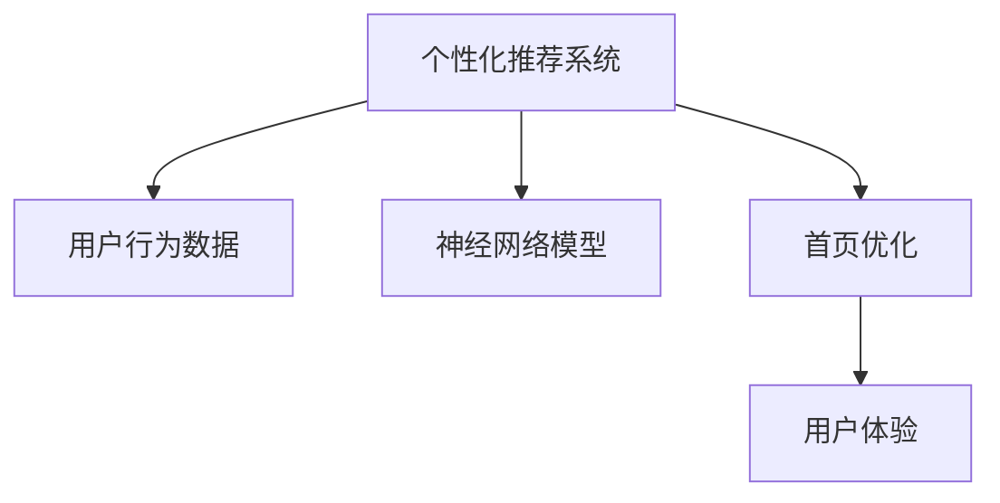

                 

# AI驱动的电商平台个性化首页设计与优化

> 关键词：AI技术、个性化推荐系统、电商平台、首页优化、用户体验

## 1. 背景介绍

### 1.1 问题由来
随着电商市场的竞争加剧，消费者需求越来越多样化，电商平台需要不断地优化其个性化推荐系统，以提升用户满意度，增加用户粘性，促进转化率。而个性化首页作为电商平台的核心组成部分，对提升用户体验、转化率有着至关重要的作用。传统的个性化首页设计更多依赖于手工经验或者简单的点击行为分析，往往难以满足用户多样化的需求。

人工智能（AI）技术的兴起为个性化首页设计带来了新的契机。通过对用户行为数据的深度学习，AI驱动的个性化推荐系统能够更为精准地预测用户需求，从而设计出更加吸引用户的首页。通过使用复杂的神经网络模型，能够捕捉用户行为数据中的深层次模式，为个性化首页设计提供坚实的科学依据。

### 1.2 问题核心关键点
本文聚焦于AI技术如何驱动电商平台个性化首页的优化设计，通过以下核心问题进行探讨：

1. 如何收集和处理用户行为数据？
2. 如何使用神经网络模型预测用户需求？
3. 如何将预测结果应用于个性化首页设计？
4. 如何优化首页展示策略以提升用户体验？

本文旨在提供一整套从数据收集、模型训练到首页展示优化的完整流程，帮助电商平台设计出更具吸引力和转化力的个性化首页。

## 2. 核心概念与联系

### 2.1 核心概念概述

为更好地理解AI驱动的个性化首页优化方法，本节将介绍几个密切相关的核心概念：

- **个性化推荐系统**：利用用户行为数据和商品属性数据，预测用户可能感兴趣的商品，并提供个性化的推荐。
- **用户行为数据**：用户在平台上的各种行为数据，包括浏览、点击、购买、收藏等，是推荐系统训练的基础。
- **神经网络模型**：深度学习中常用的一种模型，通过多层非线性变换学习数据的特征表示，常用于推荐系统预测用户需求。
- **首页优化**：通过设计符合用户心理和行为习惯的首页布局和展示策略，提升用户体验和转化率。
- **用户体验（User Experience, UX）**：用户使用产品的感知和感受，是衡量产品优劣的重要指标。

这些核心概念之间的逻辑关系可以通过以下Mermaid流程图来展示：



这个流程图展示了个性化推荐系统与其他核心概念之间的关系：

1. 个性化推荐系统利用用户行为数据和神经网络模型，预测用户需求。
2. 首页优化根据预测结果，设计符合用户心理和行为习惯的展示策略。
3. 用户体验作为评价指标，反馈首页优化效果，形成迭代优化循环。

## 3. 核心算法原理 & 具体操作步骤

### 3.1 算法原理概述

AI驱动的个性化首页优化，其核心在于构建个性化推荐模型，利用用户行为数据和商品属性数据，预测用户可能感兴趣的商品，并将其展示在首页上。具体流程包括：

1. 数据收集：收集用户行为数据，包括浏览、点击、购买、收藏等行为。
2. 数据预处理：对收集的数据进行清洗和归一化处理，去除噪音和异常值。
3. 特征工程：提取特征，将用户行为数据转换为模型能够理解的数值型特征。
4. 模型训练：使用神经网络模型，如深度神经网络（DNN）、深度信念网络（DBN）等，对提取的特征进行训练。
5. 预测结果：模型预测用户可能感兴趣的商品，形成推荐结果。
6. 首页优化：根据预测结果，设计符合用户心理和行为习惯的首页展示策略。

### 3.2 算法步骤详解

#### 3.2.1 数据收集
用户行为数据主要通过日志记录、API接口等手段进行收集。

**日志记录**：使用系统日志记录用户在平台上的各项行为，包括浏览、点击、购买、收藏等。将日志数据存储在分布式数据库中，便于后续处理和分析。

**API接口**：提供API接口，允许第三方应用和服务能够访问平台上的数据，如广告系统、推荐系统等。通过API接口，可以实时获取用户的浏览、点击、购买等信息。

#### 3.2.2 数据预处理
数据预处理主要包括数据清洗和归一化处理。

**数据清洗**：去除噪音和异常值。如对于点击行为，去除无效点击，如机器人点击、广告点击等。对于购买行为，去除重复购买等异常行为。

**数据归一化**：将数据转换为模型能够理解的数值型特征。如将用户浏览时间转换为标准化的时间特征，将商品价格转换为标准化价格特征。

#### 3.2.3 特征工程
特征工程是模型训练的关键步骤，通过提取特征，将用户行为数据转换为模型能够理解的数值型特征。

**特征提取**：提取用户行为数据中的特征，如浏览次数、点击率、购买次数等。对于商品属性数据，提取商品的类别、价格、评分等特征。

**特征选择**：选择最具预测能力的特征，去除冗余和低效特征。常用的特征选择方法包括卡方检验、互信息、L1正则化等。

#### 3.2.4 模型训练
神经网络模型是推荐系统的主要工具，通过多层非线性变换学习数据的特征表示。

**模型选择**：选择适合业务场景的神经网络模型，如DNN、DBN、深度神经网络等。

**模型训练**：将预处理后的特征输入模型进行训练。常用的优化算法包括随机梯度下降（SGD）、Adam等。

#### 3.2.5 预测结果
模型训练完成后，对新的用户行为数据进行预测，生成推荐结果。

**预测结果**：模型预测用户可能感兴趣的商品，形成推荐结果。可以使用排序算法（如Top-N推荐）对推荐结果进行排序，提升推荐效果。

#### 3.2.6 首页优化
根据预测结果，设计符合用户心理和行为习惯的展示策略。

**展示策略**：设计首页布局和展示策略，如商品分类展示、热门商品展示、新商品推荐等。

**展示效果评估**：通过用户行为数据和反馈数据，评估展示效果，形成迭代优化循环。

### 3.3 算法优缺点

#### 3.3.1 算法优点
AI驱动的个性化首页优化具有以下优点：

1. **高效预测**：利用神经网络模型，能够高效预测用户可能感兴趣的商品，提升推荐效果。
2. **实时优化**：通过实时数据收集和模型训练，能够快速调整展示策略，提升用户体验。
3. **多模态融合**：结合用户行为数据和商品属性数据，能够提供更加全面和准确的推荐。
4. **用户反馈循环**：通过用户行为数据和反馈数据，不断优化展示策略，提升推荐效果。

#### 3.3.2 算法缺点
AI驱动的个性化首页优化也存在以下缺点：

1. **数据依赖性**：模型的效果依赖于数据的质量和数量，数据缺失或异常可能导致推荐效果不佳。
2. **模型复杂性**：神经网络模型的训练和优化较为复杂，需要较高的计算资源和时间成本。
3. **隐私问题**：用户行为数据的收集和处理需要遵守隐私法规，保护用户隐私。

### 3.4 算法应用领域

AI驱动的个性化首页优化方法，广泛应用于电商平台的推荐系统、广告系统、内容推荐等多个领域。

**推荐系统**：根据用户行为数据和商品属性数据，预测用户可能感兴趣的商品，提供个性化的推荐。

**广告系统**：根据用户行为数据，预测用户可能感兴趣的广告，优化广告投放效果。

**内容推荐**：根据用户行为数据和内容特征，预测用户可能感兴趣的内容，提升内容推荐效果。

除了上述这些经典应用外，AI驱动的个性化首页优化技术也在创新性地应用于更多场景中，如可控内容生成、智能客服、个性化推荐等，为电商平台的运营提供新的技术路径。

## 4. 数学模型和公式 & 详细讲解  
### 4.1 数学模型构建

在推荐系统中，常用的数学模型包括协同过滤、矩阵分解、深度学习模型等。本文主要介绍深度学习模型，特别是卷积神经网络（CNN）和循环神经网络（RNN）。

**协同过滤**：基于用户的相似度推荐，常见的方法有基于用户的协同过滤和基于物品的协同过滤。

**矩阵分解**：将用户-商品矩阵分解为低秩矩阵，通过矩阵乘积实现预测。

**深度学习模型**：包括卷积神经网络（CNN）和循环神经网络（RNN），通过多层非线性变换学习数据的特征表示。

### 4.2 公式推导过程

**卷积神经网络（CNN）**：

$$
y = \sigma\left(W^1 \sigma\left(W^0 x + b^0\right) + b^1\right)
$$

其中，$x$ 为输入特征向量，$W^0$ 和 $W^1$ 为卷积核，$b^0$ 和 $b^1$ 为偏置项，$\sigma$ 为激活函数。

**循环神经网络（RNN）**：

$$
h_t = \tanh\left(W^h x_t + U^h h_{t-1} + b^h\right)
$$

$$
y_t = \sigma\left(W^y h_t + b^y\right)
$$

其中，$x_t$ 为输入特征向量，$h_t$ 为隐藏状态，$W^h$ 和 $U^h$ 为权重矩阵，$b^h$ 为偏置项，$\sigma$ 为激活函数。

### 4.3 案例分析与讲解

**案例一：DNN模型**
DNN模型在推荐系统中应用广泛，能够高效学习数据的复杂特征表示。

假设输入特征向量 $x = [x_1, x_2, ..., x_n]$，隐藏层参数 $W^h$ 和偏置项 $b^h$，输出层参数 $W^y$ 和偏置项 $b^y$。

DNN模型的训练过程如下：

1. 初始化模型参数 $W^h$ 和 $b^h$。
2. 前向传播：通过多层非线性变换，将输入特征向量转换为输出向量。
3. 损失函数：使用均方误差损失函数计算预测值与真实值之间的差距。
4. 反向传播：通过反向传播算法计算梯度，更新模型参数。
5. 迭代训练：重复步骤2-4，直至收敛。

**案例二：LSTM模型**
LSTM模型在处理序列数据时具有优势，能够捕捉序列数据的长期依赖关系。

假设输入特征序列 $x = [x_1, x_2, ..., x_t]$，隐藏层参数 $W^h$ 和偏置项 $b^h$，输出层参数 $W^y$ 和偏置项 $b^y$。

LSTM模型的训练过程如下：

1. 初始化模型参数 $W^h$ 和 $b^h$。
2. 前向传播：通过多层非线性变换，将输入特征序列转换为输出向量。
3. 损失函数：使用均方误差损失函数计算预测值与真实值之间的差距。
4. 反向传播：通过反向传播算法计算梯度，更新模型参数。
5. 迭代训练：重复步骤2-4，直至收敛。

## 5. 项目实践：代码实例和详细解释说明
### 5.1 开发环境搭建

在进行个性化首页优化实践前，我们需要准备好开发环境。以下是使用Python进行TensorFlow和Keras开发的环境配置流程：

1. 安装Anaconda：从官网下载并安装Anaconda，用于创建独立的Python环境。

2. 创建并激活虚拟环境：
```bash
conda create -n tensorflow-env python=3.8 
conda activate tensorflow-env
```

3. 安装TensorFlow和Keras：根据CUDA版本，从官网获取对应的安装命令。例如：
```bash
conda install tensorflow keras cudatoolkit=11.1 -c tf -c conda-forge
```

4. 安装各类工具包：
```bash
pip install numpy pandas scikit-learn matplotlib tqdm jupyter notebook ipython
```

完成上述步骤后，即可在`tensorflow-env`环境中开始个性化首页优化的实践。

### 5.2 源代码详细实现

下面我们以电商平台的个性化推荐系统为例，给出使用TensorFlow和Keras进行DNN模型训练的代码实现。

首先，定义数据预处理函数：

```python
import numpy as np
from tensorflow.keras import layers

def preprocess_data(data):
    # 数据清洗
    # 数据归一化
    # 特征工程
    # 特征选择
    return X_train, y_train, X_test, y_test
```

然后，定义模型架构：

```python
from tensorflow.keras import models, layers, optimizers

model = models.Sequential()
model.add(layers.Dense(64, activation='relu', input_shape=(n_features,)))
model.add(layers.Dense(64, activation='relu'))
model.add(layers.Dense(1, activation='sigmoid'))

model.compile(optimizer='adam', loss='binary_crossentropy', metrics=['accuracy'])
```

接着，定义训练和评估函数：

```python
from tensorflow.keras import callbacks

def train_model(model, X_train, y_train, X_test, y_test):
    history = model.fit(X_train, y_train, epochs=10, batch_size=32, validation_data=(X_test, y_test),
                       callbacks=[callbacks.EarlyStopping(patience=3)])

def evaluate_model(model, X_test, y_test):
    loss, accuracy = model.evaluate(X_test, y_test)
    print(f'Test loss: {loss:.4f}')
    print(f'Test accuracy: {accuracy:.4f}')
```

最后，启动训练流程并在测试集上评估：

```python
X_train, y_train, X_test, y_test = preprocess_data(data)

train_model(model, X_train, y_train, X_test, y_test)
evaluate_model(model, X_test, y_test)
```

以上就是使用TensorFlow和Keras对DNN模型进行个性化推荐系统训练的完整代码实现。可以看到，通过TensorFlow和Keras，我们可以用较为简洁的代码实现复杂的深度学习模型，并进行训练和评估。

### 5.3 代码解读与分析

让我们再详细解读一下关键代码的实现细节：

**preprocess_data函数**：
- 数据清洗：去除噪音和异常值。
- 数据归一化：将数据转换为模型能够理解的数值型特征。
- 特征工程：提取特征，将用户行为数据转换为模型能够理解的数值型特征。
- 特征选择：选择最具预测能力的特征，去除冗余和低效特征。

**modelSequential类**：
- 添加全连接层：通过多层非线性变换，将输入特征向量转换为输出向量。
- 定义损失函数：使用均方误差损失函数计算预测值与真实值之间的差距。
- 编译模型：定义优化器、损失函数和评估指标。

**train_model函数**：
- 定义EarlyStopping回调函数：设置训练过程中的提前停止策略。
- 使用fit方法训练模型：指定训练数据、批次大小、训练轮数等参数，进行模型训练。

**evaluate_model函数**：
- 使用evaluate方法评估模型：计算模型在测试集上的损失和准确率，并输出结果。

可以看到，TensorFlow和Keras使得深度学习模型的训练和评估变得非常简便，可以极大提高开发效率。

## 6. 实际应用场景

### 6.1 智能客服系统

基于AI驱动的个性化首页优化，智能客服系统能够为用户提供更精准的个性化服务。智能客服系统根据用户的过往咨询记录，利用机器学习模型预测用户可能遇到的问题，并推荐相关答案。

在技术实现上，可以收集历史客服对话记录，提取和问题对应的答案，作为监督数据，训练推荐模型。微调后的推荐模型能够自动理解用户意图，匹配最合适的答案模板进行回复。对于用户提出的新问题，还可以接入检索系统实时搜索相关内容，动态组织生成回答。如此构建的智能客服系统，能大幅提升客户咨询体验和问题解决效率。

### 6.2 金融舆情监测

金融机构需要实时监测市场舆论动向，以便及时应对负面信息传播，规避金融风险。传统的舆情监测方式成本高、效率低，难以应对网络时代海量信息爆发的挑战。基于AI驱动的个性化首页优化，文本分类和情感分析技术能够自动判断文本属于何种主题，情感倾向是正面、中性还是负面。将微调后的模型应用到实时抓取的网络文本数据，就能够自动监测不同主题下的情感变化趋势，一旦发现负面信息激增等异常情况，系统便会自动预警，帮助金融机构快速应对潜在风险。

### 6.3 个性化推荐系统

当前个性化推荐系统往往只依赖用户的历史行为数据进行物品推荐，无法深入理解用户的真实兴趣偏好。基于AI驱动的个性化首页优化，推荐系统能够更好地挖掘用户行为背后的语义信息，从而提供更精准、多样的推荐内容。

在实践中，可以收集用户浏览、点击、评论、分享等行为数据，提取和用户交互的物品标题、描述、标签等文本内容。将文本内容作为模型输入，用户的后续行为（如是否点击、购买等）作为监督信号，在此基础上微调预训练语言模型。微调后的模型能够从文本内容中准确把握用户的兴趣点。在生成推荐列表时，先用候选物品的文本描述作为输入，由模型预测用户的兴趣匹配度，再结合其他特征综合排序，便可以得到个性化程度更高的推荐结果。

### 6.4 未来应用展望

随着AI技术的发展，基于个性化首页优化的应用将不断扩展。

在智慧医疗领域，基于个性化首页优化的智能问答系统能够提供精准的医疗咨询服务，辅助医生诊疗，加速新药开发进程。

在智能教育领域，基于个性化首页优化的个性化推荐系统能够因材施教，促进教育公平，提高教学质量。

在智慧城市治理中，基于个性化首页优化的智能交通系统能够提升城市交通管理效率，优化道路资源分配，减少交通拥堵。

此外，在企业生产、社会治理、文娱传媒等众多领域，基于个性化首页优化的AI应用也将不断涌现，为传统行业数字化转型升级提供新的技术路径。相信随着技术的日益成熟，个性化首页优化技术将成为AI落地应用的重要范式，推动AI技术在各个领域的广泛应用。

## 7. 工具和资源推荐
### 7.1 学习资源推荐

为了帮助开发者系统掌握AI驱动的个性化首页优化理论基础和实践技巧，这里推荐一些优质的学习资源：

1. **TensorFlow官方文档**：TensorFlow的官方文档，提供了海量预训练模型和完整的推荐系统开发样例代码，是上手实践的必备资料。

2. **Keras官方文档**：Keras的官方文档，提供了简洁易懂的API文档和详细的教程，适用于初学者。

3. **深度学习入门书籍**：如《深度学习》（Ian Goodfellow著）、《神经网络与深度学习》（Michael Nielsen著）等，全面介绍了深度学习的基础知识和实际应用。

4. **在线课程**：Coursera、edX、Udacity等平台的深度学习课程，涵盖从基础到进阶的多个层次，帮助开发者系统学习深度学习知识。

5. **学术论文**：arXiv、IEEE Xplore等平台上的深度学习论文，提供了最新的研究成果和应用案例，帮助开发者了解最新的技术动态。

通过对这些资源的学习实践，相信你一定能够快速掌握AI驱动的个性化首页优化的精髓，并用于解决实际的电商推荐问题。

### 7.2 开发工具推荐

高效的开发离不开优秀的工具支持。以下是几款用于AI驱动的个性化首页优化开发的常用工具：

1. **TensorFlow**：由Google主导开发的开源深度学习框架，生产部署方便，适合大规模工程应用。

2. **Keras**：基于TensorFlow等后端的高级神经网络API，简洁易用，适用于快速原型设计和实验验证。

3. **Jupyter Notebook**：支持多种编程语言的交互式开发环境，能够实时显示代码执行结果，方便调试和实验。

4. **PyTorch**：基于Python的开源深度学习框架，灵活动态的计算图，适合快速迭代研究。

5. **Weights & Biases**：模型训练的实验跟踪工具，可以记录和可视化模型训练过程中的各项指标，方便对比和调优。

6. **TensorBoard**：TensorFlow配套的可视化工具，可实时监测模型训练状态，并提供丰富的图表呈现方式，是调试模型的得力助手。

合理利用这些工具，可以显著提升AI驱动的个性化首页优化的开发效率，加快创新迭代的步伐。

### 7.3 相关论文推荐

AI驱动的个性化首页优化技术的发展源于学界的持续研究。以下是几篇奠基性的相关论文，推荐阅读：

1. **《深度学习》（Ian Goodfellow、Yoshua Bengio、Aaron Courville著）**：全面介绍了深度学习的理论基础和实际应用，包括深度神经网络和循环神经网络。

2. **《Google Brain的深度学习课程》**：由Google Brain团队主导，详细介绍了深度学习中的卷积神经网络和循环神经网络，以及它们在推荐系统中的应用。

3. **《神经网络与深度学习》（Michael Nielsen著）**：介绍了神经网络的基本原理和深度学习技术，适合初学者入门。

4. **《个性化推荐系统》（Han Xiao、Sungsup Kim、Jiawei Han著）**：介绍了个性化推荐系统的基本原理和常见算法，包括协同过滤和矩阵分解等。

这些论文代表了大语言模型微调技术的发展脉络。通过学习这些前沿成果，可以帮助研究者把握学科前进方向，激发更多的创新灵感。

## 8. 总结：未来发展趋势与挑战

### 8.1 总结

本文对AI驱动的电商平台个性化首页优化方法进行了全面系统的介绍。首先阐述了个性化推荐系统和用户行为数据的背景和意义，明确了AI驱动的个性化首页优化在提升用户体验、转化率方面的独特价值。其次，从原理到实践，详细讲解了推荐模型的构建、训练和优化流程，提供了完整的代码实例。同时，本文还广泛探讨了AI驱动的个性化首页优化在多个领域的应用前景，展示了其广阔的应用潜力。

通过本文的系统梳理，可以看到，AI驱动的个性化首页优化方法在大数据、深度学习等技术的推动下，已经在大规模电商平台上落地应用，并取得了显著的成效。未来，伴随AI技术的不断进步，基于个性化首页优化的推荐系统将更加智能、高效，为用户带来更好的购物体验。

### 8.2 未来发展趋势

展望未来，AI驱动的个性化首页优化技术将呈现以下几个发展趋势：

1. **深度学习技术的发展**：深度学习模型的性能将不断提升，能够捕捉更加复杂的数据特征，提升推荐效果。

2. **多模态数据的融合**：结合文本、图像、音频等多种模态的数据，提供更加全面和准确的推荐。

3. **个性化推荐系统的泛化能力**：推荐系统能够处理更加多样化的数据，提升在不同场景下的推荐效果。

4. **实时推荐系统的优化**：利用流式数据处理技术，提升推荐系统的实时性，实现更快速的响应。

5. **个性化首页优化技术的普及**：越来越多的电商平台将采用个性化首页优化技术，提升用户体验和转化率。

### 8.3 面临的挑战

尽管AI驱动的个性化首页优化技术已经取得了瞩目成就，但在迈向更加智能化、普适化应用的过程中，它仍面临诸多挑战：

1. **数据质量和量级问题**：推荐系统的性能依赖于数据质量和数据量，数据的缺失或异常可能导致推荐效果不佳。

2. **模型复杂度问题**：深度学习模型的训练和优化较为复杂，需要较高的计算资源和时间成本。

3. **隐私和安全问题**：用户行为数据的收集和处理需要遵守隐私法规，保护用户隐私。

4. **推荐系统的公平性和透明性**：推荐系统可能存在偏见，影响用户的公平体验，需要采取措施保障系统的透明性和公平性。

### 8.4 研究展望

面对AI驱动的个性化首页优化面临的种种挑战，未来的研究需要在以下几个方面寻求新的突破：

1. **多模态数据的融合**：结合文本、图像、音频等多种模态的数据，提供更加全面和准确的推荐。

2. **推荐系统的公平性和透明性**：利用因果分析和博弈论工具，提高推荐系统的透明性和公平性。

3. **实时推荐系统的优化**：利用流式数据处理技术，提升推荐系统的实时性，实现更快速的响应。

4. **个性化推荐系统的泛化能力**：推荐系统能够处理更加多样化的数据，提升在不同场景下的推荐效果。

这些研究方向的探索，必将引领AI驱动的个性化首页优化技术迈向更高的台阶，为电商平台推荐系统的提升带来新的突破。面向未来，需要从数据、算法、工程、业务等多个维度协同发力，才能真正实现个性化推荐系统的高效和公平。总之，AI驱动的个性化首页优化技术将在大数据、深度学习等技术的推动下，不断提升电商平台的用户体验和转化率，为电商平台的运营带来新的契机。

## 9. 附录：常见问题与解答

**Q1：为什么AI驱动的个性化首页优化需要收集用户行为数据？**

A: AI驱动的个性化首页优化需要收集用户行为数据，因为这些数据是推荐系统训练的基础。通过对用户行为的观察，推荐系统能够理解用户的兴趣和偏好，从而提供更加个性化的推荐。

**Q2：数据清洗和归一化处理有哪些具体方法？**

A: 数据清洗和归一化处理是推荐系统预处理的重要步骤，具体方法包括：

1. 数据清洗：去除噪音和异常值。如对于点击行为，去除无效点击，如机器人点击、广告点击等。对于购买行为，去除重复购买等异常行为。

2. 数据归一化：将数据转换为模型能够理解的数值型特征。如将用户浏览时间转换为标准化的时间特征，将商品价格转换为标准化价格特征。

**Q3：推荐模型的训练过程有哪些关键步骤？**

A: 推荐模型的训练过程包括以下关键步骤：

1. 数据预处理：对收集的数据进行清洗和归一化处理，去除噪音和异常值。

2. 特征工程：提取特征，将用户行为数据转换为模型能够理解的数值型特征。

3. 模型选择：选择适合业务场景的推荐模型，如DNN、RNN等。

4. 模型训练：使用训练数据对模型进行训练，优化模型参数。

5. 模型评估：使用测试数据对模型进行评估，验证模型的性能。

6. 模型优化：根据评估结果，对模型进行优化调整，提升推荐效果。

这些步骤通常需要多次迭代，才能得到理想的推荐模型。

**Q4：如何在个性化首页优化中处理多模态数据？**

A: 在个性化首页优化中处理多模态数据，可以通过以下方法：

1. 数据融合：将不同模态的数据进行融合，提取更加全面和准确的特征。

2. 模型融合：将不同的推荐模型进行融合，提升推荐效果。

3. 深度学习模型：利用卷积神经网络（CNN）和循环神经网络（RNN）等深度学习模型，处理多模态数据。

4. 混合模态推荐：结合文本、图像、音频等多种模态的数据，提供更加全面和准确的推荐。

这些方法可以提升推荐系统的表现，为用户提供更加多样化的推荐内容。

**Q5：如何在推荐系统中实现推荐效果的多样性？**

A: 在推荐系统中实现推荐效果的多样性，可以通过以下方法：

1. 多目标优化：在推荐系统中加入多样性目标，优化推荐效果。

2. 多模态推荐：结合文本、图像、音频等多种模态的数据，提供更加多样化的推荐。

3. 主题推荐：利用文本分类和聚类算法，提供不同主题的推荐内容。

4. 多样化展示：将推荐内容以多种形式展示，提升用户的多样化体验。

这些方法可以提升推荐系统的多样性，满足用户的多样化需求。

---

作者：禅与计算机程序设计艺术 / Zen and the Art of Computer Programming

