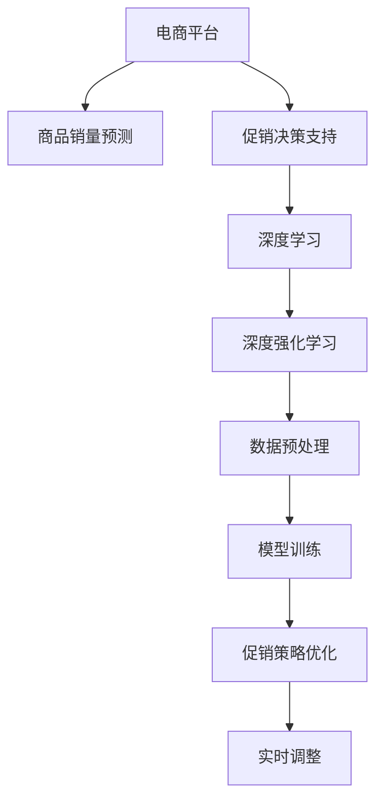

                 

# AI驱动的电商平台商品销量预测与促销决策支持

> 关键词：人工智能，电商，商品销量预测，促销决策，机器学习，深度学习，深度强化学习

## 1. 背景介绍

### 1.1 问题由来

随着互联网的普及和电子商务的发展，电商平台已经成为消费者购物的重要渠道。电商平台拥有海量的商品信息，但如何精准预测商品销量，制定科学的促销策略，仍然是一个亟待解决的难题。传统的数据分析方法已经难以应对复杂的市场变化和海量数据，因此，利用AI技术进行商品销量预测和促销决策支持，已经成为电商行业的重要发展方向。

### 1.2 问题核心关键点

AI驱动的商品销量预测与促销决策支持，关键在于利用机器学习、深度学习、强化学习等AI技术，结合电商数据特征，构建模型进行销量预测，并根据预测结果制定最优的促销策略。主要技术路线包括：

- **数据预处理**：清洗、转换和标准化电商数据，以便于模型训练。
- **模型训练**：利用历史销量数据和电商特征，训练销量预测模型。
- **促销策略优化**：根据预测结果，优化促销活动的时间和类型，以最大化销售收益。
- **实时调整**：根据实时数据，动态调整促销策略，保证促销效果。

## 2. 核心概念与联系

### 2.1 核心概念概述

为更好地理解AI驱动的商品销量预测与促销决策支持，本节将介绍几个密切相关的核心概念：

- **人工智能(AI)**：一种模拟人类智能的计算机技术，通过学习和推理实现各种任务，如图像识别、自然语言处理等。
- **电商平台**：以互联网为基础，通过网站或APP提供商品交易服务的平台，如亚马逊、京东、淘宝等。
- **商品销量预测**：利用历史销售数据和相关特征，预测未来某一时间段内的商品销量，以指导库存管理和促销活动。
- **促销决策支持**：通过数据分析和机器学习技术，为电商平台的促销活动提供数据支持和策略优化，以提高销售收益。
- **深度学习**：一类基于神经网络的机器学习算法，通过多层次的特征提取和抽象，实现复杂的模式识别和决策。
- **深度强化学习**：一种结合深度学习和强化学习的方法，通过与环境互动，优化决策策略，应用于游戏、机器人等领域。

这些核心概念之间的逻辑关系可以通过以下Mermaid流程图来展示：



这个流程图展示了大语言模型的核心概念及其之间的关系：

1. 电商平台通过数据预处理获得可用数据，在模型训练过程中提供训练样本。
2. 深度学习模型用于构建销量预测和促销决策模型，提升预测和决策的准确性。
3. 深度强化学习模型用于优化促销策略，自动调整决策参数。
4. 实时调整模型根据最新数据动态调整策略，保证促销效果。

这些概念共同构成了AI驱动的商品销量预测与促销决策支持的基础框架，使得电商平台的销售预测和决策过程更加智能化和自动化。

## 3. 核心算法原理 & 具体操作步骤
### 3.1 算法原理概述

AI驱动的商品销量预测与促销决策支持，主要基于以下原理：

1. **数据预处理**：清洗、转换和标准化电商数据，以降低噪声，提高数据质量。
2. **模型训练**：利用历史销量数据和电商特征，训练销量预测模型，如线性回归、随机森林、神经网络等。
3. **促销策略优化**：结合预测结果，设计促销活动的时间、类型和力度，以最大化销售收益。
4. **实时调整**：根据实时数据，动态调整促销策略，保证促销效果。

具体的算法流程如下：

1. **数据收集与预处理**：
   - 收集电商平台的历史销量数据，包括销售时间、商品类别、促销活动等。
   - 收集电商特征数据，如商品描述、价格、评论等。
   - 进行数据清洗和转换，如缺失值处理、数据归一化、特征提取等。

2. **模型训练**：
   - 选择或设计合适的机器学习模型，进行训练。
   - 使用交叉验证技术，评估模型的预测性能。
   - 根据评估结果，调整模型参数和特征选择。

3. **促销策略优化**：
   - 结合预测结果，设计促销活动的时间、类型和力度。
   - 使用模拟和优化算法，评估不同策略的效果。
   - 选择最优策略，进行实际推广。

4. **实时调整**：
   - 收集实时销售数据，进行预测和策略评估。
   - 根据实时数据，动态调整促销策略。
   - 监测促销效果，不断优化策略。

### 3.2 算法步骤详解

以下是AI驱动的商品销量预测与促销决策支持的具体操作步骤：

**Step 1: 数据收集与预处理**

- 收集电商平台的历史销量数据，包括销售时间、商品类别、促销活动等。
- 收集电商特征数据，如商品描述、价格、评论等。
- 进行数据清洗和转换，如缺失值处理、数据归一化、特征提取等。

**Step 2: 模型训练**

- 选择或设计合适的机器学习模型，进行训练。
- 使用交叉验证技术，评估模型的预测性能。
- 根据评估结果，调整模型参数和特征选择。

**Step 3: 促销策略优化**

- 结合预测结果，设计促销活动的时间、类型和力度。
- 使用模拟和优化算法，评估不同策略的效果。
- 选择最优策略，进行实际推广。

**Step 4: 实时调整**

- 收集实时销售数据，进行预测和策略评估。
- 根据实时数据，动态调整促销策略。
- 监测促销效果，不断优化策略。

### 3.3 算法优缺点

AI驱动的商品销量预测与促销决策支持，具有以下优点：

1. **高效准确**：通过机器学习和深度学习模型，可以快速准确地预测商品销量，优化促销策略。
2. **灵活性高**：可以灵活调整模型参数和特征，适应不同的电商场景和促销需求。
3. **实时性**：利用实时数据进行动态调整，保证促销策略的时效性。

同时，该方法也存在一定的局限性：

1. **数据依赖性高**：模型性能依赖于历史数据的丰富度和质量。
2. **计算资源需求大**：深度学习模型需要较大的计算资源和时间进行训练。
3. **策略复杂度**：促销策略的设计和优化过程较为复杂，需要多轮迭代和模拟。

尽管存在这些局限性，但就目前而言，AI驱动的商品销量预测与促销决策支持是电商行业的主要技术手段，已经得到了广泛的应用。未来相关研究的重点在于如何进一步降低计算资源需求，提高策略设计的自动化和智能化，同时兼顾模型的可解释性和公平性等因素。

### 3.4 算法应用领域

AI驱动的商品销量预测与促销决策支持，在电商领域已经得到了广泛的应用，覆盖了几乎所有常见场景，例如：

- 新商品发布预测：预测新商品的市场反应和销量，指导商品发布策略。
- 库存管理：根据销量预测结果，优化库存水平，减少库存成本。
- 价格优化：根据促销策略和实时销售数据，动态调整商品价格。
- 营销活动效果评估：评估不同营销活动的效果，指导后续活动设计。
- 用户行为分析：分析用户购买行为，个性化推荐商品，提升用户体验。

除了上述这些经典场景外，AI驱动的销量预测与促销决策支持，还被创新性地应用到更多场景中，如品牌推荐、广告投放、退货管理等，为电商运营提供了全面的技术支持。

## 4. 数学模型和公式 & 详细讲解 & 举例说明

### 4.1 数学模型构建

本节将使用数学语言对AI驱动的商品销量预测与促销决策支持过程进行更加严格的刻画。

记电商平台的历史销量数据为 $X=\{(x_i, y_i)\}_{i=1}^N$，其中 $x_i \in \mathcal{X}$ 为电商特征向量，$y_i \in \mathcal{Y}$ 为销量标签。

定义销量预测模型为 $f: \mathcal{X} \rightarrow \mathcal{Y}$，其中 $f(x)$ 为销量预测值。预测模型可以是一个线性回归模型、随机森林模型、神经网络模型等。

### 4.2 公式推导过程

以下我们以线性回归模型为例，推导销量预测模型的损失函数及其梯度计算公式。

假设销量预测模型为 $f(x; \theta) = \theta^T\varphi(x)$，其中 $\varphi(x)$ 为特征映射函数，$\theta \in \mathbb{R}^d$ 为模型参数。

损失函数定义为均方误差损失，即：

$$
\mathcal{L}(\theta) = \frac{1}{N}\sum_{i=1}^N (y_i - f(x_i; \theta))^2
$$

对损失函数求导，得到梯度：

$$
\frac{\partial \mathcal{L}(\theta)}{\partial \theta_j} = \frac{2}{N}\sum_{i=1}^N (y_i - f(x_i; \theta))\varphi_j(x_i)
$$

其中 $\varphi_j(x_i)$ 为特征映射函数对特征 $x_i$ 的第 $j$ 个特征的偏导数。

在得到梯度后，即可带入参数更新公式，完成模型的迭代优化。重复上述过程直至收敛，最终得到适应电商场景的销量预测模型。

## 5. 项目实践：代码实例和详细解释说明
### 5.1 开发环境搭建

在进行商品销量预测与促销决策支持开发前，我们需要准备好开发环境。以下是使用Python进行TensorFlow开发的环境配置流程：

1. 安装Anaconda：从官网下载并安装Anaconda，用于创建独立的Python环境。

2. 创建并激活虚拟环境：
```bash
conda create -n tensorflow-env python=3.8 
conda activate tensorflow-env
```

3. 安装TensorFlow：根据CUDA版本，从官网获取对应的安装命令。例如：
```bash
conda install tensorflow -c pytorch -c conda-forge
```

4. 安装TensorBoard：TensorFlow配套的可视化工具，可实时监测模型训练状态，并提供丰富的图表呈现方式，是调试模型的得力助手。
```bash
pip install tensorboard
```

5. 安装Pandas、Numpy、Matplotlib、Scikit-Learn等数据处理和分析库：
```bash
pip install pandas numpy matplotlib scikit-learn
```

完成上述步骤后，即可在`tensorflow-env`环境中开始项目实践。

### 5.2 源代码详细实现

下面我们以电商平台促销策略优化为例，给出使用TensorFlow进行商品销量预测与促销决策支持的PyTorch代码实现。

首先，定义促销策略优化的数据处理函数：

```python
import tensorflow as tf
from tensorflow import keras

# 定义促销策略优化的数据处理函数
def preprocess_data(data):
    # 数据清洗和转换
    # 例如：缺失值处理、数据归一化、特征提取等
    # 返回预处理后的数据
    return processed_data
```

然后，定义促销策略优化的模型：

```python
# 定义促销策略优化的模型
class PromotionsOptimizer(keras.Model):
    def __init__(self, input_shape, num_classes):
        super(PromotionsOptimizer, self).__init__()
        self.input_shape = input_shape
        self.num_classes = num_classes
        
        # 定义模型结构
        self.dense1 = keras.layers.Dense(64, activation='relu', input_shape=input_shape)
        self.dense2 = keras.layers.Dense(32, activation='relu')
        self.output_layer = keras.layers.Dense(num_classes, activation='softmax')
    
    def call(self, x):
        x = self.dense1(x)
        x = self.dense2(x)
        return self.output_layer(x)
```

接着，定义促销策略优化的优化器：

```python
# 定义促销策略优化的优化器
optimizer = tf.keras.optimizers.Adam(lr=0.001)
```

然后，定义促销策略优化的训练函数：

```python
# 定义促销策略优化的训练函数
def train_model(model, dataset, epochs, batch_size):
    model.compile(optimizer=optimizer, loss='categorical_crossentropy', metrics=['accuracy'])
    
    history = model.fit(dataset, batch_size=batch_size, epochs=epochs, validation_split=0.2)
    
    # 返回训练结果
    return history
```

最后，启动训练流程：

```python
# 定义训练数据集
train_dataset = ...
val_dataset = ...
test_dataset = ...

# 定义模型
model = PromotionsOptimizer(input_shape, num_classes)

# 定义优化器
optimizer = tf.keras.optimizers.Adam(lr=0.001)

# 定义训练函数
history = train_model(model, train_dataset, epochs=10, batch_size=32)

# 在测试集上评估模型
test_loss, test_acc = model.evaluate(test_dataset)
print(f"Test accuracy: {test_acc}")
```

以上就是使用TensorFlow进行促销策略优化的完整代码实现。可以看到，借助TensorFlow的强大封装，我们可以用相对简洁的代码完成促销策略优化的开发。

### 5.3 代码解读与分析

让我们再详细解读一下关键代码的实现细节：

**preprocess_data函数**：
- 定义促销策略优化的数据处理函数，用于对原始数据进行清洗、转换和标准化。

**PromotionsOptimizer类**：
- 定义促销策略优化的模型，包括输入层、隐藏层和输出层。
- 输入层接收电商特征向量，隐藏层和输出层通过非线性激活函数实现特征提取和分类。

**train_model函数**：
- 定义促销策略优化的训练函数，使用Adam优化器和交叉熵损失函数。
- 在训练过程中，根据验证集的准确率判断模型是否过拟合，避免过拟合。

**训练流程**：
- 定义训练数据集，包括训练集、验证集和测试集。
- 定义模型和优化器。
- 调用训练函数进行模型训练。
- 在测试集上评估模型性能。

可以看到，TensorFlow的Keras API使得促销策略优化的代码实现变得简洁高效。开发者可以将更多精力放在数据处理、模型改进等高层逻辑上，而不必过多关注底层的实现细节。

当然，工业级的系统实现还需考虑更多因素，如模型的保存和部署、超参数的自动搜索、更灵活的任务适配层等。但核心的促销策略优化范式基本与此类似。

## 6. 实际应用场景

### 6.1 智能推荐系统

智能推荐系统是AI驱动的电商平台商品销量预测与促销决策支持的重要应用场景之一。通过推荐系统，电商平台可以根据用户的历史行为和偏好，向用户推荐其可能感兴趣的商品，提高用户满意度和转化率。

在技术实现上，可以收集用户的历史点击、购买、浏览等行为数据，提取商品特征，利用深度学习模型进行推荐。推荐模型可以基于销量预测结果，动态调整推荐商品的顺序和类型，实现更精准的商品推荐。

### 6.2 库存管理

库存管理是电商平台运营的重要环节，需要准确预测商品需求，优化库存水平，避免库存积压和缺货。AI驱动的商品销量预测与促销决策支持，可以实时监控销售数据，预测未来销量，从而优化库存水平，降低库存成本。

具体而言，可以根据销量预测结果，自动生成补货计划和促销活动，确保库存水平在合理范围内。同时，结合销售数据和促销活动的效果，不断调整库存策略，优化库存管理。

### 6.3 用户行为分析

用户行为分析是电商平台用户运营的重要手段，可以帮助电商平台了解用户需求和行为模式，提升用户体验和满意度。AI驱动的商品销量预测与促销决策支持，可以结合用户行为数据和销量预测结果，深入分析用户需求和行为模式，实现个性化推荐和精准营销。

例如，可以根据用户的历史购买记录、浏览记录和搜索记录，结合销量预测结果，分析用户偏好和需求，实现个性化推荐。同时，根据促销活动的效果，不断优化推荐算法和促销策略，提升用户满意度。

### 6.4 未来应用展望

随着AI驱动的商品销量预测与促销决策支持技术的不断发展，未来将在更多领域得到应用，为电商运营带来新的变革。

在智慧零售领域，AI驱动的预测与决策支持，可以实现精准库存管理、智能货架优化、个性化推荐等，提升零售体验和运营效率。

在供应链管理中，AI驱动的预测与决策支持，可以实现需求预测、物流优化、库存协调等，提升供应链的整体效率和响应速度。

在金融科技领域，AI驱动的预测与决策支持，可以实现风险评估、客户画像、市场预测等，提升金融服务的智能化水平。

此外，在健康医疗、旅游出行、能源环保等众多领域，AI驱动的预测与决策支持，也将不断涌现，为行业数字化转型提供新的动力。相信随着技术的日益成熟，AI驱动的商品销量预测与促销决策支持必将在更广阔的应用领域大放异彩。

## 7. 工具和资源推荐
### 7.1 学习资源推荐

为了帮助开发者系统掌握AI驱动的商品销量预测与促销决策支持的理论基础和实践技巧，这里推荐一些优质的学习资源：

1. 《深度学习入门：基于TensorFlow的理论与实现》系列博文：由TensorFlow官方团队撰写，全面介绍了深度学习理论、TensorFlow实现和应用案例。

2. 《TensorFlow实战》书籍：由TensorFlow社区专家撰写，结合实际案例，深入浅出地介绍了TensorFlow的使用方法。

3. 《电商大数据分析与挖掘》课程：北京大学开设的电商数据处理与分析课程，覆盖电商数据清洗、特征工程、机器学习等核心内容。

4. 《Python机器学习》书籍：由机器学习专家撰写，全面介绍了Python在机器学习中的应用，包括TensorFlow等工具的使用。

5. Kaggle平台：数据科学竞赛平台，提供丰富的电商数据集和模型竞赛，可以实践和验证学习成果。

通过对这些资源的学习实践，相信你一定能够快速掌握AI驱动的商品销量预测与促销决策支持的技术要点，并用于解决实际的电商问题。

### 7.2 开发工具推荐

高效的开发离不开优秀的工具支持。以下是几款用于商品销量预测与促销决策支持开发的常用工具：

1. TensorFlow：由Google主导开发的开源深度学习框架，生产部署方便，适合大规模工程应用。
2. PyTorch：基于Python的开源深度学习框架，灵活动态的计算图，适合快速迭代研究。
3. Keras：高层次的深度学习API，便于快速搭建和训练模型，适合初学者和快速原型开发。
4. TensorBoard：TensorFlow配套的可视化工具，可实时监测模型训练状态，提供丰富的图表呈现方式。
5. Jupyter Notebook：交互式的数据分析和模型训练工具，方便代码的编写和调试。
6. Weights & Biases：模型训练的实验跟踪工具，可以记录和可视化模型训练过程中的各项指标，方便对比和调优。

合理利用这些工具，可以显著提升商品销量预测与促销决策支持的开发效率，加快创新迭代的步伐。

### 7.3 相关论文推荐

AI驱动的商品销量预测与促销决策支持技术的发展，得益于学界的持续研究。以下是几篇奠基性的相关论文，推荐阅读：

1. Predicting Future Sales from Historical Data（电商销量预测论文）：提出基于回归模型的销量预测方法，利用历史销售数据预测未来销量。

2. Anomaly Detection in Sales Data using Deep Learning（电商数据异常检测论文）：提出基于深度学习的销售数据异常检测方法，识别销售异常点。

3. Optimizing Promotion Strategy using Reinforcement Learning（促销策略优化论文）：提出基于强化学习的促销策略优化方法，最大化销售收益。

4. Recommender Systems in E-commerce（电商推荐系统论文）：全面介绍了电商推荐系统的实现方法和优化策略，包括深度学习和强化学习等技术。

5. Real-time Sales Forecasting in E-commerce（实时销售预测论文）：提出基于深度学习模型的实时销售预测方法，实时更新预测结果。

这些论文代表了大语言模型微调技术的发展脉络。通过学习这些前沿成果，可以帮助研究者把握学科前进方向，激发更多的创新灵感。

## 8. 总结：未来发展趋势与挑战

### 8.1 总结

本文对AI驱动的商品销量预测与促销决策支持方法进行了全面系统的介绍。首先阐述了该方法的原理和应用背景，明确了销量预测和促销决策的重要意义。其次，从原理到实践，详细讲解了模型的构建和训练过程，给出了完整的代码实现。同时，本文还广泛探讨了该方法在智能推荐、库存管理、用户行为分析等多个电商领域的应用前景，展示了其巨大的商业价值。

通过本文的系统梳理，可以看到，AI驱动的商品销量预测与促销决策支持技术已经成为电商行业的重要技术手段，极大地提升了电商平台的运营效率和用户满意度。未来，伴随技术的持续演进和应用场景的不断拓展，相信该技术将在更多领域得到应用，为社会各行业带来更广泛的影响。

### 8.2 未来发展趋势

展望未来，AI驱动的商品销量预测与促销决策支持技术将呈现以下几个发展趋势：

1. **深度学习模型的普及**：深度学习模型的精度和性能不断提高，将逐渐取代传统的机器学习模型，成为电商领域的主流技术手段。
2. **强化学习的引入**：结合强化学习技术，可以实现更加动态和灵活的促销策略优化，提升电商运营效率。
3. **实时计算的提升**：通过优化计算资源和算法，实现实时计算和动态调整，进一步提高电商平台的响应速度和运营效率。
4. **多模态数据的融合**：结合图像、视频、语音等多模态数据，提升电商平台的综合感知能力，实现更全面的用户行为分析。
5. **自动化和智能化水平的提升**：通过自动化和智能化技术，进一步提升电商平台的运营效率和用户体验。

这些趋势凸显了AI驱动的商品销量预测与促销决策支持技术的广阔前景。这些方向的探索发展，必将进一步提升电商平台的智能化水平，为消费者带来更加个性化、高效、安全的购物体验。

### 8.3 面临的挑战

尽管AI驱动的商品销量预测与促销决策支持技术已经取得了显著成果，但在迈向更加智能化、普适化应用的过程中，仍面临诸多挑战：

1. **数据质量和多样性**：电商数据的质量和多样性直接影响模型的性能，需要收集和处理大量的高维度和复杂数据。
2. **模型复杂性和计算资源**：深度学习模型的复杂性和计算资源需求较大，需要优化算法和优化资源配置。
3. **策略复杂性和实效性**：促销策略的设计和优化过程较为复杂，需要结合实时数据进行动态调整，保证策略的时效性。
4. **模型公平性和可解释性**：电商数据和模型可能存在偏见和歧视，需要设计公平和可解释的模型。
5. **安全性**：电商数据和模型的安全性问题，需要设计和实施严格的数据保护和隐私保护措施。

这些挑战需要多方协同努力，共同克服，才能推动AI驱动的商品销量预测与促销决策支持技术向更深层次、更广领域发展。

### 8.4 研究展望

面对AI驱动的商品销量预测与促销决策支持技术所面临的挑战，未来的研究需要在以下几个方面寻求新的突破：

1. **多模态数据融合**：结合图像、视频、语音等多模态数据，提升电商平台的综合感知能力，实现更全面的用户行为分析。
2. **深度强化学习**：结合深度学习和强化学习技术，实现更加动态和灵活的促销策略优化。
3. **实时计算优化**：通过优化计算资源和算法，实现实时计算和动态调整，进一步提高电商平台的响应速度和运营效率。
4. **自动化和智能化**：通过自动化和智能化技术，进一步提升电商平台的运营效率和用户体验。
5. **模型公平性和可解释性**：设计公平和可解释的模型，避免电商数据和模型中的偏见和歧视，增强模型透明度和可信度。
6. **安全性**：设计和实施严格的数据保护和隐私保护措施，确保电商数据和模型的安全性。

这些研究方向的探索，必将引领AI驱动的商品销量预测与促销决策支持技术迈向更高的台阶，为电商平台运营提供更智能、高效、安全的支持。面向未来，需要在技术、算法、数据、工程等多个维度协同发力，共同推动AI驱动的商品销量预测与促销决策支持技术的发展，为电商行业数字化转型升级贡献力量。

## 9. 附录：常见问题与解答

**Q1：AI驱动的商品销量预测与促销决策支持是否适用于所有电商平台？**

A: AI驱动的商品销量预测与促销决策支持方法适用于大多数电商平台，尤其是具有大数据、高复杂度的电商场景。但不同平台的电商数据和业务需求存在差异，需要根据具体情况进行模型和策略的调整。

**Q2：商品销量预测的精度如何保证？**

A: 商品销量预测的精度可以通过多轮模型训练和优化来保证，包括特征选择、模型选择、超参数调优等。同时，可以通过实时数据和策略调整，不断优化预测结果。

**Q3：促销策略如何动态调整？**

A: 促销策略的动态调整可以通过实时监测销售数据和模型预测结果，利用强化学习等方法，不断优化策略参数，保证促销效果。

**Q4：如何评估促销策略的效果？**

A: 促销策略的效果可以通过销售数据、用户反馈、用户行为分析等指标进行评估，同时可以结合A/B测试等方法，比较不同策略的效果。

**Q5：AI驱动的商品销量预测与促销决策支持是否需要持续迭代和优化？**

A: 是的，AI驱动的商品销量预测与促销决策支持方法需要持续迭代和优化，以适应市场变化和电商数据的更新。

---

作者：禅与计算机程序设计艺术 / Zen and the Art of Computer Programming

