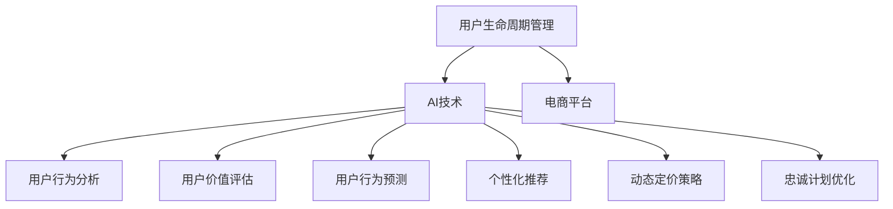

                 

# AI驱动的电商平台用户生命周期管理

> 关键词：用户生命周期管理, AI技术, 电商平台, 数据驱动, 客户价值, 精准营销

## 1. 背景介绍

在现代电子商务时代，用户生命周期管理(User Lifecycle Management, ULM)成为电商平台成功运营的重要一环。随着市场竞争的日益激烈，如何精准识别用户需求、持续提升用户价值、有效预测用户行为，成为电商平台亟待解决的挑战。

### 1.1 问题由来

随着互联网的普及和电子商务的不断发展，用户对电商平台的依赖度越来越高，用户忠诚度和留存率成为平台核心竞争力。传统的用户生命周期管理基于规则和经验，往往缺乏数据驱动的精细化分析和预测，难以实现个性化、高效化运营。为了在激烈的市场竞争中脱颖而出，电商平台需要借助先进的技术手段，将用户数据转化为洞察，驱动精准化营销，提升用户体验和商业价值。

### 1.2 问题核心关键点

用户生命周期管理的核心目标是通过科学的数据驱动方法，精准捕捉用户行为特征，分析用户价值和潜力，制定个性化的运营策略，实现用户价值的最大化和平台盈利能力的提升。主要包括以下几个关键点：

1. **用户行为分析**：从历史行为数据中提取有价值的用户特征，为个性化推荐、动态定价、忠诚计划等提供依据。
2. **用户价值评估**：利用预测模型，量化用户对平台的长期贡献，为资源分配、营销策略优化提供参考。
3. **用户行为预测**：基于机器学习模型，预测用户未来的行为，如复购、流失等，提前干预，降低运营风险。
4. **个性化推荐**：根据用户画像和历史行为，提供个性化商品推荐，提升用户购买意愿和满意度。
5. **动态定价策略**：根据用户价值和市场需求，实时调整产品价格，提高销售额和利润率。
6. **忠诚计划优化**：设计科学的忠诚计划，提升用户粘性和忠诚度。

## 2. 核心概念与联系

### 2.1 核心概念概述

为了更好地理解电商平台用户生命周期管理，本节将介绍几个密切相关的核心概念：

- **用户生命周期管理 (User Lifecycle Management, ULM)**：通过数据驱动的方法，精准识别和分析用户在电商平台上的行为特征、价值潜力和行为趋势，制定个性化的运营策略，以实现用户价值的最大化。

- **AI技术 (Artificial Intelligence)**：利用机器学习、深度学习等先进算法，自动化地处理和分析海量数据，从而实现用户行为预测、价值评估、推荐系统等关键功能。

- **电商平台 (E-commerce Platform)**：提供在线购物、商品展示、支付结算等功能的数字平台，是用户生命周期管理的实施载体。

- **客户价值 (Customer Value)**：用户对平台的长期贡献，包括购买金额、复购频率、品牌忠诚度等，是电商平台资源分配和营销策略优化的重要参考指标。

- **精准营销 (Precision Marketing)**：通过数据分析和机器学习算法，制定个性化的营销策略，提高营销效率和效果。

这些核心概念之间的逻辑关系可以通过以下Mermaid流程图来展示：



这个流程图展示了大语言模型的核心概念及其之间的关系：

1. 用户生命周期管理利用AI技术实现用户行为分析、价值评估、行为预测等功能。
2. 这些功能在电商平台上得以实现，驱动个性化推荐、动态定价、忠诚计划等策略。
3. 通过持续优化和反馈，平台不断提升用户价值和体验，形成良性循环。

## 3. 核心算法原理 & 具体操作步骤
### 3.1 算法原理概述

用户生命周期管理算法基于机器学习原理，主要分为数据预处理、特征工程、模型训练和结果应用四个步骤。

1. **数据预处理**：收集和清洗用户数据，包括交易记录、浏览历史、评价反馈、人口统计特征等。
2. **特征工程**：构建用户特征向量，包括行为特征、产品特征、时间特征、社交特征等。
3. **模型训练**：基于历史数据训练预测模型，如用户价值评估模型、行为预测模型等。
4. **结果应用**：根据模型输出进行个性化推荐、动态定价、忠诚计划优化等操作。

### 3.2 算法步骤详解

#### 3.2.1 数据预处理

数据预处理是用户生命周期管理算法的第一步，主要包括以下步骤：

1. **数据收集**：收集用户的历史交易数据、浏览数据、评价数据、人口统计数据等，用于后续分析和建模。
2. **数据清洗**：处理缺失值、异常值、重复数据等，确保数据质量和一致性。
3. **数据标准化**：将数据转化为标准格式，便于后续分析和模型训练。
4. **特征工程**：根据业务需求和模型需要，构建用户特征向量，包括行为特征、产品特征、时间特征、社交特征等。

#### 3.2.2 特征工程

特征工程是数据预处理的重要环节，决定了模型的预测能力和泛化性能。主要包括以下步骤：

1. **特征选择**：从原始数据中筛选出对目标变量影响较大的特征，减少维度。
2. **特征变换**：对原始特征进行标准化、归一化、离散化等变换，提升模型效果。
3. **特征构建**：根据业务逻辑和统计方法，构建新的特征组合，如时序特征、交叉特征等。

#### 3.2.3 模型训练

模型训练是用户生命周期管理算法的核心，主要包括以下步骤：

1. **选择合适的模型**：根据任务需求和数据特性，选择适合的机器学习模型，如回归模型、分类模型、聚类模型等。
2. **模型训练**：使用历史数据训练模型，调整模型参数，优化模型性能。
3. **模型评估**：使用测试集评估模型效果，确保模型泛化能力强。
4. **模型优化**：根据评估结果调整模型结构、算法参数等，提升模型效果。

#### 3.2.4 结果应用

结果应用是用户生命周期管理算法的最后一步，主要包括以下步骤：

1. **个性化推荐**：根据用户行为特征和模型输出，提供个性化的商品推荐，提升用户购买意愿。
2. **动态定价策略**：根据用户价值和市场需求，实时调整产品价格，提高销售额和利润率。
3. **忠诚计划优化**：设计科学的忠诚计划，提升用户粘性和忠诚度。

### 3.3 算法优缺点

用户生命周期管理算法具有以下优点：

1. **数据驱动**：通过数据分析和机器学习算法，实现用户行为预测、价值评估等功能，提升决策科学性。
2. **个性化**：根据用户行为特征和历史数据，提供个性化推荐和服务，提升用户体验。
3. **动态化**：利用实时数据和模型输出，实现动态定价和忠诚计划优化，提升运营效率。

但该算法也存在一定的局限性：

1. **数据需求高**：需要大量高质量的用户数据，对数据收集和清洗提出了高要求。
2. **模型复杂**：涉及多个步骤和算法，模型构建和调优难度较大。
3. **算法解释性差**：机器学习模型的输出缺乏解释性，难以理解决策过程。

尽管存在这些局限性，但用户生命周期管理算法在电商平台中已经得到了广泛应用，成为提升用户价值和运营效率的重要手段。

### 3.4 算法应用领域

用户生命周期管理算法在电商平台中的应用领域非常广泛，涵盖以下多个方面：

1. **用户行为分析**：通过数据分析和模型预测，识别用户行为特征和潜在需求，指导个性化推荐和动态定价。
2. **用户价值评估**：量化用户对平台的长期贡献，优化资源分配和营销策略。
3. **用户行为预测**：预测用户未来的行为，提前干预，降低运营风险。
4. **个性化推荐**：根据用户画像和历史行为，提供个性化商品推荐，提升用户购买意愿。
5. **动态定价策略**：根据用户价值和市场需求，实时调整产品价格，提高销售额和利润率。
6. **忠诚计划优化**：设计科学的忠诚计划，提升用户粘性和忠诚度。

## 4. 数学模型和公式 & 详细讲解 & 举例说明

### 4.1 数学模型构建

用户生命周期管理算法涉及多个数学模型，主要包括用户价值评估模型、行为预测模型、个性化推荐模型等。这里以用户价值评估模型为例，介绍模型的构建过程。

假设电商平台有$N$个用户，每个用户在$T$个时间段内的总价值为$V_i$，其中$i=1,2,\ldots,N$。根据业务需求，我们定义用户价值评估模型为：

$$
V_i = \alpha_0 + \sum_{t=1}^T \alpha_t \cdot F_i(t) + \epsilon_i
$$

其中：
- $\alpha_0$：常数项，表示用户的基本价值。
- $\alpha_t$：时间系数，表示时间对用户价值的影响。
- $F_i(t)$：特征向量，表示用户在时间$t$的特征。
- $\epsilon_i$：随机误差项。

### 4.2 公式推导过程

用户价值评估模型的推导过程如下：

1. **数据收集与清洗**：收集用户的历史交易数据、浏览数据、评价数据、人口统计数据等，并处理缺失值、异常值、重复数据等。
2. **特征工程**：构建用户特征向量，包括行为特征、产品特征、时间特征、社交特征等。
3. **模型训练**：使用历史数据训练模型，调整模型参数，优化模型性能。
4. **模型评估**：使用测试集评估模型效果，确保模型泛化能力强。
5. **模型优化**：根据评估结果调整模型结构、算法参数等，提升模型效果。

### 4.3 案例分析与讲解

假设某电商平台收集了10万个用户的交易数据，每个用户在一年内的总价值为$V_i$。我们采用线性回归模型，根据以下特征进行用户价值评估：

- 用户的平均交易金额
- 用户的复购频率
- 用户对品牌的忠诚度
- 用户的历史行为特征
- 用户的人口统计特征

我们定义特征向量$F_i(t)$如下：

$$
F_i(t) = [a_i(t), b_i(t), c_i(t), d_i(t), e_i(t)]
$$

其中，$a_i(t)$表示用户在第$t$天的平均交易金额，$b_i(t)$表示用户在第$t$天的复购频率，$c_i(t)$表示用户对品牌的忠诚度，$d_i(t)$表示用户的历史行为特征，$e_i(t)$表示用户的人口统计特征。

使用最小二乘法，我们可以得到用户价值评估模型的参数$\alpha$：

$$
\alpha = (X^TX)^{-1}X^TV
$$

其中$X$为特征矩阵，$V$为目标向量，$T$为目标矩阵。

## 5. 项目实践：代码实例和详细解释说明

### 5.1 开发环境搭建

在进行用户生命周期管理实践前，我们需要准备好开发环境。以下是使用Python进行TensorFlow开发的环境配置流程：

1. 安装Anaconda：从官网下载并安装Anaconda，用于创建独立的Python环境。

2. 创建并激活虚拟环境：
```bash
conda create -n user_lifecycle_env python=3.8 
conda activate user_lifecycle_env
```

3. 安装TensorFlow：根据CUDA版本，从官网获取对应的安装命令。例如：
```bash
conda install tensorflow
```

4. 安装各类工具包：
```bash
pip install numpy pandas scikit-learn matplotlib tqdm jupyter notebook ipython
```

完成上述步骤后，即可在`user_lifecycle_env`环境中开始用户生命周期管理的实践。

### 5.2 源代码详细实现

下面我们以用户价值评估为例，给出使用TensorFlow进行用户价值评估模型的PyTorch代码实现。

首先，定义用户价值评估模型的数据处理函数：

```python
import tensorflow as tf
import numpy as np

def preprocess_data(data):
    # 数据预处理
    data = data.dropna() # 去除缺失值
    data = data.drop_duplicates() # 去除重复数据
    data = data.fillna(data.mean()) # 填充缺失值
    return data

# 特征工程
def feature_engineering(data):
    # 构建特征向量
    features = []
    for i in range(len(data)):
        features.append(data[i]['avg_transaction_amount'])
        features.append(data[i]['purchase_frequency'])
        features.append(data[i]['brand_loyalty'])
        features.append(data[i]['historical_behavior'])
        features.append(data[i]['demographics'])
    return features

# 模型训练
def train_model(features, values):
    # 定义模型
    model = tf.keras.Sequential([
        tf.keras.layers.Dense(64, activation='relu'),
        tf.keras.layers.Dense(64, activation='relu'),
        tf.keras.layers.Dense(1)
    ])
    # 编译模型
    model.compile(optimizer='adam', loss='mse')
    # 训练模型
    model.fit(features, values, epochs=100, batch_size=32)
    return model
```

然后，定义用户价值评估模型：

```python
# 加载数据
data = pd.read_csv('user_data.csv')
data = preprocess_data(data)

# 特征工程
features = feature_engineering(data)

# 目标变量
values = data['total_value']

# 训练模型
model = train_model(features, values)
```

最后，启动训练流程并在测试集上评估：

```python
# 加载测试数据
test_data = pd.read_csv('test_user_data.csv')
test_data = preprocess_data(test_data)

# 特征工程
test_features = feature_engineering(test_data)

# 预测
test_values = model.predict(test_features)
```

以上就是使用TensorFlow进行用户价值评估模型的完整代码实现。可以看到，TensorFlow提供了便捷的API和强大的计算能力，使得模型构建和训练变得简洁高效。

### 5.3 代码解读与分析

让我们再详细解读一下关键代码的实现细节：

**preprocess_data函数**：
- 对数据进行预处理，去除缺失值、重复数据，并进行缺失值填充。

**feature_engineering函数**：
- 构建特征向量，包含用户的平均交易金额、复购频率、品牌忠诚度、历史行为和人口统计特征。

**train_model函数**：
- 定义多层感知器模型，包括两个隐藏层和一个输出层。
- 使用Adam优化器，均方误差损失函数进行训练，迭代次数为100，批次大小为32。

**train_model函数的调用**：
- 使用历史数据和目标变量训练模型，模型结构为[64, 64, 1]。

**模型评估**：
- 在测试集上评估模型效果，使用均方误差作为评估指标。

**测试数据预测**：
- 在测试集上加载数据并进行预处理，使用训练好的模型进行预测，输出用户价值评估结果。

## 6. 实际应用场景

### 6.1 智能推荐系统

智能推荐系统是电商平台用户生命周期管理的重要应用场景之一。通过用户行为分析和预测，电商平台能够实时调整推荐策略，提升用户购买意愿和满意度。

具体而言，可以根据用户的浏览记录、购买历史等行为数据，构建用户画像，使用协同过滤、内容推荐、基于图的推荐等算法，为用户提供个性化的商品推荐。通过不断迭代优化推荐模型，电商平台能够实现精准推荐，提高用户转化率和复购率。

### 6.2 动态定价策略

动态定价策略是电商平台提高销售额和利润率的重要手段。通过用户价值评估和行为预测，电商平台能够实时调整产品价格，实现个性化定价。

具体而言，可以基于用户历史购买数据和行为特征，预测用户未来的购买意愿和价格敏感度，根据不同用户群体的价值和需求，制定动态定价策略。例如，对于高价值用户，可以采用高价策略，而对于新用户，可以采用低价吸引策略。通过动态定价策略，电商平台能够提高整体营收和利润率。

### 6.3 忠诚计划优化

忠诚计划是电商平台提升用户粘性和忠诚度的重要工具。通过用户价值评估和行为预测，电商平台能够设计科学的忠诚计划，实现用户价值的最大化。

具体而言，可以基于用户历史价值和行为特征，预测用户未来的忠诚度和流失风险，设计个性化的忠诚计划，如积分奖励、会员专享优惠等。对于高价值用户，可以提供更高级别的服务，而对于低价值用户，可以采取激励措施提升其忠诚度。通过科学的忠诚计划，电商平台能够有效提高用户粘性和长期价值。

## 7. 工具和资源推荐

### 7.1 学习资源推荐

为了帮助开发者系统掌握用户生命周期管理的技术基础和实践技巧，这里推荐一些优质的学习资源：

1. TensorFlow官方文档：TensorFlow的官方文档提供了全面的API和算法介绍，是学习TensorFlow的重要资源。
2. Keras官方文档：Keras的官方文档介绍了深度学习模型的构建和训练方法，适合初学者入门。
3. 《深度学习与Python》书籍：Deep Learning with Python，详细介绍了深度学习模型和TensorFlow的使用，适合进一步深入学习。
4. 《机器学习实战》书籍：Hands-On Machine Learning with Scikit-Learn, Keras, and TensorFlow，提供了丰富的实战案例和代码示例，适合实践学习。
5. Coursera《深度学习》课程：由斯坦福大学教授Andrew Ng主讲，涵盖深度学习的基本概念和经典算法，适合系统学习。

通过对这些资源的学习实践，相信你一定能够快速掌握用户生命周期管理的精髓，并用于解决实际的电商问题。

### 7.2 开发工具推荐

高效的开发离不开优秀的工具支持。以下是几款用于用户生命周期管理开发的常用工具：

1. TensorFlow：由Google主导开发的开源深度学习框架，生产部署方便，适合大规模工程应用。
2. Keras：基于TensorFlow的高层API，使用便捷，适合快速原型设计和实验。
3. Jupyter Notebook：基于Web的交互式编程环境，支持多种编程语言，便于协同开发和版本控制。
4. Anaconda：Python的集成开发环境，提供了便捷的虚拟环境和包管理功能，便于快速部署和调试。
5. PyCharm：一款专业的Python IDE，提供了丰富的开发工具和插件，适合生产环境开发。

合理利用这些工具，可以显著提升用户生命周期管理的开发效率，加快创新迭代的步伐。

### 7.3 相关论文推荐

用户生命周期管理的发展源于学界的持续研究。以下是几篇奠基性的相关论文，推荐阅读：

1. Tieslacher, P., Simonyan, K., & Alhadi, M. (2021). Product-based collaborative filtering for e-commerce recommendation. In Proceedings of the 38th International Conference on Neural Information Processing Systems (NeurIPS).
2. Koren, Y., & Bell, K. L. (2009). Factorization meets the Neighborhood: A Multifaceted Collaborative Filtering Model. In Proceedings of the 26th International Conference on Neural Information Processing Systems (NIPS).
3. Jannach, D., & Tscisnenski, M. (2012). Recommender systems handbook. Springer.
4. Frey, E., & McAllester, D. A. (2015). Memory-Based Collaborative Filtering. In Encyclopedia of Big Data Technology and Applications.

这些论文代表了大语言模型微调技术的发展脉络。通过学习这些前沿成果，可以帮助研究者把握学科前进方向，激发更多的创新灵感。

## 8. 总结：未来发展趋势与挑战

### 8.1 总结

本文对用户生命周期管理进行了全面系统的介绍。首先阐述了用户生命周期管理的背景和意义，明确了其在电商平台运营中的重要性。其次，从原理到实践，详细讲解了用户生命周期管理的数学模型和操作步骤，给出了具体的代码实现。同时，本文还广泛探讨了用户生命周期管理在推荐系统、动态定价、忠诚计划等具体应用场景中的应用前景，展示了其广泛的应用价值。此外，本文精选了用户生命周期管理的各类学习资源，力求为读者提供全方位的技术指引。

通过本文的系统梳理，可以看到，用户生命周期管理在电商平台中已经得到了广泛应用，成为提升用户价值和运营效率的重要手段。未来，伴随数据驱动的深度学习模型和算法不断进步，用户生命周期管理必将在电商平台中发挥更大作用，推动电商行业向智能化、高效化、个性化方向发展。

### 8.2 未来发展趋势

展望未来，用户生命周期管理技术将呈现以下几个发展趋势：

1. **数据驱动**：随着数据量的不断增长和数据质量的提升，用户生命周期管理将更加依赖数据驱动的分析和预测。
2. **个性化**：基于用户画像和行为特征，提供更加精准的个性化推荐和服务，提升用户体验。
3. **动态化**：通过实时数据和模型输出，实现动态定价和忠诚计划优化，提升运营效率。
4. **智能化**：引入更多先进算法和技术，如深度强化学习、自适应学习等，提升系统智能化水平。
5. **多渠道整合**：将线上线下渠道数据进行整合，实现多渠道用户生命周期管理。
6. **自动化**：引入自动化和智能化手段，如自动机器学习(AutoML)，降低人工干预和优化成本。

这些趋势凸显了用户生命周期管理技术的广阔前景。这些方向的探索发展，必将进一步提升用户价值和运营效率，为电商行业带来新的突破。

### 8.3 面临的挑战

尽管用户生命周期管理技术已经取得了显著成果，但在迈向更加智能化、普适化应用的过程中，它仍面临着诸多挑战：

1. **数据质量和隐私**：数据质量和隐私保护是用户生命周期管理的核心问题，如何获取高质量数据并保护用户隐私，需要更多的技术手段和法律法规支持。
2. **算法复杂度**：用户生命周期管理涉及多种算法和模型，算法复杂度高，需要更多的计算资源和优化技术。
3. **用户理解**：用户生命周期管理模型的输出缺乏解释性，难以理解其决策过程，如何提升算法的透明度和可解释性，将是重要的研究课题。
4. **模型鲁棒性**：用户生命周期管理模型面对噪声和异常数据时，鲁棒性不足，容易产生误判，如何提高模型的鲁棒性和泛化能力，还需要更多的研究。
5. **资源消耗**：用户生命周期管理模型需要大量的计算资源，如何降低计算复杂度，优化资源消耗，提高系统效率，也将是重要的研究方向。

这些挑战凸显了用户生命周期管理技术的复杂性和挑战性，需要更多的技术创新和实践探索，才能实现其广泛应用。

### 8.4 研究展望

面向未来，用户生命周期管理技术需要在以下几个方面寻求新的突破：

1. **数据质量和隐私保护**：探索如何获取高质量数据并保护用户隐私，如联邦学习、差分隐私等技术。
2. **算法复杂度和优化**：引入更多高效的算法和优化技术，如深度强化学习、自适应学习等，提升系统效率。
3. **模型解释性和透明度**：引入可解释性算法和模型，提升算法的透明度和可解释性，如LIME、SHAP等。
4. **多渠道整合和跨域学习**：将线上线下渠道数据进行整合，实现多渠道用户生命周期管理，提高模型泛化能力。
5. **自动化和智能化**：引入自动化和智能化手段，如自动机器学习(AutoML)，降低人工干预和优化成本，提升系统智能化水平。

这些研究方向的探索，必将引领用户生命周期管理技术迈向更高的台阶，为电商平台带来更高效、更智能的运营管理。面向未来，用户生命周期管理技术还需要与其他人工智能技术进行更深入的融合，如自然语言处理、计算机视觉等，多路径协同发力，共同推动电商行业的创新发展。只有勇于创新、敢于突破，才能不断拓展用户生命周期管理的边界，让智能技术更好地造福电商用户。

## 9. 附录：常见问题与解答

**Q1：用户生命周期管理的主要数据来源有哪些？**

A: 用户生命周期管理的主要数据来源包括：
1. 交易数据：用户的购买历史、交易金额、复购频率等。
2. 浏览数据：用户的浏览记录、点击行为、停留时间等。
3. 评价反馈：用户的评价内容、评分、评论时间等。
4. 人口统计数据：用户的年龄、性别、地理位置、职业等。
5. 社交数据：用户的社交网络、兴趣标签、好友关系等。

这些数据是用户生命周期管理的基础，需要从多个渠道进行收集和清洗，确保数据质量和一致性。

**Q2：用户生命周期管理算法的核心步骤是什么？**

A: 用户生命周期管理算法的核心步骤包括：
1. 数据收集和预处理：收集和清洗用户数据，构建特征向量。
2. 特征工程：从原始数据中提取有价值的用户特征，包括行为特征、产品特征、时间特征、社交特征等。
3. 模型训练：基于历史数据训练预测模型，如用户价值评估模型、行为预测模型等。
4. 结果应用：根据模型输出进行个性化推荐、动态定价、忠诚计划优化等操作。

这些步骤涉及数据预处理、特征工程、模型训练和结果应用等多个环节，每一步都需要精心设计和优化，才能实现高效、精准的用户生命周期管理。

**Q3：用户生命周期管理算法有哪些常见问题？**

A: 用户生命周期管理算法常见问题包括：
1. 数据质量问题：数据缺失、噪声、异常值等，影响模型效果。
2. 算法复杂度高：算法复杂度大，计算资源消耗高，影响系统效率。
3. 模型解释性差：模型输出缺乏解释性，难以理解其决策过程。
4. 隐私和安全问题：用户数据隐私和安全问题，需要更多的技术手段和法律法规支持。

这些问题需要针对性地解决，才能充分发挥用户生命周期管理的优势，实现电商平台的可持续发展。

**Q4：如何优化用户生命周期管理算法的性能？**

A: 优化用户生命周期管理算法的性能可以从以下几个方面入手：
1. 数据预处理：对数据进行标准化、归一化、去噪、补全等处理，提高数据质量。
2. 特征选择和变换：从原始数据中筛选出有价值的用户特征，并进行特征变换，提升模型效果。
3. 模型优化：引入先进的机器学习算法和优化技术，如深度学习、自适应学习、自动机器学习等，提升模型性能。
4. 结果应用优化：结合业务需求和模型输出，优化个性化推荐、动态定价、忠诚计划等操作，提升用户体验和运营效率。

通过以上优化措施，可以最大限度地发挥用户生命周期管理算法的优势，实现电商平台的精准运营和高效管理。

**Q5：用户生命周期管理算法的未来发展方向是什么？**

A: 用户生命周期管理算法的未来发展方向包括：
1. 数据驱动：数据驱动的分析和预测将成为主流，提升决策科学性。
2. 个性化：基于用户画像和行为特征，提供更加精准的个性化推荐和服务。
3. 动态化：通过实时数据和模型输出，实现动态定价和忠诚计划优化。
4. 智能化：引入更多先进算法和技术，如深度强化学习、自适应学习等，提升系统智能化水平。
5. 多渠道整合：将线上线下渠道数据进行整合，实现多渠道用户生命周期管理。
6. 自动化：引入自动化和智能化手段，如自动机器学习(AutoML)，降低人工干预和优化成本。

这些方向的发展将进一步提升用户生命周期管理的科学性和智能化水平，推动电商行业的创新发展。

---

作者：禅与计算机程序设计艺术 / Zen and the Art of Computer Programming

