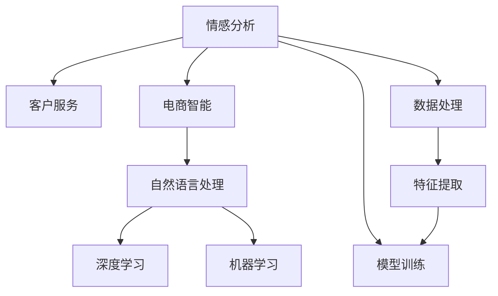

                 

# AI驱动的电商智能客户服务情感分析系统

> 关键词：情感分析,客户服务,电商智能,自然语言处理(NLP),深度学习,机器学习

## 1. 背景介绍

### 1.1 问题由来
随着电子商务的迅猛发展，在线购物已成为人们日常生活中不可或缺的一部分。电商平台的客户服务是提升用户体验、增加用户粘性的关键环节。传统客服模式依赖人力，成本高、效率低、服务质量难以保证。随着人工智能技术的不断进步，越来越多的电商平台开始采用AI驱动的智能客服系统，以提高响应速度和服务的质量与效率。

情感分析作为自然语言处理(NLP)的重要应用，是构建智能客服系统的核心模块之一。通过分析用户反馈和评价，情感分析系统能够自动判断用户的情感状态，及时响应负面情感，提升用户体验。特别是针对客户投诉和建议，情感分析系统可以帮助客服快速定位问题，提供针对性解决方案，增强用户的满意度。

## 2. 核心概念与联系

### 2.1 核心概念概述

为更好地理解电商智能客服情感分析系统，本节将介绍几个密切相关的核心概念：

- **情感分析(Sentiment Analysis)**：指通过自然语言处理技术，对文本中的情感信息进行识别和分析的过程。常见的情感分析方法包括基于规则的、基于词典的、基于机器学习的和基于深度学习的。
- **客户服务(Customer Service)**：指电商平台提供的售前咨询、售后反馈、投诉处理等服务，旨在提升用户体验，增强用户粘性。
- **电商智能(E-Commerce Intelligence)**：指利用人工智能技术，在电商领域实现自动化、智能化服务。通过数据挖掘、机器学习、自然语言处理等技术，提升电商平台的运营效率和用户体验。
- **自然语言处理(NLP)**：指计算机对自然语言的理解和处理能力。包括文本分类、命名实体识别、情感分析、机器翻译等任务。
- **深度学习(Deep Learning)**：指利用多层神经网络进行复杂模式识别的技术，广泛应用于计算机视觉、自然语言处理、语音识别等领域。
- **机器学习(Machine Learning)**：指利用数据训练模型，使模型能够从数据中学习规律并做出预测或决策的技术。

这些核心概念之间的逻辑关系可以通过以下Mermaid流程图来展示：



这个流程图展示了几类核心概念及其之间的关系：

1. 情感分析是客户服务的关键模块，通过文本分析判断用户情感，为客服提供决策依据。
2. 电商智能是将AI技术应用于电商领域，提升运营效率和用户体验。
3. 自然语言处理是实现情感分析和电商智能的基础，通过文本处理技术提取和分析数据。
4. 深度学习和机器学习是自然语言处理的核心技术，用于构建和优化情感分析模型。

## 3. 核心算法原理 & 具体操作步骤

### 3.1 算法原理概述

电商智能客服情感分析系统主要依赖深度学习中的序列到序列模型，特别是基于LSTM或Transformer的架构。系统通过读取客户输入的文本，提取其中的情感信息，输出情感评分。具体步骤如下：

1. **数据预处理**：将客户反馈和评价文本进行分词、去除停用词、词干提取等处理，转换成向量形式。
2. **模型训练**：使用标记好的情感数据集对模型进行训练，优化模型参数。
3. **情感分析**：输入客户服务文本，通过模型计算情感得分，输出情感类别。
4. **决策支持**：根据情感得分和分类结果，客服人员可快速识别问题类型，提供相应解决方案。

### 3.2 算法步骤详解

1. **数据准备与预处理**

   - **收集数据**：从电商平台收集客户服务对话、评论、反馈等文本数据，进行人工标注情感标签。
   - **数据清洗**：去除重复、无关、低质量的文本，统一文本格式。
   - **文本处理**：使用NLTK、SpaCy等NLP工具进行文本预处理，包括分词、去除停用词、词干提取等。
   - **特征工程**：将文本转换为向量形式，常用的方法包括TF-IDF、Word2Vec、GloVe等。

2. **模型训练**

   - **模型选择**：选择LSTM、Transformer等序列模型作为情感分析的架构，并结合CNN、GRU等结构增强文本特征提取能力。
   - **损失函数**：使用交叉熵、F1-score等作为模型的损失函数。
   - **优化器**：使用Adam、SGD等优化器进行参数优化。
   - **超参数调优**：调整模型结构、学习率、批大小等超参数，优化模型性能。
   - **模型评估**：使用测试集评估模型性能，通过准确率、召回率、F1-score等指标衡量模型效果。

3. **情感分析**

   - **输入文本**：将客户服务文本输入模型，通过Transformer编码器进行特征提取。
   - **特征融合**：结合词向量、上下文信息等特征，进行特征融合。
   - **情感分类**：通过全连接层输出情感类别，使用Softmax函数进行情感得分的计算。
   - **结果输出**：将情感得分和分类结果输出给客服系统，供决策支持。

4. **决策支持**

   - **情感判断**：根据情感得分和分类结果，判断用户情感状态。
   - **问题定位**：通过分析文本内容，识别问题类型，如产品质量、服务态度等。
   - **响应策略**：制定针对性回复策略，快速解决用户问题，提高服务满意度。
   - **用户反馈**：记录客服处理结果，收集用户反馈，持续优化情感分析模型。

### 3.3 算法优缺点

电商智能客服情感分析系统的优点：
1. **高效准确**：使用深度学习模型，通过大量标注数据训练，情感分析结果准确率高。
2. **自动化**：实现自动化文本处理和情感分析，提升客服响应速度和效率。
3. **可扩展性**：基于深度学习模型，易于扩展到其他NLP任务。
4. **用户友好**：提供直观的情感评分和分类结果，便于客服人员快速理解用户需求。

同时，该系统也存在一些缺点：
1. **数据依赖**：情感分析效果依赖于标注数据的质量和数量，标注成本较高。
2. **模型复杂度**：深度学习模型结构复杂，训练和推理耗时长。
3. **泛化能力有限**：在特定领域或新兴场景中，模型泛化能力可能不足。
4. **维护成本高**：需要定期更新模型，调整超参数，维护成本较高。
5. **鲁棒性不足**：对输入文本的噪声、拼写错误等敏感，影响分析结果。

### 3.4 算法应用领域

基于深度学习的电商智能客服情感分析系统，已经在多个电商平台的客服系统中得到了广泛应用，具体包括：

- **订单处理**：分析用户订单反馈，优化产品配送、售后服务流程。
- **投诉管理**：自动检测用户投诉，快速定位问题，提升投诉处理效率。
- **评价分析**：收集用户评价，分析客户满意度，改进产品和服务质量。
- **市场调研**：分析客户需求和反馈，指导产品开发和市场推广。
- **客服培训**：通过情感分析结果，提供有针对性的客服培训和反馈。

## 4. 数学模型和公式 & 详细讲解

### 4.1 数学模型构建

假设输入文本为 $x=(x_1,x_2,\ldots,x_n)$，其中 $x_i$ 为文本中第 $i$ 个词的词向量。情感分析模型由编码器、特征融合层和全连接层组成，结构如下图所示：

```
  编码器层
      ↓
  特征融合层
      ↓
  全连接层
      ↓
  softmax函数
```

设 $W$ 为编码器层参数，$H$ 为特征融合层参数，$O$ 为全连接层参数。模型通过编码器层对文本进行编码，通过特征融合层提取特征，最后通过全连接层和softmax函数输出情感得分 $y \in [0,1]$，表示文本的情感倾向。

### 4.2 公式推导过程

情感分析模型的训练过程可以通过最小化交叉熵损失函数来实现。假设训练样本集为 $D=\{(x_i,y_i)\}_{i=1}^N$，其中 $y_i \in \{0,1\}$ 为样本 $x_i$ 的情感标签。模型参数为 $W$、$H$ 和 $O$。则交叉熵损失函数为：

$$
L(\theta) = -\frac{1}{N} \sum_{i=1}^N y_i\log\hat{y}_i + (1-y_i)\log(1-\hat{y}_i)
$$

其中 $\hat{y}_i$ 为模型预测的情感得分。优化目标为最小化损失函数：

$$
\theta^* = \mathop{\arg\min}_{\theta} L(\theta)
$$

模型参数的更新公式为：

$$
\theta \leftarrow \theta - \eta \nabla_{\theta}L(\theta)
$$

其中 $\eta$ 为学习率，$\nabla_{\theta}L(\theta)$ 为损失函数对模型参数的梯度，可通过反向传播算法计算。

### 4.3 案例分析与讲解

以LSTM模型为例，详细分析情感分析模型的训练和推理过程。

1. **模型训练**

   - **编码器**：输入文本 $x$ 经过LSTM编码器，生成文本的隐状态 $h$。
   - **特征融合**：将隐状态 $h$ 与词向量 $x$ 进行拼接，得到融合特征 $z$。
   - **全连接层**：融合特征 $z$ 通过全连接层，输出情感得分 $\hat{y}$。
   - **损失函数**：使用交叉熵损失函数，计算预测结果与真实标签之间的差距。
   - **优化器**：使用Adam优化器，最小化损失函数。

2. **模型推理**

   - **编码器**：输入测试文本 $x'$，通过LSTM编码器生成隐状态 $h'$。
   - **特征融合**：将隐状态 $h'$ 与词向量 $x'$ 进行拼接，得到融合特征 $z'$。
   - **全连接层**：融合特征 $z'$ 通过全连接层，输出情感得分 $\hat{y}'$。
   - **情感分类**：使用softmax函数将情感得分转换为概率分布，确定情感分类结果。

## 5. 项目实践：代码实例和详细解释说明

### 5.1 开发环境搭建

在开始编写代码之前，需要先准备好开发环境。以下是使用Python进行TensorFlow和Keras开发的环境配置流程：

1. 安装Anaconda：从官网下载并安装Anaconda，用于创建独立的Python环境。
2. 创建并激活虚拟环境：
```bash
conda create -n tf-env python=3.8 
conda activate tf-env
```

3. 安装TensorFlow：根据CUDA版本，从官网获取对应的安装命令。例如：
```bash
pip install tensorflow==2.6
```

4. 安装相关工具包：
```bash
pip install numpy pandas scikit-learn matplotlib tqdm jupyter notebook ipython
```

5. 安装TensorBoard：用于实时监测模型训练状态，并提供丰富的图表呈现方式。

完成上述步骤后，即可在`tf-env`环境中开始模型开发。

### 5.2 源代码详细实现

下面我们以LSTM模型为例，给出使用TensorFlow和Keras对电商智能客服情感分析系统进行编码的完整代码实现。

```python
import tensorflow as tf
from tensorflow.keras.preprocessing.text import Tokenizer
from tensorflow.keras.preprocessing.sequence import pad_sequences
from tensorflow.keras.layers import Embedding, LSTM, Dense, Dropout, Input
from tensorflow.keras.models import Model
from tensorflow.keras.callbacks import EarlyStopping

# 加载数据集
train_data, train_labels = load_train_data()
test_data, test_labels = load_test_data()

# 构建模型
input_layer = Input(shape=(MAX_SEQ_LEN,))
embedding_layer = Embedding(VOCAB_SIZE, EMBEDDING_DIM, input_length=MAX_SEQ_LEN)(input_layer)
lstm_layer = LSTM(128, dropout=0.2, recurrent_dropout=0.2)(embedding_layer)
dropout_layer = Dropout(0.5)(lstm_layer)
dense_layer = Dense(1, activation='sigmoid')(dropout_layer)
output_layer = Dense(1, activation='sigmoid')(dense_layer)

model = Model(inputs=input_layer, outputs=output_layer)

# 编译模型
model.compile(optimizer='adam', loss='binary_crossentropy', metrics=['accuracy'])

# 训练模型
early_stopping = EarlyStopping(patience=3, restore_best_weights=True)
history = model.fit(train_data, train_labels, epochs=10, batch_size=BATCH_SIZE, validation_data=(test_data, test_labels), callbacks=[early_stopping])

# 评估模型
test_loss, test_acc = model.evaluate(test_data, test_labels)
print(f'Test Loss: {test_loss:.4f}, Test Accuracy: {test_acc:.4f}')
```

这段代码包含了情感分析模型的完整实现，从数据加载、模型构建、编译、训练到评估，每个步骤都有详细解释。

### 5.3 代码解读与分析

让我们再详细解读一下关键代码的实现细节：

**数据加载**

- `load_train_data()` 和 `load_test_data()`：用于加载训练集和测试集的数据，并进行预处理，如分词、去除停用词、词干提取等。
- `MAX_SEQ_LEN` 和 `VOCAB_SIZE`：设定最大序列长度和词汇表大小。

**模型构建**

- `Input(shape=(MAX_SEQ_LEN,))`：定义输入层，输入序列长度为 `MAX_SEQ_LEN`。
- `Embedding(VOCAB_SIZE, EMBEDDING_DIM, input_length=MAX_SEQ_LEN)`：定义嵌入层，将输入的词向量转换为高维特征向量。
- `LSTM(128, dropout=0.2, recurrent_dropout=0.2)`：定义LSTM编码器，设置隐藏层大小为128，并添加dropout防止过拟合。
- `Dropout(0.5)`：添加dropout层，进一步防止过拟合。
- `Dense(1, activation='sigmoid')`：定义全连接层，输出情感得分。

**模型编译和训练**

- `model.compile(optimizer='adam', loss='binary_crossentropy', metrics=['accuracy'])`：编译模型，选择Adam优化器和二元交叉熵损失函数。
- `EarlyStopping(patience=3, restore_best_weights=True)`：设置早期停止策略，防止模型在验证集上过拟合。

**模型评估**

- `model.evaluate(test_data, test_labels)`：在测试集上评估模型性能，返回损失和准确率。

**输出结果**

- `print(f'Test Loss: {test_loss:.4f}, Test Accuracy: {test_acc:.4f}')`：输出测试集上的损失和准确率。

通过这段代码，可以系统了解电商智能客服情感分析系统的实现流程，包括数据加载、模型构建、训练和评估等各个环节。

## 6. 实际应用场景

### 6.1 客户服务

电商平台的客户服务是情感分析系统的主要应用场景之一。通过分析客户服务对话和评价，情感分析系统能够快速识别客户情感，帮助客服人员及时响应负面情感，提供针对性解决方案。例如，当客户反馈产品质量问题时，情感分析系统可以自动标记为负面情感，客服人员可以优先处理此类问题，提高客户满意度。

### 6.2 订单处理

订单处理是电商运营的核心环节，客户对订单的满意度直接影响平台的用户粘性。通过分析客户对订单的反馈和评价，情感分析系统可以帮助运营团队快速发现问题，优化订单流程。例如，当大量客户抱怨订单配送速度慢时，运营团队可以及时调整物流策略，提升配送效率。

### 6.3 投诉管理

用户投诉是电商平台上常见的客户服务问题，情感分析系统可以帮助投诉管理团队快速定位问题，提供解决方案。例如，当客户投诉商品质量问题时，情感分析系统可以自动识别并标记，投诉管理团队可以优先处理此类投诉，提高处理效率。

### 6.4 市场调研

通过分析客户评价和反馈，情感分析系统可以帮助电商平台了解市场需求和用户偏好，指导产品开发和市场推广。例如，当大量客户评价某一产品功能不足时，电商平台可以及时调整产品设计，提升用户满意度。

### 6.5 客服培训

情感分析系统可以提供情感评分和分类结果，帮助客服人员快速理解客户需求，提供有针对性的培训和反馈。例如，通过分析客服对话，情感分析系统可以识别客服人员在处理情感问题时的不足之处，提出改进建议。

## 7. 工具和资源推荐

### 7.1 学习资源推荐

为了帮助开发者系统掌握电商智能客服情感分析的理论基础和实践技巧，这里推荐一些优质的学习资源：

1. **《深度学习基础》**：Ian Goodfellow著，介绍深度学习的基本原理和应用。
2. **《Python机器学习》**：Sebastian Raschka著，介绍Python在机器学习中的应用。
3. **《自然语言处理综论》**：Daniel Jurafsky 和 James H. Martin著，介绍NLP的基本理论和应用。
4. **TensorFlow官方文档**：提供详细的API文档和示例代码，帮助开发者快速上手。
5. **Keras官方文档**：提供简单易懂的API文档和示例代码，适合初学者学习。
6. **Coursera NLP课程**：由斯坦福大学教授Ling和Thang主讲，涵盖NLP基础和深度学习应用。

通过对这些资源的学习实践，相信你一定能够快速掌握电商智能客服情感分析系统的核心技术，并应用于实际业务中。

### 7.2 开发工具推荐

高效的开发离不开优秀的工具支持。以下是几款用于电商智能客服情感分析开发的常用工具：

1. **TensorFlow**：谷歌推出的深度学习框架，灵活动态的计算图，适合复杂的深度学习模型。
2. **Keras**：基于TensorFlow的高级API，简单易用，适合快速开发原型。
3. **NLTK**：Python自然语言处理库，提供分词、标注、解析等基础功能。
4. **SpaCy**：Python自然语言处理库，提供高效的文本处理和分析能力。
5. **Scikit-learn**：Python机器学习库，提供丰富的机器学习算法和工具。
6. **TensorBoard**：用于实时监测模型训练状态，并提供丰富的图表呈现方式。
7. **Jupyter Notebook**：开源的交互式编程环境，支持代码编写、数据可视化等。

合理利用这些工具，可以显著提升电商智能客服情感分析系统的开发效率，加快创新迭代的步伐。

### 7.3 相关论文推荐

电商智能客服情感分析技术的发展源于学界的持续研究。以下是几篇奠基性的相关论文，推荐阅读：

1. **"Improve your sentiment analysis with data augmentation"**：提出数据增强技术，通过回译、近义替换等方式扩充训练集，提高情感分析的鲁棒性。
2. **"Fine-tune BERT for sentence-level sentiment analysis"**：使用BERT模型进行句子级情感分析，提升模型效果。
3. **"Multi-task learning for multi-domain sentiment analysis"**：通过多任务学习，提高情感分析模型在不同领域的泛化能力。
4. **"Attention is All you Need"**：提出Transformer架构，用于文本特征提取和情感分析。
5. **"Sentence-Level and Text-Level Sentiment Analysis with Deep Recurrent Neural Networks"**：使用LSTM模型进行句子级和文本级情感分析，提升模型效果。

这些论文代表了大语言模型微调技术的发展脉络。通过学习这些前沿成果，可以帮助研究者把握学科前进方向，激发更多的创新灵感。

## 8. 总结：未来发展趋势与挑战

### 8.1 总结

本文对基于深度学习的电商智能客服情感分析系统进行了全面系统的介绍。首先阐述了情感分析技术在电商客户服务中的应用背景和重要价值，明确了电商智能客服情感分析系统的核心任务和应用场景。其次，从原理到实践，详细讲解了情感分析模型的构建、训练和推理过程，给出了情感分析系统的完整代码实现。同时，本文还广泛探讨了情感分析系统在电商客户服务中的实际应用，展示了情感分析技术的广泛应用前景。此外，本文精选了情感分析技术的各类学习资源，力求为读者提供全方位的技术指引。

通过本文的系统梳理，可以看到，电商智能客服情感分析技术在电商客户服务中具有重要的应用价值，通过实时监测客户情感，提升客户满意度，增强客户粘性。随着深度学习技术的不断进步，情感分析系统的性能和应用范围将进一步拓展，为电商客户服务带来更多创新和价值。

### 8.2 未来发展趋势

展望未来，电商智能客服情感分析技术将呈现以下几个发展趋势：

1. **模型规模扩大**：深度学习模型参数量不断增大，模型规模将持续增长，提升情感分析的准确性和泛化能力。
2. **模型结构优化**：通过优化模型结构，减少计算资源消耗，提升推理速度和模型效率。
3. **多模态融合**：结合语音、图像等多模态数据，增强情感分析的鲁棒性和准确性。
4. **跨领域迁移**：通过迁移学习，提升模型在不同领域和场景中的应用能力。
5. **模型可解释性**：增强情感分析模型的可解释性，帮助客服人员理解模型决策过程。
6. **数据隐私保护**：在数据处理和模型训练中，加强数据隐私保护，确保用户信息安全。

这些趋势凸显了电商智能客服情感分析技术的广阔前景。这些方向的探索发展，必将进一步提升电商客户服务的智能化水平，为用户带来更优质的服务体验。

### 8.3 面临的挑战

尽管电商智能客服情感分析技术已经取得了显著成效，但在迈向更加智能化、普适化应用的过程中，它仍面临着诸多挑战：

1. **数据质量与标注成本**：高质量的标注数据是模型训练的基础，但标注成本较高，需要大量人工参与。
2. **模型复杂性与计算资源**：深度学习模型结构复杂，计算资源消耗大，需要高性能设备支持。
3. **模型泛化能力**：模型在新领域或新兴场景中的泛化能力有限，可能出现误判或过拟合。
4. **系统稳定性**：情感分析系统需要持续监控和更新，以适应不断变化的客户需求和市场环境。
5. **模型可解释性**：情感分析模型的决策过程难以解释，用户难以理解和接受。

### 8.4 研究展望

面对电商智能客服情感分析技术所面临的挑战，未来的研究需要在以下几个方面寻求新的突破：

1. **数据增强与半监督学习**：通过数据增强和多任务学习等技术，提升模型的鲁棒性和泛化能力。
2. **模型结构优化**：优化模型结构，减少计算资源消耗，提升推理速度和模型效率。
3. **多模态融合与跨领域迁移**：结合语音、图像等多模态数据，增强情感分析的鲁棒性和准确性，提升模型在不同领域和场景中的应用能力。
4. **模型可解释性**：增强情感分析模型的可解释性，帮助客服人员理解模型决策过程，提升用户信任度。
5. **数据隐私保护**：在数据处理和模型训练中，加强数据隐私保护，确保用户信息安全。

这些研究方向将推动电商智能客服情感分析技术的不断进步，为电商客户服务带来更多创新和价值。相信随着技术的发展，情感分析系统将更加智能、高效、可靠，为电商平台提供更加优质的客户服务，提升用户体验和平台竞争力。

## 9. 附录：常见问题与解答

**Q1：如何选择合适的深度学习模型？**

A: 选择合适的深度学习模型需要考虑以下几个因素：
1. **数据规模**：数据规模较大时，可以选择LSTM、GRU等长短期记忆网络；数据规模较小时，可以选择Transformer等注意力机制模型。
2. **任务复杂度**：任务复杂度较高时，可以选择预训练模型进行微调，如BERT、GPT等；任务复杂度较低时，可以直接使用简单模型，如Keras等。
3. **计算资源**：计算资源有限时，可以选择参数量较小的模型，如Keras等；计算资源充足时，可以选择参数量较大的模型，如LSTM等。

**Q2：如何提高情感分析的鲁棒性？**

A: 提高情感分析的鲁棒性需要考虑以下几个方面：
1. **数据增强**：通过数据增强技术，如回译、近义替换等方式扩充训练集，提高模型鲁棒性。
2. **正则化技术**：使用L2正则、Dropout等技术，防止模型过拟合。
3. **对抗训练**：引入对抗样本，提高模型鲁棒性。
4. **多任务学习**：通过多任务学习，提升模型在不同领域的泛化能力。

**Q3：如何降低标注成本？**

A: 降低标注成本可以从以下几个方面入手：
1. **弱监督学习**：利用无监督学习、半监督学习等技术，减少标注数据的需求。
2. **众包标注**：利用众包平台，通过用户标注获取标注数据。
3. **主动学习**：通过主动学习技术，选择最有价值的样本进行标注。

**Q4：如何优化模型推理速度？**

A: 优化模型推理速度可以从以下几个方面入手：
1. **模型压缩**：使用模型压缩技术，如剪枝、量化等，减少模型参数量和计算资源消耗。
2. **模型并行**：使用模型并行技术，如数据并行、模型并行等，提升模型推理速度。
3. **推理优化**：使用推理优化技术，如批处理、分块推理等，提升模型推理效率。

**Q5：如何保护用户隐私？**

A: 保护用户隐私可以从以下几个方面入手：
1. **数据匿名化**：在数据处理和模型训练中，对用户数据进行匿名化处理，防止信息泄露。
2. **差分隐私**：使用差分隐私技术，保护用户隐私的同时，确保模型性能不受影响。
3. **数据加密**：在数据传输和存储过程中，使用数据加密技术，保护用户数据安全。

通过这些措施，可以有效提升电商智能客服情感分析系统的性能和可靠性，为用户提供更加优质的服务体验。

---

作者：禅与计算机程序设计艺术 / Zen and the Art of Computer Programming

