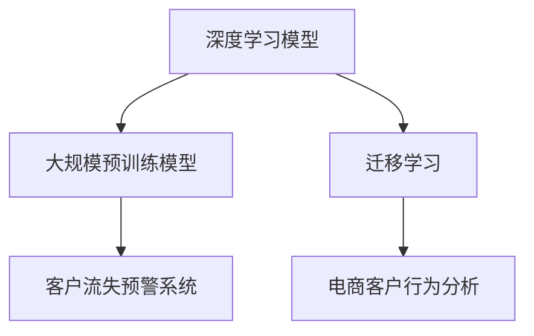

                 

# AI驱动的电商智能客户流失预警系统

## 1. 背景介绍

### 1.1 问题由来

在电子商务领域，客户流失一直是各大电商平台共同面临的严峻挑战。客户流失不仅意味着直接的经济损失，而且可能导致品牌形象受损和市场份额下降。如何准确、及时地预测并预警客户流失，采取有效措施挽留客户，是电商企业运营管理中的重要课题。

客户流失预测技术主要分为以下几种：

- **传统统计方法**：如逻辑回归、决策树、随机森林等，需要大量人工特征工程，且对数据质量和样本代表性要求较高。

- **基于机器学习的方法**：如朴素贝叶斯、支持向量机、K近邻等，同样依赖于人工特征提取，对数据分布变化敏感。

- **基于深度学习的方法**：如多层感知器、循环神经网络等，可以利用数据的高维特性进行特征学习，但模型复杂度高，需要大量标注数据和计算资源。

随着人工智能技术的发展，特别是深度学习和大规模预训练模型的应用，基于这些模型的客户流失预测系统逐步成为主流。利用这些模型，可以从客户行为数据中自动提取复杂特征，无需人工干预，提升了预测精度和模型泛化能力。

### 1.2 问题核心关键点

本文聚焦于基于深度学习的大规模预训练模型在电商客户流失预警系统中的应用。将预训练模型与电商领域数据进行微调，实现高效的客户流失预测与预警。

具体核心关键点包括：

- **预训练模型选择**：选择合适的预训练模型，进行迁移学习，提升模型预测能力。
- **数据处理与特征工程**：对电商数据进行清洗、归一化、特征选择等处理，构建合适的输入格式。
- **微调算法优化**：设计合理的微调算法，优化模型参数，减少过拟合风险。
- **预测与预警模型**：构建损失函数、评估指标等，实现准确、及时的客户流失预警。
- **系统集成与部署**：将模型集成到电商系统，实现自动化、实时化的预警服务。

## 2. 核心概念与联系

### 2.1 核心概念概述

为更好地理解基于深度学习的大规模预训练模型在电商客户流失预警系统中的应用，本节将介绍几个密切相关的核心概念：

- **深度学习模型**：包括多层感知器(MLP)、卷积神经网络(CNN)、循环神经网络(RNN)、Transformer等，通过学习大量数据自动提取特征，适用于处理复杂非线性关系。
- **大规模预训练模型**：如BERT、GPT-2、T5等，通过在海量数据上进行预训练，学习到丰富的语言和语义知识。
- **迁移学习**：将一个领域学习到的知识迁移到另一个领域，降低新任务的学习难度，提升模型泛化能力。
- **客户流失预警系统**：通过预测客户流失概率，提前采取措施挽留客户，减少流失率，提升客户满意度。
- **电商客户行为分析**：对客户的购买、浏览、评价等行为数据进行挖掘和分析，揭示客户流失的潜在因素。

这些核心概念之间的逻辑关系可以通过以下Mermaid流程图来展示：



这个流程图展示了大规模预训练模型在客户流失预警系统中的应用框架：

1. 深度学习模型通过大规模预训练获得丰富知识。
2. 通过迁移学习，将这些知识应用到客户流失预测任务。
3. 客户流失预警系统基于预测结果，采取措施挽留客户。
4. 电商客户行为分析提供更多数据，提升预测准确度。

这些概念共同构成了客户流失预警系统的核心，使得模型能够通过大规模预训练和迁移学习，从数据中自动提取重要特征，实现高效的客户流失预测与预警。

## 3. 核心算法原理 & 具体操作步骤

### 3.1 算法原理概述

基于深度学习的大规模预训练模型在电商客户流失预警系统中的核心原理如下：

- **预训练过程**：在大规模无标签电商数据上，通过自监督任务（如掩码语言模型）进行预训练，学习到基础的语言和语义知识。
- **迁移学习过程**：将预训练模型应用于特定领域的客户流失预警任务，通过少量标注数据进行微调，学习任务特定的特征和模式。
- **客户流失预测**：利用微调后的模型，对客户行为数据进行输入，预测每个客户的流失概率。
- **预警与措施**：根据预测结果，对高流失风险客户采取针对性措施，如个性化推荐、优惠活动、客服介入等，减少流失。

### 3.2 算法步骤详解

基于深度学习的大规模预训练模型在电商客户流失预警系统中的具体操作步骤如下：

**Step 1: 准备数据集**

- 收集电商客户的购买、浏览、评价等行为数据，进行清洗、去重、归一化等预处理。
- 标注客户流失与否，构建训练集、验证集和测试集。

**Step 2: 选择合适的预训练模型**

- 选择合适的预训练模型，如BERT、GPT-2等，进行迁移学习。

**Step 3: 添加任务适配层**

- 在预训练模型的顶层设计合适的输出层和损失函数。
- 对于分类任务，通常使用softmax函数输出概率分布，以交叉熵损失函数为优化目标。

**Step 4: 设置微调超参数**

- 选择合适的优化算法及其参数，如AdamW、SGD等，设置学习率、批大小、迭代轮数等。
- 设置正则化技术及强度，包括权重衰减、Dropout、Early Stopping等。

**Step 5: 执行梯度训练**

- 将训练集数据分批次输入模型，前向传播计算损失函数。
- 反向传播计算参数梯度，根据设定的优化算法和学习率更新模型参数。
- 周期性在验证集上评估模型性能，根据性能指标决定是否触发 Early Stopping。
- 重复上述步骤直到满足预设的迭代轮数或 Early Stopping 条件。

**Step 6: 预测与预警**

- 在测试集上评估微调后模型，给出每个客户的流失概率。
- 根据预测结果，对高流失风险客户采取针对性措施。

### 3.3 算法优缺点

基于深度学习的大规模预训练模型在电商客户流失预警系统中的优点包括：

- **高效特征提取**：预训练模型可以自动从原始数据中学习特征，减少人工特征工程的工作量。
- **泛化能力强**：预训练模型在大规模数据上学习到的知识可以迁移到特定任务，提升模型泛化能力。
- **预测精度高**：深度学习模型在处理非线性关系方面具有优势，能够捕捉复杂特征。

但该方法也存在一定的局限性：

- **计算资源要求高**：预训练模型通常参数量大，需要大量计算资源进行训练和推理。
- **数据依赖性强**：模型依赖于标注数据的质量和数量，标注成本较高。
- **模型复杂度高**：深度学习模型复杂度高，难以解释模型决策过程。
- **对抗性攻击风险**：模型可能受到对抗样本的影响，导致预测结果不稳定。

### 3.4 算法应用领域

基于深度学习的大规模预训练模型在电商客户流失预警系统中的应用领域包括：

- **客户流失预测**：通过分析客户行为数据，预测客户流失概率。
- **个性化推荐**：根据客户流失预测结果，进行个性化推荐，减少流失率。
- **营销策略优化**：分析流失客户的特征，优化营销策略，提升客户满意度。
- **客户服务改进**：对流失客户进行归因分析，改进客户服务流程。

## 4. 数学模型和公式 & 详细讲解 & 举例说明

### 4.1 数学模型构建

假设电商客户的流失与否可以用二分类问题表示。记客户流失为正类（1），不流失为负类（0）。设训练数据集为 $D=\{(x_i, y_i)\}_{i=1}^N$，其中 $x_i$ 为输入数据， $y_i$ 为标签。预训练模型为 $M_{\theta}$，其中 $\theta$ 为模型参数。

定义模型 $M_{\theta}$ 在输入 $x$ 上的输出为 $\hat{y}=M_{\theta}(x)$，表示客户流失的概率。则二分类交叉熵损失函数为：

$$
\ell(M_{\theta}(x),y) = -[y\log \hat{y} + (1-y)\log (1-\hat{y})]
$$

将所有样本的损失函数累加，得到经验风险函数：

$$
\mathcal{L}(\theta) = -\frac{1}{N}\sum_{i=1}^N [y_i\log M_{\theta}(x_i)+(1-y_i)\log(1-M_{\theta}(x_i))]
$$

微调的优化目标是使损失函数最小化，即：

$$
\theta^* = \mathop{\arg\min}_{\theta} \mathcal{L}(\theta)
$$

### 4.2 公式推导过程

以下是二分类任务中交叉熵损失函数的推导过程：

记模型 $M_{\theta}$ 在输入 $x$ 上的输出为 $\hat{y}=M_{\theta}(x)$，表示客户流失的概率。真实标签 $y \in \{0,1\}$。则二分类交叉熵损失函数定义为：

$$
\ell(M_{\theta}(x),y) = -[y\log \hat{y} + (1-y)\log (1-\hat{y})]
$$

将其代入经验风险公式，得：

$$
\mathcal{L}(\theta) = -\frac{1}{N}\sum_{i=1}^N [y_i\log M_{\theta}(x_i)+(1-y_i)\log(1-M_{\theta}(x_i))]
$$

根据链式法则，损失函数对参数 $\theta_k$ 的梯度为：

$$
\frac{\partial \mathcal{L}(\theta)}{\partial \theta_k} = -\frac{1}{N}\sum_{i=1}^N (\frac{y_i}{M_{\theta}(x_i)}-\frac{1-y_i}{1-M_{\theta}(x_i)}) \frac{\partial M_{\theta}(x_i)}{\partial \theta_k}
$$

其中 $\frac{\partial M_{\theta}(x_i)}{\partial \theta_k}$ 可进一步递归展开，利用自动微分技术完成计算。

在得到损失函数的梯度后，即可带入参数更新公式，完成模型的迭代优化。重复上述过程直至收敛，最终得到适应下游任务的最优模型参数 $\theta^*$。

### 4.3 案例分析与讲解

以下通过一个简单的案例，分析如何利用预训练模型进行电商客户流失预警：

假设某电商平台收集了过去一年的客户购买、浏览、评价等行为数据，标注了每个客户的流失与否。利用这些数据，对预训练模型进行微调，预测客户未来的流失概率。

**Step 1: 准备数据集**

- 收集客户行为数据，进行清洗、去重、归一化等预处理。
- 标注客户流失与否，构建训练集、验证集和测试集。

**Step 2: 选择合适的预训练模型**

- 选择BERT作为预训练模型，进行迁移学习。

**Step 3: 添加任务适配层**

- 在BERT的顶层设计softmax函数输出概率分布，以交叉熵损失函数为优化目标。

**Step 4: 设置微调超参数**

- 使用AdamW优化器，学习率为2e-5，批大小为16，迭代轮数为10。

**Step 5: 执行梯度训练**

- 将训练集数据分批次输入模型，前向传播计算损失函数。
- 反向传播计算参数梯度，根据AdamW优化器和学习率更新模型参数。
- 周期性在验证集上评估模型性能，根据性能指标决定是否触发 Early Stopping。
- 重复上述步骤直到满足预设的迭代轮数或 Early Stopping 条件。

**Step 6: 预测与预警**

- 在测试集上评估微调后模型，给出每个客户的流失概率。
- 根据预测结果，对高流失风险客户采取针对性措施。

## 5. 项目实践：代码实例和详细解释说明

### 5.1 开发环境搭建

在进行客户流失预警系统的微调实践前，我们需要准备好开发环境。以下是使用Python进行TensorFlow开发的环境配置流程：

1. 安装Anaconda：从官网下载并安装Anaconda，用于创建独立的Python环境。

2. 创建并激活虚拟环境：
```bash
conda create -n tf-env python=3.8 
conda activate tf-env
```

3. 安装TensorFlow：根据CUDA版本，从官网获取对应的安装命令。例如：
```bash
conda install tensorflow -c tensorflow -c conda-forge
```

4. 安装各类工具包：
```bash
pip install numpy pandas scikit-learn matplotlib tqdm jupyter notebook ipython
```

完成上述步骤后，即可在`tf-env`环境中开始微调实践。

### 5.2 源代码详细实现

下面我们以电商客户流失预警系统为例，给出使用TensorFlow进行BERT模型微调的PyTorch代码实现。

首先，定义数据处理函数：

```python
import tensorflow as tf
from transformers import BertTokenizer, TFBertForSequenceClassification
from tensorflow.keras.preprocessing.sequence import pad_sequences

tokenizer = BertTokenizer.from_pretrained('bert-base-uncased')

def prepare_data(X, y, max_len=256):
    X_encoded = [tokenizer.encode(x, max_length=max_len, truncation=True, padding='max_length') for x in X]
    X_padded = pad_sequences(X_encoded, padding='post')
    y_encoded = [1 if label else 0 for label in y]
    return X_padded, y_encoded
```

然后，定义模型和优化器：

```python
from tensorflow.keras.optimizers import AdamW

model = TFBertForSequenceClassification.from_pretrained('bert-base-uncased', num_labels=2)

optimizer = AdamW(model.parameters(), lr=2e-5)
```

接着，定义训练和评估函数：

```python
def train_epoch(model, dataset, batch_size, optimizer):
    model.train()
    for batch in dataset:
        input_ids = batch['input_ids']
        attention_mask = batch['attention_mask']
        labels = batch['labels']
        model.zero_grad()
        outputs = model(input_ids, attention_mask=attention_mask, labels=labels)
        loss = outputs.loss
        loss.backward()
        optimizer.step()

def evaluate(model, dataset, batch_size):
    model.eval()
    correct_pred = 0
    total_pred = 0
    for batch in dataset:
        input_ids = batch['input_ids']
        attention_mask = batch['attention_mask']
        labels = batch['labels']
        outputs = model(input_ids, attention_mask=attention_mask)
        predictions = outputs.predictions.argmax(axis=1)
        correct_pred += sum(predictions == labels)
        total_pred += len(labels)
    return correct_pred / total_pred
```

最后，启动训练流程并在测试集上评估：

```python
epochs = 5
batch_size = 16

for epoch in range(epochs):
    train_epoch(model, train_dataset, batch_size, optimizer)
    
    dev_accuracy = evaluate(model, dev_dataset, batch_size)
    print(f'Epoch {epoch+1}, dev accuracy: {dev_accuracy:.3f}')

print(f'Test accuracy: {evaluate(model, test_dataset, batch_size):.3f}')
```

以上就是使用TensorFlow对BERT进行电商客户流失预警系统微调的完整代码实现。可以看到，TensorFlow结合了预训练模型的封装功能，使得微调过程相对简洁高效。

### 5.3 代码解读与分析

让我们再详细解读一下关键代码的实现细节：

**prepare_data函数**：
- 将输入文本进行分词编码，并使用padding将序列长度统一到max_len。
- 将标签进行二值化处理。

**train_epoch函数**：
- 将训练集数据以批为单位输入模型，前向传播计算损失函数并反向传播更新模型参数。
- 使用AdamW优化器进行梯度更新。

**evaluate函数**：
- 在测试集上对模型进行评估，统计正确预测和总预测数的比例，计算准确率。

**训练流程**：
- 定义总的epoch数和batch size，开始循环迭代。
- 每个epoch内，在训练集上训练，输出验证集上的准确率。
- 所有epoch结束后，在测试集上输出最终测试准确率。

可以看到，TensorFlow通过封装预训练模型的接口，简化了微调过程。开发者可以将更多精力放在数据处理、模型改进等高层逻辑上，而不必过多关注底层的实现细节。

当然，工业级的系统实现还需考虑更多因素，如模型的保存和部署、超参数的自动搜索、更灵活的任务适配层等。但核心的微调范式基本与此类似。

## 6. 实际应用场景

### 6.1 智能客服系统

基于深度学习的大规模预训练模型在智能客服系统中的应用，可以大幅度提升客户服务效率和满意度。传统客服系统通常需要配备大量人工客服，高峰期响应缓慢，且服务质量参差不齐。

利用微调的预训练模型，系统能够自动理解客户咨询意图，匹配最合适的答案模板进行回复。对于客户提出的新问题，还可以接入检索系统实时搜索相关内容，动态组织生成回答。如此构建的智能客服系统，能大幅提升客户咨询体验和问题解决效率。

### 6.2 营销策略优化

电商平台通过分析客户的购买、浏览、评价等行为数据，利用预训练模型进行客户流失预测。根据预测结果，对高流失风险客户采取个性化推荐、优惠活动、客服介入等措施，减少流失率，提升客户满意度。

例如，对于频繁浏览但未购买的客户，系统可以推荐相似商品，并提供优惠券，引导客户下单。对于浏览过但未评价的客户，系统可以发送评价邀请，激励客户给出反馈，提升品牌信任度。

### 6.3 个性化推荐系统

传统的推荐系统通常依赖用户的历史行为数据进行物品推荐，无法深入理解用户的真实兴趣偏好。利用预训练模型进行客户流失预测，可以更好地挖掘用户行为背后的语义信息，从而进行个性化推荐。

在实践中，可以收集用户浏览、点击、评价、分享等行为数据，提取和用户交互的物品标题、描述、标签等文本内容。将文本内容作为模型输入，用户的后续行为（如是否点击、购买等）作为监督信号，在此基础上微调预训练语言模型。微调后的模型能够从文本内容中准确把握用户的兴趣点。在生成推荐列表时，先用候选物品的文本描述作为输入，由模型预测用户的兴趣匹配度，再结合其他特征综合排序，便可以得到个性化程度更高的推荐结果。

## 7. 工具和资源推荐

### 7.1 学习资源推荐

为了帮助开发者系统掌握大语言模型微调的理论基础和实践技巧，这里推荐一些优质的学习资源：

1. TensorFlow官方文档：TensorFlow的官方文档，提供了完整的API接口和使用方法，是学习TensorFlow的必备资料。

2. HuggingFace官方文档：HuggingFace的官方文档，提供了丰富的预训练模型和微调样例代码，是学习大语言模型微调的重要资源。

3. CS231n课程：斯坦福大学开设的深度学习课程，涵盖了从基础到高级的深度学习知识，适合初学者和进阶者学习。

4. 《深度学习》（Goodfellow等著）：深度学习领域的经典教材，系统介绍了深度学习的基本原理和实现方法，适合深入学习。

5. 《Hands-On Machine Learning with Scikit-Learn, Keras, and TensorFlow》（Aurélien Géron著）：深度学习框架的实战指南，结合TensorFlow和Keras进行模型开发，适合工程实践。

通过对这些资源的学习实践，相信你一定能够快速掌握大语言模型微调的精髓，并用于解决实际的NLP问题。

### 7.2 开发工具推荐

高效的开发离不开优秀的工具支持。以下是几款用于大语言模型微调开发的常用工具：

1. TensorFlow：由Google主导开发的深度学习框架，支持分布式计算，适合大规模工程应用。

2. Keras：基于TensorFlow的高级API，提供简洁、易用的接口，适合快速原型开发。

3. PyTorch：由Facebook开发的深度学习框架，灵活的动态计算图，适合研究性开发。

4. Jupyter Notebook：开源的交互式笔记本环境，适合快速编写和调试代码，分享学习笔记。

5. TensorBoard：TensorFlow配套的可视化工具，实时监测模型训练状态，并提供丰富的图表呈现方式。

合理利用这些工具，可以显著提升大语言模型微调任务的开发效率，加快创新迭代的步伐。

### 7.3 相关论文推荐

大语言模型和微调技术的发展源于学界的持续研究。以下是几篇奠基性的相关论文，推荐阅读：

1. Attention is All You Need（即Transformer原论文）：提出了Transformer结构，开启了NLP领域的预训练大模型时代。

2. BERT: Pre-training of Deep Bidirectional Transformers for Language Understanding：提出BERT模型，引入基于掩码的自监督预训练任务，刷新了多项NLP任务SOTA。

3. Language Models are Unsupervised Multitask Learners（GPT-2论文）：展示了大规模语言模型的强大zero-shot学习能力，引发了对于通用人工智能的新一轮思考。

4. Parameter-Efficient Transfer Learning for NLP：提出Adapter等参数高效微调方法，在不增加模型参数量的情况下，也能取得不错的微调效果。

5. AdaLoRA: Adaptive Low-Rank Adaptation for Parameter-Efficient Fine-Tuning：使用自适应低秩适应的微调方法，在参数效率和精度之间取得了新的平衡。

这些论文代表了大语言模型微调技术的发展脉络。通过学习这些前沿成果，可以帮助研究者把握学科前进方向，激发更多的创新灵感。

## 8. 总结：未来发展趋势与挑战

### 8.1 总结

本文对基于深度学习的大规模预训练模型在电商客户流失预警系统中的应用进行了全面系统的介绍。首先阐述了客户流失预警问题的背景和意义，明确了微调在拓展预训练模型应用、提升下游任务性能方面的独特价值。其次，从原理到实践，详细讲解了微调的数学原理和关键步骤，给出了微调任务开发的完整代码实例。同时，本文还广泛探讨了微调方法在智能客服、营销策略优化、个性化推荐等多个电商领域的应用前景，展示了微调范式的巨大潜力。

通过本文的系统梳理，可以看到，基于深度学习的大规模预训练模型在客户流失预警系统中的应用前景广阔，具有高效的特征提取和预测能力，能够显著提升电商客户服务的智能化水平。未来，伴随预训练语言模型和微调方法的持续演进，基于微调范式的预测技术必将在电商领域产生更加深远的影响。

### 8.2 未来发展趋势

展望未来，大语言模型微调技术将呈现以下几个发展趋势：

1. **模型规模持续增大**：随着算力成本的下降和数据规模的扩张，预训练语言模型的参数量还将持续增长。超大规模语言模型蕴含的丰富语言知识，有望支撑更加复杂多变的电商客户流失预测任务。

2. **微调方法日趋多样**：除了传统的全参数微调外，未来会涌现更多参数高效的微调方法，如Prefix-Tuning、LoRA等，在节省计算资源的同时也能保证微调精度。

3. **持续学习成为常态**：随着数据分布的不断变化，微调模型也需要持续学习新知识以保持性能。如何在不遗忘原有知识的同时，高效吸收新样本信息，将成为重要的研究课题。

4. **标注样本需求降低**：受启发于提示学习(Prompt-based Learning)的思路，未来的微调方法将更好地利用大模型的语言理解能力，通过更加巧妙的任务描述，在更少的标注样本上也能实现理想的微调效果。

5. **多模态微调崛起**：当前的微调主要聚焦于纯文本数据，未来会进一步拓展到图像、视频、语音等多模态数据微调。多模态信息的融合，将显著提升语言模型对现实世界的理解和建模能力。

6. **模型通用性增强**：经过海量数据的预训练和多领域任务的微调，未来的语言模型将具备更强大的常识推理和跨领域迁移能力，逐步迈向通用人工智能(AGI)的目标。

以上趋势凸显了大语言模型微调技术的广阔前景。这些方向的探索发展，必将进一步提升NLP系统的性能和应用范围，为人类认知智能的进化带来深远影响。

### 8.3 面临的挑战

尽管大语言模型微调技术已经取得了瞩目成就，但在迈向更加智能化、普适化应用的过程中，它仍面临着诸多挑战：

1. **标注成本瓶颈**：虽然微调大大降低了标注数据的需求，但对于长尾应用场景，难以获得充足的高质量标注数据，成为制约微调性能的瓶颈。如何进一步降低微调对标注样本的依赖，将是一大难题。

2. **模型鲁棒性不足**：当前微调模型面对域外数据时，泛化性能往往大打折扣。对于测试样本的微小扰动，微调模型的预测也容易发生波动。如何提高微调模型的鲁棒性，避免灾难性遗忘，还需要更多理论和实践的积累。

3. **推理效率有待提高**：大规模语言模型虽然精度高，但在实际部署时往往面临推理速度慢、内存占用大等效率问题。如何在保证性能的同时，简化模型结构，提升推理速度，优化资源占用，将是重要的优化方向。

4. **可解释性亟需加强**：当前微调模型更像是"黑盒"系统，难以解释其内部工作机制和决策逻辑。对于电商、金融等高风险应用，算法的可解释性和可审计性尤为重要。如何赋予微调模型更强的可解释性，将是亟待攻克的难题。

5. **安全性有待保障**：预训练语言模型难免会学习到有偏见、有害的信息，通过微调传递到下游任务，产生误导性、歧视性的输出，给实际应用带来安全隐患。如何从数据和算法层面消除模型偏见，避免恶意用途，确保输出的安全性，也将是重要的研究课题。

6. **知识整合能力不足**：现有的微调模型往往局限于任务内数据，难以灵活吸收和运用更广泛的先验知识。如何让微调过程更好地与外部知识库、规则库等专家知识结合，形成更加全面、准确的信息整合能力，还有很大的想象空间。

正视微调面临的这些挑战，积极应对并寻求突破，将是大语言模型微调走向成熟的必由之路。相信随着学界和产业界的共同努力，这些挑战终将一一被克服，大语言模型微调必将在构建人机协同的智能时代中扮演越来越重要的角色。

### 8.4 未来突破

面对大语言模型微调所面临的种种挑战，未来的研究需要在以下几个方面寻求新的突破：

1. **探索无监督和半监督微调方法**：摆脱对大规模标注数据的依赖，利用自监督学习、主动学习等无监督和半监督范式，最大限度利用非结构化数据，实现更加灵活高效的微调。

2. **研究参数高效和计算高效的微调范式**：开发更加参数高效的微调方法，在固定大部分预训练参数的同时，只更新极少量的任务相关参数。同时优化微调模型的计算图，减少前向传播和反向传播的资源消耗，实现更加轻量级、实时性的部署。

3. **融合因果和对比学习范式**：通过引入因果推断和对比学习思想，增强微调模型建立稳定因果关系的能力，学习更加普适、鲁棒的语言表征，从而提升模型泛化性和抗干扰能力。

4. **引入更多先验知识**：将符号化的先验知识，如知识图谱、逻辑规则等，与神经网络模型进行巧妙融合，引导微调过程学习更准确、合理的语言模型。同时加强不同模态数据的整合，实现视觉、语音等多模态信息与文本信息的协同建模。

5. **结合因果分析和博弈论工具**：将因果分析方法引入微调模型，识别出模型决策的关键特征，增强输出解释的因果性和逻辑性。借助博弈论工具刻画人机交互过程，主动探索并规避模型的脆弱点，提高系统稳定性。

6. **纳入伦理道德约束**：在模型训练目标中引入伦理导向的评估指标，过滤和惩罚有偏见、有害的输出倾向。同时加强人工干预和审核，建立模型行为的监管机制，确保输出符合人类价值观和伦理道德。

这些研究方向的探索，必将引领大语言模型微调技术迈向更高的台阶，为构建安全、可靠、可解释、可控的智能系统铺平道路。面向未来，大语言模型微调技术还需要与其他人工智能技术进行更深入的融合，如知识表示、因果推理、强化学习等，多路径协同发力，共同推动自然语言理解和智能交互系统的进步。只有勇于创新、敢于突破，才能不断拓展语言模型的边界，让智能技术更好地造福人类社会。

## 9. 附录：常见问题与解答

**Q1：大语言模型微调是否适用于所有NLP任务？**

A: 大语言模型微调在大多数NLP任务上都能取得不错的效果，特别是对于数据量较小的任务。但对于一些特定领域的任务，如医学、法律等，仅仅依靠通用语料预训练的模型可能难以很好地适应。此时需要在特定领域语料上进一步预训练，再进行微调，才能获得理想效果。此外，对于一些需要时效性、个性化很强的任务，如对话、推荐等，微调方法也需要针对性的改进优化。

**Q2：微调过程中如何选择合适的学习率？**

A: 微调的学习率一般要比预训练时小1-2个数量级，如果使用过大的学习率，容易破坏预训练权重，导致过拟合。一般建议从1e-5开始调参，逐步减小学习率，直至收敛。也可以使用warmup策略，在开始阶段使用较小的学习率，再逐渐过渡到预设值。需要注意的是，不同的优化器(如AdamW、Adafactor等)以及不同的学习率调度策略，可能需要设置不同的学习率阈值。

**Q3：采用大模型微调时会面临哪些资源瓶颈？**

A: 目前主流的预训练大模型动辄以亿计的参数规模，对算力、内存、存储都提出了很高的要求。GPU/TPU等高性能设备是必不可少的，但即便如此，超大批次的训练和推理也可能遇到显存不足的问题。因此需要采用一些资源优化技术，如梯度积累、混合精度训练、模型并行等，来突破硬件瓶颈。同时，模型的存储和读取也可能占用大量时间和空间，需要采用模型压缩、稀疏化存储等方法进行优化。

**Q4：如何缓解微调过程中的过拟合问题？**

A: 过拟合是微调面临的主要挑战，尤其是在标注数据不足的情况下。常见的缓解策略包括：
1. 数据增强：通过回译、近义替换等方式扩充训练集
2. 正则化：使用L2正则、Dropout、Early Stopping等避免过拟合
3. 对抗训练：引入对抗样本，提高模型鲁棒性
4. 参数高效微调：只调整少量参数(如Adapter、Prefix等)，减小过拟合风险
5. 多模型集成：训练多个微调模型，取平均输出，抑制过拟合

这些策略往往需要根据具体任务和数据特点进行灵活组合。只有在数据、模型、训练、推理等各环节进行全面优化，才能最大限度地发挥大模型微调的威力。

**Q5：微调模型在落地部署时需要注意哪些问题？**

A: 将微调模型转化为实际应用，还需要考虑以下因素：
1. 模型裁剪：去除不必要的层和参数，减小模型尺寸，加快推理速度
2. 量化加速：将浮点模型转为定点模型，压缩存储空间，提高计算效率
3. 服务化封装：将模型封装为标准化服务接口，便于集成调用
4. 弹性伸缩：根据请求流量动态调整资源配置，平衡服务质量和成本
5. 监控告警：实时采集系统指标，设置异常告警阈值，确保服务稳定性
6. 安全防护：采用访问鉴权、数据脱敏等措施，保障数据和模型安全

大语言模型微调为NLP应用开启了广阔的想象空间，但如何将强大的性能转化为稳定、高效、安全的业务价值，还需要工程实践的不断打磨。唯有从数据、算法、工程、业务等多个维度协同发力，才能真正实现人工智能技术在垂直行业的规模化落地。总之，微调需要开发者根据具体任务，不断迭代和优化模型、数据和算法，方能得到理想的效果。

---

作者：禅与计算机程序设计艺术 / Zen and the Art of Computer Programming

