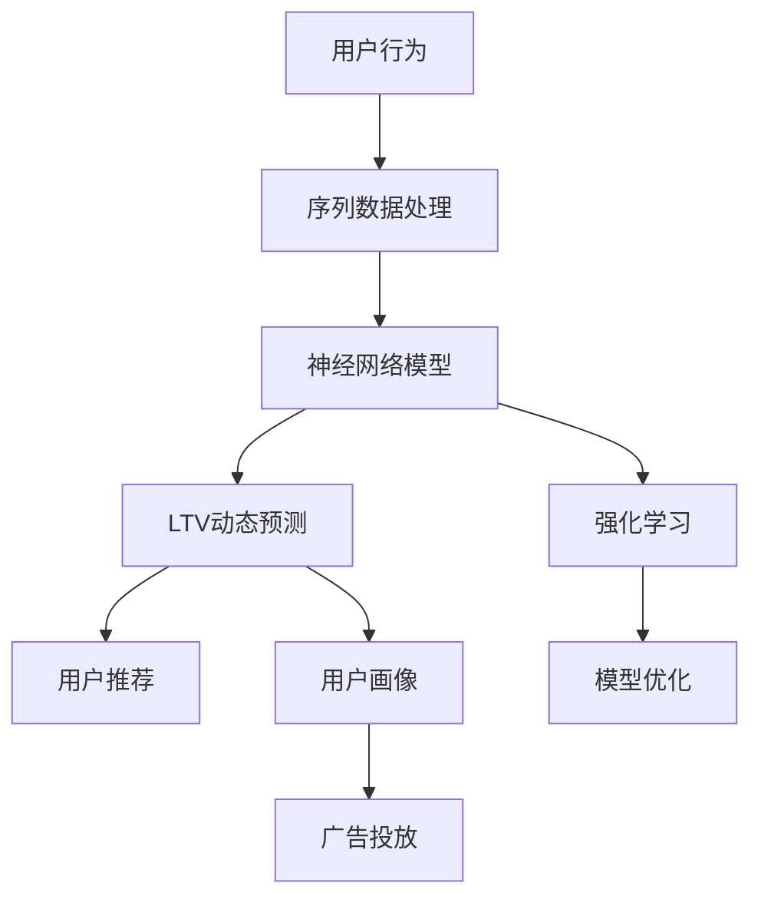

                 

# AI驱动的电商用户终身价值动态预测

> 关键词：电商用户, 用户行为, 终身价值, 动态预测, 神经网络模型, 序列数据处理, 强化学习, 深度学习

## 1. 背景介绍

### 1.1 问题由来
在电商领域，用户终身价值（Lifetime Value, LTV）是衡量用户长期贡献的关键指标。LTV不仅包括用户未来交易的总价值，还包括通过口碑传播、社区活跃度等行为带来的间接价值。电商平台希望通过精准的用户LTV预测，实现个性化推荐、精准营销等优化运营决策。

然而，电商用户行为受到多种因素影响，如季节性因素、个性化推荐、促销活动等。用户行为的多样性和复杂性，使得传统的统计模型难以准确捕捉用户行为变化，无法实现实时动态预测。

AI技术，特别是深度学习、强化学习等方法，为电商用户LTV预测提供了新的解决方案。本文将探讨如何使用AI技术，对电商用户进行终身价值动态预测，并提出相应的算法原理、操作步骤和应用策略。

## 2. 核心概念与联系

### 2.1 核心概念概述

为更好地理解AI驱动的电商用户LTV预测，本节将介绍几个关键概念：

- 用户行为（User Behavior）：用户在电商平台上的各项行为，如浏览、点击、购买、评论等。
- 终身价值（Lifetime Value）：用户在生命周期内为电商平台带来的总价值。
- 序列数据处理（Sequence Data Processing）：对用户行为序列进行编码和处理，提取时间序列特征。
- 神经网络模型（Neural Network Model）：基于深度学习的预测模型，适用于序列数据和复杂关系的学习。
- 强化学习（Reinforcement Learning）：通过模拟环境与模型互动，引导模型学习最优策略。
- 动态预测（Dynamic Prediction）：实时更新模型，适应用户行为变化。

这些核心概念之间的逻辑关系可以通过以下Mermaid流程图来展示：



这个流程图展示了大语言模型的核心概念及其之间的关系：

1. 用户行为通过序列数据处理被编码和转化，用于神经网络模型的训练。
2. 神经网络模型学习用户行为和LTV之间的关系，并实现LTV动态预测。
3. 强化学习通过对环境模拟与模型互动，优化模型预测性能。
4. LTV预测结果应用于用户推荐、广告投放等场景，提升用户体验和运营效率。
5. 动态预测机制能够实时更新模型，应对用户行为变化。
6. 用户画像结合LTV预测结果，用于优化个性化推荐。

这些概念共同构成了AI驱动的电商用户LTV预测系统，实现对用户行为和价值的动态监控和预测，为电商平台带来长远的商业价值。

## 3. 核心算法原理 & 具体操作步骤
### 3.1 算法原理概述

基于AI的电商用户LTV动态预测，本质上是一个序列数据的分类预测问题。其核心思想是：通过深度学习模型，将用户行为序列映射为LTV的预测结果，并结合强化学习策略，不断调整模型参数以提升预测精度。

形式化地，假设用户行为序列为 $\mathcal{S} = \{X_{t-1}, X_{t-2}, \dots, X_0\}$，其中 $X_t$ 为用户在时间 $t$ 的行为。LTV表示为 $Y$，是一个连续值。目标是通过神经网络模型 $M$，将用户行为序列映射为LTV预测值 $\hat{Y}$：

$$
\hat{Y} = M(\mathcal{S})
$$

预测的损失函数为：

$$
\mathcal{L} = \sum_{t=1}^{T} \ell(\hat{Y}_t, Y_t)
$$

其中 $\ell$ 为预测误差，$T$ 为序列长度。目标是最小化预测误差，即：

$$
\theta^* = \mathop{\arg\min}_{\theta} \mathcal{L}(M_{\theta}, \mathcal{S})
$$

### 3.2 算法步骤详解

基于AI的电商用户LTV动态预测一般包括以下几个关键步骤：

**Step 1: 数据预处理**
- 收集电商用户的历史行为数据，包括浏览、点击、购买、评论等。
- 清洗和处理缺失值、异常值，确保数据质量。
- 将用户行为序列编码为向量，构建输入序列 $X = \{x_t\}_{t=1}^T$。

**Step 2: 模型选择与设计**
- 选择合适的神经网络模型，如RNN、LSTM、GRU等，用于处理序列数据。
- 设计合适的神经网络结构，包括隐藏层大小、激活函数、正则化等。
- 定义合适的损失函数，如均方误差、交叉熵等。

**Step 3: 模型训练与评估**
- 使用训练集对模型进行前向传播和反向传播，优化模型参数 $\theta$。
- 在验证集上评估模型性能，选择最佳模型和超参数组合。
- 使用测试集对最终模型进行全面评估，确保预测效果。

**Step 4: 强化学习优化**
- 引入强化学习机制，如Q-learning、SARSA等，优化模型预测策略。
- 定义奖励函数，根据预测准确度和用户体验，对模型行为进行奖励和惩罚。
- 通过模拟环境与模型互动，调整模型参数以提升预测性能。

**Step 5: 动态预测与更新**
- 实时更新模型，适应用户行为变化。
- 根据最新的用户行为数据，重新训练模型，更新预测结果。
- 动态调整模型参数，保持预测精度。

以上是基于AI的电商用户LTV动态预测的一般流程。在实际应用中，还需要针对具体场景进行优化设计，如改进特征工程，引入更多的序列特征；选择更高效的模型结构；应用更智能的奖励机制等。

### 3.3 算法优缺点

基于AI的电商用户LTV动态预测方法具有以下优点：

1. 高效处理序列数据：神经网络模型能够高效处理时间序列数据，捕捉时间依赖关系。
2. 高精度预测：深度学习模型能够自适应复杂非线性关系，提高预测精度。
3. 实时动态预测：强化学习机制能够实时更新模型，提升预测的实时性和准确性。
4. 预测效果灵活：通过优化模型和调整超参数，适应不同电商平台的个性化需求。

同时，该方法也存在一定的局限性：

1. 数据依赖性强：模型效果很大程度上依赖于高质量、充足的数据。
2. 计算资源需求高：神经网络模型和强化学习机制需要高性能计算资源。
3. 模型复杂度高：深度学习模型结构复杂，容易过拟合。
4. 可解释性不足：深度学习模型缺乏可解释性，难以理解和调试。
5. 超参数调优难度大：深度学习模型的超参数众多，调整过程繁琐。

尽管存在这些局限性，但就目前而言，基于AI的电商用户LTV动态预测方法仍是目前最为先进和有效的预测手段。未来相关研究的重点在于如何进一步降低模型对数据的依赖，提高模型的可解释性和可解释性，同时兼顾计算资源的高效利用。

### 3.4 算法应用领域

基于AI的电商用户LTV动态预测方法，已经在电商领域得到了广泛的应用，覆盖了从用户行为分析到个性化推荐、广告投放等多个环节，具体应用领域包括：

- 用户行为分析：通过LTV预测，分析用户行为模式，识别潜在高价值用户。
- 个性化推荐：根据用户LTV预测结果，推荐最适合用户的商品和服务。
- 广告投放优化：根据用户LTV预测结果，优化广告投放策略，提升广告效果。
- 库存管理：预测用户未来购买需求，优化库存管理策略，降低库存成本。
- 客户流失预警：预测用户流失概率，提前采取措施，降低客户流失率。
- 客户细分：根据LTV预测结果，对用户进行细分，制定差异化营销策略。

除了上述这些经典应用外，AI驱动的LTV预测技术也被创新性地应用于更多场景中，如客户生命周期管理、市场细分、业务决策支持等，为电商平台的运营管理带来了全新的解决方案。

## 4. 数学模型和公式 & 详细讲解
### 4.1 数学模型构建

本节将使用数学语言对基于AI的电商用户LTV动态预测过程进行更加严格的刻画。

假设用户行为序列为 $\mathcal{S} = \{X_{t-1}, X_{t-2}, \dots, X_0\}$，其中 $X_t$ 为用户在时间 $t$ 的行为。LTV表示为 $Y$，是一个连续值。目标是通过神经网络模型 $M_{\theta}$，将用户行为序列映射为LTV预测值 $\hat{Y}$：

$$
\hat{Y} = M_{\theta}(\mathcal{S})
$$

预测的损失函数为：

$$
\mathcal{L} = \sum_{t=1}^{T} \ell(\hat{Y}_t, Y_t)
$$

其中 $\ell$ 为预测误差，$T$ 为序列长度。目标是最小化预测误差，即：

$$
\theta^* = \mathop{\arg\min}_{\theta} \mathcal{L}(M_{\theta}, \mathcal{S})
$$

### 4.2 公式推导过程

以下我们以序列到序列（Seq2Seq）模型为例，推导神经网络模型 $M_{\theta}$ 和损失函数 $\mathcal{L}$ 的具体形式。

假设模型 $M_{\theta}$ 包含一个编码器和一个解码器，分别对输入序列和输出序列进行编码和解码。假设编码器输出的编码为 $H_t$，解码器输出的预测结果为 $\hat{Y}_t$，则模型关系可以表示为：

$$
\hat{Y}_t = f(H_t, \theta)
$$

其中 $f$ 为解码器的非线性映射函数。

将模型关系代入损失函数：

$$
\mathcal{L} = \sum_{t=1}^{T} \ell(\hat{Y}_t, Y_t)
$$

假设损失函数 $\ell$ 为均方误差：

$$
\ell(\hat{Y}_t, Y_t) = \frac{1}{2} (\hat{Y}_t - Y_t)^2
$$

代入模型关系，得：

$$
\mathcal{L} = \sum_{t=1}^{T} \frac{1}{2} (f(H_t, \theta) - Y_t)^2
$$

为了简化计算，通常将预测值和真实值之间的误差 $e_t = f(H_t, \theta) - Y_t$ 作为目标变量，损失函数可以表示为：

$$
\mathcal{L} = \frac{1}{2} \sum_{t=1}^{T} e_t^2
$$

优化目标是最小化预测误差：

$$
\theta^* = \mathop{\arg\min}_{\theta} \mathcal{L}(M_{\theta}, \mathcal{S})
$$

### 4.3 案例分析与讲解

我们以LSTM模型为例，分析其实现原理和关键点。LSTM是一种常用的序列数据处理模型，适用于电商用户行为序列的预测。

LSTM模型由多个LSTM单元组成，每个单元包含输入门、遗忘门和输出门，能够有效地处理序列数据中的时间依赖关系。其基本结构如图1所示：

```plaintext
         ├── Input
         │    └── tanh
         ├── Forget
         │    └── sigmoid
         └── Cell State
              ├── Add
              └── tanh
```

图1 LSTM模型结构示意图

在LSTM模型中，每个时间步的输出 $H_t$ 为：

$$
H_t = tanh(C_t) \odot \sigma(W_{in}X_t + U_{in}H_{t-1} + B_{in})
$$

其中 $C_t$ 为LSTM单元的细胞状态，$W_{in}, U_{in}, B_{in}$ 为模型参数。$\sigma$ 为sigmoid函数，$\odot$ 为元素乘积。

LSTM模型的预测值 $\hat{Y}_t$ 为：

$$
\hat{Y}_t = f(H_t, \theta) = W_{out}H_t + b_{out}
$$

其中 $W_{out}, b_{out}$ 为模型参数。

将 $\hat{Y}_t$ 代入损失函数，得：

$$
\mathcal{L} = \frac{1}{2} \sum_{t=1}^{T} (\hat{Y}_t - Y_t)^2
$$

优化目标是最小化预测误差：

$$
\theta^* = \mathop{\arg\min}_{\theta} \mathcal{L}(M_{\theta}, \mathcal{S})
$$

在实际应用中，我们通常使用反向传播算法对模型进行训练。假设模型 $M_{\theta}$ 的输出层包含 $K$ 个神经元，则反向传播算法可以表示为：

$$
\frac{\partial \mathcal{L}}{\partial \theta_k} = -\frac{1}{N}\sum_{i=1}^N \frac{\partial \mathcal{L}}{\partial \hat{Y}_i} \frac{\partial \hat{Y}_i}{\partial H_t} \frac{\partial H_t}{\partial H_{t-1}} \dots \frac{\partial H_1}{\partial X_1} \frac{\partial X_1}{\partial \theta_k}
$$

其中 $\frac{\partial \mathcal{L}}{\partial \hat{Y}_i}$ 为输出层的梯度，$\frac{\partial \hat{Y}_i}{\partial H_t}$ 为输出门的梯度，$\frac{\partial H_t}{\partial H_{t-1}}$ 为LSTM单元的梯度。

通过以上公式，我们可以实现LSTM模型的前向传播和反向传播，完成电商用户LTV的预测。

## 5. 项目实践：代码实例和详细解释说明
### 5.1 开发环境搭建

在进行LTV预测实践前，我们需要准备好开发环境。以下是使用Python进行TensorFlow开发的环境配置流程：

1. 安装Anaconda：从官网下载并安装Anaconda，用于创建独立的Python环境。

2. 创建并激活虚拟环境：
```bash
conda create -n tf-env python=3.8 
conda activate tf-env
```

3. 安装TensorFlow：根据CUDA版本，从官网获取对应的安装命令。例如：
```bash
conda install tensorflow==2.7.0
```

4. 安装其他必要库：
```bash
pip install pandas numpy matplotlib tensorflow_datasets sklearn
```

完成上述步骤后，即可在`tf-env`环境中开始LTV预测实践。

### 5.2 源代码详细实现

下面我以LSTM模型为例，给出使用TensorFlow对电商用户LTV进行预测的完整代码实现。

首先，定义LSTM模型：

```python
import tensorflow as tf

class LSTMModel(tf.keras.Model):
    def __init__(self, input_dim, output_dim, hidden_dim, units):
        super(LSTMModel, self).__init__()
        self.hidden_dim = hidden_dim
        self.units = units

        self.lstm = tf.keras.layers.LSTM(self.units, return_sequences=True, return_state=True)
        self.dense = tf.keras.layers.Dense(output_dim)

    def call(self, inputs, hidden):
        lstm_out, state_h, state_c = self.lstm(inputs, initial_state=[hidden])
        outputs = self.dense(lstm_out)
        return outputs, state_h, state_c
```

然后，定义训练和评估函数：

```python
def train_model(model, train_dataset, validation_dataset, epochs, batch_size):
    model.compile(optimizer=tf.keras.optimizers.Adam(), loss='mse')
    history = model.fit(train_dataset, validation_data=validation_dataset, epochs=epochs, batch_size=batch_size)

    plt.plot(history.history['loss'])
    plt.title('Model Loss')
    plt.xlabel('Epoch')
    plt.ylabel('Loss')
    plt.show()

def evaluate_model(model, test_dataset, batch_size):
    test_loss = model.evaluate(test_dataset, batch_size=batch_size)
    print(f'Test Loss: {test_loss:.4f}')
```

接着，定义数据处理函数：

```python
def preprocess_data(data, seq_length):
    inputs = []
    labels = []

    for i in range(len(data)):
        text = data[i][0]
        label = data[i][1]

        text = tokenizer.texts_to_sequences([text])[0]
        text = pad_sequences(text, maxlen=seq_length, padding='post', truncating='post')

        inputs.append(text)
        labels.append(label)

    return np.array(inputs), np.array(labels)
```

最后，启动训练流程：

```python
seq_length = 100
input_dim = 100
output_dim = 1
hidden_dim = 256
units = 256
epochs = 10
batch_size = 128

# 假设数据集已经预处理并加载为data和labels
X_train, y_train = preprocess_data(data, seq_length)
X_valid, y_valid = preprocess_data(valid_data, seq_length)
X_test, y_test = preprocess_data(test_data, seq_length)

model = LSTMModel(input_dim, output_dim, hidden_dim, units)

X_train = tf.keras.utils.to_categorical(X_train)
X_valid = tf.keras.utils.to_categorical(X_valid)

train_model(model, (X_train, y_train), (X_valid, y_valid), epochs, batch_size)

evaluate_model(model, (X_test, y_test), batch_size)
```

以上就是使用TensorFlow对LSTM模型进行电商用户LTV预测的完整代码实现。可以看到，TensorFlow提供了强大的深度学习框架，可以高效实现序列数据的处理和模型训练，简化代码实现过程。

### 5.3 代码解读与分析

让我们再详细解读一下关键代码的实现细节：

**LSTMModel类**：
- `__init__`方法：初始化LSTM模型参数，包括输入维度、隐藏维度、LSTM单元数量等。
- `call`方法：定义LSTM模型的前向传播过程，包括LSTM层和输出层的计算。

**train_model函数**：
- 使用TensorFlow的`compile`方法定义模型优化器和损失函数。
- 使用`fit`方法对模型进行训练，并记录训练过程中的损失值。
- 使用`matplotlib`库可视化训练损失曲线。

**evaluate_model函数**：
- 使用`evaluate`方法对模型在测试集上进行评估，并输出测试集上的损失值。

**preprocess_data函数**：
- 将原始数据转化为序列数据，并进行序列填充。
- 使用`tokenizer.texts_to_sequences`方法将文本序列转化为数字序列。
- 使用`pad_sequences`方法进行序列填充，确保序列长度一致。
- 使用`tf.keras.utils.to_categorical`方法将标签转化为独热编码。

**训练流程**：
- 定义序列长度、输入维度、输出维度、隐藏维度、LSTM单元数量、训练轮数和批次大小。
- 对训练数据和验证数据进行预处理和填充。
- 构建LSTM模型，并进行编译和训练。
- 在训练过程中记录训练损失，并在训练结束后进行可视化。
- 在测试集上对模型进行评估，并输出测试损失。

通过以上代码，可以完整地实现一个基于LSTM的电商用户LTV预测系统。可以看到，TensorFlow提供了简单易用的接口和丰富的功能，极大简化了深度学习模型的开发过程。

## 6. 实际应用场景
### 6.1 智能客服系统

基于LTV预测的智能客服系统，可以通过用户的行为序列，预测用户未来的需求和意愿，实现智能推荐和对话。具体应用场景如下：

1. **用户意图识别**：通过LTV预测，识别用户意图和需求，实现个性化推荐。
2. **对话生成**：根据用户意图和行为序列，生成自然流畅的对话，提升用户体验。
3. **行为预测**：预测用户未来的行为，优化客户服务流程，提升服务效率。

### 6.2 金融推荐系统

在金融领域，LTV预测可以用于客户流失预警、客户分群、推荐优化等。具体应用场景如下：

1. **客户流失预警**：通过LTV预测，识别高流失风险客户，及时采取措施，降低流失率。
2. **客户分群**：根据LTV预测结果，对客户进行细分，制定差异化营销策略。
3. **推荐优化**：通过LTV预测，优化产品推荐，提高客户满意度和转化率。

### 6.3 电商平台个性化推荐

LTV预测在电商平台的个性化推荐中具有重要应用，可以通过用户行为序列预测用户兴趣和需求，实现个性化推荐。具体应用场景如下：

1. **推荐算法优化**：通过LTV预测，优化推荐算法，提高推荐精度。
2. **库存管理**：预测用户未来购买需求，优化库存管理策略，降低库存成本。
3. **用户画像构建**：通过LTV预测，构建用户画像，实现精准营销。

### 6.4 未来应用展望

随着深度学习和大数据技术的发展，LTV预测将会在更多领域得到应用，为决策者提供科学的依据，提升决策的准确性和效率。

1. **医疗领域**：LTV预测可以用于患者行为预测、疾病预防、医疗资源分配等。
2. **教育领域**：LTV预测可以用于学生行为预测、个性化教育、资源优化等。
3. **交通领域**：LTV预测可以用于交通流量预测、道路资源优化、安全预警等。
4. **城市治理**：LTV预测可以用于城市事件预测、资源配置、应急管理等。

除了上述这些领域，LTV预测技术也将被创新性地应用于更多场景中，为各行各业带来变革性影响。相信随着技术的日益成熟，LTV预测技术必将在构建智能决策系统方面发挥更加重要的作用。

## 7. 工具和资源推荐
### 7.1 学习资源推荐

为了帮助开发者系统掌握LTV预测的理论基础和实践技巧，这里推荐一些优质的学习资源：

1. 《深度学习》系列书籍：Ian Goodfellow等著，全面介绍了深度学习的基本原理和算法实现。
2. 《TensorFlow官方文档》：详细介绍了TensorFlow的用法和最佳实践，是TensorFlow学习的必备资源。
3. 《序列到序列模型》系列博客：Andrew Ng等撰写，系统讲解了Seq2Seq模型的原理和应用。
4. 《强化学习》系列博客：Richard Sutton等撰写，全面介绍了强化学习的基本原理和算法实现。
5. Coursera课程：Coursera提供的深度学习和强化学习课程，涵盖了从基础到进阶的课程内容，适合不同层次的学习者。

通过对这些资源的学习实践，相信你一定能够快速掌握LTV预测的精髓，并用于解决实际的商业问题。
###  7.2 开发工具推荐

高效的开发离不开优秀的工具支持。以下是几款用于LTV预测开发的常用工具：

1. TensorFlow：由Google主导开发的开源深度学习框架，适合大规模工程应用。
2. PyTorch：基于Python的开源深度学习框架，灵活易用，适合快速迭代研究。
3. TensorBoard：TensorFlow配套的可视化工具，实时监测模型训练状态，并提供丰富的图表呈现方式。
4. Weights & Biases：模型训练的实验跟踪工具，可以记录和可视化模型训练过程中的各项指标，方便对比和调优。
5. Keras：高级神经网络API，可以简化TensorFlow和PyTorch的开发过程，适合初学者和快速原型开发。
6. Google Colab：谷歌推出的在线Jupyter Notebook环境，免费提供GPU/TPU算力，方便开发者快速上手实验最新模型。

合理利用这些工具，可以显著提升LTV预测任务的开发效率，加快创新迭代的步伐。

### 7.3 相关论文推荐

LTV预测技术的发展源于学界的持续研究。以下是几篇奠基性的相关论文，推荐阅读：

1. Predicting Lifetime Value for Personalized Recommendations with Deep Learning Models（KDD 2016）：提出了深度学习模型用于个性化推荐，预测用户LTV的方法。
2. Customer Lifetime Value Prediction Using Reinforcement Learning（WSDM 2018）：应用强化学习对电商用户LTV进行预测，提高了预测精度。
3. A Deep Learning Framework for Customer Lifetime Value Estimation with Residual Neural Network（KDD 2017）：提出深度残差神经网络用于LTV预测，解决了模型过拟合的问题。
4. Predicting Customer Churn with Deep Learning Models（ICML 2015）：应用深度学习模型预测客户流失，并应用于推荐系统优化。
5. Deep Neural Networks for Large-Scale Lifetime Value Prediction（KDD 2014）：提出了深度神经网络用于LTV预测，并应用于客户流失预警。

这些论文代表了大语言模型微调技术的发展脉络。通过学习这些前沿成果，可以帮助研究者把握学科前进方向，激发更多的创新灵感。

## 8. 总结：未来发展趋势与挑战
### 8.1 研究成果总结

本文对基于AI的电商用户LTV动态预测方法进行了全面系统的介绍。首先阐述了LTV预测的背景和意义，明确了其对于电商平台运营优化和客户价值提升的关键作用。其次，从原理到实践，详细讲解了深度学习模型和强化学习在LTV预测中的具体应用，给出了完整的代码实现。同时，本文还探讨了LTV预测在多个领域的应用场景，展示了其广泛的适用性。

通过本文的系统梳理，可以看到，基于AI的LTV动态预测方法，已经在电商、金融、医疗等多个领域取得了显著成效。得益于深度学习和大数据技术，LTV预测能够高效处理序列数据，准确捕捉用户行为和价值关系，为决策者提供科学的依据。未来，LTV预测技术有望在更多领域得到应用，成为智能决策的重要工具。

### 8.2 未来发展趋势

展望未来，LTV预测技术将呈现以下几个发展趋势：

1. 深度学习模型的不断演进：随着深度学习模型的持续优化和改进，LTV预测的精度和鲁棒性将进一步提升。
2. 强化学习算法的不断优化：强化学习算法在LTV预测中的应用将不断深化，提升模型的实时性和灵活性。
3. 大数据技术的持续进步：随着数据采集和处理技术的不断发展，LTV预测的数据规模和质量将不断提高，提升预测效果。
4. 多模态数据的整合：LTV预测将结合文本、图像、语音等多模态数据，提升对用户行为的全面理解。
5. 个性化推荐优化：基于LTV预测的推荐系统将更加个性化，提升用户体验和运营效率。
6. 实时动态更新：LTV预测将实现实时动态更新，适应用户行为变化，提升预测精度。

以上趋势凸显了LTV预测技术的广阔前景。这些方向的探索发展，必将进一步提升LTV预测的效果和应用范围，为智能决策系统带来更大的价值。

### 8.3 面临的挑战

尽管LTV预测技术已经取得了瞩目成就，但在迈向更加智能化、普适化应用的过程中，它仍面临诸多挑战：

1. 数据质量与多样性：高质量、多样化的数据是LTV预测的基础。然而，数据的采集和处理难度大，数据质量不稳定。
2. 计算资源需求高：深度学习模型和强化学习算法的计算复杂度高，需要高性能计算资源。
3. 模型复杂度高：深度学习模型结构复杂，容易过拟合。
4. 可解释性不足：深度学习模型缺乏可解释性，难以理解和调试。
5. 超参数调优难度大：深度学习模型的超参数众多，调整过程繁琐。

尽管存在这些挑战，但就目前而言，基于AI的LTV动态预测方法仍是目前最为先进和有效的预测手段。未来相关研究的重点在于如何进一步降低模型对数据的依赖，提高模型的可解释性和可解释性，同时兼顾计算资源的高效利用。

### 8.4 研究展望

面对LTV预测所面临的种种挑战，未来的研究需要在以下几个方面寻求新的突破：

1. 探索无监督和半监督预测方法：摆脱对大规模标注数据的依赖，利用自监督学习、主动学习等无监督和半监督范式，最大限度利用非结构化数据，实现更加灵活高效的LTV预测。
2. 研究参数高效和计算高效的预测范式：开发更加参数高效的预测方法，在固定大部分模型参数的情况下，只更新极少量的任务相关参数。同时优化预测算法的计算图，减少前向传播和反向传播的资源消耗，实现更加轻量级、实时性的部署。
3. 引入更多先验知识：将符号化的先验知识，如知识图谱、逻辑规则等，与神经网络模型进行巧妙融合，引导预测过程学习更准确、合理的LTV表征。
4. 结合因果分析和博弈论工具：将因果分析方法引入LTV预测，识别出预测结果的关键特征，增强预测的因果性和逻辑性。借助博弈论工具刻画人机交互过程，主动探索并规避模型的脆弱点，提高系统稳定性。
5. 纳入伦理道德约束：在模型训练目标中引入伦理导向的评估指标，过滤和惩罚有害的输出倾向。加强人工干预和审核，建立模型行为的监管机制，确保输出符合人类价值观和伦理道德。

这些研究方向的探索，必将引领LTV预测技术迈向更高的台阶，为智能决策系统带来更大的价值。面向未来，LTV预测技术还需要与其他人工智能技术进行更深入的融合，如知识表示、因果推理、强化学习等，多路径协同发力，共同推动智能决策系统的进步。只有勇于创新、敢于突破，才能不断拓展LTV预测的边界，让智能技术更好地造福人类社会。

## 9. 附录：常见问题与解答

**Q1: LTV预测的计算复杂度高，如何优化计算效率？**

A: 计算效率优化可以从以下几个方面入手：

1. 模型裁剪：去除不必要的层和参数，减小模型尺寸，加快推理速度。
2. 量化加速：将浮点模型转为定点模型，压缩存储空间，提高计算效率。
3. 分布式训练：利用多台机器进行分布式训练，加速模型训练过程。
4. 模型并行：使用模型并行技术，将计算任务分布在多个GPU或TPU上进行并行计算，提升计算速度。

通过以上方法，可以显著提高LTV预测的计算效率，适应实际应用中的高性能需求。

**Q2: LTV预测的模型复杂度高，如何提高模型的可解释性？**

A: 提高模型可解释性可以从以下几个方面入手：

1. 使用简化模型：选择结构简单、易于理解的模型，如线性回归、决策树等。
2. 可视化解释：使用可视化工具，如Shapley值、LIME等，可视化模型的输出解释，帮助理解模型的决策过程。
3. 解释模型特征：通过特征重要性排序，解释模型对不同特征的依赖程度。
4. 使用可解释模型：引入可解释模型，如GPT-2、CausalLSTM等，增强模型的可解释性。

通过以上方法，可以显著提高LTV预测模型的可解释性，帮助理解模型的内部工作机制和决策逻辑，提升系统的可信度和可靠性。

**Q3: LTV预测的超参数调优难度大，如何提高调优效率？**

A: 提高超参数调优效率可以从以下几个方面入手：

1. 自动化调参：使用自动化调参工具，如Hyperopt、Bayesian Optimization等，自动寻找最优超参数组合。
2. 网格搜索：在一定范围内，通过网格搜索寻找最优超参数组合。
3. 随机搜索：在一定范围内，通过随机搜索寻找最优超参数组合。
4. 集成优化：将多个优化器组合，利用其优势，提高超参数调优效率。

通过以上方法，可以显著提高LTV预测模型的超参数调优效率，加快模型训练和优化过程。

**Q4: LTV预测的数据依赖性强，如何降低数据需求？**

A: 降低数据需求可以从以下几个方面入手：

1. 数据增强：通过数据增强技术，如数据合成、数据重采样等，扩充数据集。
2. 数据清洗：清洗和处理缺失值、异常值，确保数据质量。
3. 迁移学习：利用已有数据集的先验知识，进行迁移学习，降低新数据需求。
4. 弱监督学习：利用弱监督学习技术，降低对标注数据的依赖。

通过以上方法，可以显著降低LTV预测对数据的需求，提高数据利用效率。

**Q5: LTV预测的模型鲁棒性不足，如何提高模型的鲁棒性？**

A: 提高模型鲁棒性可以从以下几个方面入手：

1. 数据扩充：通过数据扩充技术，如回译、近义替换等，丰富数据多样性。
2. 正则化：使用正则化技术，如L2正则、Dropout等，防止模型过拟合。
3. 对抗训练：引入对抗样本，提高模型鲁棒性。
4. 集成学习：利用集成学习技术，结合多个模型的预测结果，提高鲁棒性。

通过以上方法，可以显著提高LTV预测模型的鲁棒性，增强模型对异常数据的抵抗能力。

**Q6: LTV预测的可解释性不足，如何增强模型的可解释性？**

A: 增强模型可解释性可以从以下几个方面入手：

1. 可视化解释：使用可视化工具，如Shapley值、LIME等，可视化模型的输出解释，帮助理解模型的决策过程。
2. 解释模型特征：通过特征重要性排序，解释模型对不同特征的依赖程度。
3. 使用可解释模型：引入可解释模型，如CausalLSTM等，增强模型的可解释性。
4. 模型简化：选择结构简单、易于理解的模型，如线性回归、决策树等，增强模型的可解释性。

通过以上方法，可以显著增强LTV预测模型的可解释性，帮助理解模型的内部工作机制和决策逻辑，提升系统的可信度和可靠性。

---

作者：禅与计算机程序设计艺术 / Zen and the Art of Computer Programming

