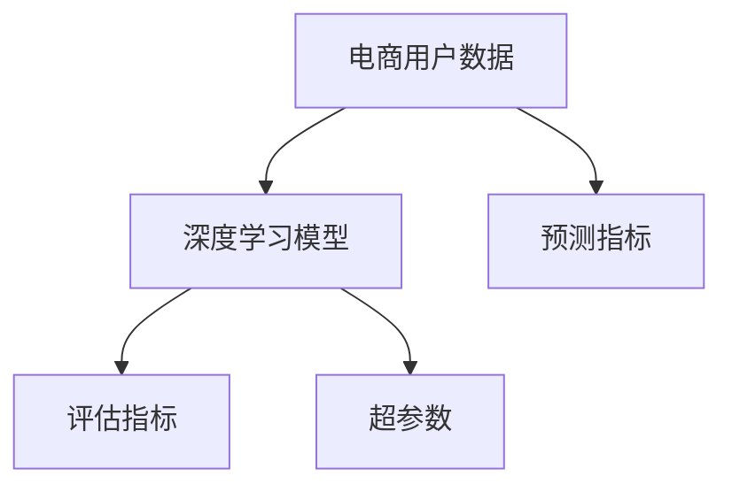

                 

# AI驱动的电商用户购买倾向预测模型

## 1. 背景介绍

### 1.1 问题由来
随着电商行业的发展，数据量的激增和消费者行为的多样性，电商企业如何更精准地预测用户购买倾向，成为亟待解决的问题。传统的统计模型由于过于简化，难以捕捉消费者行为背后的复杂性。而基于人工智能的机器学习模型，特别是深度学习模型，由于其强大的建模能力，逐渐成为电商用户行为预测的主流工具。

电商用户购买倾向预测模型的应用场景十分广泛，例如：

- 个性化推荐：根据用户历史行为，预测其可能感兴趣的商品，提升用户体验。
- 库存管理：预测商品销售情况，优化库存结构，减少缺货和积压。
- 定价策略：预测用户对价格的敏感度，动态调整定价策略，增加销售量。
- 营销策略：预测不同营销活动的效果，优化投放策略，提高营销ROI。

因此，构建高效的电商用户购买倾向预测模型，对于电商企业的智能化运营具有重要意义。

### 1.2 问题核心关键点
本研究聚焦于如何利用深度学习模型，特别是卷积神经网络(CNN)和循环神经网络(RNN)等结构，构建电商用户购买倾向预测模型。主要关注以下几个核心关键点：

- 模型的数据表示能力：如何更有效地编码用户行为数据，提高模型对用户购买倾向的捕捉能力。
- 模型的预测性能：如何设计模型结构和优化算法，提升模型在电商数据的预测准确率。
- 模型的泛化能力：如何防止模型过拟合，提升模型在新的电商数据上的泛化能力。
- 模型的实时性：如何优化模型推理速度，保证模型的实时预测能力。

## 2. 核心概念与联系

### 2.1 核心概念概述

电商用户购买倾向预测模型，旨在通过深度学习模型，对用户的行为数据进行建模，预测其未来的购买倾向。构建模型时涉及到的核心概念包括：

- 电商用户数据：用户的浏览、购买、评分等行为数据，是模型的输入。
- 深度学习模型：如卷积神经网络(CNN)、循环神经网络(RNN)等，用于对用户数据进行抽象表示和预测。
- 预测指标：如购买概率、评分预测等，是模型输出的目标。
- 评估指标：如准确率、召回率、F1分数等，用于评估模型的性能。
- 超参数：如学习率、批大小、迭代轮数等，需要根据具体问题进行调优。

这些概念之间的关系可以通过以下Mermaid流程图来展示：



这个流程图展示了电商用户购买倾向预测模型构建的核心流程：

1. 电商用户数据作为输入，进入深度学习模型进行抽象表示。
2. 模型输出预测指标，用于反映用户购买倾向。
3. 评估指标用于衡量模型的预测性能。
4. 超参数控制模型的训练过程。

这些核心概念共同构成了电商用户购买倾向预测模型的建模框架，使得模型能够高效地对用户行为进行建模和预测。

## 3. 核心算法原理 & 具体操作步骤
### 3.1 算法原理概述

构建电商用户购买倾向预测模型，核心在于选择合适的深度学习模型，并对用户行为数据进行有效的编码表示。常用的深度学习模型包括卷积神经网络(CNN)和循环神经网络(RNN)等，这些模型可以通过对用户行为数据的复杂结构进行建模，预测用户未来的购买倾向。

具体来说，电商用户行为数据通常具有以下特点：

- 时序性：用户的购买行为往往是时间序列的，例如用户的浏览历史、点击序列等。
- 多样性：用户行为数据可能包含文本、图片、时间戳等多种类型的数据。
- 高维度：用户行为数据通常具有高维度的特征，例如商品的多种属性、用户的多种行为等。

因此，我们需要设计能够处理多模态数据、具有时序性和高维度特征的深度学习模型。例如，可以使用递归神经网络(RNN)来处理时序性数据，卷积神经网络(CNN)来处理高维度特征数据，结合LSTM等模型提升长时序数据的建模能力。

### 3.2 算法步骤详解

构建电商用户购买倾向预测模型，一般包括以下关键步骤：

**Step 1: 数据预处理与特征工程**

- 数据清洗：去除缺失值、异常值等，保证数据质量。
- 特征提取：将原始数据转换为模型可处理的数值特征。
- 数据增强：通过数据扩充和变换，提高数据多样性，增强模型泛化能力。

**Step 2: 模型设计**

- 选择合适的深度学习模型，例如RNN、CNN等。
- 设计模型架构，包括卷积层、池化层、循环层等。
- 设置模型超参数，如学习率、批大小等。

**Step 3: 模型训练**

- 使用优化算法，例如随机梯度下降(SGD)、Adam等，对模型进行训练。
- 设置训练轮数，通常需要多次迭代才能收敛。
- 在验证集上评估模型性能，避免过拟合。

**Step 4: 模型评估与优化**

- 使用评估指标，例如准确率、召回率等，评估模型性能。
- 根据评估结果，调整模型结构和超参数，进行模型优化。

**Step 5: 模型部署与实时预测**

- 将训练好的模型部署到线上环境，支持实时预测。
- 在新的电商数据上，对用户行为进行预测，提供个性化推荐等应用。

### 3.3 算法优缺点

电商用户购买倾向预测模型具有以下优点：

- 高预测准确率：深度学习模型能够捕捉用户行为数据的复杂结构，提高预测准确率。
- 自动化特征工程：深度学习模型能够自动提取特征，避免人工特征工程的繁琐和复杂。
- 泛化能力强：深度学习模型通常具有较强的泛化能力，能够在新的电商数据上取得较好的表现。

同时，该模型也存在一定的局限性：

- 高计算需求：深度学习模型通常需要较大的计算资源和存储空间。
- 模型复杂度高：模型结构复杂，训练和推理速度较慢，不适用于对实时性要求高的场景。
- 数据需求量大：模型通常需要大量标注数据进行训练，数据获取成本较高。

尽管存在这些局限性，但深度学习模型在电商用户购买倾向预测中的应用仍然具有重要价值，通过合理的模型设计和管理，可以最大限度地发挥其优势，克服其局限性。

### 3.4 算法应用领域

电商用户购买倾向预测模型已经在多个电商应用场景中得到广泛应用，例如：

- 个性化推荐系统：根据用户的历史行为数据，预测其购买倾向，推荐个性化的商品。
- 库存管理系统：预测商品未来的销售情况，优化库存结构，避免缺货和积压。
- 定价策略调整：预测用户对价格的敏感度，动态调整商品定价，提升销售额。
- 用户留存分析：预测用户的流失风险，进行针对性的留存策略优化。

除了上述这些经典应用场景外，电商用户购买倾向预测模型还可以创新性地应用于营销活动优化、客户细分、品牌识别等新场景，为电商企业的智能化运营提供重要支持。

## 4. 数学模型和公式 & 详细讲解 & 举例说明
### 4.1 数学模型构建

构建电商用户购买倾向预测模型的数学模型，通常采用多模态深度学习框架。以下是基于CNN和RNN的电商用户购买倾向预测模型的数学模型构建。

假设电商用户数据包含文本特征和图片特征，记为 $X = (x_1, x_2, ..., x_n)$，其中 $x_i$ 为第 $i$ 个用户的文本或图片特征。模型的输出为 $Y$，表示用户购买倾向的概率分布。

模型的输入表示为：

$$
x_i = (x_{i1}, x_{i2}, ..., x_{in})
$$

其中 $x_{ij}$ 为第 $i$ 个用户第 $j$ 个特征的值。

模型的输出表示为：

$$
y_i = P(y|x_i)
$$

其中 $y$ 为购买或不购买的标签，$P(y|x_i)$ 为在 $x_i$ 条件下 $y$ 的条件概率。

### 4.2 公式推导过程

模型训练的目标是最大化似然函数：

$$
\max_{\theta} \prod_{i=1}^N P(y_i|x_i;\theta)
$$

其中 $\theta$ 为模型参数。

对于每个用户 $i$，模型的输出为：

$$
y_i = softmax(W*x_i + b)
$$

其中 $W$ 和 $b$ 为模型的权重和偏置项，$softmax$ 函数将输出转化为概率分布。

模型的损失函数通常采用交叉熵损失函数：

$$
L = -\frac{1}{N} \sum_{i=1}^N [y_i\log P(y_i|x_i) + (1-y_i)\log(1-P(y_i|x_i))]
$$

最小化损失函数 $L$ 即可得到模型的最优参数 $\theta^*$。

### 4.3 案例分析与讲解

以RNN为例，下面将详细介绍RNN模型在电商用户购买倾向预测中的应用。

假设用户购买行为为时间序列数据，记为 $T = (t_1, t_2, ..., t_n)$，其中 $t_i$ 为第 $i$ 个时刻的特征。模型的输入表示为：

$$
x_t = (x_{t1}, x_{t2}, ..., x_{tn})
$$

其中 $x_{tj}$ 为第 $t$ 个时刻的第 $j$ 个特征的值。

模型的输出表示为：

$$
y_t = P(y|x_t)
$$

其中 $y$ 为购买或不购买的标签，$P(y|x_t)$ 为在 $x_t$ 条件下 $y$ 的条件概率。

RNN模型的架构为：

```
输入层 --> 嵌入层 --> 循环层 --> 输出层
```

输入层将输入序列转换为向量形式，嵌入层将向量转换为模型可以处理的数值形式，循环层通过时间步长处理序列数据，输出层输出预测结果。

模型的训练过程为：

1. 前向传播：将输入序列 $T$ 通过模型计算输出 $Y$。
2. 损失计算：计算预测输出 $Y$ 与真实标签 $T$ 之间的交叉熵损失 $L$。
3. 反向传播：根据损失函数 $L$ 对模型参数进行更新，优化模型。

在训练过程中，可以使用一些优化策略，例如LSTM层和dropout层，以防止过拟合，提高模型泛化能力。

## 5. 项目实践：代码实例和详细解释说明
### 5.1 开发环境搭建

在进行电商用户购买倾向预测模型的开发时，需要先搭建好开发环境。以下是使用Python和TensorFlow搭建环境的步骤：

1. 安装Python：从官网下载并安装Python 3.x版本。
2. 安装TensorFlow：使用pip命令安装TensorFlow。
3. 安装相关依赖：安装numpy、pandas、sklearn等常用的Python库。

安装完成后，可以启动Jupyter Notebook或其他IDE进行开发。

### 5.2 源代码详细实现

以下是使用TensorFlow构建RNN电商用户购买倾向预测模型的Python代码实现。

```python
import tensorflow as tf
from tensorflow.keras.models import Sequential
from tensorflow.keras.layers import Embedding, LSTM, Dense

# 设置模型参数
embedding_dim = 100
lstm_units = 128
dropout_rate = 0.2

# 构建模型
model = Sequential([
    Embedding(input_dim=vocab_size, output_dim=embedding_dim),
    LSTM(lstm_units, return_sequences=True, dropout=dropout_rate),
    LSTM(lstm_units, dropout=dropout_rate),
    Dense(1, activation='sigmoid')
])

# 编译模型
model.compile(optimizer='adam', loss='binary_crossentropy', metrics=['accuracy'])

# 训练模型
model.fit(X_train, y_train, batch_size=64, epochs=10, validation_data=(X_val, y_val))
```

上述代码实现了RNN电商用户购买倾向预测模型的搭建、编译、训练和评估。其中，Embedding层将输入序列转换为向量形式，LSTM层处理时间序列数据，Dense层输出预测结果。模型使用adam优化器，交叉熵损失函数，并使用accuracy作为评估指标。

### 5.3 代码解读与分析

让我们再详细解读一下关键代码的实现细节：

**构建模型**：
- 使用TensorFlow的Sequential模型，定义了输入层、嵌入层、循环层和输出层。
- 输入层使用Embedding层，将输入序列转换为向量形式。
- 循环层使用LSTM层，处理时间序列数据。
- 输出层使用Dense层，输出预测结果。

**编译模型**：
- 使用adam优化器，适合处理稀疏梯度问题。
- 使用交叉熵损失函数，适用于二分类问题。
- 使用accuracy作为评估指标，反映模型预测的正确率。

**训练模型**：
- 使用fit方法，将训练集和验证集传入模型，指定批大小和迭代轮数。
- 使用dropout层，防止模型过拟合。
- 在每个epoch结束时，自动在验证集上评估模型性能。

以上代码展示了使用TensorFlow构建RNN电商用户购买倾向预测模型的完整流程，开发者可以针对具体问题进行调整和优化。

## 6. 实际应用场景
### 6.1 个性化推荐系统

电商用户购买倾向预测模型在个性化推荐系统中得到了广泛应用。通过分析用户的历史行为数据，模型能够预测用户可能感兴趣的商品，从而提供个性化的推荐。

在技术实现上，将用户的历史浏览记录、点击序列等输入模型，得到用户购买倾向的预测结果。根据预测结果，推荐系统中可以对用户进行分组，推送不同类别的商品，提升用户体验和购买率。

### 6.2 库存管理系统

电商企业需要实时监控商品的销售情况，以便及时调整库存。电商用户购买倾向预测模型可以预测商品未来的销售量，帮助企业优化库存结构，减少缺货和积压。

在实现上，将商品的多种属性、用户的历史购买记录等输入模型，预测商品的销售量。企业可以根据预测结果，动态调整库存，减少仓库成本，提高库存周转率。

### 6.3 定价策略调整

电商企业需要动态调整商品的价格，以最大化销售额。电商用户购买倾向预测模型可以预测用户对价格的敏感度，帮助企业制定更加合理的定价策略。

在实现上，将用户的浏览记录、购买记录等输入模型，预测用户对价格的敏感度。企业可以根据预测结果，调整商品的价格，提升销售额。

### 6.4 用户留存分析

电商企业需要预测用户的流失风险，以便进行针对性的留存策略优化。电商用户购买倾向预测模型可以预测用户流失的概率，帮助企业制定留存策略。

在实现上，将用户的浏览记录、购买记录等输入模型，预测用户流失的概率。企业可以根据预测结果，采取不同的留存策略，提高用户留存率。

### 6.5 营销活动优化

电商企业需要优化营销活动的投放策略，以最大化营销效果。电商用户购买倾向预测模型可以预测不同营销活动的效果，帮助企业优化营销策略。

在实现上，将用户的浏览记录、点击序列等输入模型，预测不同营销活动的效果。企业可以根据预测结果，优化营销活动的设计和投放，提升营销ROI。

### 6.6 客户细分

电商企业需要根据用户的行为特征进行客户细分，以便进行差异化的营销和服务。电商用户购买倾向预测模型可以基于用户行为数据，进行客户细分。

在实现上，将用户的浏览记录、购买记录等输入模型，预测用户的购买倾向。企业可以根据预测结果，对用户进行细分，提供差异化的服务和营销策略。

## 7. 工具和资源推荐
### 7.1 学习资源推荐

为了帮助开发者系统掌握电商用户购买倾向预测模型的理论基础和实践技巧，这里推荐一些优质的学习资源：

1. TensorFlow官方文档：TensorFlow的官方文档，提供了丰富的API和示例代码，是入门TensorFlow的必备资料。
2. Keras官方文档：Keras的官方文档，提供了详细的教程和示例，适合快速上手构建深度学习模型。
3. 《深度学习》书籍：Ian Goodfellow等著作的深度学习教材，全面介绍了深度学习的基本概念和算法。
4. 《Python深度学习》书籍：Francois Chollet著作的深度学习入门书籍，深入浅出地介绍了TensorFlow和Keras的使用。
5. 《自然语言处理综论》书籍：Yoshua Bengio等著作的NLP教材，涵盖了自然语言处理的基本理论和算法。
6. Coursera深度学习课程：由斯坦福大学开设的深度学习课程，提供了高质量的视频讲座和作业，适合系统学习深度学习。

通过对这些资源的学习实践，相信你一定能够快速掌握电商用户购买倾向预测模型的精髓，并用于解决实际的电商问题。

### 7.2 开发工具推荐

高效的开发离不开优秀的工具支持。以下是几款用于电商用户购买倾向预测模型开发的常用工具：

1. TensorFlow：由Google主导开发的开源深度学习框架，生产部署方便，适合大规模工程应用。
2. Keras：基于TensorFlow的高级API，提供了更加易用的接口，适合快速迭代研究。
3. Jupyter Notebook：交互式的开发环境，支持Python代码的编写和运行，适合数据分析和模型调试。
4. PyCharm：功能强大的IDE，支持TensorFlow和Keras等深度学习框架，提供了代码自动补全、调试等功能。

合理利用这些工具，可以显著提升电商用户购买倾向预测模型的开发效率，加快创新迭代的步伐。

### 7.3 相关论文推荐

电商用户购买倾向预测模型的发展源于学界的持续研究。以下是几篇奠基性的相关论文，推荐阅读：

1. "A Deep Learning Framework for Recommender Systems"（Deep Recurrent Neural Networks for Recommender Systems）：介绍了基于RNN的推荐系统模型，展示了其在电商数据上的效果。
2. "Customer Churn Prediction Using Deep Learning"：提出基于CNN的客户流失预测模型，展示了其在客户细分和留存策略优化中的应用。
3. "Dynamic Pricing with Deep Reinforcement Learning"：提出基于DRL的动态定价模型，展示了其在电商定价策略中的应用。
4. "Cross-Selling and Up-Selling Recommendation with Deep Learning"：提出基于CNN的交叉销售和升级销售推荐模型，展示了其在电商推荐系统中的应用。
5. "Deep Learning for Personalized Customer Recommendations"：提出基于CNN和RNN的个性化推荐模型，展示了其在电商推荐系统中的应用。

这些论文代表了大语言模型微调技术的发展脉络。通过学习这些前沿成果，可以帮助研究者把握学科前进方向，激发更多的创新灵感。

## 8. 总结：未来发展趋势与挑战
### 8.1 总结

本文对基于深度学习的电商用户购买倾向预测模型进行了全面系统的介绍。首先阐述了电商用户购买倾向预测模型的研究背景和意义，明确了深度学习模型在电商数据上的应用价值。其次，从原理到实践，详细讲解了深度学习模型在电商数据上的建模过程，给出了电商用户购买倾向预测模型的完整代码实现。同时，本文还探讨了深度学习模型在电商领域的多场景应用，展示了其广泛的应用前景。

通过本文的系统梳理，可以看到，电商用户购买倾向预测模型通过深度学习模型的强大建模能力，可以高效地捕捉用户行为数据，预测其购买倾向。未来，伴随深度学习技术的不断演进，电商用户购买倾向预测模型将得到更广泛的应用，为电商企业的智能化运营提供重要支持。

### 8.2 未来发展趋势

展望未来，电商用户购买倾向预测模型将呈现以下几个发展趋势：

1. 多模态融合：电商用户购买倾向预测模型将进一步融合多种数据类型，如文本、图片、视频等，以提高对用户行为的全方位理解。
2. 实时化处理：电商用户购买倾向预测模型将追求更短的响应时间，以便实时预测用户行为，提升用户体验。
3. 个性化推荐：电商用户购买倾向预测模型将更加个性化，通过多轮交互，精准预测用户需求，提升推荐效果。
4. 多任务学习：电商用户购买倾向预测模型将进行多任务学习，预测用户的多种需求，提升电商企业的运营效率。
5. 联邦学习：电商用户购买倾向预测模型将采用联邦学习，保护用户隐私的同时，提升模型的泛化能力。

这些趋势凸显了电商用户购买倾向预测模型的广阔前景。这些方向的探索发展，必将进一步提升电商用户购买倾向预测模型的性能和应用范围，为电商企业的智能化运营提供重要支持。

### 8.3 面临的挑战

尽管电商用户购买倾向预测模型已经取得了较好的效果，但在迈向更加智能化、普适化应用的过程中，它仍面临着诸多挑战：

1. 数据质量问题：电商数据质量参差不齐，存在缺失值、异常值等，需要设计有效的数据清洗和特征工程方法。
2. 模型复杂度高：电商用户购买倾向预测模型结构复杂，需要更多的计算资源和存储空间，如何快速高效地进行模型训练和推理是挑战之一。
3. 用户隐私保护：电商用户数据包含大量敏感信息，如何在模型训练和应用过程中保护用户隐私，避免数据泄露和滥用，需要进一步研究。
4. 实时性要求高：电商用户购买倾向预测模型需要快速响应用户行为，避免因延迟而影响用户体验，如何在保证模型性能的同时，优化推理速度，需要进一步优化。
5. 模型可解释性不足：电商用户购买倾向预测模型通常被称为"黑盒"模型，难以解释其内部工作机制和决策逻辑，需要研究模型可解释性，提高用户信任度。

这些挑战需要通过技术手段和合理的业务设计来解决，以提升电商用户购买倾向预测模型的可靠性和实用性。

### 8.4 研究展望

面对电商用户购买倾向预测模型所面临的种种挑战，未来的研究需要在以下几个方面寻求新的突破：

1. 数据增强技术：利用数据增强技术，提高电商数据的泛化能力，减少过拟合风险。
2. 模型结构优化：研究更高效的模型结构，降低模型复杂度，提高推理速度。
3. 多任务学习：将电商用户购买倾向预测模型与用户行为分析、产品推荐等任务结合，进行多任务学习，提升模型性能。
4. 联邦学习：利用联邦学习技术，保护用户隐私的同时，提升模型的泛化能力。
5. 模型可解释性：研究模型可解释性，提高用户对模型的信任度。

这些研究方向的探索，必将引领电商用户购买倾向预测模型迈向更高的台阶，为电商企业的智能化运营提供重要支持。面向未来，电商用户购买倾向预测模型需要与其他人工智能技术进行更深入的融合，如知识表示、因果推理、强化学习等，多路径协同发力，共同推动电商智能化的发展。

## 9. 附录：常见问题与解答
**Q1：电商用户购买倾向预测模型的数据来源有哪些？**

A: 电商用户购买倾向预测模型的数据来源包括：
1. 用户行为数据：用户的浏览记录、点击序列、购买记录等。
2. 商品属性数据：商品的名称、描述、价格、分类等。
3. 用户画像数据：用户的性别、年龄、地域、兴趣等。
4. 外部数据：社交媒体数据、天气数据、节日数据等。

这些数据来源可以全面反映用户的行为特征和需求，为模型训练提供充足的样本。

**Q2：电商用户购买倾向预测模型的性能评估指标有哪些？**

A: 电商用户购买倾向预测模型的性能评估指标包括：
1. 准确率（Accuracy）：模型预测正确的样本数与总样本数之比。
2. 召回率（Recall）：模型预测出的正样本数与真实正样本数之比。
3. F1分数（F1 Score）：综合考虑准确率和召回率的指标。
4. AUC-ROC曲线（AUC-ROC）：反映模型在不同阈值下的预测性能。

这些评估指标可以全面反映模型的预测性能，帮助开发者选择最适合的模型和调参策略。

**Q3：电商用户购买倾向预测模型的数据预处理流程是什么？**

A: 电商用户购买倾向预测模型的数据预处理流程包括：
1. 数据清洗：去除缺失值、异常值等，保证数据质量。
2. 特征提取：将原始数据转换为模型可处理的数值特征，如将文本转换为词向量。
3. 数据增强：通过数据扩充和变换，提高数据多样性，如文本的正则化、数据的随机化等。
4. 特征选择：选择对模型预测有用的特征，减少冗余特征的干扰。

这些预处理步骤可以提升模型的泛化能力和预测性能。

**Q4：电商用户购买倾向预测模型的超参数调优策略有哪些？**

A: 电商用户购买倾向预测模型的超参数调优策略包括：
1. 网格搜索（Grid Search）：通过枚举所有可能的超参数组合，选择最优的超参数。
2. 随机搜索（Random Search）：通过随机采样超参数，选择最优的超参数。
3. 贝叶斯优化（Bayesian Optimization）：利用贝叶斯方法，逐步逼近最优超参数组合。
4. 学习率调优：通过学习率衰减、自适应学习率等方法，优化模型的训练过程。
5. 批次大小调整：通过调整批大小，优化模型的训练效率和泛化能力。

这些调优策略可以帮助开发者快速找到最优的超参数组合，提升模型的预测性能。

**Q5：电商用户购买倾向预测模型在实际应用中需要注意哪些问题？**

A: 电商用户购买倾向预测模型在实际应用中需要注意以下问题：
1. 数据隐私保护：电商用户数据包含大量敏感信息，需要在模型训练和应用过程中保护用户隐私。
2. 实时性要求：电商用户购买倾向预测模型需要快速响应用户行为，避免因延迟而影响用户体验。
3. 模型可解释性：电商用户购买倾向预测模型通常被称为"黑盒"模型，需要研究模型可解释性，提高用户信任度。
4. 模型泛化能力：电商用户购买倾向预测模型需要具备较强的泛化能力，以适应不同电商平台和用户行为的多样性。
5. 模型鲁棒性：电商用户购买倾向预测模型需要具备较强的鲁棒性，避免因数据噪声和异常值对模型预测造成干扰。

这些问题是电商用户购买倾向预测模型在实际应用中需要特别关注的问题。

---

作者：禅与计算机程序设计艺术 / Zen and the Art of Computer Programming

