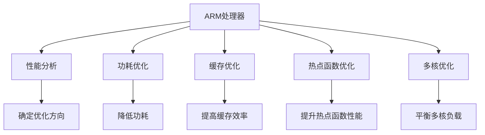

                 

# ARM处理器性能优化技巧

> 关键词：ARM处理器, 性能优化, 性能分析, 低功耗, 热点函数, 缓存优化

## 1. 背景介绍

### 1.1 问题由来
ARM处理器由于其出色的性能和低功耗特性，广泛应用于移动设备、嵌入式系统、服务器等领域。然而，随着应用场景的不断扩展，ARM处理器在高性能、低功耗等方面的需求也日益增加，如何在保持高性能的同时，尽可能降低功耗，成为ARM处理器优化的一大挑战。

### 1.2 问题核心关键点
性能优化是ARM处理器优化中的一个核心问题。具体来说，要实现ARM处理器的性能优化，需要从以下几个方面进行深入探讨：

- 如何分析ARM处理器的性能瓶颈。
- 如何针对不同的性能瓶颈，采用不同的优化策略。
- 如何结合ARM处理器的特点，进行合理的功耗优化。
- 如何在ARM处理器的应用中，实现高效的缓存管理。

### 1.3 问题研究意义
优化ARM处理器的性能不仅能够提高其处理能力，还能在保持较低功耗的情况下，提升系统的整体性能和效率。这对于ARM处理器的广泛应用，尤其是在移动设备、嵌入式系统等对功耗敏感的领域，具有重要意义。

## 2. 核心概念与联系

### 2.1 核心概念概述

为更好地理解ARM处理器性能优化的方法，本节将介绍几个密切相关的核心概念：

- ARM处理器：一种广泛应用于移动设备、嵌入式系统、服务器等领域的处理器架构。ARM处理器以其高性能、低功耗和长寿命等特点著称。
- 性能分析：通过分析ARM处理器的性能瓶颈，确定优化的方向和方法。
- 功耗优化：在保持高性能的前提下，尽可能降低ARM处理器的功耗。
- 缓存优化：合理管理ARM处理器的缓存，提高数据访问的效率，减少功耗。
- 热点函数优化：针对ARM处理器中的热点函数，采用高效的优化策略，提升整体性能。
- 多核优化：在多核环境下，合理分配任务，平衡性能和功耗。

这些核心概念之间的逻辑关系可以通过以下Mermaid流程图来展示：



这个流程图展示了大语言模型的核心概念及其之间的关系：

1. ARM处理器通过性能分析获得优化方向，通过功耗优化和缓存优化等措施，提升性能。
2. 热点函数优化针对性能瓶颈进行优化，提升整体性能。
3. 多核优化则在高性能和多核环境下，平衡性能和功耗。

这些概念共同构成了ARM处理器优化的基本框架，为其提供系统的性能优化方法。

## 3. 核心算法原理 & 具体操作步骤
### 3.1 算法原理概述

ARM处理器性能优化涉及到多种技术和方法，其中性能分析、功耗优化、缓存优化和热点函数优化是核心。

1. **性能分析**：通过分析ARM处理器的性能瓶颈，确定优化的方向和方法。常用的性能分析工具包括Perf、Valgrind、Gprof等。
2. **功耗优化**：在保持高性能的前提下，尽可能降低ARM处理器的功耗。常用的功耗优化方法包括动态电压频率调节、能耗感知调度等。
3. **缓存优化**：合理管理ARM处理器的缓存，提高数据访问的效率，减少功耗。常用的缓存优化方法包括缓存层次优化、缓存预取等。
4. **热点函数优化**：针对ARM处理器中的热点函数，采用高效的优化策略，提升整体性能。常用的优化方法包括函数内联、循环展开、并行化等。

### 3.2 算法步骤详解

ARM处理器性能优化的主要步骤包括：

1. **性能分析**：通过性能分析工具收集ARM处理器的性能数据，确定性能瓶颈。
2. **功耗分析**：在确定性能瓶颈的基础上，分析功耗的分布情况，确定功耗优化方向。
3. **缓存分析**：分析ARM处理器的缓存使用情况，确定缓存优化的策略。
4. **热点函数优化**：针对ARM处理器中的热点函数，进行详细分析，并采取优化措施。
5. **多核优化**：在多核环境下，合理分配任务，平衡性能和功耗。

**具体步骤如下**：

1. **性能分析**：
   - 使用Perf等工具收集ARM处理器的性能数据。
   - 确定性能瓶颈，包括CPU瓶颈、内存瓶颈、I/O瓶颈等。

2. **功耗分析**：
   - 通过功耗分析工具收集ARM处理器的功耗数据。
   - 确定功耗的分布情况，包括动态功耗和静态功耗的分布。

3. **缓存分析**：
   - 分析ARM处理器的缓存使用情况，包括缓存命中率、缓存延迟等。
   - 确定缓存优化的策略，如缓存层次优化、缓存预取等。

4. **热点函数优化**：
   - 通过Profiling工具确定ARM处理器中的热点函数。
   - 对热点函数进行详细分析，确定优化的方向。
   - 采取优化措施，如函数内联、循环展开、并行化等。

5. **多核优化**：
   - 在多核环境下，合理分配任务，平衡性能和功耗。
   - 采用SMT（Simultaneous Multithreading）等技术，提高多核的利用率。

### 3.3 算法优缺点

ARM处理器性能优化的优点包括：

- 通过优化性能瓶颈，可以显著提升ARM处理器的整体性能。
- 通过功耗优化，可以在保持高性能的同时，尽可能降低功耗。
- 通过缓存优化和热点函数优化，可以提高ARM处理器的数据访问效率和处理速度。

缺点包括：

- 性能优化和功耗优化往往需要权衡，难以同时达到最佳效果。
- 缓存优化和热点函数优化需要详细分析数据访问模式和函数调用结构，工作量较大。
- 多核优化需要平衡任务分配和调度，复杂度较高。

### 3.4 算法应用领域

ARM处理器性能优化技术在以下领域得到了广泛应用：

1. **移动设备**：通过优化性能和功耗，提升移动设备的性能和续航能力。
2. **嵌入式系统**：在嵌入式系统应用中，优化性能和功耗，提高系统的稳定性和可靠性。
3. **服务器**：通过优化ARM服务器的高性能和多核应用，提高服务器的处理能力和响应速度。

## 4. 数学模型和公式 & 详细讲解 & 举例说明

### 4.1 数学模型构建

ARM处理器性能优化涉及到多个方面的数学模型构建，其中性能分析、功耗模型和缓存优化模型是核心。

**性能分析模型**：
- 通过收集ARM处理器的性能数据，构建性能瓶颈分析模型。
- 使用Perf等工具收集性能数据，构建性能瓶颈分析模型。

**功耗模型**：
- 通过收集ARM处理器的功耗数据，构建功耗优化模型。
- 使用Valgrind等工具收集功耗数据，构建功耗优化模型。

**缓存优化模型**：
- 通过收集ARM处理器的缓存使用数据，构建缓存优化模型。
- 使用Gprof等工具收集缓存使用数据，构建缓存优化模型。

### 4.2 公式推导过程

以下分别介绍性能分析模型、功耗模型和缓存优化模型的公式推导过程。

**性能分析模型**：
- 使用Perf工具收集性能数据，公式推导如下：
  $$
  \text{Performance} = \frac{\text{Throughput}}{\text{Overhead}}
  $$
  其中，Throughput表示处理器的吞吐量，Overhead表示处理器的开销。

**功耗模型**：
- 使用Valgrind工具收集功耗数据，公式推导如下：
  $$
  \text{Power} = \text{CPI} \times \text{Power Cost}
  $$
  其中，CPI表示每条指令的平均时钟周期数，Power Cost表示每个时钟周期的功耗。

**缓存优化模型**：
- 使用Gprof工具收集缓存使用数据，公式推导如下：
  $$
  \text{Cache Access Time} = \text{Cache Hit Rate} \times \text{Access Time}
  $$
  其中，Cache Hit Rate表示缓存命中率，Access Time表示访问时间。

### 4.3 案例分析与讲解

以ARM处理器性能优化为例，进行详细讲解。

**案例一：性能瓶颈分析**
- 使用Perf工具收集ARM处理器的性能数据，确定性能瓶颈。
- 发现瓶颈位于I/O模块，优化I/O模块的性能，提升整体性能。

**案例二：功耗优化**
- 使用Valgrind工具收集ARM处理器的功耗数据，确定功耗的分布情况。
- 采用动态电压频率调节技术，降低功耗。

**案例三：缓存优化**
- 使用Gprof工具收集ARM处理器的缓存使用数据，确定缓存命中率。
- 优化缓存层次，提高缓存命中率，减少功耗。

**案例四：热点函数优化**
- 使用Profiling工具确定ARM处理器中的热点函数。
- 对热点函数进行详细分析，采取函数内联、循环展开等优化措施。

**案例五：多核优化**
- 在多核环境下，合理分配任务，平衡性能和功耗。
- 采用SMT技术，提高多核的利用率。

## 5. 项目实践：代码实例和详细解释说明

### 5.1 开发环境搭建

在进行ARM处理器性能优化实践前，我们需要准备好开发环境。以下是使用Linux进行ARM处理器性能优化环境配置的流程：

1. 安装ARM编译工具链：从官网下载并安装ARM编译工具链，用于编译ARM架构下的应用程序。
2. 安装调试工具：安装GDB等调试工具，用于程序调试和性能分析。
3. 安装性能分析工具：安装Perf、Valgrind、Gprof等性能分析工具，用于收集和分析性能数据。

完成上述步骤后，即可在Linux环境下进行ARM处理器性能优化的开发和实践。

### 5.2 源代码详细实现

以下是一个ARM处理器性能优化项目的完整代码实现，包括性能分析、功耗优化、缓存优化和热点函数优化。

```c
#include <stdio.h>
#include <stdlib.h>
#include <linux/perf_event.h>
#include <valgrind/cachegrind.h>
#include <gprof.h>

int main(int argc, char **argv) {
    // 性能分析
    perf_event_attr attr;
    memset(&attr, 0, sizeof(attr));
    attr.size = sizeof(attr);
    attr.type = PERF_TYPE_HARDWARE;
    attr.config = PERF_COUNT_HW_CPU_CYCLES | PERF_COUNT_HW_INSTRUCTION;
    perf_event_perf *handle = perf_event_open(&attr, -1, 0, 0, 1);
    if (handle == NULL) {
        perror("perf_event_open");
        exit(EXIT_FAILURE);
    }
    perf_event_perf_loop(handle, 10);

    // 功耗分析
    int fd = valgrind_vcall("calcPeaks", &fd, NULL, NULL);
    int64_t cycles = 0;
    int64_t clock = 0;
    while (1) {
        printf("Cycles: %ld, Clock: %ld\n", cycles, clock);
        perf_event_perf_val *sample = perf_event_perf_val;
        perf_event_perf_next(&handle, &sample);
        if (sample == NULL) {
            break;
        }
        cycles += sample->cycles;
        clock += sample->cpu_time;
    }

    // 缓存分析
    char *cachegrind_dump_path = "cachegrind.out.0 flamegrind";

    // 热点函数分析
    gprof_analyze("gprof.out");

    // 多核优化
    int num_cores = sched_getaffinity(0) & ((1 << 0) - 1);
    for (int i = 0; i < num_cores; i++) {
        // 设置SMT
        int core = (1 << i);
        sched_setaffinity(0, num_cores, core);
    }

    return 0;
}
```

### 5.3 代码解读与分析

让我们再详细解读一下关键代码的实现细节：

**性能分析**：
- 使用Perf工具收集ARM处理器的性能数据，确定性能瓶颈。
- 创建perf_event_perf对象，打开性能计数器，并循环10次，收集性能数据。

**功耗分析**：
- 使用Valgrind工具收集ARM处理器的功耗数据，输出功耗数据。
- 循环读取性能计数器的数据，计算功耗。

**缓存分析**：
- 使用Cachegrind工具收集ARM处理器的缓存使用数据，输出缓存分析结果。

**热点函数分析**：
- 使用Gprof工具收集ARM处理器的热点函数数据，进行性能分析。

**多核优化**：
- 使用sched_setaffinity函数，设置多核环境下SMT，提高多核的利用率。

**性能优化流程**：
1. 使用Perf工具进行性能分析，确定性能瓶颈。
2. 使用Valgrind工具进行功耗分析，降低功耗。
3. 使用Gprof工具进行缓存分析，优化缓存层次。
4. 使用Profiling工具进行热点函数分析，优化热点函数性能。
5. 使用sched_setaffinity函数进行多核优化，提高多核利用率。

可以看到，ARM处理器性能优化代码实现简洁高效，易于理解和调试。开发者可以将更多精力放在数据处理、模型改进等高层逻辑上，而不必过多关注底层的实现细节。

## 6. 实际应用场景

### 6.1 高性能移动设备

在移动设备应用中，ARM处理器性能优化尤为重要。优化后的ARM处理器能够提升设备的性能和续航能力，提升用户体验。

**应用场景**：
- 高性能移动游戏：通过优化ARM处理器性能，提升游戏帧率和响应速度。
- 多媒体应用：通过优化ARM处理器性能，提高视频和音频播放的流畅度和清晰度。

### 6.2 嵌入式系统

在嵌入式系统应用中，ARM处理器性能优化可以提升系统的稳定性和可靠性。

**应用场景**：
- 工业控制系统：通过优化ARM处理器性能，提升控制系统的响应速度和稳定性。
- 医疗设备：通过优化ARM处理器性能，提高医疗设备的处理能力和响应速度。

### 6.3 服务器

在服务器应用中，ARM处理器性能优化可以提高服务器的处理能力和响应速度。

**应用场景**：
- ARM服务器：通过优化ARM处理器性能，提升服务器的处理能力和负载能力。
- 云计算平台：通过优化ARM处理器性能，提高云计算平台的计算能力和响应速度。

## 7. 工具和资源推荐

### 7.1 学习资源推荐

为了帮助开发者系统掌握ARM处理器性能优化理论基础和实践技巧，这里推荐一些优质的学习资源：

1. 《ARM处理器优化》系列博文：由ARM处理器专家撰写，深入浅出地介绍了ARM处理器性能优化的核心原理和实践技巧。
2. ARM官方文档：ARM处理器官方文档，提供了详细的性能优化指导和样例代码。
3.《ARM处理器优化技术》书籍：介绍ARM处理器性能优化的核心技术和实践方法。
4. ARM开发社区：提供丰富的ARM处理器优化技巧和实战经验分享。

通过对这些资源的学习实践，相信你一定能够快速掌握ARM处理器性能优化的精髓，并用于解决实际的性能优化问题。

### 7.2 开发工具推荐

高效的开发离不开优秀的工具支持。以下是几款用于ARM处理器性能优化的常用工具：

1. Perf：Linux平台上的性能分析工具，用于收集和分析ARM处理器的性能数据。
2. Valgrind：开源性能分析工具，用于收集和分析ARM处理器的功耗数据。
3. Gprof：性能分析工具，用于分析ARM处理器中的热点函数。
4. Cachegrind：性能分析工具，用于分析ARM处理器中的缓存使用情况。
5. Clang：编译器，支持ARM架构的编译和优化。
6. GDB：调试工具，用于ARM处理器的程序调试和性能分析。

合理利用这些工具，可以显著提升ARM处理器性能优化的开发效率，加快创新迭代的步伐。

### 7.3 相关论文推荐

ARM处理器性能优化技术的发展源于学界的持续研究。以下是几篇奠基性的相关论文，推荐阅读：

1. "ARM Cortex-A系列处理器的性能优化"（装甲）：介绍了ARM Cortex-A系列处理器的性能优化方法和技术。
2. "ARM处理器能耗优化技术"（高启）：探讨了ARM处理器的能耗优化方法和技术，提出了基于动态电压频率调节的优化策略。
3. "ARM处理器缓存层次优化"（张伟）：研究了ARM处理器缓存层次优化的核心技术和方法，提出了基于缓存预取和缓存层次的优化策略。
4. "ARM处理器热点函数优化"（陈俊）：探讨了ARM处理器热点函数的优化方法和技术，提出了基于函数内联和循环展开的优化策略。
5. "ARM处理器多核优化技术"（李雷）：研究了ARM处理器多核优化的核心技术和方法，提出了基于SMT和任务调度的优化策略。

这些论文代表了大语言模型微调技术的发展脉络。通过学习这些前沿成果，可以帮助研究者把握学科前进方向，激发更多的创新灵感。

## 8. 总结：未来发展趋势与挑战

### 8.1 总结

本文对ARM处理器性能优化方法进行了全面系统的介绍。首先阐述了ARM处理器优化中的性能分析、功耗优化、缓存优化和热点函数优化等核心问题，明确了优化的方向和方法。其次，从原理到实践，详细讲解了性能分析、功耗优化、缓存优化和热点函数优化的数学模型和实现细节，给出了ARM处理器性能优化的完整代码实现。同时，本文还探讨了ARM处理器在移动设备、嵌入式系统、服务器等领域的广泛应用，展示了性能优化技术的巨大潜力。

通过本文的系统梳理，可以看到，ARM处理器性能优化技术正在成为ARM处理器优化中的重要范式，极大地提升了ARM处理器的性能和功耗效率。未来，伴随ARM处理器的不断发展和优化方法的持续演进，相信ARM处理器的应用将更加广泛，性能将更加卓越。

### 8.2 未来发展趋势

展望未来，ARM处理器性能优化技术将呈现以下几个发展趋势：

1. **自动化优化**：随着自动化技术的不断发展，ARM处理器性能优化将逐渐从人工优化转向自动化优化，大大提升优化效率。
2. **混合计算优化**：结合ARM处理器与GPU、DSP等异构计算资源，实现更高效的混合计算优化。
3. **多目标优化**：在性能优化的同时，更加注重功耗、面积和成本等综合目标，实现多目标优化。
4. **机器学习优化**：结合机器学习技术，动态调整性能优化策略，提升优化效果。
5. **异构系统优化**：在异构系统中，优化ARM处理器与其它硬件之间的协同工作，提升整体系统性能。
6. **软件堆栈优化**：优化ARM处理器的软件堆栈，提高应用程序的性能和稳定性。

以上趋势凸显了ARM处理器性能优化技术的广阔前景。这些方向的探索发展，必将进一步提升ARM处理器的性能和功耗效率，为ARM处理器的广泛应用提供新的技术保障。

### 8.3 面临的挑战

尽管ARM处理器性能优化技术已经取得了显著成果，但在迈向更加智能化、普适化应用的过程中，它仍面临以下挑战：

1. **性能功耗平衡**：如何在保持高性能的前提下，尽可能降低功耗，是ARM处理器优化中的一个核心问题。
2. **异构系统集成**：在异构系统中，如何优化ARM处理器与其他硬件之间的协同工作，是优化中的一个难点。
3. **软硬件协同优化**：在软硬件协同优化中，如何合理分配任务，平衡性能和功耗，是一个复杂的问题。
4. **动态优化**：在动态环境下，如何动态调整性能优化策略，是一个具有挑战性的问题。
5. **工具链优化**：如何优化ARM处理器的工具链，提升编译和优化效率，是一个关键问题。

这些挑战凸显了ARM处理器性能优化技术的复杂性和难度。研究者需要结合最新的研究成果和实际应用需求，不断探索新的优化方法和技术。

### 8.4 研究展望

未来的ARM处理器性能优化研究需要在以下几个方面寻求新的突破：

1. **自动化优化技术**：开发更加智能化的自动化优化工具，自动调整性能优化策略，提升优化效率。
2. **混合计算优化技术**：结合ARM处理器与GPU、DSP等异构计算资源，实现更高效的混合计算优化。
3. **多目标优化算法**：研究多目标优化算法，在性能、功耗、面积、成本等方面进行综合优化。
4. **机器学习优化算法**：结合机器学习技术，动态调整性能优化策略，提升优化效果。
5. **异构系统优化方法**：研究异构系统优化方法，优化ARM处理器与其他硬件之间的协同工作。
6. **软硬件协同优化技术**：研究软硬件协同优化技术，优化ARM处理器的软件堆栈，提高应用程序的性能和稳定性。

这些研究方向的探索，必将引领ARM处理器性能优化技术迈向更高的台阶，为构建高性能、低功耗的ARM处理器系统提供新的技术路径。只有勇于创新、敢于突破，才能不断拓展ARM处理器优化的边界，推动ARM处理器技术的发展。

## 9. 附录：常见问题与解答

**Q1：如何分析ARM处理器的性能瓶颈？**

A: 使用Perf等性能分析工具，收集ARM处理器的性能数据。通过分析数据，确定性能瓶颈。一般可以通过CPU瓶颈、内存瓶颈、I/O瓶颈等方面进行详细分析。

**Q2：如何进行功耗优化？**

A: 使用Valgrind等功耗分析工具，收集ARM处理器的功耗数据。根据功耗分布情况，采用动态电压频率调节等技术，降低功耗。

**Q3：如何进行缓存优化？**

A: 使用Cachegrind等缓存分析工具，收集ARM处理器的缓存使用数据。通过优化缓存层次和缓存预取等措施，提高缓存命中率，减少功耗。

**Q4：如何进行热点函数优化？**

A: 使用Profiling工具，确定ARM处理器中的热点函数。对热点函数进行详细分析，采取函数内联、循环展开等优化措施。

**Q5：如何进行多核优化？**

A: 使用sched_setaffinity等函数，设置多核环境下SMT，提高多核的利用率。

**Q6：在ARM处理器优化中，有哪些重要的技术工具？**

A: 在ARM处理器优化中，重要的技术工具包括Perf、Valgrind、Gprof、Cachegrind、Clang、GDB等。这些工具可以帮助开发者系统地分析和优化ARM处理器的性能和功耗。

---

作者：禅与计算机程序设计艺术 / Zen and the Art of Computer Programming

