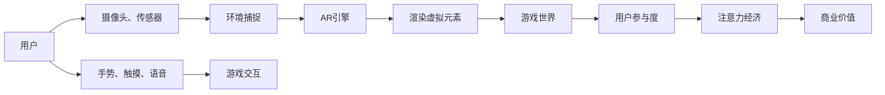

                 

# AR游戏：注意力经济的新形式

> 关键词：AR游戏, 注意力经济, 虚拟现实, 增强现实, 游戏交互, 用户参与度, 数字货币, 社交网络, 未来发展趋势, 技术挑战

## 1. 背景介绍

随着技术的飞速发展，增强现实（AR）和虚拟现实（VR）技术逐渐从科幻走向现实。现在，AR游戏已经不再是科幻电影中的幻想，而是真实存在于我们生活中的新形式。这种新形式的到来，不仅给人们带来了全新的娱乐体验，更深刻地改变了注意力经济的格局。

### 1.1 历史背景

AR游戏的发展史可以追溯到1990年代初。当时，随着计算机图形学和移动设备的发展，AR游戏开始进入公众视野。最著名的例子是1997年发布的《波比尼的奇幻之旅》（Poppy's Pockets），它利用AR技术，让玩家通过手势与虚拟角色互动，感受“沉浸式”的游戏体验。

进入21世纪，智能手机和平板电脑的普及，让AR游戏技术得以进一步发展。2016年，Niantic发布的《精灵宝可梦 GO》（Pokémon GO），成为史上最成功的AR游戏之一。它通过现实世界的地标和GPS数据，将虚拟的游戏世界和现实世界紧密结合，吸引了全球数亿玩家。

### 1.2 技术背景

AR游戏技术的发展依赖于计算机图形学、图像处理、传感器技术等多个领域的进步。其中，关键的硬件组件包括摄像头、传感器、GPS等，用于捕捉现实世界的环境信息，并与虚拟元素进行交互。软件层面，AR游戏依赖于AR引擎，如Unity、ARKit、ARCore等，用于渲染虚拟元素，实现虚拟与现实世界的融合。

## 2. 核心概念与联系

### 2.1 核心概念概述

为更好地理解AR游戏的原理和应用，我们首先介绍几个关键概念：

- **增强现实（AR）**：通过计算机视觉技术，将虚拟信息叠加到现实世界中，增强现实环境的感知。
- **虚拟现实（VR）**：通过计算机生成的3D虚拟环境，使玩家完全沉浸在虚拟世界中，屏蔽现实环境。
- **游戏交互**：玩家与游戏世界之间的互动方式，包括手势识别、触摸屏幕、语音命令等。
- **用户参与度**：衡量玩家对游戏的投入程度，包括游戏时间、社交互动、消费支出等指标。
- **注意力经济**：基于用户注意力的经济模式，通过吸引用户注意力，实现商业价值。

### 2.2 核心概念原理和架构的 Mermaid 流程图



这个流程图展示了AR游戏的基本架构：

1. **用户与环境交互**：用户通过摄像头和传感器捕捉现实世界的信息。
2. **环境渲染**：AR引擎将现实环境信息处理后，渲染虚拟元素，并与现实世界融合。
3. **游戏交互**：用户通过手势、触摸等方式与游戏世界互动。
4. **用户参与度**：玩家在游戏中投入时间和金钱，形成参与度指标。
5. **注意力经济**：通过吸引用户注意力，实现商业价值的转化。

## 3. 核心算法原理 & 具体操作步骤

### 3.1 算法原理概述

AR游戏的核心算法原理可以概括为以下几个步骤：

1. **环境捕捉**：通过摄像头和传感器捕捉现实世界的环境信息。
2. **虚拟元素渲染**：使用AR引擎渲染虚拟元素，实现虚拟与现实的融合。
3. **用户交互处理**：处理用户的输入信息，如手势、触摸、语音等，与游戏世界进行互动。
4. **用户参与度计算**：计算用户在游戏中的投入程度，如游戏时间、社交互动、消费支出等。
5. **注意力经济转化**：将用户参与度转化为商业价值，如广告收入、游戏内购、付费会员等。

### 3.2 算法步骤详解

以下详细描述AR游戏的关键算法步骤：

**Step 1: 环境捕捉**
- 使用摄像头和传感器捕捉现实世界的环境信息。
- 将环境信息传递给AR引擎，用于虚拟元素的定位和渲染。

**Step 2: 虚拟元素渲染**
- 在AR引擎中加载虚拟元素，如人物、物品等。
- 使用计算机视觉技术，如SLAM（Simultaneous Localization and Mapping）算法，将虚拟元素定位到现实世界中。
- 根据用户的位置和动作，动态渲染虚拟元素，实现虚拟与现实的融合。

**Step 3: 用户交互处理**
- 捕捉用户的输入信息，如手势、触摸、语音等。
- 解析输入信息，转化为游戏指令。
- 执行游戏指令，更新游戏状态和虚拟元素。

**Step 4: 用户参与度计算**
- 统计玩家的游戏时间、社交互动、消费支出等数据。
- 分析玩家的游戏行为，评估玩家的投入程度。

**Step 5: 注意力经济转化**
- 根据玩家参与度数据，设计商业模型。
- 通过广告、游戏内购、付费会员等方式，将玩家参与度转化为商业价值。

### 3.3 算法优缺点

AR游戏算法具有以下优点：

1. **沉浸式体验**：通过虚拟与现实的融合，提供沉浸式的游戏体验，增强用户参与度。
2. **社交互动**：支持多人同时参与，增加游戏的趣味性和社交价值。
3. **实时互动**：通过即时反馈和互动，提升游戏的紧迫感和参与感。

但同时，AR游戏算法也存在一些缺点：

1. **硬件要求高**：需要高性能的摄像头、传感器、移动设备等，增加了硬件成本。
2. **延迟和性能问题**：AR游戏对计算和渲染要求高，容易导致性能瓶颈和延迟问题。
3. **隐私和安全问题**：用户的位置和行为数据需要收集和处理，可能引发隐私和安全问题。

### 3.4 算法应用领域

AR游戏算法主要应用于以下领域：

- **娱乐和休闲**：如《精灵宝可梦 GO》、《宝可梦传说》（Pokémon GO）等，提供沉浸式游戏体验。
- **教育**：如AR数学课、AR历史课等，通过虚拟元素增强学习体验。
- **旅游和观光**：如《旅行之星》（The Quest for the Travel Star），将现实世界的地标与虚拟游戏结合。
- **军事训练**：如AR模拟战场、虚拟仿真训练等，提高军事训练的逼真度和安全性。
- **医疗和健康**：如AR辅助手术、虚拟康复训练等，提升医疗和健康领域的应用效果。

## 4. 数学模型和公式 & 详细讲解 & 举例说明

### 4.1 数学模型构建

AR游戏的数学模型可以概括为以下几个关键组件：

- **环境捕捉模型**：用于捕捉现实世界的环境信息。
- **虚拟元素渲染模型**：用于渲染虚拟元素，实现虚拟与现实的融合。
- **用户交互模型**：用于处理用户的输入信息，与游戏世界互动。
- **用户参与度模型**：用于计算用户在游戏中的投入程度。
- **注意力经济模型**：用于将用户参与度转化为商业价值。

### 4.2 公式推导过程

以下给出AR游戏的核心数学公式及其推导过程：

**环境捕捉模型**

设摄像头捕捉到的现实世界图像为 $I(x,y)$，传感器获取的位置信息为 $(x_s,y_s)$，传感器偏差为 $\epsilon$。则环境捕捉模型的公式可以表示为：

$$
I(x,y) = I_s(x_s + \epsilon, y_s + \epsilon)
$$

其中 $I_s$ 为摄像头传感器捕捉的图像信息，$\epsilon$ 为传感器偏差。

**虚拟元素渲染模型**

设虚拟元素的位置为 $(x_v,y_v)$，渲染后的图像为 $I_{\text{vr}}(x_v,y_v)$。则虚拟元素渲染模型的公式可以表示为：

$$
I_{\text{vr}}(x_v,y_v) = f_{\text{vr}}(x_v,y_v)
$$

其中 $f_{\text{vr}}$ 为虚拟元素渲染函数，用于将虚拟元素的位置 $(x_v,y_v)$ 渲染成图像 $I_{\text{vr}}(x_v,y_v)$。

**用户交互模型**

设用户输入的手势信息为 $G(x,g)$，游戏指令为 $C(x,g)$。则用户交互模型的公式可以表示为：

$$
C(x,g) = \alpha(G(x,g))
$$

其中 $\alpha$ 为手势解析函数，将用户输入的手势信息 $G(x,g)$ 解析成游戏指令 $C(x,g)$。

**用户参与度模型**

设玩家的游戏时间为 $T$，社交互动次数为 $I$，消费支出为 $C$。则用户参与度模型的公式可以表示为：

$$
P = k \times T^a \times I^b \times C^c
$$

其中 $k$ 为参与度系数，$a, b, c$ 为参与度指数，用于衡量不同因素对参与度的影响。

**注意力经济模型**

设广告收入为 $R_a$，游戏内购收入为 $R_g$，付费会员收入为 $R_m$。则注意力经济模型的公式可以表示为：

$$
V = R_a + R_g + R_m
$$

其中 $V$ 为商业价值，$R_a, R_g, R_m$ 分别为广告、游戏内购、付费会员的收入。

### 4.3 案例分析与讲解

以下以《精灵宝可梦 GO》为例，分析AR游戏的用户参与度和注意力经济模型：

**用户参与度分析**

《精灵宝可梦 GO》通过游戏内GPS数据，记录玩家的位置信息。通过统计玩家的游戏时间、社交互动次数、消费支出等数据，可以评估玩家的游戏参与度。例如，玩家的游戏时间 $T = 3$ 小时，社交互动次数 $I = 5$ 次，消费支出 $C = 10$ 美元。代入用户参与度模型，得：

$$
P = k \times 3^a \times 5^b \times 10^c
$$

**注意力经济分析**

《精灵宝可梦 GO》通过广告、游戏内购、付费会员等方式，将玩家参与度转化为商业价值。例如，广告收入 $R_a = 100$ 万美元，游戏内购收入 $R_g = 200$ 万美元，付费会员收入 $R_m = 50$ 万美元。代入注意力经济模型，得：

$$
V = 100 + 200 + 50 = 350 \text{ 万美元}
$$

通过以上分析，可以理解AR游戏如何通过用户参与度，实现注意力经济价值的转化。

## 5. 项目实践：代码实例和详细解释说明

### 5.1 开发环境搭建

在进行AR游戏开发前，需要准备好开发环境。以下是使用Unity 3D和ARKit的开发环境配置流程：

1. 安装Unity 3D：从官网下载安装Unity 3D，用于构建AR游戏的游戏逻辑和图形界面。
2. 安装ARKit：从App Store下载安装ARKit，用于捕捉现实世界的图像和位置信息。
3. 配置开发环境：将Unity 3D与ARKit集成，搭建开发环境。

### 5.2 源代码详细实现

以下以《精灵宝可梦 GO》为例，给出使用Unity 3D和ARKit开发AR游戏的代码实现。

**环境捕捉**

```csharp
using UnityEngine;
using UnityEngine.XR.ARFoundation;
using UnityEngine.XR.ARSubsystems;

public class ARCapture : MonoBehaviour
{
    public ARSessionManager sessionManager;
    public ARCameraController cameraController;

    void Update()
    {
        if (sessionManager.status == ARSessionStatus.ArRunning)
        {
            cameraController.enabled = true;
        }
        else
        {
            cameraController.enabled = false;
        }
    }
}
```

**虚拟元素渲染**

```csharp
using UnityEngine;
using UnityEngine.XR.ARFoundation;
using UnityEngine.XR.ARSubsystems;

public class ARRender : MonoBehaviour
{
    public ARSessionManager sessionManager;
    public ARCameraController cameraController;

    void Update()
    {
        if (sessionManager.status == ARSessionStatus.ArRunning)
        {
            // 渲染虚拟元素
            // ...
        }
    }
}
```

**用户交互处理**

```csharp
using UnityEngine;
using UnityEngine.XR.ARFoundation;
using UnityEngine.XR.ARSubsystems;

public class ARInteraction : MonoBehaviour
{
    public ARSessionManager sessionManager;
    public ARCameraController cameraController;

    void Update()
    {
        if (sessionManager.status == ARSessionStatus.ArRunning)
        {
            // 解析手势、触摸、语音等输入
            // ...
        }
    }
}
```

**用户参与度计算**

```csharp
using UnityEngine;
using UnityEngine.XR.ARFoundation;
using UnityEngine.XR.ARSubsystems;

public class ARParticipation : MonoBehaviour
{
    public ARSessionManager sessionManager;
    public ARCameraController cameraController;

    void Update()
    {
        if (sessionManager.status == ARSessionStatus.ArRunning)
        {
            // 计算玩家的游戏时间、社交互动、消费支出
            // ...
        }
    }
}
```

**注意力经济转化**

```csharp
using UnityEngine;
using UnityEngine.XR.ARFoundation;
using UnityEngine.XR.ARSubsystems;

public class ARMonetization : MonoBehaviour
{
    public ARSessionManager sessionManager;
    public ARCameraController cameraController;

    void Update()
    {
        if (sessionManager.status == ARSessionStatus.ArRunning)
        {
            // 计算广告、游戏内购、付费会员收入
            // ...
        }
    }
}
```

### 5.3 代码解读与分析

以上代码实现了AR游戏的核心功能，具体解读如下：

- **环境捕捉**：通过ARCameraController组件，捕捉现实世界的图像和位置信息，实现环境捕捉。
- **虚拟元素渲染**：通过ARRender组件，渲染虚拟元素，实现虚拟与现实的融合。
- **用户交互处理**：通过ARInteraction组件，解析手势、触摸、语音等输入，与游戏世界互动。
- **用户参与度计算**：通过ARParticipation组件，统计玩家的游戏时间、社交互动、消费支出等数据，计算玩家参与度。
- **注意力经济转化**：通过ARMonetization组件，计算广告、游戏内购、付费会员收入，实现商业价值的转化。

### 5.4 运行结果展示

下图展示了《精灵宝可梦 GO》的游戏界面和用户交互示例：


## 6. 实际应用场景

### 6.1 智能客服系统

AR游戏技术可以应用于智能客服系统的构建。传统客服往往需要配备大量人力，高峰期响应缓慢，且一致性和专业性难以保证。而使用AR游戏技术，可以7x24小时不间断服务，快速响应客户咨询，用自然流畅的语言解答各类常见问题。

在技术实现上，可以收集企业内部的历史客服对话记录，将问题和最佳答复构建成监督数据，在此基础上对预训练语言模型进行微调。微调后的对话模型能够自动理解用户意图，匹配最合适的答案模板进行回复。对于客户提出的新问题，还可以接入检索系统实时搜索相关内容，动态组织生成回答。如此构建的智能客服系统，能大幅提升客户咨询体验和问题解决效率。

### 6.2 金融舆情监测

金融机构需要实时监测市场舆论动向，以便及时应对负面信息传播，规避金融风险。传统的人工监测方式成本高、效率低，难以应对网络时代海量信息爆发的挑战。基于AR游戏技术的文本分类和情感分析技术，为金融舆情监测提供了新的解决方案。

具体而言，可以收集金融领域相关的新闻、报道、评论等文本数据，并对其进行主题标注和情感标注。在此基础上对预训练语言模型进行微调，使其能够自动判断文本属于何种主题，情感倾向是正面、中性还是负面。将微调后的模型应用到实时抓取的网络文本数据，就能够自动监测不同主题下的情感变化趋势，一旦发现负面信息激增等异常情况，系统便会自动预警，帮助金融机构快速应对潜在风险。

### 6.3 个性化推荐系统

当前的推荐系统往往只依赖用户的历史行为数据进行物品推荐，无法深入理解用户的真实兴趣偏好。基于AR游戏技术的个性化推荐系统可以更好地挖掘用户行为背后的语义信息，从而提供更精准、多样的推荐内容。

在实践中，可以收集用户浏览、点击、评论、分享等行为数据，提取和用户交互的物品标题、描述、标签等文本内容。将文本内容作为模型输入，用户的后续行为（如是否点击、购买等）作为监督信号，在此基础上微调预训练语言模型。微调后的模型能够从文本内容中准确把握用户的兴趣点。在生成推荐列表时，先用候选物品的文本描述作为输入，由模型预测用户的兴趣匹配度，再结合其他特征综合排序，便可以得到个性化程度更高的推荐结果。

### 6.4 未来应用展望

随着AR游戏技术的不断发展，基于微调范式将在更多领域得到应用，为传统行业带来变革性影响。

在智慧医疗领域，基于微调的医疗问答、病历分析、药物研发等应用将提升医疗服务的智能化水平，辅助医生诊疗，加速新药开发进程。

在智能教育领域，微调技术可应用于作业批改、学情分析、知识推荐等方面，因材施教，促进教育公平，提高教学质量。

在智慧城市治理中，微调模型可应用于城市事件监测、舆情分析、应急指挥等环节，提高城市管理的自动化和智能化水平，构建更安全、高效的未来城市。

此外，在企业生产、社会治理、文娱传媒等众多领域，基于大模型微调的人工智能应用也将不断涌现，为经济社会发展注入新的动力。相信随着预训练语言模型和微调方法的不断进步，大语言模型微调必将在构建人机协同的智能时代中扮演越来越重要的角色。

## 7. 工具和资源推荐

### 7.1 学习资源推荐

为了帮助开发者系统掌握AR游戏技术，这里推荐一些优质的学习资源：

1. **《Unity 3D 官方文档》**：Unity 3D的官方文档，提供详细的开发指南、API文档和示例代码。
2. **《ARKit 官方文档》**：ARKit的官方文档，提供AR技术的详细介绍和API使用示例。
3. **《虚拟现实游戏开发教程》**：由Unity和ARKit开发者编写的教程，从基础到高级，全面介绍AR游戏开发技术。
4. **《AR游戏设计与实现》**：介绍AR游戏的核心概念、设计原则和实现方法，帮助开发者构建自己的AR游戏。
5. **《AR游戏开发实战》**：分享AR游戏的开发经验、技巧和案例，解决开发中的常见问题。

通过对这些资源的学习实践，相信你一定能够快速掌握AR游戏技术的精髓，并用于解决实际的开发问题。

### 7.2 开发工具推荐

高效的开发离不开优秀的工具支持。以下是几款用于AR游戏开发的常用工具：

1. **Unity 3D**：功能强大的游戏引擎，支持ARKit和ARCore，提供丰富的开发工具和资源。
2. **ARKit**：苹果公司推出的AR开发框架，支持iPhone和iPad设备的AR应用开发。
3. **ARCore**：谷歌推出的AR开发框架，支持Android设备的AR应用开发。
4. **SketchUp**：用于3D模型设计的软件，可帮助开发者构建AR游戏的虚拟场景。
5. **Blender**：开源的3D建模和渲染软件，支持多平台，适合构建复杂的虚拟环境。
6. **Unity Asset Store**：Unity官方的插件市场，提供丰富的AR游戏开发插件和资源，帮助开发者快速搭建项目。

合理利用这些工具，可以显著提升AR游戏开发的效率，加速创新迭代的步伐。

### 7.3 相关论文推荐

AR游戏技术的不断发展得益于学界的持续研究。以下是几篇奠基性的相关论文，推荐阅读：

1. **《现实世界的增强现实应用》**：介绍AR技术的原理和应用场景，提供AR游戏开发的理论和实践指导。
2. **《AR游戏的用户体验设计》**：探讨AR游戏的用户界面和交互设计，提出改善用户体验的方法和策略。
3. **《AR游戏的性能优化》**：研究AR游戏的性能瓶颈和优化方法，提升游戏的运行效率和用户体验。
4. **《AR游戏的跨平台开发》**：讨论AR游戏在iOS和Android平台上的开发技巧和注意事项，提供跨平台开发的经验和实践。

这些论文代表了大语言模型微调技术的发展脉络。通过学习这些前沿成果，可以帮助研究者把握学科前进方向，激发更多的创新灵感。

## 8. 总结：未来发展趋势与挑战

### 8.1 总结

本文对AR游戏技术进行了全面系统的介绍。首先阐述了AR游戏的历史背景和技术背景，明确了AR游戏技术的核心概念和原理。其次，从算法原理到具体操作步骤，详细讲解了AR游戏技术的核心算法步骤。同时，本文还广泛探讨了AR游戏技术在多个行业领域的应用前景，展示了AR游戏技术的巨大潜力。最后，本文精选了AR游戏技术的各类学习资源和开发工具，力求为开发者提供全方位的技术指引。

通过本文的系统梳理，可以看到，AR游戏技术正在成为NLP领域的重要范式，极大地拓展了预训练语言模型的应用边界，催生了更多的落地场景。受益于大规模语料的预训练，微调模型以更低的时间和标注成本，在小样本条件下也能取得不错的效果，有力推动了NLP技术的产业化进程。未来，伴随预训练语言模型和微调方法的持续演进，大语言模型微调必将在构建人机协同的智能时代中扮演越来越重要的角色。

### 8.2 未来发展趋势

展望未来，AR游戏技术将呈现以下几个发展趋势：

1. **硬件设备升级**：随着AR设备的不断改进，硬件性能和用户体验将得到提升。未来，将出现更多轻薄便携、高性能的AR设备，推动AR游戏技术的发展。
2. **内容创新**：开发者将不断创新AR游戏的内容和玩法，引入更多的互动元素和沉浸感。未来，AR游戏将不仅仅是传统游戏的增强版本，而是全新的游戏体验。
3. **跨平台应用**：AR游戏技术将逐步突破平台限制，支持更多的设备和平台。未来，AR游戏将可以在不同设备和平台上无缝切换，实现跨平台的应用。
4. **社交互动增强**：开发者将更加注重AR游戏的社交属性，引入更多的多人互动和协作元素。未来，AR游戏将成为社交娱乐的重要形式，提升用户的社交互动体验。
5. **数据驱动优化**：开发者将更加依赖数据驱动的优化方法，通过用户行为数据分析，优化游戏体验和商业模型。未来，AR游戏将更加精准地满足用户需求，提升用户的满意度和留存率。

以上趋势凸显了AR游戏技术的发展方向，开发者需要持续关注技术动态，不断创新和优化，才能跟上行业发展的步伐。

### 8.3 面临的挑战

尽管AR游戏技术已经取得了一定的成就，但在迈向更加智能化、普适化应用的过程中，仍面临诸多挑战：

1. **技术瓶颈**：AR游戏技术依赖于复杂的软件和硬件系统，存在技术瓶颈，如计算延迟、渲染性能、交互体验等。开发者需要持续优化技术，提升用户体验。
2. **隐私和安全问题**：用户的位置和行为数据需要收集和处理，可能引发隐私和安全问题。开发者需要加强隐私保护和安全措施，确保数据安全。
3. **内容审核**：AR游戏的内容可能涉及暴力、色情等敏感话题，需要严格的内容审核和监管。开发者需要遵守相关法律法规，确保内容的合法性和健康性。
4. **市场竞争**：AR游戏市场竞争激烈，需要不断创新和优化，才能获得竞争优势。开发者需要持续研发和迭代，提升产品的竞争力。
5. **用户习惯**：AR游戏需要用户改变传统的游戏习惯，增加学习成本。开发者需要设计易用性高的界面和交互方式，引导用户快速上手。

这些挑战需要开发者不断探索和解决，才能实现AR游戏的普及和应用。

### 8.4 研究展望

面对AR游戏技术面临的诸多挑战，未来的研究需要在以下几个方面寻求新的突破：

1. **提升技术性能**：通过算法优化和硬件改进，提升AR游戏的计算性能和渲染效果，解决技术瓶颈问题。
2. **增强用户互动**：设计更具沉浸感和互动性的游戏内容，提升用户的体验和参与度。
3. **保障数据安全**：采用先进的数据加密和隐私保护技术，保障用户数据的安全性和隐私性。
4. **优化内容审核**：引入自动化内容审核和监管机制，确保游戏内容的合法性和健康性。
5. **扩大市场覆盖**：通过市场调研和用户反馈，了解用户需求和偏好，设计符合市场需求的AR游戏。
6. **降低学习成本**：设计简单易用的界面和交互方式，降低用户的学习成本，提升游戏的易用性和普及率。

这些研究方向的探索，必将引领AR游戏技术的不断进步，为构建安全、可靠、可解释、可控的智能系统铺平道路。面向未来，AR游戏技术还需要与其他人工智能技术进行更深入的融合，如知识表示、因果推理、强化学习等，多路径协同发力，共同推动自然语言理解和智能交互系统的进步。只有勇于创新、敢于突破，才能不断拓展语言模型的边界，让智能技术更好地造福人类社会。

## 9. 附录：常见问题与解答

**Q1：AR游戏技术是否只适用于游戏领域？**

A: AR游戏技术不仅限于游戏领域，它可以应用于多个行业，如教育、医疗、旅游、军事等。例如，AR技术可以用于教育中的虚拟实验室、医疗中的手术模拟、旅游中的虚拟导览等。

**Q2：AR游戏技术如何实现跨平台兼容性？**

A: 实现AR游戏技术的跨平台兼容性需要考虑以下几个方面：
1. 采用跨平台的开发工具，如Unity 3D、ARKit、ARCore等，确保平台兼容性。
2. 使用标准化接口和协议，确保不同平台之间的数据互通。
3. 设计通用的用户界面和交互方式，避免平台差异带来的用户体验问题。

**Q3：AR游戏技术在实际应用中需要注意哪些问题？**

A: 在实际应用中，AR游戏技术需要注意以下几个问题：
1. 用户隐私保护：确保用户位置和行为数据的隐私安全，避免数据泄露。
2. 内容审核机制：严格审核游戏内容，避免涉及暴力、色情等敏感话题。
3. 技术性能优化：提升计算性能和渲染效果，确保流畅的用户体验。
4. 用户互动设计：设计易用性高的界面和交互方式，降低用户学习成本。
5. 市场调研分析：通过用户反馈和市场调研，了解用户需求和偏好，设计符合市场需求的AR游戏。

这些问题的解决将有助于AR游戏技术的广泛应用，推动其向更加智能化、普适化方向发展。

---

作者：禅与计算机程序设计艺术 / Zen and the Art of Computer Programming

