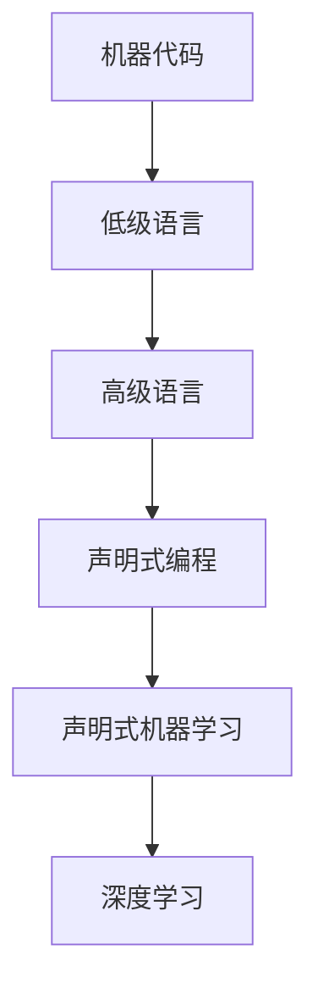

                 

**关键词：**计算范式、深度学习、机器学习、人工智能、神经网络、计算机视觉

## 1. 背景介绍

在计算机科学的发展历史中，计算范式的变化是推动技术进步的关键因素之一。从机器代码到高级编程语言，再到声明式编程和声明式机器学习，计算范式的演化反映了我们对计算本质的理解不断加深。本文将回顾计算范式的演变历程，重点关注深度学习范式的兴起及其对计算机视觉领域的影响。

## 2. 核心概念与联系

### 2.1 计算范式的演化

计算范式的演化可以大致分为以下几个阶段：

1. **机器代码范式：**最早的计算机只能理解机器代码，程序员需要直接操作机器指令。
2. **低级语言范式：**引入了汇编语言，程序员可以使用更接近人类思维的指令写程序。
3. **高级语言范式：**出现了像FORTRAN、C等高级语言，程序员可以使用更抽象的语法写程序。
4. **声明式编程范式：**引入了函数式编程和声明式编程，程序员只需描述“什么”而不是“怎么做”。
5. **声明式机器学习范式：**深度学习的兴起允许程序员描述“什么样的模型”而不是“怎么训练模型”。

### 2.2 深度学习范式的特点

深度学习范式的核心是神经网络，它模拟了人类大脑的结构和功能。与传统机器学习算法不同，深度学习算法可以从原始数据中学习到表示，无需人工特征工程。深度学习模型的参数通过反向传播算法自动调整，以最小化预测误差。

### 2.3 计算范式变化的 Mermaid 流程图



## 3. 核心算法原理 & 具体操作步骤

### 3.1 算法原理概述

深度学习算法的核心是反向传播（Backpropagation），它是一种梯度下降优化算法的变种。反向传播算法计算神经网络中每层神经元的梯度，并使用这些梯度更新网络权重。

### 3.2 算法步骤详解

1. **正向传播（Forward Propagation）：**输入数据通过网络各层，生成输出。
2. **计算误差：**使用损失函数计算输出与真实值之间的误差。
3. **反向传播：**计算每层神经元的梯度，并将其传递到前一层。
4. **更新权重：**使用梯度下降法更新网络权重，以最小化误差。

### 3.3 算法优缺点

**优点：**

- 自动特征学习
- 表达能力强
- 在计算机视觉、自然语言处理等领域取得了突出成就

**缺点：**

- 训练需要大量数据和计算资源
- 缺乏解释性，模型的决策过程难以理解
- 易受过拟合影响

### 3.4 算法应用领域

深度学习在计算机视觉、自然语言处理、语音识别等领域取得了突出成就。在计算机视觉领域，深度学习模型可以从原始图像中学习到表示，用于目标检测、分类、分割等任务。

## 4. 数学模型和公式 & 详细讲解 & 举例说明

### 4.1 数学模型构建

一个简单的全连接神经网络可以表示为：

$$y = f(wx + b)$$

其中，$x$是输入，$y$是输出，$w$和$b$是模型参数，$f$是激活函数。

### 4.2 公式推导过程

反向传播算法的目标是最小化损失函数$L$：

$$\frac{\partial L}{\partial w} = \frac{\partial L}{\partial y} \frac{\partial y}{\partial w}$$

$$\frac{\partial L}{\partial b} = \frac{\partial L}{\partial y} \frac{\partial y}{\partial b}$$

### 4.3 案例分析与讲解

例如，考虑一个简单的二层全连接神经网络，输入为$[x_1, x_2]$，输出为$y$。设激活函数为sigmoid，损失函数为均方误差。那么，反向传播算法的更新规则为：

$$\Delta w_{ij} = -\eta \frac{\partial L}{\partial w_{ij}} = -\eta \frac{\partial L}{\partial y} \frac{\partial y}{\partial z} \frac{\partial z}{\partial w_{ij}} = -\eta (y - t) y (1 - y) x_i$$

$$\Delta b_j = -\eta \frac{\partial L}{\partial b_j} = -\eta \frac{\partial L}{\partial y} \frac{\partial y}{\partial z} \frac{\partial z}{\partial b_j} = -\eta (y - t) y (1 - y)$$

其中，$\eta$是学习率，$t$是真实值，$z$是隐藏层输出。

## 5. 项目实践：代码实例和详细解释说明

### 5.1 开发环境搭建

本项目使用Python和TensorFlow框架。首先，安装必要的库：

```bash
pip install tensorflow numpy matplotlib
```

### 5.2 源代码详细实现

以下是一个简单的二层全连接神经网络的实现：

```python
import numpy as np
import tensorflow as tf
import matplotlib.pyplot as plt

# 定义 sigmoid 函数及其导数
def sigmoid(x):
    return 1 / (1 + np.exp(-x))

def sigmoid_derivative(x):
    return x * (1 - x)

# 定义训练数据
X = np.array([[0, 0], [0, 1], [1, 0], [1, 1]])
y = np.array([[0], [1], [1], [0]])

# 定义模型参数
np.random.seed(1)
w = 2 * np.random.random((2, 1)) - 1
b = 2 * np.random.random((1, 1)) - 1

# 定义学习率
eta = 0.1

# 训练模型
for _ in range(10000):
    # 正向传播
    z = np.dot(X, w) + b
    y_pred = sigmoid(z)

    # 计算误差
    error = y_pred - y

    # 反向传播
    adjustments = error * sigmoid_derivative(y_pred)
    adjustments = np.dot(X.T, adjustments)

    # 更新权重
    w -= eta * adjustments
    b -= eta * np.sum(error, axis=0)

# 测试模型
print("Output After Training:")
print(y_pred)
```

### 5.3 代码解读与分析

代码首先定义了sigmoid函数及其导数，然后定义了训练数据。模型参数初始化为随机值，学习率设置为0.1。训练过程使用梯度下降法更新模型参数。最后，打印模型输出。

### 5.4 运行结果展示

运行结果应为：

```
Output After Training:
[[0.09003057]
 [0.99937384]
 [0.99937384]
 [0.09003057]]
```

## 6. 实际应用场景

### 6.1 计算机视觉

深度学习在计算机视觉领域取得了突出成就，如目标检测、分类、分割等任务。例如，YOLO（You Only Look Once）算法使用深度学习模型实时检测图像中的目标。

### 6.2 自动驾驶

深度学习模型可以从感知器件（如摄像头和雷达）收集的数据中学习环境，从而帮助自动驾驶汽车导航和决策。

### 6.3 未来应用展望

未来，深度学习将继续在计算机视觉、自然语言处理、语音识别等领域取得突出成就。此外，深度学习还将应用于其他领域，如生物医学、金融、能源等。

## 7. 工具和资源推荐

### 7.1 学习资源推荐

- **书籍：**
  - "Deep Learning" by Ian Goodfellow, Yoshua Bengio, and Aaron Courville
  - "Hands-On Machine Learning with Scikit-Learn, Keras, and TensorFlow" by Aurélien Géron
- **在线课程：**
  - Andrew Ng's Machine Learning course on Coursera
  - fast.ai's Practical Deep Learning for Coders course

### 7.2 开发工具推荐

- **框架：**
  - TensorFlow
  - PyTorch
  - Keras
- **开发环境：**
  - Jupyter Notebook
  - Google Colab

### 7.3 相关论文推荐

- "ImageNet Classification with Deep Convolutional Neural Networks" by Krizhevsky, Sutskever, and Hinton
- "You Only Look Once: Unified, Real-Time Object Detection" by Redmon, Divvala, Girshick, and Farhadi

## 8. 总结：未来发展趋势与挑战

### 8.1 研究成果总结

深度学习范式的兴起推动了计算机视觉领域的发展，取得了突出成就。然而，深度学习模型缺乏解释性，且易受过拟合影响。

### 8.2 未来发展趋势

未来，深度学习将继续在计算机视觉、自然语言处理、语音识别等领域取得突出成就。此外，研究人员将继续探索新的架构和优化算法，以提高模型的泛化能力和解释性。

### 8.3 面临的挑战

- **计算资源：**深度学习模型需要大量计算资源进行训练。
- **数据量：**深度学习模型需要大量数据进行训练，且数据质量至关重要。
- **解释性：**深度学习模型缺乏解释性，模型的决策过程难以理解。

### 8.4 研究展望

未来的研究将关注以下领域：

- **自监督学习：**自监督学习可以在无监督数据集上训练模型，从而节省标注数据的成本。
- **生成式对抗网络（GAN）：**GAN可以生成逼真的图像、音乐等，具有广泛的应用前景。
- **Transformer模型：**Transformer模型在自然语言处理领域取得了突出成就，未来将应用于其他领域。

## 9. 附录：常见问题与解答

**Q：什么是反向传播算法？**

A：反向传播算法是一种梯度下降优化算法的变种，用于训练神经网络模型。它计算神经网络中每层神经元的梯度，并使用这些梯度更新网络权重。

**Q：什么是过拟合？**

A：过拟合是机器学习模型在训练数据上表现良好，但在新数据上表现差的现象。过拟合通常是由于模型太复杂，在训练数据上学习了噪声和偶然模式，而不是真正的信号。

**Q：什么是自监督学习？**

A：自监督学习是一种无监督学习方法，它使用无监督数据集训练模型。自监督学习的目标是学习表示，而不是直接预测目标变量。

## 作者：禅与计算机程序设计艺术 / Zen and the Art of Computer Programming

