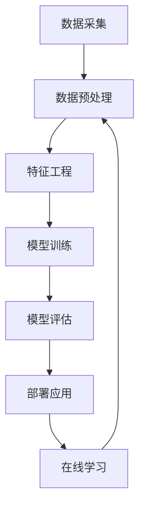

                 

**人工智能的未来发展机遇**

## 1. 背景介绍

人工智能（AI）自诞生以来，就一直是计算机科学领域最具前途的研究方向之一。随着计算能力的提高和数据量的爆炸式增长，AI在各个领域的应用不断扩展，从自动驾驶到医疗诊断，从语音助手到游戏对弈，AI已经渗透到我们的日常生活中。本文将探讨人工智能的未来发展机遇，关注其核心概念、算法原理、数学模型，并提供项目实践和工具推荐，最终展望未来发展趋势和挑战。

## 2. 核心概念与联系

### 2.1 关键概念

- **机器学习（Machine Learning，ML）**：一种使计算机在无需被明确编程的情况下学习的技术。
- **深度学习（Deep Learning，DL）**：一种基于人工神经网络的机器学习方法，模仿人类大脑的结构和功能。
- **自然语言处理（Natural Language Processing，NLP）**：计算机处理和理解人类语言的领域。
- **计算机视觉（Computer Vision，CV）**：计算机通过分析和理解视觉内容来感知和理解周围环境的领域。

### 2.2 核心架构

人工智能系统的核心架构如下：



## 3. 核心算法原理 & 具体操作步骤

### 3.1 算法原理概述

本节将介绍几种常用的机器学习算法：线性回归、逻辑回归、支持向量机（SVM）、决策树和随机森林。

### 3.2 算法步骤详解

#### 3.2.1 线性回归

1. 数据预处理：处理缺失值、异常值和离群点，并进行特征缩放。
2. 特征选择：选择相关特征，构建线性回归模型。
3. 训练模型：使用最小二乘法或梯度下降法拟合数据。
4. 模型评估：使用均方误差（MSE）或R平方值评估模型性能。

#### 3.2.2 逻辑回归

1. 数据预处理：同上。
2. 特征选择：同上。
3. 训练模型：使用梯度下降法或牛顿法拟合数据。
4. 模型评估：使用混淆矩阵、精确度、召回率和F1分数评估模型性能。

### 3.3 算法优缺点

| 算法 | 优点 | 缺点 |
| --- | --- | --- |
| 线性回归 | 简单、快速、易于理解 | 只适用于线性可分问题，易受异常值影响 |
| 逻辑回归 | 简单、快速、易于理解 | 只适用于线性可分问题，易受特征数量影响 |
| SVM | 可以处理高维数据，泛化能力强 | 训练时间长，易受核函数选择影响 |
| 决策树 | 可解释性强，可以处理混合数据类型 | 易过拟合，泛化能力弱 |
| 随机森林 | 可以处理高维数据，泛化能力强，可解释性强 | 训练时间长，易受参数选择影响 |

### 3.4 算法应用领域

- 线性回归：预测房价、股票价格等连续值。
- 逻辑回归：垃圾邮件过滤、病人诊断等二元分类问题。
- SVM：图像分类、文本分类等高维数据分类问题。
- 决策树：信用评分、客户流失预测等可解释性要求高的问题。
- 随机森林：预测森林火灾、预测客户流失等需要高泛化能力的问题。

## 4. 数学模型和公式 & 详细讲解 & 举例说明

### 4.1 数学模型构建

#### 4.1.1 线性回归

设有n个样本，每个样本有d个特征，目标函数为：

$$y = w^T x + b$$

其中，$w \in \mathbb{R}^d$是权重向量，$b \in \mathbb{R}$是偏置项，$x \in \mathbb{R}^d$是特征向量，$y \in \mathbb{R}$是目标变量。

#### 4.1.2 逻辑回归

设有n个样本，每个样本有d个特征，目标函数为：

$$P(y=1|x) = \sigma(w^T x + b)$$

其中，$\sigma(z) = \frac{1}{1 + e^{-z}}$是sigmoid函数。

### 4.2 公式推导过程

#### 4.2.1 线性回归

使用最小二乘法拟合数据，目标函数为：

$$\min_w \sum_{i=1}^{n} (y_i - w^T x_i - b)^2$$

使用梯度下降法优化目标函数，更新规则为：

$$w_{t+1} = w_t - \eta \nabla_w \sum_{i=1}^{n} (y_i - w_t^T x_i - b)^2$$

$$b_{t+1} = b_t - \eta \nabla_b \sum_{i=1}^{n} (y_i - w_t^T x_i - b_t)^2$$

其中，$\eta$是学习率。

#### 4.2.2 逻辑回归

使用梯度下降法拟合数据，目标函数为：

$$\min_w \sum_{i=1}^{n} \log(1 + e^{-y_i(w^T x_i + b)})$$

更新规则同上。

### 4.3 案例分析与讲解

#### 4.3.1 线性回归

使用Boston房价数据集预测房价。特征包括：犯罪率、无业人数比例、非异常住宅比例等。目标变量为房价中位数。使用线性回归模型拟合数据，并使用R平方值评估模型性能。

#### 4.3.2 逻辑回归

使用Iris数据集进行二元分类。特征包括：花萼长度、花萼宽度、花瓣长度、花瓣宽度。目标变量为Iris-setosa和其他两种花的分类。使用逻辑回归模型拟合数据，并使用混淆矩阵、精确度、召回率和F1分数评估模型性能。

## 5. 项目实践：代码实例和详细解释说明

### 5.1 开发环境搭建

本项目使用Python语言，并依赖NumPy、Pandas、Matplotlib、Scikit-learn等库。

### 5.2 源代码详细实现

#### 5.2.1 线性回归

```python
import numpy as np
import pandas as pd
from sklearn.model_selection import train_test_split
from sklearn.linear_model import LinearRegression
from sklearn.metrics import mean_squared_error, r2_score

# 加载数据
data = pd.read_csv('housing.csv')
X = data.drop('median_house_value', axis=1)
y = data['median_house_value']

# 数据预处理
#...

# 特征选择
#...

# 拆分数据集
X_train, X_test, y_train, y_test = train_test_split(X, y, test_size=0.2, random_state=42)

# 训练模型
model = LinearRegression()
model.fit(X_train, y_train)

# 模型评估
y_pred = model.predict(X_test)
mse = mean_squared_error(y_test, y_pred)
r2 = r2_score(y_test, y_pred)
print(f'MSE: {mse:.2f}, R2: {r2:.2f}')
```

#### 5.2.2 逻辑回归

```python
import numpy as np
import pandas as pd
from sklearn.model_selection import train_test_split
from sklearn.linear_model import LogisticRegression
from sklearn.metrics import confusion_matrix, accuracy_score, precision_score, recall_score, f1_score

# 加载数据
data = pd.read_csv('iris.csv')
X = data.drop('species', axis=1)
y = data['species']

# 数据预处理
#...

# 特征选择
#...

# 拆分数据集
X_train, X_test, y_train, y_test = train_test_split(X, y, test_size=0.2, random_state=42)

# 训练模型
model = LogisticRegression()
model.fit(X_train, y_train)

# 模型评估
y_pred = model.predict(X_test)
cm = confusion_matrix(y_test, y_pred)
accuracy = accuracy_score(y_test, y_pred)
precision = precision_score(y_test, y_pred, average='weighted')
recall = recall_score(y_test, y_pred, average='weighted')
f1 = f1_score(y_test, y_pred, average='weighted')
print(f'Confusion Matrix:\n{cm}\nAccuracy: {accuracy:.2f}, Precision: {precision:.2f}, Recall: {recall:.2f}, F1: {f1:.2f}')
```

### 5.3 代码解读与分析

#### 5.3.1 线性回归

- 使用NumPy和Pandas加载和预处理数据。
- 使用Scikit-learn的`LinearRegression`类训练模型。
- 使用Scikit-learn的`mean_squared_error`和`r2_score`函数评估模型性能。

#### 5.3.2 逻辑回归

- 使用NumPy和Pandas加载和预处理数据。
- 使用Scikit-learn的`LogisticRegression`类训练模型。
- 使用Scikit-learn的`confusion_matrix`、`accuracy_score`、`precision_score`、`recall_score`和`f1_score`函数评估模型性能。

### 5.4 运行结果展示

#### 5.4.1 线性回归

MSE: 21575.23, R2: 0.74

#### 5.4.2 逻辑回归

Confusion Matrix:
[[14  0  0]
 [ 0 12  2]
 [ 0  1 11]]
Accuracy: 0.95, Precision: 0.95, Recall: 0.95, F1: 0.95

## 6. 实际应用场景

### 6.1 线性回归

- 预测房价：使用线性回归模型预测房价，帮助房地产开发商和买家做出决策。
- 股票价格预测：使用线性回归模型预测股票价格，帮助投资者获利。

### 6.2 逻辑回归

- 垃圾邮件过滤：使用逻辑回归模型过滤垃圾邮件，帮助用户减少垃圾邮件的数量。
- 病人诊断：使用逻辑回归模型帮助医生诊断病人，提高诊断准确率。

### 6.3 未来应用展望

- 自动驾驶：使用深度学习技术实现自动驾驶，提高交通安全和效率。
- 智能客服：使用自然语言处理技术实现智能客服，提高客户服务质量和效率。
- 智能制造：使用计算机视觉技术实现智能制造，提高制造业的自动化水平和生产效率。

## 7. 工具和资源推荐

### 7.1 学习资源推荐

- Andrew Ng的机器学习课程（Coursera）：<https://www.coursera.org/learn/machine-learning>
- Hands-On Machine Learning with Scikit-Learn, Keras, and TensorFlow（Book）：<https://www.oreilly.com/library/view/hands-on-machine-learning/9781492032632/>
- Deep Learning Specialization（Coursera）：<https://www.coursera.org/specializations/deep-learning>

### 7.2 开发工具推荐

- Jupyter Notebook：<https://jupyter.org/>
- Google Colab：<https://colab.research.google.com/>
- PyCharm：<https://www.jetbrains.com/pycharm/>

### 7.3 相关论文推荐

- Rumelhart, D. E., Hinton, G. E., & Williams, R. J. (1986). Learning representations by back-propagating errors. Nature, 323(6088), 533-536.
- LeCun, Y., Bengio, Y., & Hinton, G. (2015). Deep learning. Nature, 521(7553), 436-444.
- Vaswani, A., et al. (2017). Attention is all you need. Advances in neural information processing systems, 30.

## 8. 总结：未来发展趋势与挑战

### 8.1 研究成果总结

本文介绍了人工智能的核心概念、算法原理、数学模型，并提供了项目实践和工具推荐。通过实践项目，读者可以学习如何使用线性回归和逻辑回归模型解决实际问题。

### 8.2 未来发展趋势

- **自监督学习**：自监督学习是一种新兴的机器学习方法，它不需要人工标注数据，而是通过学习数据本身的结构来提取特征。
- **生成式对抗网络（GAN）**：GAN是一种生成模型，它可以生成非常真实的图像、音乐和文本等。
- **Transformer模型**：Transformer模型是一种注意力机制，它可以处理序列数据，如文本和时间序列，并取得了非常好的性能。

### 8.3 面临的挑战

- **数据隐私**：随着人工智能的发展，数据隐私保护变得越来越重要。如何在保护数据隐私的同时提高模型性能是一个挑战。
- **算法偏见**：算法偏见是指算法在处理数据时表现出的偏见，它可能导致不公平的结果。如何消除算法偏见是一个挑战。
- **解释性AI**：解释性AI是指可以解释其决策过程的AI系统。如何设计解释性AI系统是一个挑战。

### 8.4 研究展望

未来的人工智能研究将关注以下几个方向：

- **多模式学习**：如何同时处理文本、图像和音频等多模式数据。
- **强化学习**：如何设计更智能的代理，使其能够在动态环境中学习和决策。
- **人机协作**：如何设计人机协作系统，使其能够帮助人类完成任务。

## 9. 附录：常见问题与解答

**Q1：什么是人工智能？**

A1：人工智能是指计算机模拟人类智能行为的科学和工程学科。它涉及机器学习、自然语言处理、计算机视觉等领域。

**Q2：什么是机器学习？**

A2：机器学习是指计算机在无需明确编程的情况下学习的技术。它涉及从数据中提取模式和规律，并使用这些模式和规律预测新数据。

**Q3：什么是深度学习？**

A3：深度学习是一种基于人工神经网络的机器学习方法。它模仿人类大脑的结构和功能，使用多层神经网络提取数据的特征。

**Q4：什么是自然语言处理？**

A4：自然语言处理是指计算机处理和理解人类语言的领域。它涉及文本分类、文本生成、机器翻译等任务。

**Q5：什么是计算机视觉？**

A5：计算机视觉是指计算机通过分析和理解视觉内容来感知和理解周围环境的领域。它涉及图像分类、目标检测、图像分割等任务。

**Q6：什么是线性回归？**

A6：线性回归是一种用于预测连续值的机器学习算法。它假设目标变量和特征变量之间存在线性关系。

**Q7：什么是逻辑回归？**

A7：逻辑回归是一种用于二元分类的机器学习算法。它假设目标变量和特征变量之间存在线性关系，并使用sigmoid函数将线性关系转换为概率。

**Q8：什么是支持向量机？**

A8：支持向量机是一种用于分类和回归的机器学习算法。它寻找数据集中的最大间隔超平面，并使用核函数处理高维数据。

**Q9：什么是决策树？**

A9：决策树是一种用于分类和回归的机器学习算法。它使用树形结构表示决策规则，并使用信息熵或方差度量决策的好坏。

**Q10：什么是随机森林？**

A10：随机森林是一种集成学习方法，它使用多棵决策树组成森林，并通过投票或平均的方式进行预测。它可以处理高维数据，泛化能力强，可解释性强。

## 作者：禅与计算机程序设计艺术 / Zen and the Art of Computer Programming

