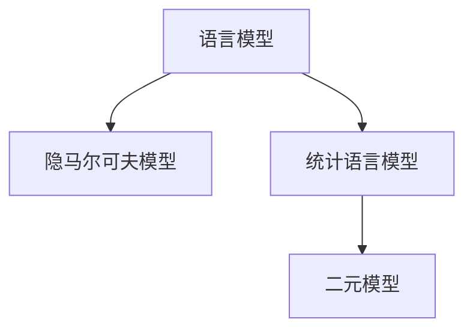

                 

# Bigram语言模型：语言建模的基础

> 关键词：语言模型, 自然语言处理(NLP), 机器学习, Bigram模型, 隐马尔可夫模型, 统计语言模型, 文本生成, 序列建模

## 1. 背景介绍

### 1.1 问题由来
在自然语言处理(Natural Language Processing, NLP)领域，语言模型作为基础技术之一，承担着评估文本序列概率、理解自然语言等关键任务。语言模型通过统计学习，预测给定上下文下一个单词或字符出现的概率，是许多NLP任务的基石。语言模型既可用于解码，如机器翻译、语音识别、文本生成；也可用于评估，如语言模型的自动评估、文本相似性计算。

为了解决语言序列建模问题，传统的语言模型一般基于统计学理论建立。其中，Bigram语言模型（二元语言模型）因其简单高效、易于实现而备受青睐。通过观察相邻单词之间的关系，Bigram模型构建了基本的文本统计特性，为后续的高级语言模型和NLP应用打下了坚实的基础。

### 1.2 问题核心关键点
Bigram模型由以下核心概念组成：

1. 语言模型（Language Model）：描述文本序列的概率分布，即给定前文条件下，下一个单词出现的概率。
2. 隐马尔可夫模型（Hidden Markov Model, HMM）：一种统计模型，用于描述序列数据的生成过程。
3. 统计语言模型（Statistical Language Model）：基于统计方法建立的模型，如Bigram、Trigram等。
4. 二元模型（Bigram Model）：仅考虑两个单词之间的相邻关系。
5. 条件概率（Conditional Probability）：在给定前文条件下，下一个单词出现的概率。

这些核心概念共同构成了Bigram模型的理论基础，使得模型能够准确预测文本序列的概率分布。

## 2. 核心概念与联系

### 2.1 核心概念概述

为更好地理解Bigram语言模型，我们首先介绍几个关键概念：

- **语言模型**：描述文本序列的概率分布，即给定前文条件下，下一个单词出现的概率。
- **隐马尔可夫模型**：一种基于状态的随机过程模型，用于描述序列数据的生成过程。
- **统计语言模型**：基于统计方法建立的模型，通过训练样本学习文本序列的概率分布。
- **二元模型**：仅考虑两个单词之间的相邻关系，是最简单的统计语言模型之一。

这些概念之间的关系可以通过以下Mermaid流程图来展示：



这个流程图展示了Bigram模型与其他语言模型和隐马尔可夫模型之间的关系：

1. **语言模型**通过**隐马尔可夫模型**或**统计语言模型**来建模文本序列的概率。
2. **二元模型**是最简单的**统计语言模型**，仅考虑相邻单词之间的概率。
3. **隐马尔可夫模型**通过状态和转移概率来建模序列数据。

## 3. 核心算法原理 & 具体操作步骤
### 3.1 算法原理概述

Bigram语言模型的核心思想是通过观察相邻单词的统计关系，建立文本序列的概率分布。在二元模型中，给定前文条件，下一个单词的概率由前一个单词决定。这一关系可以用条件概率的形式表示：

$$P(x_i | x_{i-1})$$

其中 $x_i$ 是序列中的第 $i$ 个单词，$x_{i-1}$ 是第 $i-1$ 个单词。Bigram模型假设单词序列的每个单词只依赖于前一个单词，不考虑更长的上下文信息。这种假设在处理较短的文本序列时较为合理。

### 3.2 算法步骤详解

Bigram模型的构建和训练涉及以下几个步骤：

1. **数据准备**：收集文本语料，并将其分词处理。
2. **模型初始化**：建立模型参数，如初始的概率矩阵。
3. **模型训练**：使用统计学习方法训练模型参数，更新概率矩阵。
4. **模型评估**：使用验证集评估模型性能，选择合适的参数。
5. **模型应用**：使用训练好的模型进行文本生成或序列预测。

具体步骤如下：

**Step 1: 数据准备**
- 收集文本语料，并进行分词处理，得到单词序列。
- 统计每个单词出现次数，构建单词-频率字典。

**Step 2: 模型初始化**
- 初始化概率矩阵 $P(x_i | x_{i-1})$，其中 $x_i$ 和 $x_{i-1}$ 分别是当前单词和前一个单词。
- 一般来说，可以初始化为均匀分布，表示没有先验知识。

**Step 3: 模型训练**
- 遍历文本语料，更新概率矩阵 $P(x_i | x_{i-1})$，使得每个条件概率符合实际的文本统计。
- 常用算法包括最大似然估计（Maximum Likelihood Estimation,MLE）和贝叶斯估计（Bayesian Estimation）。

**Step 4: 模型评估**
- 使用验证集计算模型在测试数据上的准确率、交叉熵等指标，评估模型性能。
- 选择合适的参数，如平滑参数（Smoothing），防止概率为0的单词出现。

**Step 5: 模型应用**
- 使用训练好的模型进行文本生成，如机器翻译、文本摘要、语音识别等任务。
- 使用模型预测给定上下文条件下一个单词，作为解码过程的一部分。

### 3.3 算法优缺点

Bigram模型的优点主要包括：

- **简单高效**：模型结构简单，易于实现和训练。
- **计算复杂度低**：仅需维护二元概率矩阵，计算复杂度较低。
- **适用于文本生成和序列预测**：在处理短文本序列时表现良好。

同时，Bigram模型也存在一些局限：

- **忽略了上下文信息**：仅考虑相邻两个单词，忽略了更多上下文信息。
- **概率估计偏差**：模型容易高估低频词的出现概率，低估高频词的概率。
- **依赖语料质量**：模型训练质量依赖于语料的质量和多样性，低质量的语料可能导致模型泛化能力差。

## 4. 数学模型和公式 & 详细讲解 & 举例说明

### 4.1 数学模型构建

Bigram模型的数学模型可以表示为：

$$P(x) = \prod_{i=1}^{n} P(x_i | x_{i-1})$$

其中 $x$ 是文本序列，$P(x_i | x_{i-1})$ 表示在给定前文 $x_{i-1}$ 条件下，单词 $x_i$ 出现的概率。模型目标是最大化上述概率的乘积。

### 4.2 公式推导过程

对上述概率进行取对数，并定义拉格朗日乘子 $\lambda_i$，引入平滑项 $S$，可以构建拉格朗日函数：

$$\mathcal{L}(\theta) = \sum_{x_{i-1}, x_i} \log P(x_i | x_{i-1}) - \sum_{i} \lambda_i (c_i - \sum_j P(x_j | x_{i-1}))$$

其中 $c_i$ 是单词 $x_i$ 在训练集中的出现次数。引入平滑项 $S$ 可以避免概率为0的情况：

$$P(x_i | x_{i-1}) = \frac{c_i + S}{\sum_j c_j + n \times S}$$

上述公式中，$S$ 的取值需要根据实际情况进行调整，如Laplace平滑、Kneser-Ney平滑等。

### 4.3 案例分析与讲解

以简单的Bigram模型为例，分析其构建和训练过程：

假设有一份英文文本，包含以下单词序列：

```
The cat in the hat.
```

首先，需要将文本分词，得到单词序列：

```
[The, cat, in, the, hat]
```

接着，统计每个单词的出现次数，得到单词-频率字典：

```
{'The': 1, 'cat': 1, 'in': 1, 'the': 1, 'hat': 1}
```

然后，初始化概率矩阵 $P(x_i | x_{i-1})$，并遍历文本序列，计算每个条件概率。例如，计算 $P(the | cat)$：

- $c_{the} = 1$，$c_{cat} = 1$
- $S = 1$（假设采用Laplace平滑）
- $P(the | cat) = \frac{1 + 1}{1 + 5 \times 1} = \frac{2}{6} = \frac{1}{3}$

最终得到Bigram模型的概率矩阵：

```
P(cat | The) = 1/3
P(the | cat) = 1/3
P(in  | the) = 1/3
P(the | in)  = 1/3
P(hat  | the) = 1/3
P(the | hat) = 1/3
```

## 5. 项目实践：代码实例和详细解释说明

### 5.1 开发环境搭建

在进行Bigram模型实践前，我们需要准备好开发环境。以下是使用Python进行Bigram模型开发的简单环境配置流程：

1. 安装Python：从官网下载并安装Python 3.8及以上版本。
2. 安装Pandas和NumPy：
```bash
pip install pandas numpy
```

### 5.2 源代码详细实现

以下是使用Python和Pandas库实现Bigram模型的简单代码示例：

```python
import pandas as pd
from collections import Counter

# 定义Bigram模型类
class BigramModel:
    def __init__(self, smoothing='laplace'):
        self.smoothing = smoothing
        self.prob_matrix = None
        
    def fit(self, text):
        # 分词
        words = text.split()
        # 统计单词出现次数
        word_count = Counter(words)
        total_words = sum(word_count.values())
        # 构建单词-频率字典
        word_freq = {word: count for word, count in word_count.items()}
        # 初始化概率矩阵
        self.prob_matrix = {word: {} for word in word_freq}
        # 遍历文本，计算条件概率
        for i in range(1, len(words)):
            word1, word2 = words[i-1], words[i]
            if word1 not in self.prob_matrix:
                self.prob_matrix[word1] = {}
            if word2 not in self.prob_matrix[word1]:
                self.prob_matrix[word1][word2] = 0
            self.prob_matrix[word1][word2] += word_count[word2]
        # 平滑处理
        for word1 in self.prob_matrix:
            for word2 in self.prob_matrix[word1]:
                count = self.prob_matrix[word1][word2]
                if count == 0:
                    if self.smoothing == 'laplace':
                        self.prob_matrix[word1][word2] = (count + 1) / (len(words) * total_words + len(self.prob_matrix[word1]))
                    else:
                        self.prob_matrix[word1][word2] = (count + 1) / (len(words) * total_words + len(self.prob_matrix[word1]))
        
    def predict(self, prefix):
        # 根据前文预测下一个单词
        prefix = prefix.split()
        result = []
        for i in range(1, len(prefix)+1):
            word = prefix[i-1]
            if word in self.prob_matrix:
                prob = max(self.prob_matrix[word].values())
                next_word = max(self.prob_matrix[word], key=lambda x: self.prob_matrix[word][x])
                result.append((next_word, prob))
        return result

# 示例文本
text = 'The cat in the hat.'
model = BigramModel()
model.fit(text)
print(model.predict('The'))
```

这段代码实现了一个简单的Bigram模型，包括模型的初始化、拟合（训练）、预测三个关键步骤。通过调用 `fit` 方法，模型将训练数据进行拟合，并得到概率矩阵。通过调用 `predict` 方法，可以根据前文预测下一个单词。

### 5.3 代码解读与分析

代码的核心在于 `fit` 方法，其通过统计单词出现次数，构建单词-频率字典，并计算每个条件概率。在计算过程中，注意平滑处理和概率矩阵的更新。平滑处理采用了Laplace平滑，这是常见的平滑策略之一。

## 6. 实际应用场景

### 6.1 文本生成

Bigram模型在文本生成方面表现优异，可以用于自动文本生成、文本摘要、机器翻译等任务。例如，在机器翻译中，Bigram模型可以用于解码过程，生成翻译结果。

### 6.2 文本分类

Bigram模型可以用于文本分类任务，如垃圾邮件过滤、情感分析等。通过训练模型，可以学习文本分类器的概率分布，从而对新的文本进行分类。

### 6.3 语言模型评估

Bigram模型可以用于评估其他语言模型的性能。通过计算模型在测试集上的交叉熵，可以衡量模型在预测单词序列的概率分布上的准确性。

### 6.4 未来应用展望

Bigram模型虽然简单，但其基本思想适用于更复杂的高阶语言模型。未来，随着计算资源和数据量的提升，Bigram模型有望在高阶语言模型中得到广泛应用。

## 7. 工具和资源推荐

### 7.1 学习资源推荐

1. 《统计语言模型》：这一经典教材系统介绍了语言模型的基本概念和统计学原理。
2. 《NLP入门：自然语言处理基础》：介绍NLP的基本概念和技术，包括Bigram模型。
3. 《Python编程语言》：学习Python语言的必备教材，是实现Bigram模型的基础。
4. 《自然语言处理综述》：综述性文章，全面介绍NLP领域的各种技术，包括Bigram模型。

### 7.2 开发工具推荐

1. Python：自然语言处理的主要编程语言，支持丰富的NLP库。
2. Pandas：数据分析和处理库，适用于构建和处理文本数据。
3. NumPy：科学计算库，适用于矩阵运算和优化计算。
4. TensorFlow和PyTorch：深度学习框架，支持高级语言模型的实现。

### 7.3 相关论文推荐

1. 《The Unreasonable Effectiveness of Recurrent Neural Networks》：介绍RNN和LSTM模型在文本序列建模中的应用。
2. 《Neural Machine Translation by Jointly Learning to Align and Translate》：介绍神经机器翻译中的注意力机制。
3. 《Neural Compression》：介绍基于神经网络的文本压缩方法。

## 8. 总结：未来发展趋势与挑战

### 8.1 总结

Bigram语言模型作为一种简单高效的语言建模方法，在NLP领域有着广泛的应用。其核心思想是通过观察相邻单词的统计关系，建立文本序列的概率分布，为更复杂的语言模型奠定了基础。通过学习Bigram模型，可以更好地理解语言建模的基本原理和实践技巧，为后续深入学习高级语言模型和NLP应用打下坚实的基础。

### 8.2 未来发展趋势

1. **模型复杂度提升**：随着计算资源和数据量的增加，未来将出现更复杂的高阶语言模型，如Trigram、Quadrigram等。
2. **模型融合技术**：将Bigram模型与其他技术融合，如深度学习、注意力机制，提升模型性能。
3. **多语言支持**：Bigram模型可以用于多语言建模，提升语言处理的泛化能力。
4. **实时处理能力**：通过优化模型计算图，提升模型实时处理能力，支持在线服务。

### 8.3 面临的挑战

1. **计算资源需求高**：高阶语言模型的计算复杂度更高，需要更多的计算资源。
2. **数据质量依赖**：模型性能依赖于高质量的训练数据，数据质量和多样性不足将影响模型性能。
3. **模型泛化能力差**：高阶语言模型更复杂，容易过拟合，泛化能力较差。

### 8.4 研究展望

1. **探索新的大规模数据**：如何利用更多、更大规模的数据，提升模型的泛化能力。
2. **优化计算复杂度**：通过优化模型计算图，降低计算复杂度，提升实时处理能力。
3. **引入先验知识**：将外部知识与模型结合，提升模型的理解能力和泛化能力。
4. **模型压缩与优化**：通过模型压缩和优化技术，提升模型效率，降低计算资源需求。

## 9. 附录：常见问题与解答

**Q1：Bigram模型适用于哪些文本序列建模任务？**

A: Bigram模型适用于短文本序列的建模任务，如机器翻译、文本生成、文本分类等。对于长文本序列，Bigram模型可能表现不佳，可以考虑使用高阶语言模型。

**Q2：如何选择合适的平滑策略？**

A: 平滑策略有多种，如Laplace平滑、Kneser-Ney平滑等。选择合适的平滑策略需要根据具体任务和数据特点进行调整。一般来说，Laplace平滑适用于小规模数据，Kneser-Ney平滑适用于大规模数据。

**Q3：Bigram模型如何处理低频词？**

A: 低频词的平滑处理是Bigram模型的关键问题之一。常见的平滑策略如Laplace平滑、Kneser-Ney平滑可以有效处理低频词。此外，可以通过数据增强、迁移学习等方法提升模型对低频词的预测能力。

**Q4：Bigram模型在实际应用中面临哪些挑战？**

A: Bigram模型在实际应用中面临计算资源需求高、数据质量依赖、模型泛化能力差等挑战。解决这些问题的关键在于选择合适的平滑策略、优化计算复杂度、引入先验知识、进行模型压缩和优化等。

**Q5：如何评估Bigram模型的性能？**

A: Bigram模型的性能评估主要通过计算模型在测试集上的交叉熵、准确率等指标来实现。在评估过程中，需要注意选择合适的评估集和评价指标，确保评估结果的公正性和可靠性。

---

作者：禅与计算机程序设计艺术 / Zen and the Art of Computer Programming

