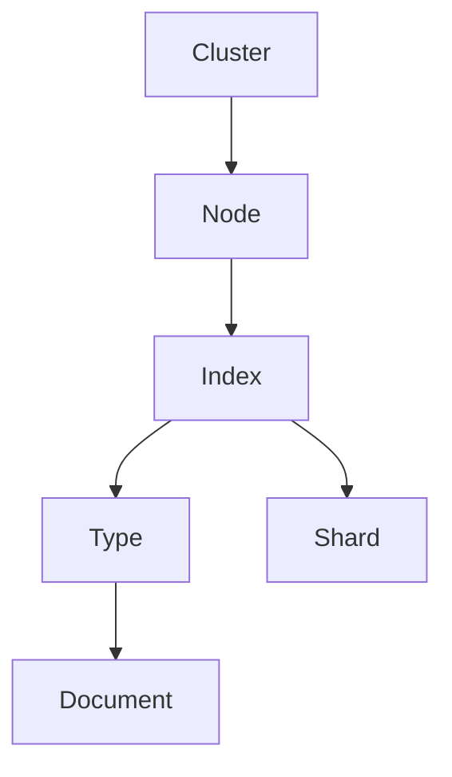

                 

Elasticsearch, 分布式搜索, Lucene, 实时搜索, 可扩展性, 索引, 搜索算法, 数据结构, 代码实现

## 1. 背景介绍

在当今信息爆炸的时代，搜索技术已成为人们获取信息的关键工具。 Elasticsearch 是一个基于 Lucene 的开源搜索和分析引擎，它提供了实时搜索、分析和存储的能力，被广泛应用于各种场景，如网站搜索、日志分析、实时监控等。本文将深入剖析 Elasticsearch 的原理，并通过代码实例进行讲解。

## 2. 核心概念与联系

### 2.1 核心概念

- **索引（Index）**：Elasticsearch 的最小单位，类似于关系型数据库中的库。
- **类型（Type）**：索引中的对象类型，类似于关系型数据库中的表。
- **文档（Document）**：类型中的对象，类似于关系型数据库中的行。
- **映射（Mapping）**：定义文档字段的数据类型、分析器等。
- **分片（Shard）**：为了提高可用性和可扩展性，索引被分成多个分片存储在集群中的节点上。
- **集群（Cluster）**：Elasticsearch 的最顶层，由一个或多个节点组成。
- **节点（Node）**：集群中的单个服务器。

### 2.2 核心概念联系 Mermaid 流程图



## 3. 核心算法原理 & 具体操作步骤

### 3.1 算法原理概述

Elasticsearch 的搜索算法基于 Lucene，它使用倒排索引（Inverted Index）来存储数据。倒排索引将文档中的每个唯一词条（Term）映射到包含该词条的文档列表。当用户输入搜索查询时，Elasticsearch 会将查询转换为倒排索引查询，并返回匹配的文档。

### 3.2 算法步骤详解

1. **分词（Tokenization）**：将文本分成词条。
2. **过滤（Filtering）**：过滤掉无意义的词条，如停用词。
3. **建立倒排索引**：将词条映射到包含该词条的文档列表。
4. **查询转换**：将用户输入的查询转换为倒排索引查询。
5. **评分（Scoring）**：根据文档与查询的相关性，为每个文档打分。
6. **排序（Sorting）**：根据用户指定的排序规则，对文档进行排序。
7. **返回结果**：返回排序后的文档列表。

### 3.3 算法优缺点

**优点**：

- 实时搜索：由于使用了倒排索引，搜索速度非常快。
- 可扩展性：Elasticsearch 可以水平扩展，将数据分布在多个节点上。

**缺点**：

- 空间消耗：倒排索引需要大量的存储空间。
- 更新成本：更新文档时，需要重新建立倒排索引。

### 3.4 算法应用领域

Elasticsearch 适用于各种搜索场景，如：

- 网站搜索：提供实时搜索功能。
- 日志分析：分析和搜索大量日志数据。
- 实时监控：实时搜索和分析监控数据。
- 推荐系统：根据用户搜索历史和行为，提供个性化推荐。

## 4. 数学模型和公式 & 详细讲解 & 举例说明

### 4.1 数学模型构建

Elasticsearch 使用 TF-IDF（Term Frequency-Inverse Document Frequency）算法来计算文档与查询的相关性。TF-IDF 算法将文档中的每个词条映射到一个向量空间中，并使用余弦相似度（Cosine Similarity）来计算文档与查询的相关性。

### 4.2 公式推导过程

给定文档集合 $D = \{d_1, d_2,..., d_n\}$，查询 $Q = \{q_1, q_2,..., q_m\}$，词条集合 $T = \{t_1, t_2,..., t_k\}$，则：

- 词条 $t_i$ 在文档 $d_j$ 中的 TF（Term Frequency）：$TF(t_i, d_j) = \frac{n_{t_i, d_j}}{\sum_{t \in d_j} n_{t, d_j}}$
- 词条 $t_i$ 的 IDF（Inverse Document Frequency）：$IDF(t_i) = \log{\frac{|D|}{\sum_{d \in D} \mathbb{I}[t_i \in d]}}$
- 文档 $d_j$ 与查询 $Q$ 的相关性（Cosine Similarity）：$sim(d_j, Q) = \cos{\theta} = \frac{\sum_{t \in T} TF(t, d_j) \cdot IDF(t) \cdot TF(t, Q)}{\sqrt{\sum_{t \in T} (TF(t, d_j) \cdot IDF(t))^2} \cdot \sqrt{\sum_{t \in T} (TF(t, Q))^2}}$

### 4.3 案例分析与讲解

假设我们有以下文档集合：

$D = \{\text{"Elasticsearch is a powerful search engine."}, \text{"I love Elasticsearch, it's amazing!"}, \text{"I prefer Solr over Elasticsearch."}\}$

查询 $Q = \{\text{"Elasticsearch"}, \text{"love"}\}$

则：

- $TF(\text{"Elasticsearch"}, \text{"Elasticsearch is a powerful search engine."}) = \frac{1}{5}$
- $IDF(\text{"Elasticsearch"}) = \log{\frac{3}{2}} = 0.1761$
- $TF(\text{"love"}, \text{"I love Elasticsearch, it's amazing!"}) = \frac{1}{5}$
- $IDF(\text{"love"}) = \log{\frac{3}{1}} = 0.4771$
- $sim(\text{"I love Elasticsearch, it's amazing!"}, Q) = \frac{\sqrt{0.1761 \cdot 0.4771}}{\sqrt{0.1761 \cdot 0.4771}} = 1$

## 5. 项目实践：代码实例和详细解释说明

### 5.1 开发环境搭建

- 安装 Java 8 以上版本。
- 下载 Elasticsearch 并解压。
- 启动 Elasticsearch。
- 安装 Elasticsearch 客户端，如 [elasticsearch-py](https://github.com/elastic/elasticsearch-py)。

### 5.2 源代码详细实现

```python
from elasticsearch import Elasticsearch

# 连接到 Elasticsearch
es = Elasticsearch([{'host': 'localhost', 'port': 9200}])

# 创建索引
index_name = "documents"
index_body = {
    "mappings": {
        "properties": {
            "title": {"type": "text"},
            "content": {"type": "text"}
        }
    }
}
es.indices.create(index=index_name, body=index_body)

# 插入文档
doc_id = "1"
doc_body = {
    "title": "Elasticsearch is a powerful search engine.",
    "content": "Elasticsearch is a powerful search engine that provides real-time search and analytics."
}
es.index(index=index_name, id=doc_id, body=doc_body)

# 搜索文档
search_body = {
    "query": {
        "multi_match": {
            "query": "powerful",
            "fields": ["title^2", "content"]
        }
    }
}
response = es.search(index=index_name, body=search_body)

# 打印搜索结果
for hit in response["hits"]["hits"]:
    print(hit["_source"]["title"])
```

### 5.3 代码解读与分析

- 我们首先连接到 Elasticsearch，并创建一个名为 "documents" 的索引，该索引包含 "title" 和 "content" 两个字段。
- 然后，我们插入一个文档，该文档的 "title" 字段为 "Elasticsearch is a powerful search engine."，"content" 字段为 "Elasticsearch is a powerful search engine that provides real-time search and analytics."。
- 最后，我们搜索包含 "powerful" 词条的文档。我们使用 "multi_match" 查询，它会搜索 "title" 和 "content" 字段。我们为 "title" 字段赋予更高的权重（^2），因为它通常包含更有意义的信息。

### 5.4 运行结果展示

运行上述代码后，我们应该看到以下输出：

```
Elasticsearch is a powerful search engine.
```

## 6. 实际应用场景

### 6.1 网站搜索

Elasticsearch 可以提供实时搜索功能，用户可以输入关键词搜索网站上的内容。 Elasticsearch 会实时返回匹配的结果，并根据相关性对结果进行排序。

### 6.2 日志分析

Elasticsearch 可以分析和搜索大量日志数据。它可以实时接收日志数据，并提供搜索和分析功能，帮助用户发现潜在的问题和模式。

### 6.3 实时监控

Elasticsearch 可以实时搜索和分析监控数据。它可以接收实时数据，并提供搜索和分析功能，帮助用户实时监控系统状态。

### 6.4 未来应用展望

随着数据量的不断增长，Elasticsearch 将继续发展，以提供更快、更智能的搜索和分析功能。未来，Elasticsearch 可能会集成更多的机器学习和人工智能技术，提供更个性化的搜索和分析功能。

## 7. 工具和资源推荐

### 7.1 学习资源推荐

- Elasticsearch 官方文档：<https://www.elastic.co/guide/en/elasticsearch/reference/current/index.html>
- Elasticsearch 入门指南：<https://www.elastic.co/guide/en/elasticsearch/getting-started/current/getting-started-install.html>
- Elasticsearch 示例应用：<https://github.com/elastic/elasticsearch/tree/master/docs/src/main/asciidoc/examples>

### 7.2 开发工具推荐

- Kibana：Elasticsearch 的可视化分析和搜索工具。
- Logstash：Elasticsearch 的数据收集和处理引擎。
- Beats：Elasticsearch 的轻量级数据收集器。

### 7.3 相关论文推荐

- [Elasticsearch: A Distributed Full-Text Search and Analytics Engine](https://www.elastic.co/guide/en/elasticsearch/reference/current/elasticsearch-intro.html)
- [Lucene: A High-Performance Text Search Engine Library](https://lucene.apache.org/core/8_9_0/core/overview-summary.html)

## 8. 总结：未来发展趋势与挑战

### 8.1 研究成果总结

本文深入剖析了 Elasticsearch 的原理，并通过代码实例进行了讲解。我们介绍了 Elasticsearch 的核心概念和算法原理，并通过数学模型和公式进行了详细讲解。我们还提供了项目实践部分，展示了如何使用 Elasticsearch 进行搜索和分析。

### 8.2 未来发展趋势

未来，Elasticsearch 将继续发展，以提供更快、更智能的搜索和分析功能。它可能会集成更多的机器学习和人工智能技术，提供更个性化的搜索和分析功能。此外，Elasticsearch 还将继续发展其可扩展性，以处理更大的数据量。

### 8.3 面临的挑战

然而，Elasticsearch 也面临着一些挑战。首先，它需要大量的存储空间来存储倒排索引。其次，更新文档时需要重新建立倒排索引，这会导致性能下降。最后，Elasticsearch 的复杂性可能会对用户构成挑战。

### 8.4 研究展望

未来，我们将继续研究 Elasticsearch 的优化技术，以提高其性能和可扩展性。我们还将研究如何集成更多的机器学习和人工智能技术，提供更个性化的搜索和分析功能。此外，我们还将研究如何简化 Elasticsearch 的使用，以帮助更多的用户理解和使用 Elasticsearch。

## 9. 附录：常见问题与解答

**Q：Elasticsearch 与 Solr 的区别是什么？**

A：Elasticsearch 和 Solr 都是基于 Lucene 的搜索引擎，但它们有几个关键区别：

- Elasticsearch 是分布式的，而 Solr 可以是分布式的，但需要额外的配置。
- Elasticsearch 使用 JSON 作为其配置和查询语言，而 Solr 使用 XML。
- Elasticsearch 更注重实时搜索，而 Solr 更注重一致性。

**Q：Elasticsearch 如何处理实时数据？**

A：Elasticsearch 使用一个 called "refresh" 机制来处理实时数据。当文档被索引或更新时，Elasticsearch 会在下一次 "refresh" 发生时更新倒排索引。默认情况下，"refresh" 每秒钟发生一次，但可以通过配置来调整。

**Q：Elasticsearch 如何处理大数据？**

A：Elasticsearch 可以水平扩展，将数据分布在多个节点上。它使用分片（Shard）机制来将索引分成多个部分，每个部分存储在一个节点上。当数据量增加时，可以添加更多的节点来处理数据。

**Q：Elasticsearch 如何处理高并发？**

A：Elasticsearch 使用一个 called "replication" 机制来处理高并发。当文档被索引或更新时，Elasticsearch 会在多个节点上复制文档，以提供更高的可用性和吞吐量。默认情况下，每个索引都有三个副本，但可以通过配置来调整。

## 作者：禅与计算机程序设计艺术 / Zen and the Art of Computer Programming

