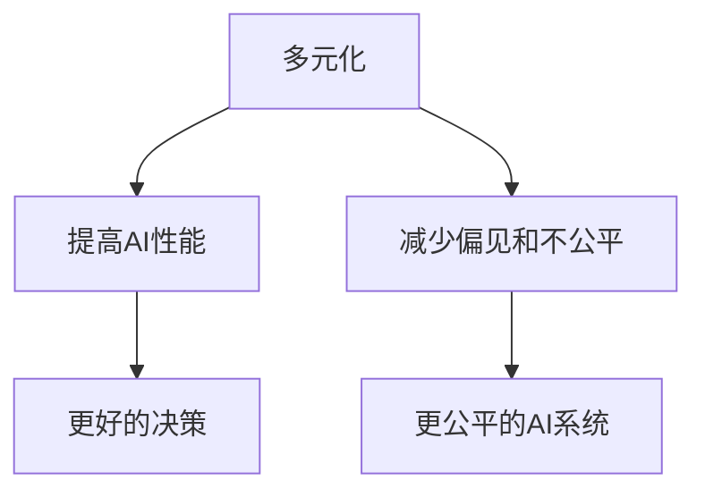

                 

**人工智能（AI）、多元化、性别平等、种族多元化、包容性、AI伦理、AI开发、AI教育**

## 1. 背景介绍

在人工智能（AI）领域，多元化是一个关键的议题。多元化不仅有助于提高AI系统的性能和可靠性，还可以帮助减少偏见和不公平现象。本文将讨论Google的AI人才多元化战略，重点关注促进性别平等和种族多元化的举措。

## 2. 核心概念与联系

### 2.1 多元化的定义

多元化是指在性别、种族、年龄、背景等方面的差异性。在AI领域，多元化意味着拥有不同背景和视角的团队共同开发AI系统。

### 2.2 多元化与AI性能

研究表明，多元化团队在创新性、决策质量和业务绩效方面表现更佳（Phillips et al., 2006）。在AI领域，多元化团队可以带来更广泛的视角，帮助发现更多的特征和模式，从而提高AI系统的性能。

### 2.3 多元化与AI伦理

多元化还可以帮助减少AI系统中的偏见和不公平现象。如果AI系统是由单一背景的人员开发的，他们可能会无意中引入偏见，因为他们缺乏其他视角的洞察（Holstein et al., 2019）。



## 3. 核心算法原理 & 具体操作步骤

### 3.1 算法原理概述

Google的AI人才多元化战略不是一个单一的算法，而是一套综合举措。这些举措旨在吸引、培养和保留来自不同背景的AI人才。

### 3.2 算法步骤详解

#### 3.2.1 吸引多元化人才

- **招聘：** Google通过各种渠道招聘AI人才，包括传统渠道和非传统渠道，如社区组织、学术会议和在线平台。
- **校园招聘：** Google与多个大学合作，提供实习机会和就业岗位，吸引更多来自不同背景的AI人才。

#### 3.2.2 培养多元化人才

- **培训：** Google提供各种培训项目，帮助员工提高技能，包括AI技能。这些培训项目旨在帮助员工发展职业生涯，并鼓励他们在AI领域做出贡献。
- **导师计划：** Google的导师计划旨在帮助员工发展职业生涯，并鼓励他们在AI领域做出贡献。导师通常来自不同背景，可以提供不同的视角和见解。

#### 3.2.3 保留多元化人才

- **包容性文化：** Google努力营造包容性文化，鼓励员工分享不同的视角和见解。这有助于吸引和保留多元化人才。
- **员工资源小组：** Google有多个员工资源小组，代表不同的背景和利益。这些小组可以帮助员工连接起来，分享经验和提供支持。

### 3.3 算法优缺点

**优点：**

- 多元化团队可以带来更广泛的视角，帮助发现更多的特征和模式，从而提高AI系统的性能。
- 多元化可以帮助减少AI系统中的偏见和不公平现象。

**缺点：**

- 吸引、培养和保留多元化人才需要时间和资源。
- 多元化团队可能需要更多的沟通和协调，以确保所有视角都得到考虑。

### 3.4 算法应用领域

Google的AI人才多元化战略适用于所有AI开发领域，包括计算机视觉、自然语言处理、机器学习等。多元化团队可以帮助发现更多的特征和模式，从而提高AI系统的性能。

## 4. 数学模型和公式 & 详细讲解 & 举例说明

### 4.1 数学模型构建

多元化的数学模型可以使用多元统计分析方法构建。例如，可以使用主成分分析（PCA）或聚类算法来分析员工的背景特征，如性别、种族、年龄等。

### 4.2 公式推导过程

假设我们有员工背景特征的数据集 $D = \{x_1, x_2,..., x_n\}$, 其中 $x_i$ 是第 $i$ 个员工的背景特征向量。我们可以使用PCA来降低维度，并发现背景特征的主要成分。

PCA的目标是找到一组新的变量（主成分），这些变量是原始变量的线性组合，并且具有最大的方差。具体来说，我们需要找到一组向量 $w_1, w_2,..., w_k$, 使得：

$$w_j = \arg\max_{w} \frac{w^T \Sigma w}{w^T w}, \quad j = 1, 2,..., k$$

其中 $\Sigma$ 是数据集 $D$ 的协方差矩阵。

### 4.3 案例分析与讲解

例如，Google可以使用PCA来分析员工的背景特征。通过PCA，Google可以发现员工背景特征的主要成分，并使用这些成分来指导多元化举措。例如，如果Google发现性别和种族是主要成分，那么Google可以针对性地开展举措，吸引、培养和保留更多的女性和少数族裔AI人才。

## 5. 项目实践：代码实例和详细解释说明

### 5.1 开发环境搭建

要实现多元化的数学模型，我们需要一个Python开发环境，并安装必要的库，如NumPy、Pandas和Scikit-learn。

### 5.2 源代码详细实现

以下是使用PCA分析员工背景特征的Python代码示例：

```python
import numpy as np
import pandas as pd
from sklearn.decomposition import PCA

# 假设我们有员工背景特征的数据集
data = {
    '性别': ['男', '女', '男', '女', '男'],
    '种族': ['白人', '亚裔', '非洲裔', '拉丁裔', '白人'],
    '年龄': [25, 30, 35, 28, 40]
}
df = pd.DataFrame(data)

# 将性别和种族编码为数值
df = pd.get_dummies(df, columns=['性别', '种族'])

# 使用PCA降低维度
pca = PCA(n_components=2)
X_pca = pca.fit_transform(df)

# 打印主成分
print("主成分：")
print(pca.components_)
```

### 5.3 代码解读与分析

在代码中，我们首先导入必要的库，并创建一个包含员工背景特征的数据框架。然后，我们使用`pd.get_dummies()`函数将性别和种族编码为数值。最后，我们使用`PCA`类来降低维度，并打印主成分。

### 5.4 运行结果展示

运行代码后，我们可以看到主成分。这些主成分可以帮助我们发现员工背景特征的主要成分，并指导多元化举措。

## 6. 实际应用场景

### 6.1 当前应用

Google的AI人才多元化战略已经在Google内部得到广泛应用。Google的AI团队已经变得更加多元化，这有助于提高AI系统的性能和可靠性，并减少偏见和不公平现象。

### 6.2 未来应用展望

未来，Google的AI人才多元化战略将继续发展，以吸引、培养和保留更多的多元化AI人才。Google还将继续努力营造包容性文化，鼓励员工分享不同的视角和见解。

## 7. 工具和资源推荐

### 7.1 学习资源推荐

- **在线课程：**  Coursera、edX和Udacity等平台上有多门AI相关课程，可以帮助学习AI技能。
- **书籍：** "人工智能：一种现代 Approach"（Artificial Intelligence: A Modern Approach）是一本广受欢迎的AI入门书籍。

### 7.2 开发工具推荐

- **Python：** Python是AI开发的流行语言，有许多库可以帮助开发AI系统。
- **TensorFlow和PyTorch：** 这些是流行的深度学习框架，可以帮助开发神经网络。

### 7.3 相关论文推荐

- Phillips, K. W., Liljenquist, K. A., & Neale, M. A. (2006). Too much of a good thing: The challenge and opportunity of demographic diversity. Academy of Management Perspectives, 20(1), 59-73.
- Holstein, K., Wortman Vaughan, J., Daumé III, H., Wallace, J. S., & Chatzimiltiadis, A. (2019). Implications of user agency in algorithmic decision-making: A study of racial bias in online recruitment. Proceedings of the 2019 CHI conference on human factors in computing systems, 1-13.

## 8. 总结：未来发展趋势与挑战

### 8.1 研究成果总结

Google的AI人才多元化战略已经取得了显著成果。Google的AI团队已经变得更加多元化，这有助于提高AI系统的性能和可靠性，并减少偏见和不公平现象。

### 8.2 未来发展趋势

未来，AI人才多元化将继续成为关键议题。随着AI技术的发展，AI系统将变得更加复杂，需要更多的视角和见解来开发和评估这些系统。

### 8.3 面临的挑战

吸引、培养和保留多元化AI人才需要时间和资源。此外，多元化团队可能需要更多的沟通和协调，以确保所有视角都得到考虑。

### 8.4 研究展望

未来的研究将关注如何更有效地吸引、培养和保留多元化AI人才。此外，研究还将关注如何使用多元化团队来开发更好的AI系统，并减少偏见和不公平现象。

## 9. 附录：常见问题与解答

**Q：多元化团队是如何帮助提高AI系统性能的？**

**A：** 多元化团队可以带来更广泛的视角，帮助发现更多的特征和模式，从而提高AI系统的性能。

**Q：多元化团队是如何帮助减少偏见和不公平现象的？**

**A：** 如果AI系统是由单一背景的人员开发的，他们可能会无意中引入偏见。多元化团队可以帮助发现和消除这些偏见。

**Q：吸引、培养和保留多元化AI人才需要多长时间？**

**A：** 吸引、培养和保留多元化AI人才需要时间和资源。这可能需要几年时间才能看到显著成果。

**作者：禅与计算机程序设计艺术 / Zen and the Art of Computer Programming**

