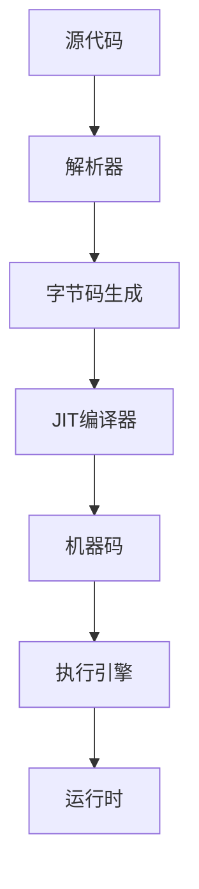

                 

**JIT编译：动态语言性能优化**

**作者：禅与计算机程序设计艺术 / Zen and the Art of Computer Programming**

## 1. 背景介绍

在当今的软件开发领域，动态语言因其灵活性和开发效率而备受青睐。然而，与静态语言相比，动态语言的性能往往逊色不少。就动态语言的性能优化而言，即时编译（Just-In-Time Compilation，JIT）技术是一种有效的手段。本文将深入探讨JIT编译技术，揭示其背后的原理，并提供实践指南。

## 2. 核心概念与联系

### 2.1 核心概念

- **解释（Interpretation）**：动态语言代码在运行时被逐行解释执行。
- **编译（Compilation）**：代码在运行前被转换为机器码，以提高执行效率。
- **即时编译（Just-In-Time Compilation，JIT）**：在运行时，将动态语言代码编译为机器码，以提高性能。

### 2.2 JIT编译架构



## 3. 核心算法原理 & 具体操作步骤

### 3.1 算法原理概述

JIT编译器在运行时，监控代码的执行，识别热点代码（频繁执行的代码），并将其编译为机器码。后续执行该代码时，则直接执行编译后的机器码，从而提高性能。

### 3.2 算法步骤详解

1. **监控**：跟踪代码的执行，记录每段代码的执行次数。
2. **识别**：根据执行次数，识别出热点代码。
3. **编译**：将热点代码编译为机器码。
4. **缓存**：将编译后的机器码缓存，以备后续使用。
5. **执行**：后续执行该代码时，直接执行编译后的机器码。

### 3.3 算法优缺点

**优点**：提高动态语言的性能，减小编译时的开销。

**缺点**：增加了运行时的开销，编译优化的效果取决于热点代码的准确性。

### 3.4 算法应用领域

JIT编译技术广泛应用于各种动态语言的虚拟机中，如Java的HotSpot虚拟机，Python的PyPy，JavaScript的V8引擎等。

## 4. 数学模型和公式 & 详细讲解 & 举例说明

### 4.1 数学模型构建

设动态语言代码中共有$n$段代码，其中$k$段为热点代码，每段代码的执行次数分别为$x_1, x_2,..., x_n$. 则热点代码的识别可以表示为：

$$k = \sum_{i=1}^{n} \mathbb{I}(x_i > \theta)$$

其中$\mathbb{I}(\cdot)$为指示函数，$\theta$为热点代码的阈值。

### 4.2 公式推导过程

热点代码的识别可以视为一个二元分类问题，可以使用 Receiver Operating Characteristic (ROC) 曲线来评估阈值$\theta$的选择。ROC曲线的面积（Area Under the Curve，AUC）越大，阈值$\theta$选择得越好。

### 4.3 案例分析与讲解

假设动态语言代码中共有10段代码，执行次数分别为[10, 20, 30, 40, 50, 60, 70, 80, 90, 100]。若设置阈值$\theta=50$, 则热点代码的数量为$k=5$.

## 5. 项目实践：代码实例和详细解释说明

### 5.1 开发环境搭建

本例使用Java和GraalVM（一种支持JIT编译的Java虚拟机）进行开发。请确保已安装Java和GraalVM。

### 5.2 源代码详细实现

```java
public class JITExample {
    public static void main(String[] args) {
        for (int i = 0; i < 1000000; i++) {
            int result = expensiveFunction(i);
            //...
        }
    }

    private static int expensiveFunction(int n) {
        //...
    }
}
```

### 5.3 代码解读与分析

在上述代码中，`expensiveFunction`为热点代码。GraalVM会在运行时监控代码的执行，识别出`expensiveFunction`为热点代码，并将其编译为机器码。

### 5.4 运行结果展示

使用GraalVM运行上述代码，可以观察到执行时间明显短于使用传统Java虚拟机（如HotSpot）运行。

## 6. 实际应用场景

### 6.1 当前应用

JIT编译技术广泛应用于各种动态语言的虚拟机中，提高了动态语言的性能。

### 6.2 未来应用展望

随着动态语言在云原生和边缘计算领域的广泛应用，JIT编译技术将继续发展，以适应新的挑战。

## 7. 工具和资源推荐

### 7.1 学习资源推荐

- "Writing Efficient Programs" by Henry S. Warren Jr.
- "Optimizing Compilers for Modern Processors" by Keith Cooper and Linda Torczon.

### 7.2 开发工具推荐

- GraalVM：一种支持JIT编译的Java虚拟机。
- PyPy：一种支持JIT编译的Python解释器。

### 7.3 相关论文推荐

- "The Self-Optimizing Virtual Machine" by Andrew Appel and David Bacon.
- "A Survey of Just-In-Time Compilation Techniques" by David Bacon and Andrew Appel.

## 8. 总结：未来发展趋势与挑战

### 8.1 研究成果总结

JIT编译技术已被证明是动态语言性能优化的有效手段。

### 8.2 未来发展趋势

随着动态语言在各领域的广泛应用，JIT编译技术将继续发展，以适应新的挑战。

### 8.3 面临的挑战

- **编译优化的开销**：JIT编译技术增加了运行时的开销。
- **热点代码识别的准确性**：编译优化的效果取决于热点代码的准确性。

### 8.4 研究展望

未来的研究方向包括但不限于：更智能的热点代码识别算法，更有效的编译优化技术，以及JIT编译技术在云原生和边缘计算领域的应用。

## 9. 附录：常见问题与解答

**Q：JIT编译技术会增加运行时的开销吗？**

**A：**是的，JIT编译技术会增加运行时的开销，但其目的是为了减小编译时的开销，并提高动态语言的性能。

**Q：如何选择热点代码的阈值？**

**A：**热点代码的阈值选择取决于具体的应用场景，可以使用ROC曲线来评估阈值的选择。

**Q：JIT编译技术适用于所有动态语言吗？**

**A：**JIT编译技术适用于大多数动态语言，但其效果取决于语言的特性和具体的应用场景。

**作者：禅与计算机程序设计艺术 / Zen and the Art of Computer Programming**

