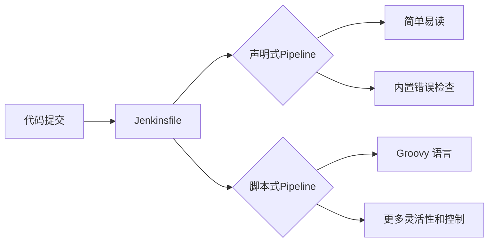
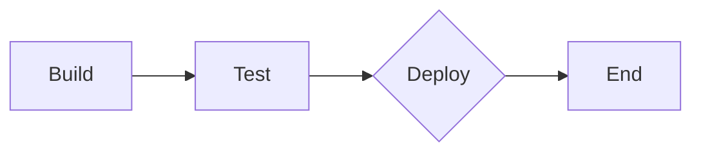

                 

持续集成（Continuous Integration），持续交付（Continuous Delivery），持续部署（Continuous Deployment），Jenkins，Pipeline，Groovy， Declarative Pipeline，Scripted Pipeline

## 1. 背景介绍

在当今快速变化的软件开发领域，持续集成（CI）已经成为一种标准实践。CI 的目标是尽快将开发人员的代码集成到主干分支中，并通过自动化测试和构建来确保代码的质量和稳定性。Jenkins 是一种流行的开源CI/CD工具，它提供了强大的功能来自动化构建、测试和部署过程。本文将重点介绍 Jenkins Pipeline，它是 Jenkins 中用于定义自动化CI/CD流水线的强大特性。

## 2. 核心概念与联系

### 2.1 Jenkins Pipeline 概念

Jenkins Pipeline 允许您使用 Groovy 语言定义一组步骤，这些步骤描述了从代码提交到部署的整个CI/CD流程。Pipeline 可以在 Jenkinsfile 中定义，该文件位于源代码控制系统中，与代码一起管理。这确保了流水线的版本控制和可追溯性。

### 2.2 Declarative vs Scripted Pipeline

Jenkins Pipeline 有两种语法：声明式（Declarative）和脚本式（Scripted）。声明式Pipeline 使用更简单、更易读写的语法，并提供了内置的错误检查和最佳实践。脚本式Pipeline 使用 Groovy 语言，提供了更多的灵活性和控制。



### 2.3 Pipeline 组件

Pipeline 由以下组件组成：

- `pipeline`: 定义整个Pipeline的根节点。
- `agent`: 指定运行Pipeline的节点或容器。
- `stages`: 定义Pipeline中的各个阶段（stage）。
- `stage`: 定义单个阶段，包含名称、输入（input）和步骤（steps）。
- `steps`: 定义在特定阶段执行的动作，如构建、测试、部署等。
- `parallel`: 允许在同一阶段中并行执行多个步骤。
- `when`: 允许根据条件执行特定的步骤或阶段。

## 3. 核心算法原理 & 具体操作步骤

### 3.1 算法原理概述

Jenkins Pipeline 的核心原理是使用 Groovy 语言定义一组步骤，这些步骤描述了CI/CD流程。Pipeline 可以在 Jenkinsfile 中定义，并由 Jenkins 读取和执行。Pipeline 的执行是有序的，每个阶段（stage）中的步骤（steps）按顺序执行。

### 3.2 算法步骤详解

#### 3.2.1 声明式Pipeline 示例

```groovy
pipeline {
    agent any

    stages {
        stage('Build') {
            steps {
                echo 'Building...'
                sh'make'
            }
        }
        stage('Test') {
            steps {
                echo 'Testing...'
                sh'make test'
            }
        }
        stage('Deploy') {
            when {
                branch'master'
            }
            steps {
                echo 'Deploying...'
                sh'make deploy'
            }
        }
    }
}
```

#### 3.2.2 脚本式Pipeline 示例

```groovy
node {
    stage('Build') {
        echo 'Building...'
        sh'make'
    }
    stage('Test') {
        echo 'Testing...'
        sh'make test'
    }
    stage('Deploy') {
        when {
            branch'master'
        }
        echo 'Deploying...'
        sh'make deploy'
    }
}
```

### 3.3 算法优缺点

**优点：**

- 版本控制：Pipeline 定义在 Jenkinsfile 中，与代码一起管理，确保了流水线的版本控制和可追溯性。
- 可读性：声明式Pipeline 使用简单易读的语法，使得 Pipeline 的定义更容易维护。
- 灵活性：脚本式Pipeline 使用 Groovy 语言，提供了更多的灵活性和控制。

**缺点：**

- 学习曲线：对于不熟悉 Groovy 语言的用户，学习 Pipeline 可能需要一些时间。
- 性能：在大型、复杂的Pipeline 中，性能可能会受到影响。

### 3.4 算法应用领域

Jenkins Pipeline 适用于任何需要自动化构建、测试和部署过程的项目。它特别适合于使用持续集成（CI）和持续交付（CD）实践的项目。

## 4. 数学模型和公式 & 详细讲解 & 举例说明

 Pipeline 的数学模型可以表示为有向图（Directed Graph），其中节点表示Pipeline中的各个阶段（stage），边表示阶段之间的顺序关系。 Pipeline 的执行可以表示为图的遍历过程。

### 4.1 数学模型构建

设 Pipeline 中有 n 个阶段，则 Pipeline 可以表示为有向图 G = (V, E)，其中 V = {v1, v2,..., vn} 是节点集合，表示 Pipeline 中的各个阶段；E 是边集合，表示阶段之间的顺序关系。

### 4.2 公式推导过程

 Pipeline 的执行可以表示为图 G 的遍历过程。设当前阶段为 vi，则下一个阶段为 vj，如果 (vi, vj) ∈ E，则 Pipeline 从 vi 遍历到 vj。 Pipeline 的执行结束条件是图 G 中所有节点都已遍历完毕。

### 4.3 案例分析与讲解

考虑以下声明式Pipeline 示例：

```groovy
pipeline {
    agent any

    stages {
        stage('Build') {
            steps {
                echo 'Building...'
                sh'make'
            }
        }
        stage('Test') {
            steps {
                echo 'Testing...'
                sh'make test'
            }
        }
        stage('Deploy') {
            when {
                branch'master'
            }
            steps {
                echo 'Deploying...'
                sh'make deploy'
            }
        }
    }
}
```

该Pipeline 可以表示为以下有向图：



在 Pipeline 的执行过程中，Jenkins 会从 Build 阶段开始，依次遍历 Test 和 Deploy 阶段，直到所有阶段都执行完毕。

## 5. 项目实践：代码实例和详细解释说明

### 5.1 开发环境搭建

要使用 Jenkins Pipeline，您需要首先安装 Jenkins，并安装 Pipeline 插件。您还需要在 Jenkins 中配置代码仓库，以便 Jenkins 可以访问 Jenkinsfile。

### 5.2 源代码详细实现

以下是一个 Jenkinsfile 示例，定义了一个简单的 Pipeline，用于构建、测试和部署一个 Java 项目：

```groovy
pipeline {
    agent any

    stages {
        stage('Checkout') {
            steps {
                git 'https://github.com/user/repo.git'
            }
        }
        stage('Build') {
            steps {
                sh'mvn clean package'
            }
        }
        stage('Test') {
            steps {
                sh'mvn test'
            }
        }
        stage('Deploy') {
            when {
                branch'master'
            }
            steps {
                sh'mvn deploy'
            }
        }
    }
}
```

### 5.3 代码解读与分析

该 Jenkinsfile 定义了一个 Pipeline，包含四个阶段：Checkout、Build、Test 和 Deploy。在 Checkout 阶段，Pipeline 从 Git 仓库检出代码。在 Build 和 Test 阶段，Pipeline 分别使用 Maven 构建和测试项目。在 Deploy 阶段，Pipeline 仅在 master 分支上执行部署操作。

### 5.4 运行结果展示

当 Jenkinsfile 中的 Pipeline 被触发时，Jenkins 会创建一个新的构建（build），并执行 Pipeline 中定义的各个阶段。您可以在 Jenkins 的 Web 界面上查看构建的状态和日志。

## 6. 实际应用场景

### 6.1 多阶段 Pipeline

在大型项目中，Pipeline 可能需要包含多个阶段，每个阶段执行特定的任务，如构建、测试、构建 Docker 映像、部署等。以下是一个示例：

```groovy
pipeline {
    agent any

    stages {
        stage('Build') {
            steps {
                sh'make'
            }
        }
        stage('Test') {
            steps {
                sh'make test'
            }
        }
        stage('Docker') {
            steps {
                sh 'docker build -t myapp:latest.'
            }
        }
        stage('Deploy') {
            when {
                branch'master'
            }
            steps {
                sh 'docker push myapp:latest'
            }
        }
    }
}
```

### 6.2 并行执行 Pipeline

在某些情况下，您可能需要在同一阶段中并行执行多个步骤。这可以使用 `parallel` 关键字实现。以下是一个示例：

```groovy
pipeline {
    agent any

    stages {
        stage('Test') {
            steps {
                parallel {
                    echo 'Running test 1...'
                    echo 'Running test 2...'
                }
            }
        }
    }
}
```

### 6.3 条件执行 Pipeline

在某些情况下，您可能需要根据条件执行特定的步骤或阶段。这可以使用 `when` 关键字实现。以下是一个示例：

```groovy
pipeline {
    agent any

    stages {
        stage('Deploy') {
            when {
                branch'master'
            }
            steps {
                echo 'Deploying...'
                sh'make deploy'
            }
        }
    }
}
```

### 6.4 未来应用展望

随着 CI/CD 的普及，Jenkins Pipeline 的应用也将变得更加广泛。未来，我们可能会看到更多的集成和自动化，如与容器化（如 Docker）和基础设施即代码（如 Terraform）的集成。此外，AI 和机器学习技术也将在 CI/CD 流程中发挥作用，帮助优化构建和部署过程。

## 7. 工具和资源推荐

### 7.1 学习资源推荐

- [Jenkins Pipeline 文档](https://www.jenkins.io/doc/pipeline/)
- [Jenkins Pipeline 示例](https://jenkins.io/doc/pipeline/examples/)
- [Jenkins Pipeline 视频教程](https://www.youtube.com/watch?v=Zs1yNdV5n4M)

### 7.2 开发工具推荐

- [IntelliJ IDEA](https://www.jetbrains.com/idea/)：一款集成开发环境（IDE），支持 Groovy 语言，可用于编写 Jenkinsfile。
- [Visual Studio Code](https://code.visualstudio.com/)：一款轻量级代码编辑器，支持 Groovy 语言和 Jenkinsfile 语法高亮。

### 7.3 相关论文推荐

- [Continuous Integration: A Software Engineering Perspective](https://www.researchgate.net/publication/237647111_Continuous_Integration_A_Software_Engineering_Perspective)
- [Continuous Delivery: Reliable Software Releases through Build, Test, and Deployment Automation](https://itrevolution.com/books/continuous-delivery/)

## 8. 总结：未来发展趋势与挑战

### 8.1 研究成果总结

本文介绍了 Jenkins Pipeline 的核心概念、算法原理、数学模型和公式，并提供了项目实践和实际应用场景。我们还推荐了相关学习资源、开发工具和论文。

### 8.2 未来发展趋势

未来，CI/CD 的应用将变得更加广泛， Jenkins Pipeline 也将随之发展。我们可能会看到更多的集成和自动化，如与容器化和基础设施即代码的集成。此外，AI 和机器学习技术也将在 CI/CD 流程中发挥作用。

### 8.3 面临的挑战

虽然 Jenkins Pipeline 提供了强大的功能，但它也面临着一些挑战。例如，学习曲线可能会阻碍某些用户采用 Pipeline。此外，在大型、复杂的Pipeline 中，性能可能会受到影响。

### 8.4 研究展望

未来的研究方向可能包括：

- 优化 Jenkins Pipeline 的性能，以支持大型、复杂的 CI/CD 流程。
- 研究 AI 和机器学习技术在 CI/CD 流程中的应用。
- 研究 Jenkins Pipeline 与其他技术（如容器化和基础设施即代码）的集成。

## 9. 附录：常见问题与解答

**Q：如何在 Jenkinsfile 中定义 Pipeline？**

A：您可以在 Jenkinsfile 中使用声明式或脚本式语法定义 Pipeline。声明式语法更简单易读，而脚本式语法提供了更多的灵活性和控制。

**Q：如何在 Pipeline 中执行并行任务？**

A：您可以使用 `parallel` 关键字在同一阶段中并行执行多个步骤。

**Q：如何在 Pipeline 中根据条件执行特定的步骤或阶段？**

A：您可以使用 `when` 关键字根据条件执行特定的步骤或阶段。

**Q：如何在 Pipeline 中定义环境变量？**

A：您可以使用 `environment` 关键字定义环境变量，并使用 `${变量名}` 语法引用变量。

**Q：如何在 Pipeline 中定义函数？**

A：您可以使用 `def` 关键字定义函数，并使用 `函数名(参数)` 语法调用函数。

**Q：如何在 Pipeline 中定义循环？**

A：您可以使用 `for` 关键字定义循环，并使用 `for (i in 0..<n) {}` 语法循环执行步骤。

**Q：如何在 Pipeline 中定义条件语句？**

A：您可以使用 `if` 关键字定义条件语句，并使用 `if (条件) {}` 语法执行步骤。

**Q：如何在 Pipeline 中定义错误处理？**

A：您可以使用 `try-catch` 语句定义错误处理，并使用 `try {}` 和 `catch (e) {}` 语法捕获和处理错误。

**Q：如何在 Pipeline 中定义输入步骤？**

A：您可以使用 `input` 关键字定义输入步骤，并使用 `input message: '消息', ok: '确定'` 语法等待用户输入。

**Q：如何在 Pipeline 中定义邮件通知？**

A：您可以使用 `ema

