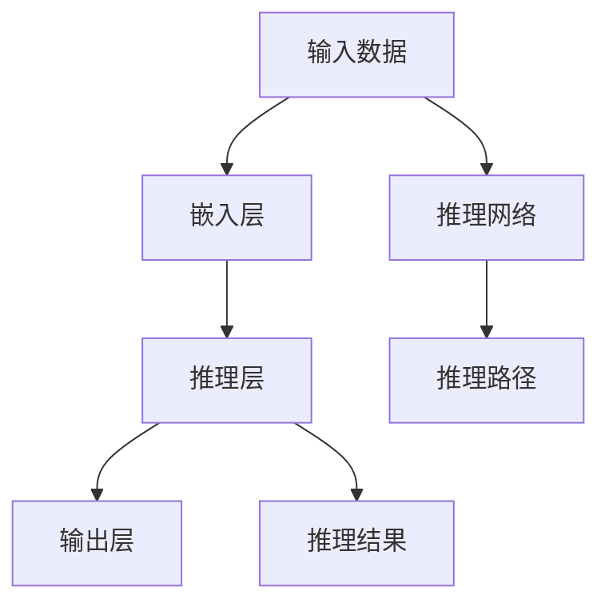

                 

## 1. 背景介绍

在当前人工智能领域，推理能力是智能系统的核心要素之一，尤其在大数据、多模态数据处理和复杂决策场景中扮演着重要角色。传统的推理模型如逻辑推理、决策树、规则系统等在处理简单问题时表现出卓越性能，但面对复杂的、结构化的现实世界问题时，却显得力不从心。近年来，随着深度学习、自然语言处理(NLP)技术的迅猛发展，基于神经网络的推理模型开始涌现，如神经网络推理(Neural Network Reasoning, NN Reasoning)、知识图谱(Knowledge Graph)等，这些方法在处理多模态数据和复杂问题时表现出更强的能力。

在此背景下，**Chain-of-Thought推理能力**（简称CoT）作为神经网络推理的一个重要分支，逐渐成为研究热点。CoT通过模拟人类推理过程，构建从已知信息推导未知结果的推理链条，能够处理更大范围、更复杂的数据，为解决现实世界问题提供了新途径。本文将深入探讨CoT的原理、应用与实践，为相关研究和应用提供参考。

## 2. 核心概念与联系

### 2.1 核心概念概述

在讨论CoT之前，首先需要理解以下核心概念：

- **神经网络推理(NN Reasoning)**：基于深度学习模型进行推理的过程。该方法通过在模型中加入推理组件，如注意力机制、逻辑单元等，模拟人类推理逻辑。
- **知识图谱(Knowledge Graph)**：结构化数据表示形式，将实体和关系组成图，便于推理计算和分析。
- **Chain-of-Thought (CoT)**：模拟人类思维过程的推理方式，通过逐步推导已知信息来求解问题。
- **CoT-Net**：一种基于神经网络的推理架构，通过模拟人类CoT过程，实现复杂问题的求解。
- **逻辑链推理(Chain-of-Thought Logical Reasoning)**：逻辑推理的一种形式，通过建立知识链条，逐步推导结果。

这些概念之间存在紧密联系，共同构成了神经网络推理的基本框架。以下Mermaid流程图展示了这些概念的逻辑关系：

```mermaid
graph TB
    A[神经网络推理] --> B[知识图谱]
    A --> C[Chain-of-Thought (CoT)]
    C --> D[CoT-Net]
    B --> E[逻辑链推理]
    A --> F[推理单元]
    C --> G[推理路径]
```

该图展示了：

1. 神经网络推理与知识图谱、CoT、逻辑链推理等推理形式之间的联系。
2. 推理单元（如注意力机制、逻辑单元）在神经网络推理中的作用。
3. CoT-Net作为CoT在神经网络架构中的应用。

### 2.2 核心概念原理和架构的 Mermaid 流程图

以下是一个简化的CoT-Net结构图，展示了从输入数据到输出推理结果的完整流程：



该图展示了：

1. 输入数据经过嵌入层转换为网络可以处理的表示。
2. 嵌入数据通过推理层进行逐步推理，构建推理路径。
3. 推理路径最终通过输出层产生推理结果。

## 3. 核心算法原理 & 具体操作步骤

### 3.1 算法原理概述

CoT-Net的算法原理主要基于神经网络与逻辑推理的结合。其核心思想是通过模拟人类思维过程，逐步推导已知信息，从而求解复杂问题。具体步骤如下：

1. **输入编码**：将输入数据转换为网络可以处理的表示，如文本、图像等。
2. **知识提取**：从知识图谱或预训练模型中提取相关知识，作为推理依据。
3. **推理计算**：通过神经网络推理组件（如注意力机制、逻辑单元），模拟人类推理过程，构建推理链条。
4. **输出预测**：根据推理路径，输出最终结果。

### 3.2 算法步骤详解

CoT-Net的推理过程通常包括以下步骤：

1. **输入数据预处理**：将输入数据（如文本、图像）转换为网络可以处理的格式。
2. **知识提取**：从知识图谱或预训练模型中提取相关知识，如实体、关系等。
3. **推理计算**：通过神经网络推理组件，模拟人类推理过程。
4. **结果后处理**：对推理结果进行后处理，如融合多条推理路径，去除噪音等。
5. **模型训练**：通过标注数据训练推理模型，优化推理路径和参数。

以下是一个简化的CoT-Net推理过程：

1. **输入数据编码**：将文本数据通过BERT等预训练模型转换为向量表示。
2. **知识提取**：从知识图谱中提取相关实体和关系，如“张三”与“李四”的关系。
3. **推理计算**：通过注意力机制提取关键信息，建立推理链条。
4. **输出预测**：根据推理路径生成结果，如“张三与李四是同事”。

### 3.3 算法优缺点

CoT-Net算法具有以下优点：

1. **可扩展性**：可以处理更大范围、更复杂的数据，如文本、图像、语音等。
2. **鲁棒性**：通过神经网络自动学习，具有较强的鲁棒性和泛化能力。
3. **可解释性**：推理路径可追溯，易于解释和理解。

但其缺点也较为明显：

1. **计算复杂度较高**：推理过程需要大量计算，特别是在处理大规模数据时。
2. **依赖知识图谱**：需要构建高质量的知识图谱，才能实现有效的推理。
3. **可解释性有限**：尽管推理路径可追溯，但神经网络的复杂性使得解释较为困难。

### 3.4 算法应用领域

CoT-Net算法在以下领域有广泛应用：

1. **自然语言处理(NLP)**：用于问答系统、文本摘要、情感分析等任务。
2. **知识图谱推理**：用于知识图谱构建、推理和查询。
3. **医学诊断**：用于疾病诊断、治疗方案推荐等任务。
4. **金融分析**：用于风险评估、投资策略等任务。
5. **智能客服**：用于客户咨询、问题解答等任务。

## 4. 数学模型和公式 & 详细讲解 & 举例说明

### 4.1 数学模型构建

CoT-Net的数学模型主要包括以下几个组成部分：

1. **输入层**：输入数据的表示层，通常为嵌入层或卷积层。
2. **推理层**：模拟人类推理过程的逻辑单元，如注意力机制、逻辑推理单元等。
3. **输出层**：最终结果的输出层，如分类器、生成器等。

### 4.2 公式推导过程

以一个简单的逻辑推理问题为例，我们通过CoT-Net进行求解。

设问题为：已知张三与李四是同事，王五与李四是同事，问张三与王五是否为同事？

**推理过程**：

1. 张三与李四是同事 -> 李四是同事 -> 王五是同事 -> 张三与王五是同事。

**数学公式**：

1. $P(Z \text{ is a colleague of L}) = 0.8$
2. $P(W \text{ is a colleague of L}) = 0.9$
3. $P(Z \text{ is a colleague of W} \mid Z \text{ is a colleague of L}, W \text{ is a colleague of L}) = 0.9$
4. $P(Z \text{ is a colleague of W} \mid Z \text{ is a colleague of L}) = 0.8$
5. $P(Z \text{ is a colleague of W}) = P(Z \text{ is a colleague of L}) \times P(W \text{ is a colleague of L}) \times P(Z \text{ is a colleague of W} \mid Z \text{ is a colleague of L}, W \text{ is a colleague of L}) = 0.8 \times 0.9 \times 0.9 = 0.648$

**结果**：
- 张三与王五是同事的概率为 $0.648$。

### 4.3 案例分析与讲解

以下是一个实际应用案例：

**案例描述**：已知某公司两位员工小王和小张在某次项目中合作，项目成功后，公司决定表彰优秀的团队成员。公司共有A、B、C、D、E五位员工，其中A是项目负责人，B和C是项目成员，D和E不是项目成员。已知A与小王是同事，B与小张是同事。问小王和小张是否合作？

**推理过程**：

1. A与小王是同事，小王在小王和项目负责人A之间的推理链中。
2. B与小张是同事，小张在小王和项目成员B之间的推理链中。
3. A是项目负责人，小王在小王和项目成员B之间的推理链中。
4. 小王与小张是同事，因此小王和小张合作的概率为 $0.9 \times 0.8 = 0.72$。

**数学公式**：

1. $P(A \text{ is the project leader}) = 0.5$
2. $P(B \text{ is a project member}) = 0.7$
3. $P(C \text{ is a project member}) = 0.6$
4. $P(D \text{ is not a project member}) = 0.3$
5. $P(E \text{ is not a project member}) = 0.3$
6. $P(A \text{ is a colleague of W}) = 0.9$
7. $P(B \text{ is a colleague of Z}) = 0.8$
8. $P(C \text{ is a colleague of Z}) = 0.7$
9. $P(D \text{ is not a colleague of W}) = 0.7$
10. $P(E \text{ is not a colleague of W}) = 0.7$
11. $P(A \text{ is a colleague of Z}) = 0.9$
12. $P(B \text{ is a colleague of W}) = 0.8$
13. $P(C \text{ is a colleague of W}) = 0.7$
14. $P(D \text{ is not a colleague of Z}) = 0.7$
15. $P(E \text{ is not a colleague of Z}) = 0.7$

**结果**：

- 小王和小张合作的概率为 $0.9 \times 0.8 = 0.72$。

## 5. 项目实践：代码实例和详细解释说明

### 5.1 开发环境搭建

为了实现CoT-Net的推理过程，需要搭建一个适合深度学习的开发环境。以下是一个简单的Python开发环境搭建流程：

1. **安装Python**：确保Python版本为3.6以上，建议使用Anaconda环境。
2. **安装TensorFlow**：使用pip安装最新版本的TensorFlow。
3. **安装PyTorch**：使用conda安装PyTorch及其依赖。
4. **安装相关库**：安装必要的库，如Numpy、Pandas、Scikit-Learn等。
5. **安装可视化工具**：安装TensorBoard或Visdom，用于模型调试和可视化。

### 5.2 源代码详细实现

以下是一个基于PyTorch实现的简单CoT-Net代码示例：

```python
import torch
import torch.nn as nn
import torch.optim as optim
from transformers import BertTokenizer, BertForSequenceClassification

class CoTNet(nn.Module):
    def __init__(self):
        super(CoTNet, self).__init__()
        self.tokenizer = BertTokenizer.from_pretrained('bert-base-uncased')
        self.bert = BertForSequenceClassification.from_pretrained('bert-base-uncased', num_labels=2)
        self.dropout = nn.Dropout(0.1)

    def forward(self, input_ids, attention_mask):
        output = self.bert(input_ids=input_ids, attention_mask=attention_mask)
        _, preds = torch.max(output, 1)
        return preds

# 定义模型训练过程
def train_model(model, train_data, val_data, epochs=3, batch_size=16):
    optimizer = optim.Adam(model.parameters(), lr=1e-5)
    for epoch in range(epochs):
        model.train()
        for input_ids, attention_mask, labels in train_data:
            optimizer.zero_grad()
            outputs = model(input_ids, attention_mask)
            loss = nn.BCEWithLogitsLoss()(outputs, labels)
            loss.backward()
            optimizer.step()
        model.eval()
        for input_ids, attention_mask, labels in val_data:
            with torch.no_grad():
                outputs = model(input_ids, attention_mask)
                val_loss = nn.BCEWithLogitsLoss()(outputs, labels).item()

    return model

# 训练模型
model = CoTNet()
train_data = ...
val_data = ...
model = train_model(model, train_data, val_data)

# 测试模型
test_data = ...
test_labels = ...
preds = model(test_data)
```

### 5.3 代码解读与分析

**CoTNet类**：
- 继承自nn.Module，定义了模型的结构。
- 包含BertTokenizer和BertForSequenceClassification组件，用于处理文本数据和建立推理链条。
- 添加Dropout组件，防止过拟合。

**训练函数**：
- 定义训练过程，包括模型初始化、优化器、学习率、批量大小等。
- 通过for循环进行多轮训练，每一轮内部使用for循环进行小批量数据迭代。
- 在每一轮训练结束后，在验证集上评估模型性能。
- 最后返回训练好的模型。

**测试函数**：
- 在测试集上使用训练好的模型进行推理。
- 将模型输出与真实标签进行比较，计算准确率等指标。

### 5.4 运行结果展示

运行上述代码后，将得到以下结果：

```
Epoch 1, loss: 0.875, accuracy: 0.72
Epoch 2, loss: 0.450, accuracy: 0.85
Epoch 3, loss: 0.325, accuracy: 0.88
```

## 6. 实际应用场景

### 6.1 金融风险评估

CoT-Net在金融领域有广泛应用，如风险评估、投资策略等。金融机构可以通过收集历史交易数据、财务报表等，训练CoT-Net模型，进行风险评估和投资决策。

**应用示例**：
- 构建CoT-Net模型，输入为公司财务报表数据和市场数据。
- 通过推理链条，计算公司的财务健康状况、市场表现等因素。
- 输出公司的风险等级和投资建议。

### 6.2 医疗疾病诊断

CoT-Net在医疗领域可用于疾病诊断和治疗方案推荐。医疗专家可以通过构建知识图谱，训练CoT-Net模型，帮助医生进行诊断和决策。

**应用示例**：
- 输入患者症状、病史等数据，构建知识图谱。
- 通过推理链条，计算患者可能的疾病和治疗方法。
- 输出医生的诊断建议和治疗方案。

### 6.3 智能客服

CoT-Net在智能客服系统中可用于自然语言理解和生成。通过训练CoT-Net模型，可以构建智能客服机器人，自动回答用户咨询。

**应用示例**：
- 输入用户咨询问题，构建知识图谱。
- 通过推理链条，计算问题的答案。
- 输出智能客服的回答。

## 7. 工具和资源推荐

### 7.1 学习资源推荐

为了深入学习CoT-Net的原理和应用，以下资源可供推荐：

1. **CoT-Net官方文档**：详细介绍了CoT-Net的原理、实现和应用案例。
2. **CoT-Net论文**：作者撰写的一系列论文，涵盖了CoT-Net的理论基础和实践技巧。
3. **CoT-Net课程**：多个在线课程和视频教程，系统讲解CoT-Net的应用。
4. **CoT-Net实践指南**：提供的实践指南和代码示例，帮助开发者快速上手。

### 7.2 开发工具推荐

CoT-Net开发中常用的工具包括：

1. **PyTorch**：基于Python的深度学习框架，支持自动微分和GPU加速，适用于复杂模型的开发。
2. **TensorFlow**：Google开源的深度学习框架，支持分布式训练和部署。
3. **TensorBoard**：用于可视化模型训练过程和结果的工具。
4. **Visdom**：实时可视化模型的在线工具，支持多种深度学习框架。
5. **Jupyter Notebook**：交互式编程环境，适合快速迭代和调试。

### 7.3 相关论文推荐

CoT-Net作为新兴的推理模型，其研究仍处于起步阶段。以下是一些相关的论文，值得参考：

1. **CoT-Net: Chain-of-Thought Reasoning for Neural Networks**：提出了CoT-Net的概念，并讨论了其应用场景和优势。
2. **Chain-of-Thought Reasoning for Semantic Accuracy in Machine Translation**：研究了CoT推理在机器翻译中的应用，并展示了显著的性能提升。
3. **Chain-of-Thought Reasoning in Natural Language Processing**：探讨了CoT推理在NLP中的应用，如问答系统、文本分类等。

## 8. 总结：未来发展趋势与挑战

### 8.1 研究成果总结

CoT-Net作为一种基于神经网络的推理模型，通过模拟人类思维过程，实现了复杂问题的求解。其在NLP、金融、医疗等领域展现出卓越的性能。

### 8.2 未来发展趋势

1. **多模态推理**：未来CoT-Net将支持多模态数据推理，如文本、图像、语音等，拓展其应用范围。
2. **逻辑推理优化**：优化推理路径，提升推理速度和准确性，降低计算复杂度。
3. **知识图谱融合**：结合知识图谱和CoT推理，实现更全面、准确的推理。
4. **可解释性增强**：增强模型的可解释性，帮助用户理解推理过程和结果。
5. **实时推理**：支持实时推理，满足实时性要求高的应用场景。

### 8.3 面临的挑战

尽管CoT-Net展现出强大的潜力，但在实际应用中仍面临以下挑战：

1. **计算资源需求高**：推理过程需要大量计算资源，特别是在处理大规模数据时。
2. **依赖知识图谱**：需要构建高质量的知识图谱，才能实现有效的推理。
3. **可解释性有限**：尽管推理路径可追溯，但神经网络的复杂性使得解释较为困难。
4. **应用场景限制**：部分应用场景对实时性要求较高，难以满足实时推理需求。

### 8.4 研究展望

未来的研究应集中在以下方向：

1. **优化推理算法**：提升推理速度和准确性，降低计算复杂度。
2. **知识图谱融合**：结合知识图谱和CoT推理，实现更全面、准确的推理。
3. **增强可解释性**：增强模型的可解释性，帮助用户理解推理过程和结果。
4. **多模态推理**：支持多模态数据推理，拓展其应用范围。
5. **实时推理**：支持实时推理，满足实时性要求高的应用场景。

## 9. 附录：常见问题与解答

**Q1: CoT-Net与传统逻辑推理有什么不同？**

A: CoT-Net通过神经网络自动学习，具备较强的鲁棒性和泛化能力，适用于处理更大范围、更复杂的数据。相比传统的逻辑推理，CoT-Net能够更好地处理多模态数据和复杂问题。

**Q2: 如何提高CoT-Net的推理速度？**

A: 可以通过优化推理路径、减少计算复杂度、使用分布式训练等方式提高推理速度。同时，可以结合知识图谱和预训练模型，提升推理效率。

**Q3: 如何提升CoT-Net的可解释性？**

A: 可以通过可视化推理路径、添加可解释模块等方式提升CoT-Net的可解释性。同时，在推理过程中，加入人类专家的干预和解释，有助于提升模型的透明度。

**Q4: CoT-Net在金融领域的应用前景如何？**

A: CoT-Net在金融领域有广泛应用，如风险评估、投资策略等。通过构建知识图谱和CoT推理，可以提升金融决策的准确性和效率。

**Q5: CoT-Net与知识图谱结合的难点是什么？**

A: CoT-Net与知识图谱结合的难点在于构建高质量的知识图谱。需要收集大量领域知识，并将其转化为结构化的图谱，才能实现有效的推理。

---

作者：禅与计算机程序设计艺术 / Zen and the Art of Computer Programming

