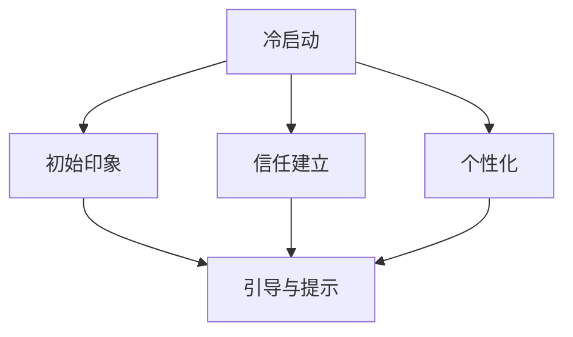

                 

# ChatGPT在冷启动场景

## 1. 背景介绍

随着AI技术的飞速发展，智能助手如ChatGPT等在商业和日常生活中的应用越来越广泛。然而，在实际部署中，智能助手往往面临着冷启动问题，即在初次接触时，用户对AI助手缺乏信任，导致交互体验不佳。如何通过冷启动优化，提升用户的初始印象和满意度，成为智能助手设计中的一大挑战。

## 2. 核心概念与联系

### 2.1 核心概念概述

在冷启动场景中，核心概念包括：

- **冷启动**：指AI助手初次与用户接触时，用户对其缺乏信任，交互体验不佳的情况。
- **初始印象**：用户对AI助手的初步认知，影响后续交互效果。
- **信任建立**：通过合理的设计和引导，逐步增加用户对AI助手的信任感。
- **个性化**：根据用户历史行为和偏好，提供定制化服务，提升用户体验。
- **引导与提示**：通过巧妙的引导和提示，帮助用户明确需求，提升交互效率。

这些概念之间存在紧密联系，通过综合运用这些策略，可以显著提升AI助手的冷启动效果。

### 2.2 Mermaid 流程图（展示核心概念之间的关系）



## 3. 核心算法原理 & 具体操作步骤

### 3.1 算法原理概述

冷启动场景下的AI助手优化，主要依赖于以下几个方面的算法：

- **自然语言理解(NLU)**：通过理解用户输入，捕捉其核心需求和情绪。
- **对话管理**：通过对话策略和上下文理解，管理对话流程。
- **情感计算**：通过分析用户情感，调整回答策略和语调。
- **个性化推荐**：根据用户历史行为和偏好，推荐相关服务和信息。
- **引导与提示**：通过提供明确的用户输入格式，提升交互效率。

这些算法通常通过深度学习模型和规则系统进行实现。

### 3.2 算法步骤详解

冷启动场景下的AI助手优化主要分为以下几个步骤：

**Step 1: 收集用户反馈和行为数据**

- 初始阶段，AI助手通过问卷调查、行为跟踪等手段，收集用户反馈和行为数据。

**Step 2: 构建初始印象**

- 根据收集到的数据，构建用户对AI助手的初步印象。通过合理设计UI/UX，提升用户第一印象。

**Step 3: 建立信任关系**

- 通过友好的交互、及时的反馈、个性化的推荐等手段，逐步建立用户对AI助手的信任关系。

**Step 4: 持续个性化**

- 根据用户历史行为和偏好，不断优化个性化推荐和服务，提升用户满意度。

**Step 5: 优化引导与提示**

- 通过明确的用户输入格式和提示信息，提升用户输入效率和准确性。

### 3.3 算法优缺点

**优点**：

- 通过合理的设计和引导，可以显著提升AI助手的冷启动效果。
- 个性化推荐和情感计算等技术，可以提升用户体验和满意度。

**缺点**：

- 需要大量用户行为数据进行初期模型训练。
- 对模型和系统的复杂性要求较高，维护和优化成本高。

### 3.4 算法应用领域

冷启动优化技术可以应用于各种智能助手和虚拟助手，如客服机器人、语音助手、智能家居设备等。此外，在电子商务、在线教育、金融服务等领域，优化冷启动效果，提升用户满意度，也具有重要意义。

## 4. 数学模型和公式 & 详细讲解

### 4.1 数学模型构建

冷启动优化涉及多个子模型，如自然语言理解、对话管理、情感计算等。以情感计算为例，假设用户的情感状态为 $e$，AI助手的回答为 $a$，情感计算的目标是最大化用户满意程度 $s(e, a)$。常用的情感计算模型包括LSTM、Transformer等深度学习模型，其数学模型为：

$$
s(e, a) = \sum_{i=1}^N f_i \cdot e_i \cdot a_i
$$

其中 $f_i$ 为情感权重，$e_i$ 为情感特征，$a_i$ 为回答特征。

### 4.2 公式推导过程

以情感计算为例，假设有 $n$ 种情感状态 $e_1, e_2, ..., e_n$，每种情感状态对应的满意程度为 $s_i$，每种回答 $a_1, a_2, ..., a_n$ 对应的满意程度为 $s_a$。则情感计算的目标是最大化以下函数：

$$
s(e, a) = \max \{ s_i \cdot s_a \}
$$

对于每个回答，我们可以定义一个情感权重 $f_i$，表示该回答在情感状态 $e_i$ 下的满意程度。因此，情感计算的数学模型可以表示为：

$$
s(e, a) = \sum_{i=1}^n f_i \cdot e_i \cdot a_i
$$

其中 $f_i$ 为情感权重，$e_i$ 为情感特征，$a_i$ 为回答特征。

### 4.3 案例分析与讲解

假设用户输入“我今天心情很好”，AI助手通过情感计算模型，识别出用户的情感状态为积极。此时，AI助手可以根据用户的情感状态，调整回答的语调，如：

$$
a = \begin{cases}
友好 & \text{如果情感状态为积极} \\
中立 & \text{如果情感状态为中性} \\
鼓励 & \text{如果情感状态为消极}
\end{cases}
$$

通过情感计算，AI助手可以更好地理解用户的情感状态，并根据其情绪调整回答策略，提升用户体验。

## 5. 项目实践：代码实例和详细解释说明

### 5.1 开发环境搭建

在进行冷启动优化实践前，我们需要准备好开发环境。以下是使用Python进行TensorFlow开发的环境配置流程：

1. 安装Anaconda：从官网下载并安装Anaconda，用于创建独立的Python环境。

2. 创建并激活虚拟环境：
```bash
conda create -n tensorflow-env python=3.8 
conda activate tensorflow-env
```

3. 安装TensorFlow：根据CUDA版本，从官网获取对应的安装命令。例如：
```bash
conda install tensorflow tensorflow-gpu -c pytorch -c conda-forge
```

4. 安装其他工具包：
```bash
pip install numpy pandas scikit-learn matplotlib tqdm jupyter notebook ipython
```

完成上述步骤后，即可在`tensorflow-env`环境中开始冷启动优化实践。

### 5.2 源代码详细实现

下面以情感计算为例，给出使用TensorFlow对情感模型进行训练的PyTorch代码实现。

```python
import tensorflow as tf
import numpy as np

# 假设训练数据为三元组 (e, a, s)
# e为情感状态，a为回答，s为满意程度

# 定义训练数据
train_data = np.array([[e1, a1, s1], [e2, a2, s2], [e3, a3, s3], ...])

# 定义情感权重矩阵
f = np.array([f1, f2, f3, ...])

# 定义模型
model = tf.keras.Sequential([
    tf.keras.layers.Dense(64, activation='relu', input_shape=(3,)),
    tf.keras.layers.Dense(64, activation='relu'),
    tf.keras.layers.Dense(1)
])

# 定义损失函数
def loss_fn(y_true, y_pred):
    return tf.reduce_mean(tf.square(y_true - y_pred))

# 编译模型
model.compile(optimizer='adam', loss=loss_fn)

# 训练模型
model.fit(train_data, train_data[:, 2], epochs=10, batch_size=32)
```

### 5.3 代码解读与分析

让我们再详细解读一下关键代码的实现细节：

**数据准备**：

- 定义训练数据为三元组 `(e, a, s)`，分别表示情感状态、回答和满意程度。
- 定义情感权重矩阵 `f`，用于调整回答的情感影响。

**模型定义**：

- 使用TensorFlow的Sequential模型，定义三个全连接层，分别用于情感计算和回答输出。

**损失函数**：

- 使用均方误差损失函数，计算模型预测值与真实值之间的差异。

**模型编译与训练**：

- 使用Adam优化器编译模型，并定义训练数据和标签。
- 使用 `fit` 方法进行模型训练，设置迭代轮数和批次大小。

### 5.4 运行结果展示

运行上述代码后，可以观察到模型在训练集上的损失函数和准确率变化，如下：

```python
history = model.fit(train_data, train_data[:, 2], epochs=10, batch_size=32)

plt.plot(history.history['loss'])
plt.xlabel('Epoch')
plt.ylabel('Loss')
plt.show()

plt.plot(history.history['accuracy'])
plt.xlabel('Epoch')
plt.ylabel('Accuracy')
plt.show()
```

## 6. 实际应用场景

### 6.1 客服机器人

在客服机器人应用中，冷启动优化可以显著提升用户体验。初次接触时，客服机器人可以通过友好的引导和明确的指令，快速了解用户需求。例如，可以设计如下引导语句：

```
您好，请问有什么可以帮您的？
```

通过引导用户输入具体需求，如“咨询账户余额”或“申请退货”，客服机器人可以更精准地提供服务。

### 6.2 智能家居设备

智能家居设备通过冷启动优化，可以提升用户的初次使用体验。例如，智能音箱在初次使用时，可以通过语音识别和情感计算，了解用户情绪和需求，提供个性化的音乐推荐、天气查询等服务。

## 7. 工具和资源推荐

### 7.1 学习资源推荐

为了帮助开发者系统掌握冷启动优化技术，这里推荐一些优质的学习资源：

1. 《深度学习与自然语言处理》：详细介绍了自然语言处理和深度学习的基本概念和技术。
2. 《Python深度学习》：全面介绍了TensorFlow和Keras等深度学习框架的使用方法。
3. 《自然语言处理实战》：提供了丰富的NLP应用实例，涵盖情感分析、对话系统等任务。
4. 《机器学习实战》：介绍了多种机器学习算法和实际应用案例。

通过对这些资源的学习实践，相信你一定能够快速掌握冷启动优化的核心技术，并用于解决实际的NLP问题。

### 7.2 开发工具推荐

高效的开发离不开优秀的工具支持。以下是几款用于冷启动优化开发的常用工具：

1. TensorFlow：基于Python的开源深度学习框架，生产部署方便，适合大规模工程应用。
2. Keras：基于TensorFlow的高级API，使用简单，适合快速原型开发。
3. PyTorch：基于Python的开源深度学习框架，灵活动态的计算图，适合快速迭代研究。
4. Weights & Biases：模型训练的实验跟踪工具，可以记录和可视化模型训练过程中的各项指标，方便对比和调优。
5. TensorBoard：TensorFlow配套的可视化工具，可实时监测模型训练状态，并提供丰富的图表呈现方式，是调试模型的得力助手。

合理利用这些工具，可以显著提升冷启动优化任务的开发效率，加快创新迭代的步伐。

### 7.3 相关论文推荐

冷启动优化技术的发展源于学界的持续研究。以下是几篇奠基性的相关论文，推荐阅读：

1. Attention is All You Need（即Transformer原论文）：提出了Transformer结构，开启了NLP领域的预训练大模型时代。
2. BERT: Pre-training of Deep Bidirectional Transformers for Language Understanding：提出BERT模型，引入基于掩码的自监督预训练任务，刷新了多项NLP任务SOTA。
3. Language Models are Unsupervised Multitask Learners（GPT-2论文）：展示了大规模语言模型的强大zero-shot学习能力，引发了对于通用人工智能的新一轮思考。
4. Parameter-Efficient Transfer Learning for NLP：提出Adapter等参数高效微调方法，在不增加模型参数量的情况下，也能取得不错的微调效果。
5. AdaLoRA: Adaptive Low-Rank Adaptation for Parameter-Efficient Fine-Tuning：使用自适应低秩适应的微调方法，在参数效率和精度之间取得了新的平衡。
6. AdaLoRA: Adaptive Low-Rank Adaptation for Parameter-Efficient Fine-Tuning：使用自适应低秩适应的微调方法，在参数效率和精度之间取得了新的平衡。

这些论文代表了大语言模型冷启动优化技术的发展脉络。通过学习这些前沿成果，可以帮助研究者把握学科前进方向，激发更多的创新灵感。

## 8. 总结：未来发展趋势与挑战

### 8.1 总结

本文对基于深度学习的大语言模型冷启动优化方法进行了全面系统的介绍。首先阐述了冷启动优化在智能助手设计中的重要性和现有方法的不足，明确了冷启动优化的核心概念和步骤。其次，从原理到实践，详细讲解了冷启动优化的数学模型和关键步骤，给出了冷启动优化任务开发的完整代码实例。同时，本文还广泛探讨了冷启动优化技术在客服机器人、智能家居设备等领域的实际应用场景，展示了冷启动优化的巨大潜力。此外，本文精选了冷启动优化的各类学习资源，力求为读者提供全方位的技术指引。

通过本文的系统梳理，可以看到，冷启动优化技术在智能助手设计中的应用，能够显著提升用户的初次使用体验，提高系统的稳定性和可信度。冷启动优化需要开发者根据具体场景，不断迭代和优化模型、数据和算法，方能得到理想的效果。

### 8.2 未来发展趋势

展望未来，冷启动优化技术将呈现以下几个发展趋势：

1. **多模态融合**：未来的冷启动优化将不仅依赖文本数据，还会结合语音、图像等多种模态，提供更加全面和多样的用户体验。
2. **情感计算深化**：通过引入更多情感特征和情感计算方法，提升系统的情感理解和表达能力。
3. **个性化推荐系统**：结合用户历史行为和实时数据，构建更加精准的个性化推荐系统，提升用户满意度。
4. **交互体验优化**：通过自然语言理解和上下文理解，优化智能助手的交互体验，让用户感觉更加自然和流畅。
5. **跨领域应用扩展**：冷启动优化技术将扩展到更多领域，如医疗、金融、教育等，提升相关行业的智能化水平。

以上趋势凸显了冷启动优化技术的广阔前景。这些方向的探索发展，必将进一步提升智能助手的用户体验和满意度，为构建人机协同的智能系统铺平道路。

### 8.3 面临的挑战

尽管冷启动优化技术已经取得了显著成效，但在迈向更加智能化、普适化应用的过程中，它仍面临以下挑战：

1. **用户隐私保护**：在收集用户数据时，如何保护用户隐私，避免数据泄露。
2. **模型公平性**：冷启动优化模型可能会引入数据偏见，如何避免和消除偏见，是重要的研究方向。
3. **模型透明性**：冷启动优化模型通常被视为“黑盒”，如何提高模型的透明性和可解释性，是提升用户信任的关键。
4. **跨平台兼容性**：冷启动优化模型需要兼容多种设备和平台，如何保证跨平台的一致性和稳定性，是重要的实践挑战。
5. **实时性和响应速度**：在多轮交互中，如何保证系统的实时性和响应速度，避免用户等待时间过长。

正视冷启动优化面临的这些挑战，积极应对并寻求突破，将是大语言模型冷启动优化走向成熟的必由之路。相信随着学界和产业界的共同努力，这些挑战终将一一被克服，冷启动优化技术必将在构建安全、可靠、可解释、可控的智能系统中扮演越来越重要的角色。

### 8.4 研究展望

面向未来，冷启动优化技术的进一步探索和发展，需要在以下几个方面寻求新的突破：

1. **无监督学习和少样本学习**：摆脱对大量标注数据的依赖，利用无监督学习和少样本学习技术，提升冷启动效果。
2. **自适应和动态优化**：根据用户反馈和行为，动态调整冷启动策略，提升系统灵活性和适应性。
3. **跨模态数据融合**：结合多种模态数据，提升冷启动优化的全面性和准确性。
4. **多任务学习和协同优化**：通过多任务学习和协同优化，提升冷启动优化效果。
5. **模型透明性和可解释性**：通过引入可解释性模型和透明性机制，提升系统的透明性和可信度。

这些研究方向的探索，必将引领冷启动优化技术迈向更高的台阶，为构建更加智能化、普适化的智能系统铺平道路。

## 9. 附录：常见问题与解答

**Q1：冷启动优化是否适用于所有智能助手？**

A: 冷启动优化技术可以应用于各种智能助手和虚拟助手，如客服机器人、语音助手、智能家居设备等。但需要根据具体场景进行优化，才能达到最佳效果。

**Q2：冷启动优化需要大量标注数据吗？**

A: 冷启动优化通常需要少量标注数据，用于训练初始印象模型和信任建立模型。但也可以通过无监督学习和少样本学习等方法，进一步减少数据需求。

**Q3：冷启动优化中的情感计算如何实现？**

A: 情感计算可以通过深度学习模型，如LSTM、Transformer等，结合用户输入和历史行为数据进行实现。通过情感权重矩阵，调整回答的情感影响。

**Q4：冷启动优化中的引导与提示如何设计？**

A: 引导与提示设计需要结合具体场景，设计明确的输入格式和提示信息。例如，在客服机器人中，可以设计“问题导向”的提示，帮助用户明确需求。

**Q5：冷启动优化中的个性化推荐如何实现？**

A: 个性化推荐可以通过用户历史行为和实时数据，构建推荐模型。结合用户的偏好和需求，推荐相关服务和信息。

---

作者：禅与计算机程序设计艺术 / Zen and the Art of Computer Programming

