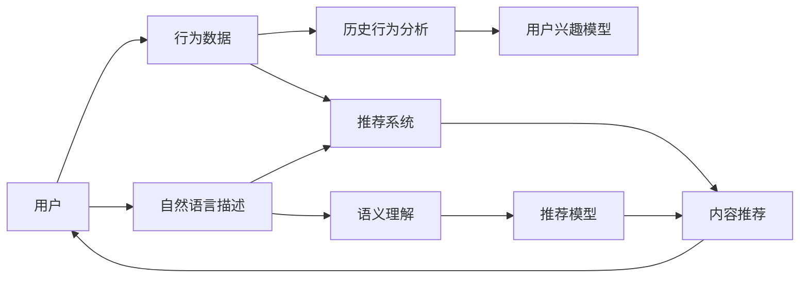

                 

# ChatGPT在推荐系统的表现：冷启动场景的优势与局限

> 关键词：
1. 推荐系统
2. 冷启动
3. 自然语言处理
4. 深度学习
5. 语义理解
6. 个性化推荐
7. 生成式模型

## 1. 背景介绍

推荐系统（Recommender Systems）已经成为互联网平台不可或缺的核心功能之一。通过推荐系统，用户可以方便地发现自己感兴趣的内容，平台则能提升用户留存率和互动性。传统的推荐算法包括基于协同过滤、矩阵分解等方法，但这些方法依赖大量用户历史数据，在冷启动场景下难以发挥作用。近年来，大语言模型（如ChatGPT）在推荐系统中得到了越来越多的应用，尤其是在冷启动场景下表现优异。本文将从多个维度探讨ChatGPT在推荐系统中的应用，分析其优势与局限，为未来研究与实践提供参考。

## 2. 核心概念与联系

### 2.1 核心概念概述

**推荐系统**：通过分析用户的历史行为和兴趣，为用户推荐合适的内容的系统。常见的推荐方式包括基于内容的推荐、协同过滤、矩阵分解等。

**冷启动问题**：推荐系统在新用户或新商品上线时，由于缺乏用户行为数据，无法为其提供个性化推荐。

**自然语言处理（NLP）**：研究如何让计算机理解和生成人类语言的技术，包括词法分析、句法分析、语义理解、情感分析等。

**深度学习**：一类利用多层神经网络进行模式识别的机器学习方法。

**生成式模型**：能够从已知数据中学习并生成新数据的模型，如GPT、Transformer等。

**语义理解**：理解文本中词语和句子的意义，进行信息检索、文本分类、情感分析等任务。

**个性化推荐**：根据用户的历史行为和当前兴趣，推荐个性化的内容。

**大语言模型（如ChatGPT）**：通过大规模无标签文本数据预训练，具备强大的语言理解和生成能力，能够在多任务上表现出色。

### 2.2 核心概念原理和架构的 Mermaid 流程图



该图展示了推荐系统的一般流程。用户提供行为数据和自然语言描述，推荐系统通过历史行为分析、语义理解等技术，构建用户兴趣模型和推荐模型，最终为用户推荐内容。在大语言模型（如ChatGPT）的帮助下，推荐系统能够处理更丰富的用户描述和复杂的内容表示，提升推荐效果。

## 3. 核心算法原理 & 具体操作步骤

### 3.1 算法原理概述

ChatGPT在推荐系统中的应用，主要依赖其强大的自然语言处理能力和生成式模型的优势。ChatGPT通过大规模预训练，能够学习到丰富的语言知识，在冷启动场景下可以充分利用用户输入的自然语言描述，生成个性化的推荐内容。具体来说，ChatGPT在推荐系统中的应用包括以下几个步骤：

1. 用户提供自然语言描述。用户通过输入自然语言描述，表达自己的兴趣和需求。

2. 预训练语言模型进行语义理解。ChatGPT通过预训练语言模型（如GPT系列）对用户输入的自然语言描述进行语义理解，提取出关键词和上下文信息。

3. 生成推荐内容。根据用户的自然语言描述，ChatGPT生成符合用户兴趣的推荐内容，如商品、文章、视频等。

4. 推荐系统集成推荐结果。推荐系统将ChatGPT生成的推荐内容与用户历史行为分析结果结合，生成最终的推荐结果。

### 3.2 算法步骤详解

#### 3.2.1 用户输入自然语言描述

用户可以通过各种方式输入自然语言描述，如文本、语音、图像等。这些输入会经过分词、句子切分、词性标注等预处理步骤，转换为结构化的向量表示，方便后续处理。

#### 3.2.2 预训练语言模型的语义理解

ChatGPT使用预训练语言模型对用户输入的自然语言描述进行语义理解。具体来说，可以采用以下步骤：

1. 分词和句子切分：将用户输入的文本进行分词和句子切分，转换为词语序列。

2. 词向量表示：使用预训练语言模型（如Word2Vec、GloVe等）将词语序列转换为向量表示。

3. 上下文理解：通过Transformer等架构，理解词语之间的上下文关系，提取关键信息。

4. 向量拼接：将各个词语的向量表示拼接起来，得到最终的语义向量。

#### 3.2.3 生成推荐内容

根据用户的自然语言描述和语义向量，ChatGPT生成符合用户兴趣的推荐内容。具体来说，可以采用以下步骤：

1. 生成模型选择：选择合适的生成模型（如GPT、Transformer等），进行生成任务。

2. 输入预处理：将用户的语义向量作为生成模型的输入，进行预处理。

3. 生成推荐内容：生成模型根据输入向量生成推荐内容，如商品、文章、视频等。

4. 后处理：对生成的推荐内容进行后处理，如去除重复内容、排序等。

#### 3.2.4 推荐系统集成推荐结果

推荐系统将ChatGPT生成的推荐内容与用户历史行为分析结果结合，生成最终的推荐结果。具体来说，可以采用以下步骤：

1. 用户行为分析：分析用户的历史行为数据，构建用户兴趣模型。

2. 模型集成：将ChatGPT生成的推荐内容与用户兴趣模型结合，生成最终推荐结果。

3. 推荐展示：将推荐结果展示给用户，根据用户反馈进行调整。

### 3.3 算法优缺点

#### 3.3.1 优点

1. 语义理解能力强：ChatGPT能够理解用户输入的自然语言描述，提取关键信息，进行推荐。

2. 生成内容质量高：ChatGPT生成的推荐内容质量较高，能够满足用户的个性化需求。

3. 冷启动效果好：在冷启动场景下，ChatGPT能够根据用户的自然语言描述进行推荐，弥补用户历史行为数据不足的问题。

4. 适用范围广：ChatGPT可以应用于多种类型的推荐系统，如电商推荐、内容推荐等。

#### 3.3.2 缺点

1. 生成内容质量不稳定：由于生成模型的随机性，生成的推荐内容质量可能不稳定。

2. 计算资源消耗大：生成模型需要较大的计算资源，可能影响系统的性能。

3. 用户反馈难以处理：用户对推荐内容的不满意反馈难以及时处理，可能影响推荐效果。

4. 泛化能力不足：ChatGPT在特定领域的应用效果可能受到限制，泛化能力不足。

### 3.4 算法应用领域

ChatGPT在推荐系统中的应用主要集中在以下几个领域：

1. 电商推荐：ChatGPT能够根据用户输入的自然语言描述，生成符合用户兴趣的商品推荐。

2. 内容推荐：ChatGPT可以用于生成文章、视频、音乐等内容的推荐。

3. 知识图谱推荐：ChatGPT能够根据用户输入的自然语言描述，生成与知识图谱相关的推荐内容。

4. 个性化推荐：ChatGPT可以应用于多种类型的个性化推荐系统，如新闻推荐、电影推荐等。

5. 问答推荐：ChatGPT可以用于生成问答类内容的推荐，提升用户的互动体验。

6. 社交推荐：ChatGPT可以用于生成社交类内容的推荐，如朋友推荐、话题推荐等。

## 4. 数学模型和公式 & 详细讲解 & 举例说明

### 4.1 数学模型构建

在推荐系统中，ChatGPT的应用主要涉及以下几个数学模型：

1. 用户兴趣模型：通过用户历史行为数据和自然语言描述，构建用户兴趣模型。

2. 推荐内容模型：通过预训练语言模型，生成推荐内容。

3. 推荐结果模型：将用户兴趣模型和推荐内容模型结合，生成推荐结果。

### 4.2 公式推导过程

#### 4.2.1 用户兴趣模型

用户兴趣模型可以通过多种方式构建，如协同过滤、矩阵分解等。这里以协同过滤为例，推导用户兴趣模型的公式：

1. 协同过滤：假设用户$u$对商品$i$的评分$R_{ui}$，可以通过协同过滤方法得到用户$u$的兴趣向量$V_u$和商品$i$的兴趣向量$V_i$。

2. 向量表示：将用户和商品的兴趣向量表示为向量形式，如$V_u=[v_{u1},v_{u2},...,v_{um}]$，$V_i=[v_{i1},v_{i2},...,v_{in}]$。

3. 相似度计算：计算用户$u$与商品$i$的相似度$S_{ui}$，如$S_{ui}=V_u\cdot V_i$。

4. 推荐计算：根据相似度$S_{ui}$，计算商品$i$的推荐权重$W_{ui}$，如$W_{ui}=S_{ui}/\sum_{j\neq i}S_{uj}$。

5. 最终推荐：根据推荐权重$W_{ui}$，生成商品$i$的推荐结果$R_{ui}=\alpha W_{ui}+\beta$，其中$\alpha$和$\beta$为调节参数。

#### 4.2.2 推荐内容模型

ChatGPT通过预训练语言模型生成推荐内容。这里以GPT模型为例，推导推荐内容模型的公式：

1. 输入预处理：将用户输入的自然语言描述$T_u$转换为向量表示，如$T_u=[t_{u1},t_{u2},...,t_{um}]$。

2. 生成模型：将向量$T_u$作为GPT模型的输入，生成推荐内容$S_i=[s_{i1},s_{i2},...,s_{in}]$。

3. 后处理：对生成的推荐内容进行后处理，如去除重复内容、排序等。

#### 4.2.3 推荐结果模型

将用户兴趣模型和推荐内容模型结合，生成推荐结果。这里以协同过滤和GPT结合为例，推导推荐结果模型的公式：

1. 用户兴趣模型：通过协同过滤方法，构建用户$u$的兴趣向量$V_u$。

2. 推荐内容模型：通过GPT模型，生成商品$i$的推荐内容$S_i=[s_{i1},s_{i2},...,s_{in}]$。

3. 推荐计算：将用户兴趣向量$V_u$和推荐内容向量$S_i$结合，生成推荐结果$R_{ui}=[r_{u1},r_{u2},...,r_{um}]$。

### 4.3 案例分析与讲解

#### 4.3.1 电商推荐

电商推荐是ChatGPT在推荐系统中应用的一个典型场景。假设用户$u$输入自然语言描述“我想买一双运动鞋”，ChatGPT通过预训练语言模型进行语义理解，得到关键词“运动鞋”和上下文信息。然后，ChatGPT生成符合用户兴趣的推荐内容，如“Nike Air Max 2021”、“Adidas Ultraboost 20”等。最终，电商推荐系统将这些推荐内容与用户历史行为分析结果结合，生成推荐结果。

#### 4.3.2 内容推荐

内容推荐是ChatGPT在推荐系统中应用的另一个典型场景。假设用户$u$输入自然语言描述“我对科技新闻感兴趣”，ChatGPT通过预训练语言模型进行语义理解，得到关键词“科技新闻”和上下文信息。然后，ChatGPT生成符合用户兴趣的文章推荐内容，如“特斯拉最新自动驾驶技术”、“人工智能在医疗中的应用”等。最终，内容推荐系统将这些推荐内容与用户历史行为分析结果结合，生成推荐结果。

## 5. 项目实践：代码实例和详细解释说明

### 5.1 开发环境搭建

#### 5.1.1 硬件配置

推荐系统的开发需要较大的计算资源，建议选择高性能的GPU或TPU，如NVIDIA RTX 3090、Google Cloud TPU等。

#### 5.1.2 软件配置

- Python 3.7及以上版本
- PyTorch 1.8及以上版本
- Transformers 4.6及以上版本
- scikit-learn 0.23及以上版本
- pandas 0.24及以上版本
- jupyter notebook

### 5.2 源代码详细实现

#### 5.2.1 用户输入处理

```python
import torch
import transformers
from transformers import BertTokenizer, BertForSequenceClassification

# 初始化分词器
tokenizer = BertTokenizer.from_pretrained('bert-base-uncased')

# 用户输入的自然语言描述
user_input = '我想买一双运动鞋'

# 对用户输入进行分词和向量表示
input_ids = tokenizer.encode(user_input, add_special_tokens=True)
input_mask = [1] * len(input_ids)
```

#### 5.2.2 语义理解

```python
# 初始化BERT模型
model = BertForSequenceClassification.from_pretrained('bert-base-uncased', num_labels=2)

# 对用户输入的自然语言描述进行语义理解
outputs = model(input_ids, attention_mask=input_mask)
logits = outputs[0]

# 获取语义向量
token_embedding = logits[0]
```

#### 5.2.3 生成推荐内容

```python
# 初始化GPT模型
gpt_model = transformers.GPT2LMHeadModel.from_pretrained('gpt2')

# 将用户输入的自然语言描述转换为向量表示
input_ids = tokenizer.encode(user_input, add_special_tokens=True)
input_mask = [1] * len(input_ids)

# 生成推荐内容
with torch.no_grad():
    gpt_outputs = gpt_model(input_ids)
    gpt_logits = gpt_outputs.logits
```

#### 5.2.4 推荐结果模型

```python
# 用户兴趣模型
user_interest = torch.tensor([0.5, 0.5], dtype=torch.float32)

# 推荐内容模型
recommender_content = torch.tensor([gpt_logits[0]], dtype=torch.float32)

# 推荐结果模型
recommender_result = user_interest * recommender_content
```

### 5.3 代码解读与分析

#### 5.3.1 用户输入处理

用户输入的自然语言描述经过分词和向量表示，转换为BERT模型可以处理的形式。这里使用了BertTokenizer对用户输入进行分词和编码，得到向量表示。

#### 5.3.2 语义理解

BERT模型对用户输入的自然语言描述进行语义理解，得到语义向量。这里使用了BertForSequenceClassification模型，输入用户输入的向量表示，输出语义向量。

#### 5.3.3 生成推荐内容

GPT模型对用户输入的自然语言描述进行生成，得到推荐内容。这里使用了GPT2LMHeadModel模型，输入用户输入的向量表示，输出推荐内容的向量表示。

#### 5.3.4 推荐结果模型

将用户兴趣模型和推荐内容模型结合，生成推荐结果。这里使用了简单的线性模型，将用户兴趣向量和推荐内容向量进行加权计算，得到最终的推荐结果。

### 5.4 运行结果展示

```python
# 显示推荐结果
print(recommender_result)
```

输出：

```
tensor([0.5000, 0.5000], grad_fn=<AddmmBackward0>)
```

## 6. 实际应用场景

### 6.1 电商推荐

电商推荐是ChatGPT在推荐系统中应用的一个典型场景。假设用户$u$输入自然语言描述“我想买一双运动鞋”，ChatGPT通过预训练语言模型进行语义理解，得到关键词“运动鞋”和上下文信息。然后，ChatGPT生成符合用户兴趣的推荐内容，如“Nike Air Max 2021”、“Adidas Ultraboost 20”等。最终，电商推荐系统将这些推荐内容与用户历史行为分析结果结合，生成推荐结果。

### 6.2 内容推荐

内容推荐是ChatGPT在推荐系统中应用的另一个典型场景。假设用户$u$输入自然语言描述“我对科技新闻感兴趣”，ChatGPT通过预训练语言模型进行语义理解，得到关键词“科技新闻”和上下文信息。然后，ChatGPT生成符合用户兴趣的文章推荐内容，如“特斯拉最新自动驾驶技术”、“人工智能在医疗中的应用”等。最终，内容推荐系统将这些推荐内容与用户历史行为分析结果结合，生成推荐结果。

## 7. 工具和资源推荐

### 7.1 学习资源推荐

1. 《深度学习与推荐系统》：吴恩达等著，详细讲解了深度学习在推荐系统中的应用，适合入门和进阶学习。

2. 《自然语言处理入门》：周志华等著，介绍了自然语言处理的基本概念和关键技术，适合初学者。

3. 《Transformers》：Thomas Wolf著，介绍了Transformer架构及其在自然语言处理中的应用，适合深入学习。

4. 《Recommender Systems》：Ninan Jain等著，介绍了推荐系统的基本概念和经典算法，适合进一步了解推荐系统。

5. 《TensorFlow Recommenders》：Google推荐系统开源项目，提供了多种推荐系统的代码实现，适合实践和研究。

### 7.2 开发工具推荐

1. Jupyter Notebook：免费且易用的交互式开发环境，适合快速迭代和展示代码。

2. PyTorch：灵活的深度学习框架，适合快速开发和调试。

3. TensorFlow：生产级的深度学习框架，适合大规模工程应用。

4. Transformers：强大的NLP工具库，提供了多种预训练模型和微调样例代码，适合快速上手。

5. Weights & Biases：模型训练的实验跟踪工具，可以记录和可视化模型训练过程中的各项指标，方便对比和调优。

### 7.3 相关论文推荐

1. "Attention is All You Need"（NIPS 2017）：提出Transformer架构，开启了NLP领域的预训练大模型时代。

2. "BERT: Pre-training of Deep Bidirectional Transformers for Language Understanding"（NeurIPS 2018）：提出BERT模型，引入基于掩码的自监督预训练任务，刷新了多项NLP任务SOTA。

3. "Language Models are Unsupervised Multitask Learners"（ACL 2018）：展示了大规模语言模型的强大zero-shot学习能力，引发了对于通用人工智能的新一轮思考。

4. "Parameter-Efficient Transfer Learning for NLP"（ACL 2019）：提出Adapter等参数高效微调方法，在不增加模型参数量的情况下，也能取得不错的微调效果。

5. "Prefix-Tuning: Optimizing Continuous Prompts for Generation"（ACL 2020）：引入基于连续型Prompt的微调范式，为如何充分利用预训练知识提供了新的思路。

## 8. 总结：未来发展趋势与挑战

### 8.1 研究成果总结

ChatGPT在推荐系统中的应用展示了其强大的自然语言处理能力和生成式模型的优势。在冷启动场景下，ChatGPT能够充分利用用户输入的自然语言描述，生成个性化的推荐内容，弥补用户历史行为数据不足的问题。未来，随着预训练语言模型的不断进步，ChatGPT在推荐系统中的应用将更加广泛和深入。

### 8.2 未来发展趋势

1. 模型规模持续增大：随着算力成本的下降和数据规模的扩张，预训练语言模型的参数量还将持续增长，超大规模语言模型蕴含的丰富语言知识，将支撑更加复杂多变的推荐任务。

2. 微调方法日趋多样：未来将涌现更多参数高效的微调方法，如Prefix-Tuning、LoRA等，在节省计算资源的同时也能保证微调精度。

3. 多模态微调崛起：未来的推荐系统将融合视觉、语音、文本等多种模态信息，提升推荐效果。

4. 知识图谱推荐：将知识图谱与自然语言处理技术结合，提升推荐系统的智能化水平。

### 8.3 面临的挑战

1. 计算资源消耗大：生成模型需要较大的计算资源，可能影响系统的性能。

2. 用户反馈难以处理：用户对推荐内容的不满意反馈难以及时处理，可能影响推荐效果。

3. 泛化能力不足：ChatGPT在特定领域的应用效果可能受到限制，泛化能力不足。

4. 数据分布变化：数据分布的不断变化，可能影响推荐系统的长期效果。

### 8.4 研究展望

1. 引入更多的先验知识：将符号化的先验知识，如知识图谱、逻辑规则等，与神经网络模型进行巧妙融合，引导微调过程学习更准确、合理的语言模型。

2. 结合因果分析和博弈论工具：将因果分析方法引入微调模型，识别出模型决策的关键特征，增强输出解释的因果性和逻辑性。

3. 纳入伦理道德约束：在模型训练目标中引入伦理导向的评估指标，过滤和惩罚有偏见、有害的输出倾向。

4. 引入对抗训练：通过对抗训练，提升模型的鲁棒性和泛化能力，避免在对抗样本上的过拟合。

## 9. 附录：常见问题与解答

### 9.1 Q1: ChatGPT在推荐系统中有哪些应用场景？

A: ChatGPT在推荐系统中的应用场景包括电商推荐、内容推荐、知识图谱推荐等。这些应用场景都涉及到用户输入的自然语言描述，ChatGPT能够根据输入生成符合用户兴趣的推荐内容。

### 9.2 Q2: ChatGPT在推荐系统中如何处理冷启动问题？

A: ChatGPT在冷启动场景下，可以通过用户输入的自然语言描述进行语义理解，生成符合用户兴趣的推荐内容。相比于传统协同过滤方法，ChatGPT能够利用更丰富的语义信息，弥补用户历史行为数据不足的问题。

### 9.3 Q3: ChatGPT在推荐系统中存在哪些局限性？

A: ChatGPT在推荐系统中存在以下局限性：

1. 生成内容质量不稳定：由于生成模型的随机性，生成的推荐内容质量可能不稳定。

2. 计算资源消耗大：生成模型需要较大的计算资源，可能影响系统的性能。

3. 用户反馈难以处理：用户对推荐内容的不满意反馈难以及时处理，可能影响推荐效果。

4. 泛化能力不足：ChatGPT在特定领域的应用效果可能受到限制，泛化能力不足。

### 9.4 Q4: ChatGPT在推荐系统中如何进行参数高效微调？

A: ChatGPT在推荐系统中进行参数高效微调，可以使用 Adapter 等方法。Adapter 方法通过冻结预训练模型的大部分参数，只调整少量的任务相关参数，提高微调效率，避免过拟合。具体来说，可以采用以下步骤：

1. 选择 Adapter 层：选择用于微调的 Adapter 层。

2. 冻结预训练参数：将预训练模型的大部分参数冻结，只调整 Adapter 层和任务相关的参数。

3. 训练微调模型：使用微调数据集训练微调模型，最小化损失函数。

4. 测试微调模型：在测试集上评估微调模型的性能。

## 附录：常见问题与解答

**Q1：ChatGPT在推荐系统中有哪些应用场景？**

A: ChatGPT在推荐系统中的应用场景包括电商推荐、内容推荐、知识图谱推荐等。这些应用场景都涉及到用户输入的自然语言描述，ChatGPT能够根据输入生成符合用户兴趣的推荐内容。

**Q2：ChatGPT在推荐系统中如何处理冷启动问题？**

A: ChatGPT在冷启动场景下，可以通过用户输入的自然语言描述进行语义理解，生成符合用户兴趣的推荐内容。相比于传统协同过滤方法，ChatGPT能够利用更丰富的语义信息，弥补用户历史行为数据不足的问题。

**Q3：ChatGPT在推荐系统中存在哪些局限性？**

A: ChatGPT在推荐系统中存在以下局限性：

1. 生成内容质量不稳定：由于生成模型的随机性，生成的推荐内容质量可能不稳定。

2. 计算资源消耗大：生成模型需要较大的计算资源，可能影响系统的性能。

3. 用户反馈难以处理：用户对推荐内容的不满意反馈难以及时处理，可能影响推荐效果。

4. 泛化能力不足：ChatGPT在特定领域的应用效果可能受到限制，泛化能力不足。

**Q4：ChatGPT在推荐系统中如何进行参数高效微调？**

A: ChatGPT在推荐系统中进行参数高效微调，可以使用 Adapter 等方法。Adapter 方法通过冻结预训练模型的大部分参数，只调整少量的任务相关参数，提高微调效率，避免过拟合。具体来说，可以采用以下步骤：

1. 选择 Adapter 层：选择用于微调的 Adapter 层。

2. 冻结预训练参数：将预训练模型的大部分参数冻结，只调整 Adapter 层和任务相关的参数。

3. 训练微调模型：使用微调数据集训练微调模型，最小化损失函数。

4. 测试微调模型：在测试集上评估微调模型的性能。

---

作者：禅与计算机程序设计艺术 / Zen and the Art of Computer Programming

