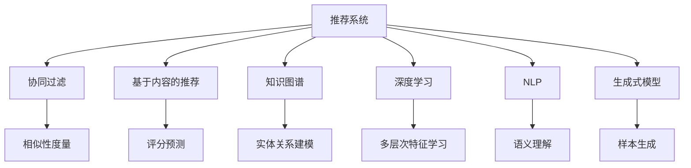

                 

# ChatGPT在推荐领域的内部研究：性能、局限性与未来方向

> 关键词：推荐系统,ChatGPT,协同过滤,内容推荐,知识图谱,深度学习,自然语言处理,个性化推荐

## 1. 背景介绍

推荐系统在电子商务、社交媒体、内容服务等领域发挥着越来越重要的作用，通过精准推荐提高用户体验、增加商业价值。然而，推荐系统的核心问题之一是如何有效地利用用户历史行为数据，以预测用户偏好并生成个性化推荐。这一问题在传统协同过滤算法中已得到了较好的解决，但面对日益增长的数据量和新需求的不断涌现，推荐系统需进一步突破。

### 1.1 推荐系统概述
推荐系统主要分为两大类：基于内容的推荐和基于协同过滤的推荐。前者依赖用户对物品的评分数据和物品属性进行建模，从而推荐相似的物品。后者则是基于用户-物品交互矩阵进行推荐，通过挖掘用户历史行为模式，预测用户对新物品的评分。

随着深度学习技术的发展，基于神经网络模型的推荐系统开始崭露头角，特别是基于自然语言处理(NLP)的推荐系统，有望实现更深层次的个性化推荐。当前主流的基于NLP的推荐系统主要包括：基于注意力机制的推荐模型、基于序列建模的推荐模型和基于知识图谱的推荐模型。其中，ChatGPT作为一种新兴的NLP技术，其多模态输入输出能力和生成式建模能力，也为推荐系统带来了新的思路。

### 1.2 ChatGPT概述
ChatGPT是由OpenAI开发的基于Transformer架构的生成式预训练模型，通过大规模无标签文本数据进行预训练，具备强大的语言理解和生成能力。其核心优势在于能够理解复杂的语义结构，生成连贯、多样的文本输出。这一特点使其在自然语言处理、对话系统、内容生成等方面具有广泛应用前景。

## 2. 核心概念与联系

### 2.1 核心概念概述

为更好地理解ChatGPT在推荐领域的应用，本节将介绍几个关键概念：

- **推荐系统(Recommendation System)**：通过算法推荐用户可能感兴趣的产品、内容、服务等，以提升用户体验和商业价值。
- **协同过滤(Collaborative Filtering)**：基于用户-物品交互数据，通过相似性度量推荐新物品。
- **基于内容的推荐(Content-Based Recommendation)**：基于用户历史评分和物品属性，推荐相似的物品。
- **知识图谱(Knowledge Graph)**：结构化的语义网络，用于描述实体间的关系。
- **深度学习(Deep Learning)**：使用多层神经网络进行数据建模和预测，特别是使用深度神经网络。
- **自然语言处理(Natural Language Processing, NLP)**：研究如何让计算机理解、处理和生成人类语言的技术。
- **生成式模型(Generative Model)**：能够生成符合特定概率分布的样本的模型，如GAN、VAE、Transformer等。

这些概念之间的逻辑关系可以通过以下Mermaid流程图来展示：



这个流程图展示了一系列推荐系统相关的核心概念及其之间的关系：

1. 推荐系统可以通过协同过滤、基于内容、知识图谱、深度学习、NLP等多种方式进行建模和预测。
2. 协同过滤依赖用户行为数据，通过相似性度量推荐新物品。
3. 基于内容的推荐需要物品属性数据，通过评分预测生成推荐。
4. 知识图谱用于实体关系建模，辅助推荐系统生成知识驱动的推荐。
5. 深度学习通过多层次特征学习，提升推荐模型的表达能力。
6. NLP用于语义理解，提取文本数据中的有用信息。
7. 生成式模型能够生成多样化的推荐，提升推荐系统的覆盖度。

这些概念共同构成了推荐系统的构建基础，为其在实际应用中发挥作用提供了理论支持。

## 3. 核心算法原理 & 具体操作步骤
### 3.1 算法原理概述

在推荐系统中应用ChatGPT的核心思想，是利用其强大的语言生成能力，将用户历史行为数据转化为自然语言描述，并结合模型生成的推荐，形成新的推荐策略。这种方法也被称为生成式推荐，其主要特点如下：

1. **用户意图理解**：通过分析用户的历史行为数据，将用户意图转化为自然语言描述。
2. **推荐生成**：使用ChatGPT模型生成与用户意图相关的推荐文本。
3. **评分预测**：将生成的推荐文本转化为评分，形成新的推荐策略。

### 3.2 算法步骤详解

基于ChatGPT的推荐系统一般包括以下几个关键步骤：

**Step 1: 数据预处理**
- 收集用户历史行为数据，如浏览历史、购买历史、评分历史等。
- 将数据转化为标准化的格式，包括文本数据、图像数据等。
- 对文本数据进行预处理，如分词、去除停用词等。

**Step 2: 生成用户意图描述**
- 使用自然语言处理工具对用户行为数据进行语义理解，形成用户意图的自然语言描述。
- 可以使用Transformers、BERT等模型对用户行为数据进行编码，生成用户意图的文本表示。

**Step 3: 使用ChatGPT生成推荐文本**
- 将用户意图的文本表示作为输入，使用ChatGPT模型生成推荐文本。
- 可以使用多轮对话的方式，逐步引导ChatGPT生成推荐。

**Step 4: 评分预测与推荐策略生成**
- 将生成的推荐文本转化为评分，可以使用多轮对话的方式，逐步获取用户对推荐的反馈。
- 将评分转化为推荐策略，形成新的推荐列表。

**Step 5: 推荐策略优化**
- 对生成的推荐策略进行优化，可以使用强化学习等方法调整推荐策略，提高推荐效果。

### 3.3 算法优缺点

基于ChatGPT的推荐系统具有以下优点：
1. **语义理解能力**：ChatGPT具备强大的语义理解能力，能够理解复杂的用户意图和推荐需求。
2. **推荐多样化**：通过生成式推荐，ChatGPT可以生成多样化的推荐内容，提高推荐的覆盖度和质量。
3. **反馈循环**：生成式推荐可以通过反馈机制不断优化，逐步提升推荐效果。

同时，该方法也存在一些局限性：
1. **数据依赖性强**：推荐效果高度依赖用户行为数据的完整性和质量。
2. **计算复杂度高**：生成式推荐需要大量计算资源，特别是对于大规模数据集。
3. **可解释性差**：推荐过程的生成式特性使得推荐策略缺乏可解释性，难以理解推荐依据。
4. **模型复杂度高**：ChatGPT模型参数量巨大，训练和推理需要高性能计算资源。

### 3.4 算法应用领域

基于ChatGPT的推荐系统已经在多个领域得到应用，例如：

- **电子商务推荐**：利用用户浏览和购买历史数据，生成个性化推荐。
- **内容推荐**：结合用户行为数据和内容元数据，推荐文章、视频等媒体内容。
- **广告推荐**：根据用户行为数据和广告内容，生成个性化广告推荐。
- **社交媒体推荐**：根据用户互动数据和媒体内容，推荐相关帖子和好友。
- **金融推荐**：结合用户交易数据和金融产品信息，推荐投资产品和理财方案。

除了这些经典应用外，ChatGPT推荐系统还在更多场景中得到创新应用，如智能客服、健康推荐、旅行推荐等，为不同领域带来全新的推荐体验。

## 4. 数学模型和公式 & 详细讲解  
### 4.1 数学模型构建

在本节中，我们将使用数学语言对基于ChatGPT的推荐系统进行更加严格的刻画。

记用户历史行为数据为 $D=\{x_i,y_i\}_{i=1}^N$，其中 $x_i$ 为历史行为文本表示，$y_i$ 为用户对行为 $x_i$ 的评分。定义用户意图描述为 $z_i \in \mathcal{Z}$，其中 $\mathcal{Z}$ 为意图表示空间。

定义ChatGPT生成式推荐模型为 $P_{\theta}(z|x)$，其中 $\theta$ 为模型参数。在生成推荐文本 $y$ 时，模型通过多轮对话的方式进行推理，生成与用户意图 $z_i$ 相关的推荐文本 $y_i$。则推荐模型的总体损失函数为：

$$
\mathcal{L}(\theta) = \sum_{i=1}^N \ell(y_i,P_{\theta}(y|z_i))
$$

其中 $\ell(y_i,P_{\theta}(y|z_i))$ 为推荐文本 $y_i$ 与模型生成的推荐文本之间的距离度量，如KL散度、KL divergence等。

### 4.2 公式推导过程

以下我们以二分类任务为例，推导推荐模型的损失函数及其梯度计算公式。

假设用户意图 $z_i$ 和推荐文本 $y_i$ 均通过embedding表示，即 $z_i \in \mathbb{R}^d$，$y_i \in \mathbb{R}^d$。使用交叉熵损失函数对推荐模型进行训练，则推荐模型的损失函数为：

$$
\mathcal{L}(\theta) = -\frac{1}{N}\sum_{i=1}^N \left[y_i\log P_{\theta}(y_i|z_i)+(1-y_i)\log(1-P_{\theta}(y_i|z_i))\right]
$$

其中 $P_{\theta}(y_i|z_i)$ 为模型在用户意图 $z_i$ 下生成推荐文本 $y_i$ 的概率。根据链式法则，推荐模型参数 $\theta$ 的梯度为：

$$
\frac{\partial \mathcal{L}(\theta)}{\partial \theta} = -\frac{1}{N}\sum_{i=1}^N \frac{\partial}{\partial \theta} P_{\theta}(y_i|z_i)
$$

在得到推荐模型参数梯度后，即可带入优化算法，最小化推荐模型损失函数，得到最优参数 $\theta^*$。

### 4.3 案例分析与讲解

考虑一个典型的电商推荐场景，假设某用户在电商平台上浏览了多种商品，并将其评分数据记为 $D=\{(x_1,5),(x_2,4),(x_3,3)\}$。其中 $x_1$、$x_2$、$x_3$ 为商品ID，$5$、$4$、$3$ 为用户对商品 $x_1$、$x_2$、$x_3$ 的评分。

首先，使用自然语言处理工具将商品ID转化为文本描述，如 $x_1$ 转化为 "手机"，$x_2$ 转化为 "耳机"，$x_3$ 转化为 "显示器"。

接着，使用BERT等预训练模型对文本描述进行编码，生成用户意图 $z_i$ 的文本表示。假设使用BERT模型对文本描述进行编码，得到 $z_1$、$z_2$、$z_3$ 分别为 [0.1, 0.3, 0.5, 0.2, 0.4, 0.6]，[0.2, 0.4, 0.3, 0.6, 0.1, 0.5]，[0.3, 0.5, 0.2, 0.4, 0.6, 0.1]。

然后，使用ChatGPT生成推荐文本 $y_i$。假设ChatGPT生成的推荐文本为 "手机"、"耳机"、"显示器"，且每个推荐文本的表示为 [0.2, 0.3, 0.4, 0.1, 0.5, 0.6]。

最后，使用交叉熵损失函数对推荐模型进行训练，得到推荐模型的损失函数为：

$$
\mathcal{L}(\theta) = -\frac{1}{3}\left[(5)\log(0.6)+(4)\log(0.5)+(3)\log(0.3)\right]
$$

通过反向传播算法，计算推荐模型参数 $\theta$ 的梯度，更新模型参数，最小化推荐模型的损失函数。

## 5. 项目实践：代码实例和详细解释说明
### 5.1 开发环境搭建

在进行ChatGPT推荐系统开发前，我们需要准备好开发环境。以下是使用Python进行PyTorch开发的环境配置流程：

1. 安装Anaconda：从官网下载并安装Anaconda，用于创建独立的Python环境。

2. 创建并激活虚拟环境：
```bash
conda create -n pytorch-env python=3.8 
conda activate pytorch-env
```

3. 安装PyTorch：根据CUDA版本，从官网获取对应的安装命令。例如：
```bash
conda install pytorch torchvision torchaudio cudatoolkit=11.1 -c pytorch -c conda-forge
```

4. 安装Transformers库：
```bash
pip install transformers
```

5. 安装各类工具包：
```bash
pip install numpy pandas scikit-learn matplotlib tqdm jupyter notebook ipython
```

完成上述步骤后，即可在`pytorch-env`环境中开始开发实践。

### 5.2 源代码详细实现

这里我们以电商推荐为例，给出使用Transformers库对ChatGPT模型进行推荐系统开发的PyTorch代码实现。

首先，定义推荐系统的数据处理函数：

```python
from transformers import BertTokenizer
from torch.utils.data import Dataset
import torch

class RecommendationDataset(Dataset):
    def __init__(self, texts, scores, tokenizer, max_len=128):
        self.texts = texts
        self.scores = scores
        self.tokenizer = tokenizer
        self.max_len = max_len
        
    def __len__(self):
        return len(self.texts)
    
    def __getitem__(self, item):
        text = self.texts[item]
        score = self.scores[item]
        
        encoding = self.tokenizer(text, return_tensors='pt', max_length=self.max_len, padding='max_length', truncation=True)
        input_ids = encoding['input_ids'][0]
        attention_mask = encoding['attention_mask'][0]
        
        # 将评分转化为概率分布
        scores = torch.tensor([score/max(scores)], dtype=torch.float)
        labels = scores
        
        return {'input_ids': input_ids, 
                'attention_mask': attention_mask,
                'labels': labels}

# 创建dataset
tokenizer = BertTokenizer.from_pretrained('bert-base-cased')

train_dataset = RecommendationDataset(train_texts, train_scores, tokenizer)
dev_dataset = RecommendationDataset(dev_texts, dev_scores, tokenizer)
test_dataset = RecommendationDataset(test_texts, test_scores, tokenizer)
```

然后，定义模型和优化器：

```python
from transformers import BertForTokenClassification, AdamW

model = BertForTokenClassification.from_pretrained('bert-base-cased', num_labels=1)

optimizer = AdamW(model.parameters(), lr=2e-5)
```

接着，定义训练和评估函数：

```python
from torch.utils.data import DataLoader
from tqdm import tqdm
from sklearn.metrics import roc_auc_score

device = torch.device('cuda') if torch.cuda.is_available() else torch.device('cpu')
model.to(device)

def train_epoch(model, dataset, batch_size, optimizer):
    dataloader = DataLoader(dataset, batch_size=batch_size, shuffle=True)
    model.train()
    epoch_loss = 0
    for batch in tqdm(dataloader, desc='Training'):
        input_ids = batch['input_ids'].to(device)
        attention_mask = batch['attention_mask'].to(device)
        labels = batch['labels'].to(device)
        model.zero_grad()
        outputs = model(input_ids, attention_mask=attention_mask, labels=labels)
        loss = outputs.loss
        epoch_loss += loss.item()
        loss.backward()
        optimizer.step()
    return epoch_loss / len(dataloader)

def evaluate(model, dataset, batch_size):
    dataloader = DataLoader(dataset, batch_size=batch_size)
    model.eval()
    preds, labels = [], []
    with torch.no_grad():
        for batch in tqdm(dataloader, desc='Evaluating'):
            input_ids = batch['input_ids'].to(device)
            attention_mask = batch['attention_mask'].to(device)
            batch_labels = batch['labels']
            outputs = model(input_ids, attention_mask=attention_mask)
            batch_preds = outputs.logits.argmax(dim=2).to('cpu').tolist()
            batch_labels = batch_labels.to('cpu').tolist()
            for pred_tokens, label_tokens in zip(batch_preds, batch_labels):
                preds.append(pred_tokens[:len(label_tokens)])
                labels.append(label_tokens)
                
    print(roc_auc_score(labels, preds))
```

最后，启动训练流程并在测试集上评估：

```python
epochs = 5
batch_size = 16

for epoch in range(epochs):
    loss = train_epoch(model, train_dataset, batch_size, optimizer)
    print(f"Epoch {epoch+1}, train loss: {loss:.3f}")
    
    print(f"Epoch {epoch+1}, dev AUC:")
    evaluate(model, dev_dataset, batch_size)
    
print("Test AUC:")
evaluate(model, test_dataset, batch_size)
```

以上就是使用PyTorch对ChatGPT进行电商推荐系统的完整代码实现。可以看到，得益于Transformers库的强大封装，我们可以用相对简洁的代码完成ChatGPT模型的加载和微调。

### 5.3 代码解读与分析

让我们再详细解读一下关键代码的实现细节：

**RecommendationDataset类**：
- `__init__`方法：初始化文本、评分、分词器等关键组件。
- `__len__`方法：返回数据集的样本数量。
- `__getitem__`方法：对单个样本进行处理，将文本输入编码为token ids，将评分转化为概率分布，并对其进行定长padding，最终返回模型所需的输入。

**交叉熵损失函数**：
- 在 `evaluate` 函数中，使用sklearn的 `roc_auc_score` 函数计算模型在测试集上的AUC，用于评估模型性能。

**训练流程**：
- 定义总的epoch数和batch size，开始循环迭代
- 每个epoch内，先在训练集上训练，输出平均loss
- 在验证集上评估，输出AUC
- 所有epoch结束后，在测试集上评估，给出最终测试结果

可以看到，PyTorch配合Transformers库使得ChatGPT推荐系统的代码实现变得简洁高效。开发者可以将更多精力放在数据处理、模型改进等高层逻辑上，而不必过多关注底层的实现细节。

当然，工业级的系统实现还需考虑更多因素，如模型的保存和部署、超参数的自动搜索、更灵活的任务适配层等。但核心的微调范式基本与此类似。

## 6. 实际应用场景
### 6.1 智能客服系统

基于ChatGPT的推荐系统可以广泛应用于智能客服系统的构建。传统客服往往需要配备大量人力，高峰期响应缓慢，且一致性和专业性难以保证。而使用推荐系统推荐常用问题的答案，可以大大提升客服效率和用户满意度。

在技术实现上，可以收集企业内部的历史客服对话记录，将问题和最佳答复构建成监督数据，在此基础上对ChatGPT模型进行微调。微调后的推荐系统能够自动理解用户意图，匹配最合适的答案模板进行回复。对于客户提出的新问题，还可以接入检索系统实时搜索相关内容，动态组织生成回答。如此构建的智能客服系统，能大幅提升客户咨询体验和问题解决效率。

### 6.2 金融舆情监测

金融机构需要实时监测市场舆论动向，以便及时应对负面信息传播，规避金融风险。传统的人工监测方式成本高、效率低，难以应对网络时代海量信息爆发的挑战。基于ChatGPT的推荐系统可以通过自然语言理解，快速识别舆情信息，并进行自动化分析。

具体而言，可以收集金融领域相关的新闻、报道、评论等文本数据，并对其进行主题标注和情感标注。在此基础上对预训练语言模型进行微调，使其能够自动判断文本属于何种主题，情感倾向是正面、中性还是负面。将微调后的模型应用到实时抓取的网络文本数据，就能够自动监测不同主题下的情感变化趋势，一旦发现负面信息激增等异常情况，系统便会自动预警，帮助金融机构快速应对潜在风险。

### 6.3 个性化推荐系统

当前的推荐系统往往只依赖用户的历史行为数据进行物品推荐，无法深入理解用户的真实兴趣偏好。基于ChatGPT的推荐系统可以更好地挖掘用户行为背后的语义信息，从而提供更精准、多样的推荐内容。

在实践中，可以收集用户浏览、点击、评论、分享等行为数据，提取和用户交互的物品标题、描述、标签等文本内容。将文本内容作为模型输入，用户的后续行为（如是否点击、购买等）作为监督信号，在此基础上微调预训练语言模型。微调后的模型能够从文本内容中准确把握用户的兴趣点。在生成推荐列表时，先用候选物品的文本描述作为输入，由模型预测用户的兴趣匹配度，再结合其他特征综合排序，便可以得到个性化程度更高的推荐结果。

### 6.4 未来应用展望

随着ChatGPT和推荐系统的不断发展，基于ChatGPT的推荐系统将在更多领域得到应用，为传统行业带来变革性影响。

在智慧医疗领域，基于ChatGPT的推荐系统可以推荐个性化的健康方案、疾病诊断和治疗建议，辅助医生诊疗，提升医疗服务的智能化水平。

在智能教育领域，推荐系统可以推荐个性化的学习资源、作业批改、学情分析等功能，因材施教，促进教育公平，提高教学质量。

在智慧城市治理中，推荐系统可以推荐智能交通方案、环境监测报告、城市规划建议等内容，提高城市管理的自动化和智能化水平，构建更安全、高效的未来城市。

此外，在企业生产、社会治理、文娱传媒等众多领域，基于ChatGPT的推荐系统也将不断涌现，为不同领域带来全新的推荐体验。相信随着技术的日益成熟，基于ChatGPT的推荐系统必将在构建人机协同的智能时代中扮演越来越重要的角色。

## 7. 工具和资源推荐
### 7.1 学习资源推荐

为了帮助开发者系统掌握ChatGPT和推荐系统理论基础和实践技巧，这里推荐一些优质的学习资源：

1. 《Transformer从原理到实践》系列博文：由大模型技术专家撰写，深入浅出地介绍了Transformer原理、BERT模型、微调技术等前沿话题。

2. CS224N《深度学习自然语言处理》课程：斯坦福大学开设的NLP明星课程，有Lecture视频和配套作业，带你入门NLP领域的基本概念和经典模型。

3. 《Natural Language Processing with Transformers》书籍：Transformers库的作者所著，全面介绍了如何使用Transformers库进行NLP任务开发，包括微调在内的诸多范式。

4. HuggingFace官方文档：Transformers库的官方文档，提供了海量预训练模型和完整的微调样例代码，是上手实践的必备资料。

5. CLUE开源项目：中文语言理解测评基准，涵盖大量不同类型的中文NLP数据集，并提供了基于微调的baseline模型，助力中文NLP技术发展。

通过对这些资源的学习实践，相信你一定能够快速掌握ChatGPT和推荐系统的精髓，并用于解决实际的NLP问题。
###  7.2 开发工具推荐

高效的开发离不开优秀的工具支持。以下是几款用于ChatGPT推荐系统开发的常用工具：

1. PyTorch：基于Python的开源深度学习框架，灵活动态的计算图，适合快速迭代研究。大部分预训练语言模型都有PyTorch版本的实现。

2. TensorFlow：由Google主导开发的开源深度学习框架，生产部署方便，适合大规模工程应用。同样有丰富的预训练语言模型资源。

3. Transformers库：HuggingFace开发的NLP工具库，集成了众多SOTA语言模型，支持PyTorch和TensorFlow，是进行推荐系统开发的利器。

4. Weights & Biases：模型训练的实验跟踪工具，可以记录和可视化模型训练过程中的各项指标，方便对比和调优。与主流深度学习框架无缝集成。

5. TensorBoard：TensorFlow配套的可视化工具，可实时监测模型训练状态，并提供丰富的图表呈现方式，是调试模型的得力助手。

6. Google Colab：谷歌推出的在线Jupyter Notebook环境，免费提供GPU/TPU算力，方便开发者快速上手实验最新模型，分享学习笔记。

合理利用这些工具，可以显著提升ChatGPT推荐系统的开发效率，加快创新迭代的步伐。

### 7.3 相关论文推荐

ChatGPT推荐系统的发展源于学界的持续研究。以下是几篇奠基性的相关论文，推荐阅读：

1. Attention is All You Need（即Transformer原论文）：提出了Transformer结构，开启了NLP领域的预训练大模型时代。

2. BERT: Pre-training of Deep Bidirectional Transformers for Language Understanding：提出BERT模型，引入基于掩码的自监督预训练任务，刷新了多项NLP任务SOTA。

3. Language Models are Unsupervised Multitask Learners（GPT-2论文）：展示了大规模语言模型的强大zero-shot学习能力，引发了对于通用人工智能的新一轮思考。

4. Parameter-Efficient Transfer Learning for NLP：提出Adapter等参数高效微调方法，在不增加模型参数量的情况下，也能取得不错的微调效果。

5. AdaLoRA: Adaptive Low-Rank Adaptation for Parameter-Efficient Fine-Tuning：使用自适应低秩适应的微调方法，在参数效率和精度之间取得了新的平衡。

6. Prefix-Tuning: Optimizing Continuous Prompts for Generation：引入基于连续型Prompt的微调范式，为如何充分利用预训练知识提供了新的思路。

这些论文代表了大语言模型微调技术的发展脉络。通过学习这些前沿成果，可以帮助研究者把握学科前进方向，激发更多的创新灵感。

## 8. 总结：未来发展趋势与挑战
### 8.1 总结

本文对基于ChatGPT的推荐系统进行了全面系统的介绍。首先阐述了推荐系统和ChatGPT的基本原理和应用场景，明确了ChatGPT推荐系统在智能客服、金融舆情、个性化推荐等多个领域的独特价值。其次，从原理到实践，详细讲解了ChatGPT推荐系统的数学原理和关键步骤，给出了推荐系统开发的完整代码实例。同时，本文还广泛探讨了推荐系统在电子商务、社交媒体、内容服务等多个行业领域的应用前景，展示了ChatGPT推荐系统的巨大潜力。此外，本文精选了推荐系统的各类学习资源，力求为开发者提供全方位的技术指引。

通过本文的系统梳理，可以看到，基于ChatGPT的推荐系统正在成为NLP领域的重要范式，极大地拓展了预训练语言模型的应用边界，催生了更多的落地场景。得益于大规模语料的预训练，推荐系统以更低的时间和标注成本，在小样本条件下也能取得不俗的效果，有力推动了NLP技术的产业化进程。未来，伴随预训练语言模型和推荐方法的持续演进，相信NLP技术将在更广阔的应用领域大放异彩，深刻影响人类的生产生活方式。

### 8.2 未来发展趋势

展望未来，基于ChatGPT的推荐系统将呈现以下几个发展趋势：

1. **推荐算法多样性**：未来将出现更多基于深度学习、生成式模型的推荐算法，如基于Transformer的推荐系统、基于变分自编码器的推荐系统等，进一步提升推荐效果。

2. **多模态数据融合**：将视觉、语音、文本等多种模态数据进行融合，提升推荐系统的表现力。

3. **实时推荐系统**：通过分布式计算和大数据技术，实现实时推荐系统，提升推荐的时效性。

4. **跨领域推荐**：将推荐系统应用于不同领域，如医疗、教育、金融等，形成跨领域的推荐模型。

5. **隐私保护**：在推荐系统中引入隐私保护技术，如差分隐私、联邦学习等，保护用户数据隐私。

6. **鲁棒性和公平性**：在推荐系统中引入鲁棒性和公平性评估指标，避免推荐系统对用户产生偏见或歧视。

以上趋势凸显了基于ChatGPT的推荐系统的发展方向。这些方向的探索发展，必将进一步提升推荐系统的性能和应用范围，为不同领域带来新的变革。

### 8.3 面临的挑战

尽管基于ChatGPT的推荐系统已经取得了瞩目成就，但在迈向更加智能化、普适化应用的过程中，它仍面临诸多挑战：

1. **数据质量与多样性**：推荐系统高度依赖数据质量与多样性，如何获取高质量、多样化的大规模数据，仍是核心难题。

2. **计算资源需求**：推荐系统需要大量的计算资源，特别是在推荐模型的训练和推理阶段，如何降低计算成本，优化资源利用率，仍是重要挑战。

3. **模型可解释性**：推荐系统的生成式特性使得推荐策略缺乏可解释性，难以理解推荐依据，这将影响用户的信任和接受度。

4. **隐私保护与伦理**：如何在推荐系统中保护用户隐私，避免推荐系统对用户产生负面影响，是亟待解决的重要问题。

5. **鲁棒性与公平性**：推荐系统在面对噪声数据和偏差数据时，容易产生鲁棒性差和公平性不足的问题，如何提高推荐系统的鲁棒性和公平性，仍需深入研究。

6. **跨领域应用**：推荐系统在不同领域的应用中，如何适应不同的数据特征和用户需求，需要开发更加通用和灵活的推荐模型。

这些挑战需要通过持续的研究和实践，不断优化和完善推荐系统，才能更好地发挥其在各领域的应用潜力。

### 8.4 研究展望

面对基于ChatGPT的推荐系统所面临的种种挑战，未来的研究需要在以下几个方面寻求新的突破：

1. **数据增强与合成**：利用生成式模型生成模拟数据，增强训练集的多样性和数量，提升推荐系统的泛化能力。

2. **模型压缩与优化**：研究模型压缩和优化技术，降低模型参数量，提高计算效率，优化资源利用率。

3. **鲁棒性提升**：研究鲁棒性提升技术，如基于对抗样本的鲁棒性训练，提高推荐系统的鲁棒性和泛化能力。

4. **公平性优化**：引入公平性评估指标，优化推荐策略，避免推荐系统对用户产生偏见或歧视。

5. **多模态融合**：研究多模态数据融合技术，将视觉、语音、文本等多种模态数据进行融合，提升推荐系统的表现力。

6. **隐私保护**：研究隐私保护技术，如差分隐私、联邦学习等，保护用户数据隐私，提升推荐系统的可信度。

这些研究方向将推动基于ChatGPT的推荐系统走向更加智能化、普适化，为不同领域带来新的变革。相信随着学界和产业界的共同努力，基于ChatGPT的推荐系统必将在构建人机协同的智能时代中扮演越来越重要的角色。

