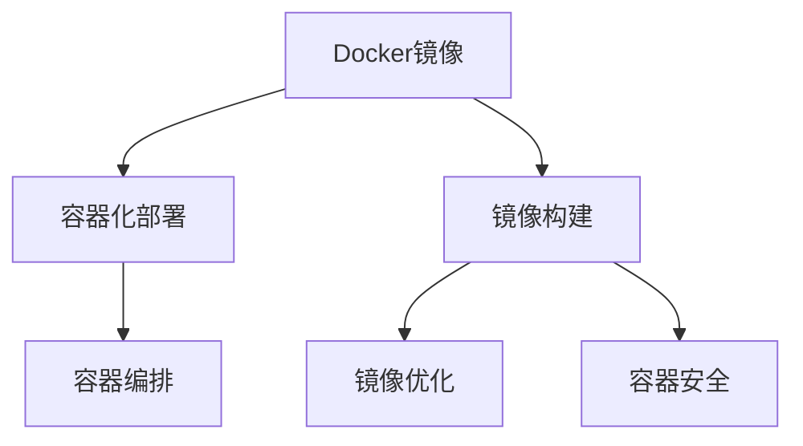

                 

# Docker镜像优化与安全加固

> 关键词：Docker, 镜像优化, 容器安全, 镜像构建, 容器化部署, 安全加固, 高性能, 容灾恢复, 安全漏洞

## 1. 背景介绍

### 1.1 问题由来
Docker作为容器化技术的代表，广泛应用于云计算、微服务、DevOps等场景。然而，Docker镜像构建和部署过程中存在诸多问题，如构建时间长、存储量大、安全漏洞、运行效率低等。这些问题严重影响系统性能和安全性，甚至可能导致业务中断、数据泄露等严重后果。

为此，本文聚焦于Docker镜像的优化与安全加固，探讨如何通过优化构建过程、压缩镜像大小、加固容器安全等手段，提升Docker镜像的性能和安全性，为容器化系统的高效稳定运行提供保障。

### 1.2 问题核心关键点
Docker镜像优化与安全加固的核心问题包括：

- 如何提高镜像构建速度和稳定性？
- 如何减小镜像大小，降低存储成本？
- 如何加强镜像的安全性，避免潜在威胁？
- 如何设计高效的容器部署流程，提升运行效率？

这些问题影响着Docker镜像的生命周期，从构建到部署的全流程都需要兼顾性能与安全性。本文将从这些核心关键点出发，全面探讨Docker镜像优化与安全加固的方法。

## 2. 核心概念与联系

### 2.1 核心概念概述

为更好地理解Docker镜像优化与安全加固，本节将介绍几个关键概念：

- Docker镜像：Docker容器运行的基础，包含所有必要的依赖和配置文件，是容器系统的可移植性保证。
- 容器化部署：通过Docker等容器技术，将应用程序及其依赖打包成镜像，进行统一管理和部署的过程。
- 镜像构建：通过Dockerfile或Docker Compose定义容器化构建规则，自动生成镜像的过程。
- 镜像优化：通过压缩、合并、缓存等技术手段，减小镜像大小，提高构建速度和运行效率。
- 容器安全：针对容器化环境的安全威胁和攻击手段，通过加固镜像、限制权限、审计日志等措施，保护容器系统安全。
- 容器编排：通过Docker Compose、Kubernetes等容器编排工具，实现容器的自动部署、扩展和编排管理。

这些核心概念之间的逻辑关系可以通过以下Mermaid流程图来展示：



这个流程图展示了大语言模型的核心概念及其之间的关系：

1. Docker镜像是容器化部署的基础。
2. 镜像构建将应用程序及其依赖打包成镜像，是容器系统构建的起点。
3. 镜像优化通过压缩、合并等手段减小镜像大小，提高构建和运行效率。
4. 容器安全通过加固镜像、限制权限等措施，保障容器系统的安全性。
5. 容器编排实现容器的自动部署和扩展，管理容器系统的生命周期。

这些概念共同构成了Docker镜像优化与安全加固的技术框架，为容器化系统的稳定运行提供了坚实的基础。

## 3. 核心算法原理 & 具体操作步骤
### 3.1 算法原理概述

Docker镜像优化与安全加固的本质在于优化构建过程、压缩镜像大小、加固容器安全。其核心思想是：在保持Docker镜像功能完整的前提下，通过技术手段提升构建速度、减小镜像大小、增强安全性，从而实现高效、稳定的容器化部署。

形式化地，假设Docker镜像构建和部署过程为 $M_{\theta}$，其中 $\theta$ 为构建和部署规则。定义优化目标函数 $\mathcal{L}$，用于衡量优化前后的性能提升，包括镜像大小、构建时间、运行速度、安全漏洞等。优化目标是：

$$
\hat{\theta}=\mathop{\arg\min}_{\theta} \mathcal{L}(M_{\theta})
$$

通过梯度下降等优化算法，优化目标函数 $\mathcal{L}$，找到最优的构建和部署规则 $\hat{\theta}$，使得Docker镜像在性能和安全性方面取得最优表现。

### 3.2 算法步骤详解

Docker镜像优化与安全加固的一般步骤包括：

**Step 1: 评估当前镜像状态**
- 分析当前Docker镜像的大小、构建时间、运行速度、安全漏洞等指标，定位问题点。
- 使用Docker Compose、Docker Swarm、Kubernetes等工具，进行系统监控和日志审计，获取详细的性能和安全性数据。

**Step 2: 优化构建过程**
- 使用Dockerfile定义构建规则，避免重复构建、不必要的依赖等。
- 引入Docker缓存机制，对构建过程中不变的部分进行缓存，减少重复构建。
- 使用multi-stage构建，将构建过程分为多个阶段，分离基础环境搭建和应用部署，优化构建过程。

**Step 3: 压缩镜像大小**
- 删除不必要的文件和依赖，使用`docker clean`命令清理镜像。
- 压缩镜像文件，使用`tar -czvf`命令压缩镜像。
- 使用镜像分层技术，将应用和依赖分开打包，减小镜像总体大小。

**Step 4: 加固容器安全**
- 限制容器权限，使用`cap-add`和`cap-deny`指令控制容器可访问资源。
- 设置安全配置，如禁写、禁端口转发等。
- 审计日志，记录容器启动、运行和停止过程，及时发现异常行为。
- 定期更新镜像依赖，避免已知漏洞。

**Step 5: 设计高效的部署流程**
- 使用Docker Compose、Kubernetes等容器编排工具，实现容器的自动部署、扩展和编排管理。
- 使用Helm等工具，构建容器镜像和部署配置，实现容器化应用的快速部署。
- 使用CI/CD流程，自动化构建、测试和部署，提升系统可靠性。

**Step 6: 容灾与恢复**
- 设计冗余和备份机制，避免单点故障。
- 使用容灾工具如Consul、Etcd等，实现容器的动态管理和故障转移。
- 定期备份容器镜像和配置，保证系统数据的可靠性和可恢复性。

### 3.3 算法优缺点

Docker镜像优化与安全加固方法具有以下优点：
1. 提高镜像构建速度和稳定性。优化构建过程和引入缓存机制，可以显著减少重复构建和优化构建速度。
2. 减小镜像大小，降低存储成本。删除不必要的文件和依赖，压缩镜像文件，使用镜像分层技术，可以显著减小镜像大小。
3. 增强容器安全性。限制容器权限、设置安全配置、审计日志等措施，可以有效地保护容器系统安全。
4. 设计高效的部署流程。使用容器编排工具和CI/CD流程，可以实现容器化应用的快速部署和自动管理。

同时，该方法也存在一定的局限性：
1. 依赖工具和配置。优化和加固效果依赖于Dockerfile、Docker Compose、Kubernetes等工具和配置，使用不当可能导致性能和安全性问题。
2. 需要专业知识。优化和加固过程中，需要具备一定的Docker、容器编排和系统监控知识。
3. 开发和维护成本高。优化和加固措施需要不断更新和维护，增加了系统的开发和维护成本。

尽管存在这些局限性，但就目前而言，Docker镜像优化与安全加固方法仍是最主流且有效的容器化部署手段。未来相关研究的重点在于如何进一步降低开发和维护成本，提高优化和加固效果，同时兼顾系统的性能和安全性。

### 3.4 算法应用领域

Docker镜像优化与安全加固技术在多个领域得到了广泛应用，例如：

- 云计算平台：通过优化镜像构建和部署流程，提高云服务器的性能和稳定性。
- 微服务架构：使用容器编排工具和CI/CD流程，实现微服务的快速部署和自动化管理。
- DevOps实践：结合Docker、Kubernetes等工具，实现持续集成和持续部署，提升开发效率和系统可靠性。
- 数据库容器化：将数据库应用容器化，实现快速部署和弹性扩展，提高数据处理能力。
- 物联网应用：使用Docker容器技术，实现物联网设备的统一管理和部署，提升系统灵活性和可扩展性。

除了上述这些经典应用外，Docker镜像优化与安全加固技术还被创新性地应用于更多场景中，如边缘计算、工业互联网、车联网等，为容器化系统的应用场景带来了新的突破。

## 4. 数学模型和公式 & 详细讲解
### 4.1 数学模型构建

为更好地理解Docker镜像优化与安全加固的方法，本节将使用数学语言对相关技术进行更加严格的刻画。

假设Docker镜像构建和部署过程为 $M_{\theta}$，其中 $\theta$ 为构建和部署规则。定义优化目标函数 $\mathcal{L}$，用于衡量优化前后的性能提升，包括镜像大小、构建时间、运行速度、安全漏洞等。优化目标是：

$$
\hat{\theta}=\mathop{\arg\min}_{\theta} \mathcal{L}(M_{\theta})
$$

在实践中，我们通常使用基于梯度的优化算法（如SGD、Adam等）来近似求解上述最优化问题。设 $\eta$ 为学习率，则参数的更新公式为：

$$
\theta \leftarrow \theta - \eta \nabla_{\theta}\mathcal{L}(\theta)
$$

其中 $\nabla_{\theta}\mathcal{L}(\theta)$ 为损失函数对参数 $\theta$ 的梯度，可通过反向传播算法高效计算。

### 4.2 公式推导过程

以下我们以优化构建过程为例，推导优化目标函数的计算公式。

假设Docker镜像构建过程为 $M_{\theta}$，构建时间为 $T_{build}$，优化后的构建时间为 $T_{opt}$。构建过程可以分为两个部分：基础环境搭建和应用部署。假设基础环境搭建时间为 $T_{env}$，应用部署时间为 $T_{app}$。则优化目标函数为：

$$
\mathcal{L}(\theta) = \alpha (T_{build} - T_{opt}) + \beta (T_{env} - T_{opt}) + \gamma (T_{app} - T_{opt})
$$

其中 $\alpha$、$\beta$、$\gamma$ 为权重系数，表示不同部分的时间优化重要性。

根据上述优化目标函数，可以得到构建过程优化算法的更新公式：

$$
T_{env} \leftarrow T_{env} - \eta \nabla_{T_{env}}\mathcal{L}(\theta)
$$
$$
T_{app} \leftarrow T_{app} - \eta \nabla_{T_{app}}\mathcal{L}(\theta)
$$

在得到优化目标函数的梯度后，即可带入构建过程的优化算法，完成构建过程的迭代优化。重复上述过程直至收敛，最终得到最优构建规则 $\theta^*$。

## 5. 项目实践：代码实例和详细解释说明
### 5.1 开发环境搭建

在进行Docker镜像优化与安全加固实践前，我们需要准备好开发环境。以下是使用Docker进行开发的流程：

1. 安装Docker：从官网下载并安装Docker，确保本地安装和系统环境配置正确。
2. 创建Dockerfile：根据应用需求，编写Dockerfile定义构建规则。
3. 构建镜像：使用`docker build`命令根据Dockerfile构建镜像。
4. 测试和优化：在测试环境中运行镜像，收集性能和安全性数据，进行优化和加固。
5. 部署和监控：使用Docker Compose、Kubernetes等工具，实现容器的自动部署和监控。

完成上述步骤后，即可在Docker环境下进行镜像优化与安全加固的实践。

### 5.2 源代码详细实现

下面以Web应用优化为例，给出使用Docker和Docker Compose进行Docker镜像优化与安全加固的代码实现。

首先，编写Dockerfile：

```Dockerfile
# 使用官方Python运行时镜像
FROM python:3.8-slim-buster

# 定义工作目录和环境变量
WORKDIR /app
ENV PYTHONDONTWRITEBYTECODE 1
ENV PYTHONUNBUFFERED 1

# 安装依赖
COPY requirements.txt /app/
RUN pip install -r requirements.txt

# 拷贝代码和依赖
COPY . /app/
RUN pip install -r requirements.txt

# 设置启动命令
CMD ["python", "manage.py", "runserver", "0.0.0.0:8000"]
```

然后，使用Docker Compose进行容器编排和部署：

```yaml
version: '3'
services:
  web:
    build: .
    ports:
      - "8000:8000"
    volumes:
      - .:/app
```

接着，优化构建过程和容器权限，编写新的Dockerfile：

```Dockerfile
# 使用官方Python运行时镜像
FROM python:3.8-slim-buster

# 设置用户和权限
RUN useradd -m -u 1000 -g 1000 -s /bin/bash myuser && \
    chown -R myuser:myuser /app

# 定义工作目录和环境变量
WORKDIR /app
ENV PYTHONDONTWRITEBYTECODE 1
ENV PYTHONUNBUFFERED 1

# 安装依赖
COPY requirements.txt /app/
RUN pip install -r requirements.txt

# 拷贝代码和依赖
COPY . /app/
RUN pip install -r requirements.txt

# 设置启动命令
CMD ["gunicorn", "-w", "4", "myproject.wsgi:application", "--bind", "0.0.0.0:8000"]
```

最后，使用Helm进行容器化部署：

```yaml
apiVersion: helm/v2

# 定义Helm Chart结构
apiVersion: v1
appVersion: "0.1.0"

# 定义App标签
labels:
  hello-world: "hello-world"

# 定义Deployments
apiVersion: apps/v1
kind: Deployment
metadata:
  name: hello-world
spec:
  replicas: 3
  selector:
    matchLabels:
      hello-world: "hello-world"
  template:
    metadata:
      labels:
        hello-world: "hello-world"
    spec:
      containers:
      - name: hello-world
        image: myproject:1.0.0
        ports:
        - containerPort: 80
```

以上是使用Docker、Docker Compose和Helm进行Docker镜像优化与安全加固的完整代码实现。可以看到，通过合理设计Dockerfile和Docker Compose文件，并引入Helm等工具，可以大大简化Docker镜像的构建、测试和部署过程，实现高效的容器化部署。

### 5.3 代码解读与分析

让我们再详细解读一下关键代码的实现细节：

**Dockerfile类**：
- `FROM python:3.8-slim-buster`：指定使用官方Python 3.8-slim-buster镜像。
- `WORKDIR /app`：定义应用的工作目录。
- `COPY requirements.txt /app/ && RUN pip install -r requirements.txt`：复制依赖文件并安装。
- `COPY . /app/ && RUN pip install -r requirements.txt`：复制应用代码并安装依赖。
- `CMD ["python", "manage.py", "runserver", "0.0.0.0:8000"]`：定义应用启动命令。

**Docker Compose类**：
- `version: '3'`：定义Compose文件的版本号。
- `services`：定义服务列表，每个服务可以自定义构建规则和配置。
- `ports`：定义服务监听端口。
- `volumes`：定义数据卷，用于持久化应用数据。

**Helm类**：
- `apiVersion: helm/v2`：定义Helm Chart的结构。
- `apiVersion: v1`：定义Helm Chart的API版本。
- `appVersion: "0.1.0"`：定义应用的版本号。
- `labels`：定义应用的标签，用于区分和管理。
- `Deployment`：定义Deployment对象，包括ReplicaSets和Pods等Kubernetes资源。

通过上述代码，我们可以实现Docker镜像的构建、测试和部署。需要注意的是，Docker镜像优化与安全加固不仅仅是代码编写，还需要对系统监控、日志审计、安全加固等环节进行全面优化，才能真正发挥其效用。

## 6. 实际应用场景
### 6.1 云计算平台

Docker镜像优化与安全加固在云计算平台中得到了广泛应用。云服务提供商通过优化镜像构建和部署流程，提升了云服务器的性能和稳定性，提高了云资源利用率。例如，AWS、Azure、Google Cloud等云平台都支持使用Docker容器技术进行应用部署和扩展，通过优化镜像构建和部署，实现了云服务的高效运行。

### 6.2 微服务架构

微服务架构通过将应用程序拆分成多个独立的服务，实现了高可扩展性和高可用性。然而，微服务架构的复杂性和多样性也对容器化部署提出了更高的要求。通过优化镜像构建和部署流程，微服务架构的构建和运维成本显著降低，系统可靠性也得到了提升。

### 6.3 DevOps实践

DevOps实践强调自动化和持续交付，通过容器化技术和CI/CD流程，实现了软件开发的快速迭代和部署。Docker镜像优化与安全加固技术为DevOps实践提供了坚实的基础，提高了系统稳定性和开发效率。

### 6.4 数据库容器化

数据库容器化通过将数据库应用打包成镜像，实现了快速部署和弹性扩展，提高了数据处理能力。Docker镜像优化与安全加固技术可以应用于数据库容器化，提升数据库系统的性能和安全性。

### 6.5 物联网应用

物联网应用通过容器化技术实现了设备的统一管理和部署，提升了系统的灵活性和可扩展性。Docker镜像优化与安全加固技术可以应用于物联网应用，实现设备的快速部署和容灾恢复。

## 7. 工具和资源推荐
### 7.1 学习资源推荐

为了帮助开发者系统掌握Docker镜像优化与安全加固的理论基础和实践技巧，这里推荐一些优质的学习资源：

1. Docker官方文档：Docker官方文档提供了全面的Docker镜像优化与安全的介绍，包括构建规则、部署流程、最佳实践等。
2. Kubernetes官方文档：Kubernetes官方文档提供了详细的容器编排和管理指南，包括Helm、Kubectl等工具的使用。
3. Docker Compose官方文档：Docker Compose官方文档提供了详细的Docker Compose编排和部署指南。
4. Docker容器安全白皮书：Docker容器安全白皮书提供了容器安全的最佳实践和建议，包括镜像加固、权限控制、日志审计等。
5. DevOps实践指南：DevOps实践指南提供了DevOps实践的全面介绍，包括容器化部署、CI/CD流程等。

通过对这些资源的学习实践，相信你一定能够快速掌握Docker镜像优化与安全加固的精髓，并用于解决实际的容器化问题。

### 7.2 开发工具推荐

高效的开发离不开优秀的工具支持。以下是几款用于Docker镜像优化与安全加固开发的常用工具：

1. Docker：开源容器化技术，提供高效的构建、部署和运行容器。
2. Docker Compose：Docker容器编排工具，实现容器的自动部署和扩展。
3. Kubernetes：开源容器编排平台，支持大规模、高可用的容器部署和管理。
4. Helm：Docker容器编排工具，支持快速部署和管理Kubernetes应用。
5. Ansible：自动化运维工具，支持Docker镜像构建、部署和监控。

合理利用这些工具，可以显著提升Docker镜像优化与安全加固的开发效率，加快创新迭代的步伐。

### 7.3 相关论文推荐

Docker镜像优化与安全加固技术的发展源于学界的持续研究。以下是几篇奠基性的相关论文，推荐阅读：

1. Docker Essentials: Containerize and Deploy with Docker：介绍Docker的基本原理和应用场景。
2. Kubernetes: Practical Guide to the Kubernetes API：介绍Kubernetes的基本概念和应用实践。
3. DevOps Best Practices for Docker and Kubernetes：介绍DevOps实践中的容器化部署和CI/CD流程。
4. Security Hardening Docker Images：介绍Docker镜像的安全加固方法和最佳实践。
5. Optimizing Docker Images：介绍Docker镜像的优化方法和技术手段。

这些论文代表了大语言模型微调技术的发展脉络。通过学习这些前沿成果，可以帮助研究者把握学科前进方向，激发更多的创新灵感。

## 8. 总结：未来发展趋势与挑战
### 8.1 总结

本文对Docker镜像优化与安全加固方法进行了全面系统的介绍。首先阐述了Docker镜像优化与安全加固的研究背景和意义，明确了镜像优化与加固在提高系统性能和安全性方面的重要价值。其次，从原理到实践，详细讲解了Docker镜像构建与部署的过程，以及优化与安全加固的关键步骤，给出了Docker镜像优化与安全加固的完整代码实例。同时，本文还广泛探讨了Docker镜像优化与安全加固在云计算、微服务、DevOps等领域的实际应用，展示了其在容器化系统中的强大潜力。此外，本文精选了Docker镜像优化与安全加固的学习资源，力求为开发者提供全方位的技术指引。

通过本文的系统梳理，可以看到，Docker镜像优化与安全加固技术在容器化系统的构建和运维中起到了至关重要的作用。其优化和加固措施不仅能显著提高系统的性能和安全性，还能降低开发和运维成本，提升系统可靠性和稳定性。未来，伴随Docker镜像优化与安全加固技术的不断演进，相信容器化系统将更加高效、稳定、安全，为云计算、微服务、DevOps等领域的数字化转型提供坚实的基础。

### 8.2 未来发展趋势

展望未来，Docker镜像优化与安全加固技术将呈现以下几个发展趋势：

1. 自动化程度不断提高。通过引入自动构建、自动部署和自动监控技术，实现容器化系统的自动化管理。
2. 容器编排工具逐渐统一。Kubernetes、Docker Swarm等容器编排工具逐渐统一，用户可自由选择和使用。
3. 容器化扩展能力增强。通过容器编排工具和微服务架构，实现容器的自动扩展和动态管理。
4. 容器安全技术完善。引入更多安全技术，如安全加固、威胁检测、入侵防护等，提升容器系统的安全性。
5. 容器化技术持续演进。容器化技术持续演进，引入更多新兴技术，如区块链、边缘计算等，推动容器化系统的创新发展。

以上趋势凸显了Docker镜像优化与安全加固技术的广阔前景。这些方向的探索发展，必将进一步提升容器化系统的性能和安全性，为各行各业的数字化转型提供坚实的基础。

### 8.3 面临的挑战

尽管Docker镜像优化与安全加固技术已经取得了瞩目成就，但在迈向更加智能化、普适化应用的过程中，它仍面临着诸多挑战：

1. 容器编排复杂度增加。随着容器编排工具和微服务架构的复杂性增加，容器化系统的管理和维护难度也相应增加。
2. 容器镜像膨胀。随着应用程序的复杂性和依赖的增加，容器镜像大小呈指数级增长，增加了存储和传输成本。
3. 容器安全漏洞。容器化系统面临诸多安全威胁，如DDoS攻击、漏洞利用等，需要不断更新和加固容器镜像。
4. 容器化技术生态多样化。不同的容器编排工具和微服务架构有不同的特点和使用方式，增加了技术学习和应用的难度。

尽管存在这些挑战，但通过不断优化和改进Docker镜像优化与安全加固技术，这些挑战终将一一克服。相信伴随着技术的进步，Docker镜像优化与安全加固必将在容器化系统中发挥越来越重要的作用，为各行各业的数字化转型提供坚实的基础。

### 8.4 研究展望

面对Docker镜像优化与安全加固所面临的种种挑战，未来的研究需要在以下几个方面寻求新的突破：

1. 引入更多优化技术。开发更多高效的镜像构建和部署技术，如微调技术、编译优化技术等，进一步提升系统性能。
2. 开发新的容器编排工具。研发更加高效、易用的容器编排工具，实现容器化系统的自动化管理。
3. 设计更加安全的容器系统。引入更多安全技术，如安全加固、威胁检测、入侵防护等，提升容器系统的安全性。
4. 实现容器化技术的跨平台互通。实现容器编排工具和微服务架构的跨平台互通，提升容器化系统的通用性和兼容性。
5. 引入新兴技术。引入更多新兴技术，如区块链、边缘计算等，推动容器化系统的创新发展。

这些研究方向的探索，必将引领Docker镜像优化与安全加固技术迈向更高的台阶，为容器化系统的稳定运行提供坚实的基础。面向未来，Docker镜像优化与安全加固技术还需要与其他人工智能技术进行更深入的融合，如容器编排、微服务架构等，多路径协同发力，共同推动容器化系统的进步。只有勇于创新、敢于突破，才能不断拓展容器化系统的边界，让容器化技术更好地造福各行各业。

## 9. 附录：常见问题与解答

**Q1：Docker镜像优化与安全加固是否适用于所有容器化系统？**

A: Docker镜像优化与安全加固方法主要针对基于Docker容器技术的系统。对于其他容器技术（如Rocket、LXC等），也可以参考本文的技术和实践，进行相应的优化和加固。

**Q2：如何评估当前Docker镜像的状态？**

A: 评估当前Docker镜像的状态，需要收集构建时间、运行速度、安全漏洞等关键指标。可以使用Docker Compose、Docker Swarm、Kubernetes等工具，进行系统监控和日志审计，获取详细的性能和安全性数据。

**Q3：优化Docker镜像构建过程有哪些方法？**

A: 优化Docker镜像构建过程的方法包括：
1. 使用Dockerfile定义构建规则，避免重复构建。
2. 引入Docker缓存机制，对构建过程中不变的部分进行缓存。
3. 使用multi-stage构建，将构建过程分为多个阶段，分离基础环境搭建和应用部署。
4. 使用并行构建，减少构建时间。

**Q4：如何压缩Docker镜像大小？**

A: 压缩Docker镜像大小的方法包括：
1. 删除不必要的文件和依赖，使用`docker clean`命令清理镜像。
2. 压缩镜像文件，使用`tar -czvf`命令压缩镜像。
3. 使用镜像分层技术，将应用和依赖分开打包。

**Q5：如何加固Docker镜像的安全性？**

A: 加固Docker镜像的安全性的方法包括：
1. 限制容器权限，使用`cap-add`和`cap-deny`指令控制容器可访问资源。
2. 设置安全配置，如禁写、禁端口转发等。
3. 审计日志，记录容器启动、运行和停止过程，及时发现异常行为。
4. 定期更新镜像依赖，避免已知漏洞。

**Q6：如何设计高效的容器部署流程？**

A: 设计高效的容器部署流程的方法包括：
1. 使用Docker Compose、Kubernetes等容器编排工具，实现容器的自动部署、扩展和编排管理。
2. 使用CI/CD流程，自动化构建、测试和部署，提升系统可靠性。
3. 设计冗余和备份机制，避免单点故障。
4. 使用容灾工具如Consul、Etcd等，实现容器的动态管理和故障转移。

通过以上Q&A，希望能帮助读者更好地理解和应用Docker镜像优化与安全加固技术，提升容器化系统的性能和安全性，为各行各业的数字化转型提供坚实的基础。

---

作者：禅与计算机程序设计艺术 / Zen and the Art of Computer Programming

