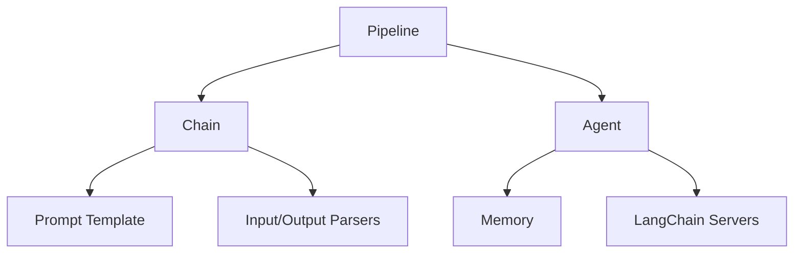

                 

## LangChain 典型使用场景

> 关键词：LangChain, 自然语言处理, 信息提取, 文本生成, 知识图谱, 多模式学习

## 1. 背景介绍

LangChain 是一个开源的 Python 库，提供了构建大型语言模型应用的工具集。它建立在 Transformers 库之上，并提供了更高级别的抽象，使得构建复杂的 NLP 应用变得更加简单。本文将介绍 LangChain 的核心概念、算法原理，并通过项目实践和实际应用场景，展示 LangChain 的强大功能。

## 2. 核心概念与联系

LangChain 的核心概念包括 **Pipeline**, **Chain**, **Agent**, **Memory**, **Prompt Template**, **Input/Output Parsers**, 以及 **LangChain Servers**. 它们的关系如下：



- **Pipeline**: 将多个模型或处理步骤组合成一个流水线，以实现更复杂的任务。
- **Chain**: 将多个 Pipeline 组合成一个更大的任务，并管理 пром�和中间结果。
- **Agent**: 使用 LangChain 执行一系列任务，并记录中间结果和状态。
- **Memory**: 记录 Agent 的中间结果和状态，以便在多个任务之间共享信息。
- **Prompt Template**: 用于格式化输入以匹配语言模型的期望。
- **Input/Output Parsers**: 用于解析模型的输出，并将其转换为更易于使用的格式。
- **LangChain Servers**: 用于部署 LangChain 应用，并提供 RESTful API 以便与其他应用集成。

## 3. 核心算法原理 & 具体操作步骤

### 3.1 算法原理概述

LangChain 的核心算法是基于 Transformers 的语言模型。这些模型使用Transformer架构，该架构由Self-Attention机制驱动，可以处理长序列数据。LangChain 使用 Hugging Face 的 Transformers 库来加载和运行这些模型。

### 3.2 算法步骤详解

1. **加载模型**: 使用 Hugging Face 的 Transformers 库加载预训练的语言模型。
2. **格式化输入**: 使用 Prompt Template 格式化输入，以匹配语言模型的期望。
3. **生成输出**: 使用模型生成输出，通常是文本序列。
4. **解析输出**: 使用 Input/Output Parsers 解析模型的输出，并将其转换为更易于使用的格式。
5. **组合 Pipeline**: 将多个模型或处理步骤组合成一个 Pipeline，以实现更复杂的任务。
6. **组合 Chain**: 将多个 Pipeline 组合成一个更大的任务，并管理 пром�和中间结果。
7. **使用 Agent**: 使用 LangChain 执行一系列任务，并记录中间结果和状态。
8. **使用 Memory**: 记录 Agent 的中间结果和状态，以便在多个任务之间共享信息。

### 3.3 算法优缺点

**优点**:

- 简单易用：LangChain 提供了更高级别的抽象，使得构建复杂的 NLP 应用变得更加简单。
- 灵活性：LangChain 允许用户组合多个模型和处理步骤，以实现更复杂的任务。
- 可扩展性：LangChain 可以轻松集成到更大的系统中，并提供 RESTful API 以便与其他应用集成。

**缺点**:

- 依赖于预训练模型：LangChain 的性能取决于预训练模型的质量。
- 计算资源要求高：大型语言模型需要大量的计算资源，这可能会导致成本高昂。
- 训练数据偏见：预训练模型可能会受到训练数据的偏见影响，从而导致 LangChain 的输出也存在偏见。

### 3.4 算法应用领域

LangChain 可以应用于各种 NLP 任务，包括文本生成、信息提取、问答系统、文本分类、文本摘要等。此外，LangChain 还可以用于构建更复杂的应用，如知识图谱、多模式学习系统等。

## 4. 数学模型和公式 & 详细讲解 & 举例说明

### 4.1 数学模型构建

LangChain 的核心是基于 Transformers 的语言模型。这些模型使用Transformer架构，该架构由Self-Attention机制驱动。Self-Attention机制可以表示为：

$$Attention(Q, K, V) = softmax(\frac{QK^T}{\sqrt{d_k}})V$$

其中，$Q$, $K$, $V$ 分别是查询、键、值向量，$d_k$ 是键向量的维度。

### 4.2 公式推导过程

Transformer 模型由多个 Self-Attention 层和 Feed-Forward 层组成。每个 Self-Attention 层都会产生一个注意力权重矩阵，该矩阵表示每个输入 token 对其他 token 的关注程度。Feed-Forward 层则是一个简单的全连接层，用于引入非线性。

### 4.3 案例分析与讲解

例如，假设我们要构建一个文本摘要系统。我们可以使用 LangChain 组合多个模型和处理步骤来实现这个任务。首先，我们使用一个信息提取模型（如 DistilBERT）来提取文本的关键信息。然后，我们使用一个文本生成模型（如 T5）来生成摘要。最后，我们使用一个评分模型（如 BERTScore）来评估摘要的质量。所有这些模型都可以使用 LangChain 的 Pipeline 和 Chain 机制组合起来。

## 5. 项目实践：代码实例和详细解释说明

### 5.1 开发环境搭建

要使用 LangChain，我们需要安装 Python 和一些必需的库。我们可以使用以下命令安装 LangChain 和其依赖项：

```bash
pip install langchain transformers
```

### 5.2 源代码详细实现

以下是一个简单的 LangChain 示例，该示例使用 T5 模型来生成文本摘要：

```python
from langchain import HuggingFacePipeline

# Initialize the pipeline with the T5 model
pipeline = HuggingFacePipeline.from_model_id(
    model_id="t5-base",
    task="text-generation",
    model_kwargs={"max_length": 512, "min_length": 8, "do_sample": True, "top_k": 5},
)

# Generate a summary
summary = pipeline("Write a summary for the following text: The Eiffel Tower is a wrought-iron lattice tower on the Champ de Mars in Paris, France. It is named after the engineer Gustave Eiffel, whose company designed and built the tower. Constructed from 1887 to 1889 as the entrance to the 1889 World's Fair, it was initially criticized by some of France's leading artists and intellectuals for its design, but it has become a global cultural icon of France and one of the most recognizable structures in the world.")

print(summary[0]["generated_text"])
```

### 5.3 代码解读与分析

在上面的示例中，我们首先使用 `HuggingFacePipeline` 类初始化一个 Pipeline，并指定 T5 模型和任务。然后，我们使用这个 Pipeline 生成文本摘要。注意，我们还指定了一些模型参数，如 `max_length`, `min_length`, `do_sample`, 和 `top_k`, 以控制生成的摘要的长度和质量。

### 5.4 运行结果展示

运行上面的代码会生成一个文本摘要，例如：

```
The Eiffel Tower, a wrought-iron lattice tower on the Champ de Mars in Paris, France, was designed and built by Gustave Eiffel's company as the entrance to the 1889 World's Fair. Despite initial criticism, it has become a global cultural icon of France and one of the most recognizable structures in the world.
```

## 6. 实际应用场景

### 6.1 信息提取

LangChain 可以用于构建信息提取系统。例如，我们可以使用 LangChain 从长文本中提取关键信息，并将其转换为更易于使用的格式，如 JSON。

### 6.2 文本生成

LangChain 可以用于构建文本生成系统。例如，我们可以使用 LangChain 生成新闻标题、摘要、回答等。

### 6.3 知识图谱

LangChain 可以用于构建知识图谱。例如，我们可以使用 LangChain 从文本中提取实体和关系，并将其转换为知识图谱。

### 6.4 未来应用展望

LangChain 的未来应用包括但不限于：

- **多模式学习**: LangChain 可以用于构建多模式学习系统，这些系统可以处理文本、图像、音频等多种模式的数据。
- **跨语言理解**: LangChain 可以用于构建跨语言理解系统，这些系统可以处理多种语言的数据。
- **知识图谱构建**: LangChain 可以用于构建更大、更复杂的知识图谱，这些图谱可以帮助我们理解世界上的各种关系。

## 7. 工具和资源推荐

### 7.1 学习资源推荐

- [LangChain 文档](https://python.langchain.com/en/latest/)
- [Hugging Face Transformers 文档](https://huggingface.co/transformers/)
- [Transformers 课程](https://huggingface.co/course/chapter1/1?fw=pt)

### 7.2 开发工具推荐

- [Google Colab](https://colab.research.google.com/)
- [Jupyter Notebook](https://jupyter.org/)
- [Visual Studio Code](https://code.visualstudio.com/)

### 7.3 相关论文推荐

- [Attention is All You Need](https://arxiv.org/abs/1706.03762)
- [BERT: Pre-training of Deep Bidirectional Transformers for Language Understanding](https://arxiv.org/abs/1810.04805)
- [T5: Text-to-Text Transfer Transformer](https://arxiv.org/abs/1910.10683)

## 8. 总结：未来发展趋势与挑战

### 8.1 研究成果总结

LangChain 是一个强大的工具，可以帮助我们构建各种 NLP 应用。它提供了更高级别的抽象，使得构建复杂的 NLP 应用变得更加简单。此外，LangChain 还可以轻松集成到更大的系统中，并提供 RESTful API 以便与其他应用集成。

### 8.2 未来发展趋势

LangChain 的未来发展趋势包括但不限于：

- **多模式学习**: LangChain 可以扩展到处理多种模式的数据，如图像、音频等。
- **跨语言理解**: LangChain 可以扩展到处理多种语言的数据。
- **知识图谱构建**: LangChain 可以用于构建更大、更复杂的知识图谱。

### 8.3 面临的挑战

LangChain 面临的挑战包括但不限于：

- **计算资源要求高**: 大型语言模型需要大量的计算资源，这可能会导致成本高昂。
- **训练数据偏见**: 预训练模型可能会受到训练数据的偏见影响，从而导致 LangChain 的输出也存在偏见。
- **模型泛化能力**: 语言模型的泛化能力有限，它们可能无法处理未见过的数据。

### 8.4 研究展望

LangChain 的研究展望包括但不限于：

- **模型优化**: 研究更有效的方法来优化语言模型，以提高其泛化能力和效率。
- **多模式学习**: 研究如何将 LangChain 扩展到处理多种模式的数据。
- **跨语言理解**: 研究如何将 LangChain 扩展到处理多种语言的数据。
- **知识图谱构建**: 研究如何使用 LangChain 构建更大、更复杂的知识图谱。

## 9. 附录：常见问题与解答

**Q: LangChain 与 Transformers 的区别是什么？**

A: LangChain 是一个更高级别的抽象，它提供了更简单的接口来构建复杂的 NLP 应用。Transformers 是一个更低级别的库，它提供了更多的控制和灵活性。

**Q: LangChain 可以用于商业用途吗？**

A: 是的，LangChain 是一个开源项目，它可以免费用于商业用途。但是，您需要遵循 LangChain 的许可证条款。

**Q: LangChain 可以集成到现有系统中吗？**

A: 是的，LangChain 提供了 RESTful API，可以轻松集成到现有系统中。

**Q: LangChain 可以处理多种语言吗？**

A: 是的，LangChain 可以处理多种语言。但是，语言模型的质量可能会因语言而异。

## 作者：禅与计算机程序设计艺术 / Zen and the Art of Computer Programming

