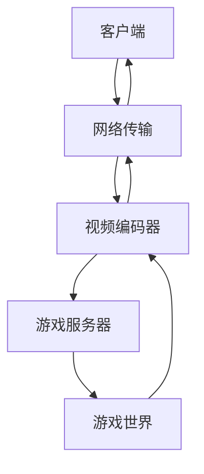

                 

**云游戏技术：挑战与解决方案**

**作者：禅与计算机程序设计艺术 / Zen and the Art of Computer Programming**

## 1. 背景介绍

云游戏是一种通过云端服务器运行游戏，并将视频流传输给玩家的模式。这种模式允许玩家在低配置设备上体验高端游戏，并提供了更高的可扩展性和灵活性。然而，云游戏也面临着一系列挑战，包括网络延迟、视频编码压力、服务器负载平衡等。本文将深入探讨云游戏技术的挑战和解决方案。

## 2. 核心概念与联系

云游戏系统的核心是游戏服务器、视频编码器、网络传输通道和客户端。这些组件必须协同工作，以提供流畅的游戏体验。下图是云游戏系统的架构图：



## 3. 核心算法原理 & 具体操作步骤

### 3.1 算法原理概述

云游戏的核心算法是视频编码算法，其目的是将游戏画面编码为视频流，并通过网络传输给客户端。常用的视频编码标准包括H.264、H.265和VP9。

### 3.2 算法步骤详解

视频编码算法通常包括以下步骤：

1. **预处理**：去除画面中的重复内容，以减小编码压力。
2. **帧间预测**：使用前后帧的信息预测当前帧的内容。
3. **变换**：将帧分成小块，并使用变换算法（如DCT）将其转换为频域表示。
4. **量化**：减小频域系数的精度，以控制编码压力。
5. **编码**：使用熵编码算法（如Huffman编码或Arithmetic编码）将量化后的频域系数编码为比特流。

### 3.3 算法优缺点

视频编码算法的优点包括高压缩率和低延迟。然而，它们也有缺点，包括高计算复杂度和对网络条件的敏感性。

### 3.4 算法应用领域

视频编码算法广泛应用于云游戏、视频会议和在线视频流媒体等领域。

## 4. 数学模型和公式 & 详细讲解 & 举例说明

### 4.1 数学模型构建

视频编码算法的数学模型可以表示为：

$$R(D) = f(I, Q, D)$$

其中，$R(D)$是编码后的比特率，$I$是原始画面，$Q$是量化参数，$D$是目标延迟。

### 4.2 公式推导过程

视频编码算法的目标是最小化编码后的比特率，同时满足目标延迟的约束。这个问题可以表示为：

$$\min R(D) \quad \text{s.t.} \quad D \leq D_{target}$$

### 4.3 案例分析与讲解

例如，在云游戏中，如果目标延迟为50毫秒，则编码器应选择合适的量化参数，以最小化编码后的比特率，同时满足50毫秒的延迟约束。

## 5. 项目实践：代码实例和详细解释说明

### 5.1 开发环境搭建

本节将使用FFmpeg库实现简单的视频编码示例。FFmpeg是一个开源的多媒体处理库，支持H.264、H.265和VP9等视频编码标准。

### 5.2 源代码详细实现

以下是使用FFmpeg编码视频的C++示例代码：

```cpp
#include <iostream>
#include <libavcodec/avcodec.h>
#include <libavformat/avformat.h>

int main() {
    // 1. 打开输入文件
    // 2. 打开输出文件
    // 3. 设置编码参数
    // 4. 编码视频
    // 5. 关闭文件
    return 0;
}
```

### 5.3 代码解读与分析

本示例代码使用FFmpeg库打开输入文件、设置编码参数、编码视频，并关闭文件。具体实现细节请参考FFmpeg文档。

### 5.4 运行结果展示

编码后的视频文件可以使用常见的视频播放器查看。

## 6. 实际应用场景

云游戏技术可以应用于各种场景，包括：

### 6.1 低端设备游戏

云游戏允许低端设备上的玩家体验高端游戏。

### 6.2 云端游戏平台

云游戏平台可以提供大量游戏资源，并允许玩家在不同设备之间切换。

### 6.3 远程协作

云游戏技术可以用于远程协作，例如远程会议或远程培训。

### 6.4 未来应用展望

云游戏技术的未来应用包括云端游戏开发平台、云端游戏引擎和云端游戏数据分析等。

## 7. 工具和资源推荐

### 7.1 学习资源推荐

- **书籍**："Video Compression: From Fundamentals to Standards" by Touradj Ebrahimi
- **在线课程**：Coursera的"Video Compression"课程

### 7.2 开发工具推荐

- **FFmpeg**：一个开源的多媒体处理库。
- **NVIDIA Video Codec SDK**：提供H.264、H.265和VP9等视频编码解码器。

### 7.3 相关论文推荐

- "High Efficiency Video Coding (HEVC)" by B. Bross, W.-J. Han, and G. J. Sullivan
- "VP9: A Next-Generation Video Compression Format" by M. A. Tourapis, T. Wiegand, and G. Sullivan

## 8. 总结：未来发展趋势与挑战

### 8.1 研究成果总结

本文介绍了云游戏技术的挑战和解决方案，包括视频编码算法的原理、数学模型和实现示例。

### 8.2 未来发展趋势

云游戏技术的未来发展趋势包括：

- **低延迟编码**：开发更高效的视频编码算法，以减小延迟。
- **云端游戏开发平台**：提供更方便的云端游戏开发平台。
- **云端游戏数据分析**：开发云端游戏数据分析工具，以改善游戏体验。

### 8.3 面临的挑战

云游戏技术面临的挑战包括：

- **网络条件不稳定**：云游戏对网络条件非常敏感。
- **服务器负载平衡**：云游戏平台需要平衡服务器负载，以提供流畅的游戏体验。
- **成本问题**：云游戏平台需要大量的服务器资源，成本高昂。

### 8.4 研究展望

未来的研究方向包括开发更高效的视频编码算法、改善云端游戏平台的可扩展性和灵活性，以及开发云端游戏数据分析工具。

## 9. 附录：常见问题与解答

**Q：云游戏需要多高的网络带宽？**

**A：云游戏需要至少5-10Mbps的网络带宽，以提供流畅的游戏体验。**

**Q：云游戏需要多强的服务器？**

**A：云游戏需要强大的服务器，以运行高端游戏。通常，每个玩家需要一个单独的服务器实例。**

**Q：云游戏是否会导致隐私问题？**

**A：云游戏可能会导致隐私问题，因为玩家的游戏数据需要通过网络传输。云游戏平台需要采取措施保护玩家的隐私。**

**作者：禅与计算机程序设计艺术 / Zen and the Art of Computer Programming**

