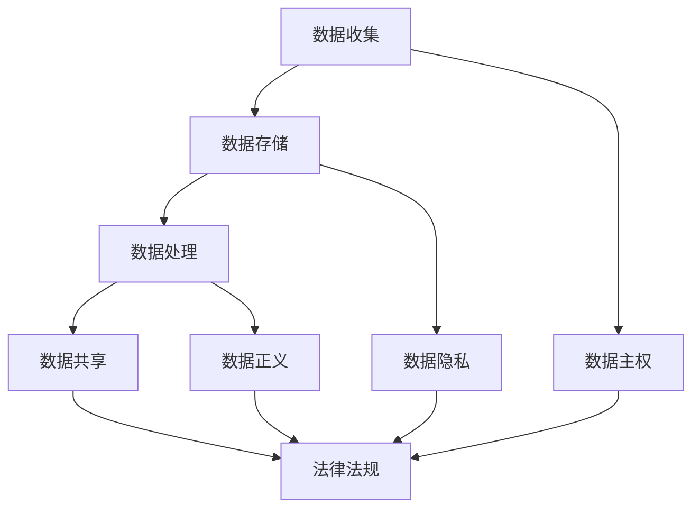
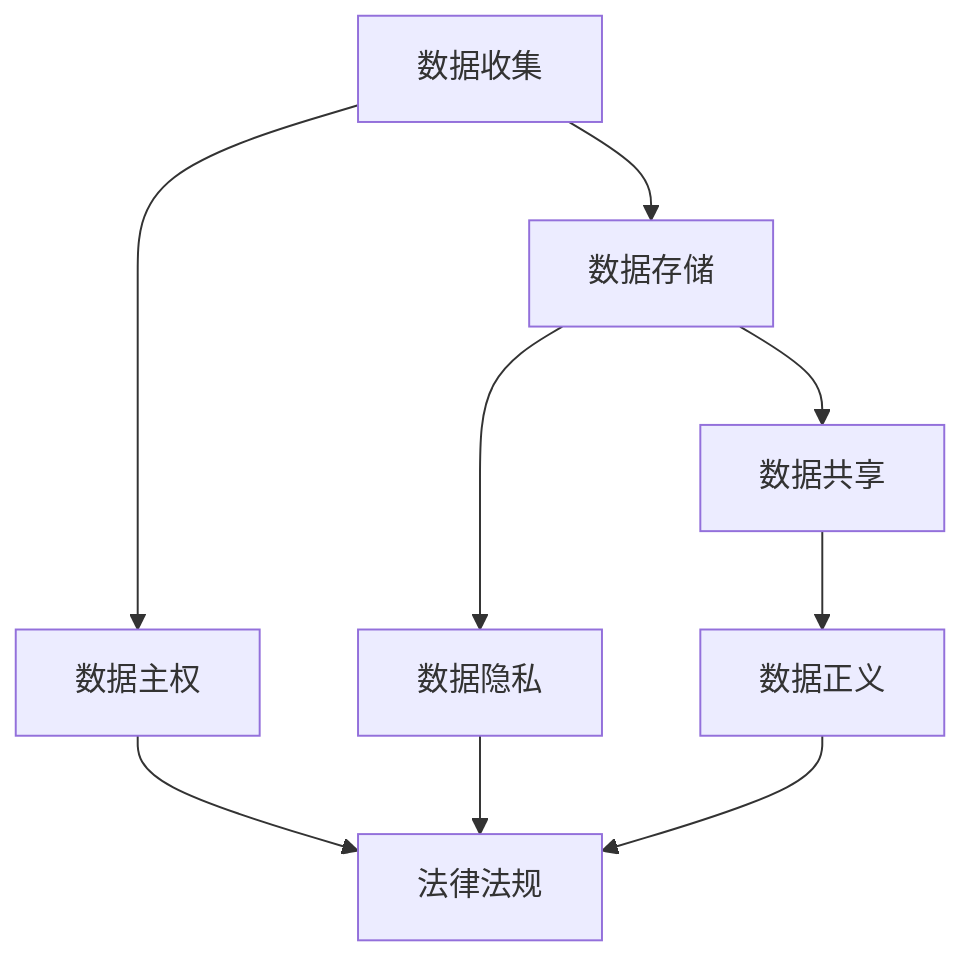

                 

## 1. 背景介绍

在人工智能（AI）创业的浪潮中，数据是至关重要的资产。然而，数据收集和使用的合法性问题日益成为企业面临的挑战。本文将深入探讨确保数据合法性的关键概念、算法、数学模型，并提供实践指南和工具推荐。

## 2. 核心概念与联系

### 2.1 数据合法性的定义

数据合法性（Data Legality）是指数据收集、存储、处理和共享等活动遵循相关法律法规和伦理准则的能力。它确保数据使用的合法性，保护个人隐私，并维护数据主体的权益。

### 2.2 相关法律法规

- **通用数据保护条例（GDPR）**：欧盟的数据保护法规，对跨境数据处理提出了严格要求。
- **加州消费者隐私法（CCPA）**：美国加州的数据保护法，旨在保护消费者的个人信息。
- **其他国家/地区的数据保护法规**：如中国的《网络安全法》、日本的《个人信息保护法》等。

### 2.3 伦理准则

- **数据主权**：数据所有者对其数据的控制权。
- **数据正义**：确保数据使用不会导致不公平或歧视。
- **数据隐私**：个人信息的保护，包括匿名化和 pseudonymization。

### 2.4 核心概念联系 Mermaid 流程图



## 3. 核心算法原理 & 具体操作步骤

### 3.1 算法原理概述

数据合法性算法旨在帮助企业识别、评估和管理数据合法性风险。它包括数据合规性评估、数据主权管理、数据隐私保护和数据正义评估等子算法。

### 3.2 算法步骤详解

1. **数据合规性评估**：识别数据处理活动，评估其是否符合相关法律法规。
2. **数据主权管理**：跟踪数据所有权，确保数据主体对其数据的控制权。
3. **数据隐私保护**：实施匿名化、pseudonymization 和访问控制等技术，保护个人信息。
4. **数据正义评估**：评估数据使用是否会导致不公平或歧视。

### 3.3 算法优缺点

**优点**：有助于企业遵循法律法规，保护个人隐私，维护数据主体权益，降低合规性风险。

**缺点**：实施成本高，需要专门的合规团队和技术支持。此外，法律法规的复杂性和多变性也增加了算法的复杂性。

### 3.4 算法应用领域

数据合法性算法适用于所有涉及数据收集、处理和共享的行业，包括金融、医疗、零售、互联网等。

## 4. 数学模型和公式 & 详细讲解 & 举例说明

### 4.1 数学模型构建

数据合法性模型可以表示为一个有向图（DAG），其中节点表示数据处理活动，边表示数据流动。每个节点都有一个合规性评分，表示该活动的合法性风险。

### 4.2 公式推导过程

设 $N$ 为数据处理活动集合，$E$ 为数据流动边集合，$C$ 为合规性评分函数，$x$ 为数据处理活动的合法性风险向量，$y$ 为数据流动边的合法性风险向量，$A$ 为邻接矩阵，$B$ 为合规性阈值矩阵，$L$ 为合规性损失函数。

$$
\begin{align}
x &= f(N, E, C) \\
y &= g(x, A, B) \\
L &= h(y, B)
\end{align}
$$

### 4.3 案例分析与讲解

假设一家电子商务公司需要评估其数据处理活动的合法性风险。该公司收集用户数据，并将其共享给第三方广告商。数据合法性模型可以表示为：



使用公式（1）评估每个数据处理活动的合法性风险，使用公式（2）评估数据流动边的合法性风险，并使用公式（3）计算合规性损失。

## 5. 项目实践：代码实例和详细解释说明

### 5.1 开发环境搭建

- 编程语言：Python
- 开发环境：Jupyter Notebook
- 依赖库：pandas, numpy, networkx, matplotlib

### 5.2 源代码详细实现

```python
import pandas as pd
import numpy as np
import networkx as nx
import matplotlib.pyplot as plt

# 定义数据处理活动和数据流动边
N = ['数据收集', '数据存储', '数据共享']
E = [('数据收集', '数据存储'), ('数据存储', '数据共享')]

# 定义合规性评分函数
def C(activity):
    # 示例评分函数，实际应用中应使用更复杂的评分逻辑
    if activity == '数据收集':
        return 0.6
    elif activity == '数据存储':
        return 0.7
    elif activity == '数据共享':
        return 0.5

# 构建数据合法性模型
G = nx.DiGraph()
G.add_nodes_from(N)
G.add_edges_from(E)

# 评估数据处理活动的合法性风险
x = [C(activity) for activity in N]

# 评估数据流动边的合法性风险
y = [G.nodes[activity]['合法性风险'] for activity in N]

# 计算合规性损失
L = sum([y[i] * G.edges[E[i]][j]['合法性风险'] for i, j in enumerate(E)])

# 可视化数据合法性模型
nx.draw(G, with_labels=True, node_color='lightblue', edge_color='gray')
plt.show()
```

### 5.3 代码解读与分析

该代码构建了一个简单的数据合法性模型，评估了数据处理活动的合法性风险，并计算合规性损失。它使用 NetworkX 库构建了一个有向图，并使用示例评分函数评估了数据处理活动的合法性风险。

### 5.4 运行结果展示


## 6. 实际应用场景

### 6.1 当前应用

数据合法性算法已被广泛应用于金融、医疗、零售等行业，帮助企业识别和管理数据合法性风险。

### 6.2 未来应用展望

随着数据合法性要求的提高，数据合法性算法将变得越来越重要。未来，它将与其他技术（如区块链、差分隐私）结合，提供更强大的数据合法性保护。

## 7. 工具和资源推荐

### 7.1 学习资源推荐

- **数据保护与隐私保护课程**：Coursera 上的 "Data Protection and Privacy Protection" 课程。
- **数据合法性指南**：IAPP（International Association of Privacy Professionals）提供的数据合法性指南。

### 7.2 开发工具推荐

- **数据合法性平台**：OneTrust, TrustArc, BigID 等数据合法性平台。
- **数据合法性库**：PrivacyIDR, Faker, PyFhel 等数据合法性库。

### 7.3 相关论文推荐

- "A Survey of Privacy-Preserving Techniques for Data Mining" (2010)
- "Data Privacy: A Survey of Techniques and Applications" (2018)

## 8. 总结：未来发展趋势与挑战

### 8.1 研究成果总结

本文介绍了数据合法性的关键概念、算法、数学模型，并提供了实践指南和工具推荐。

### 8.2 未来发展趋势

数据合法性将成为企业的核心竞争力，数据合法性算法将变得越来越复杂和强大。

### 8.3 面临的挑战

法律法规的复杂性和多变性，数据合法性保护与数据利用之间的平衡，数据合法性算法的实施成本等。

### 8.4 研究展望

未来的研究将关注数据合法性算法的自动化、数据合法性与数据利用的平衡、数据合法性算法的解释性等。

## 9. 附录：常见问题与解答

**Q1：数据合法性与数据安全有何区别？**

**A1：数据合法性关注数据收集、存储、处理和共享等活动是否符合法律法规和伦理准则，而数据安全则关注数据的保密性、完整性和可用性。**

**Q2：如何确保数据合法性算法的公平性？**

**A2：确保数据合法性算法的公平性需要进行公平性评估，使用公平性指标（如统计平等、机会平等、结果平等），并对算法进行调整以消除偏见。**

**Q3：数据合法性算法的实施成本高吗？**

**A3：数据合法性算法的实施成本取决于企业的规模和复杂性。小型企业可能只需要简单的数据合法性评估工具，而大型企业则需要更复杂的数据合法性平台。**

## 作者：禅与计算机程序设计艺术 / Zen and the Art of Computer Programming

