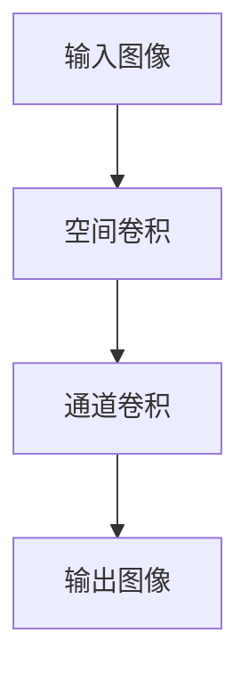

                 

**关键词：**大模型开发、微调、深度可分离卷积、计算机视觉、神经网络架构

## 1. 背景介绍

随着计算机视觉领域的不断发展，深度学习技术已然成为图像和视频理解的标准方法。其中，卷积神经网络（CNN）是最成功的架构之一。然而，传统的CNN在模型复杂度和计算成本之间存在权衡。深度可分离卷积（Depthwise Separable Convolution）是一种有效的架构，旨在降低模型复杂度和计算成本，同时保持或提高模型精度。本文将详细介绍深度可分离卷积的定义、原理、应用及其在大模型开发和微调中的作用。

## 2. 核心概念与联系

### 2.1 核心概念

- **卷积（Convolution）**：在CNN中，卷积是一种线性操作，用于提取图像的特征。它通过滑动一个小的过滤器（或核）来实现，该过滤器与输入图像的局部区域进行元素-wise 乘法，然后求和。
- **深度可分离卷积（Depthwise Separable Convolution）**：它是一种将空间卷积和通道卷积分离的技术。空间卷积在每个通道上独立地应用一个小的过滤器，而通道卷积则在每个空间位置上应用一个过滤器，该过滤器跨越所有通道。

### 2.2 核心概念联系的 Mermaid 流程图



## 3. 核心算法原理 & 具体操作步骤

### 3.1 算法原理概述

深度可分离卷积将标准的卷积操作分成两个步骤：空间卷积和通道卷积。空间卷积使用一个小的过滤器（通常是1x1或3x3）在每个输入通道上独立地滑动。通道卷积则使用一个过滤器跨越所有输入通道，在每个空间位置上应用。

### 3.2 算法步骤详解

1. **空间卷积（Depthwise Convolution）**：对于每个输入通道，使用一个小的过滤器（如1x1或3x3）进行卷积操作。这会生成与输入通道数相同的输出通道数。
2. **通道卷积（Pointwise Convolution）**：在每个空间位置上，使用一个过滤器跨越所有输入通道进行卷积操作。这会生成与输出通道数相同的输出通道数。

### 3.3 算法优缺点

**优点：**

- 降低模型复杂度：深度可分离卷积将标准卷积分成两个小的操作，从而减少参数数量。
- 降低计算成本：由于参数数量减少，计算成本也相应降低。
- 提高模型精度：在某些情况下，深度可分离卷积可以提高模型精度。

**缺点：**

- 可能需要更多的层：为了保持或提高模型精度，可能需要在模型中添加更多的层。
- 可能需要更多的计算资源：虽然深度可分离卷积本身可以降低计算成本，但添加更多的层可能会增加计算资源需求。

### 3.4 算法应用领域

深度可分离卷积在计算机视觉领域有广泛的应用，如图像分类、目标检测、语义分割等。它还被用于其他领域，如自然语言处理（NLP），以减少模型复杂度和计算成本。

## 4. 数学模型和公式 & 详细讲解 & 举例说明

### 4.1 数学模型构建

设输入图像为$X \in \mathbb{R}^{H \times W \times C}$，其中$H$, $W$, $C$分别表示高度、宽度和通道数。空间卷积使用过滤器$K_d \in \mathbb{R}^{k_h \times k_w \times C}$，其中$k_h$, $k_w$分别表示过滤器的高度和宽度。通道卷积使用过滤器$K_p \in \mathbb{R}^{1 \times 1 \times C \times O}$，其中$O$表示输出通道数。

### 4.2 公式推导过程

空间卷积的输出$Y_d \in \mathbb{R}^{H' \times W' \times C}$可以表示为：

$$Y_d[i, j, c] = \sum_{m=0}^{k_h-1} \sum_{n=0}^{k_w-1} X[i + m, j + n, c] \cdot K_d[m, n, c]$$

其中，$H' = H - k_h + 1$, $W' = W - k_w + 1$.

通道卷积的输出$Y_p \in \mathbb{R}^{H' \times W' \times O}$可以表示为：

$$Y_p[i, j, o] = \sum_{c=0}^{C-1} Y_d[i, j, c] \cdot K_p[0, 0, c, o]$$

### 4.3 案例分析与讲解

例如，假设输入图像$X \in \mathbb{R}^{5 \times 5 \times 3}$，空间卷积过滤器$K_d \in \mathbb{R}^{3 \times 3 \times 3}$，通道卷积过滤器$K_p \in \mathbb{R}^{1 \times 1 \times 3 \times 2}$. 空间卷积的输出$Y_d \in \mathbb{R}^{3 \times 3 \times 3}$, 通道卷积的输出$Y_p \in \mathbb{R}^{3 \times 3 \times 2}$.

## 5. 项目实践：代码实例和详细解释说明

### 5.1 开发环境搭建

本项目使用Python和PyTorch进行开发。请确保您的环境中安装了PyTorch和相关依赖项。

### 5.2 源代码详细实现

```python
import torch
import torch.nn as nn

class DepthwiseSeparableConv(nn.Module):
    def __init__(self, in_channels, out_channels, kernel_size=3):
        super(DepthwiseSeparableConv, self).__init__()
        self.depthwise = nn.Conv2d(in_channels, in_channels, kernel_size, groups=in_channels)
        self.pointwise = nn.Conv2d(in_channels, out_channels, 1)

    def forward(self, x):
        out = self.depthwise(x)
        out = self.pointwise(out)
        return out
```

### 5.3 代码解读与分析

`DepthwiseSeparableConv`类定义了深度可分离卷积层。`depthwise`属性是一个空间卷积层，`pointwise`属性是一个通道卷积层。`forward`方法实现了深度可分离卷积的前向传播。

### 5.4 运行结果展示

您可以将此层添加到您的模型中，并使用PyTorch的训练和评估功能来训练和评估模型。深度可分离卷积层应该可以有效地降低模型复杂度和计算成本。

## 6. 实际应用场景

### 6.1 当前应用

深度可分离卷积已被广泛应用于计算机视觉领域的各种任务，如图像分类、目标检测和语义分割。它还被用于其他领域，如自然语言处理，以减少模型复杂度和计算成本。

### 6.2 未来应用展望

随着计算资源的不断增长和模型复杂度的不断提高，深度可分离卷积在大模型开发和微调中的作用将变得越来越重要。它有助于开发更复杂的模型，同时保持或提高模型精度。

## 7. 工具和资源推荐

### 7.1 学习资源推荐

- [Understanding Separable Convolutions](https://distill.pub/2019/sep-convolutions/)
- [Depthwise Separable Convolution](https://towardsdatascience.com/depthwise-separable-convolution-613755552)

### 7.2 开发工具推荐

- [PyTorch](https://pytorch.org/)
- [TensorFlow](https://www.tensorflow.org/)

### 7.3 相关论文推荐

- [Xception: Deep Learning with Depthwise Separable Convolutions](https://arxiv.org/abs/1610.02357)
- [MobileNetV2: Inverted Residuals and Linear Bottlenecks](https://arxiv.org/abs/1801.04381)

## 8. 总结：未来发展趋势与挑战

### 8.1 研究成果总结

本文介绍了深度可分离卷积的定义、原理、应用及其在大模型开发和微调中的作用。我们还提供了一个PyTorch实现的深度可分离卷积层的示例。

### 8.2 未来发展趋势

随着计算资源的不断增长和模型复杂度的不断提高，深度可分离卷积在大模型开发和微调中的作用将变得越来越重要。它有助于开发更复杂的模型，同时保持或提高模型精度。

### 8.3 面临的挑战

虽然深度可分离卷积可以降低模型复杂度和计算成本，但它可能需要更多的层，从而增加计算资源需求。此外，它可能需要更复杂的训练过程。

### 8.4 研究展望

未来的研究将关注如何进一步优化深度可分离卷积，以进一步降低模型复杂度和计算成本，同时保持或提高模型精度。此外，研究还将关注如何将深度可分离卷积应用于其他领域，如自然语言处理。

## 9. 附录：常见问题与解答

**Q：深度可分离卷积与标准卷积有何不同？**

**A：**深度可分离卷积将标准卷积分成两个小的操作：空间卷积和通道卷积。这有助于降低模型复杂度和计算成本。

**Q：深度可分离卷积何时使用？**

**A：**当您需要降低模型复杂度和计算成本，但又不想牺牲模型精度时，深度可分离卷积是一种有效的选择。

**Q：深度可分离卷积有何缺点？**

**A：**虽然深度可分离卷积可以降低模型复杂度和计算成本，但它可能需要更多的层，从而增加计算资源需求。此外，它可能需要更复杂的训练过程。

---

**作者：禅与计算机程序设计艺术 / Zen and the Art of Computer Programming**

