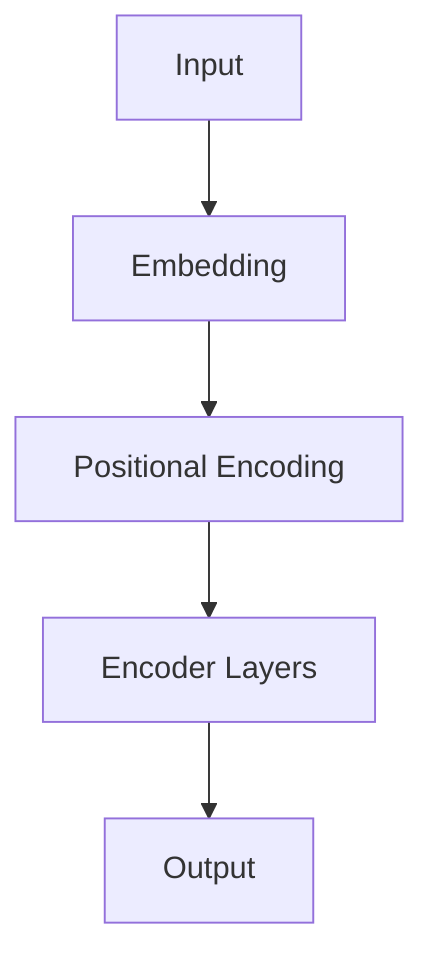

                 

**大模型**, **编码器**, **微调**, **Transformer**, **BERT**, **RoBERTa**, **ALBERT**, **DistilBERT**, **T5**

## 1. 背景介绍

在当今的自然语言处理（NLP）领域，大模型已经成为主流。这些模型通过在大规模数据集上进行预训练，学习到丰富的语言表示，并能够在各种下游任务上取得出色的表现。编码器是大模型的核心组成部分，负责将输入序列转换为表示序列。本文将详细介绍如何从零开始开发和微调编码器模型。

## 2. 核心概念与联系

### 2.1 编码器的作用

编码器负责将输入序列转换为表示序列，这些表示序列可以用于各种下游任务，如分类、标注、生成等。编码器通常基于**Transformer**架构，使用自注意力机制（Self-Attention）和 Feed-Forward 网络（FFN）构建。

### 2.2 Transformer 架构


上图展示了 Transformer 模型的架构，包括输入嵌入、位置编码、编码器块（Encoder Layer）和解码器块（Decoder Layer）。编码器块由多个自注意力子层和 Feed-Forward 子层组成。

### 2.3 Mermaid 流程图



## 3. 核心算法原理 & 具体操作步骤

### 3.1 算法原理概述

编码器的核心是**自注意力机制**和**Feed-Forward 网络**。自注意力机制允许模型在处理序列时考虑到序列中的其他位置，而 Feed-Forward 网络则为模型提供了非线性变换能力。

### 3.2 算法步骤详解

1. **输入嵌入（Input Embedding）**：将输入序列中的 token 映射为向量表示。
2. **位置编码（Positional Encoding）**：为序列中的每个位置添加位置信息，以保持序列的顺序信息。
3. **编码器块（Encoder Layer）**：由多个自注意力子层和 Feed-Forward 子层组成。每个子层都会对输入进行变换，并使用残差连接和层规范化（Layer Normalization）来稳定训练过程。
4. **输出（Output）**：编码器块的输出就是表示序列。

### 3.3 算法优缺点

**优点**：
- 可以处理长序列，不受序列长度的限制。
- 可以并行计算，提高训练速度。

**缺点**：
- 计算复杂度高，需要大量的计算资源。
- 训练过程不稳定，容易出现梯度消失或爆炸的问题。

### 3.4 算法应用领域

编码器模型广泛应用于各种 NLP 任务，如文本分类、命名实体识别、文本生成等。此外，编码器还可以用于图像、视频等其他领域的表示学习。

## 4. 数学模型和公式 & 详细讲解 & 举例说明

### 4.1 数学模型构建

编码器模型的数学模型可以表示为：

$$h = f(x, W, b)$$

其中，$x$ 是输入序列，$W$ 和 $b$ 分别是权重和偏置参数，$f$ 是模型的非线性变换函数。

### 4.2 公式推导过程

自注意力机制的数学推导过程如下：

1. **查询（Query）、键（Key）和值（Value）的计算**：

$$Q = xW^Q, \quad K = xW^K, \quad V = xW^V$$

其中，$W^Q$, $W^K$ 和 $W^V$ 分别是查询、键和值的权重参数。

2. **注意力分数的计算**：

$$score = \frac{QK^T}{\sqrt{d_k}}$$

其中，$d_k$ 是键的维度。

3. **注意力权重的计算**：

$$attention\_weights = softmax(score)$$

4. **注意力输出的计算**：

$$output = attention\_weights \cdot V$$

### 4.3 案例分析与讲解

假设输入序列为 ["the", "quick", "brown", "fox", "jumps", "over", "the", "lazy", "dog"]，则自注意力机制会计算每个 token 与序列中其他位置的 token 之间的注意力权重，从而生成表示序列。

## 5. 项目实践：代码实例和详细解释说明

### 5.1 开发环境搭建

- Python 3.7+
- PyTorch 1.7+
- Transformers library（Hugging Face）

### 5.2 源代码详细实现

```python
from transformers import BertTokenizer, BertModel

tokenizer = BertTokenizer.from_pretrained('bert-base-uncased')
model = BertModel.from_pretrained('bert-base-uncased')

inputs = tokenizer("Hello, I'm a transformer!", return_tensors="pt")
outputs = model(**inputs)
```

### 5.3 代码解读与分析

上述代码首先加载预训练的 BERT 模型和分词器，然后对输入序列进行分词和编码，最后使用模型生成表示序列。

### 5.4 运行结果展示

运行上述代码后，`outputs.last_hidden_state` 将包含表示序列，其形状为 `(1, 7, 768)`，其中 `1` 表示批量大小，`7` 表示序列长度，`768` 表示隐藏状态的维度。

## 6. 实际应用场景

### 6.1 文本分类

编码器模型可以用于文本分类任务，如情感分析、文本分类等。只需将表示序列输入到一个全连接层和 softmax 函数中，即可得到分类结果。

### 6.2 文本生成

编码器模型也可以用于文本生成任务，如机器翻译、文本摘要等。只需将表示序列输入到解码器中，即可生成目标序列。

### 6.3 未来应用展望

随着计算资源的不断提升，大模型的规模也在不断扩大。未来，编码器模型有望在更多领域得到应用，如图像、视频等领域的表示学习。

## 7. 工具和资源推荐

### 7.1 学习资源推荐

- "Attention is All You Need" 论文：<https://arxiv.org/abs/1706.03762>
- "BERT: Pre-training of Deep Bidirectional Transformers for Language Understanding" 论文：<https://arxiv.org/abs/1810.04805>
- Transformers library（Hugging Face）：<https://huggingface.co/transformers/>

### 7.2 开发工具推荐

- PyTorch：<https://pytorch.org/>
- TensorFlow：<https://www.tensorflow.org/>
- Jupyter Notebook：<https://jupyter.org/>

### 7.3 相关论文推荐

- "RoBERTa: A Robustly Optimized BERT Pretraining Approach" 论文：<https://arxiv.org/abs/1907.11692>
- "ALBERT: A Lite BERT for Self-supervised Learning of Language Representations" 论文：<https://arxiv.org/abs/1909.11942>
- "DistilBERT, a distilled version of BERT: smaller, faster, cheaper and lighter" 论文：<https://arxiv.org/abs/1910.01108>
- "Exploring the Limits of Transfer Learning with a Pre-trained Transformer Model" 论文：<https://arxiv.org/abs/1910.10683>

## 8. 总结：未来发展趋势与挑战

### 8.1 研究成果总结

本文介绍了如何从零开始开发和微调编码器模型。我们讨论了编码器的核心概念、算法原理、数学模型和公式，并提供了项目实践的代码实例。

### 8.2 未来发展趋势

未来，编码器模型有望在更多领域得到应用，如图像、视频等领域的表示学习。此外，模型的规模也将不断扩大，以提高模型的表示能力。

### 8.3 面临的挑战

然而，编码器模型也面临着计算复杂度高、训练过程不稳定等挑战。如何提高模型的训练效率和稳定性，是当前和未来需要解决的关键问题。

### 8.4 研究展望

我们期待未来的研究能够在以下几个方向取得突破：

- 更有效的预训练方法。
- 更好的微调技术。
- 更广泛的应用领域。

## 9. 附录：常见问题与解答

**Q：如何选择合适的编码器模型？**

**A：这取决于您的任务和数据。如果您的任务是文本分类，那么 BERT 可能是一个不错的选择。如果您的任务是机器翻译，那么 Transformer 可能更合适。您需要根据任务和数据选择合适的模型。**

**Q：如何微调编码器模型？**

**A：微调编码器模型的过程类似于训练其他模型。您需要在下游任务的数据集上训练模型，并使用交叉熵损失函数和 Adam 优化器。**

**Q：如何评估编码器模型的性能？**

**A：这取决于您的任务。如果您的任务是文本分类，那么准确率可能是一个合适的评估指标。如果您的任务是机器翻译，那么 BLEU 分数可能更合适。您需要根据任务选择合适的评估指标。**

## 作者：禅与计算机程序设计艺术 / Zen and the Art of Computer Programming

