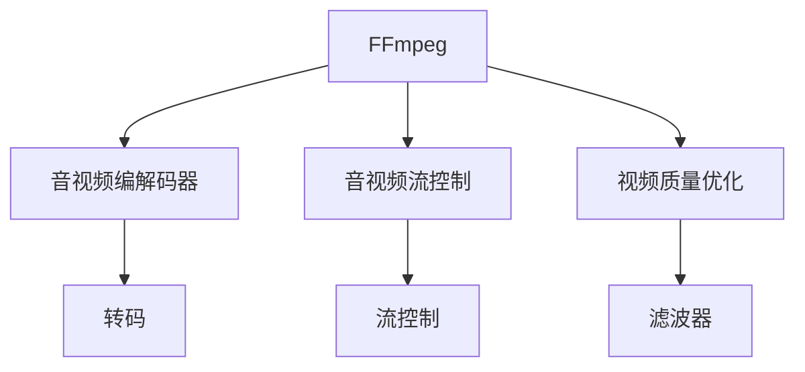

                 

# FFmpeg 视频处理：转码和过滤

> 关键词：FFmpeg, 视频转码, 视频过滤, 音视频编解码, 视频质量优化, 音视频流控制

## 1. 背景介绍

FFmpeg 是一个开源的音视频编解码库，广泛应用于各种音视频处理场景，包括视频转码、过滤、编辑、直播等。其支持超过百种音视频编解码器，能够高效地处理各种格式的音视频文件。本文将详细介绍 FFmpeg 在视频转码和过滤方面的核心概念和操作技巧，帮助读者更好地使用 FFmpeg 处理音视频资源。

### 1.1 问题由来

在现代社会中，音视频数据的处理需求日益增加。从家庭娱乐到企业会议，再到在线教育，音视频文件的格式和编码方式千差万别，如何在不同设备和平台之间进行高效、可靠的音视频转换和处理，成为当前数字化转型的重要任务之一。

为了应对这一需求，FFmpeg 应运而生。其基于多种开源协议，支持多种视频编码格式，具备强大的音视频编解码能力和流控制能力。本文将详细解析 FFmpeg 的核心算法原理和具体操作步骤，帮助读者更好地理解和使用 FFmpeg。

### 1.2 问题核心关键点

FFmpeg 的核心技术包括音视频编解码器、音视频流控制、视频质量优化等。本文将聚焦于以下核心问题：
1. 视频转码：如何将一种视频格式转换为另一种格式，以适应不同的播放设备？
2. 视频过滤：如何通过过滤操作，去除视频中不必要的元素，提升视频质量？
3. 音视频编解码：FFmpeg 如何高效地编解码音视频数据，保证数据格式的一致性和稳定性？

## 2. 核心概念与联系

### 2.1 核心概念概述

为了更好地理解 FFmpeg 视频处理，本节将介绍几个密切相关的核心概念：

- **FFmpeg**：FFmpeg 是一个开源的音视频处理工具集，由 VideoLAN 社区维护。支持超过百种音视频编解码器，包括 H.264、H.265、MP3、AAC 等。
- **音视频编解码器**：用于将原始音视频数据转换为可被播放的格式，或者将格式转换为原始数据的过程。FFmpeg 支持各种编解码器，包括视频编解码器和音频编解码器。
- **音视频流控制**：用于控制音视频流的传输和播放过程，包括帧率控制、码率控制、音视频同步等。
- **视频质量优化**：通过多种技术手段，如编码参数优化、分辨率调整、滤波器应用等，提升视频的质量和稳定性。

这些核心概念之间的逻辑关系可以通过以下 Mermaid 流程图来展示：



这个流程图展示了 FFmpeg 的核心概念及其之间的关系：

1. FFmpeg 通过音视频编解码器对原始音视频数据进行编解码。
2. 音视频流控制模块用于控制音视频流的传输和播放。
3. 视频质量优化模块通过多种手段提升视频质量。
4. 转码模块将一种格式的视频转换为另一种格式，便于在不同的设备和平台之间播放。
5. 滤波器模块通过去除不必要的元素，提升视频质量。

这些概念共同构成了 FFmpeg 视频处理的框架，使其能够在各种场景下提供高效、稳定的音视频处理能力。通过理解这些核心概念，我们可以更好地把握 FFmpeg 的工作原理和优化方向。

## 3. 核心算法原理 & 具体操作步骤

### 3.1 算法原理概述

FFmpeg 视频处理的核心算法主要涉及音视频编解码、流控制和视频质量优化等方面。本文将详细介绍这些核心算法的原理。

#### 3.1.1 音视频编解码算法

音视频编解码算法是 FFmpeg 视频处理的核心。其核心思想是通过将原始音视频数据转换为压缩后的数据，以适应不同的设备和平台。FFmpeg 支持多种编解码器，如 H.264、H.265、VP9、VP8 等，每一种编解码器都有其独特的压缩算法和参数设置。

#### 3.1.2 音视频流控制算法

音视频流控制算法用于控制音视频流的传输和播放过程。FFmpeg 通过控制帧率和码率，确保音视频流的稳定传输。常见的流控制参数包括：

- **帧率**：用于控制视频帧的传输速度，常见的帧率有 30fps、60fps 等。
- **码率**：用于控制视频流的传输速度，常见的码率有 300kbps、500kbps 等。
- **音视频同步**：用于确保音视频流的同步播放，防止音视频不同步。

#### 3.1.3 视频质量优化算法

视频质量优化算法用于提升视频的质量和稳定性。FFmpeg 通过多种手段，如编码参数优化、分辨率调整、滤波器应用等，提升视频的质量。常见的视频质量优化参数包括：

- **编码参数**：用于调整编解码器的压缩质量，常见的编码参数有 VBR、CBR 等。
- **分辨率**：用于调整视频的分辨率，常见的分辨率有 720p、1080p、2K 等。
- **滤波器**：用于去除视频中不必要的元素，提升视频质量，常见的滤波器有 deblock、gaussian、hqv 等。

### 3.2 算法步骤详解

FFmpeg 视频处理的流程包括以下几个关键步骤：

#### 3.2.1 音视频编解码步骤

1. **选择编解码器**：根据原始视频格式和目标播放设备，选择适合的编解码器。
2. **设置编解码参数**：根据需求设置编解码器的参数，如帧率、码率、编码方式等。
3. **编解码视频数据**：使用所选编解码器对原始视频数据进行编解码，生成压缩后的视频数据。

#### 3.2.2 音视频流控制步骤

1. **设置流控制参数**：根据需求设置流控制参数，如帧率、码率、音视频同步等。
2. **控制音视频流**：使用流控制算法对音视频流进行控制，确保其稳定传输。
3. **调整流控制参数**：根据实际播放情况，动态调整流控制参数，保证音视频流的质量。

#### 3.2.3 视频质量优化步骤

1. **选择质量优化参数**：根据需求选择视频质量优化参数，如编码参数、分辨率、滤波器等。
2. **应用质量优化参数**：对视频数据应用所选质量优化参数，提升视频质量。
3. **评估优化效果**：对优化后的视频数据进行评估，确保其质量和稳定性。

### 3.3 算法优缺点

FFmpeg 视频处理具有以下优点：

1. **高效性**：FFmpeg 支持多种编解码器和流控制算法，能够高效地处理各种格式的音视频文件。
2. **稳定性**：FFmpeg 通过多种质量优化手段，确保音视频流的稳定传输和高质量播放。
3. **灵活性**：FFmpeg 支持多种参数设置，能够根据需求灵活调整音视频处理流程。

同时，FFmpeg 也存在以下缺点：

1. **复杂性**：FFmpeg 的配置参数较多，需要进行一定的学习和实践才能掌握。
2. **依赖性**：FFmpeg 依赖各种编解码器和音视频格式库，需要根据不同的设备和平台进行配置。
3. **性能开销**：FFmpeg 在处理高分辨率、高码率的视频时，可能会带来较大的性能开销。

### 3.4 算法应用领域

FFmpeg 在音视频处理领域具有广泛的应用，覆盖了几乎所有常见任务，例如：

- **视频转码**：将一种格式的视频转换为另一种格式，以适应不同的播放设备。如将 MP4 转换为 AVI，或将 1080p 转换为 720p。
- **视频过滤**：通过滤波器去除视频中不必要的元素，提升视频质量。如去除视频的噪声，或进行边缘增强等。
- **音视频编解码**：对音视频数据进行编解码，保证数据格式的一致性和稳定性。如将 MP3 转换为 AAC，或将 WAV 转换为 MP3。
- **音视频流控制**：控制音视频流的传输和播放过程，包括帧率控制、码率控制、音视频同步等。
- **视频质量优化**：通过多种技术手段，如编码参数优化、分辨率调整、滤波器应用等，提升视频的质量和稳定性。

除了上述这些经典任务外，FFmpeg 还创新性地应用于更多场景中，如视频会议、远程教育、直播回放等，为音视频处理提供了新的解决方案。随着 FFmpeg 和音视频编解码技术的发展，相信其在音视频处理领域的应用还将不断扩展，为数字化转型的各个环节提供更强大的支持。

## 4. 数学模型和公式 & 详细讲解  
### 4.1 数学模型构建

本节将使用数学语言对 FFmpeg 音视频编解码的数学原理进行详细阐述。

设原始音视频数据为 $V$，目标编解码器为 $C$，编解码参数为 $P$，则编解码过程的数学模型可以表示为：

$$ V' = C(V, P) $$

其中 $V'$ 表示编解码后的音视频数据，$P$ 表示编解码器的参数。在实际应用中，$P$ 通常包括帧率、码率、编码方式等。

### 4.2 公式推导过程

#### 4.2.1 音视频编解码的数学模型

以 H.264 编解码器为例，其编解码过程可以表示为：

$$ V' = H(V, QP) $$

其中 $QP$ 表示量化参数，用于控制编解码质量。编解码过程具体如下：

1. **编码过程**：将原始音视频数据 $V$ 转换为压缩后的数据 $V'$。
2. **解码过程**：将压缩后的数据 $V'$ 解压缩为原始音视频数据 $V'$。

#### 4.2.2 音视频流控制的数学模型

音视频流控制的数学模型可以表示为：

$$ F = C'(V, P') $$

其中 $F$ 表示音视频流，$P'$ 表示流控制参数，包括帧率、码率、音视频同步等。流控制过程具体如下：

1. **帧率控制**：根据需求设置帧率，控制视频帧的传输速度。
2. **码率控制**：根据需求设置码率，控制视频流的传输速度。
3. **音视频同步**：确保音视频流的同步播放，防止音视频不同步。

#### 4.2.3 视频质量优化的数学模型

视频质量优化的数学模型可以表示为：

$$ Q(V', P'') = C''(V', P'') $$

其中 $Q$ 表示视频质量，$P''$ 表示质量优化参数，包括编码参数、分辨率、滤波器等。视频质量优化过程具体如下：

1. **编码参数优化**：根据需求设置编码参数，如 VBR、CBR 等。
2. **分辨率调整**：根据需求调整视频的分辨率，如 720p、1080p、2K 等。
3. **滤波器应用**：对视频数据应用所选滤波器，去除不必要的元素，提升视频质量。

### 4.3 案例分析与讲解

#### 4.3.1 音视频编解码案例

以将 MP4 视频转换为 AVI 为例，其具体步骤如下：

1. **选择编解码器**：选择 ffmpeg 自带的编解码器，如 ffmpeg 的编解码器库。
2. **设置编解码参数**：设置帧率、码率、编码方式等参数。
3. **编解码视频数据**：使用 ffmpeg 命令行工具进行编解码，生成 AVI 格式的视频文件。

#### 4.3.2 音视频流控制案例

以音视频同步为例，其具体步骤如下：

1. **设置流控制参数**：设置帧率和码率，确保音视频流的同步播放。
2. **控制音视频流**：使用 ffmpeg 命令行工具控制音视频流的传输和播放过程。
3. **调整流控制参数**：根据实际播放情况，动态调整流控制参数，保证音视频流的质量。

#### 4.3.3 视频质量优化案例

以视频质量优化为例，其具体步骤如下：

1. **选择质量优化参数**：根据需求选择编码参数、分辨率、滤波器等参数。
2. **应用质量优化参数**：使用 ffmpeg 命令行工具对视频数据进行质量优化。
3. **评估优化效果**：对优化后的视频数据进行评估，确保其质量和稳定性。

## 5. 项目实践：代码实例和详细解释说明
### 5.1 开发环境搭建

在进行音视频处理实践前，我们需要准备好开发环境。以下是使用 Linux 进行 FFmpeg 开发的环境配置流程：

1. **安装 ffmpeg**：从官网下载并安装 FFmpeg 的源代码和编译工具。
2. **配置环境变量**：将 FFmpeg 的安装路径添加到环境变量中，方便后续使用。
3. **配置编译工具**：配置编译工具链，确保编译环境能够编译出正确的 FFmpeg 代码。
4. **配置依赖库**：安装 FFmpeg 所需的依赖库，如 OpenSSL、libavcodec、libavformat 等。

完成上述步骤后，即可在本地环境中进行音视频处理实践。

### 5.2 源代码详细实现

下面是使用 FFmpeg 进行音视频处理的具体代码实现：

```bash
# 音视频编解码
ffmpeg -i input.mp4 -c:v libx264 -c:a aac output.avi

# 音视频流控制
ffmpeg -i input.mp4 -r 30 -b 500k output.mp4

# 视频质量优化
ffmpeg -i input.mp4 -vcodec libx264 -q:v 2 -c:a libmp3lame -q:a 2 output.mp4
```

以上命令分别实现了音视频编解码、音视频流控制和视频质量优化三种操作。这些命令通过 ffmpeg 的命令行工具进行调用，简单易懂，易于使用。

### 5.3 代码解读与分析

让我们再详细解读一下关键命令的实现细节：

- **音视频编解码**：`-i` 表示输入文件名，`-c:v` 表示视频编解码器，`-c:a` 表示音频编解码器。通过设置编解码器和参数，实现音视频编解码。
- **音视频流控制**：`-r` 表示帧率，`-b` 表示码率。通过设置帧率和码率，实现音视频流的控制。
- **视频质量优化**：`-q:v` 表示视频编码质量，`-q:a` 表示音频编码质量。通过设置编码质量参数，实现视频质量优化。

可以看到，FFmpeg 通过简单的命令行工具，实现了音视频处理的核心功能。开发者可以根据具体需求，灵活配置参数，快速实现音视频转换和优化。

## 6. 实际应用场景
### 6.1 智能会议系统

智能会议系统需要高效处理和展示各种音视频资源，包括会议录制、直播回放、视频转码等。使用 FFmpeg 进行音视频处理，可以轻松实现以下功能：

1. **视频转码**：将录制的视频文件转换为各种格式，方便不同设备播放。
2. **音视频同步**：确保会议录制的音视频同步，防止播放时出现卡顿。
3. **视频质量优化**：提升视频清晰度，减少网络传输的带宽压力。

### 6.2 在线教育平台

在线教育平台需要高效处理和展示各种音视频资源，包括课程录制、直播授课、视频转码等。使用 FFmpeg 进行音视频处理，可以轻松实现以下功能：

1. **视频转码**：将录制的视频文件转换为各种格式，方便不同设备播放。
2. **音视频同步**：确保直播授课的音视频同步，提升用户体验。
3. **视频质量优化**：提升视频清晰度，减少带宽占用。

### 6.3 视频监控系统

视频监控系统需要高效处理和展示各种音视频资源，包括摄像头录制、实时回放、视频存储等。使用 FFmpeg 进行音视频处理，可以轻松实现以下功能：

1. **视频转码**：将摄像头录制的视频文件转换为各种格式，方便存储和播放。
2. **音视频同步**：确保实时回放的音视频同步，提升监控效果。
3. **视频质量优化**：提升视频清晰度，减少存储空间占用。

### 6.4 未来应用展望

随着音视频处理技术的不断进步，FFmpeg 在音视频处理领域的地位将更加稳固。未来的应用场景将更加多样化，涵盖更多领域，带来更广泛的应用价值。

在智慧城市治理中，FFmpeg 可用于监控视频的高效处理和存储，提升城市管理的自动化和智能化水平。在智能家居中，FFmpeg 可用于音视频的实时录制和回放，提升用户体验。在工业制造中，FFmpeg 可用于视频监控的实时处理和存储，提升生产效率和安全性。

## 7. 工具和资源推荐
### 7.1 学习资源推荐

为了帮助开发者系统掌握 FFmpeg 的音视频处理技术，这里推荐一些优质的学习资源：

1. FFmpeg 官方文档：FFmpeg 的官方文档提供了详尽的命令行参数说明和示例，是学习 FFmpeg 的最佳入门资源。
2. FFmpeg 教程：由 VideoLAN 社区维护的官方教程，涵盖各种音视频处理的详细操作步骤。
3. FFmpeg 社区：FFmpeg 的开发者社区和用户社区，提供丰富的技术交流和支持，是学习 FFmpeg 的重要资源。
4. FFmpeg 中文文档：由国内开发者翻译的官方文档，方便中文用户学习和使用。

通过对这些资源的学习实践，相信你一定能够快速掌握 FFmpeg 的音视频处理技术，并用于解决实际的音视频问题。

### 7.2 开发工具推荐

高效的开发离不开优秀的工具支持。以下是几款用于 FFmpeg 开发的常用工具：

1. Visual Studio Code：跨平台的开发环境，提供丰富的插件和扩展，方便开发者进行代码编写和调试。
2. FFmpeg GUI：一个图形化的 FFmpeg 界面，提供可视化的音视频处理界面，方便用户进行操作。
3. FFmpeg Studio：一个功能丰富的 FFmpeg 编辑器，提供完整的音视频处理流程和参数配置，适合高级用户使用。
4. FFmpeg API：FFmpeg 提供的 API 接口，方便开发者进行程序集成和定制开发。

合理利用这些工具，可以显著提升 FFmpeg 音视频处理的开发效率，加快创新迭代的步伐。

### 7.3 相关论文推荐

FFmpeg 在音视频处理领域具有广泛的应用，相关研究也取得了重要成果。以下是几篇重要的相关论文，推荐阅读：

1. "FFmpeg: A New Application Layer for Multimedia Frameworks"：介绍 FFmpeg 的基本架构和功能。
2. "FFmpeg: A Distributed Media Framework for Mobile Devices"：介绍 FFmpeg 在移动设备上的应用。
3. "FFmpeg: A Modern Multimedia Framework for Streaming and Real-Time Applications"：介绍 FFmpeg 在实时应用中的使用。
4. "FFmpeg: A Scalable Framework for Distributed Multimedia Streaming"：介绍 FFmpeg 在分布式多媒体流中的使用。

这些论文代表了 FFmpeg 技术的发展脉络，通过学习这些前沿成果，可以帮助研究者把握学科前进方向，激发更多的创新灵感。

## 8. 总结：未来发展趋势与挑战
### 8.1 研究成果总结

FFmpeg 作为开源的音视频处理工具，已经成为音视频处理领域的标杆。其高效、稳定、灵活的特点，使其广泛应用于各种场景，取得了显著的应用效果。

### 8.2 未来发展趋势

展望未来，FFmpeg 在音视频处理领域的地位将更加稳固。未来的应用场景将更加多样化，涵盖更多领域，带来更广泛的应用价值。

1. **技术创新**：FFmpeg 将继续在音视频编解码、流控制和质量优化等方面进行技术创新，提升处理效率和质量。
2. **跨平台支持**：FFmpeg 将进一步优化跨平台支持，支持更多设备和平台，提升应用范围和灵活性。
3. **开源合作**：FFmpeg 将与更多开源项目和社区合作，推动音视频处理技术的发展。
4. **生态建设**：FFmpeg 将构建更完善的生态系统，包括插件、工具、API 等，提升用户体验和开发效率。

### 8.3 面临的挑战

尽管 FFmpeg 在音视频处理领域取得了显著成就，但在迈向更加智能化、普适化应用的过程中，仍面临诸多挑战：

1. **复杂性**：FFmpeg 的配置参数较多，需要进行一定的学习和实践才能掌握。
2. **性能开销**：FFmpeg 在处理高分辨率、高码率的视频时，可能会带来较大的性能开销。
3. **跨平台兼容性**：FFmpeg 在不同设备和平台上的兼容性有待提升，需要进一步优化。
4. **用户体验**：FFmpeg 的命令行工具界面不够友好，需要进一步改善。

### 8.4 研究展望

面对 FFmpeg 面临的这些挑战，未来的研究需要在以下几个方面寻求新的突破：

1. **简化配置**：开发更友好的命令行工具和图形化界面，降低使用门槛，提升用户体验。
2. **优化性能**：针对不同设备和平台，优化性能参数，减少处理时间。
3. **增强兼容性**：进一步优化跨平台支持，提升在不同设备和平台上的兼容性。
4. **引入新算法**：引入新的音视频编解码和流控制算法，提升处理效率和质量。

这些研究方向将进一步推动 FFmpeg 技术的发展，使其在音视频处理领域发挥更大的作用，为数字化转型的各个环节提供更强大的支持。总之，FFmpeg 将继续在音视频处理领域发挥重要作用，推动音视频处理技术的发展和普及。

## 9. 附录：常见问题与解答

**Q1：如何选择合适的编解码器？**

A: 选择合适的编解码器需要根据原始视频格式和目标播放设备进行。例如，对于 MP4 视频，可以选择 h264 或 hevc 编解码器；对于 WAV 音频，可以选择 mp3 或 aac 编解码器。同时，还需要考虑编解码器的性能和稳定性，以确保音视频转码的效果。

**Q2：如何进行音视频流控制？**

A: 音视频流控制可以通过设置帧率和码率来实现。例如，使用 ffmpeg 命令行工具进行流控制：`ffmpeg -i input.mp4 -r 30 -b 500k output.mp4`。其中，`-r` 表示帧率，`-b` 表示码率。

**Q3：如何进行视频质量优化？**

A: 视频质量优化可以通过设置编码参数、分辨率和滤波器来实现。例如，使用 ffmpeg 命令行工具进行质量优化：`ffmpeg -i input.mp4 -vcodec libx264 -q:v 2 -c:a libmp3lame -q:a 2 output.mp4`。其中，`-q:v` 表示视频编码质量，`-q:a` 表示音频编码质量。

**Q4：如何进行视频转码？**

A: 视频转码可以通过设置编解码器和参数来实现。例如，使用 ffmpeg 命令行工具进行视频转码：`ffmpeg -i input.mp4 -c:v libx264 -c:a aac output.avi`。其中，`-c:v` 表示视频编解码器，`-c:a` 表示音频编解码器。

**Q5：如何处理音视频同步问题？**

A: 音视频同步可以通过设置同步参数来实现。例如，使用 ffmpeg 命令行工具进行音视频同步：`ffmpeg -i input.mp4 -r 30 -b 500k -async 1 output.mp4`。其中，`-async` 表示开启音视频同步。

以上是 FFmpeg 在音视频处理中的核心技术和操作步骤，通过深入学习和实践，相信你一定能够熟练掌握 FFmpeg 的应用技巧，并用于解决实际的音视频问题。

