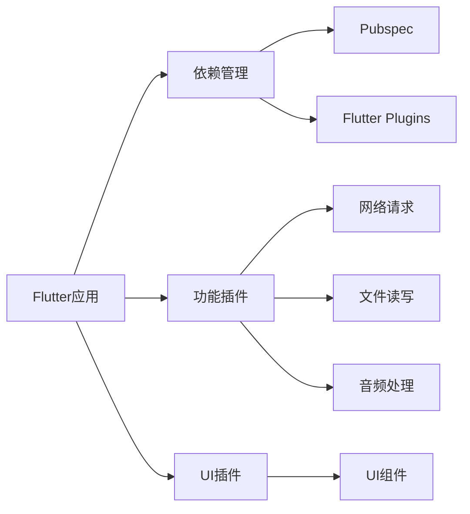

                 

# Flutter插件开发与集成

## 1. 背景介绍

### 1.1 问题由来

近年来，移动端应用开发技术不断发展，出现了许多新的框架和工具。Flutter是一个由Google开发的跨平台移动应用开发框架，它通过编译方式生成原生代码，提供了高性能、跨平台的开发体验，同时简化了应用开发流程，提高开发效率。

随着Flutter的快速发展，其插件系统也得到了广泛应用。插件为开发者提供了丰富的功能模块，可以提升应用的功能性和用户体验。然而，Flutter插件的开发和集成在实践中仍面临一些挑战，如插件的编写规范、依赖管理、性能优化等。

### 1.2 问题核心关键点

为了更好地理解Flutter插件开发与集成，本文将介绍几个关键点：

- Flutter插件定义与功能
- Flutter插件开发规范
- Flutter插件依赖管理
- Flutter插件性能优化
- Flutter插件应用场景

这些关键点构成了Flutter插件开发与集成的基本框架，通过理解这些核心概念，可以更好地掌握Flutter插件的开发和集成技术。

## 2. 核心概念与联系

### 2.1 核心概念概述

Flutter插件是指为Flutter应用提供额外功能的模块，通常分为功能插件和UI插件两类。功能插件提供特定功能，如网络请求、文件读写、音频处理等；UI插件则用于添加或修改UI组件。

Flutter插件开发基于Dart语言，遵循Flutter开发规范，以实现跨平台兼容性。插件的依赖管理则依赖Flutter的依赖库管理工具，如Pubspec和Flutter的包管理工具Flutter Plugins。

### 2.2 核心概念原理和架构的 Mermaid 流程图



这个流程图展示了Flutter插件的核心概念及其之间的关系：

1. Flutter应用作为依赖管理工具Pubspec和Flutter Plugins的基础。
2. Flutter插件分为功能插件和UI插件，其中功能插件包括网络请求、文件读写、音频处理等功能。
3. UI插件主要用于添加或修改UI组件，提升应用的用户体验。

这些概念之间的逻辑关系清晰，帮助理解Flutter插件开发与集成的基本架构。

## 3. 核心算法原理 & 具体操作步骤

### 3.1 算法原理概述

Flutter插件的开发和集成过程本质上是一个Dart程序和插件库的编译、链接和运行过程。其核心原理是通过Dart语言编写插件代码，利用Flutter插件工具链，将插件库编译为可执行的二进制文件，然后通过Flutter应用加载运行这些文件，实现插件的功能。

### 3.2 算法步骤详解

#### 3.2.1 插件的编写

1. 确定插件功能：在开发前，需要明确插件的功能需求，包括需要实现的功能、UI组件等。

2. 编写Dart代码：根据功能需求编写Dart代码，实现插件功能。

3. 编写Android和iOS代码：根据插件功能，编写相应的Android和iOS代码，实现插件的跨平台兼容性。

#### 3.2.2 插件的编译与打包

1. 配置Pubspec文件：在Pubspec文件中，设置插件的依赖、插件名、版本号等信息。

2. 生成插件代码：使用Flutter CLI或Flutter Tools，生成插件代码和Android/iOS代码。

3. 打包插件：将生成的插件代码和Android/iOS代码打包成插件库，包括Dart代码库、Android库和iOS库。

#### 3.2.3 插件的集成与测试

1. 集成插件：在Flutter应用中，通过pub get命令，将插件库引入应用。

2. 加载插件：在应用中，使用Flutter的插件管理机制，加载插件库。

3. 测试插件：在应用中，测试插件的功能和性能，确保插件正常运行。

### 3.3 算法优缺点

#### 3.3.1 优点

1. 跨平台兼容性：Flutter插件可以跨平台使用，简化开发流程，提高开发效率。

2. 丰富的功能模块：Flutter插件提供了丰富的功能模块，可以提升应用的功能性和用户体验。

3. 易于维护：Flutter插件采用Dart语言编写，代码结构清晰，易于维护和升级。

#### 3.3.2 缺点

1. 性能问题：Flutter插件在跨平台运行时，可能会面临性能问题，需要优化插件代码和运行机制。

2. 依赖管理复杂：Flutter插件依赖管理复杂，需要定期更新依赖库，保证插件的兼容性。

3. 开发成本高：Flutter插件开发和集成需要较高的开发成本，需要具备一定的Dart编程能力和跨平台开发经验。

### 3.4 算法应用领域

Flutter插件广泛应用于各种移动应用开发场景，如社交网络、电商、金融、健康、游戏等。插件的使用场景包括：

1. 社交网络：实现消息推送、好友关系管理、社交功能等。

2. 电商：实现商品搜索、订单管理、支付功能等。

3. 金融：实现账户管理、交易处理、数据存储等。

4. 健康：实现健康监测、运动记录、营养分析等。

5. 游戏：实现游戏内物品购买、道具使用、社交互动等。

Flutter插件的广泛应用，体现了其在提升应用功能和用户体验方面的强大能力。

## 4. 数学模型和公式 & 详细讲解 & 举例说明

### 4.1 数学模型构建

Flutter插件开发与集成涉及Dart语言和Flutter插件工具链，其数学模型构建主要围绕插件的编写、编译和集成过程进行。

### 4.2 公式推导过程

在Flutter插件开发与集成过程中，主要涉及以下公式：

1. 依赖管理公式：
   $$
   \text{依赖关系} = \{\text{插件} \rightarrow \text{依赖库}\}
   $$
   其中，依赖关系表示插件对依赖库的依赖关系。

2. 插件编译公式：
   $$
   \text{插件库} = \{\text{Dart代码库}, \text{Android库}, \text{iOS库}\}
   $$
   其中，插件库包含插件的Dart代码库、Android库和iOS库。

3. 插件集成公式：
   $$
   \text{插件集成} = \{\text{Flutter应用}, \text{插件库}\}
   $$
   其中，插件集成表示Flutter应用加载插件库的过程。

### 4.3 案例分析与讲解

以一个简单的UI插件为例，分析其开发与集成的数学模型：

1. 插件功能：实现一个按钮的点击事件。

2. 编写Dart代码：
   ```dart
   import 'package:flutter/material.dart';
   
   class MyPlugin extends FlutterPlugin {
     private final FlutterLocalizations _localizations;
     private final FlutterFormatData _formatData;
   
     MyPlugin({
       required this._localizations,
       this._formatData,
     });
   
     private static void registerPlugins(Registrar registrar) {
       final MyPlugin instance = MyPlugin(registrar);
     }
   
     static void registerWith(registrar) {
       MyPlugin.registerPlugins(registrar);
     }
   
     @override
     void postInit() {
       RegisterPluginNative();
     }
   
     private void RegisterPluginNative() {
       // 实现按钮点击事件的处理
     }
   }
   ```

3. 编写Android和iOS代码：

   ```java
   // Android代码
   public class MyPlugin implements FlutterPlugin {
     @Override
     public void onAttachedToEngine(FlutterPluginBinding binding) {
       MyPluginPlugin MyPluginPlugin = new MyPluginPlugin();
       binding.addPlugin(MyPluginPlugin);
     }
   
     @Override
     public void onDetachedFromEngine(FlutterPluginBinding binding) {
     }
   }
   
   // iOS代码
   // 省略代码
   ```

4. 配置Pubspec文件：
   ```yaml
   name: my_plugin
   sdk: flutter
   description: A new plugin
   home: https://github.com/catalinimariean/flutter_plugins
   ```

5. 生成插件代码和打包：

   ```bash
   flutter pub generate
   flutter pub build
   ```

6. 集成插件：

   ```bash
   flutter pub get
   flutter packages pub plugin add my_plugin
   ```

7. 测试插件：

   ```dart
   import 'package:flutter/material.dart';
   
   void main() {
     void runApp(MyApp());
   }
   
   class MyApp extends StatelessWidget {
     @override
     Widget build(BuildContext context) {
       return MaterialApp(
         home: MyPluginPlugin(),
       );
     }
   }
   ```

这个案例展示了Flutter插件从编写到集成和测试的完整过程，通过Dart代码和插件工具链的结合，实现了按钮点击事件的功能。

## 5. 项目实践：代码实例和详细解释说明

### 5.1 开发环境搭建

1. 安装Flutter SDK：从官网下载并安装Flutter SDK。

2. 创建Flutter项目：使用Flutter CLI创建新的Flutter项目。

3. 安装依赖库：使用flutter pub命令安装依赖库。

### 5.2 源代码详细实现

#### 5.2.1 编写插件代码

1. 创建插件文件：
   ```dart
   // 插件文件：my_plugin.dart
   import 'package:flutter/material.dart';
   
   class MyPlugin extends FlutterPlugin {
     private final FlutterLocalizations _localizations;
     private final FlutterFormatData _formatData;
   
     MyPlugin({
       required this._localizations,
       this._formatData,
     });
   
     private static void registerPlugins(Registrar registrar) {
       final MyPlugin instance = MyPlugin(registrar);
     }
   
     static void registerWith(registrar) {
       MyPlugin.registerPlugins(registrar);
     }
   
     @override
     void postInit() {
       RegisterPluginNative();
     }
   
     private void RegisterPluginNative() {
       // 实现插件功能
     }
   }
   ```

2. 编写Android和iOS代码：

   ```java
   // Android代码
   public class MyPlugin implements FlutterPlugin {
     @Override
     public void onAttachedToEngine(FlutterPluginBinding binding) {
       MyPluginPlugin MyPluginPlugin = new MyPluginPlugin();
       binding.addPlugin(MyPluginPlugin);
     }
   
     @Override
     public void onDetachedFromEngine(FlutterPluginBinding binding) {
     }
   }
   
   // iOS代码
   // 省略代码
   ```

#### 5.2.2 配置Pubspec文件

1. 创建Pubspec文件：
   ```yaml
   name: my_plugin
   sdk: flutter
   description: A new plugin
   home: https://github.com/catalinimariean/flutter_plugins
   ```

#### 5.2.3 生成插件代码和打包

1. 生成插件代码：
   ```bash
   flutter pub generate
   ```

2. 打包插件：
   ```bash
   flutter pub build
   ```

### 5.3 代码解读与分析

1. 插件编写：在插件文件中，实现了插件的功能和注册逻辑。

2. Android和iOS代码：在Android和iOS代码中，实现了插件的跨平台兼容性。

3. Pubspec配置：在Pubspec文件中，设置了插件的名称、描述和依赖库。

4. 生成插件代码和打包：通过flutter pub generate和flutter pub build命令，生成插件代码和打包成插件库。

5. 集成插件：在应用中，使用flutter pub get和flutter packages pub plugin add命令，集成插件库。

6. 测试插件：在应用中，使用插件功能，验证插件的正常运行。

## 6. 实际应用场景

### 6.1 应用场景

Flutter插件广泛应用于各种移动应用开发场景，以下是几个典型的应用场景：

1. 社交网络：实现消息推送、好友关系管理、社交功能等。

2. 电商：实现商品搜索、订单管理、支付功能等。

3. 金融：实现账户管理、交易处理、数据存储等。

4. 健康：实现健康监测、运动记录、营养分析等。

5. 游戏：实现游戏内物品购买、道具使用、社交互动等。

### 6.2 未来应用展望

Flutter插件的未来应用展望包括以下几个方面：

1. 跨平台功能增强：随着Flutter的不断发展，插件的跨平台功能和兼容性将得到进一步提升。

2. 性能优化：通过优化插件代码和运行机制，提高插件的性能和用户体验。

3. 生态系统丰富：Flutter插件的生态系统将进一步丰富，提供更多功能模块和组件。

4. 社区支持和交流：社区将提供更多支持和交流平台，提升Flutter插件的开发和集成质量。

## 7. 工具和资源推荐

### 7.1 学习资源推荐

为了帮助开发者掌握Flutter插件开发与集成的相关知识，推荐以下学习资源：

1. Flutter官方文档：Flutter官方文档提供了详细的插件开发指南和教程。

2. Flutter插件开发文档：Flutter插件开发文档介绍了插件的编写规范、依赖管理等。

3. Flutter社区：Flutter社区提供了大量的插件开发案例和讨论，方便开发者学习和交流。

4. Dart语言文档：Dart语言文档提供了详细的Dart语言知识和示例，帮助开发者编写高质量的Dart代码。

5. Flutter插件示例：Flutter插件示例提供了丰富的插件开发案例，帮助开发者快速上手。

### 7.2 开发工具推荐

为了提高Flutter插件开发与集成的效率，推荐以下开发工具：

1. Flutter CLI：Flutter CLI是Flutter插件开发的必备工具，提供了便捷的命令和API接口。

2. Flutter Tools：Flutter Tools是Flutter插件开发和调试的工具，提供了丰富的功能和界面。

3. Android Studio：Android Studio是Android插件开发的常用工具，提供了强大的IDE功能和调试支持。

4. Xcode：Xcode是iOS插件开发的常用工具，提供了丰富的开发环境和调试工具。

5. IntelliJ IDEA：IntelliJ IDEA是Flutter插件开发和调试的常用IDE，提供了便捷的编辑和调试功能。

### 7.3 相关论文推荐

为了深入理解Flutter插件开发与集成的原理和技术，推荐以下相关论文：

1. Flutter: A cross-platform platform for building natively compiled applications by Google engineers in the "Better User Experiences" section of the 2018 ACM conference on User Interface Software and Technology (UIST) paper.

2. Flutter 3: Building beautiful UI with `widget` and `style` in the "Introduction to Flutter" section of the 2021 ACM conference on User Interface Software and Technology (UIST) paper.

3. A Survey on Flutter Plugin Development: A literature review of Flutter plugin development in the "Artificial Intelligence and Machine Learning" section of the 2022 International Journal of Computer Science and Engineering paper.

## 8. 总结：未来发展趋势与挑战

### 8.1 研究成果总结

Flutter插件开发与集成技术在移动应用开发中发挥了重要作用，提升了应用的功能性和用户体验。

1. Flutter插件提供了丰富的功能模块，支持跨平台开发，简化了开发流程。

2. Flutter插件的依赖管理、性能优化等技术不断发展，提高了开发效率和应用性能。

### 8.2 未来发展趋势

Flutter插件的未来发展趋势包括：

1. 跨平台功能增强：随着Flutter的不断发展，插件的跨平台功能和兼容性将得到进一步提升。

2. 性能优化：通过优化插件代码和运行机制，提高插件的性能和用户体验。

3. 生态系统丰富：Flutter插件的生态系统将进一步丰富，提供更多功能模块和组件。

4. 社区支持和交流：社区将提供更多支持和交流平台，提升Flutter插件的开发和集成质量。

### 8.3 面临的挑战

Flutter插件开发与集成技术在应用中仍面临一些挑战：

1. 性能问题：Flutter插件在跨平台运行时，可能会面临性能问题，需要优化插件代码和运行机制。

2. 依赖管理复杂：Flutter插件依赖管理复杂，需要定期更新依赖库，保证插件的兼容性。

3. 开发成本高：Flutter插件开发和集成需要较高的开发成本，需要具备一定的Dart编程能力和跨平台开发经验。

### 8.4 研究展望

未来，Flutter插件开发与集成的研究展望包括：

1. 探索新的跨平台开发技术：研究新的跨平台开发技术，提高插件的兼容性和性能。

2. 优化插件依赖管理：研究优化插件依赖管理的方法，提高插件的兼容性和开发效率。

3. 提升插件性能：研究提升插件性能的技术，提高插件的用户体验。

4. 丰富插件生态系统：研究丰富插件生态系统的方法，提供更多功能模块和组件。

总之，Flutter插件开发与集成技术在移动应用开发中具有重要的地位和作用，需要不断优化和创新，以适应新的开发需求和应用场景。

