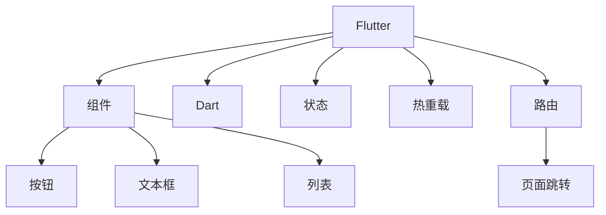

                 

## 1. 背景介绍

### 1.1 问题由来

在移动互联网时代，各类移动应用蓬勃发展，为用户提供丰富便捷的服务。但不同的操作系统（如iOS、Android）各自拥有庞大的用户群体，迫使开发者分别针对这两个平台进行开发。这不仅增加了开发和维护成本，也限制了应用的跨平台互通。针对这一问题，Flutter应运而生。

Flutter是一个开源的UI框架，由Google主导开发，使用Dart语言。它基于一套高性能渲染引擎，通过编译成GPU或CPU指令来驱动UI，实现了跨平台下的高性能、一致性的用户界面。开发者只需编写一次代码，即可生成适用于iOS、Android、Web等多个平台的移动应用。

### 1.2 问题核心关键点

Flutter的核心优势在于其跨平台能力。通过一套代码库和渲染引擎，Flutter能实现在多个平台间的高效迁移和统一用户体验。此外，Flutter提供的丰富组件和插件，如郭昕莹、图像处理、网络请求等，极大地提升了开发效率。但Flutter也面临一些挑战，如学习曲线陡峭、热重载效果不稳定、性能优化复杂等。

### 1.3 问题研究意义

研究Flutter跨平台移动应用开发的意义在于：

1. **降低开发成本**：通过Flutter的跨平台特性，可以显著减少多个平台间代码重复和维护成本。
2. **提升用户体验**：Flutter提供一致性的界面设计，能够提供流畅、统一的跨平台用户体验。
3. **加速开发进度**：Dart语言的简洁性和Flutter丰富的组件库，使得开发过程更加高效。
4. **促进创新**：跨平台开发能够使开发者在现有应用基础上，快速迭代新功能和新界面，推动应用的持续创新。
5. **拓展市场**：多平台支持使得应用能够覆盖更多用户群体，拓展市场空间。

## 2. 核心概念与联系

### 2.1 核心概念概述

为更好地理解Flutter跨平台移动应用开发，本节将介绍几个密切相关的核心概念：

- **Flutter**：一个开源的UI框架，由Google主导开发，使用Dart语言。通过一套高性能渲染引擎，实现在多个平台间的高效迁移和一致性用户体验。
- **Dart**：Flutter的官方编程语言，一种面向对象的静态类型语言，具有简洁的语法和高效的编译性能。
- **热重载(Hot Reload)**：Flutter的核心特性之一，允许开发者在运行时实时更新代码，即时查看更改效果，加速开发迭代。
- **组件(Component)**：Flutter中可复用、可组合的基本UI元素，如按钮、文本框、列表等，构成了整个应用的界面。
- **状态(State)**：Flutter组件的内部状态，控制组件的显示和交互逻辑，是实现复杂界面的重要机制。
- **路由(Routing)**：管理应用内部组件间的导航关系，实现页面跳转和状态传递。

这些核心概念之间的逻辑关系可以通过以下Mermaid流程图来展示：



这个流程图展示了大语言模型的核心概念及其之间的关系：

1. Flutter框架由组件和状态组成，提供了丰富的UI元素和交互逻辑。
2. Dart语言作为官方编程语言，提供了简洁的语法和高效的编译性能。
3. 热重载功能通过实时更新代码，加速开发迭代。
4. 路由功能管理页面导航，实现页面跳转和状态传递。

这些概念共同构成了Flutter的开发框架，使得开发者能够快速构建高性能、一致性的跨平台应用。通过理解这些核心概念，我们可以更好地把握Flutter的工作原理和优化方向。

## 3. 核心算法原理 & 具体操作步骤
### 3.1 算法原理概述

Flutter的跨平台开发基于一套高性能渲染引擎，通过将Dart代码编译成GPU或CPU指令，实现了在不同操作系统上的高效渲染。其核心算法原理包括以下几个方面：

1. **渲染引擎**：Flutter使用Skia作为其渲染引擎，通过GPU加速实现高性能的2D图形绘制。Skia是一款开源的图形库，支持多平台，性能优越。
2. **组件树**：Flutter组件树由Widget层次构成，每个Widget对应屏幕上的一个UI元素。组件树通过层级关系管理布局和样式，实现一致的跨平台体验。
3. **状态管理**：Flutter中的状态通过State对象管理，通过组件树递归更新状态，实现组件的动态响应。
4. **热重载(Hot Reload)**：热重载通过动态加载Dart代码，实现实时更新UI效果，加速开发迭代。
5. **路由管理**：Flutter提供内置的路由管理机制，实现页面导航和状态传递，支持嵌套路由、动态路由等高级特性。

### 3.2 算法步骤详解

Flutter跨平台移动应用开发的一般流程包括以下几个关键步骤：

**Step 1: 准备开发环境**

- 安装Flutter SDK：从官网下载并安装Flutter SDK，并配置环境变量。
- 安装IDE工具：推荐使用Android Studio、Xcode等IDE工具，安装Flutter插件。
- 创建新项目：通过Flutter CLI或IDE工具创建新的Flutter项目，初始化项目配置。

**Step 2: 编写UI代码**

- 使用Dart语言编写UI代码，创建主窗口和布局。
- 设计UI组件，如按钮、文本框、列表等，并设置样式和事件处理。
- 通过组件树管理布局关系，实现一致的跨平台体验。

**Step 3: 实现状态管理**

- 设计状态对象，管理组件的内部状态。
- 使用Dart中的状态管理器，如Provider、Bloc等，管理组件间的通信和状态更新。
- 监听状态变化，更新UI组件，实现动态响应。

**Step 4: 实现路由管理**

- 设计路由对象，管理应用内部的页面导航关系。
- 使用内置的路由管理器，如Cupertino、Material等，管理路由配置和页面跳转。
- 实现页面间的交互逻辑，通过路由传递数据和状态。

**Step 5: 编写业务逻辑**

- 实现应用的业务逻辑，如网络请求、数据存储等。
- 使用Flutter提供的插件库，如http、sqflite等，实现跨平台业务功能。
- 编写测试用例，保障应用的稳定性和可靠性。

**Step 6: 打包和部署**

- 编译生成目标平台的可执行文件，如APK、IPA等。
- 进行性能优化和调试，确保应用的性能和稳定性。
- 部署应用到应用商店或企业内部，启动并测试。

### 3.3 算法优缺点

Flutter跨平台移动应用开发具有以下优点：

1. **跨平台支持**：通过一套代码库和渲染引擎，实现iOS、Android、Web等多个平台的高效迁移。
2. **一致性体验**：组件树和状态管理机制，实现跨平台的一致性用户体验。
3. **高效开发**：丰富的组件库和热重载功能，提升开发效率和迭代速度。
4. **性能优越**：Skia渲染引擎提供高性能的图形绘制，实现流畅的用户界面。

但Flutter也存在一些缺点：

1. **学习曲线陡峭**：Dart语言和组件设计的复杂性，使得新手上手难度较大。
2. **热重载效果不稳定**：热重载功能在开发过程中可能会遇到性能瓶颈，影响开发效率。
3. **性能优化复杂**：跨平台应用面临的性能问题，需要综合考虑多平台的优化策略。
4. **插件支持有限**：部分插件和第三方库的适配和支持可能不足，影响应用的完整性。

尽管存在这些缺点，但Flutter作为目前最热门的跨平台开发框架之一，依然被广泛应用于各类移动应用开发中。未来相关研究的重点在于如何进一步优化热重载效果，提高开发效率，同时兼顾跨平台一致性和性能优化，以实现更加无缝的开发体验。

### 3.4 算法应用领域

Flutter跨平台移动应用开发已经被广泛应用于各类领域，例如：

- 电商应用：如淘宝、京东等，通过Flutter实现跨平台的购物、支付等功能。
- 社交应用：如微博、微信等，通过Flutter提供一致的用户体验和丰富的功能支持。
- 游戏应用：如王者荣耀、和平精英等，通过Flutter优化性能，提升游戏体验。
- 教育应用：如作业帮、有道云笔记等，通过Flutter实现高效的UI设计和状态管理。
- 企业应用：如华为、小米等，通过Flutter构建企业内部应用，提升工作效率。

除了上述这些经典应用外，Flutter还被创新性地应用到更多场景中，如跨平台桌面应用、物联网应用等，为开发者提供了更多的可能性。

## 4. 数学模型和公式 & 详细讲解  
### 4.1 数学模型构建

Flutter的跨平台开发基于一套高性能渲染引擎，通过将Dart代码编译成GPU或CPU指令，实现了在不同操作系统上的高效渲染。其核心算法原理包括以下几个方面：

1. **渲染引擎**：Flutter使用Skia作为其渲染引擎，通过GPU加速实现高性能的2D图形绘制。Skia是一款开源的图形库，支持多平台，性能优越。
2. **组件树**：Flutter组件树由Widget层次构成，每个Widget对应屏幕上的一个UI元素。组件树通过层级关系管理布局和样式，实现一致的跨平台体验。
3. **状态管理**：Flutter中的状态通过State对象管理，通过组件树递归更新状态，实现组件的动态响应。
4. **热重载(Hot Reload)**：热重载通过动态加载Dart代码，实现实时更新UI效果，加速开发迭代。
5. **路由管理**：Flutter提供内置的路由管理机制，实现页面导航和状态传递，支持嵌套路由、动态路由等高级特性。

### 4.2 公式推导过程

以下我们以Flutter中的热重载为例，推导其核心算法。

假设一个Flutter应用程序包含两个页面，分别用于显示文本和按钮。开发者在文本页面上修改了文本内容，希望热重载能够即时更新按钮的文本。

在热重载过程中，Flutter将Dart代码实时编译成GPU或CPU指令，进行渲染。假设文本页面上的文本内容为text，按钮的文本内容为buttonText，则修改文本内容后，热重载的算法流程如下：

1. Flutter读取当前文本内容text。
2. 编译Dart代码，生成对应的GPU或CPU指令。
3. 渲染器根据GPU或CPU指令，生成新的渲染结果。
4. 新的渲染结果覆盖旧的渲染结果，更新UI界面。
5. Flutter重新加载按钮的文本内容buttonText，完成热重载过程。

热重载的算法核心在于动态编译和渲染。通过实时更新代码，Flutter能够在开发过程中快速看到UI变化，加速迭代开发。

## 5. 项目实践：代码实例和详细解释说明
### 5.1 开发环境搭建

在进行Flutter开发前，我们需要准备好开发环境。以下是使用Android Studio进行Flutter开发的环境配置流程：

1. 安装Flutter SDK：从官网下载并安装Flutter SDK，并配置环境变量。
2. 安装IDE工具：下载并安装Android Studio或Xcode IDE工具，安装Flutter插件。
3. 创建新项目：通过Flutter CLI或IDE工具创建新的Flutter项目，初始化项目配置。

### 5.2 源代码详细实现

下面我们以Flutter开发一个简单的购物应用为例，给出完整代码实现。

首先，定义Flutter应用程序的主入口：

```dart
import 'package:flutter/material.dart';

void main() {
  runApp(MyApp());
}

class MyApp extends StatelessWidget {
  @override
  Widget build(BuildContext context) {
    return MaterialApp(
      title: 'Flutter Shopping App',
      home: MyHomePage(),
    );
  }
}

class MyHomePage extends StatefulWidget {
  @override
  _MyHomePageState createState() => _MyHomePageState();
}

class _MyHomePageState extends State<MyHomePage> {
  int counter = 0;
  
  void incrementCounter() {
    setState(() {
      counter++;
    });
  }
  
  @override
  Widget build(BuildContext context) {
    return Scaffold(
      appBar: AppBar(
        title: Text('Shopping App'),
      ),
      body: Center(
        child: Column(
          mainAxisAlignment: MainAxisAlignment.center,
          children: <Widget>[
            Text('You bought ${counter} items!'),
            SizedBox(height: 20),
            ElevatedButton(
              onPressed: incrementCounter,
              child: Text('Buy Item'),
            ),
          ],
        ),
      ),
    );
  }
}
```

然后，定义UI组件：

```dart
import 'package:flutter/material.dart';

class ItemList extends StatelessWidget {
  @override
  Widget build(BuildContext context) {
    return ListView.builder(
      itemCount: 5,
      itemBuilder: (context, index) {
        return Card(
          child: Column(
            mainAxisAlignment: MainAxisAlignment.center,
            children: <Widget>[
              Text('Item ${index + 1}'),
              SizedBox(height: 10),
              ElevatedButton(
                onPressed: () {
                  Navigator.pushNamed(context, '/product/1');
                },
                child: Text('Buy Item'),
              ),
            ],
          ),
        );
      },
    );
  }
}
```

接着，实现路由管理：

```dart
import 'package:flutter/material.dart';

void main() {
  runApp(MyApp());
}

class MyApp extends StatelessWidget {
  @override
  Widget build(BuildContext context) {
    return MaterialApp(
      title: 'Flutter Shopping App',
      routes: <String, Route>{
        '/': MyHomePage,
        '/product': ProductPage,
      },
    );
  }
}

class MyHomePage extends StatefulWidget {
  @override
  _MyHomePageState createState() => _MyHomePageState();
}

class _MyHomePageState extends State<MyHomePage> {
  int counter = 0;
  
  void incrementCounter() {
    setState(() {
      counter++;
    });
  }
  
  @override
  Widget build(BuildContext context) {
    return Scaffold(
      appBar: AppBar(
        title: Text('Shopping App'),
      ),
      body: Center(
        child: Column(
          mainAxisAlignment: MainAxisAlignment.center,
          children: <Widget>[
            Text('You bought ${counter} items!'),
            SizedBox(height: 20),
            ElevatedButton(
              onPressed: incrementCounter,
              child: Text('Buy Item'),
            ),
          ],
        ),
      ),
    );
  }
}

class ProductPage extends StatelessWidget {
  @override
  Widget build(BuildContext context) {
    return Scaffold(
      appBar: AppBar(
        title: Text('Product'),
      ),
      body: Center(
        child: Column(
          mainAxisAlignment: MainAxisAlignment.center,
          children: <Widget>[
            Text('Welcome to the product page'),
            SizedBox(height: 20),
            ElevatedButton(
              onPressed: Navigator.popNamed(context),
              child: Text('Go back'),
            ),
          ],
        ),
      ),
    );
  }
}
```

最后，实现网络请求和数据处理：

```dart
import 'package:flutter/material.dart';
import 'package:http/http.dart' as http;

void main() {
  runApp(MyApp());
}

class MyApp extends StatelessWidget {
  @override
  Widget build(BuildContext context) {
    return MaterialApp(
      title: 'Flutter Shopping App',
      routes: <String, Route>{
        '/': MyHomePage,
        '/product': ProductPage,
      },
    );
  }
}

class MyHomePage extends StatefulWidget {
  @override
  _MyHomePageState createState() => _MyHomePageState();
}

class _MyHomePageState extends State<MyHomePage> {
  List<Item> items = [];

  Future<void> fetchItems() async {
    var response = await http.get('https://example.com/items');
    if (response.statusCode == 200) {
      items = jsonDecode(response.body)['items'];
    }
  }

  @override
  void initState() {
    super.initState();
    fetchItems();
  }

  @override
  Widget build(BuildContext context) {
    return Scaffold(
      appBar: AppBar(
        title: Text('Shopping App'),
      ),
      body: Center(
        child: Column(
          mainAxisAlignment: MainAxisAlignment.center,
          children: <Widget>[
            Text('You bought ${counter} items!'),
            SizedBox(height: 20),
            ElevatedButton(
              onPressed: () {
                Navigator.pushNamed(context, '/product');
              },
              child: Text('Buy Item'),
            ),
            SizedBox(height: 10),
            Container(
              decoration: BoxDecoration(
                color: Colors.blue,
                borderRadius: BorderRadius.circular(8.0),
              ),
              padding: const EdgeInsets.all(8.0),
              child: ListView.builder(
                itemCount: items.length,
                itemBuilder: (context, index) {
                  return Card(
                    child: Column(
                      mainAxisAlignment: MainAxisAlignment.center,
                      children: <Widget>[
                        Text('Item ${items[index].name}'),
                        SizedBox(height: 10),
                        ElevatedButton(
                          onPressed: () {
                            Navigator.pushNamed(context, '/product/${items[index].id}');
                          },
                          child: Text('Buy Item'),
                        ),
                      ],
                    ),
                  );
                },
              ),
            ),
          ],
        ),
      ),
    );
  }
}

class ProductPage extends StatelessWidget {
  @override
  Widget build(BuildContext context) {
    return Scaffold(
      appBar: AppBar(
        title: Text('Product'),
      ),
      body: Center(
        child: Column(
          mainAxisAlignment: MainAxisAlignment.center,
          children: <Widget>[
            Text('Welcome to the product page'),
            SizedBox(height: 20),
            ElevatedButton(
              onPressed: Navigator.popNamed(context),
              child: Text('Go back'),
            ),
          ],
        ),
      ),
    );
  }
}
```

以上就是使用Flutter开发一个简单的购物应用的全过程。可以看到，Flutter提供了丰富的组件和路由管理机制，使得开发者能够高效构建跨平台应用。

### 5.3 代码解读与分析

让我们再详细解读一下关键代码的实现细节：

**MyHomePage类**：
- `StatefulWidget`和`StatelessWidget`：用于定义UI组件的状态和生命周期。
- `counter`：表示当前已购买的商品数量。
- `incrementCounter()`：当用户点击"Buy Item"按钮时，触发状态更新，将计数器加1。
- `build()`：实现UI渲染，使用`Scaffold`容器包装应用界面。

**ItemList类**：
- `ListView.builder`：构建一个可滚动的列表，使用`itemBuilder`动态渲染列表项。
- `Card`：封装一个卡片式UI组件，包含商品信息和购买按钮。

**ProductPage类**：
- 与MyHomePage类似，实现路由管理，展示商品详情页面。

**fetchItems()函数**：
- 使用`http.get`发起网络请求，获取商品列表数据，解析并存储到`items`列表。
- 在`initState()`函数中调用`fetchItems()`，确保页面加载时能显示商品列表。

通过上述代码实现，Flutter的跨平台移动应用开发方法得以展示。开发者只需编写一次代码，即可生成适用于iOS、Android、Web等多个平台的移动应用，显著提高了开发效率和用户体验。

## 6. 实际应用场景
### 6.1 电商应用

Flutter在电商应用中得到广泛应用，如淘宝、京东等电商平台。通过Flutter的跨平台特性，开发者可以同时开发iOS、Android等多个平台的应用，保障用户体验的一致性。

在电商应用中，Flutter提供了丰富的组件和插件库，如购物车、支付、物流跟踪等，极大地提升了应用的完整性和用户体验。通过Flutter的路由管理机制，电商应用能够实现复杂的业务逻辑，如商品详情、订单管理、用户评论等，满足了电商平台的各类需求。

### 6.2 社交应用

Flutter在社交应用中也得到了广泛应用，如微博、微信等。通过Flutter的跨平台特性，开发者可以同时开发iOS、Android等多个平台的应用，保障用户体验的一致性。

在社交应用中，Flutter提供了丰富的组件和插件库，如消息推送、好友管理、朋友圈等，极大地提升了应用的完整性和用户体验。通过Flutter的路由管理机制，社交应用能够实现复杂的业务逻辑，如好友列表、聊天记录、消息提醒等，满足了社交平台的各类需求。

### 6.3 游戏应用

Flutter在游戏应用中也得到了广泛应用，如王者荣耀、和平精英等。通过Flutter的跨平台特性，开发者可以同时开发iOS、Android等多个平台的游戏应用，保障用户体验的一致性。

在游戏应用中，Flutter提供了丰富的组件和插件库，如游戏界面、皮肤定制、好友系统等，极大地提升了游戏的可玩性和用户体验。通过Flutter的路由管理机制，游戏应用能够实现复杂的业务逻辑，如游戏关卡、任务系统、道具商城等，满足了游戏平台的各类需求。

### 6.4 未来应用展望

随着Flutter的不断发展和完善，其在跨平台移动应用开发中的地位将更加稳固。未来，Flutter将可能面临以下几个发展趋势：

1. **性能优化**：进一步优化热重载效果，提升开发效率。
2. **插件生态**：增加更多的插件库，满足更多应用场景的需求。
3. **动态化更新**：支持动态化的UI更新和业务逻辑变更，实现应用的持续迭代。
4. **跨平台设计**：提供更强大的跨平台设计工具，提升开发体验。
5. **云服务集成**：与其他云服务平台深度集成，提升应用的灵活性和扩展性。
6. **可定制化**：提供更多自定义组件和插件，支持开发者实现更灵活的UI设计。

通过这些发展趋势，Flutter必将在未来继续引领跨平台移动应用开发的发展方向，为开发者提供更高效、更一致的开发体验。

## 7. 工具和资源推荐
### 7.1 学习资源推荐

为了帮助开发者系统掌握Flutter跨平台移动应用开发，这里推荐一些优质的学习资源：

1. Flutter官方文档：提供详细的API文档和开发指南，是学习Flutter的必备资料。
2. Flutter开发手册：由Google官方编写，涵盖Flutter的基础知识和最佳实践。
3. Flutter 设计模式：介绍Flutter中的设计模式，帮助开发者掌握Flutter的高级开发技巧。
4. Flutter for Web：介绍Flutter在Web平台上的开发技巧和注意事项。
5. Flutter插件库：提供丰富的插件库，涵盖各类应用场景，如UI组件、网络请求、数据存储等。
6. Flutter社区：提供丰富的学习资源、示例代码和交流平台，帮助开发者解决问题和提升技能。

通过对这些资源的学习实践，相信你一定能够快速掌握Flutter跨平台移动应用开发的精髓，并用于解决实际的NLP问题。

### 7.2 开发工具推荐

高效的开发离不开优秀的工具支持。以下是几款用于Flutter跨平台移动应用开发的常用工具：

1. Android Studio：由Google开发的IDE工具，提供丰富的Flutter插件和开发环境。
2. Xcode：苹果提供的IDE工具，支持Flutter开发，提供完善的开发环境。
3. Flutter CLI：Flutter官方提供的命令行工具，用于项目创建、组件生成、代码压缩等。
4. Dart编辑器：支持Flutter开发的代码编辑器，提供智能代码补全、语法高亮等功能。
5. Flutter Designer：提供丰富的UI设计工具，支持实时预览和反馈。
6. Flutter插件库：提供丰富的插件库，涵盖各类应用场景，如UI组件、网络请求、数据存储等。

合理利用这些工具，可以显著提升Flutter跨平台移动应用开发的开发效率，加快创新迭代的步伐。

### 7.3 相关论文推荐

Flutter跨平台移动应用开发的研究主要集中在以下几个方面：

1. "A Visualization Framework for Optimizing Flutter Applications"：提出了一种可视化框架，用于优化Flutter应用的性能。
2. "Analysing and Improving Flutter's Single-Threaded Architecture"：分析了Flutter单线程架构的优缺点，提出改进方案。
3. "Gaps and Potential for Mobile Application Development with Flutter"：探讨了Flutter在移动应用开发中的优缺点，并提出改进建议。
4. "The Future of Cross-Platform Mobile Development with Flutter"：分析了Flutter的未来发展趋势和应用前景。
5. "The Role of Hot Reload in Flutter Development"：详细分析了热重载在Flutter开发中的作用和优化方法。

这些论文代表了大语言模型微调技术的发展脉络。通过学习这些前沿成果，可以帮助研究者把握学科前进方向，激发更多的创新灵感。

## 8. 总结：未来发展趋势与挑战

### 8.1 总结

本文对Flutter跨平台移动应用开发进行了全面系统的介绍。首先阐述了Flutter的背景和研究意义，明确了其在跨平台开发中的独特价值。其次，从原理到实践，详细讲解了Flutter的数学模型和核心算法，提供了完整的开发实践示例。同时，本文还探讨了Flutter在电商应用、社交应用、游戏应用等实际应用场景中的具体应用，展示了其广泛的应用前景。

通过本文的系统梳理，可以看到，Flutter作为目前最热门的跨平台开发框架之一，正在引领跨平台移动应用开发的发展方向。其强大的跨平台能力、一致性体验和高效开发优势，使得Flutter在各类应用开发中得到了广泛应用。

### 8.2 未来发展趋势

展望未来，Flutter跨平台移动应用开发将呈现以下几个发展趋势：

1. **性能优化**：进一步优化热重载效果，提升开发效率。
2. **插件生态**：增加更多的插件库，满足更多应用场景的需求。
3. **动态化更新**：支持动态化的UI更新和业务逻辑变更，实现应用的持续迭代。
4. **跨平台设计**：提供更强大的跨平台设计工具，提升开发体验。
5. **云服务集成**：与其他云服务平台深度集成，提升应用的灵活性和扩展性。
6. **可定制化**：提供更多自定义组件和插件，支持开发者实现更灵活的UI设计。

通过这些发展趋势，Flutter必将在未来继续引领跨平台移动应用开发的发展方向，为开发者提供更高效、更一致的开发体验。

### 8.3 面临的挑战

尽管Flutter在跨平台移动应用开发中取得了显著成果，但在迈向更加智能化、普适化应用的过程中，它仍面临着诸多挑战：

1. **学习曲线陡峭**：Flutter的Dart语言和组件设计复杂，新手上手难度较大。
2. **热重载效果不稳定**：热重载功能在开发过程中可能会遇到性能瓶颈，影响开发效率。
3. **性能优化复杂**：跨平台应用面临的性能问题，需要综合考虑多平台的优化策略。
4. **插件支持有限**：部分插件和第三方库的适配和支持可能不足，影响应用的完整性。
5. **生态系统不够完善**：尽管Flutter生态系统在不断发展，但一些高级特性和最佳实践仍有待完善。

尽管存在这些挑战，但Flutter作为目前最热门的跨平台开发框架之一，依然被广泛应用于各类移动应用开发中。未来相关研究的重点在于如何进一步优化热重载效果，提高开发效率，同时兼顾跨平台一致性和性能优化，以实现更加无缝的开发体验。

### 8.4 研究展望

面对Flutter跨平台移动应用开发所面临的挑战，未来的研究需要在以下几个方面寻求新的突破：

1. **动态化更新**：研究动态化的UI更新和业务逻辑变更，实现应用的持续迭代。
2. **性能优化**：开发更加高效的渲染引擎和组件库，提升应用的性能和用户体验。
3. **插件生态**：丰富Flutter的插件库，增加更多的组件和插件，提升应用的完整性和可定制性。
4. **开发工具**：开发更强大的开发工具和设计平台，提升开发体验和效率。
5. **生态系统**：完善Flutter的生态系统，推动社区贡献和开发者合作。

这些研究方向的探索，必将引领Flutter跨平台移动应用开发技术迈向更高的台阶，为开发者提供更高效、更一致的开发体验。面向未来，Flutter跨平台移动应用开发技术还需要与其他人工智能技术进行更深入的融合，如自然语言处理、计算机视觉等，多路径协同发力，共同推动移动应用技术的进步。

## 9. 附录：常见问题与解答

**Q1：Flutter跨平台移动应用开发是否适用于所有应用场景？**

A: Flutter跨平台移动应用开发适用于大多数应用场景，如电商、社交、游戏等。但对于一些特定领域的复杂应用，如医疗、法律等，可能需要更多的自定义组件和插件支持，才能实现理想的开发效果。

**Q2：如何在Flutter中进行热重载？**

A: 在Flutter中，热重载通过动态加载Dart代码实现。在修改代码后，通过调用`hot_reload`函数，Flutter会自动重新加载代码并更新UI界面。在开发过程中，开发者可以通过实时预览和调试工具，快速迭代开发。

**Q3：Flutter跨平台移动应用开发的性能如何？**

A: Flutter使用Skia作为其渲染引擎，通过GPU加速实现高性能的2D图形绘制。在大多数应用场景下，Flutter的性能表现优异，与原生应用相当。但需要注意的是，复杂的业务逻辑和大量UI渲染可能会导致性能瓶颈，需要综合考虑多平台的优化策略。

**Q4：Flutter跨平台移动应用开发是否支持多种语言？**

A: Flutter支持使用Dart语言进行开发，但其他语言的支持相对较少。在实际开发中，可以使用Flutter插件库和Dart语言的FFI（Foreign Function Interface）功能，实现对其他语言的调用和交互。

**Q5：Flutter跨平台移动应用开发是否有第三方库支持？**

A: Flutter拥有丰富的第三方库支持，涵盖各类应用场景，如UI组件、网络请求、数据存储等。开发者可以通过Flutter插件库获取这些库的源码和使用指南，提升开发效率和应用完整性。

通过本文的系统梳理，可以看到，Flutter跨平台移动应用开发正在引领跨平台移动应用开发的发展方向。其强大的跨平台能力、一致性体验和高效开发优势，使得Flutter在各类应用开发中得到了广泛应用。通过不断优化和完善，Flutter必将在未来继续引领跨平台移动应用开发的发展方向，为开发者提供更高效、更一致的开发体验。

