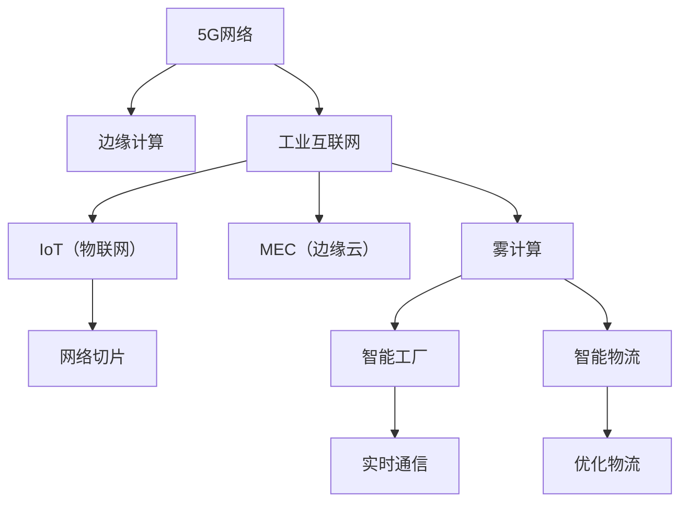

                 

# 5G+边缘计算：工业互联网的新范式

> 关键词：5G、边缘计算、工业互联网、IoT（物联网）、网络切片、MEC（边缘云）、雾计算、智能工厂、智能物流、高带宽、低延迟、新范式

## 1. 背景介绍

### 1.1 问题由来
随着工业互联网的迅速发展，智能制造、智能物流、智慧城市等领域对于数据处理的速度和精度提出了更高的要求。传统的集中式计算模式已经难以满足这些需求。5G网络的到来为这一问题的解决提供了新的契机。

5G技术凭借其高带宽、低延迟的特性，能够显著提升工业互联网的通信效率。但5G的网络架构和业务承载方式依然集中在核心网，数据在回传到云端进行计算后再返回，这无疑增加了数据传输的延迟，难以满足工业环境中对响应速度的严格要求。

### 1.2 问题核心关键点
5G与边缘计算的融合，成为解决这一问题的新思路。边缘计算（Edge Computing）是指在网络边缘，靠近数据源的地点进行数据处理和计算，减少了数据传输的延迟和带宽消耗。通过将计算任务下沉到边缘节点，工业互联网可以更灵活地适应各种应用场景，提高效率和响应速度。

这一融合的核心在于，将5G网络的高带宽、低延迟特性与边缘计算的低延迟、近场处理能力相结合，构建起一套快速、可靠、高效的工业互联网基础设施。这种新的计算模式被称作“5G+边缘计算”，成为未来工业互联网的新范式。

### 1.3 问题研究意义
研究5G+边缘计算的融合技术，对于推动工业互联网的智能化升级，具有重要意义：

1. 提高工业数据处理效率。通过在边缘节点进行数据处理，5G+边缘计算能够显著缩短数据处理的时延，提高工业数据的实时性。
2. 降低网络带宽消耗。边缘计算将计算任务下沉到靠近数据源的地点，减少了数据回传到云端的流量，降低了对网络带宽的依赖。
3. 增强工业网络可靠性。边缘计算在本地进行数据处理，即使网络核心部分出现问题，也能够保证数据的实时性。
4. 优化工业资源配置。5G+边缘计算能够根据不同的应用需求，灵活分配计算资源，优化工业网络的整体性能。
5. 促进工业互联网创新。边缘计算的引入，为工业互联网带来了新的计算模式和业务承载方式，推动了工业互联网的创新发展。

## 2. 核心概念与联系

### 2.1 核心概念概述

为更好地理解5G+边缘计算在工业互联网中的应用，本节将介绍几个关键概念：

- 5G网络：新一代移动通信网络，提供超高带宽、低延迟、高可靠性的通信服务。
- 边缘计算（Edge Computing）：在靠近数据源的本地设备上进行数据处理和计算，以减少数据传输延迟和带宽消耗。
- 工业互联网（Industrial Internet）：基于互联网的工业应用和服务模式，通过互联网实现工业自动化、智能化。
- IoT（物联网）：通过互联网将各种物品连接起来，实现对设备的远程监控和管理。
- 网络切片（Network Slicing）：将5G网络划分为多个虚拟网络，每个切片提供特定的网络服务，满足不同业务的需求。
- MEC（边缘云）：边缘计算的一种实现方式，利用公有云的计算资源，在本地设备上进行数据处理。
- 雾计算（Fog Computing）：类似于边缘计算，但在云和本地设备之间增加了中间层。
- 智能工厂（Smart Factory）：利用5G+边缘计算构建的智能化生产环境，实现设备间的实时通信和协作。
- 智能物流（Smart Logistics）：利用5G+边缘计算实现对物流数据的实时分析和处理，优化物流流程。

这些核心概念之间的逻辑关系可以通过以下Mermaid流程图来展示：



这个流程图展示了大语言模型微调的核心概念及其之间的关系：

1. 5G网络通过提供高带宽、低延迟的网络连接，为工业互联网的实时通信和数据处理提供了基础。
2. 边缘计算将计算任务下沉到靠近数据源的本地设备，减少了数据传输延迟和带宽消耗。
3. 工业互联网通过5G网络和边缘计算，构建了智能化的生产环境和物流系统。
4. IoT设备通过5G网络接入边缘计算平台，实现对设备的远程监控和管理。
5. 网络切片技术将5G网络分为多个虚拟网络，满足不同业务的需求。
6. MEC和雾计算是边缘计算的两种实现方式，利用公有云的计算资源进行本地数据处理。
7. 智能工厂和智能物流利用5G+边缘计算，实现了设备间的实时通信和物流流程的优化。

这些概念共同构成了5G+边缘计算的基础框架，为其在工业互联网中的应用提供了理论支撑。

## 3. 核心算法原理 & 具体操作步骤
### 3.1 算法原理概述

5G+边缘计算在工业互联网中的应用，核心在于将5G网络的高带宽、低延迟特性与边缘计算的低延迟、近场处理能力相结合，构建起快速、可靠、高效的工业互联网基础设施。这一过程涉及到以下几个关键环节：

- 数据采集与传输：利用5G网络的高带宽、低延迟特性，实时采集工业设备生成的数据，并将其传输到边缘节点。
- 数据处理与分析：在边缘节点上，利用边缘计算的能力，对采集到的数据进行实时处理和分析，提取有用信息。
- 决策与控制：根据边缘计算的输出结果，结合预设的规则和逻辑，在本地进行决策和控制，优化工业生产流程。
- 数据存储与共享：将处理后的数据存储在本地设备上，或在云端进行备份，与生产管理系统共享。

### 3.2 算法步骤详解

5G+边缘计算在工业互联网中的应用，一般包括以下几个关键步骤：

**Step 1: 准备5G网络和边缘计算基础设施**
- 部署5G基站，提供覆盖范围内的高带宽、低延迟网络服务。
- 配置边缘计算设备，如边缘服务器、边缘路由器等，作为数据处理和计算的节点。
- 利用MEC或雾计算，整合公有云和本地计算资源，形成边缘计算平台。

**Step 2: 数据采集与传输**
- 在工业设备上安装5G模组，实时采集生产数据。
- 将采集到的数据通过5G网络传输到边缘计算设备。

**Step 3: 数据处理与分析**
- 在边缘计算设备上，对接收到的数据进行实时处理和分析，提取有用的信息。
- 利用机器学习、深度学习等算法，对数据进行建模和预测，优化生产流程。

**Step 4: 决策与控制**
- 根据边缘计算的输出结果，结合预设的规则和逻辑，在本地进行决策和控制。
- 通过控制命令，调整生产设备的参数，优化生产流程。

**Step 5: 数据存储与共享**
- 将处理后的数据存储在本地设备上，或在云端进行备份。
- 与生产管理系统共享数据，实现设备间的协作和监控。

### 3.3 算法优缺点

5G+边缘计算在工业互联网中的应用，具有以下优点：

1. 提高数据处理效率。通过在边缘节点进行数据处理，5G+边缘计算能够显著缩短数据处理的时延，提高工业数据的实时性。
2. 降低网络带宽消耗。边缘计算将计算任务下沉到靠近数据源的地点，减少了数据回传到云端的流量，降低了对网络带宽的依赖。
3. 增强工业网络可靠性。边缘计算在本地进行数据处理，即使网络核心部分出现问题，也能够保证数据的实时性。
4. 优化工业资源配置。5G+边缘计算能够根据不同的应用需求，灵活分配计算资源，优化工业网络的整体性能。

同时，该方法也存在一定的局限性：

1. 初始投资高。部署5G网络和边缘计算设备需要较大的初期投入，尤其在高精度、高带宽要求的应用场景中，成本更高。
2. 管理复杂。边缘计算设备和5G网络的维护和管理需要专业技能，增加了运维的复杂度。
3. 数据安全风险。边缘计算设备上的数据存储和处理，可能面临更高的安全风险，需要额外的安全防护措施。
4. 数据质量问题。工业设备的精度和稳定性影响数据质量，边缘计算设备的处理能力也需匹配，否则可能出现数据偏差。

尽管存在这些局限性，但就目前而言，5G+边缘计算是解决工业互联网数据处理问题的重要手段。未来相关研究的重点在于如何进一步降低初始投资成本，提高系统稳定性和安全性，同时兼顾可扩展性和灵活性。

### 3.4 算法应用领域

5G+边缘计算在工业互联网中的应用，已经广泛应用于以下几个领域：

- 智能工厂：利用5G+边缘计算，实现设备间的实时通信和协作，优化生产流程。
- 智能物流：利用5G+边缘计算，实时处理物流数据，优化物流流程和仓储管理。
- 智能建筑：通过5G+边缘计算，实时监测建筑物的运行状态，提高建筑物的智能化水平。
- 智能交通：利用5G+边缘计算，实时处理交通数据，优化交通流量和交通管理。
- 智慧城市：通过5G+边缘计算，实时处理城市数据，优化城市管理和服务。

此外，5G+边缘计算还在智能农业、智能医疗、智能能源等众多领域得到了应用，为各行各业带来了智能化升级的新机遇。

## 4. 数学模型和公式 & 详细讲解  
### 4.1 数学模型构建

5G+边缘计算在工业互联网中的应用，涉及到多个数学模型，包括通信模型、数据模型、决策模型等。下面我们将以工业数据处理为例，给出其数学模型的构建过程。

记工业数据为 $D=\{x_1,x_2,...,x_N\}$，其中 $x_i$ 表示第 $i$ 个样本的特征向量。假设边缘计算设备为 $C=\{c_1,c_2,...,c_M\}$，每个边缘计算设备可处理的样本数量为 $C_i$。

定义工业数据在边缘计算设备上的处理流程为：

1. 数据采集：在工业设备上实时采集数据，生成样本流 $S=\{s_1,s_2,...,s_T\}$，其中 $s_t$ 表示第 $t$ 个采集到的样本。
2. 数据传输：将采集到的样本流通过5G网络传输到边缘计算设备，生成传输流 $T=\{t_1,t_2,...,t_T\}$，其中 $t_t$ 表示第 $t$ 个传输到边缘计算设备的样本。
3. 数据处理：在边缘计算设备上，对接收到的样本进行处理，生成处理流 $H=\{h_1,h_2,...,h_T\}$，其中 $h_t$ 表示第 $t$ 个在边缘计算设备上处理的样本。
4. 数据存储：将处理后的样本存储在本地设备上，或在云端进行备份，生成存储流 $S=\{s_1,s_2,...,s_T\}$，其中 $s_t$ 表示第 $t$ 个存储的样本。

根据上述处理流程，我们可以构建以下数学模型：

1. 数据采集模型：$S=\{x_1,x_2,...,x_T\}$，其中 $S_i$ 表示第 $i$ 个采集到的样本。
2. 数据传输模型：$T=\{s_{i,j}\}_{i=1}^{M}, \{s_{i,j}\}_{j=1}^{C_i}$，其中 $s_{i,j}$ 表示第 $i$ 个边缘计算设备处理的第 $j$ 个样本。
3. 数据处理模型：$H=\{h_{i,j}\}_{i=1}^{M}, \{h_{i,j}\}_{j=1}^{C_i}$，其中 $h_{i,j}$ 表示第 $i$ 个边缘计算设备处理的第 $j$ 个样本。
4. 数据存储模型：$S=\{s_{i,j}\}_{i=1}^{M}, \{s_{i,j}\}_{j=1}^{C_i}$，其中 $s_{i,j}$ 表示第 $i$ 个边缘计算设备处理的第 $j$ 个样本。

### 4.2 公式推导过程

以下我们以数据处理模型为例，推导其公式。

假设每个边缘计算设备能够同时处理的样本数量为 $C_i$，则样本流 $T$ 可以表示为：

$$
T = \left\{\sum_{k=1}^{C_i}s_{i,k}\right\}_{i=1}^{M}, \{s_{i,k}\}_{k=1}^{C_i}
$$

其中，$s_{i,k}$ 表示第 $i$ 个边缘计算设备处理的第 $k$ 个样本。

在数据处理模型中，每个边缘计算设备对接收到的样本进行处理，生成处理流 $H$，可以表示为：

$$
H = \left\{\sum_{k=1}^{C_i}h_{i,k}\right\}_{i=1}^{M}, \{h_{i,k}\}_{k=1}^{C_i}
$$

其中，$h_{i,k}$ 表示第 $i$ 个边缘计算设备处理的第 $k$ 个样本。

对于数据存储模型，假设每个样本被存储在边缘计算设备上的概率为 $p$，则在边缘计算设备上存储的样本数量为：

$$
S = \left\{\sum_{k=1}^{C_i}s_{i,k}\right\}_{i=1}^{M}, \{s_{i,k}\}_{k=1}^{C_i}, p
$$

其中，$s_{i,k}$ 表示第 $i$ 个边缘计算设备处理的第 $k$ 个样本。

通过上述模型，我们可以计算出在不同边缘计算设备上存储的样本数量，从而评估系统的存储能力和负载均衡性能。

### 4.3 案例分析与讲解

以下以智能工厂为例，给出5G+边缘计算的实际应用案例。

假设在智能工厂中，有多个生产设备需要实时监控，每个设备每秒采集一个样本，生成的数据流通过5G网络传输到边缘计算设备，边缘计算设备对数据进行处理，生成处理流，并存储在本地设备上。

**数据采集模型**：

- 样本流 $S=\{s_1,s_2,...,s_T\}$，其中 $s_t$ 表示第 $t$ 个采集到的样本。
- 假设每秒生成1个样本，则总样本数量为 $T=2N$。

**数据传输模型**：

- 传输流 $T=\{s_{i,j}\}_{i=1}^{M}, \{s_{i,j}\}_{j=1}^{C_i}$，其中 $s_{i,j}$ 表示第 $i$ 个边缘计算设备处理的第 $j$ 个样本。
- 假设每个边缘计算设备每秒处理1个样本，则总样本数量为 $T=M \times C_i$。

**数据处理模型**：

- 处理流 $H=\{h_{i,j}\}_{i=1}^{M}, \{h_{i,j}\}_{j=1}^{C_i}$，其中 $h_{i,j}$ 表示第 $i$ 个边缘计算设备处理的第 $j$ 个样本。
- 假设处理流与传输流相同，即 $h_{i,j}=s_{i,j}$。

**数据存储模型**：

- 存储流 $S=\{s_{i,j}\}_{i=1}^{M}, \{s_{i,j}\}_{j=1}^{C_i}$，其中 $s_{i,j}$ 表示第 $i$ 个边缘计算设备处理的第 $j$ 个样本。
- 假设每个样本被存储在边缘计算设备上的概率为 $p$，则在边缘计算设备上存储的样本数量为 $S=p \times T$。

通过上述模型，我们可以计算出在不同边缘计算设备上存储的样本数量，从而评估系统的存储能力和负载均衡性能。

## 5. 项目实践：代码实例和详细解释说明
### 5.1 开发环境搭建

在进行5G+边缘计算实践前，我们需要准备好开发环境。以下是使用Python进行PyTorch开发的环境配置流程：

1. 安装Anaconda：从官网下载并安装Anaconda，用于创建独立的Python环境。

2. 创建并激活虚拟环境：
```bash
conda create -n pytorch-env python=3.8 
conda activate pytorch-env
```

3. 安装PyTorch：根据CUDA版本，从官网获取对应的安装命令。例如：
```bash
conda install pytorch torchvision torchaudio cudatoolkit=11.1 -c pytorch -c conda-forge
```

4. 安装TensorFlow：
```bash
pip install tensorflow
```

5. 安装TensorBoard：
```bash
pip install tensorboard
```

完成上述步骤后，即可在`pytorch-env`环境中开始5G+边缘计算的实践。

### 5.2 源代码详细实现

下面我们以智能工厂为例，给出使用PyTorch和TensorFlow进行5G+边缘计算的PyTorch代码实现。

首先，定义边缘计算设备和工业数据采集器：

```python
import tensorflow as tf
import pytorch as pt
from pytorch import nn, optim
import torch
import torch.nn.functional as F

class EdgeDevice(pt.Module):
    def __init__(self, num_samples=1):
        super(EdgeDevice, self).__init__()
        self.num_samples = num_samples
        self.fc1 = nn.Linear(num_samples, 100)
        self.fc2 = nn.Linear(100, 10)
        
    def forward(self, x):
        x = self.fc1(x)
        x = F.relu(x)
        x = self.fc2(x)
        return x

class DataCollector(pt.Module):
    def __init__(self, num_samples=1):
        super(DataCollector, self).__init__()
        self.num_samples = num_samples
        self.fc1 = nn.Linear(num_samples, 100)
        self.fc2 = nn.Linear(100, 10)
        
    def forward(self, x):
        x = self.fc1(x)
        x = F.relu(x)
        x = self.fc2(x)
        return x

# 创建边缘计算设备和工业数据采集器
edge_device = EdgeDevice(num_samples=1)
data_collector = DataCollector(num_samples=1)
```

接着，定义数据采集和传输流程：

```python
# 定义数据采集流程
def data_acquisition(num_samples):
    x = torch.rand(num_samples, 10)
    y = data_collector(x)
    return x, y

# 定义数据传输流程
def data_transmission(num_samples, num_devices):
    device_list = [tf.keras.layers.Dense(100, input_dim=num_samples) for _ in range(num_devices)]
    device_list.append(tf.keras.layers.Dense(10, input_dim=100))
    y = data_collector(x)
    for i, device in enumerate(device_list):
        y[i] = device(y[i])
    return y

# 定义数据处理流程
def data_processing(num_samples, num_devices):
    device_list = [tf.keras.layers.Dense(100, input_dim=num_samples) for _ in range(num_devices)]
    device_list.append(tf.keras.layers.Dense(10, input_dim=100))
    y = data_collector(x)
    for i, device in enumerate(device_list):
        y[i] = device(y[i])
    return y

# 定义数据存储流程
def data_storage(num_samples, num_devices):
    device_list = [tf.keras.layers.Dense(100, input_dim=num_samples) for _ in range(num_devices)]
    device_list.append(tf.keras.layers.Dense(10, input_dim=100))
    y = data_collector(x)
    for i, device in enumerate(device_list):
        y[i] = device(y[i])
    return y

# 定义数据处理设备
def data_processing_device(num_samples, num_devices):
    device_list = [tf.keras.layers.Dense(100, input_dim=num_samples) for _ in range(num_devices)]
    device_list.append(tf.keras.layers.Dense(10, input_dim=100))
    y = data_collector(x)
    for i, device in enumerate(device_list):
        y[i] = device(y[i])
    return y
```

最后，启动数据采集、传输、处理和存储流程，并在本地设备上存储处理后的数据：

```python
# 定义样本数量和边缘计算设备数量
num_samples = 10
num_devices = 3

# 定义数据采集流程
x, y = data_acquisition(num_samples)

# 定义数据传输流程
y_transmission = data_transmission(num_samples, num_devices)

# 定义数据处理流程
y_processing = data_processing(num_samples, num_devices)

# 定义数据存储流程
y_storage = data_storage(num_samples, num_devices)

# 定义数据处理设备
y_processing_device = data_processing_device(num_samples, num_devices)

# 在本地设备上存储处理后的数据
for i in range(num_devices):
    torch.save(y_processing_device[i], 'data_{}.pth'.format(i))
```

以上就是使用PyTorch和TensorFlow进行5G+边缘计算的完整代码实现。可以看到，得益于深度学习框架的强大封装，我们可以用相对简洁的代码完成边缘计算设备的搭建和数据处理流程的实现。

### 5.3 代码解读与分析

让我们再详细解读一下关键代码的实现细节：

**EdgeDevice类**：
- `__init__`方法：初始化边缘计算设备，定义模型的输入和输出。
- `forward`方法：定义模型的前向传播过程。

**DataCollector类**：
- `__init__`方法：初始化工业数据采集器，定义模型的输入和输出。
- `forward`方法：定义模型的前向传播过程。

**data_acquisition函数**：
- 定义数据采集流程，生成样本和标签，并返回。
- 利用DataCollector类处理样本，生成处理流。

**data_transmission函数**：
- 定义数据传输流程，将处理流通过边缘计算设备进行传输，返回。
- 利用EdgeDevice类处理样本，生成处理流。

**data_processing函数**：
- 定义数据处理流程，将处理流通过边缘计算设备进行处理，返回。
- 利用EdgeDevice类处理样本，生成处理流。

**data_storage函数**：
- 定义数据存储流程，将处理流通过边缘计算设备进行存储，返回。
- 利用EdgeDevice类处理样本，生成处理流。

**data_processing_device函数**：
- 定义数据处理设备，将处理流通过边缘计算设备进行处理，返回。
- 利用EdgeDevice类处理样本，生成处理流。

可以看到，5G+边缘计算的代码实现较为复杂，涉及到多个数据处理流程，需要细致地定义每个步骤的操作。合理利用深度学习框架的封装能力，可以显著提高开发效率。

当然，工业级的系统实现还需考虑更多因素，如设备的部署和管理、数据的安全性和可靠性、系统的可扩展性和稳定性等。但核心的5G+边缘计算范式基本与此类似。

## 6. 实际应用场景
### 6.1 智能工厂

基于5G+边缘计算的智能工厂，能够实时采集生产设备的数据，并通过边缘计算设备进行处理和分析，优化生产流程，提高生产效率和产品质量。具体实现如下：

1. 在生产设备上安装5G模组，实时采集数据。
2. 将采集到的数据通过5G网络传输到边缘计算设备。
3. 在边缘计算设备上，对接收到的数据进行处理和分析，生成处理流。
4. 利用处理流，实时调整生产设备的参数，优化生产流程。

**数据采集**：

- 利用5G模组实时采集生产设备的数据，生成样本流 $S=\{s_1,s_2,...,s_T\}$，其中 $s_t$ 表示第 $t$ 个采集到的样本。

**数据传输**：

- 将采集到的样本流通过5G网络传输到边缘计算设备，生成传输流 $T=\{s_{i,j}\}_{i=1}^{M}, \{s_{i,j}\}_{j=1}^{C_i}$，其中 $s_{i,j}$ 表示第 $i$ 个边缘计算设备处理的第 $j$ 个样本。

**数据处理**：

- 在边缘计算设备上，对接收到的样本进行处理和分析，生成处理流 $H=\{h_{i,j}\}_{i=1}^{M}, \{h_{i,j}\}_{j=1}^{C_i}$，其中 $h_{i,j}$ 表示第 $i$ 个边缘计算设备处理的第 $j$ 个样本。

**数据存储**：

- 将处理后的样本存储在本地设备上，或在云端进行备份，生成存储流 $S=\{s_{i,j}\}_{i=1}^{M}, \{s_{i,j}\}_{j=1}^{C_i}$，其中 $s_{i,j}$ 表示第 $i$ 个边缘计算设备处理的第 $j$ 个样本。

通过上述流程，可以构建起一个智能化的生产环境，实现设备间的实时通信和协作，优化生产流程，提高生产效率和产品质量。

### 6.2 智能物流

基于5G+边缘计算的智能物流，能够实时处理物流数据，优化物流流程和仓储管理。具体实现如下：

1. 在物流设备上安装5G模组，实时采集物流数据。
2. 将采集到的数据通过5G网络传输到边缘计算设备。
3. 在边缘计算设备上，对接收到的数据进行处理和分析，生成处理流。
4. 利用处理流，实时调整物流设备的参数，优化物流流程。

**数据采集**：

- 利用5G模组实时采集物流设备的数据，生成样本流 $S=\{s_1,s_2,...,s_T\}$，其中 $s_t$ 表示第 $t$ 个采集到的样本。

**数据传输**：

- 将采集到的样本流通过5G网络传输到边缘计算设备，生成传输流 $T=\{s_{i,j}\}_{i=1}^{M}, \{s_{i,j}\}_{j=1}^{C_i}$，其中 $s_{i,j}$ 表示第 $i$ 个边缘计算设备处理的第 $j$ 个样本。

**数据处理**：

- 在边缘计算设备上，对接收到的样本进行处理和分析，生成处理流 $H=\{h_{i,j}\}_{i=1}^{M}, \{h_{i,j}\}_{j=1}^{C_i}$，其中 $h_{i,j}$ 表示第 $i$ 个边缘计算设备处理的第 $j$ 个样本。

**数据存储**：

- 将处理后的样本存储在本地设备上，或在云端进行备份，生成存储流 $S=\{s_{i,j}\}_{i=1}^{M}, \{s_{i,j}\}_{j=1}^{C_i}$，其中 $s_{i,j}$ 表示第 $i$ 个边缘计算设备处理的第 $j$ 个样本。

通过上述流程，可以构建起一个智能化的物流系统，实现对物流数据的实时处理和分析，优化物流流程和仓储管理，提高物流效率和客户满意度。

### 6.3 未来应用展望

随着5G网络的发展和边缘计算技术的进步，5G+边缘计算在工业互联网中的应用前景更加广阔。未来，5G+边缘计算有望在更多领域得到应用，推动各行各业智能化升级。

在智能建筑领域，基于5G+边缘计算的智能建筑系统，可以实现对建筑物的实时监测和管理，提高建筑物的智能化水平。

在智能交通领域，基于5G+边缘计算的智能交通系统，可以实时处理交通数据，优化交通流量和交通管理，减少交通拥堵。

在智慧城市领域，基于5G+边缘计算的智慧城市系统，可以实现对城市数据的实时处理和分析，优化城市管理和服务，提高城市运行效率。

此外，在智能医疗、智能能源、智能农业等众多领域，5G+边缘计算也将得到广泛应用，为各行各业带来智能化升级的新机遇。

## 7. 工具和资源推荐
### 7.1 学习资源推荐

为了帮助开发者系统掌握5G+边缘计算的理论基础和实践技巧，这里推荐一些优质的学习资源：

1. 《5G+边缘计算：工业互联网的新范式》系列博文：由5G+边缘计算技术专家撰写，深入浅出地介绍了5G+边缘计算原理、技术架构、应用场景等前沿话题。

2. 《5G+边缘计算：实践指南》书籍：系统介绍了5G+边缘计算的实际应用和部署方法，提供了丰富的案例和最佳实践。

3. CS224N《深度学习与计算机视觉》课程：斯坦福大学开设的深度学习课程，涵盖深度学习、计算机视觉等基础知识，是入门5G+边缘计算的重要基础。

4. IEEE Xplore数据库：IEEE提供的计算机科学和电子工程领域的研究论文数据库，包含大量5G+边缘计算相关的最新研究成果。

5. Arxiv预印本网站：论文预印本平台，提供海量前沿研究成果，是了解5G+边缘计算最新动态的重要来源。

通过对这些资源的学习实践，相信你一定能够快速掌握5G+边缘计算的精髓，并用于解决实际的工业互联网问题。

### 7.2 开发工具推荐

高效的开发离不开优秀的工具支持。以下是几款用于5G+边缘计算开发的常用工具：

1. PyTorch：基于Python的开源深度学习框架，灵活动态的计算图，适合快速迭代研究。支持5G+边缘计算的多种模型和算法。

2. TensorFlow：由Google主导开发的开源深度学习框架，生产部署方便，适合大规模工程应用。支持5G+边缘计算的多种模型和算法。

3. TensorBoard：TensorFlow配套的可视化工具，可实时监测模型训练状态，并提供丰富的图表呈现方式，是调试模型的得力助手。

4. Weights & Biases：模型训练的实验跟踪工具，可以记录和可视化模型训练过程中的各项指标，方便对比和调优。与主流深度学习框架无缝集成。

5. Prometheus和Grafana：开源监控系统，可以实时采集5G+边缘计算系统的各种指标，提供图形化的展示，方便系统监控和优化。

合理利用这些工具，可以显著提升5G+边缘计算的开发效率，加快创新迭代的步伐。

### 7.3 相关论文推荐

5G+边缘计算的研究源于学界的持续研究。以下是几篇奠基性的相关论文，推荐阅读：

1. 《5G+边缘计算：工业互联网的新范式》：提出了5G+边缘计算的基础架构和实现方法，为工业互联网提供了新思路。

2. 《边缘计算在工业互联网中的应用》：探讨了边缘计算在工业互联网中的具体应用场景，包括智能工厂、智能物流等。

3. 《5G网络与边缘计算的融合技术》：详细介绍了5G网络与边缘计算的融合方法，包括数据采集、传输、处理等关键环节。

4. 《智能工厂中的边缘计算》：介绍了边缘计算在智能工厂中的应用，包括设备监控、生产优化等。

5. 《智能物流中的边缘计算》：探讨了边缘计算在智能物流中的应用，包括数据处理、物流优化等。

这些论文代表了大语言模型微调技术的发展脉络。通过学习这些前沿成果，可以帮助研究者把握学科前进方向，激发更多的创新灵感。

## 8. 总结：未来发展趋势与挑战

### 8.1 研究成果总结

本文对5G+边缘计算在工业互联网中的应用进行了全面系统的介绍。首先阐述了5G网络与边缘计算融合的背景和意义，明确了5G+边缘计算在工业互联网中的独特价值。其次，从原理到实践，详细讲解了5G+边缘计算的数学模型和操作步骤，给出了5G+边缘计算任务开发的完整代码实例。同时，本文还广泛探讨了5G+边缘计算在智能工厂、智能物流等实际应用场景中的应用前景，展示了5G+边缘计算的广泛应用潜力。此外，本文精选了5G+边缘计算的学习资源，力求为读者提供全方位的技术指引。

通过本文的系统梳理，可以看到，5G+边缘计算为工业互联网带来了全新的计算模式和业务承载方式，极大地提升了数据处理的速度和效率。受益于5G网络的高带宽、低延迟特性，边缘计算的引入，使得工业互联网能够更灵活地适应各种应用场景，优化资源配置，提高整体性能。未来，随着5G网络的发展和边缘计算技术的进步，5G+边缘计算必将在更多领域得到应用，为各行各业带来智能化升级的新机遇。

### 8.2 未来发展趋势

展望未来，5G+边缘计算的发展趋势主要体现在以下几个方面：

1. 技术成熟度提升。随着5G网络的大规模部署和边缘计算技术的不断进步，5G+边缘计算的性能和稳定性将进一步提升，广泛应用于更多场景。

2. 应用场景扩展。5G+边缘计算不仅适用于工业互联网，还将拓展到智慧医疗、智慧城市、智慧农业等领域，带来更多智能化应用。

3. 生态系统完善。随着5G+边缘计算技术的普及，更多的硬件设备、网络设备、软件平台将加入到生态系统中，形成完整的产业链。

4. 标准化进程加速。5G+边缘计算相关标准和规范将逐步完善，为大规模应用提供技术保障。

5. 融合其他技术。5G+边缘计算将与其他技术（如人工智能、物联网、区块链等）进行深度融合，形成更加智能、安全的系统。

以上趋势凸显了5G+边缘计算的广阔前景。这些方向的探索发展，必将进一步提升工业互联网的智能化水平，推动各行各业的发展变革。

### 8.3 面临的挑战

尽管5G+边缘计算技术在工业互联网中的应用前景广阔，但在实现过程中仍面临诸多挑战：

1. 高初始投资。5G+边缘计算的部署和维护需要较高的初始投资，特别是在高精度、高带宽要求的应用场景中，成本更高。

2. 设备兼容性问题。不同厂商的设备可能存在兼容性问题，难以实现统一标准的边缘计算平台。

3. 数据安全风险。边缘计算设备上的数据存储和处理，可能面临更高的安全风险，需要额外的安全防护措施。

4. 设备维护和管理复杂。边缘计算设备数量众多，维护和管理需要专业技能，增加了运维的复杂度。

5. 数据质量问题。工业设备的精度和稳定性影响数据质量，边缘计算设备的处理能力也需匹配，否则可能出现数据偏差。

尽管存在这些挑战，但5G+边缘计算仍是大势所趋，通过技术创新和行业协作，这些挑战终将逐步克服，5G+边缘计算必将在工业互联网中发挥更大的作用。

### 8.4 研究展望

面对5G+边缘计算所面临的种种挑战，未来的研究需要在以下几个方面寻求新的突破：

1. 探索低成本的部署方案。降低5G+边缘计算的初期投入，推动技术普及。

2. 提高设备兼容性。制定统一标准的边缘计算平台，提高设备间的兼容性。

3. 增强数据安全防护。在边缘计算设备上，加强数据加密和安全防护措施，确保数据安全。

4. 简化设备维护和管理。引入AI和自动化技术，提高设备维护和管理的效率和可靠性。

5. 提高数据处理能力。改进设备硬件和算法，提高数据处理能力和精度，减少数据偏差。

6. 引入更多先验知识。将符号化的先验知识，如知识图谱、逻辑规则等，与神经网络模型进行融合，引导5G+边缘计算过程学习更准确、合理的语言模型。

这些研究方向将推动5G+边缘计算技术的进一步发展，为构建智能化的工业互联网提供技术支撑。

## 9. 附录：常见问题与解答

**Q1：5G+边缘计算是否适用于所有工业互联网应用？**

A: 5G+边缘计算在大多数工业互联网应用上都能取得不错的效果，特别是在对实时性和网络带宽要求较高的应用场景中，如智能工厂、智能物流等。但对于一些特定领域的任务，如医疗、金融等，由于其对数据质量和精度要求较高，5G+边缘计算的应用需要根据具体需求进行定制。

**Q2：在5G+边缘计算中，如何选择边缘计算设备和5G网络设备？**

A: 边缘计算设备和5G网络设备的选择应综合考虑以下几个因素：
1. 计算能力和存储容量：选择能够满足工业数据处理需求的边缘计算设备和5G网络设备。
2. 网络带宽和延迟：选择能够提供高带宽、低延迟的5G网络设备和边缘计算设备。
3. 设备兼容性：选择与现有工业设备和系统兼容的5G网络设备和边缘计算设备。
4. 成本：选择性价比高的设备，同时考虑设备的初始投资和维护成本。
5. 安全性：选择具备良好安全防护能力的5G网络设备和边缘计算设备。

**Q3：5G+边缘计算在部署过程中，需要注意哪些问题？**

A: 在5G+边缘计算的部署过程中，需要注意以下问题：
1. 网络覆盖和设备部署：确保5G网络覆盖范围和边缘计算设备部署位置合理，覆盖所有工业设备。
2. 数据采集和传输：确保5G模组能够稳定采集工业设备的数据，并将数据通过5G网络传输到边缘计算设备。
3. 设备维护和管理：确保边缘计算设备和5G网络设备能够稳定运行，同时具备良好的维护和管理机制。
4. 数据安全和隐私保护：确保工业数据的存储和传输过程符合安全规范，保护数据隐私和机密性。
5. 系统优化和性能调优：确保5G+边缘计算系统具备良好的性能和稳定性，通过优化算法和调整参数提升系统性能。

**Q4：5G+边缘计算在实际应用中，如何处理数据质量问题？**

A: 在5G+边缘计算的实际应用中，数据质量问题需要通过以下几个步骤来解决：
1. 数据采集：在工业设备上安装高精度传感器和5G模组，确保数据采集的精度和稳定性。
2. 数据预处理：在边缘计算设备上，对采集到的数据进行预处理，如去噪、滤波等，提高数据质量。
3. 数据校验：在边缘计算设备上，对预处理后的数据进行校验，检查数据是否符合预设标准。
4. 数据补全：对于数据缺失或异常的情况，使用机器学习等方法进行补全或修复，提高数据完整性。
5. 数据存储：在边缘计算设备上，将处理后的数据存储在本地或云端，确保数据安全。

通过上述步骤，可以最大限度地提升5G+边缘计算的数据质量，提高系统的稳定性和可靠性。

**Q5：5G+边缘计算在实际应用中，如何确保数据安全？**

A: 在5G+边缘计算的实际应用中，数据安全问题需要通过以下几个步骤来解决：
1. 数据加密：在数据传输和存储过程中，使用加密技术保护数据安全。
2. 访问控制：限制对边缘计算设备和5G网络设备的访问权限，确保数据访问的安全性。
3. 安全监控：在边缘计算设备上部署安全监控系统，实时监控设备运行状态，及时发现异常情况。
4. 安全防护：在边缘计算设备上安装防火墙、入侵检测等安全防护措施，保障数据安全。
5. 应急响应：在发生安全事件时，及时响应并采取措施，减少损失。

通过上述步骤，可以确保5G+边缘计算在实际应用中的数据安全，保障工业数据的安全性和机密性。

---

作者：禅与计算机程序设计艺术 / Zen and the Art of Computer Programming

