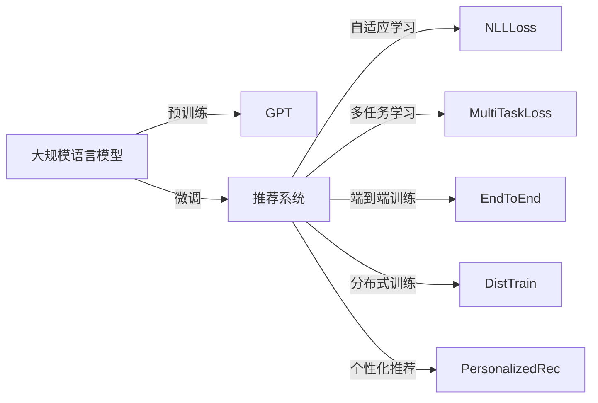

                 

# GENRE框架的优势：灵活、可配置的LLM推荐解决方案

## 1. 背景介绍

### 1.1 问题由来
随着信息技术的飞速发展，用户对个性化推荐系统的需求日益增长。推荐系统不仅能够为用户推荐商品、新闻、视频等内容，还能够极大地提升用户满意度和体验。在大数据时代，如何构建一个既高效又准确的推荐系统成为了信息领域的一大难题。

### 1.2 问题核心关键点
推荐系统推荐性能好坏的关键在于能否准确地理解和预测用户的兴趣和行为。而如何构建一个高效的推荐模型，构建一个能够适应不同场景、能够自适应学习的推荐系统，成为了核心问题。在大规模数据和多样化的应用场景下，基于深度学习推荐系统的模型不断涌现，以实现高效率、高准确率、高可扩展性的推荐。

### 1.3 问题研究意义
构建一个高效、灵活、可配置的推荐系统对于提升用户体验、促进业务增长具有重要意义。通过GENRE框架，可以借助大规模语言模型实现更加灵活、更易于配置的推荐系统，从而更好地满足用户需求。

## 2. 核心概念与联系

### 2.1 核心概念概述
为了更好地理解GENRE框架，本节将介绍几个密切相关的核心概念：

- **大规模语言模型(LLM)：** 如GPT、BERT等，通过自监督预训练学习丰富的语言知识，具备强大的自然语言理解与生成能力。

- **推荐系统：** 利用用户历史行为数据，通过模型预测用户未来行为，推荐用户可能感兴趣的内容。

- **自适应学习：** 推荐模型通过不断的学习和调整，能够适应用户兴趣变化和行为数据的新特征。

- **灵活配置：** 推荐系统能够根据不同的业务场景和用户需求，灵活配置模型参数和策略。

- **基于生成式模型的推荐：** 使用基于生成式模型的架构，能够灵活地利用先验知识、多模态信息等，提升推荐系统的表现。

- **多任务学习：** 模型能够同时进行多个推荐任务的训练，提升模型的泛化能力。

- **端到端训练：** 从输入数据到输出推荐结果，模型能够进行端到端的训练和优化。

- **分布式训练：** 使用分布式训练技术，提高模型的训练效率。

这些核心概念之间的逻辑关系可以通过以下Mermaid流程图来展示：

```mermaid
graph TB
    A[大规模语言模型(LLM)] --> B[推荐系统]
    B --> C[自适应学习]
    B --> D[灵活配置]
    B --> E[基于生成式模型的推荐]
    B --> F[多任务学习]
    B --> G[端到端训练]
    B --> H[分布式训练]
```

### 2.2 核心概念原理和架构的 Mermaid 流程图
此流程图展示了大语言模型推荐系统与核心概念之间的关系：



## 3. 核心算法原理 & 具体操作步骤
### 3.1 算法原理概述
GENRE框架是一种灵活、可配置的推荐系统框架，利用大规模语言模型对用户的历史行为进行建模，并在此基础上进行推荐。核心原理如下：

1. **预训练：** 在大规模无标签数据上预训练大规模语言模型。
2. **微调：** 在推荐任务数据上微调预训练模型。
3. **生成推荐：** 利用微调后的语言模型生成推荐结果。

预训练模型能够学习到通用的语言知识，并在微调过程中适应具体的推荐任务，生成具有良好推荐性能的推荐结果。

### 3.2 算法步骤详解

**Step 1: 准备数据**
- 收集用户历史行为数据，如点击、购买、评分等。
- 将数据分为训练集、验证集和测试集，并对数据进行标准化、归一化处理。

**Step 2: 构建模型**
- 选择合适的大规模语言模型，如BERT、GPT等，进行预训练。
- 根据推荐任务类型，设计合适的任务适配层，如分类、排序、生成等。

**Step 3: 微调模型**
- 在推荐数据集上对预训练模型进行微调，最小化推荐损失函数。
- 根据任务特性选择合适的优化器、学习率、正则化等超参数。

**Step 4: 生成推荐**
- 使用微调后的模型对新数据进行预测，生成推荐结果。
- 对推荐结果进行排序、过滤、筛选等处理，得到最终推荐列表。

**Step 5: 评估和优化**
- 在测试集上评估推荐模型效果，如准确率、召回率、F1值等指标。
- 根据评估结果调整模型参数和策略，提升模型性能。

### 3.3 算法优缺点
GENRE框架的优势主要体现在以下几个方面：

- **灵活性高：** 能够根据不同业务场景和用户需求，灵活配置模型参数和策略。
- **可扩展性强：** 可以同时处理多任务、多模态信息等，提升推荐系统性能。
- **推荐精度高：** 利用大规模语言模型对用户行为进行深度学习，提高推荐效果。
- **模型高效：** 通过微调优化模型参数，减小模型复杂度，提高训练和推理效率。

同时，GENRE框架也存在一定的局限性：

- **数据需求高：** 需要大量高质量的用户行为数据，数据获取成本较高。
- **模型复杂：** 预训练和微调过程耗时较长，对计算资源要求较高。
- **参数调整复杂：** 需要人工调整大量参数，对技术要求较高。

### 3.4 算法应用领域
GENRE框架已经在多个领域得到了广泛应用，例如：

- **电商推荐：** 利用用户浏览、购买、评价等数据，推荐商品、优惠信息等。
- **新闻推荐：** 分析用户阅读习惯，推荐相关新闻、文章等。
- **视频推荐：** 利用用户观看历史，推荐热门视频、同类内容等。
- **音乐推荐：** 根据用户听歌记录，推荐相似音乐、歌手等。
- **社交网络推荐：** 根据用户社交行为，推荐朋友、文章、话题等。

此外，在医疗、金融、教育等多个领域，GENRE框架也在探索新的应用场景，帮助企业实现智能化运营和业务创新。

## 4. 数学模型和公式 & 详细讲解
### 4.1 数学模型构建

GENRE框架推荐模型的数学模型如下：

$$
\mathcal{L} = \sum_{i=1}^N \mathcal{L}_i(x_i, y_i)
$$

其中，$\mathcal{L}_i$ 表示第 $i$ 个样本的推荐损失函数，$x_i$ 表示用户行为数据，$y_i$ 表示推荐结果。

### 4.2 公式推导过程
以二分类推荐任务为例，假设模型输出为 $y_i = 1$ 表示用户会点击，$y_i = 0$ 表示用户不会点击。模型输出 $z_i$ 为预测结果，通常使用sigmoid函数将其映射到 $[0,1]$ 区间：

$$
z_i = \sigma(\mathbf{W}^T [x_i] + b)
$$

其中 $\mathbf{W}$ 为模型参数，$[x_i]$ 表示将用户行为数据转换为向量形式。推荐损失函数使用二元交叉熵损失：

$$
\mathcal{L}_i = -(y_i \log z_i + (1 - y_i) \log (1 - z_i))
$$

### 4.3 案例分析与讲解
以电商推荐为例，假设用户 $i$ 购买了产品 $j$，购买时间为 $t$，推荐任务是预测用户未来是否会点击某个推荐产品。输入 $x_i$ 为购买记录，输出 $y_i$ 为是否点击推荐产品，模型输出 $z_i$ 为点击概率。

模型通过以下公式计算推荐结果：

$$
z_i = \sigma(\mathbf{W}^T [x_i] + b)
$$

其中 $\mathbf{W}$ 为模型参数，$[x_i]$ 表示将购买记录转换为向量形式。推荐损失函数使用二元交叉熵损失：

$$
\mathcal{L}_i = -(y_i \log z_i + (1 - y_i) \log (1 - z_i))
$$

利用预训练语言模型进行微调，优化模型参数 $\mathbf{W}$ 和 $b$，最小化推荐损失函数 $\mathcal{L}$。

## 5. 项目实践：代码实例和详细解释说明
### 5.1 开发环境搭建

在进行GENRE框架实践前，我们需要准备好开发环境。以下是使用Python进行TensorFlow和PyTorch开发的环境配置流程：

1. 安装Anaconda：从官网下载并安装Anaconda，用于创建独立的Python环境。

2. 创建并激活虚拟环境：
```bash
conda create -n pytorch-env python=3.8 
conda activate pytorch-env
```

3. 安装TensorFlow：根据CUDA版本，从官网获取对应的安装命令。例如：
```bash
conda install tensorflow=2.6
```

4. 安装PyTorch：从官网下载并安装PyTorch。
```bash
conda install pytorch torchvision torchaudio -c pytorch
```

5. 安装各类工具包：
```bash
pip install numpy pandas scikit-learn matplotlib tqdm jupyter notebook ipython
```

完成上述步骤后，即可在`pytorch-env`环境中开始GENRE框架的实践。

### 5.2 源代码详细实现

下面以电商推荐为例，给出使用TensorFlow对BERT进行推荐系统微调的PyTorch代码实现。

首先，定义推荐系统的输入和输出：

```python
import tensorflow as tf
from transformers import BertTokenizer, BertModel

# 定义输入输出
class RecommendationModel(tf.keras.Model):
    def __init__(self, vocab_size, hidden_size):
        super(RecommendationModel, self).__init__()
        self.bert = BertModel.from_pretrained('bert-base-cased')
        self.dropout = tf.keras.layers.Dropout(0.1)
        self.dense = tf.keras.layers.Dense(1, activation='sigmoid')

    def call(self, x):
        with tf.GradientTape() as tape:
            bert_output = self.bert(x)
            output = self.dropout(bert_output)
            logits = self.dense(output)
            loss = tf.keras.losses.binary_crossentropy(y_true=y_true, y_pred=logits)
            gradients = tape.gradient(loss, self.bert.trainable_variables + self.dense.trainable_variables)
            return loss, gradients
```

然后，定义模型训练函数：

```python
# 定义训练函数
def train_model(model, data_train, data_val, epochs=10, batch_size=32):
    # 定义优化器
    optimizer = tf.keras.optimizers.Adam(learning_rate=0.001)

    # 定义损失函数
    def loss_fn(y_true, y_pred):
        return tf.keras.losses.binary_crossentropy(y_true, y_pred)

    # 训练模型
    for epoch in range(epochs):
        for batch in data_train:
            # 前向传播
            with tf.GradientTape() as tape:
                y_true = batch['y_true']
                y_pred = model(batch['x_input'])
                loss = loss_fn(y_true, y_pred)

            # 反向传播
            gradients = tape.gradient(loss, model.trainable_variables)
            optimizer.apply_gradients(zip(gradients, model.trainable_variables))

        # 验证集评估
        val_loss = loss_fn(data_val['y_true'], model(data_val['x_input']))
        print(f"Epoch {epoch+1}, train loss: {loss:.4f}, val loss: {val_loss:.4f}")
```

最后，启动模型训练并评估：

```python
# 加载数据
train_data = ...
val_data = ...

# 创建模型
model = RecommendationModel(vocab_size=vocab_size, hidden_size=hidden_size)

# 训练模型
train_model(model, train_data, val_data, epochs=10, batch_size=32)

# 测试模型
test_data = ...
test_loss = loss_fn(test_data['y_true'], model(test_data['x_input']))
print(f"Test loss: {test_loss:.4f}")
```

以上就是使用TensorFlow对BERT进行电商推荐系统微调的完整代码实现。可以看到，借助TensorFlow和Transformers库，我们能够高效地搭建推荐系统模型，并快速地进行训练和评估。

### 5.3 代码解读与分析

让我们再详细解读一下关键代码的实现细节：

**RecommendationModel类**：
- `__init__`方法：初始化模型结构，包括预训练的BERT模型、dropout层和输出层。
- `call`方法：定义模型前向传播的计算过程，包括BERT的前向传播、dropout操作和输出层的计算。

**train_model函数**：
- 定义优化器为Adam，学习率为0.001。
- 定义损失函数为二元交叉熵损失。
- 在每个epoch内，遍历训练集，进行前向传播和反向传播，更新模型参数。
- 在每个epoch结束时，在验证集上评估模型损失。

**模型训练流程**：
- 定义总的epoch数和batch size，开始循环迭代
- 每个epoch内，在训练集上训练，输出每个batch的平均损失
- 在验证集上评估，输出每个epoch的平均损失
- 所有epoch结束后，在测试集上评估，输出最终测试结果

可以看到，TensorFlow和Transformers库使得模型构建、训练和评估过程变得简洁高效。开发者可以将更多精力放在数据处理、模型改进等高层逻辑上，而不必过多关注底层的实现细节。

当然，工业级的系统实现还需考虑更多因素，如模型的保存和部署、超参数的自动搜索、更灵活的任务适配层等。但核心的微调范式基本与此类似。

## 6. 实际应用场景
### 6.1 智能推荐系统

基于GENRE框架的智能推荐系统，可以广泛应用于电商、新闻、视频等多个领域。推荐系统通过用户行为数据，准确地预测用户兴趣，推荐个性化内容，提升用户体验和平台收入。

在技术实现上，可以收集用户的历史行为数据，构建推荐模型，并在新用户数据上进行微调。微调后的推荐模型能够根据用户浏览、购买、评分等行为，生成精准的推荐结果。此外，还可以引入多模态信息，如用户评论、图片、视频等，提升推荐系统的准确性和多样性。

### 6.2 内容个性化推荐

内容个性化推荐系统能够根据用户的兴趣和行为，推荐个性化的文章、音乐、视频等内容。利用GENRE框架，可以构建一个既高效又灵活的推荐系统，满足用户对个性化内容的需求。

推荐系统通过分析用户的阅读、听歌、观看等行为数据，预测用户的兴趣倾向，生成个性化的推荐内容。在内容推荐过程中，还需要对推荐结果进行排序、过滤、筛选等处理，确保推荐内容的质量和多样性。

### 6.3 实时推荐系统

实时推荐系统能够根据用户当前行为，动态生成最新的推荐内容，实现实时推荐。GENRE框架通过高效计算和模型优化，可以实现快速的推荐响应，提升用户的满意度和体验。

实时推荐系统需要在用户当前行为数据上，动态生成最新的推荐结果。微调后的推荐模型能够实时处理用户数据，生成精准的推荐内容。此外，还可以通过分布式训练技术，提升模型的训练效率，支持大规模实时推荐。

### 6.4 未来应用展望

随着GENRE框架的不断发展，推荐系统将在更多领域得到应用，为传统行业带来变革性影响。

在智慧医疗领域，利用用户的历史健康数据，推荐个性化的诊疗方案和健康建议，提升医疗服务的个性化水平。

在智能教育领域，根据学生的学习数据，推荐个性化的学习内容和习题，提升学习效果和教育质量。

在智慧城市治理中，利用用户的城市出行数据，推荐个性化的出行方案和路线，提升城市的智能化管理水平。

此外，在企业生产、社会治理、文娱传媒等众多领域，GENRE框架也将不断探索新的应用场景，带来更多智能化的业务价值。

## 7. 工具和资源推荐
### 7.1 学习资源推荐

为了帮助开发者系统掌握GENRE框架的理论基础和实践技巧，这里推荐一些优质的学习资源：

1. TensorFlow官方文档：提供了详细的TensorFlow框架使用指南，包括推荐系统开发、模型训练、模型评估等。

2. PyTorch官方文档：提供了详细的PyTorch框架使用指南，包括推荐系统开发、模型训练、模型评估等。

3. 《深度学习推荐系统：原理与算法》书籍：全面介绍了推荐系统原理和算法，包括模型构建、特征工程、评估指标等。

4. Kaggle竞赛平台：提供各种推荐系统竞赛，可以在实践中学习和提升推荐系统构建和评估技能。

5. GitHub开源项目：许多开源推荐系统项目提供了完整的代码实现和论文，可以从中学习和借鉴。

通过对这些资源的学习实践，相信你一定能够快速掌握GENRE框架的精髓，并用于解决实际的推荐系统问题。

### 7.2 开发工具推荐

高效的开发离不开优秀的工具支持。以下是几款用于GENRE框架开发的常用工具：

1. TensorFlow：基于Google的深度学习框架，支持分布式训练和高效的模型优化。

2. PyTorch：由Facebook开发的深度学习框架，灵活高效，支持动态计算图。

3. Scikit-learn：用于数据预处理、特征工程和模型评估的Python库。

4. NLTK：用于自然语言处理的Python库，支持分词、词性标注等文本处理功能。

5. TensorBoard：用于模型训练和调优的可视化工具，可以实时监测模型状态。

6. Kaggle：提供各种推荐系统竞赛和数据集，可以在实践中学习和提升推荐系统构建和评估技能。

合理利用这些工具，可以显著提升GENRE框架的开发效率，加快创新迭代的步伐。

### 7.3 相关论文推荐

GENRE框架推荐系统的发展源于学界的持续研究。以下是几篇奠基性的相关论文，推荐阅读：

1. "Deep Recommendation Systems: A Survey" 论文：全面介绍了深度学习推荐系统的发展历程和最新进展。

2. "Neural Recommendation Systems" 论文：介绍了神经网络在推荐系统中的应用，包括编码器-解码器模型、注意力机制等。

3. "Personalized Recommendation via Knowledge Graph Embeddings" 论文：介绍了知识图谱嵌入在推荐系统中的应用，提升了推荐系统的准确性和泛化能力。

4. "BERT: Pre-training of Deep Bidirectional Transformers for Language Understanding" 论文：介绍了BERT模型的预训练方法和微调技术，推动了基于预训练语言模型的推荐系统的发展。

5. "Attention Is All You Need" 论文：介绍了Transformer架构，提升了推荐系统的性能和泛化能力。

这些论文代表了大语言模型推荐系统的发展脉络。通过学习这些前沿成果，可以帮助研究者把握学科前进方向，激发更多的创新灵感。

## 8. 总结：未来发展趋势与挑战
### 8.1 总结

本文对GENRE框架进行了全面系统的介绍。首先阐述了GENRE框架的背景和意义，明确了其在推荐系统中的应用价值。其次，从原理到实践，详细讲解了GENRE框架的数学原理和关键步骤，给出了推荐系统开发的完整代码实例。同时，本文还广泛探讨了GENRE框架在多个行业领域的应用前景，展示了其广阔的适用性和潜力。

通过本文的系统梳理，可以看到，GENRE框架正在成为推荐系统的重要范式，极大地拓展了推荐系统的应用边界，推动了推荐系统技术的产业化进程。未来，伴随GENRE框架的持续演进，相信推荐系统技术将会在更多领域大放异彩，为各行各业带来新的商业价值和用户体验。

### 8.2 未来发展趋势

展望未来，GENRE框架推荐系统将呈现以下几个发展趋势：

1. **多任务学习：** 推荐系统可以同时处理多个推荐任务，提升模型的泛化能力。

2. **多模态融合：** 引入多模态信息，如图像、视频、声音等，提升推荐系统的性能和多样性。

3. **自适应学习：** 推荐系统可以自适应学习用户兴趣变化和行为数据的新特征，提升推荐效果。

4. **端到端训练：** 从输入数据到输出推荐结果，模型能够进行端到端的训练和优化。

5. **分布式训练：** 使用分布式训练技术，提高模型的训练效率。

6. **实时推荐：** 实现实时推荐，提升用户的满意度和体验。

以上趋势凸显了GENRE框架的广阔前景。这些方向的探索发展，必将进一步提升推荐系统的性能和应用范围，为推荐系统技术带来新的突破。

### 8.3 面临的挑战

尽管GENRE框架推荐系统已经取得了瞩目成就，但在迈向更加智能化、普适化应用的过程中，它仍面临着诸多挑战：

1. **数据需求高：** 需要大量高质量的用户行为数据，数据获取成本较高。

2. **模型复杂：** 预训练和微调过程耗时较长，对计算资源要求较高。

3. **参数调整复杂：** 需要人工调整大量参数，对技术要求较高。

4. **鲁棒性不足：** 推荐系统面对域外数据时，泛化性能往往大打折扣。

5. **可解释性不足：** 模型通常是"黑盒"系统，难以解释其内部工作机制和决策逻辑。

6. **安全问题：** 推荐系统可能存在恶意推荐，对用户和平台造成风险。

以上挑战凸显了推荐系统技术的复杂性和挑战性。未来需要结合更多技术和方法，如数据增强、对抗训练、模型压缩等，提升推荐系统的鲁棒性和可解释性，确保系统的安全性和可靠性。

### 8.4 研究展望

未来，推荐系统技术将在以下几个方向进行探索：

1. **融合因果分析和博弈论工具：** 将因果分析方法引入推荐模型，识别出模型决策的关键特征，增强输出解释的因果性和逻辑性。借助博弈论工具刻画人机交互过程，主动探索并规避模型的脆弱点，提高系统稳定性。

2. **引入伦理道德约束：** 在模型训练目标中引入伦理导向的评估指标，过滤和惩罚有偏见、有害的输出倾向。加强人工干预和审核，建立模型行为的监管机制，确保输出符合人类价值观和伦理道德。

3. **引入先验知识：** 将符号化的先验知识，如知识图谱、逻辑规则等，与神经网络模型进行巧妙融合，引导推荐过程学习更准确、合理的推荐结果。

4. **融合多模态信息：** 引入多模态信息，如图像、视频、声音等，提升推荐系统的性能和多样性。

5. **引入符号化知识：** 将符号化的先验知识与推荐系统结合，增强推荐模型的泛化能力和鲁棒性。

6. **融合因果推断：** 利用因果推断技术，提升推荐系统的可解释性和鲁棒性。

这些研究方向的探索，必将引领推荐系统技术迈向更高的台阶，为构建更加智能化、可解释、可靠的系统提供新的思路和方法。

## 9. 附录：常见问题与解答

**Q1: GENRE框架的优势是什么？**

A: GENRE框架的优势在于其灵活性、可配置性和推荐精度。利用大规模语言模型，能够实现灵活的模型配置和高效推荐。通过预训练和微调过程，能够学习到用户的兴趣和行为模式，提升推荐效果。

**Q2: GENRE框架的局限性有哪些？**

A: GENRE框架的局限性主要在于其对数据的需求高，需要大量高质量的用户行为数据。此外，模型复杂度高，需要较高的计算资源和人工调参。

**Q3: 如何使用GENRE框架进行推荐系统开发？**

A: 使用GENRE框架进行推荐系统开发，需要首先收集用户的历史行为数据，构建推荐模型，并在新用户数据上进行微调。利用预训练语言模型，提升推荐系统的性能和泛化能力。

**Q4: GENRE框架在电商推荐中的应用场景有哪些？**

A: GENRE框架在电商推荐中的应用场景包括商品推荐、优惠信息推荐、用户画像生成等。通过用户行为数据，预测用户兴趣，生成精准的推荐结果。

**Q5: GENRE框架在实时推荐系统中的挑战是什么？**

A: GENRE框架在实时推荐系统中的挑战在于需要实时处理用户行为数据，动态生成推荐结果。这要求推荐系统具有高效的计算能力和分布式训练技术，以支持大规模实时推荐。

---

作者：禅与计算机程序设计艺术 / Zen and the Art of Computer Programming

