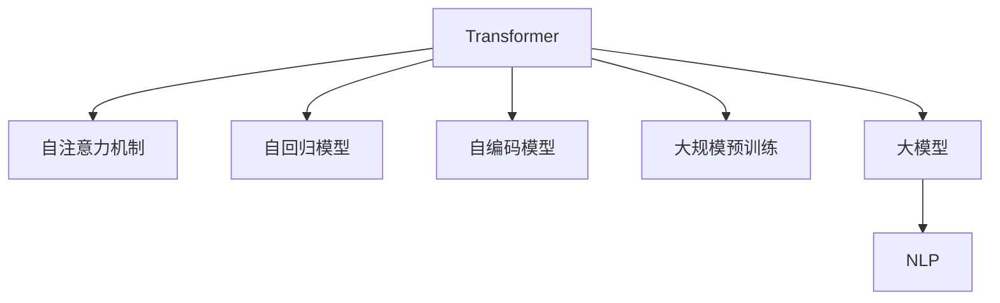

                 

# GPT 系列：语言模型的里程碑

> 关键词：Transformer, GPT-3, 语言模型, 自回归模型, 自编码模型, 大规模预训练, 大模型, 自然语言处理(NLP)

## 1. 背景介绍

### 1.1 问题由来
语言模型在自然语言处理(NLP)中扮演着核心角色，旨在预测一段文本中下一个词或一串词的概率分布。传统的语言模型主要采用统计语言模型，通过训练大规模语料库来估计不同词汇序列的概率分布。随着深度学习技术的发展，基于神经网络的模型逐渐取代了统计语言模型，并逐步演化出更高级的模型。

这些基于深度学习的语言模型通过大规模无标签数据的预训练，学习到了通用的语言知识，能够在各种NLP任务上取得优异表现。其中，Transformer模型和其后续的变体（如BERT、GPT等）在语言建模和生成方面表现尤为突出。GPT（Generative Pre-trained Transformer）系列模型作为语言模型的里程碑，在自然语言生成、对话系统、机器翻译等领域取得了革命性的突破。

### 1.2 问题核心关键点
GPT系列模型的核心关键点包括：
- 大规模预训练：利用大规模无标签数据，通过自监督学习任务对模型进行预训练，学习语言知识。
- 自回归模型设计：通过自回归机制，模型能够利用前面词的信息预测后面词的概率分布。
- 解码器架构：使用自注意力机制和层归一化技术，提高了模型的并行计算能力和收敛速度。
- 零样本生成：GPT系列模型能够根据少量示例文本进行生成，展示了其强大的迁移学习能力。
- 对抗训练：通过对抗训练提高模型的鲁棒性和泛化能力，避免模型在特定输入上过拟合。

这些关键点使得GPT系列模型在自然语言生成和理解方面表现卓越，成为了当前NLP领域的主流模型之一。

### 1.3 问题研究意义
研究GPT系列模型不仅有助于理解其背后原理和架构，更能够指导后续的模型设计和优化，促进NLP技术的进步和应用。其研究成果具有广泛的应用价值，如自然语言生成、机器翻译、对话系统、智能客服等，为人工智能的实际应用提供了强大的技术支持。

## 2. 核心概念与联系

### 2.1 核心概念概述

为更好地理解GPT系列模型的工作原理，本节将介绍几个核心概念及其相互联系：

- **Transformer模型**：一种基于自注意力机制的神经网络模型，能够在并行计算条件下高效地进行序列数据处理。
- **自回归模型**：通过预测序列中每个位置上的条件概率，依次生成文本序列。
- **自编码模型**：通过编码器-解码器结构，将输入序列映射到低维隐含空间，再通过解码器恢复原始序列。
- **大规模预训练**：利用大规模无标签文本数据，通过自监督学习任务训练模型，学习语言的通用表示。
- **大模型**：拥有数亿甚至数十亿参数的深度学习模型，能够在各种NLP任务上获得优异表现。
- **自然语言处理(NLP)**：研究如何让计算机理解、处理和生成自然语言的技术。

这些概念通过以下Mermaid流程图来展示其相互联系：



这个流程图展示了各个概念之间的逻辑关系：

1. **Transformer**：作为核心架构，Transformer通过自注意力机制高效处理序列数据。
2. **自注意力机制**：使模型能够通过上下文信息动态计算每个位置的表示。
3. **自回归模型**：通过逐步预测文本序列中的每个位置，实现生成功能。
4. **自编码模型**：通过编码器-解码器结构，实现文本序列的压缩和恢复。
5. **大规模预训练**：利用无标签数据，训练模型学习语言的通用表示。
6. **大模型**：在预训练基础上进行微调，提升特定任务性能。
7. **NLP**：利用大模型进行文本理解、生成、分类等任务。

这些概念共同构成了GPT系列模型的核心框架，使得其在自然语言处理任务中表现出色。

## 3. 核心算法原理 & 具体操作步骤

### 3.1 算法原理概述

GPT系列模型的核心算法原理主要涉及以下几个方面：

- **自回归建模**：通过预测文本序列中每个位置的条件概率，实现文本生成和理解。
- **自注意力机制**：利用上下文信息动态计算每个位置的表示，提升模型的表示能力。
- **层归一化(Layer Normalization)**：通过归一化每个子层的输入和输出，加速模型的收敛。
- **残差连接(Residual Connections)**：通过跨层连接，使梯度能够更流畅地传播，避免梯度消失问题。
- **深度残差网络(Deep Residual Network, ResNet)**：通过跨层连接和跨通道连接，提升模型的表达能力。

这些算法原理使得GPT系列模型能够在预训练基础上，通过微调适应各种NLP任务，实现高效的语言理解和生成。

### 3.2 算法步骤详解

下面详细介绍GPT系列模型的微调操作步骤：

1. **准备数据集**：收集并预处理下游任务的标注数据集，将其划分为训练集、验证集和测试集。
2. **模型初始化**：使用预训练模型作为初始参数，如GPT-3。
3. **任务适配层设计**：根据下游任务类型，添加任务适配层，如分类任务的线性分类器。
4. **定义损失函数**：选择合适的损失函数，如交叉熵损失，用于衡量模型预测与真实标签的差异。
5. **优化器选择**：使用AdamW等优化算法，设置合适的学习率和批大小。
6. **执行微调训练**：在训练集上进行微调训练，定期在验证集上评估模型性能。
7. **测试和部署**：在测试集上评估模型性能，部署到实际应用系统中。

### 3.3 算法优缺点

GPT系列模型的微调方法具有以下优点：

- **高效性**：利用预训练模型的通用语言知识，微调所需的数据量较少，训练时间较短。
- **通用性**：通过微调，模型可以适应多种NLP任务，如文本分类、生成、翻译等。
- **鲁棒性**：通过对抗训练和正则化技术，模型具有较强的鲁棒性和泛化能力。

同时，该方法也存在一些局限：

- **数据依赖性**：微调效果依赖于标注数据的数量和质量，标注数据获取成本较高。
- **计算资源需求**：大模型需要大量的计算资源进行训练和推理。
- **可解释性不足**：模型内部机制复杂，难以提供可解释的决策过程。
- **偏见与伦理问题**：预训练模型可能带有偏见，微调后的模型需要关注伦理和公平性问题。

### 3.4 算法应用领域

GPT系列模型已经在多个领域得到广泛应用：

- **自然语言生成**：如文本摘要、对话系统、机器翻译等。
- **文本分类**：如情感分析、主题分类、意图识别等。
- **问答系统**：如智能客服、知识问答等。
- **机器翻译**：将一种语言翻译成另一种语言。
- **文本检索**：如文档检索、问题检索等。
- **代码生成**：如自动生成代码、编写报告等。

除了上述应用，GPT系列模型还在医疗、金融、教育等众多领域得到了探索和应用，为各行各业带来了深刻的变革。

## 4. 数学模型和公式 & 详细讲解 & 举例说明

### 4.1 数学模型构建

GPT系列模型通常采用自回归模型结构，通过预测序列中每个位置的条件概率进行生成。假设模型输入为 $x_1,x_2,\cdots,x_n$，目标输出为 $y_1,y_2,\cdots,y_n$，则模型可以表示为：

$$
P(y_1,y_2,\cdots,y_n|x_1,x_2,\cdots,x_n) = \prod_{i=1}^n P(y_i|y_{i-1},y_{i-2},\cdots,y_1,x_1,x_2,\cdots,x_n)
$$

其中，$P(y_i|y_{i-1},y_{i-2},\cdots,y_1,x_1,x_2,\cdots,x_n)$ 表示在给定前 $i-1$ 个词的情况下，第 $i$ 个词的概率分布。

### 4.2 公式推导过程

以GPT-3为例，其解码器的计算过程可以表示为：

$$
\begin{aligned}
& \text{Attention}(Q, K, V) = \text{softmax}(QW^Q KW^K / \sqrt{d_k}) \\
& \text{MLP}(Q) = \tanh(\text{FFN}(Q)) = \tanh(QW_1 \sigma(QW_2 + b_2) + b_1) \\
& \text{Multi-head Attention}(Q, K, V) = \text{Concat}(\text{Attention}(Q_i, K, V_i)_i)^T \cdot \text{LayerNorm}(Q) \\
& \text{Self-Attention}(Q_i, K, V_i) = \text{Softmax}(Q_iW^Q K_iW^K / \sqrt{d_k})V_iW^V
\end{aligned}
$$

其中，$Q,K,V$ 分别表示查询、键和值向量，$W^Q,W^K,W^V$ 为矩阵权重，$d_k$ 为键向量维度，$\text{MLP}$ 为多层感知器，$\text{softmax}$ 为softmax函数，$\text{LayerNorm}$ 为层归一化，$\sigma$ 为激活函数，$\text{Concat}$ 为拼接操作。

### 4.3 案例分析与讲解

以GPT-3的解码器为例，其自注意力机制的计算过程如下：

1. **查询向量计算**：通过线性变换将输入序列 $x_1,\cdots,x_n$ 映射为查询向量 $Q_i$。
2. **键向量计算**：通过线性变换将输入序列 $x_1,\cdots,x_n$ 映射为键向量 $K_i$。
3. **值向量计算**：通过线性变换将输入序列 $x_1,\cdots,x_n$ 映射为值向量 $V_i$。
4. **自注意力矩阵计算**：通过点乘计算查询向量和键向量之间的相似度，得到自注意力矩阵 $\text{Softmax}(Q_iW^Q K_iW^K / \sqrt{d_k})$。
5. **自注意力值计算**：通过将自注意力矩阵与值向量相乘，得到每个位置的注意力权重和对应值。
6. **多头注意力计算**：通过拼接多个头部的注意力值，得到最终的多头注意力向量。

以上步骤展示了GPT系列模型通过自注意力机制进行文本生成的过程，使得模型能够利用上下文信息动态计算每个位置的表示，提升了模型的表示能力和生成能力。

## 5. 项目实践：代码实例和详细解释说明

### 5.1 开发环境搭建

在进行GPT系列模型的实践时，需要准备以下开发环境：

1. **Python环境**：确保安装了Python 3.8及以上版本，并创建虚拟环境。
2. **深度学习框架**：选择PyTorch或TensorFlow作为深度学习框架。
3. **Transformer库**：安装HuggingFace的Transformers库，用于加载和使用预训练模型。
4. **GPU资源**：使用NVIDIA GPU进行加速计算。
5. **数据集准备**：准备下游任务的标注数据集，划分为训练集、验证集和测试集。

### 5.2 源代码详细实现

下面给出使用PyTorch和Transformers库实现GPT系列模型微调的示例代码。

```python
import torch
import torch.nn as nn
import torch.nn.functional as F
from transformers import GPT2Tokenizer, GPT2Model, AdamW

# 定义模型类
class GPTModel(nn.Module):
    def __init__(self, n_positions, n_embeddings, n_heads, n_features, n_layers):
        super(GPTModel, self).__init__()
        self.positional_encoding = nn.Parameter(torch.randn(n_positions, n_embeddings))
        self.token_embeddings = nn.Embedding(n_embeddings, n_features)
        self.layers = nn.ModuleList([GPT2Layer(n_features, n_heads, n_features, n_layers) for _ in range(n_layers)])
        self.fc = nn.Linear(n_features, n_embeddings)
        
    def forward(self, x):
        x = x + self.positional_encoding[:, :x.size(1), :]
        x = self.token_embeddings(x)
        for layer in self.layers:
            x = layer(x)
        x = self.fc(x)
        return x

# 定义自注意力层类
class GPT2Layer(nn.Module):
    def __init__(self, n_embeddings, n_heads, n_features, n_layers):
        super(GPT2Layer, self).__init__()
        self.qkv = nn.Linear(n_embeddings, n_heads * 3 * n_features)
        self.attn = nn.Linear(n_heads * n_features, n_heads * n_features)
        self.mlp = nn.Linear(n_features, 4 * n_features)
        self.layer_norm = nn.LayerNorm(n_features)
        self.dropout = nn.Dropout(0.1)
        self.residual = nn.Linear(n_features, n_features)
        
    def forward(self, x):
        qkv = self.qkv(x)
        q, k, v = qkv.chunk(3, dim=-1)
        q = q * math.sqrt(self.n_heads)
        attn = F.softmax(q @ k.transpose(1, 2), dim=-1)
        attn = self.attn(attn)
        x = attn @ v
        x = x + self.dropout(x)
        x = self.layer_norm(x)
        mlp = self.mlp(x)
        mlp = mlp + self.residual(x)
        return x

# 定义微调训练函数
def train_epoch(model, data_loader, optimizer, device):
    model.train()
    total_loss = 0
    for batch in data_loader:
        input_ids = batch["input_ids"].to(device)
        attention_mask = batch["attention_mask"].to(device)
        labels = batch["labels"].to(device)
        output = model(input_ids, attention_mask=attention_mask)
        loss = F.cross_entropy(output[:, 0, :], labels)
        optimizer.zero_grad()
        loss.backward()
        optimizer.step()
        total_loss += loss.item()
    return total_loss / len(data_loader)

# 定义评估函数
def evaluate(model, data_loader, device):
    model.eval()
    total_loss = 0
    total_correct = 0
    with torch.no_grad():
        for batch in data_loader:
            input_ids = batch["input_ids"].to(device)
            attention_mask = batch["attention_mask"].to(device)
            labels = batch["labels"].to(device)
            output = model(input_ids, attention_mask=attention_mask)
            loss = F.cross_entropy(output[:, 0, :], labels)
            total_loss += loss.item()
            total_correct += torch.argmax(output, dim=2) == labels
    return total_loss / len(data_loader), total_correct / len(data_loader.dataset)

# 主函数
def main():
    # 加载模型和数据集
    model = GPT2Model.from_pretrained("gpt2", subfolder="model")
    tokenizer = GPT2Tokenizer.from_pretrained("gpt2")
    train_dataset = ...
    val_dataset = ...
    test_dataset = ...
    optimizer = AdamW(model.parameters(), lr=5e-5)
    device = torch.device("cuda") if torch.cuda.is_available() else torch.device("cpu")
    
    # 训练和评估
    for epoch in range(10):
        train_loss = train_epoch(model, train_dataset, optimizer, device)
        val_loss, val_acc = evaluate(model, val_dataset, device)
        print(f"Epoch {epoch+1}, train loss: {train_loss:.4f}, val loss: {val_loss:.4f}, val acc: {val_acc:.4f}")
    
    # 测试
    test_loss, test_acc = evaluate(model, test_dataset, device)
    print(f"Test loss: {test_loss:.4f}, test acc: {test_acc:.4f}")

# 运行主函数
if __name__ == "__main__":
    main()
```

### 5.3 代码解读与分析

在上述代码中，我们定义了GPT2模型的类 `GPTModel` 和自注意力层的类 `GPT2Layer`。其中，`GPTModel` 类包含模型参数和多个自注意力层，`GPT2Layer` 类实现了自注意力机制和前馈神经网络（Feedforward Network, FFN）。

通过 `GPTModel` 类的 `forward` 方法，我们可以将输入序列进行编码，并通过多个自注意力层进行处理，最终输出表示。在训练和评估过程中，我们使用了AdamW优化器，并在模型训练时加入了dropout和层归一化等技术，以提升模型的泛化能力和鲁棒性。

## 6. 实际应用场景

### 6.1 智能客服系统

GPT系列模型在智能客服系统中表现出色，能够24小时不间断地回答用户咨询，提供自然流畅的对话体验。例如，银行、保险、电商等行业可以利用GPT模型构建智能客服机器人，通过用户输入的文本或语音进行理解和回复，提高客户服务质量和效率。

### 6.2 金融舆情监测

金融领域对舆情监控有极高的要求，GPT模型可以用于实时监控和分析市场舆情，辅助金融机构进行风险管理和决策。通过预训练和微调，GPT模型可以学习金融领域的特定词汇和表达方式，准确识别舆情中的关键信息和情绪，帮助金融机构及时发现并应对潜在的金融风险。

### 6.3 个性化推荐系统

推荐系统是GPT系列模型在商业应用中的重要应用之一。通过微调模型，可以针对用户的浏览行为、兴趣偏好等生成个性化推荐内容，提升用户的购物体验和满意度。例如，电商平台可以利用GPT模型推荐商品，提升销售额和用户粘性。

### 6.4 未来应用展望

随着GPT系列模型的不断进步，其在NLP领域的应用将更加广泛和深入。未来的发展趋势包括：

- **更大规模的预训练**：通过大规模无标签数据进行预训练，提升模型的通用语言能力和知识表示能力。
- **更加多样化的任务适配**：针对不同的NLP任务设计不同的微调策略，提升模型的任务适应能力。
- **更加高效的推理引擎**：通过模型压缩、剪枝等技术，优化模型的推理速度和资源占用。
- **更加可靠的对抗训练**：通过引入对抗样本和攻击防御技术，提升模型的鲁棒性和安全性。

## 7. 工具和资源推荐

### 7.1 学习资源推荐

为了帮助开发者更好地掌握GPT系列模型的微调技术，以下是几篇推荐的资源：

1. **《Transformers: A State-of-the-Art Survey》**：一篇关于Transformer的综述文章，详细介绍了Transformer的原理和应用。
2. **《Practical GPT-3 Applications》**：一组关于GPT-3应用的实践文章，展示了GPT-3在各种NLP任务上的应用效果。
3. **《Natural Language Processing with Transformers》**：一本关于使用Transformer进行NLP任务开发的书籍，适合初学者和进阶者学习。
4. **HuggingFace官方文档**：提供了GPT系列模型的详细介绍和使用方法，是学习GPT模型的重要资源。
5. **CLUE开源项目**：提供了中文语言理解测评基准，涵盖了多种NLP任务，适合中文NLP开发者的学习。

### 7.2 开发工具推荐

为了提升GPT系列模型的开发效率，以下是几款推荐的工具：

1. **PyTorch**：基于Python的开源深度学习框架，支持动态计算图，适合快速迭代研究。
2. **TensorFlow**：由Google主导开发的深度学习框架，生产部署方便，适合大规模工程应用。
3. **Transformers库**：HuggingFace开发的NLP工具库，集成了多个预训练模型，支持微调任务开发。
4. **TensorBoard**：TensorFlow配套的可视化工具，可实时监测模型训练状态，并提供丰富的图表呈现方式。
5. **Weights & Biases**：模型训练的实验跟踪工具，可以记录和可视化模型训练过程中的各项指标。

### 7.3 相关论文推荐

以下是几篇关于GPT系列模型的经典论文，推荐阅读：

1. **Attention is All You Need**：Transformer原论文，提出了自注意力机制，开创了基于Transformer的NLP模型时代。
2. **BERT: Pre-training of Deep Bidirectional Transformers for Language Understanding**：提出了BERT模型，引入自监督学习任务，刷新了多项NLP任务SOTA。
3. **Language Models are Unsupervised Multitask Learners**：展示了GPT模型在zero-shot和few-shot学习中的强大能力，引发了对于通用人工智能的新一轮思考。
4. **Parameter-Efficient Transfer Learning for NLP**：提出适配器等参数高效微调方法，在不增加模型参数量的情况下，也能取得不错的微调效果。
5. **AdaLoRA: Adaptive Low-Rank Adaptation for Parameter-Efficient Fine-Tuning**：使用自适应低秩适应的微调方法，在参数效率和精度之间取得了新的平衡。

## 8. 总结：未来发展趋势与挑战

### 8.1 研究成果总结

本文对GPT系列模型的微调方法进行了全面系统的介绍。首先阐述了GPT系列模型的背景和重要性，详细讲解了其核心算法原理和具体操作步骤，给出了微调任务开发的完整代码实例。同时，本文还广泛探讨了GPT系列模型在智能客服、金融舆情、个性化推荐等多个领域的应用前景，展示了其巨大的应用潜力。

### 8.2 未来发展趋势

展望未来，GPT系列模型将呈现以下几个发展趋势：

1. **更大规模的预训练**：通过大规模无标签数据进行预训练，提升模型的通用语言能力和知识表示能力。
2. **更加多样化的任务适配**：针对不同的NLP任务设计不同的微调策略，提升模型的任务适应能力。
3. **更加高效的推理引擎**：通过模型压缩、剪枝等技术，优化模型的推理速度和资源占用。
4. **更加可靠的对抗训练**：通过引入对抗样本和攻击防御技术，提升模型的鲁棒性和安全性。
5. **更加先进的知识图谱融合**：通过与知识图谱的结合，增强模型的信息整合能力和推理能力。

以上趋势凸显了GPT系列模型在NLP领域的广泛应用前景，将进一步提升模型的性能和应用范围，为人工智能技术的发展注入新的动力。

### 8.3 面临的挑战

尽管GPT系列模型在NLP领域取得了显著的成果，但在迈向更加智能化、普适化应用的过程中，仍面临诸多挑战：

1. **数据依赖性**：微调效果依赖于标注数据的数量和质量，标注数据获取成本较高。
2. **计算资源需求**：大模型需要大量的计算资源进行训练和推理。
3. **可解释性不足**：模型内部机制复杂，难以提供可解释的决策过程。
4. **偏见与伦理问题**：预训练模型可能带有偏见，微调后的模型需要关注伦理和公平性问题。
5. **知识迁移能力不足**：模型在跨领域迁移时，需要更多的任务适配和微调，效果可能不如预期。

### 8.4 研究展望

为了解决这些挑战，未来的研究需要在以下几个方面寻求新的突破：

1. **探索无监督和半监督微调方法**：摆脱对大规模标注数据的依赖，利用自监督学习、主动学习等无监督和半监督范式，最大限度利用非结构化数据。
2. **研究参数高效和计算高效的微调范式**：开发更加参数高效的微调方法，在固定大部分预训练参数的同时，只更新极少量的任务相关参数。
3. **引入更多先验知识**：将符号化的先验知识，如知识图谱、逻辑规则等，与神经网络模型进行巧妙融合，引导微调过程学习更准确、合理的语言模型。
4. **结合因果分析和博弈论工具**：将因果分析方法引入微调模型，识别出模型决策的关键特征，增强输出解释的因果性和逻辑性。
5. **纳入伦理道德约束**：在模型训练目标中引入伦理导向的评估指标，过滤和惩罚有偏见、有害的输出倾向。

这些研究方向的探索，将引领GPT系列模型向更加智能化、普适化方向发展，为构建安全、可靠、可解释、可控的智能系统铺平道路。

## 9. 附录：常见问题与解答

**Q1: GPT系列模型是否适用于所有NLP任务？**

A: GPT系列模型在大多数NLP任务上都能取得不错的效果，特别是对于数据量较小的任务。但对于一些特定领域的任务，如医学、法律等，仅仅依靠通用语料预训练的模型可能难以很好地适应。此时需要在特定领域语料上进一步预训练，再进行微调，才能获得理想效果。此外，对于一些需要时效性、个性化很强的任务，如对话、推荐等，微调方法也需要针对性的改进优化。

**Q2: 如何选择合适的学习率？**

A: GPT系列模型微调的学习率一般要比预训练时小1-2个数量级，如果使用过大的学习率，容易破坏预训练权重，导致过拟合。一般建议从1e-5开始调参，逐步减小学习率，直至收敛。也可以使用warmup策略，在开始阶段使用较小的学习率，再逐渐过渡到预设值。需要注意的是，不同的优化器(如AdamW、Adafactor等)以及不同的学习率调度策略，可能需要设置不同的学习率阈值。

**Q3: 采用GPT系列模型微调时会面临哪些资源瓶颈？**

A: 目前主流的GPT系列模型动辄以亿计的参数规模，对算力、内存、存储都提出了很高的要求。GPU/TPU等高性能设备是必不可少的，但即便如此，超大批次的训练和推理也可能遇到显存不足的问题。因此需要采用一些资源优化技术，如梯度积累、混合精度训练、模型并行等，来突破硬件瓶颈。同时，模型的存储和读取也可能占用大量时间和空间，需要采用模型压缩、稀疏化存储等方法进行优化。

**Q4: 如何缓解GPT系列模型微调过程中的过拟合问题？**

A: 过拟合是GPT系列模型微调面临的主要挑战，尤其是在标注数据不足的情况下。常见的缓解策略包括：
1. 数据增强：通过回译、近义替换等方式扩充训练集
2. 正则化：使用L2正则、Dropout、Early Stopping等避免过拟合
3. 对抗训练：引入对抗样本，提高模型鲁棒性
4. 参数高效微调：只调整少量参数(如Adapter、Prefix等)，减小过拟合风险
5. 多模型集成：训练多个微调模型，取平均输出，抑制过拟合

这些策略往往需要根据具体任务和数据特点进行灵活组合。只有在数据、模型、训练、推理等各环节进行全面优化，才能最大限度地发挥GPT系列模型的微调威力。

**Q5: GPT系列模型在落地部署时需要注意哪些问题？**

A: 将GPT系列模型转化为实际应用，还需要考虑以下因素：
1. 模型裁剪：去除不必要的层和参数，减小模型尺寸，加快推理速度
2. 量化加速：将浮点模型转为定点模型，压缩存储空间，提高计算效率
3. 服务化封装：将模型封装为标准化服务接口，便于集成调用
4. 弹性伸缩：根据请求流量动态调整资源配置，平衡服务质量和成本
5. 监控告警：实时采集系统指标，设置异常告警阈值，确保服务稳定性
6. 安全防护：采用访问鉴权、数据脱敏等措施，保障数据和模型安全

GPT系列模型微调为NLP应用开启了广阔的想象空间，但如何将强大的性能转化为稳定、高效、安全的业务价值，还需要工程实践的不断打磨。唯有从数据、算法、工程、业务等多个维度协同发力，才能真正实现人工智能技术在垂直行业的规模化落地。总之，微调需要开发者根据具体任务，不断迭代和优化模型、数据和算法，方能得到理想的效果。

---

作者：禅与计算机程序设计艺术 / Zen and the Art of Computer Programming

