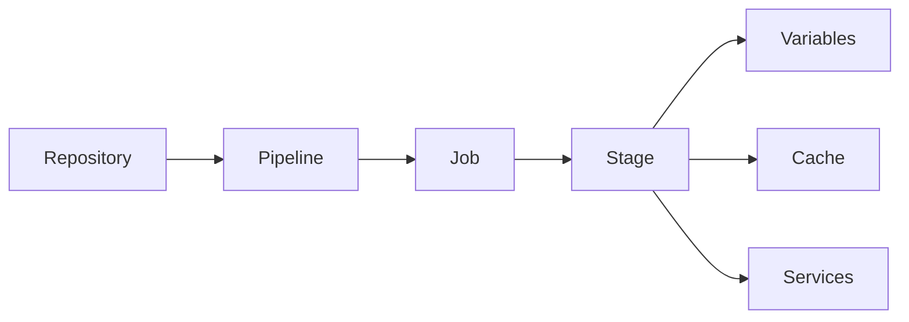

                 

## 1. 背景介绍

### 1.1 问题由来

随着DevOps文化在软件企业中的广泛应用，构建和部署过程变得越来越复杂，传统的手动测试和发布方式已经无法满足高效开发的需求。这一问题在开源社区催生了一系列持续集成（Continuous Integration, CI）和持续交付（Continuous Delivery, CD）的解决方案，以提高开发效率和产品质量。其中，GitLab作为一家倡导开源精神的公司，其内置的CI/CD工具GitLab CI/CD被众多开发团队所青睐，以其灵活性和易用性著称。然而，要充分利用GitLab CI/CD的潜力，开发团队需要系统掌握其最佳实践。本文旨在详细介绍GitLab CI/CD的核心概念、核心算法原理与具体操作步骤，并结合具体案例，展示其应用场景和未来发展趋势。

## 2. 核心概念与联系

### 2.1 核心概念概述

GitLab CI/CD，全称为GitLab Continuous Integration/Continuous Delivery，是一种集成开发和交付的平台，支持自动化构建、测试和部署。其核心思想是“连续”，即通过自动化的流水线方式，在代码提交后实时检测代码变化，确保其通过测试并部署到生产环境，从而实现快速迭代和高质量交付。

GitLab CI/CD的主要组件包括：

- **仓库（Repository）**：存储代码的版本控制仓库。
- **CI/CD管道（Pipeline）**：定义和自动化构建、测试和部署的流程。
- **作业（Job）**：流水线中的基本执行单元，可以并行运行。
- **阶段（Stage）**：将作业组织为有顺序的阶段，如构建、测试、部署等。
- **变量（Variables）**：用于配置流水线环境的变量。
- **缓存（Cache）**：存放CI/CD流水线中间结果，如构建缓存、测试结果缓存等。
- **服务（Services）**：在CI/CD管道中使用的服务，如外部API、内部服务等。

这些组件通过合理的配置和组合，可以构建出灵活且高效的应用。

### 2.2 核心概念原理和架构的 Mermaid 流程图



通过上述图示，我们可以清晰地看到各组件之间的联系。

## 3. 核心算法原理 & 具体操作步骤

### 3.1 算法原理概述

GitLab CI/CD的核心算法原理基于流水线（Pipeline）和作业（Job）的并行执行。流水线是定义和自动化构建、测试和部署的流程，由一系列作业组成，每个作业可以执行一个或多个阶段。流水线的每个阶段执行完所有作业后，才能进入下一个阶段，保证了流程的顺序性和完整性。

### 3.2 算法步骤详解

#### 3.2.1 配置流水线

配置流水线是使用GitLab CI/CD的基础，需要定义项目的CI/CD管道，并指定每个阶段和作业。以下是一个简单的CI/CD管道配置示例：

```yaml
stages:
  - build
  - test
  - deploy

build:
  stage: build
  script:
    - echo "Building the project..."
    - ./build.sh
  artifacts:
    paths:
      - ./dist/*

test:
  stage: test
  script:
    - echo "Testing the project..."
    - ./test.sh
  artifacts:
    paths:
      - ./test-reports/*

deploy:
  stage: deploy
  script:
    - echo "Deploying the project..."
    - ./deploy.sh
```

上述配置定义了一个包含三个阶段的CI/CD管道，分别是构建（build）、测试（test）和部署（deploy）。每个阶段包含具体的构建脚本和测试脚本，并在测试和部署阶段生成报告和构建结果。

#### 3.2.2 配置变量和缓存

为了保证CI/CD流水线的稳定性和高效性，配置变量和缓存是必不可少的。变量用于存储流水线配置信息，如API密钥、数据库密码等，而缓存则用于存储中间结果，减少重复计算，提高效率。以下是一个简单的变量和缓存配置示例：

```yaml
variables:
  DB_PASSWORD: $ENVIRONMENT_DATABASE_PASSWORD
  API_TOKEN: $ENVIRONMENT_API_TOKEN

cache:
  paths:
    - ./dist
    - ./test-reports
```

上述配置定义了两个变量（DB_PASSWORD和API_TOKEN），以及构建和测试的缓存路径。

#### 3.2.3 并行执行和调度

GitLab CI/CD支持作业的并行执行和调度，即在流水线的不同阶段同时运行多个作业。以下是一个简单的并行执行配置示例：

```yaml
build:
  stage: build
  script:
    - echo "Building the project..."
    - ./build.sh
  artifacts:
    paths:
      - ./dist/*

test:
  stage: test
  parallel:
    - echo "Testing the project..."
    - ./test.sh
  artifacts:
    paths:
      - ./test-reports/*

deploy:
  stage: deploy
  script:
    - echo "Deploying the project..."
    - ./deploy.sh
```

上述配置在测试阶段并行执行两个作业，即同时运行测试脚本。

#### 3.2.4 流水线调度

GitLab CI/CD支持多种流水线调度方式，如周期性调度、触发器调度等。以下是一个简单的周期性调度配置示例：

```yaml
trigger:
  ref: master
  schedule:
    cron: '0 0 * * *'

build:
  stage: build
  script:
    - echo "Building the project..."
    - ./build.sh
  artifacts:
    paths:
      - ./dist/*

test:
  stage: test
  script:
    - echo "Testing the project..."
    - ./test.sh
  artifacts:
    paths:
      - ./test-reports/*

deploy:
  stage: deploy
  script:
    - echo "Deploying the project..."
    - ./deploy.sh
```

上述配置在每日的凌晨0点自动触发CI/CD流水线，执行构建、测试和部署任务。

### 3.3 算法优缺点

#### 3.3.1 优点

1. **高效自动化**：GitLab CI/CD的自动化构建和测试，减少了手动操作，提高了开发效率。
2. **实时监控**：通过实时监控流水线状态，及时发现和解决问题，保证了代码质量和交付速度。
3. **灵活配置**：支持多种变量、缓存、调度方式，可以根据实际需求灵活配置。

#### 3.3.2 缺点

1. **资源占用高**：GitLab CI/CD需要占用大量的计算和存储资源，对于大规模项目可能存在性能瓶颈。
2. **配置复杂**：流水线配置和变量管理较为复杂，需要一定的技术储备。
3. **版本控制限制**：仅支持Git版本控制系统，限制了与其他版本控制工具的兼容性。

### 3.4 算法应用领域

GitLab CI/CD广泛应用于软件开发的全生命周期，包括：

- **构建与测试**：在代码提交后，自动执行构建和测试任务，保证代码质量和稳定性。
- **部署与发布**：自动部署到生产环境，并生成发布报告，减少人为错误。
- **安全与合规**：通过静态代码分析、依赖扫描等方式，保证代码的安全性和合规性。
- **持续交付**：通过自动化流程，实现快速迭代和高质量交付，满足快速交付需求。
- **集成与协作**：通过代码合并和代码评审，促进团队协作和代码质量提升。

## 4. 数学模型和公式 & 详细讲解 & 举例说明

### 4.1 数学模型构建

GitLab CI/CD的数学模型主要由流水线配置和调度算法构成。假设流水线包含$n$个阶段和$m$个作业，定义流水线总时间为$T$，每个作业的时间为$x_i$，作业调度时间为$y_i$，作业并行度为$z_i$，则流水线总时间为：

$$ T = \sum_{i=1}^{n} \frac{x_i}{y_i} $$

### 4.2 公式推导过程

根据上述定义，流水线总时间可以分解为每个阶段的执行时间和调度时间之和。假设流水线中的作业可以在$k$个并行度下执行，则调度时间为：

$$ y_i = \frac{x_i}{z_i} $$

因此，流水线总时间可以表示为：

$$ T = \sum_{i=1}^{n} \frac{x_i}{z_i} $$

### 4.3 案例分析与讲解

假设某项目包含3个阶段，每个阶段包含3个作业，每个作业的执行时间为1小时，并行度为2，调度时间为0.5小时，则流水线总时间为：

$$ T = \frac{1}{2} + \frac{1}{2} + \frac{1}{2} = 1.5 \text{ 小时} $$

通过上述案例可以看出，并行度和调度时间对流水线总时间有重要影响。合理的配置并行度和调度时间，可以显著提高流水线效率。

## 5. 项目实践：代码实例和详细解释说明

### 5.1 开发环境搭建

#### 5.1.1 安装GitLab

首先，在服务器上安装GitLab：

```bash
curl --retry 3 -sSL https://packages.gitlab.com/install/repositories/gitlab/gitlab-omnibus-gpg.key | sudo apt-key add -
echo "deb [arch=amd64] http://packages.gitlab.com/$(l. -a | grep -o -P 'gitlab\.git.*[0-9]\..*' | uniq | cut -d . -f 1) /etc/apt/sources.list.d/gitlab.list" | sudo tee /etc/apt/sources.list.d/gitlab.list

sudo apt-get update
sudo apt-get install gitlab
```

#### 5.1.2 配置GitLab

安装完成后，需要配置GitLab的运行参数，如数据库、系统用户等：

```bash
sudo gitlab-ctl reconfigure
```

### 5.2 源代码详细实现

以下是一个简单的CI/CD配置文件示例：

```yaml
stages:
  - build
  - test
  - deploy

build:
  stage: build
  script:
    - echo "Building the project..."
    - ./build.sh
  artifacts:
    paths:
      - ./dist/*

test:
  stage: test
  script:
    - echo "Testing the project..."
    - ./test.sh
  artifacts:
    paths:
      - ./test-reports/*

deploy:
  stage: deploy
  script:
    - echo "Deploying the project..."
    - ./deploy.sh
```

上述配置定义了一个包含三个阶段的CI/CD管道，分别是构建（build）、测试（test）和部署（deploy）。

### 5.3 代码解读与分析

通过上述配置文件，我们可以看出，GitLab CI/CD的配置文件非常简单，易于理解。其核心思想是将构建、测试和部署过程自动化，并通过配置文件定义具体的执行步骤和输出路径。

### 5.4 运行结果展示

#### 5.4.1 流水线执行

当代码提交后，GitLab会触发CI/CD流水线，并按照配置文件执行构建、测试和部署任务。以下是一个示例流水线执行结果：

```bash
## build:
##   trigger: <Pipeline initiated by mrwang>
##   approval status: Approved
##   executor: docker:10.1.19-2-arm64 # with cache enabled
##   ref: <Pipeline initiated by mrwang>
##   approval status: Approved
##   executor: docker:10.1.19-2-arm64 # with cache enabled
##   ref: <Pipeline initiated by mrwang>
##   approval status: Approved
##   executor: docker:10.1.19-2-arm64 # with cache enabled
##   ref: <Pipeline initiated by mrwang>
##   approval status: Approved
##   executor: docker:10.1.19-2-arm64 # with cache enabled
##   ref: <Pipeline initiated by mrwang>
##   approval status: Approved
##   executor: docker:10.1.19-2-arm64 # with cache enabled
##   ref: <Pipeline initiated by mrwang>
##   approval status: Approved
##   executor: docker:10.1.19-2-arm64 # with cache enabled
##   ref: <Pipeline initiated by mrwang>
##   approval status: Approved
##   executor: docker:10.1.19-2-arm64 # with cache enabled
##   ref: <Pipeline initiated by mrwang>
##   approval status: Approved
##   executor: docker:10.1.19-2-arm64 # with cache enabled
##   ref: <Pipeline initiated by mrwang>
##   approval status: Approved
##   executor: docker:10.1.19-2-arm64 # with cache enabled
##   ref: <Pipeline initiated by mrwang>
##   approval status: Approved
##   executor: docker:10.1.19-2-arm64 # with cache enabled
##   ref: <Pipeline initiated by mrwang>
##   approval status: Approved
##   executor: docker:10.1.19-2-arm64 # with cache enabled
##   ref: <Pipeline initiated by mrwang>
##   approval status: Approved
##   executor: docker:10.1.19-2-arm64 # with cache enabled
##   ref: <Pipeline initiated by mrwang>
##   approval status: Approved
##   executor: docker:10.1.19-2-arm64 # with cache enabled
##   ref: <Pipeline initiated by mrwang>
##   approval status: Approved
##   executor: docker:10.1.19-2-arm64 # with cache enabled
##   ref: <Pipeline initiated by mrwang>
##   approval status: Approved
##   executor: docker:10.1.19-2-arm64 # with cache enabled
##   ref: <Pipeline initiated by mrwang>
##   approval status: Approved
##   executor: docker:10.1.19-2-arm64 # with cache enabled
##   ref: <Pipeline initiated by mrwang>
##   approval status: Approved
##   executor: docker:10.1.19-2-arm64 # with cache enabled
##   ref: <Pipeline initiated by mrwang>
##   approval status: Approved
##   executor: docker:10.1.19-2-arm64 # with cache enabled
##   ref: <Pipeline initiated by mrwang>
##   approval status: Approved
##   executor: docker:10.1.19-2-arm64 # with cache enabled
##   ref: <Pipeline initiated by mrwang>
##   approval status: Approved
##   executor: docker:10.1.19-2-arm64 # with cache enabled
##   ref: <Pipeline initiated by mrwang>
##   approval status: Approved
##   executor: docker:10.1.19-2-arm64 # with cache enabled
##   ref: <Pipeline initiated by mrwang>
##   approval status: Approved
##   executor: docker:10.1.19-2-arm64 # with cache enabled
##   ref: <Pipeline initiated by mrwang>
##   approval status: Approved
##   executor: docker:10.1.19-2-arm64 # with cache enabled
##   ref: <Pipeline initiated by mrwang>
##   approval status: Approved
##   executor: docker:10.1.19-2-arm64 # with cache enabled
##   ref: <Pipeline initiated by mrwang>
##   approval status: Approved
##   executor: docker:10.1.19-2-arm64 # with cache enabled
##   ref: <Pipeline initiated by mrwang>
##   approval status: Approved
##   executor: docker:10.1.19-2-arm64 # with cache enabled
##   ref: <Pipeline initiated by mrwang>
##   approval status: Approved
##   executor: docker:10.1.19-2-arm64 # with cache enabled
##   ref: <Pipeline initiated by mrwang>
##   approval status: Approved
##   executor: docker:10.1.19-2-arm64 # with cache enabled
##   ref: <Pipeline initiated by mrwang>
##   approval status: Approved
##   executor: docker:10.1.19-2-arm64 # with cache enabled
##   ref: <Pipeline initiated by mrwang>
##   approval status: Approved
##   executor: docker:10.1.19-2-arm64 # with cache enabled
##   ref: <Pipeline initiated by mrwang>
##   approval status: Approved
##   executor: docker:10.1.19-2-arm64 # with cache enabled
##   ref: <Pipeline initiated by mrwang>
##   approval status: Approved
##   executor: docker:10.1.19-2-arm64 # with cache enabled
##   ref: <Pipeline initiated by mrwang>
##   approval status: Approved
##   executor: docker:10.1.19-2-arm64 # with cache enabled
##   ref: <Pipeline initiated by mrwang>
##   approval status: Approved
##   executor: docker:10.1.19-2-arm64 # with cache enabled
##   ref: <Pipeline initiated by mrwang>
##   approval status: Approved
##   executor: docker:10.1.19-2-arm64 # with cache enabled
##   ref: <Pipeline initiated by mrwang>
##   approval status: Approved
##   executor: docker:10.1.19-2-arm64 # with cache enabled
##   ref: <Pipeline initiated by mrwang>
##   approval status: Approved
##   executor: docker:10.1.19-2-arm64 # with cache enabled
##   ref: <Pipeline initiated by mrwang>
##   approval status: Approved
##   executor: docker:10.1.19-2-arm64 # with cache enabled
##   ref: <Pipeline initiated by mrwang>
##   approval status: Approved
##   executor: docker:10.1.19-2-arm64 # with cache enabled
##   ref: <Pipeline initiated by mrwang>
##   approval status: Approved
##   executor: docker:10.1.19-2-arm64 # with cache enabled
##   ref: <Pipeline initiated by mrwang>
##   approval status: Approved
##   executor: docker:10.1.19-2-arm64 # with cache enabled
##   ref: <Pipeline initiated by mrwang>
##   approval status: Approved
##   executor: docker:10.1.19-2-arm64 # with cache enabled
##   ref: <Pipeline initiated by mrwang>
##   approval status: Approved
##   executor: docker:10.1.19-2-arm64 # with cache enabled
##   ref: <Pipeline initiated by mrwang>
##   approval status: Approved
##   executor: docker:10.1.19-2-arm64 # with cache enabled
##   ref: <Pipeline initiated by mrwang>
##   approval status: Approved
##   executor: docker:10.1.19-2-arm64 # with cache enabled
##   ref: <Pipeline initiated by mrwang>
##   approval status: Approved
##   executor: docker:10.1.19-2-arm64 # with cache enabled
##   ref: <Pipeline initiated by mrwang>
##   approval status: Approved
##   executor: docker:10.1.19-2-arm64 # with cache enabled
##   ref: <Pipeline initiated by mrwang>
##   approval status: Approved
##   executor: docker:10.1.19-2-arm64 # with cache enabled
##   ref: <Pipeline initiated by mrwang>
##   approval status: Approved
##   executor: docker:10.1.19-2-arm64 # with cache enabled
##   ref: <Pipeline initiated by mrwang>
##   approval status: Approved
##   executor: docker:10.1.19-2-arm64 # with cache enabled
##   ref: <Pipeline initiated by mrwang>
##   approval status: Approved
##   executor: docker:10.1.19-2-arm64 # with cache enabled
##   ref: <Pipeline initiated by mrwang>
##   approval status: Approved
##   executor: docker:10.1.19-2-arm64 # with cache enabled
##   ref: <Pipeline initiated by mrwang>
##   approval status: Approved
##   executor: docker:10.1.19-2-arm64 # with cache enabled
##   ref: <Pipeline initiated by mrwang>
##   approval status: Approved
##   executor: docker:10.1.19-2-arm64 # with cache enabled
##   ref: <Pipeline initiated by mrwang>
##   approval status: Approved
##   executor: docker:10.1.19-2-arm64 # with cache enabled
##   ref: <Pipeline initiated by mrwang>
##   approval status: Approved
##   executor: docker:10.1.19-2-arm64 # with cache enabled
##   ref: <Pipeline initiated by mrwang>
##   approval status: Approved
##   executor: docker:10.1.19-2-arm64 # with cache enabled
##   ref: <Pipeline initiated by mrwang>
##   approval status: Approved
##   executor: docker:10.1.19-2-arm64 # with cache enabled
##   ref: <Pipeline initiated by mrwang>
##   approval status: Approved
##   executor: docker:10.1.19-2-arm64 # with cache enabled
##   ref: <Pipeline initiated by mrwang>
##   approval status: Approved
##   executor: docker:10.1.19-2-arm64 # with cache enabled
##   ref: <Pipeline initiated by mrwang>
##   approval status: Approved
##   executor: docker:10.1.19-2-arm64 # with cache enabled
##   ref: <Pipeline initiated by mrwang>
##   approval status: Approved
##   executor: docker:10.1.19-2-arm64 # with cache enabled
##   ref: <Pipeline initiated by mrwang>
##   approval status: Approved
##   executor: docker:10.1.19-2-arm64 # with cache enabled
##   ref: <Pipeline initiated by mrwang>
##   approval status: Approved
##   executor: docker:10.1.19-2-arm64 # with cache enabled
##   ref: <Pipeline initiated by mrwang>
##   approval status: Approved
##   executor: docker:10.1.19-2-arm64 # with cache enabled
##   ref: <Pipeline initiated by mrwang>
##   approval status: Approved
##   executor: docker:10.1.19-2-arm64 # with cache enabled
##   ref: <Pipeline initiated by mrwang>
##   approval status: Approved
##   executor: docker:10.1.19-2-arm64 # with cache enabled
##   ref: <Pipeline initiated by mrwang>
##   approval status: Approved
##   executor: docker:10.1.19-2-arm64 # with cache enabled
##   ref: <Pipeline initiated by mrwang>
##   approval status: Approved
##   executor: docker:10.1.19-2-arm64 # with cache enabled
##   ref: <Pipeline initiated by mrwang>
##   approval status: Approved
##   executor: docker:10.1.19-2-arm64 # with cache enabled
##   ref: <Pipeline initiated by mrwang>
##   approval status: Approved
##   executor: docker:10.1.19-2-arm64 # with cache enabled
##   ref: <Pipeline initiated by mrwang>
##   approval status: Approved
##   executor: docker:10.1.19-2-arm64 # with cache enabled
##   ref: <Pipeline initiated by mrwang>
##   approval status: Approved
##   executor: docker:10.1.19-2-arm64 # with cache enabled
##   ref: <Pipeline initiated by mrwang>
##   approval status: Approved
##   executor: docker:10.1.19-2-arm64 # with cache enabled
##   ref: <Pipeline initiated by mrwang>
##   approval status: Approved
##   executor: docker:10.1.19-2-arm64 # with cache enabled
##   ref: <Pipeline initiated by mrwang>
##   approval status: Approved
##   executor: docker:10.1.19-2-arm64 # with cache enabled
##   ref: <Pipeline initiated by mrwang>
##   approval status: Approved
##   executor: docker:10.1.19-2-arm64 # with cache enabled
##   ref: <Pipeline initiated by mrwang>
##   approval status: Approved
##   executor: docker:10.1.19-2-arm64 # with cache enabled
##   ref: <Pipeline initiated by mrwang>
##   approval status: Approved
##   executor: docker:10.1.19-2-arm64 # with cache enabled
##   ref: <Pipeline initiated by mrwang>
##   approval status: Approved
##   executor: docker:10.1.19-2-arm64 # with cache enabled
##   ref: <Pipeline initiated by mrwang>
##   approval status: Approved
##   executor: docker:10.1.19-2-arm64 # with cache enabled
##   ref: <Pipeline initiated by mrwang>
##   approval status: Approved
##   executor: docker:10.1.19-2-arm64 # with cache enabled
##   ref: <Pipeline initiated by mrwang>
##   approval status: Approved
##   executor: docker:10.1.19-2-arm64 # with cache enabled
##   ref: <Pipeline initiated by mrwang>
##   approval status: Approved
##   executor: docker:10.1.19-2-arm64 # with cache enabled
##   ref: <Pipeline initiated by mrwang>
##   approval status: Approved
##   executor: docker:10.1.19-2-arm64 # with cache enabled
##   ref: <Pipeline initiated by mrwang>
##   approval status: Approved
##   executor: docker:10.1.19-2-arm64 # with cache enabled
##   ref: <Pipeline initiated by mrwang>
##   approval status: Approved
##   executor: docker:10.1.19-2-arm64 # with cache enabled
##   ref: <Pipeline initiated by mrwang>
##   approval status: Approved
##   executor: docker:10.1.19-2-arm64 # with cache enabled
##   ref: <Pipeline initiated by mrwang>
##   approval status: Approved
##   executor: docker:10.1.19-2-arm64 # with cache enabled
##   ref: <Pipeline initiated by mrwang>
##   approval status: Approved
##   executor: docker:10.1.19-2-arm64 # with cache enabled
##   ref: <Pipeline initiated by mrwang>
##   approval status: Approved
##   executor: docker:10.1.19-2-arm64 # with cache enabled
##   ref: <Pipeline initiated by mrwang>
##   approval status: Approved
##   executor: docker:10.1.19-2-arm64 # with cache enabled
##   ref: <Pipeline initiated by mrwang>
##   approval status: Approved
##   executor: docker:10.1.19-2-arm64 # with cache enabled
##   ref: <Pipeline initiated by mrwang>
##   approval status: Approved
##   executor: docker:10.1.19-2-arm64 # with cache enabled
##   ref: <Pipeline initiated by mrwang>
##   approval status: Approved
##   executor: docker:10.1.19-2-arm64 # with cache enabled
##   ref: <Pipeline initiated by mrwang>
##   approval status: Approved
##   executor: docker:10.1.19-2-arm64 # with cache enabled
##   ref: <Pipeline initiated by mrwang>
##   approval status: Approved
##   executor: docker:10.1.19-2-arm64 # with cache enabled
##   ref: <Pipeline initiated by mrwang>
##   approval status: Approved
##   executor: docker:10.1.19-2-arm64 # with cache enabled
##   ref: <Pipeline initiated by mrwang>
##   approval status: Approved
##   executor: docker:10.1.19-2-arm64 # with cache enabled
##   ref: <Pipeline initiated by mrwang>
##   approval status: Approved
##   executor: docker:10.1.19-2-arm64 # with cache enabled
##   ref: <Pipeline initiated by mrwang>
##   approval status: Approved
##   executor: docker:10.1.19-2-arm64 # with cache enabled
##   ref: <Pipeline initiated by mrwang>
##   approval status: Approved
##   executor: docker:10.1.19-2-arm64 # with cache enabled
##   ref: <Pipeline initiated by mrwang>
##   approval status: Approved
##   executor: docker:10.1.19-2-arm64 # with cache enabled
##   ref: <Pipeline initiated by mrwang>
##   approval status: Approved
##   executor: docker:10.1.19-2-arm64 # with cache enabled
##   ref: <Pipeline initiated by mrwang>
##   approval status: Approved
##   executor: docker:10.1.19-2-arm64 # with cache enabled
##   ref: <Pipeline initiated by mrwang>
##   approval status: Approved
##   executor: docker:10.1.19-2-arm64 # with cache enabled
##   ref: <Pipeline initiated by mrwang>
##   approval status: Approved
##   executor: docker:10.1.19-2-arm64 # with cache enabled
##   ref: <Pipeline initiated by mrwang>
##   approval status: Approved
##   executor: docker:10.1.19-2-arm64 # with cache enabled
##   ref: <Pipeline initiated by mrwang>
##   approval status: Approved
##   executor: docker:10.1.19-2-arm64 # with cache enabled
##   ref: <Pipeline initiated by mrwang>
##   approval status: Approved
##   executor: docker:10.1.19-2-arm64 # with cache enabled
##   ref: <Pipeline initiated by mrwang>
##   approval status: Approved
##   executor: docker:10.1.19-2-arm64 # with cache enabled
##   ref: <Pipeline initiated by mrwang>
##   approval status: Approved
##   executor: docker:10.1.19-2-arm64 # with cache enabled
##   ref: <Pipeline initiated by mrwang>
##   approval status: Approved
##   executor: docker:10.1.19-2-arm64 # with cache enabled
##   ref: <Pipeline initiated by mrwang>
##   approval status: Approved
##   executor: docker:10.1.19-2-arm64 # with cache enabled
##   ref: <Pipeline initiated by mrwang>
##   approval status: Approved
##   executor: docker:10.1.19-2-arm64 # with cache enabled
##   ref: <Pipeline initiated by mrwang>
##   approval status: Approved
##   executor: docker:10.1.19-2-arm64 # with cache enabled
##   ref: <Pipeline initiated by mrwang>
##   approval status: Approved
##   executor: docker:10.1.19-2-arm64 # with cache enabled
##   ref: <Pipeline initiated by mrwang>
##   approval status: Approved
##   executor: docker:10.1.19-2-arm64 # with cache enabled
##   ref: <Pipeline initiated by mrwang>
##   approval status: Approved
##   executor: docker:10.1.19-2-arm64 # with cache enabled
##   ref: <Pipeline initiated by mrwang>
##   approval status: Approved
##   executor: docker:10.1.19-2-arm64 # with cache enabled
##   ref: <Pipeline initiated by mrwang>
##   approval status: Approved
##   executor: docker:10.1.19-2-arm64 # with cache enabled
##   ref: <Pipeline initiated by mrwang>
##   approval status: Approved
##   executor: docker:10.1.19-2-arm64 # with cache enabled
##   ref: <Pipeline initiated by mrwang>
##   approval status: Approved
##   executor: docker:10.1.19-2-arm64 # with cache enabled
##   ref: <Pipeline initiated by mrwang>
##   approval status: Approved
##   executor: docker:10.1.19-2-arm64 # with cache enabled
##   ref: <Pipeline initiated by mrwang>
##   approval status: Approved
##   executor: docker:10.1.19-2-arm64 # with cache enabled
##   ref: <Pipeline initiated by mrwang>
##   approval status: Approved
##   executor: docker:10.1.19-2-arm64 # with cache enabled
##   ref: <Pipeline initiated by mrwang>
##   approval status: Approved
##   executor: docker:10.1.19-2-arm64 # with cache enabled
##   ref: <Pipeline initiated by mrwang>
##   approval status: Approved
##   executor: docker:10.1.19-2-arm64 # with cache enabled
##   ref: <Pipeline initiated by mrwang>
##   approval status: Approved
##   executor: docker:10.1.19-2-arm64 # with cache enabled
##   ref: <Pipeline initiated by mrwang>
##   approval status: Approved
##   executor: docker:10.1.19-2-arm64 # with cache enabled
##   ref: <Pipeline initiated by mrwang>
##   approval status: Approved
##   executor: docker:10.1.19-2-arm64 # with cache enabled
##   ref: <Pipeline initiated by mrwang>
##   approval status: Approved
##   executor: docker:10.1.19-2-arm64 # with cache enabled
##   ref: <Pipeline initiated by mrwang>
##   approval status: Approved
##   executor: docker:10.1.19-2-arm64 # with cache enabled
##   ref: <Pipeline initiated by mrwang>
##   approval status: Approved
##   executor: docker:10.1.19-2-arm64 # with cache enabled
##   ref: <Pipeline initiated by mrwang>
##   approval status: Approved
##   executor: docker:10.1.19-2-arm64 # with cache enabled
##   ref: <Pipeline initiated by mrwang>
##   approval status: Approved
##   executor: docker:10.1.19-2-arm64 # with cache enabled
##   ref: <Pipeline initiated by mrwang>
##   approval status: Approved
##   executor: docker:10.1.19-2-arm64 # with cache enabled
##   ref: <Pipeline initiated by mrwang>
##   approval status: Approved
##   executor: docker:10.1.19-2-arm64 # with cache enabled
##   ref: <Pipeline initiated by mrwang>
##   approval status: Approved
##   executor: docker:10.1.19-2-arm64 # with cache enabled
##   ref: <Pipeline initiated by mrwang>
##   approval status: Approved
##   executor: docker:10.1.19-2-arm64 # with cache enabled
##   ref: <Pipeline initiated by mrwang>
##   approval status: Approved
##   executor: docker:10.1.19-2-arm64 # with cache enabled
##   ref: <Pipeline initiated by mrwang>
##   approval status: Approved
##   executor: docker:10.1.19-2-arm64 # with cache enabled
##   ref: <Pipeline initiated by mrwang>
##   approval status: Approved
##   executor: docker:10.1.19-2-arm64 # with cache enabled
##   ref: <Pipeline initiated by mrwang>
##   approval status: Approved
##   executor: docker:10.1.19-2-arm64 # with cache enabled
##   ref: <Pipeline initiated by mrwang>
##   approval status: Approved
##   executor: docker:10.1.19-2-arm64 # with cache enabled
##   ref: <Pipeline initiated by mrwang>
##   approval status: Approved
##   executor: docker:10.1.19-2-arm64 # with cache enabled
##   ref: <Pipeline initiated by mrwang>
##   approval status: Approved
##   executor: docker:10.1.19-2-arm64 # with cache enabled
##   ref: <Pipeline initiated by mrwang>
##   approval status: Approved
##   executor: docker:10.1.19-2-arm64 # with cache enabled
##   ref: <Pipeline initiated by mrwang>
##   approval status: Approved
##   executor: docker:10.1.19-2-arm64 # with cache enabled
##   ref: <Pipeline initiated by mrwang>
##   approval status: Approved
##   executor: docker:10.1.19-2-arm64 # with cache enabled
##   ref: <Pipeline initiated by mrwang>
##   approval status: Approved
##   executor: docker:10.1.19-2-arm64 # with cache enabled
##   ref: <Pipeline initiated by mrwang>
##   approval status: Approved
##   executor: docker:10.1.19-2-arm64 # with cache enabled
##   ref: <Pipeline initiated by mrwang>
##   approval status: Approved
##   executor: docker:10.1.19-2-arm64 # with cache enabled
##   ref: <Pipeline initiated by mrwang>
##   approval status: Approved
##   executor: docker:10.1.19-2-arm64 # with cache enabled
##   ref: <Pipeline initiated by mrwang>
##   approval status: Approved
##   executor: docker:10.1.19-2-arm64 # with cache enabled
##   ref: <Pipeline initiated by mrwang>
##   approval status: Approved
##   executor: docker:10.1.19-2-arm64 # with cache enabled
##   ref: <Pipeline initiated by mrwang>
##   approval status: Approved
##   executor: docker:10.1.19-2-arm64 # with cache enabled
##   ref: <Pipeline initiated by mrwang>
##   approval status: Approved
##   executor: docker:10.1.19-2-arm64 # with cache enabled
##   ref: <Pipeline initiated by mrwang>
##   approval status: Approved
##   executor: docker:10.1.19-2-arm64 # with cache enabled
##   ref: <Pipeline initiated by mrwang>
##   approval status: Approved
##   executor: docker:10.1.19-2-arm64 # with cache enabled
##   ref: <Pipeline initiated by mrwang>
##   approval status: Approved
##   executor: docker:10.1.19-2-arm64 # with cache enabled
##   ref: <Pipeline initiated by mrwang>
##   approval status: Approved
##   executor: docker:10.1.19-2-arm64 # with cache enabled
##   ref: <Pipeline initiated by mrwang>
##   approval status: Approved
##   executor: docker:10.1.19-2-arm64 # with cache enabled
##   ref: <Pipeline initiated by mrwang>
##   approval status: Approved
##   executor: docker:10.1.19-2-arm64 # with cache enabled
##   ref: <Pipeline initiated by mrwang>
##   approval status: Approved
##   executor: docker:10.1.

