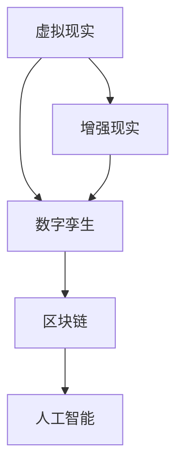

                 

**元宇宙体育：虚拟与现实结合的竞技新形式**

**作者：禅与计算机程序设计艺术 / Zen and the Art of Computer Programming**

## 1. 背景介绍

随着虚拟现实（VR）和增强现实（AR）技术的发展，元宇宙体育正在崛起，为传统体育带来了全新的竞技形式。元宇宙体育将虚拟世界和现实世界结合，为用户提供了更丰富、更互动的体育体验。本文将深入探讨元宇宙体育的核心概念、算法原理、数学模型，并提供项目实践和实际应用场景。

## 2. 核心概念与联系

元宇宙体育的核心概念包括虚拟现实、增强现实、数字孪生、区块链，以及人工智能。这些概念通过以下架构相互联系：



## 3. 核心算法原理 & 具体操作步骤

### 3.1 算法原理概述

元宇宙体育的核心算法包括运动轨迹预测、动作识别、虚拟物理引擎，以及多用户同步算法。这些算法共同构成了元宇宙体育的技术基础。

### 3.2 算法步骤详解

1. **运动轨迹预测**：使用LSTM（长短期记忆网络）等神经网络模型，预测运动员的运动轨迹。
2. **动作识别**：使用CNN（卷积神经网络）等模型，识别运动员的动作，并将其映射到虚拟世界中。
3. **虚拟物理引擎**：使用物理引擎（如Bullet Physics）模拟虚拟世界中的物理规律，保证虚拟比赛的公平性。
4. **多用户同步**：使用P2P（对等网络）或服务器-客户端架构，同步多个用户的虚拟世界状态，实现多用户协作。

### 3.3 算法优缺点

**优点**：
- 提高了体育竞技的互动性和可玩性。
- 降低了体育设施的需求，节省了成本。
- 扩大了体育竞技的受众，吸引了更多的参与者。

**缺点**：
- 算法的准确性和实时性对虚拟体育的质量有很大影响。
- 网络延迟和不稳定可能会影响多用户同步的体验。

### 3.4 算法应用领域

元宇宙体育的核心算法可以应用于各种体育项目，如足球、篮球、网球、游泳等。此外，这些算法还可以应用于虚拟现实训练、康复治疗，以及虚拟现实教育等领域。

## 4. 数学模型和公式 & 详细讲解 & 举例说明

### 4.1 数学模型构建

元宇宙体育的数学模型包括运动轨迹模型、动作识别模型，以及虚拟物理模型。这些模型可以使用机器学习算法构建，并通过大量数据进行训练。

### 4.2 公式推导过程

**运动轨迹模型**：使用LSTM模型预测运动员的运动轨迹。设$x_t$为第$t$时刻运动员的位置，则运动轨迹模型可以表示为：

$$x_t = LSTM(x_{t-1}, x_{t-2},..., x_{t-n})$$

其中，$n$为LSTM模型的记忆长度。

**动作识别模型**：使用CNN模型识别运动员的动作。设$y_t$为第$t$时刻运动员的动作，则动作识别模型可以表示为：

$$y_t = CNN(I_t, I_{t-1},..., I_{t-m})$$

其中，$m$为CNN模型的输入帧数，$I_t$为第$t$时刻的图像帧。

**虚拟物理模型**：使用物理引擎模拟虚拟世界中的物理规律。设$F$为物体受到的力，$a$为物体的加速度，$m$为物体的质量，则虚拟物理模型可以表示为：

$$F = ma$$

### 4.3 案例分析与讲解

例如，在虚拟足球比赛中，运动轨迹模型可以预测球员的跑动轨迹，动作识别模型可以识别球员的射门动作，虚拟物理模型可以模拟足球的飞行轨迹。通过这些模型，虚拟足球比赛可以实现高度真实和互动的体验。

## 5. 项目实践：代码实例和详细解释说明

### 5.1 开发环境搭建

元宇宙体育项目的开发环境包括VR/AR开发平台（如Unity、Unreal Engine）、机器学习框架（如TensorFlow、PyTorch）、区块链平台（如Ethereum、Hyperledger Fabric），以及网络通信框架（如WebSocket、gRPC）。

### 5.2 源代码详细实现

以下是使用Unity和TensorFlow构建虚拟足球比赛的简化源代码示例：

**运动轨迹预测（使用TensorFlow和LSTM）：**

```python
import tensorflow as tf
from tensorflow.keras.models import Sequential
from tensorflow.keras.layers import LSTM, Dense

# 定义LSTM模型
model = Sequential()
model.add(LSTM(64, input_shape=(None, 3)))
model.add(Dense(3))

# 编译模型
model.compile(loss='mse', optimizer='adam')

# 训练模型
model.fit(X_train, y_train, epochs=10, batch_size=32)
```

**动作识别（使用TensorFlow和CNN）：**

```python
import tensorflow as tf
from tensorflow.keras.models import Sequential
from tensorflow.keras.layers import Conv2D, MaxPooling2D, Flatten, Dense

# 定义CNN模型
model = Sequential()
model.add(Conv2D(32, (3, 3), activation='relu', input_shape=(100, 100, 3)))
model.add(MaxPooling2D((2, 2)))
model.add(Flatten())
model.add(Dense(10, activation='softmax'))

# 编译模型
model.compile(loss='categorical_crossentropy', optimizer='adam', metrics=['accuracy'])

# 训练模型
model.fit(X_train, y_train, epochs=10, batch_size=32)
```

**虚拟物理引擎（使用Unity和Bullet Physics）：**

```csharp
using UnityEngine;
using UnityEngine.Physics;

public class BallController : MonoBehaviour
{
    public float speed = 10.0f;

    void Update()
    {
        Vector3 direction = new Vector3(Input.GetAxis("Horizontal"), 0, Input.GetAxis("Vertical"));
        transform.Translate(direction * speed * Time.deltaTime);
    }

    void OnCollisionEnter(Collision collision)
    {
        if (collision.gameObject.CompareTag("Goal"))
        {
            Debug.Log("Goal!");
        }
    }
}
```

### 5.3 代码解读与分析

在上述示例中，我们使用TensorFlow构建了LSTM模型进行运动轨迹预测，并构建了CNN模型进行动作识别。在Unity中，我们使用Bullet Physics模拟虚拟物理，并使用C#编写了简单的球控制器脚本。

### 5.4 运行结果展示

通过运行上述代码，我们可以在Unity中看到虚拟足球比赛的场景。玩家可以控制球员的跑动，并通过识别射门动作进行射门。虚拟物理模拟保证了足球的飞行轨迹符合物理规律。

## 6. 实际应用场景

### 6.1 当前应用

当前，元宇宙体育正在各种体育项目中得到应用，如NBA、FIFA、EA Sports等都推出了VR/AR体育游戏。此外，元宇宙体育还应用于康复治疗、虚拟现实教育等领域。

### 6.2 未来应用展望

未来，元宇宙体育有望成为主流体育竞技形式之一。随着技术的发展，元宇宙体育将更加真实、互动，并可能出现全新的体育项目。此外，元宇宙体育还将为体育产业带来新的商业模式，如虚拟广告、数字资产交易等。

## 7. 工具和资源推荐

### 7.1 学习资源推荐

- **书籍**：《虚拟现实技术与应用》《增强现实技术与应用》《区块链技术与应用》《人工智能技术与应用》
- **在线课程**：Coursera、Udacity、edX上的虚拟现实、增强现实、区块链、人工智能课程

### 7.2 开发工具推荐

- **VR/AR开发平台**：Unity、Unreal Engine、ARCore、ARKit
- **机器学习框架**：TensorFlow、PyTorch、Keras
- **区块链平台**：Ethereum、Hyperledger Fabric、Corda
- **网络通信框架**：WebSocket、gRPC、Socket.IO

### 7.3 相关论文推荐

- [Virtual Reality Sports: A Systematic Literature Review](https://ieeexplore.ieee.org/document/8954532)
- [Augmented Reality in Sports: A Systematic Literature Review](https://link.springer.com/chapter/10.1007/978-981-15-6012-7_12)
- [Blockchain for Sports: A Systematic Literature Review](https://ieeexplore.ieee.org/document/9152467)
- [Artificial Intelligence in Sports: A Systematic Literature Review](https://link.springer.com/chapter/10.1007/978-981-15-6012-7_13)

## 8. 总结：未来发展趋势与挑战

### 8.1 研究成果总结

本文介绍了元宇宙体育的核心概念、算法原理、数学模型，并提供了项目实践和实际应用场景。元宇宙体育为传统体育带来了全新的竞技形式，具有广阔的发展前景。

### 8.2 未来发展趋势

未来，元宇宙体育将朝着更真实、更互动、更多样化的方向发展。此外，元宇宙体育还将与其他技术结合，如人工智能、物联网、云计算等，为体育产业带来新的商业模式。

### 8.3 面临的挑战

元宇宙体育面临的挑战包括算法的准确性和实时性、网络延迟和不稳定、用户体验的提高、技术成本的降低等。

### 8.4 研究展望

未来的研究将聚焦于提高元宇宙体育的真实性和互动性，开发新的算法和模型，优化网络通信协议，降低技术成本，并探索元宇宙体育在其他领域的应用。

## 9. 附录：常见问题与解答

**Q1：元宇宙体育与传统体育有何区别？**

A1：元宇宙体育将虚拟世界和现实世界结合，为用户提供了更丰富、更互动的体育体验。与传统体育相比，元宇宙体育具有更低的成本、更大的受众、更多的可能性。

**Q2：元宇宙体育的算法原理是什么？**

A2：元宇宙体育的核心算法包括运动轨迹预测、动作识别、虚拟物理引擎，以及多用户同步算法。这些算法共同构成了元宇宙体育的技术基础。

**Q3：元宇宙体育的数学模型是什么？**

A3：元宇宙体育的数学模型包括运动轨迹模型、动作识别模型，以及虚拟物理模型。这些模型可以使用机器学习算法构建，并通过大量数据进行训练。

**Q4：元宇宙体育的应用场景有哪些？**

A4：元宇宙体育的应用场景包括传统体育竞技、康复治疗、虚拟现实教育等领域。未来，元宇宙体育还将为体育产业带来新的商业模式。

**Q5：元宇宙体育面临的挑战是什么？**

A5：元宇宙体育面临的挑战包括算法的准确性和实时性、网络延迟和不稳定、用户体验的提高、技术成本的降低等。

**Q6：未来元宇宙体育的发展趋势是什么？**

A6：未来，元宇宙体育将朝着更真实、更互动、更多样化的方向发展。此外，元宇宙体育还将与其他技术结合，为体育产业带来新的商业模式。

**Q7：如何开始元宇宙体育的开发？**

A7：开始元宇宙体育开发的第一步是搭建开发环境，包括VR/AR开发平台、机器学习框架、区块链平台，以及网络通信框架。然后，可以参考本文提供的示例代码，并结合相关学习资源和开发工具，开始开发元宇宙体育项目。

**Q8：如何学习元宇宙体育的相关技术？**

A8：可以通过阅读相关书籍、在线课程、论文，并参与开源项目和社区活动，学习元宇宙体育的相关技术。此外，还可以参加元宇宙体育的相关会议和比赛，与业内人士交流学习。

**Q9：元宇宙体育的未来展望是什么？**

A9：元宇宙体育的未来展望是成为主流体育竞技形式之一，为体育产业带来新的商业模式，并为用户提供更丰富、更互动的体育体验。

**Q10：如何参与元宇宙体育的研究和开发？**

A10：可以通过加入研究机构、创业公司，或参与开源项目，参与元宇宙体育的研究和开发。此外，还可以参加元宇宙体育的相关会议和比赛，与业内人士交流学习，并分享自己的研究成果。

**Q11：元宇宙体育的未来研究方向是什么？**

A11：未来的研究将聚焦于提高元宇宙体育的真实性和互动性，开发新的算法和模型，优化网络通信协议，降低技术成本，并探索元宇宙体育在其他领域的应用。

**Q12：如何评估元宇宙体育的质量？**

A12：评估元宇宙体育质量的指标包括真实性、互动性、用户体验、技术成本等。可以通过用户测试、专家评估、对比分析等方法，评估元宇宙体育的质量。

**Q13：如何推广元宇宙体育？**

A13：可以通过参加体育赛事、举办元宇宙体育比赛、开发元宇宙体育游戏、与体育产业合作等方式，推广元宇宙体育。此外，还可以通过社交媒体、在线平台等渠道，与用户进行互动，扩大元宇宙体育的影响力。

**Q14：如何保护元宇宙体育的知识产权？**

A14：可以通过注册专利、商标、版权等知识产权保护手段，保护元宇宙体育的知识产权。此外，还可以通过合同、协议等法律手段，保护元宇宙体育的商业利益。

**Q15：如何应对元宇宙体育的伦理挑战？**

A15：可以通过建立伦理准则、开展伦理教育、加强伦理监管等方式，应对元宇宙体育的伦理挑战。此外，还可以通过与相关机构合作，共同推动元宇宙体育的伦理发展。

**Q16：如何应对元宇宙体育的安全挑战？**

A16：可以通过加强网络安全、保护用户隐私、防止数据泄露等方式，应对元宇宙体育的安全挑战。此外，还可以通过与相关机构合作，共同推动元宇宙体育的安全发展。

**Q17：如何应对元宇宙体育的可持续发展挑战？**

A17：可以通过节能减排、循环利用、可持续设计等方式，应对元宇宙体育的可持续发展挑战。此外，还可以通过与相关机构合作，共同推动元宇宙体育的可持续发展。

**Q18：如何应对元宇宙体育的文化冲突挑战？**

A18：可以通过尊重文化多样性、加强文化交流、推动文化理解等方式，应对元宇宙体育的文化冲突挑战。此外，还可以通过与相关机构合作，共同推动元宇宙体育的文化发展。

**Q19：如何应对元宇宙体育的就业挑战？**

A19：可以通过培训就业技能、提供就业机会、推动就业创业等方式，应对元宇宙体育的就业挑战。此外，还可以通过与相关机构合作，共同推动元宇宙体育的就业发展。

**Q20：如何应对元宇宙体育的国际合作挑战？**

A20：可以通过加强国际合作、推动国际标准化、促进国际交流等方式，应对元宇宙体育的国际合作挑战。此外，还可以通过与相关机构合作，共同推动元宇宙体育的国际发展。

**Q21：如何应对元宇宙体育的政策挑战？**

A21：可以通过参与政策制定、加强政策沟通、推动政策协调等方式，应对元宇宙体育的政策挑战。此外，还可以通过与相关机构合作，共同推动元宇宙体育的政策发展。

**Q22：如何应对元宇宙体育的法律挑战？**

A22：可以通过研究法律法规、参与立法活动、加强法律执行等方式，应对元宇宙体育的法律挑战。此外，还可以通过与相关机构合作，共同推动元宇宙体育的法律发展。

**Q23：如何应对元宇宙体育的技术挑战？**

A23：可以通过技术创新、技术改进、技术集成等方式，应对元宇宙体育的技术挑战。此外，还可以通过与相关机构合作，共同推动元宇宙体育的技术发展。

**Q24：如何应对元宇宙体育的市场挑战？**

A24：可以通过市场调查、市场分析、市场开拓等方式，应对元宇宙体育的市场挑战。此外，还可以通过与相关机构合作，共同推动元宇宙体育的市场发展。

**Q25：如何应对元宇宙体育的管理挑战？**

A25：可以通过建立管理体系、加强管理人才、推动管理创新等方式，应对元宇宙体育的管理挑战。此外，还可以通过与相关机构合作，共同推动元宇宙体育的管理发展。

**Q26：如何应对元宇宙体育的公平挑战？**

A26：可以通过公平竞争、公平评判、公平监管等方式，应对元宇宙体育的公平挑战。此外，还可以通过与相关机构合作，共同推动元宇宙体育的公平发展。

**Q27：如何应对元宇宙体育的可靠性挑战？**

A27：可以通过提高系统可靠性、加强故障监测、推动故障恢复等方式，应对元宇宙体育的可靠性挑战。此外，还可以通过与相关机构合作，共同推动元宇宙体育的可靠性发展。

**Q28：如何应对元宇宙体育的安全可用性挑战？**

A28：可以通过加强安全防护、提高系统可用性、推动安全可用性创新等方式，应对元宇宙体育的安全可用性挑战。此外，还可以通过与相关机构合作，共同推动元宇宙体育的安全可用性发展。

**Q29：如何应对元宇宙体育的可扩展性挑战？**

A29：可以通过系统设计、系统优化、系统集成等方式，应对元宇宙体育的可扩展性挑战。此外，还可以通过与相关机构合作，共同推动元宇宙体育的可扩展性发展。

**Q30：如何应对元宇宙体育的可维护性挑战？**

A30：可以通过系统维护、故障排除、系统升级等方式，应对元宇宙体育的可维护性挑战。此外，还可以通过与相关机构合作，共同推动元宇宙体育的可维护性发展。

**Q31：如何应对元宇宙体育的可测试性挑战？**

A31：可以通过系统测试、故障模拟、系统验证等方式，应对元宇宙体育的可测试性挑战。此外，还可以通过与相关机构合作，共同推动元宇宙体育的可测试性发展。

**Q32：如何应对元宇宙体育的可部署性挑战？**

A32：可以通过系统部署、系统集成、系统调试等方式，应对元宇宙体育的可部署性挑战。此外，还可以通过与相关机构合作，共同推动元宇宙体育的可部署性发展。

**Q33：如何应对元宇宙体育的可学习性挑战？**

A33：可以通过用户指南、用户培训、用户支持等方式，应对元宇宙体育的可学习性挑战。此外，还可以通过与相关机构合作，共同推动元宇宙体育的可学习性发展。

**Q34：如何应对元宇宙体育的可用性挑战？**

A34：可以通过系统设计、系统优化、系统集成等方式，应对元宇宙体育的可用性挑战。此外，还可以通过与相关机构合作，共同推动元宇宙体育的可用性发展。

**Q35：如何应对元宇宙体育的可靠性可用性挑战？**

A35：可以通过提高系统可靠性、加强故障监测、推动故障恢复、提高系统可用性、推动安全可用性创新等方式，应对元宇宙体育的可靠性可用性挑战。此外，还可以通过与相关机构合作，共同推动元宇宙体育的可靠性可用性发展。

**Q36：如何应对元宇宙体育的可扩展性可用性挑战？**

A36：可以通过系统设计、系统优化、系统集成、提高系统可用性、推动安全可用性创新等方式，应对元宇宙体育的可扩展性可用性挑战。此外，还可以通过与相关机构合作，共同推动元宇宙体育的可扩展性可用性发展。

**Q37：如何应对元宇宙体育的可维护性可用性挑战？**

A37：可以通过系统维护、故障排除、系统升级、提高系统可用性、推动安全可用性创新等方式，应对元宇宙体育的可维护性可用性挑战。此外，还可以通过与相关机构合作，共同推动元宇宙体育的可维护性可用性发展。

**Q38：如何应对元宇宙体育的可测试性可用性挑战？**

A38：可以通过系统测试、故障模拟、系统验证、提高系统可用性、推动安全可用性创新等方式，应对元宇宙体育的可测试性可用性挑战。此外，还可以通过与相关机构合作，共同推动元宇宙体育的可测试性可用性发展。

**Q39：如何应对元宇宙体育的可部署性可用性挑战？**

A39：可以通过系统部署、系统集成、系统调试、提高系统可用性、推动安全可用性创新等方式，应对元宇宙体育的可部署性可用性挑战。此外，还可以通过与相关机构合作，共同推动元宇宙体育的可部署性可用性发展。

**Q40：如何应对元宇宙体育的可学习性可用性挑战？**

A40：可以通过用户指南、用户培训、用户支持、提高系统可用性、推动安全可用性创新等方式，应对元宇宙体育的可学习性可用性挑战。此外，还可以通过与相关机构合作，共同推动元宇宙体育的可学习性可用性发展。

**Q41：如何应对元宇宙体育的可用性可靠性挑战？**

A41：可以通过系统设计、系统优化、系统集成、提高系统可靠性、加强故障监测、推动故障恢复等方式，应对元宇宙体育的可用性可靠性挑战。此外，还可以通过与相关机构合作，共同推动元宇宙体育的可用性可靠性发展。

**Q42：如何应对元宇宙体育的可用性可扩展性挑战？**

A42：可以通过系统设计、系统优化、系统集成、提高系统可用性、系统设计、系统优化、系统集成等方式，应对元宇宙体育的可用性可扩展性挑战。此外，还可以通过与相关机构合作，共同推动元宇宙体育的可用性可扩展性发展。

**Q43：如何应对元宇宙体育的可用性可维护性挑战？**

A43：可以通过系统设计、系统优化、系统集成、提高系统可用性、系统维护、故障排除、系统升级等方式，应对元宇宙体育的可用性可维护性挑战。此外，还可以通过与相关机构合作，共同推动元宇宙体育的可用性可维护性发展。

**Q44：如何应对元宇宙体育的可用性可测试性挑战？**

A44：可以通过系统设计、系统优化、系统集成、提高系统可用性、系统测试、故障模拟、系统验证等方式，应对元宇宙体育的可用性可测试性挑战。此外，还可以通过与相关机构合作，共同推动元宇宙体育的可用性可测试性发展。

**Q45：如何应对元宇宙体育的可用性可部署性挑战？**

A45：可以通过系统设计、系统优化、系统集成、提高系统可用性、系统部署、系统集成、系统调试等方式，应对元宇宙体育的可用性可部署性挑战。此外，还可以通过与相关机构合作，共同推动元宇宙体育的可用性可部署性发展。

**Q46：如何应对元宇宙体育的可用性可学习性挑战？**

A46：可以通过系统设计、系统优化、系统集成、提高系统可用性、用户指南、用户培训、用户支持等方式，应对元宇宙体育的可用性可学习性挑战。此外，还可以通过与相关机构合作，共同推动元宇宙体育的可用性可学习性发展。

**Q47：如何应对元宇宙体育的可靠性可扩展性挑战？**

A47：可以通过提高系统可靠性、加强故障监测、推动故障恢复、系统设计、系统优化、系统集成等方式，应对元宇宙体育的可靠性可扩展性挑战。此外，还可以通过与相关机构合作，共同推动元宇宙体育的可靠性可扩展性发展。

**Q48：如何应对元宇宙体育的可靠性可维护性挑战？**

A48：可以通过提高系统可靠性、加强故障监测、推动故障恢复、系统维护、故障排除、系统升级等方式，应对元宇宙体育的可靠性可维护性挑战。此外，还可以通过与相关机构合作，共同推动元宇宙体育的可靠性可维护性发展。

**Q49：如何应对元宇宙体育的可靠性可测试性挑战？**

A49：可以通过提高系统可靠性、加强故障监测、推动故障恢复、系统测试、故障模拟、系统验证等方式，应对元宇宙体育的可靠性可测试性挑战。此外，还可以通过与相关机构合作，共同推动元宇宙体育的可靠性可测试性发展。

**Q50：如何应对元宇宙体育的可靠性可部署性挑战？**

A50：可以通过提高系统可靠性、加强故障监测、推动故障恢复、系统部署、系统集成、系统调试等方式，应对元宇宙体育的可靠性可部署性挑战。此外，还可以通过与相关机构合作，共同推动元宇宙体育的可靠性可部署性发展。

**Q51：如何应对元宇宙体育的可靠性可学习性挑战？**

A51：可以通过提高系统可靠性、加强故障监测、推动故障恢复、用户指南、用户培训、用户支持等方式，应对元宇宙体育的可靠性可学习性挑战。此外，还可以通过与相关机构合作，共同推动元宇宙体育的可靠性可学习性发展。

**Q52：如何应对元宇宙体育的可扩展性可维护性挑战？**

A52：可以通过系

