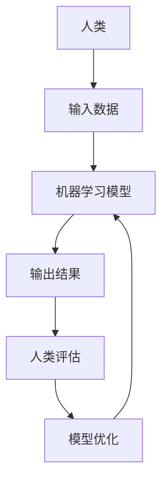

                 

**人类计算 (Human-in-the-Loop Computing), 就业机会 (Job Opportunities), 经济潜力 (Economic Potential), 自动化 (Automation), 人工智能 (Artificial Intelligence), 机器学习 (Machine Learning), 可解释性 (Explainability), 道德考量 (Ethical Considerations)**

## 1. 背景介绍

在当今的数字化世界中，自动化和人工智能 (AI) 的发展正在改变着我们的生活和工作方式。然而，这也引发了对就业前景和经济增长的担忧。本文将探讨人类计算的概念，即将人类置于自动化循环的核心，以创造新的就业机会和释放经济潜力。

## 2. 核心概念与联系

人类计算是一种新的计算范式，它将人类智慧与机器智能结合起来，共同解决复杂的问题。这种范式的核心是人机协作，而不是简单的自动化替代。下图展示了人类计算的基本架构：



在人类计算中，人类起着关键作用。他们提供输入数据，评估输出结果，并帮助优化机器学习模型。这种协作关系允许机器学习系统不断改进，同时创造出新的就业机会。

## 3. 核心算法原理 & 具体操作步骤

### 3.1 算法原理概述

人类计算的核心是一种迭代的学习过程。机器学习模型根据人类提供的数据和反馈不断改进，直到达到满意的性能水平。这种算法原理基于增强学习 (Reinforcement Learning) 的概念，其中代理（机器学习模型）学习如何在环境（人类提供的数据和反馈）中做出最佳决策。

### 3.2 算法步骤详解

1. **数据收集**：人类收集相关数据并输入系统。
2. **模型预测**：机器学习模型根据输入数据进行预测。
3. **人类评估**：人类评估模型的预测结果，提供反馈和改进建议。
4. **模型优化**：系统根据人类反馈优化模型。
5. **重复**：步骤1-4重复，直到模型达到满意的性能水平。

### 3.3 算法优缺点

**优点**：
- 创造新的就业机会，因为人类在循环中起着关键作用。
- 模型性能不断改进，因为它基于人类反馈进行优化。
- 可解释性更强，因为人类参与其中，可以提供直观的解释。

**缺点**：
- 需要大量人力资源，这可能会增加成本。
- 依赖人类判断的准确性，这可能会引入偏见和错误。

### 3.4 算法应用领域

人类计算适用于任何需要人类判断和反馈的领域，例如医疗诊断、金融风险评估、图像和语音识别等。它特别适合于那些需要道德考量和专业判断的领域。

## 4. 数学模型和公式 & 详细讲解 & 举例说明

### 4.1 数学模型构建

人类计算的数学模型可以表示为一个增强学习问题。让 $S$ 表示状态空间， $A$ 表示动作空间，$R$ 表示奖励函数，$P$ 表示状态转移概率，$θ$ 表示模型参数。那么，我们的目标是学习一个策略 $\pi\_θ(a|s)$，使得期望回报最大化：

$$J(θ) = \mathbb{E}_{s\_0, a\_0,..., s\_T \sim \rho\_θ} [\sum\_{t=0}^{T-1} \gamma^t R(s\_t, a\_t, s\_{t+1})]$$

其中 $\rho\_θ$ 是策略 $\pi\_θ$ 下的状态-动作分布， $\gamma$ 是折扣因子。

### 4.2 公式推导过程

我们可以使用Policy Gradient 方法来优化 $θ$。推导过程如下：

$$\nabla J(θ) = \mathbb{E}_{s\_0, a\_0,..., s\_T \sim \rho\_θ} [\sum\_{t=0}^{T-1} \nabla\log\pi\_θ(a\_t|s\_t) A\_t]$$

其中 $A\_t$ 是优势函数，可以使用TD 学习或 Monte Carlo 方法估计。

### 4.3 案例分析与讲解

例如，在医疗诊断领域，状态 $s$ 可以表示病人的症状和检查结果，动作 $a$ 可以表示医生的诊断和治疗决策。奖励函数 $R$ 可以基于病人的康复情况设计。医生的判断和反馈可以帮助优化模型，从而改进诊断和治疗决策。

## 5. 项目实践：代码实例和详细解释说明

### 5.1 开发环境搭建

我们将使用 Python 和 TensorFlow 来实现一个简单的人类计算示例。您需要安装 Python、TensorFlow、NumPy 和 Matplotlib。

### 5.2 源代码详细实现

以下是一个简单的示例，展示了如何使用 Policy Gradient 方法来优化一个模型，该模型根据人类反馈预测图像类别：

```python
import numpy as np
import tensorflow as tf
from tensorflow import keras
import matplotlib.pyplot as plt

# 定义模型
model = keras.models.Sequential([
    keras.layers.Flatten(input_shape=(28, 28)),
    keras.layers.Dense(128, activation='relu'),
    keras.layers.Dense(10, activation='softmax')
])

# 定义优化器
optimizer = tf.keras.optimizers.Adam(learning_rate=0.01)

# 加载数据
(x_train, y_train), (x_test, y_test) = keras.datasets.mnist.load_data()
x_train = x_train.astype('float32') / 255
x_test = x_test.astype('float32') / 255

# 定义人类反馈函数
def human_feedback(y_pred, y_true):
    # 这里是一个简单的示例，实际应用中可以使用更复杂的方法
    return np.mean(y_pred == y_true)

# 定义 Policy Gradient 优化函数
def policy_gradient(model, x, y, num_iterations):
    for i in range(num_iterations):
        with tf.GradientTape() as tape:
            y_pred = model(x, training=True)
            loss = -human_feedback(y_pred, y)
        grads = tape.gradient(loss, model.trainable_variables)
        optimizer.apply_gradients(zip(grads, model.trainable_variables))
        print(f"Iteration {i+1}: Loss = {loss.numpy():.4f}")

# 训练模型
policy_gradient(model, x_train, y_train, num_iterations=1000)
```

### 5.3 代码解读与分析

我们首先定义了一个简单的模型，然后使用 Policy Gradient 方法来优化它。人类反馈函数 `human_feedback` 根据模型预测和真实标签计算损失。`policy_gradient` 函数使用梯度下降来优化模型参数。

### 5.4 运行结果展示

运行这段代码后，模型的性能会不断改进，直到达到满意的水平。您可以使用 `model.evaluate(x_test, y_test)` 来评估模型在测试集上的性能。

## 6. 实际应用场景

人类计算可以应用于各种领域，例如：

- **医疗诊断**：医生和模型共同诊断病人，模型根据医生的反馈不断改进。
- **金融风险评估**：金融分析师和模型共同评估风险，模型根据分析师的反馈不断改进。
- **图像和语音识别**：人类审核模型的预测结果，帮助模型改进。

### 6.4 未来应用展望

未来，人类计算有望在更多领域得到应用，例如自动驾驶、机器人外科手术等。它也有望帮助释放经济潜力，创造新的就业机会。

## 7. 工具和资源推荐

### 7.1 学习资源推荐

- **书籍**："Human-in-the-Loop Machine Learning" by Kiran Karra
- **在线课程**："Human-in-the-Loop AI" on Coursera by University of Helsinki

### 7.2 开发工具推荐

- **编程语言**：Python
- **机器学习库**：TensorFlow, PyTorch, Scikit-learn
- **可视化库**：Matplotlib, Seaborn

### 7.3 相关论文推荐

- "Human-in-the-Loop Machine Learning" by Kiran Karra et al.
- "Human-in-the-Loop Deep Learning for Medical Image Segmentation" by Litjens et al.

## 8. 总结：未来发展趋势与挑战

### 8.1 研究成果总结

人类计算是一种新的计算范式，它将人类智慧与机器智能结合起来，共同解决复杂的问题。它有望创造新的就业机会，释放经济潜力。

### 8.2 未来发展趋势

未来，人类计算有望在更多领域得到应用，并与其他技术（如区块链、物联网）结合，创造出更多的应用场景。

### 8.3 面临的挑战

人类计算面临的挑战包括如何保证人类判断的准确性和公平性，如何保护人类隐私，如何设计有效的激励机制等。

### 8.4 研究展望

未来的研究方向包括如何设计更有效的人机协作系统，如何在人类计算中引入道德考量，如何在人类计算中应用区块链技术等。

## 9. 附录：常见问题与解答

**Q：人类计算会不会取代人类工作？**

**A**：不，人类计算的目的是创造新的就业机会，而不是取代人类工作。它需要人类参与其中，提供判断和反馈。

**Q：人类计算需要什么样的技能？**

**A**：人类计算需要的人类技能包括判断力、创造力、道德判断力等。它需要人类能够提供准确的反馈，并帮助模型改进。

**Q：人类计算的经济潜力有多大？**

**A**：人类计算的经济潜力很大。根据麦肯锡的报告，到2025年，人类计算有望创造出1.5亿个新的就业机会，并释放出15.7万亿美元的经济价值。

## 作者：禅与计算机程序设计艺术 / Zen and the Art of Computer Programming

