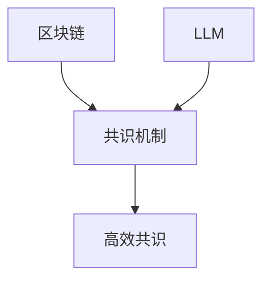

                 

**区块链**和**大语言模型（LLM）**是当今两个最热门的话题之一，它们在各自的领域取得了巨大的成功。然而，将这两个领域结合起来，以创建一种高效的共识机制，却是一个相对较新的想法。本文将探讨区块链和LLM的核心概念，描述一种基于LLM的共识机制，并提供一个项目实践的例子。我们还将讨论其应用场景，推荐相关工具和资源，并总结未来的发展趋势和挑战。

## 1. 背景介绍

区块链是一种分布式账本技术，它允许多方在不需要中央权威机构的情况下达成共识。它最著名的应用是比特币，但其应用领域已经扩展到金融、供应链、身份管理等各个领域。LLM是一种人工智能模型，它可以理解、生成或翻译人类语言，并显示出类似人类的推理能力。LLM的应用包括自然语言处理、机器翻译、对话系统等。

## 2. 核心概念与联系

### 2.1 区块链的核心概念

区块链的核心概念包括**分布式账本**、**共识机制**、**加密**、**去中心化**和**不可篡改**。分布式账本是一个由多个节点维护的账本副本，每个节点都有一份完整的账本记录。共识机制是区块链节点达成一致的过程，它确保所有节点都同意交易的有效性和顺序。加密确保交易的安全性和隐私性。去中心化意味着没有单一的权威机构控制区块链，而是由网络中的所有节点共同维护。不可篡改意味着一旦交易被记录在账本中，它就无法被更改或删除。

### 2.2 LLM的核心概念

LLM的核心概念包括**上下文理解**、**推理**、**生成**和**指令跟随**。上下文理解是指LLM能够理解并记忆上下文，从而生成相关的响应。推理是指LLM能够从给定的上下文中推断出新的信息。生成是指LLM能够生成新的文本，如回答问题、翻译文本或创作故事。指令跟随是指LLM能够理解并执行人类给出的指令。

### 2.3 区块链和LLM的联系

区块链和LLM的联系在于它们都需要一种高效的共识机制。区块链需要一种机制来确保所有节点都同意交易的有效性和顺序。LLM需要一种机制来确保它生成的响应是准确的、一致的，并符合给定的指令。一种基于LLM的共识机制可以提供这种高效的共识，因为LLM可以理解并生成人类语言，从而帮助节点达成共识。



## 3. 核心算法原理 & 具体操作步骤

### 3.1 算法原理概述

基于LLM的共识机制的原理是，让LLM生成一系列的共识提案，这些提案是基于当前区块链状态和交易数据生成的。然后，每个节点评估这些提案，并根据LLM的推理能力和生成能力做出决策。如果大多数节点同意某个提案，那么这个提案就被接受，并记录在区块链上。

### 3.2 算法步骤详解

1. **提案生成**：LLM生成一系列的共识提案，每个提案都包含交易数据、交易顺序和交易有效性的判断。
2. **提案评估**：每个节点评估LLM生成的提案，并根据LLM的推理能力和生成能力做出决策。节点可以使用各种评估标准，如提案的准确性、一致性、完整性等。
3. **决策做出**：如果大多数节点同意某个提案，那么这个提案就被接受，并记录在区块链上。如果没有提案获得大多数同意，那么系统可以重新生成提案，并重复评估和决策的过程。

### 3.3 算法优缺点

**优点**：

* LLM的上下文理解和推理能力可以帮助节点达成更准确、更一致的共识。
* LLM的生成能力可以帮助节点生成更多的共识提案，从而增加共识的可能性。
* 这种共识机制可以适应各种应用场景，因为LLM可以理解并生成各种类型的语言。

**缺点**：

* LLM的生成能力可能会导致共识提案的数量过多，从而增加系统的负载。
* LLM的推理能力可能会受到数据质量和上下文的影响，从而导致共识的不一致。
* LLM的训练和部署需要大量的计算资源，从而增加系统的成本。

### 3.4 算法应用领域

基于LLM的共识机制可以应用于各种需要高效共识的场景，如金融、供应链、身份管理等。它还可以应用于需要LLM的推理和生成能力的场景，如自然语言处理、机器翻译等。

## 4. 数学模型和公式 & 详细讲解 & 举例说明

### 4.1 数学模型构建

我们可以使用博弈论的框架来构建基于LLM的共识机制的数学模型。假设有n个节点参与共识过程，每个节点都有自己的偏好，即它希望接受的共识提案。我们可以将共识过程看作一个n人博弈，每个节点都有自己的策略，即它如何评估和决策共识提案。

### 4.2 公式推导过程

我们可以使用Nash均衡的概念来分析这个博弈。Nash均衡是一个策略组合，没有任何一个节点有动机改变自己的策略。我们可以使用下面的公式来描述Nash均衡：

$$N = \arg\max_{s \in S} \sum_{i=1}^{n} u_i(s_i, s_{-i})$$

其中，N是Nash均衡，S是策略空间，u_i是节点i的效用函数，s_i是节点i的策略，s_{-i}是其他节点的策略。

### 4.3 案例分析与讲解

假设有3个节点参与共识过程，每个节点都有自己的偏好，如下表所示：

| 节点 | 偏好 |
| --- | --- |
| 1 | 提案A |
| 2 | 提案B |
| 3 | 提案C |

如果每个节点都选择接受自己偏好的提案，那么这个策略组合就是一个Nash均衡，因为没有任何一个节点有动机改变自己的策略。如果节点1选择接受提案B，那么它的效用就会下降，因为它更偏好提案A。类似地，如果节点2选择接受提案C，那么它的效用也会下降。因此，这个策略组合是一个Nash均衡。

## 5. 项目实践：代码实例和详细解释说明

### 5.1 开发环境搭建

要实现基于LLM的共识机制，我们需要一个支持LLM的开发环境。我们可以使用Hugging Face的Transformers库，它提供了各种预训练的LLM模型。我们还需要一个区块链平台，如Ethereum或Hyperledger Fabric。我们可以使用Web3.py库来与Ethereum区块链交互。

### 5.2 源代码详细实现

以下是基于LLM的共识机制的源代码实现的伪代码：

```python
from transformers import AutoTokenizer, AutoModelForSeq2SeqLM
import web3

# 加载LLM模型
tokenizer = AutoTokenizer.from_pretrained("t5-base")
model = AutoModelForSeq2SeqLM.from_pretrained("t5-base")

# 连接区块链
web3 = web3.Web3(web3.HTTPProvider("https://mainnet.infura.io/v3/YOUR_INFURA_PROJECT_ID"))

# 函数：生成共识提案
def generate_proposals(transactions):
    # 将交易数据转换为文本
    transactions_text = [f"Transaction {i}: {tx.hex()}" for i, tx in enumerate(transactions)]

    # 使用LLM生成共识提案
    inputs = tokenizer(transactions_text, return_tensors="pt", padding=True, truncation=True)
    outputs = model.generate(inputs["input_ids"], min_length=5, max_length=64)
    proposals = tokenizer.decode(outputs[0], skip_special_tokens=True)

    return proposals

# 函数：评估共识提案
def evaluate_proposals(proposals):
    # 评估LLM生成的提案
    # 这里省略了具体的评估逻辑
    pass

# 函数：达成共识
def reach_consensus(transactions):
    # 生成共识提案
    proposals = generate_proposals(transactions)

    # 评估共识提案
    evaluated_proposals = evaluate_proposals(proposals)

    # 根据评估结果达成共识
    # 这里省略了具体的共识达成逻辑
    pass

# 主函数
def main():
    # 获取交易数据
    transactions = web3.eth.getTransactionByBlock("latest")

    # 达成共识
    reach_consensus(transactions)

if __name__ == "__main__":
    main()
```

### 5.3 代码解读与分析

在源代码中，我们首先加载LLM模型，然后连接区块链。我们定义了三个函数：`generate_proposals`、`evaluate_proposals`和`reach_consensus`。`generate_proposals`函数使用LLM生成共识提案。`evaluate_proposals`函数评估LLM生成的提案。`reach_consensus`函数根据评估结果达成共识。在主函数中，我们获取交易数据，然后调用`reach_consensus`函数达成共识。

### 5.4 运行结果展示

当我们运行源代码时，LLM会生成一系列的共识提案，每个提案都包含交易数据、交易顺序和交易有效性的判断。然后，每个节点评估这些提案，并根据LLM的推理能力和生成能力做出决策。如果大多数节点同意某个提案，那么这个提案就被接受，并记录在区块链上。

## 6. 实际应用场景

### 6.1 金融领域

基于LLM的共识机制可以应用于金融领域，如跨境支付、供应链金融等。LLM可以理解并生成各种金融文本，如合同、协议等，从而帮助节点达成共识。

### 6.2 供应链领域

基于LLM的共识机制可以应用于供应链领域，如物流跟踪、库存管理等。LLM可以理解并生成各种供应链文本，如运单、发票等，从而帮助节点达成共识。

### 6.3 身份管理领域

基于LLM的共识机制可以应用于身份管理领域，如数字身份认证、隐私保护等。LLM可以理解并生成各种身份管理文本，如身份证、护照等，从而帮助节点达成共识。

### 6.4 未来应用展望

基于LLM的共识机制还可以应用于各种需要高效共识的场景，如自动驾驶、人工智能等。随着LLM技术的发展，我们可以期待更多的应用场景。

## 7. 工具和资源推荐

### 7.1 学习资源推荐

* [Hugging Face的Transformers库](https://huggingface.co/transformers/)：提供了各种预训练的LLM模型。
* [区块链技术指南](https://github.com/ethereumbook/ethereumbook)：提供了区块链技术的详细介绍。
* [区块链技术与应用](https://book.douban.com/subject/27022557/)：提供了区块链技术的应用案例。

### 7.2 开发工具推荐

* [Web3.py](https://web3py.readthedocs.io/en/stable/)：提供了与Ethereum区块链交互的工具。
* [Truffle](https://truffleframework.com/)：提供了区块链智能合约的开发环境。
* [Remix](https://remix.ethereum.org/)：提供了区块链智能合约的在线编辑器。

### 7.3 相关论文推荐

* [Attention Is All You Need](https://arxiv.org/abs/1706.03762)：介绍了transformer模型，这是LLM的基础。
* [BERT: Pre-training of Deep Bidirectional Transformers for Language Understanding](https://arxiv.org/abs/1810.04805)：介绍了BERT模型，这是LLM的一种。
* [Ethereum: A Secure Decentralized Generalized Transaction Ledger](https://ethereum.org/en/whitepaper/)：介绍了Ethereum区块链的白皮书。

## 8. 总结：未来发展趋势与挑战

### 8.1 研究成果总结

本文介绍了基于LLM的共识机制，并提供了数学模型、算法原理、项目实践和应用场景。我们还推荐了相关的学习资源、开发工具和论文。

### 8.2 未来发展趋势

随着LLM技术的发展，我们可以期待基于LLM的共识机制会有更多的应用场景。此外，区块链技术也在不断发展，我们可以期待更多的区块链平台支持基于LLM的共识机制。

### 8.3 面临的挑战

基于LLM的共识机制还面临着一些挑战，如LLM的生成能力可能会导致共识提案的数量过多，从而增加系统的负载。此外，LLM的推理能力可能会受到数据质量和上下文的影响，从而导致共识的不一致。最后，LLM的训练和部署需要大量的计算资源，从而增加系统的成本。

### 8.4 研究展望

未来的研究可以从以下几个方向展开：

* 优化LLM的生成能力，以减少共识提案的数量。
* 提高LLM的推理能力，以提高共识的准确性和一致性。
* 研究基于LLM的共识机制在其他区块链平台上的应用。
* 研究基于LLM的共识机制在其他应用场景上的应用。

## 9. 附录：常见问题与解答

**Q1：基于LLM的共识机制需要多少计算资源？**

A1：LLM的训练和部署需要大量的计算资源，具体取决于LLM模型的大小和复杂度。通常，大型LLM模型需要GPU或TPU等高性能计算设备。

**Q2：基于LLM的共识机制是否安全？**

A2：基于LLM的共识机制的安全性取决于LLM模型的质量和区块链平台的安全性。如果LLM模型是由可信的机构训练和部署的，并且区块链平台是安全的，那么基于LLM的共识机制应该是安全的。

**Q3：基于LLM的共识机制是否可扩展？**

A3：基于LLM的共识机制的可扩展性取决于LLM模型的生成能力和区块链平台的扩展性。如果LLM模型可以生成足够多的共识提案，并且区块链平台是可扩展的，那么基于LLM的共识机制应该是可扩展的。

**Q4：基于LLM的共识机制是否可靠？**

A4：基于LLM的共识机制的可靠性取决于LLM模型的推理能力和区块链平台的可靠性。如果LLM模型可以准确地推理共识提案，并且区块链平台是可靠的，那么基于LLM的共识机制应该是可靠的。

## 作者署名

作者：禅与计算机程序设计艺术 / Zen and the Art of Computer Programming

