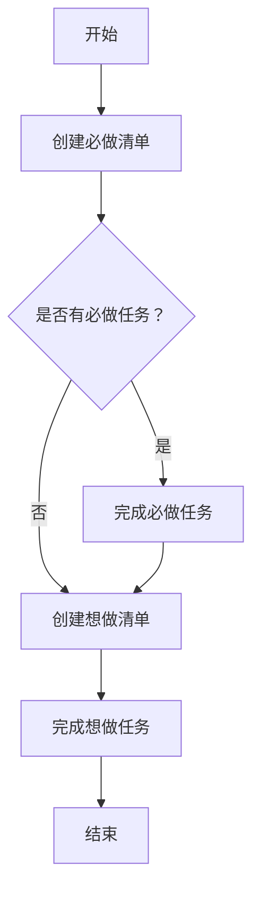

                 

## 1. 背景介绍

在当今快节奏的工作环境中，我们每天都面临着大量的任务和目标，很容易陷入忙碌但无效的循环。要想真正提高生产力，我们需要一种方法来帮助我们专注于最重要的工作。双目标清单法（Two-Goal List Method）就是这样一种方法，它可以帮助我们有效地管理时间，提高工作效率，并实现我们的目标。

## 2. 核心概念与联系

双目标清单法的核心概念是将每天的任务分为两类：必做任务（Must-Do）和想做任务（Want-To-Do）。必做任务是指那些必须在当天完成的任务，而想做任务则是指那些我们想要完成但并非必须在当天完成的任务。这种区分有助于我们更好地管理时间，并确保我们优先处理最重要的任务。

下面是双目标清单法的流程图，展示了这两类任务的关系：



## 3. 核心算法原理 & 具体操作步骤

### 3.1 算法原理概述

双目标清单法的原理是基于心理学和时间管理学的研究成果。它利用了我们的大脑对目标的天然偏好，以及我们对完成任务的满足感。通过将任务分为两类，我们可以更好地管理我们的精力和时间，并确保我们优先处理最重要的任务。

### 3.2 算法步骤详解

双目标清单法的具体操作步骤如下：

1. **创建必做清单**：每天 morning routine 的一部分，列出当天必须完成的任务。这些任务可以是工作任务，也可以是个人任务，如锻炼、购物等。
2. **完成必做任务**：优先处理必做清单上的任务。一旦完成，从清单中删除该任务。
3. **创建想做清单**：在完成必做任务后，列出你想要完成的任务。这些任务可以是工作任务，也可以是个人任务，但它们并非必须在当天完成。
4. **完成想做任务**：在完成必做任务后，如果还有时间，则处理想做清单上的任务。一旦完成，从清单中删除该任务。
5. **结束**：一旦完成所有任务，或者到了你的 workday 的结束时间，则结束当天的任务清单。

### 3.3 算法优缺点

**优点**：

* 简单易用：双目标清单法的操作步骤非常简单，任何人都可以轻松学习和使用。
* 专注于最重要的任务：通过将任务分为两类，我们可以确保我们优先处理最重要的任务。
* 提高满足感：每次完成一个任务，我们都会感到满足。这种满足感可以激励我们继续前进。

**缺点**：

* 可能导致过度工作：如果不注意控制，我们可能会陷入过度工作的状态，因为我们总是想要完成更多的任务。
* 不适合每个人：双目标清单法可能不适合那些喜欢灵活安排时间的人，或者那些需要处理大量任务的人。

### 3.4 算法应用领域

双目标清单法可以应用于各种领域，包括：

* 工作：帮助管理工作任务，确保优先处理最重要的任务。
* 学习：帮助管理学习任务，确保优先处理最重要的学习任务。
* 个人生活：帮助管理个人任务，如锻炼、购物等，确保优先处理最重要的个人任务。

## 4. 数学模型和公式 & 详细讲解 & 举例说明

### 4.1 数学模型构建

双目标清单法的数学模型可以表示为以下公式：

$$T = M \cup W$$

其中，$T$ 表示任务集，$M$ 表示必做任务集，$W$ 表示想做任务集。

### 4.2 公式推导过程

推导过程如下：

1. 任务集$T$包含所有需要处理的任务。
2. 必做任务集$M$包含所有必须在当天完成的任务。
3. 想做任务集$W$包含所有想要完成但并非必须在当天完成的任务。
4. 任务集$T$是必做任务集$M$和想做任务集$W$的并集。

### 4.3 案例分析与讲解

例如，假设你的任务集$T$包含以下任务：

* 必做任务：完成报告（$M_1$）、参加会议（$M_2$）、回复邮件（$M_3$）
* 想做任务：阅读文献（$W_1$）、整理文件（$W_2$）、学习新技能（$W_3$）

根据双目标清单法的数学模型，我们可以表示为：

$$T = \{M_1, M_2, M_3, W_1, W_2, W_3\} = \{M_1, M_2, M_3\} \cup \{W_1, W_2, W_3\}$$

## 5. 项目实践：代码实例和详细解释说明

### 5.1 开发环境搭建

要实现双目标清单法，我们需要一个简单的任务管理系统。我们可以使用 Python 和 Flask 来创建一个简单的 web 应用程序。

### 5.2 源代码详细实现

以下是一个简单的 Flask 应用程序，实现了双目标清单法：

```python
from flask import Flask, render_template, request, redirect, url_for

app = Flask(__name__)

# 任务数据存储在内存中
tasks = {
   'must_do': [],
    'want_to_do': []
}

@app.route('/')
def index():
    return render_template('index.html', tasks=tasks)

@app.route('/add_task', methods=['POST'])
def add_task():
    task = request.form['task']
    category = request.form['category']
    if category =='must_do':
        tasks['must_do'].append(task)
    elif category == 'want_to_do':
        tasks['want_to_do'].append(task)
    return redirect(url_for('index'))

@app.route('/complete_task/<category>/<task>')
def complete_task(category, task):
    if category =='must_do':
        tasks['must_do'].remove(task)
    elif category == 'want_to_do':
        tasks['want_to_do'].remove(task)
    return redirect(url_for('index'))

if __name__ == '__main__':
    app.run(debug=True)
```

### 5.3 代码解读与分析

* `tasks` 字典用于存储任务数据。`must_do` 键对应必做任务集，$want_to_do$ 键对应想做任务集。
* `index()` 函数渲染主页，并传递任务数据给模板。
* `add_task()` 函数处理添加任务的请求。它获取任务名称和类别，并将任务添加到相应的任务集中。
* `complete_task()` 函数处理完成任务的请求。它获取任务类别和名称，并从相应的任务集中删除该任务。

### 5.4 运行结果展示

当我们运行应用程序并访问主页时，我们会看到一个简单的表单，允许我们添加任务。添加任务后，任务会显示在相应的任务列表中。当我们点击完成任务按钮时，任务会从任务列表中删除。

## 6. 实际应用场景

### 6.1 个人应用

双目标清单法可以帮助个人更好地管理时间，确保优先处理最重要的任务。例如，你可以使用双目标清单法来管理你的学习任务，确保优先处理最重要的学习任务。

### 6.2 团队应用

双目标清单法也可以应用于团队。团队可以使用双目标清单法来管理项目任务，确保优先处理最重要的任务。例如，团队可以使用双目标清单法来管理项目进度，确保优先处理最重要的项目任务。

### 6.3 未来应用展望

随着技术的发展，双目标清单法可以与其他技术结合，提供更智能的任务管理。例如，双目标清单法可以与人工智能结合，提供个性化的任务建议。

## 7. 工具和资源推荐

### 7.1 学习资源推荐

* [Getting Things Done: The Art of Stress-Free Productivity](https://www.amazon.com/Getting-Things-Done-Stress-Free-Productivity/dp/0385460313) - 这本书介绍了双目标清单法的原理，并提供了实用的建议。
* [The 4-Hour Workweek: Escape 9-5, Live Anywhere, and Join the New Rich](https://www.amazon.com/4-Hour-Workweek-Escape-Anywhere-Rich/dp/0307465357) - 这本书介绍了如何使用时间管理技巧来提高生产力。

### 7.2 开发工具推荐

* [Trello](https://trello.com/) - Trello 是一个简单易用的任务管理工具，可以帮助你创建和管理任务清单。
* [Asana](https://asana.com/) - Asana 是一个功能强大的任务管理工具，可以帮助你创建和管理任务清单，并跟踪任务进度。

### 7.3 相关论文推荐

* [The Role of Goals in the Regulation of Behavior](https://psycnet.apa.org/record/1990-09996-001) - 这篇论文介绍了目标在行为调节中的作用。
* [Time Management: A Review of the Literature](https://www.researchgate.net/publication/237604117_Time_Management_A_Review_of_the_Literature) - 这篇论文回顾了时间管理领域的研究成果。

## 8. 总结：未来发展趋势与挑战

### 8.1 研究成果总结

双目标清单法是一种简单有效的时间管理技巧，可以帮助我们专注于最重要的任务，提高生产力。研究表明，目标设定和任务管理是提高生产力的关键因素。

### 8.2 未来发展趋势

随着技术的发展，我们可以期待看到更智能的任务管理工具。这些工具可以利用人工智能和大数据，提供个性化的任务建议，并帮助我们更好地管理时间。

### 8.3 面临的挑战

然而，双目标清单法也面临着挑战。例如，它可能不适合那些需要处理大量任务的人，或者那些需要灵活安排时间的人。此外，它可能导致过度工作，因为我们总是想要完成更多的任务。

### 8.4 研究展望

未来的研究可以探索双目标清单法的变体，以适应不同的工作环境和个人需求。此外，研究可以探索双目标清单法与其他时间管理技巧的结合，以提供更全面的时间管理解决方案。

## 9. 附录：常见问题与解答

**Q：双目标清单法适合我吗？**

**A：**如果你需要管理大量任务，或者需要灵活安排时间，双目标清单法可能不适合你。否则，它是一种简单有效的时间管理技巧，可以帮助你专注于最重要的任务。

**Q：如何避免过度工作？**

**A：**要避免过度工作，你需要设定合理的目标，并学会说“不”。当你完成了必做任务后，不要试图完成所有想做任务。相反，选择几个最重要的想做任务，并安排在合理的时间内完成。

**Q：双目标清单法与其他时间管理技巧有何不同？**

**A：**双目标清单法与其他时间管理技巧的主要区别在于它将任务分为两类：必做任务和想做任务。这种区分有助于我们更好地管理时间，并确保我们优先处理最重要的任务。

## 作者：禅与计算机程序设计艺术 / Zen and the Art of Computer Programming

