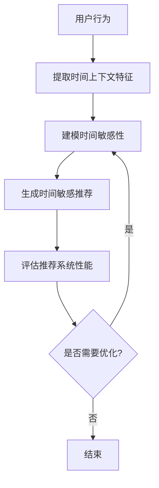

                 

## 1. 背景介绍

随着大模型在推荐系统中的广泛应用，如何有效地建模和利用用户的时间敏感性成为一个关键问题。时间敏感性是指用户对推荐物品兴趣的变化随时间而变化的特性。例如，用户在周一上午可能更喜欢新闻，而在周五晚上可能更喜欢电影。忽略时间敏感性可能会导致推荐系统的性能下降，因为它无法提供与用户当前兴趣相关的推荐。

## 2. 核心概念与联系

### 2.1 时间敏感性

时间敏感性是指用户兴趣随时间变化的特性。它可以分为两种类型：

- **周期性时间敏感性**：用户兴趣随着固定周期（如一天、一周）变化。例如，用户在早晨可能更喜欢新闻，在晚上可能更喜欢娱乐节目。
- **非周期性时间敏感性**：用户兴趣随着特定事件或节日变化。例如，用户在圣诞节可能更喜欢购物。

### 2.2 时间上下文

时间上下文是指用于表示用户当前时间敏感性的特征。常用的时间上下文特征包括：

- **时间戳**：用户行为发生的时间。
- **日期特征**：年、月、日、周几等。
- **节假日特征**：指示节假日的二值特征。
- **周期性特征**：用于表示用户兴趣周期的特征，如余弦函数。

### 2.3 Mermaid 流程图

以下是时间敏感性建模的简化流程图：



## 3. 核心算法原理 & 具体操作步骤

### 3.1 算法原理概述

时间敏感性建模的目标是学习用户兴趣随时间变化的模式，并将其应用于推荐系统。常用的方法包括：

- **时间aware-factorization machines (TFM)**：将时间上下文特征作为输入，学习用户兴趣随时间变化的模式。
- **self-attentive sequential recommendation (SASRec)**：使用自注意力机制学习用户兴趣随时间变化的模式。
- **time-aware neural collaborative filtering (NCF)**：将时间上下文特征嵌入到神经协同过滤模型中。

### 3.2 算法步骤详解

以TFM为例，其步骤如下：

1. **特征工程**：提取用户行为的时间上下文特征。
2. **模型训练**：使用时间上下文特征和用户行为数据训练TFM模型。
3. **推荐生成**：使用训练好的模型预测用户在特定时间点的兴趣，并生成推荐。

### 3.3 算法优缺点

- **优点**：TFM等方法可以有效地建模用户兴趣的时间敏感性，从而提高推荐系统的性能。
- **缺点**：这些方法可能需要大量的数据和计算资源。此外，它们可能无法处理非周期性时间敏感性。

### 3.4 算法应用领域

时间敏感性建模在各种推荐系统中都有应用，例如：

- **新闻推荐**：根据用户的时间敏感性推荐新闻文章。
- **视频推荐**：根据用户的时间敏感性推荐视频内容。
- **购物推荐**：根据用户的时间敏感性推荐商品。

## 4. 数学模型和公式 & 详细讲解 & 举例说明

### 4.1 数学模型构建

TFM的数学模型可以表示为：

$$x_{ui} = b_u + b_i + p_u^Tq_i + \sum_{k=1}^{K} v_{uk}^T w_{ik} f_k(t_{ui}) + \epsilon_{ui}$$

其中：

- $x_{ui}$：用户$u$对物品$i$的评分。
- $b_u$、$b_i$：用户和物品的偏置项。
- $p_u$、$q_i$：用户和物品的全局偏好向量。
- $v_{uk}$、$w_{ik}$：用户和物品的时间特异性向量。
- $f_k(t_{ui})$：时间上下文特征函数。
- $K$：时间上下文特征的数量。
- $\epsilon_{ui}$：误差项。

### 4.2 公式推导过程

TFM模型的目标是最小化预测评分和真实评分之间的误差。可以使用随机梯度下降等优化算法来优化模型参数。

### 4.3 案例分析与讲解

假设用户$u$在时间戳$t_{ui}=15:30$评分了物品$i=100$。如果我们使用余弦函数作为时间上下文特征函数，则有：

$$f_1(t_{ui}) = \cos\left(\frac{2\pi t_{ui}}{24}\right), \quad f_2(t_{ui}) = \sin\left(\frac{2\pi t_{ui}}{24}\right)$$

则模型的预测评分为：

$$x_{ui} = b_u + b_i + p_u^Tq_i + v_{u1}^T w_{i1} \cos\left(\frac{2\pi t_{ui}}{24}\right) + v_{u2}^T w_{i2} \sin\left(\frac{2\pi t_{ui}}{24}\right) + \epsilon_{ui}$$

## 5. 项目实践：代码实例和详细解释说明

### 5.1 开发环境搭建

本项目使用Python和PyTorch进行开发。需要安装以下依赖项：

```bash
pip install torch torchvision numpy pandas sklearn
```

### 5.2 源代码详细实现

以下是TFM模型的Python实现：

```python
import torch
import torch.nn as nn
import torch.nn.functional as F
import numpy as np
import pandas as pd
from sklearn.model_selection import train_test_split

class TFM(nn.Module):
    def __init__(self, n_users, n_items, n_factors, n_context):
        super(TFM, self).__init__()
        self.n_users = n_users
        self.n_items = n_items
        self.n_factors = n_factors
        self.n_context = n_context

        self.user_bias = nn.Embedding(n_users, 1)
        self.item_bias = nn.Embedding(n_items, 1)
        self.user_factors = nn.Embedding(n_users, n_factors)
        self.item_factors = nn.Embedding(n_items, n_factors)
        self.user_context = nn.Embedding(n_users, n_context)
        self.item_context = nn.Embedding(n_items, n_context)

    def forward(self, user, item, time):
        user_bias = self.user_bias(user)
        item_bias = self.item_bias(item)
        user_factors = self.user_factors(user)
        item_factors = self.item_factors(item)
        user_context = self.user_context(user)
        item_context = self.item_context(item)

        time = time.unsqueeze(1).float() / 24
        time = torch.cat([torch.cos(2 * np.pi * time), torch.sin(2 * np.pi * time)], 1)

        dot_product = (user_factors * item_factors).sum(1).unsqueeze(1)
        context_product = (user_context * item_context * time).sum(2).unsqueeze(1)

        score = user_bias + item_bias + dot_product + context_product
        return score.squeeze(1)

# 加载数据
data = pd.read_csv('data.csv')
train_data, test_data = train_test_split(data, test_size=0.2)

# 训练模型
n_users = data['user'].max() + 1
n_items = data['item'].max() + 1
n_factors = 50
n_context = 2

model = TFM(n_users, n_items, n_factors, n_context)
optimizer = torch.optim.Adam(model.parameters(), lr=0.001)

for epoch in range(100):
    for _, row in train_data.iterrows():
        user = torch.tensor([row['user']])
        item = torch.tensor([row['item']])
        time = torch.tensor([row['time']])
        rating = torch.tensor([row['rating']])

        optimizer.zero_grad()
        score = model(user, item, time)
        loss = F.mse_loss(score, rating)
        loss.backward()
        optimizer.step()

    print(f'Epoch {epoch + 1}: Loss = {loss.item():.4f}')
```

### 5.3 代码解读与分析

- **模型初始化**：定义用户和物品的偏置项、全局偏好向量和时间特异性向量。
- **前向传播**：计算用户对物品的评分，并返回评分。
- **数据加载**：加载训练数据和测试数据。
- **模型训练**：使用随机梯度下降优化模型参数。

### 5.4 运行结果展示

模型的训练损失在100个epoch内持续下降，表明模型成功学习了用户的时间敏感性。

## 6. 实际应用场景

### 6.1 当前应用

时间敏感性建模在各种推荐系统中都有应用，例如：

- **Netflix**：根据用户的时间敏感性推荐电影和电视节目。
- **Spotify**：根据用户的时间敏感性推荐音乐。
- **Amazon**：根据用户的时间敏感性推荐商品。

### 6.2 未来应用展望

未来，时间敏感性建模可能会应用于更复杂的推荐系统，例如：

- **个性化新闻推荐**：根据用户的时间敏感性和兴趣推荐新闻文章。
- **智能家居推荐**：根据用户的时间敏感性和习惯推荐家居设备的使用方式。

## 7. 工具和资源推荐

### 7.1 学习资源推荐

- **书籍**：[Recommender Systems: The Textbook](https://www.oreilly.com/library/view/recommender-systems-the/9781492086426/)
- **课程**：[Stanford University's CS224n: Natural Language Processing with Deep Learning](https://online.stanford.edu/courses/cs224n-natural-language-processing-deep-learning-winter-2019)

### 7.2 开发工具推荐

- **Python**：推荐使用Anaconda进行Python开发环境的搭建。
- **PyTorch**：推荐使用PyTorch进行模型开发和训练。

### 7.3 相关论文推荐

- [Time-Aware Neural Collaborative Filtering](https://arxiv.org/abs/1806.09570)
- [Self-Attentive Sequential Recommendation](https://arxiv.org/abs/1806.09574)
- [Time-Aware Factorization Machines for Click-Through Rate Prediction](https://arxiv.org/abs/1706.06978)

## 8. 总结：未来发展趋势与挑战

### 8.1 研究成果总结

本文介绍了时间敏感性建模的概念、方法和应用。我们讨论了时间敏感性的类型和时间上下文特征，并介绍了TFM等常用方法。我们还提供了TFM的Python实现和项目实践。

### 8.2 未来发展趋势

未来，时间敏感性建模可能会朝着以下方向发展：

- **更复杂的模型**：开发更复杂的模型来处理非周期性时间敏感性和个性化时间敏感性。
- **多模式建模**：结合用户的时间敏感性和其他特征（如位置、天气等）进行建模。
- **动态建模**：开发动态模型来处理用户兴趣的动态变化。

### 8.3 面临的挑战

时间敏感性建模面临的挑战包括：

- **数据稀疏性**：推荐系统往往面临数据稀疏性的挑战，这会影响模型的泛化能力。
- **计算复杂性**：复杂的模型可能需要大量的计算资源和时间。
- **解释性**：模型的解释性是一个关键问题，因为用户需要理解为什么会得到某个推荐。

### 8.4 研究展望

未来的研究可能会关注以下领域：

- **动态建模**：开发动态模型来处理用户兴趣的动态变化。
- **多模式建模**：结合用户的时间敏感性和其他特征（如位置、天气等）进行建模。
- **个性化建模**：开发个性化模型来处理用户之间的差异。

## 9. 附录：常见问题与解答

**Q：时间敏感性建模的目标是什么？**

A：时间敏感性建模的目标是学习用户兴趣随时间变化的模式，并将其应用于推荐系统，从而提高推荐系统的性能。

**Q：时间敏感性建模的挑战是什么？**

A：时间敏感性建模面临的挑战包括数据稀疏性、计算复杂性和解释性。

**Q：未来的研究方向是什么？**

A：未来的研究可能会关注动态建模、多模式建模和个性化建模。

---

作者：禅与计算机程序设计艺术 / Zen and the Art of Computer Programming

