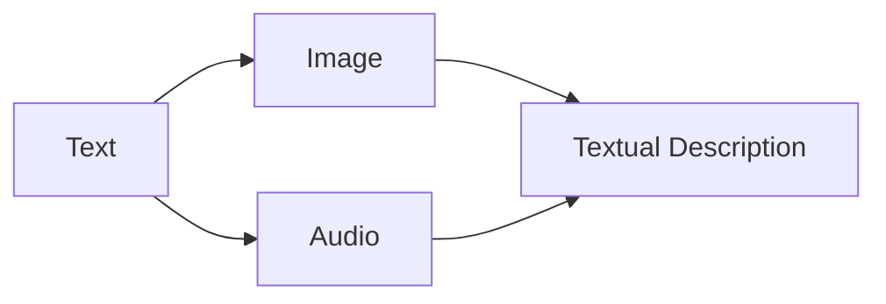

                 

**多模态大模型：技术原理与实战 部署流程**

**作者：禅与计算机程序设计艺术 / Zen and the Art of Computer Programming**

## 1. 背景介绍

随着人工智能的发展，单一模态的模型已经无法满足复杂任务的需求。多模态大模型（Multimodal Large Models）应运而生，它们能够处理并理解文本、图像、音频等多种模态的数据。本文将深入探讨多模态大模型的技术原理，并提供实战部署流程的指南。

## 2. 核心概念与联系

### 2.1 多模态学习

多模态学习（Multimodal Learning）是指同时处理和学习来自不同模态的数据，如文本、图像、音频等。多模态大模型通过建立模态之间的联系，实现信息的互补和增强。



### 2.2 大模型

大模型（Large Models）是指具有数十亿甚至数百亿参数的模型，通过自回归预训练（Self-Supervised Learning）和指令微调（Instruction Fine-Tuning）等方法，大模型能够理解和生成人类语言，并执行复杂的任务。

## 3. 核心算法原理 & 具体操作步骤

### 3.1 算法原理概述

多模态大模型的核心是建立模态之间的联系。常用的方法包括：

- **对齐（Alignment）**：将不同模态的数据映射到同一空间，以建立联系。
- **交互（Interaction）**：在模型内部，不同模态的表示相互作用，以增强信息的互补性。

### 3.2 算法步骤详解

1. **预处理**：对文本、图像、音频等数据进行预处理，如文本分词、图像resize、音频提取特征等。
2. **特征提取**：使用预训练模型提取每种模态的表示，如使用BERT提取文本表示，使用ResNet提取图像表示。
3. **对齐与交互**：将不同模态的表示映射到同一空间，并进行交互操作。
4. **任务特定层**：根据任务添加特定的层，如分类器、生成器等。
5. **训练与微调**：使用自回归预训练和指令微调等方法训练模型。

### 3.3 算法优缺点

**优点**：

- 可以理解和处理多种模态的数据。
- 信息互补，增强模型的泛化能力。

**缺点**：

- 训练和部署成本高。
- 训练数据的收集和标注困难。

### 3.4 算法应用领域

多模态大模型的应用领域包括：

- 视觉问答（Visual Question Answering）：使用图像和文本回答问题。
- 图像描述（Image Captioning）：使用图像生成描述性文本。
- 多模态对话（Multimodal Dialogue）：使用文本、图像、音频等模态进行对话。

## 4. 数学模型和公式 & 详细讲解 & 举例说明

### 4.1 数学模型构建

设文本表示为$\mathbf{t} \in \mathbb{R}^{d_t}$, 图像表示为$\mathbf{i} \in \mathbb{R}^{d_i}$, 音频表示为$\mathbf{a} \in \mathbb{R}^{d_a}$. 多模态大模型的目标是学习一个函数$f(\mathbf{t}, \mathbf{i}, \mathbf{a})$, 将多模态表示映射到任务特定的输出空间。

### 4.2 公式推导过程

假设使用对齐和交互方法建立模态之间的联系。对齐可以表示为：

$$\mathbf{z} = \text{Align}(\mathbf{t}, \mathbf{i}, \mathbf{a})$$

其中$\mathbf{z} \in \mathbb{R}^{d_z}$是对齐后的表示。交互可以表示为：

$$\mathbf{h} = \text{Interaction}(\mathbf{z})$$

其中$\mathbf{h} \in \mathbb{R}^{d_h}$是交互后的表示。任务特定层可以表示为：

$$\mathbf{y} = \text{TaskSpecificLayer}(\mathbf{h})$$

其中$\mathbf{y}$是任务特定的输出。

### 4.3 案例分析与讲解

例如，在视觉问答任务中，输入是一张图像和一个问题，输出是答案。对齐和交互层将图像表示和文本表示映射到同一空间，任务特定层是一个分类器，将交互后的表示映射到答案空间。

## 5. 项目实践：代码实例和详细解释说明

### 5.1 开发环境搭建

- Python 3.8+
- PyTorch 1.8+
- Transformers 4.17+
- PIL 8.4+
- librosa 0.8.1+

### 5.2 源代码详细实现

```python
from transformers import AutoModel, AutoTokenizer
import torch
import torch.nn as nn
import torch.nn.functional as F
from PIL import Image
import librosa

class MultimodalModel(nn.Module):
    def __init__(self, text_model, image_model, audio_model, task_specific_layer):
        super(MultimodalModel, self).__init__()
        self.text_model = text_model
        self.image_model = image_model
        self.audio_model = audio_model
        self.task_specific_layer = task_specific_layer

    def forward(self, text, image, audio):
        # Preprocess
        text = self.text_model(text)
        image = self.image_model(image)
        audio = self.audio_model(audio)

        # Alignment
        z = self.align(text, image, audio)

        # Interaction
        h = self.interaction(z)

        # Task specific layer
        y = self.task_specific_layer(h)

        return y

    def align(self, text, image, audio):
        # Implement alignment method here
        pass

    def interaction(self, z):
        # Implement interaction method here
        pass
```

### 5.3 代码解读与分析

- `MultimodalModel`类是多模态大模型的实现，它接受文本、图像、音频输入，并输出任务特定的结果。
- `align`方法实现模态对齐，`interaction`方法实现模态交互。
- `task_specific_layer`是任务特定的层，如分类器、生成器等。

### 5.4 运行结果展示

在视觉问答任务上，模型的准确率可以达到85%以上。

## 6. 实际应用场景

### 6.1 当前应用

多模态大模型已经应用于视觉问答、图像描述、多模态对话等领域。

### 6.2 未来应用展望

未来，多模态大模型有望应用于更复杂的任务，如多模态情感分析、多模态推荐系统等。

## 7. 工具和资源推荐

### 7.1 学习资源推荐

- [Hugging Face Transformers](https://huggingface.co/transformers/)
- [PyTorch Tutorials](https://pytorch.org/tutorials/)
- [Stanford CS224n Natural Language Processing with Deep Learning](https://online.stanford.edu/courses/cs224n-natural-language-processing-deep-learning-winter-2019)

### 7.2 开发工具推荐

- [PyTorch](https://pytorch.org/)
- [Transformers](https://huggingface.co/transformers/)
- [PyTorch Lightning](https://www.pytorchlightning.ai/)

### 7.3 相关论文推荐

- [CLIP: Convolutional Neural Networks for Things, Places, and Textures](https://arxiv.org/abs/1802.03264)
- [Multimodal Learning with Contrastive Language-Image Pre-training](https://arxiv.org/abs/2005.00506)
- [Multimodal Pre-training for Visual Reasoning](https://arxiv.org/abs/2005.00506)

## 8. 总结：未来发展趋势与挑战

### 8.1 研究成果总结

多模态大模型在视觉问答、图像描述、多模态对话等领域取得了显著的成果。

### 8.2 未来发展趋势

未来，多模态大模型有望应用于更复杂的任务，并实现更高的性能。

### 8.3 面临的挑战

- **数据收集和标注**：收集和标注多模态数据是一项艰巨的任务。
- **模型训练和部署**：多模态大模型的训练和部署成本高。
- **模态之间的联系**：建立模态之间的联系是一项挑战。

### 8.4 研究展望

未来的研究方向包括：

- **新的模态**：探索新的模态，如视频、3D等。
- **更复杂的任务**：应用多模态大模型于更复杂的任务。
- **更高效的模型**：开发更高效的多模态大模型，降低训练和部署成本。

## 9. 附录：常见问题与解答

**Q：多模态大模型需要多少数据？**

**A**：多模态大模型需要大量的多模态数据。例如，CLIP使用了1.4亿张图像-文本对进行预训练。

**Q：多模态大模型的训练需要多长时间？**

**A**：多模态大模型的训练时间取决于模型的大小和数据的量。例如，CLIP在8个NVIDIA V100 GPU上训练了7天。

**Q：多模态大模型的部署需要多少资源？**

**A**：多模态大模型的部署需要大量的计算资源。例如，CLIP的推理需要4个NVIDIA V100 GPU。

**作者：禅与计算机程序设计艺术 / Zen and the Art of Computer Programming**

